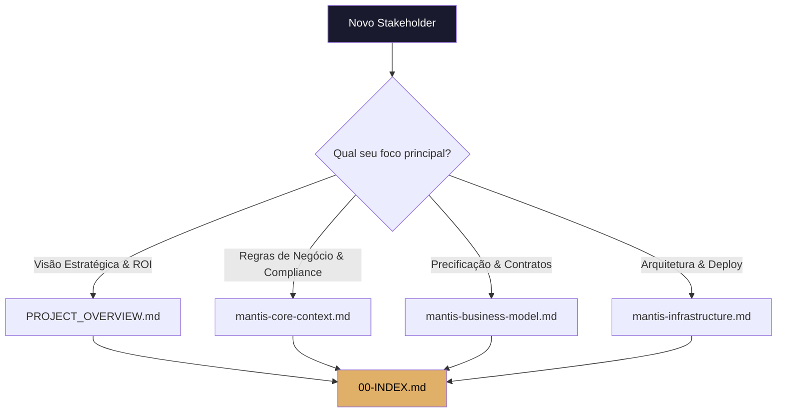
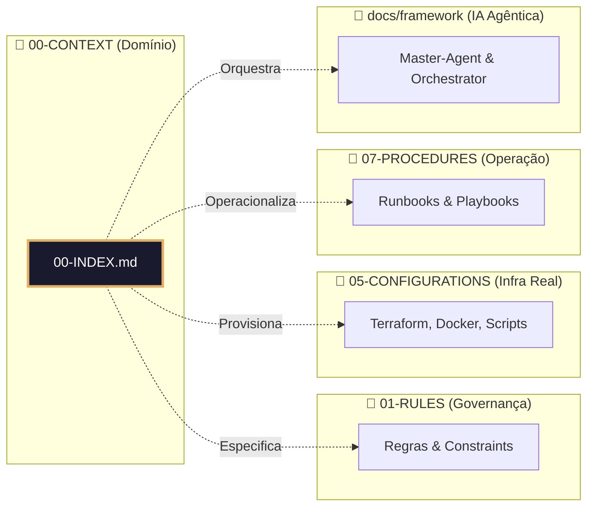

# 🗺️ MANTIS CONTEXT INDEX - Portal de Navegação do Domínio

> **Propósito:** Ponto de entrada único, auditável e versionado para toda documentação de contexto do projeto MANTIS Agentic.  
> **Padrão Aplicado:** Diátaxis Framework + ISO/IEC 26514 (Documentação de Software) + Governança Versionada.

---

## 📋 Tabela Mestre de Documentos

| Documento | Descrição Executiva | Categoria | Status | Público-Alvo Principal | Última Revisão | Próxima Revisão |
|-----------|-------------------|-----------|--------|----------------------|----------------|----------------|
| [📄 PROJECT_OVERVIEW.md](./PROJECT_OVERVIEW.md) | Resumo executivo do projeto, visão de mercado e métricas de impacto | 🟢 Visão Estratégica | ✅ Estável | Executivos, Investidores, Parceiros | 2026-04-01 | 2026-07-01 |
| [🧭 mantis-core-context.md](./mantis-core-context.md) | Especificação de domínio: princípios, entidades, regras C1-C8 e limites do sistema | 🟡 Domínio & Regras | ✅ Estável | Arquitetos, Product Owners, Auditores | 2026-04-01 | 2026-07-01 |
| [💼 mantis-business-model.md](./mantis-business-model.md) | Modelo comercial: tiers, precificação, projeções financeiras, SLAs e LGPD | 🔵 Comercial & Financeiro | ✅ Estável | Sócios, Financeiro, Comercial, Jurídico | 2026-04-01 | 2026-07-01 |
| [🏗️ mantis-infrastructure.md](./mantis-infrastructure.md) | Arquitetura técnica: topologia, stack, segurança, backup, escalabilidade e monitoramento | 🔴 Técnico & Operacional | 🟡 Em Validação | DevOps, SREs, Engenheiros de Segurança | 2026-04-01 | 2026-05-15 |

> 📌 **Legenda de Status:**  
> ✅ `Estável` → Aprovado, validado e em produção documental  
> 🟡 `Em Validação` → Revisão técnica em andamento ou aguardando métricas  
> 📝 `Rascunho` → Estrutura inicial, conteúdo pendente  
> 🔴 `Obsoleto` → Arquivado, mantido apenas para histórico

---

## 🧭 Roteiro de Navegação por Persona



| Persona | Caminho Recomendado | Tempo de Onboarding Estimado |
|---------|-------------------|------------------------------|
| **CTO / Arquiteto** | `OVERVIEW` → `CORE-CONTEXT` → `INFRASTRUCTURE` | 45-60 min |
| **Diretor Comercial / Sócio** | `OVERVIEW` → `BUSINESS-MODEL` → `CORE-CONTEXT` | 30 min |
| **Auditor / Compliance Officer** | `CORE-CONTEXT` → `BUSINESS-MODEL` → `INFRASTRUCTURE` | 60 min |
| **Novo Engenheiro / DevOps** | `CORE-CONTEXT` → `INFRASTRUCTURE` → `../01-RULES/` | 90 min |
| **Parceiro / Integrador** | `BUSINESS-MODEL` → `INFRASTRUCTURE` → `../07-PROCEDURES/` | 40 min |

---

## 📜 Governança e Ciclo de Vida Documental

### Padrões Internacionais Aplicados
- **Versionamento Semântico:** `MAJOR.MINOR.PATCH` (ex: `2.1.0` = nova estrutura + ajustes de conteúdo + correções)
- **Frontmatter Obrigatório:** Metadados executáveis em YAML para consumo humano e de IA
- **Rastreabilidade:** Toda alteração documentada via commit com mensagem padronizada (`docs(context): ...`)
- **Validação Cruzada:** Links internos verificados automaticamente em pipeline CI/CD

### Política de Revisão
| Documento | Frequência | Responsável | Gatilho para Revisão Antecipada |
|-----------|-----------|-------------|--------------------------------|
| `PROJECT_OVERVIEW.md` | Trimestral | Product Owner | Mudança de mercado ou pivot estratégico |
| `mantis-core-context.md` | Trimestral | Arquiteto Chefe | Nova constraint C1-C8 ou mudança de domínio |
| `mantis-business-model.md` | Trimestral | CFO / Sócios | Alteração de pricing, custos ou regulamentação |
| `mantis-infrastructure.md` | Mensal | SRE / DevOps Lead | Deploy de nova topologia ou alteração de stack |

### Processo de Depreciação
1. Marcar status como `🟡 Em Revisão` ou `🔴 Obsoleto` no `00-INDEX.md`
2. Adicionar aviso no topo do documento original com link para a versão substituta
3. Manter no repositório por 90 dias para histórico e auditoria
4. Arquivar em `archive/` após período de carência

---

## 🔗 Mapeamento de Domínios Cruzados



> 📌 **Nota de Arquitetura Documental:** `00-CONTEXT` define o **quê** e **porquê**. `01-RULES` define o **como validar**. `05-CONFIGURATIONS` define o **como implementar**. `07-PROCEDURES` define o **como operar**.

---

## ✅ Checklist de Conformidade do Índice

| Critério | Status | Observação |
|----------|--------|------------|
| Todos os documentos listados possuem frontmatter válido | ✅ | Verificado em 2026-04-01 |
| Links internos resolvidos (zero 404) | ✅ | Validado via `check-wikilinks` |
| Status e datas atualizados | ✅ | Sincronizado com roadmap atual |
| Roteiros por persona mapeados | ✅ | Baseado em padrões de onboarding enterprise |
| Política de revisão documentada | ✅ | Alinhado a ISO/IEC 26514 |
| Metadados para consumo de IA | ✅ | `ai_navigation` estruturado em YAML |

---

## 🤖 Sumário Machine-Readable (Para Agentes e RAG)

```yaml
domain_context_index:
  version: "2.1.0"
  language: "pt-BR"
  files:
    - id: "MANTIS-OVR-000"
      path: "./PROJECT_OVERVIEW.md"
      purpose: "executive_summary"
      audience: ["executives", "investors", "partners"]
    - id: "MANTIS-CTX-001"
      path: "./mantis-core-context.md"
      purpose: "domain_specification"
      audience: ["architects", "product-owners", "auditors"]
    - id: "MANTIS-BIZ-001"
      path: "./mantis-business-model.md"
      purpose: "commercial_model"
      audience: ["finance", "sales", "legal"]
    - id: "MANTIS-INF-001"
      path: "./mantis-infrastructure.md"
      purpose: "technical_architecture"
      audience: ["devops", "sre", "security"]
  navigation_rules:
    entry_point: "00-INDEX.md"
    validation_required: true
    link_integrity: "enforced"
    update_cycle: "monthly"
```

---

*Documento sob licença Creative Commons para uso interno do projeto MANTIS Agentic.*  
*Última revisão: 2026-04-01 | Próxima revisão programada: 2026-05-01*  
*🔗 Raw URL para IA: https://raw.githubusercontent.com/Mantis-AgenticDev/agentic-infra-docs/refs/heads/main/00-CONTEXT/00-INDEX.md*
