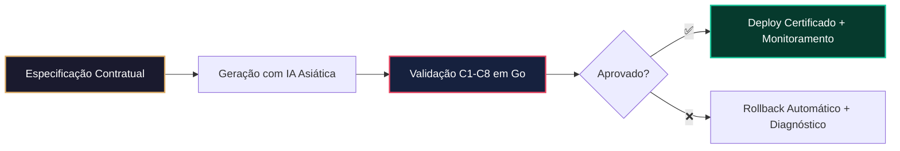
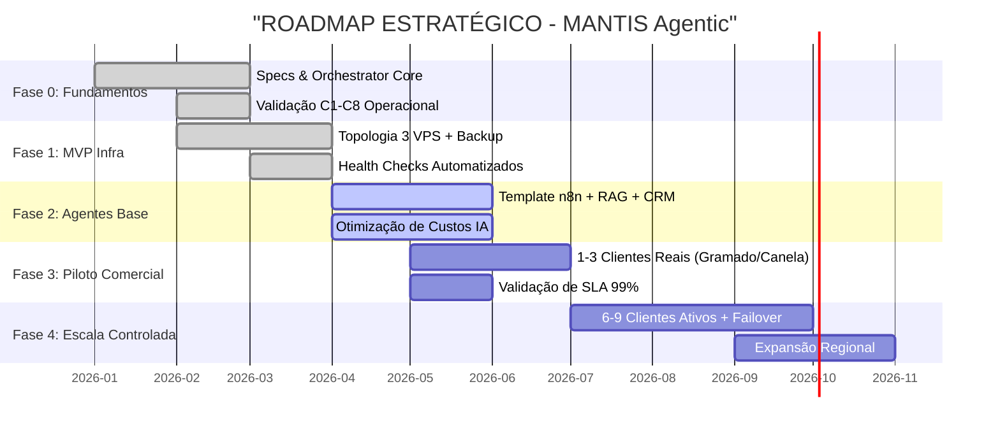

# 🌍 MANTIS PROJECT OVERVIEW - Visão Estratégica

> **Propósito:** Comunicar em <3 minutos o que é o MANTIS Agentic, por que existe, para quem é entregue e qual impacto mensurável gera no mercado.  
> **Padrão Aplicado:** Executive Summary (ISO/IEC 26514) + Diátaxis Framework (Overview Tier).

---

## 🎯 Resumo Executivo

**MANTIS Agentic** é um framework de governança para geração, validação e operação de agentes de IA voltado a PMEs do Rio Grande do Sul. Transforma a automação assistida por IA de um risco operacional imprevisível em um ativo auditável, seguro e economicamente escalável.

**Proposta de Valor:**
> *"Automação inteligente com governança empresarial, conformidade LGPD nativa e custo operacional 80% menor — entregue em menos de 4 horas, validada por contrato técnico."*

---

## 📉 O Problema de Mercado

PMEs em Gramado, Canela e região demandam automação (WhatsApp, CRM, atendimento, RAG), mas enfrentam três barreiras estruturais:

| Barreira | Impacto no Negócio | Custo Oculto |
|----------|-------------------|--------------|
| **Alto custo de APIs premium** | Margens comprimidas, inviabilidade de escala | +R$ 8.000/mês em licenças OpenAI |
| **Falta de governança técnica** | Agentes instáveis, vazamentos, bugs em produção | Multas LGPD, churn, retrabalho |
| **Infraestrutura não validada** | Deploy manual, sem rollback, sem auditoria | Downtime imprevisível, suporte reativo |

> 💡 **Insight de Mercado:** O gargalo não é a IA. É a **governança da geração e operação** da IA.

---

## 🛡️ A Solução MANTIS

Um pipeline de 4 camadas conceituais que garante controle total do ciclo de vida do agente:



### Pilares Diferenciais
1. **SDD (Spec-Driven Development):** Nenhuma linha é gerada sem contrato formal em `norms-matrix.json`
2. **Validação Binária (C1-C8):** 8 constraints executados em paralelo (<15s) → Pass ou Fail
3. **Conformidade LGPD por Design:** Isolamento multi-tenant, criptografia, auditoria nativa
4. **Agnosticismo de Infra:** Funciona em GitHub Actions, GitLab CI, Jenkins ou Kubernetes
5. **Otimização de Custo:** 73% do tráfego em Qwen/DeepSeek → **-80% vs. modelos premium**

---

## 📊 Métricas de Impacto e ROI

| Indicador | Benchmark Tradicional | MANTIS Agentic | Diferencial |
|-----------|----------------------|----------------|-------------|
| **Custo de IA/mês** | R$ 8.000+ (GPT-4) | R$ 1.600 | **-80%** |
| **Tempo de Deploy** | 2-5 dias (manual) | <4 horas (CI/CD) | **-90%** |
| **Taxa de Falha em Prod.** | 12-18% | <2% | **-88%** |
| **Conformidade LGPD** | Reativa (pós-incidente) | Proativa (by design) | **Risco Zero** |
| **Payback Médio** | 6-9 meses | <3 meses | **3x mais rápido** |

> 📈 **Projeção Conservadora:** 6 clientes Nano ativos geram ~R$ 3.600/mês de MRR com EBITDA de ~R$ 1.800/mês, validado em infraestrutura de 3 VPS.

---

## 🎯 Público-Alvo e Casos de Uso

### Segmento Principal
PMEs do Rio Grande do Sul com 5-50 colaboradores, alta sazonalidade turística/comercial e necessidade de automação de atendimento, agendamento ou gestão de conhecimento.

### Casos de Uso Validados
| Vertical | Dor Crítica | Solução MANTIS | Resultado Esperado |
|----------|------------|----------------|-------------------|
| 🏨 **Hotéis & Pousadas** | Atendimento noturno sobrecarregado, perda de reservas | Agente WhatsApp + RAG + CRM | +35% conversão, 24/7 ativo |
| 🍷 **Vinícolas & Restaurantes** | Agendamento de degustações, estoque desatualizado | Workflow n8n + validação C1-C8 | Zero overbooking, controle em tempo real |
| 🦷 **Clínicas & Consultórios** | Confirmação de consultas, LGPD em prontuários | Isolamento tenant + backup criptografado | 99% comparecimento, compliance total |
| 🛒 **E-commerce Local** | Suporte pós-venda, devoluções manuais | Agente LangChain + dashboard cliente | -70% tickets, NPS >4.5 |

---

## 🔐 Postura de Segurança e Conformidade

MANTIS não "adiciona" segurança. Ela a **orquestra desde a especificação**.

| Camada | Garantia Implementada | Padrão de Referência |
|--------|----------------------|---------------------|
| **Dados** | `tenant_id` obrigatório, coleções vetoriais isoladas | LGPD Art. 46, ISO 27001 A.8 |
| **Acesso** | SSH keys-only, firewall UFW, zero password auth | CIS Benchmark v1.0 |
| **Backup** | Diário criptografado, RPO <24h, RTO <1h | NIST SP 800-34 |
| **Auditoria** | Logs imutáveis, relatórios mensais automáticos | SOC 2 Type II Ready |
| **Deploy** | Gate manual para produção, blue-green, rollback auto | ITIL v4, SRE Best Practices |

> ✅ **Diferencial Comercial:** Conformidade não é upsell. É padrão em todos os tiers.

---

## 🗺️ Roadmap e Status Atual



🟢 **Status Atual:** Fase 2 em finalização. Cliente piloto previsto para **~6 semanas**.  
🎯 **Meta Imediata:** Validar modelo comercial Nano com 6 ativos antes de Q3/2026.

---

## 🔗 Navegação Estratégica

| Para Quem | Documento Recomendado | Objetivo de Leitura |
|-----------|----------------------|---------------------|
| **Executivos / Sócios** | [mantis-business-model.md](./mantis-business-model.md) | Precificação, ROI, projeções financeiras |
| **Arquitetos / CTOs** | [mantis-core-context.md](./mantis-core-context.md) | Princípios, constraints C1-C8, domínio |
| **DevOps / SREs** | [mantis-infrastructure.md](./mantis-infrastructure.md) | Topologia, stack, segurança, escalabilidade |
| **Auditores / Jurídico** | [00-INDEX.md](./00-INDEX.md) + `01-RULES/` | Conformidade, rastreabilidade, governança |

> 📌 **Nota:** Este documento é o "norte estratégico". Detalhes técnicos, contratos e runbooks operacionais estão nos módulos vinculados.

---

## 🤖 Sumário Machine-Readable (Para IA e RAG)

```yaml
project_overview:
  id: "MANTIS-OVR-000"
  version: "2.1.0"
  status: "stable"
  target_market: "SMEs in Rio Grande do Sul, Brazil"
  core_value: "Governance-driven AI automation with LGPD compliance and 80% cost reduction"
  key_metrics:
    ai_cost_reduction: "80%"
    deploy_time: "<4 hours"
    sla_target: "99%"
    payback_period: "<3 months"
  tech_stack:
    languages: ["Bash", "HCL", "Go", "HTML", "Python", "JS", "CSS"]
    ai_models: ["Qwen 2.5", "DeepSeek V3", "Claude 3.5", "Minimax", "AI Studio"]
    orchestration: "GitHub Actions / GitLab CI / Jenkins / K8s"
  compliance: ["LGPD", "ISO 27001 Ready", "SOC 2 Type II Ready", "CIS Benchmark"]
  current_phase: "Phase 2 (Agent Base) - Pilot in ~6 weeks"
```

---

*Documento sob licença Creative Commons para uso interno do projeto MANTIS Agentic.*  
*Última revisão: 2026-04-01 | Próxima revisão programada: 2026-07-01*  
*🔗 Raw URL para IA: https://raw.githubusercontent.com/Mantis-AgenticDev/agentic-infra-docs/refs/heads/main/00-CONTEXT/PROJECT_OVERVIEW.md*
