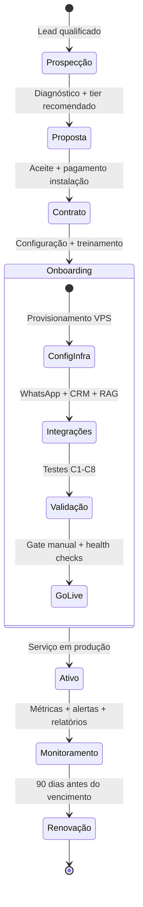
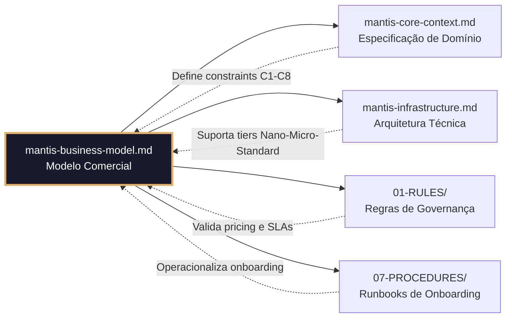

# 💼 MANTIS BUSINESS MODEL - Modelo de Negócio Conceitual

> **Propósito:** Documentar a estrutura de preços, custos e projeções financeiras do MANTIS Agentic para tomada de decisão estratégica.  
> **Princípio:** "Estabilidade financeira permite inovação técnica. Crescimento controlado protege qualidade."

---

## 🎯 Proposta de Valor Comercial

**Para PMEs do Rio Grande do Sul:**
> *"Automação inteligente com governança empresarial, sem complexidade técnica e com conformidade LGPD nativa — por um custo previsível e acessível."*

**Para Parceiros e Integradores:**
> *"Infraestrutura validada e orquestração agêntica pronta para revenda, com margem protegida e suporte técnico especializado."*

**Diferenciais Comerciais:**
- ✅ **Preço Fixo em BRL**: Sem surpresas com câmbio ou consumo de API
- ✅ **Contrato de 12 Meses**: Estabilidade para planejamento de ambas as partes
- ✅ **LGPD Incluído**: Conformidade nativa, sem custos adicionais de consultoria
- ✅ **Escalabilidade Controlada**: Cresça apenas quando seus KPIs validarem

---

## 📦 Perfis de Serviço e Precificação

### Tiers de Infraestrutura por Perfil de Cliente

| Perfil | Capacidade | Casos de Uso Típicos | Instalação (único) | Mensalidade (12x) |
|--------|-----------|---------------------|-------------------|-------------------|
| **🟢 Nano** | 1-3 clientes por VPS Edge | Restaurantes, Instagram, KB leve, WhatsApp básico | **R$ 4.000** | **R$ 600/mês** |
| **🔵 Micro** | 4-6 clientes com cache dedicado | Hotéis, clínicas, e-commerce local, CRM integrado | **R$ 6.000** | **R$ 800/mês** |
| **🟡 Standard** | 7-12 clientes com balanceamento | Corporate, multi-serviços, RAG complexo, SLA 99% | **R$ 8.500** | **R$ 1.100/mês** |
| **🔴 Large** | 13+ clientes ou requisitos customizados | Enterprise, multi-região, integrações legadas | **Sob análise** | **Sob análise** |

> 💡 **Nota:** Valores em Reais (BRL), contrato mínimo de 12 meses, pagamento mensal antecipado.

### O Que Está Incluído em Cada Tier

| Recurso | Nano | Micro | Standard | Large* |
|---------|------|-------|----------|--------|
| **VPS Dedicados** | Compartilhado (Edge) | Compartilhado + cache | Isolamento lógico | Dedicado físico |
| **WhatsApp por Cliente** | 1 número | 2 números | 3 números | Ilimitado |
| **Consultas RAG/mês** | 500 | 2.000 | 10.000 | Sob demanda |
| **CRM (Espo)** | Logs básicos | Gestão completa | Personalização leve | Customização total |
| **Backup** | Semanal | Diário + validação | Diário + multi-local | Real-time + DR |
| **Suporte** | Email 48h | Telegram 4h | Telegram 1h | Dedicado 24/7 |
| **Dashboard Cliente** | Básico HTML | Interativo + métricas | Executivo + export | White-label |
| **Conformidade LGPD** | ✅ Nativo | ✅ Nativo + relatório | ✅ Nativo + auditoria | ✅ Nativo + consultoria |

*Large requer análise técnica prévia e contrato customizado.

---

## 🏗️ Infraestrutura Mínima de Partida (Cenário Base)

### Topologia Inicial: 6 Clientes Nano

```mermaid
graph LR
    subgraph "🌐 Clientes (6x Nano)"
        C1[Cliente 1-3] --> E1[VPS Edge 1]
        C2[Cliente 4-6] --> E2[VPS Edge 2]
    end
    
    subgraph "🏗️ Infraestrutura MANTIS"
        E1["VPS Edge 1<br/>Agentes + Redis<br/>3 clientes"]
        E2["VPS Edge 2<br/>Failover + Balanceamento<br/>3 clientes"]
        CORE["VPS Core<br/>Dados + CRM + Vetores<br/>6 clientes"]
        
        E1 <-->|Túnel Seguro| CORE
        E2 <-->|Túnel Seguro| CORE
    end
    
    style CORE fill:#1a1a2e,stroke:#E0AF68,stroke-width:3px
```

### Especificações Técnicas da Topologia Inicial

| Componente | Quantidade | Função | Custo Mensal Estimado |
|------------|-----------|--------|----------------------|
| **VPS Edge** | 2 unidades | Execução de agentes n8n + gateway WhatsApp + cache Redis | R$ 134/unidade |
| **VPS Core** | 1 unidade | Banco de dados MySQL + CRM Espo + vetores Qdrant (RAG) | R$ 134/unidade |
| **Serviços Complementares** | - | uazapi, Deepgram, OpenRouter, WhatsApp Business, MEI | R$ 730/mês |
| **TOTAL INFRAESTRUTURA** | **3 VPS + serviços** | **Suporte a 6 clientes Nano** | **~R$ 930/mês** |

> 💡 **Custo por cliente (cenário base):** ~R$ 155/mês de infra para receita de R$ 600/mês = margem bruta de ~74%.

---

## 💰 Projeções Financeiras - Cenário Base (6 Clientes Nano)

### Receita Recorrente Mensal (MRR)

| Fonte | Cálculo | Valor Mensal |
|-------|---------|--------------|
| **Assinaturas Nano** | 6 clientes × R$ 600 | **R$ 3.600** |
| **Receita Total** | | **R$ 3.600** |

### Estrutura de Custos Mensais

| Categoria | Item | Valor Mensal | Observações |
|-----------|------|--------------|-------------|
| **Infraestrutura Fixa** | 3 VPS Hostinger KVM1 | R$ 402 | Contrato 12 meses, São Paulo |
| **Serviços de IA** | OpenRouter (Qwen/DeepSeek) | R$ 200 | Estimativa conservadora |
| **Comunicação** | uazapi + WhatsApp Business | R$ 270 | 100 celulares + 2 contas WA |
| **Processamento** | Deepgram (transcrição) | R$ 200 | Estimativa para 6 clientes |
| **Legal/Contábil** | MEI + impostos | R$ 60 | Regime simplificado |
| **Reserva Técnica** | Manutenção + imprevistos | R$ 100 | Fundo de contingência |
| **TOTAL CUSTOS FIXOS** | | **~R$ 1.232** | |

### Resultado Operacional Mensal (Cenário Base)

| Indicador | Cálculo | Valor |
|-----------|---------|-------|
| **Receita Bruta** | 6 × R$ 600 | R$ 3.600 |
| **(-) Custos Fixos** | Infra + serviços + legal | - R$ 1.232 |
| **(-) Custos Variáveis*** | Estimativa 15% da receita | - R$ 540 |
| **(=) EBITDA Mensal** | | **R$ 1.828** |
| **(-) Fundo Emergência (10%)** | Para resiliência operacional | - R$ 183 |
| **(=) Distribuição Disponível** | Para reinvestimento ou sócios | **R$ 1.645** |

> *Custos variáveis incluem: consumo extra de API, suporte adicional, upgrades pontuais.

### Receita de Instalação (One-Time)

| Item | Cálculo | Valor Total |
|------|---------|-------------|
| **Instalação Nano** | 6 clientes × R$ 4.000 | **R$ 24.000** |
| **Destinação Sugerida** | 50% reinvestimento em infra, 30% fundo emergência, 20% operacional | - |

> 💡 **Payback da Infraestrutura Inicial:** < 2 meses com 6 clientes Nano ativos.

---

## 📈 Cenários de Crescimento Controlado

### Matriz de Projeção por Mix de Clientes

| Cenário | Mix de Clientes | MRR Estimado | EBITDA Mensal | Infra Necessária |
|---------|----------------|--------------|---------------|-----------------|
| **Validação** | 6 Nano | R$ 3.600 | R$ 1.828 | 3 VPS KVM1 (atual) |
| **Crescimento** | 4 Nano + 2 Micro | R$ 4.000 | R$ 2.240 | 3 VPS KVM1 + otimização |
| **Consolidação** | 2 Nano + 4 Micro | R$ 4.400 | R$ 2.580 | 3 VPS KVM1 + cache dedicado |
| **Expansão*** | 6 Micro ou 4 Standard | R$ 4.800+ | R$ 2.900+ | Avaliação para KVM2 |

*Expansão requer validação de KPIs por 30 dias consecutivos antes de upgrade.

### Regras de Escalabilidade Financeira

```mermaid
graph TD
    A[6 Clientes Nano Ativos] --> B{EBITDA > R$ 1.500<br/>por 3 meses?}
    B -->|Sim| C[Aceitar clientes Micro]
    B -->|Não| D[Otimizar custos antes de crescer]
    C --> E{MRR > R$ 4.500<br/>por 2 meses?}
    E -->|Sim| F[Avaliar upgrade para KVM2]
    E -->|Não| C
    F --> G{Receita líquida > R$ 3.000<br/>por 60 dias?}
    G -->|Sim| H[Expansão controlada]
    G -->|Não| F
    
    style A fill:#16213e,stroke:#16c79a
    style C fill:#16213e,stroke:#E0AF68
    style H fill:#16213e,stroke:#e94560,stroke-width:3px
```

> 🎯 **Princípio:** "Crescer só quando os números validarem. Estabilidade financeira permite inovação técnica."

---

## 🤝 Acordos de Nível de Serviço (SLA) por Tier

| Métrica | Nano | Micro | Standard | Large* |
|---------|------|-------|----------|--------|
| **Disponibilidade** | 99% mensal | 99,5% mensal | 99,9% mensal | 99,95% |
| **Tempo de Resposta (p95)** | <5 segundos | <3 segundos | <2 segundos | <1 segundo |
| **Backup Recovery (RTO)** | <4 horas | <2 horas | <1 hora | <30 minutos |
| **Suporte Crítico** | Email 48h | Telegram 4h | Telegram 1h | Dedicado 24/7 |
| **Relatório de Conformidade** | Trimestral | Mensal | Mensal + auditoria | Semanal + consultoria |
| **Atualizações de Sistema** | Mensal (agendadas) | Quinzenal (agendadas) | Semanal (janela definida) | Contínuo (blue-green) |

*Large sob contrato customizado.

---

## 🔐 Conformidade LGPD - Integrada ao Modelo Comercial

### Garantias por Design (Inclusas em Todos os Tiers)

```mermaid
graph LR
    A[Dados do Cliente] --> B[Criptografia em Trânsito]
    A --> C[RLS no PostgreSQL]
    A --> D[Coleções Isoladas no Qdrant]
    B --> E[Auditoria Automática]
    C --> E
    D --> E
    E --> F[Relatórios para Cliente]
    
    style E fill:#063a2d,stroke:#16c79a,stroke-width:2px
```

| Direito LGPD | Implementação Conceitual | Disponibilidade por Tier |
|--------------|-------------------------|-------------------------|
| **Acesso aos Dados** | Exportação sob solicitação via dashboard | Todos os tiers |
| **Correção de Dados** | Interface administrativa com log de alterações | Micro+ |
| **Exclusão (Right to be Forgotten)** | Procedimento documentado com confirmação em 72h | Todos os tiers |
| **Portabilidade** | Exportação em formato estruturado (JSON/CSV) | Standard+ |
| **Relatório de Conformidade** | Documento mensal com evidências de controle | Micro+ |

> ✅ **Diferencial Comercial:** Conformidade LGPD não é upsell — é padrão em todos os planos.

---

## ⚠️ Gestão de Riscos Comerciais

### Matriz de Riscos e Mitigações

| Risco | Impacto Potencial | Probabilidade | Mitigação Conceitual |
|-------|------------------|---------------|---------------------|
| **Inadimplência** | Quebra de fluxo de caixa | Média | Cobrança antecipada + fundo emergência 10% |
| **Churn de Clientes** | Redução de MRR | Baixa-Média | SLA claro + suporte proativo + valor percebido |
| **Aumento de Custos de IA** | Margem comprimida | Média | Estratégia multi-modelo + 73% em IA asiáticas |
| **Mudança Regulatória LGPD** | Custos de adaptação | Baixa | Arquitetura compliance-by-design + monitoramento jurídico |
| **Concorrência Predatória** | Pressão sobre preços | Média | Diferenciação por governança, não por preço |
| **Falha de Infraestrutura** | Interrupção de serviço | Baixa | Backup criptografado + failover entre VPS Edge |

### Fundo de Emergência Operacional

- **Alocação:** 10% do EBITDA mensal
- **Objetivo:** Cobrir imprevistos sem comprometer operações
- **Meta de Acumulação:** R$ 5.000 em 12 meses
- **Uso Autorizado:** Upgrade emergencial de infra, multas evitáveis, retenção de talentos

---

## 🔄 Ciclo de Relacionamento com o Cliente

**Tempos de Referência:**
| Fase | Duração Esperada | Responsável |
|------|-----------------|-------------|
| Proposta → Contrato | 3-7 dias | Comercial |
| Contrato → Onboarding | 1-2 dias | Financeiro |
| Onboarding → Ativo | 3-5 dias | Técnico |
| Monitoramento Contínuo | Tempo real | Operações |

---

## 🔗 Conexões com Outros Domínios do Projeto

> 📌 **Nota de Navegação:** Este documento é a "fonte da verdade" comercial. Todas as decisões de pricing, contratos e expansão devem ser rastreáveis até os princípios definidos aqui.

---

*Documento sob licença Creative Commons para uso interno do projeto MANTIS Agentic.*  
*Última revisão: 2026-04-01 | Próxima revisão programada: 2026-07-01*  
*🔗 Raw URL para IA: https://raw.githubusercontent.com/Mantis-AgenticDev/agentic-infra-docs/refs/heads/main/00-CONTEXT/mantis-business-model.md*
