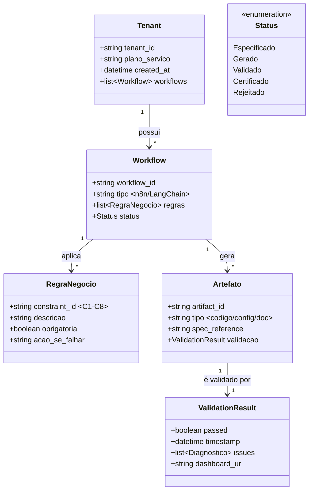
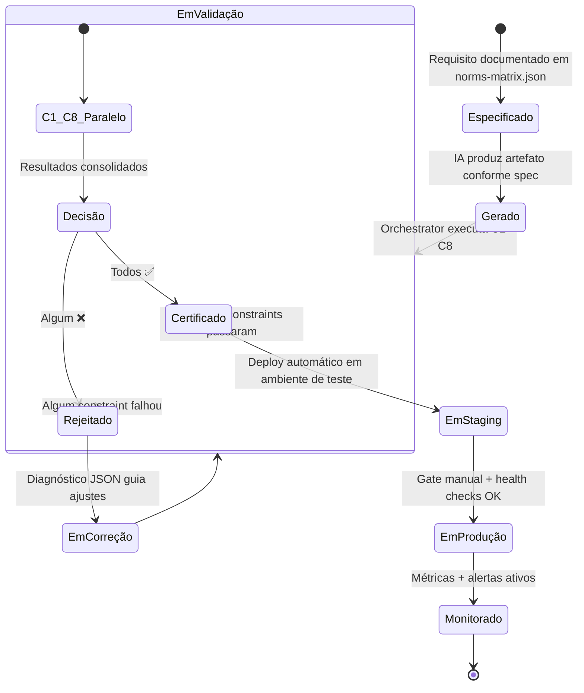
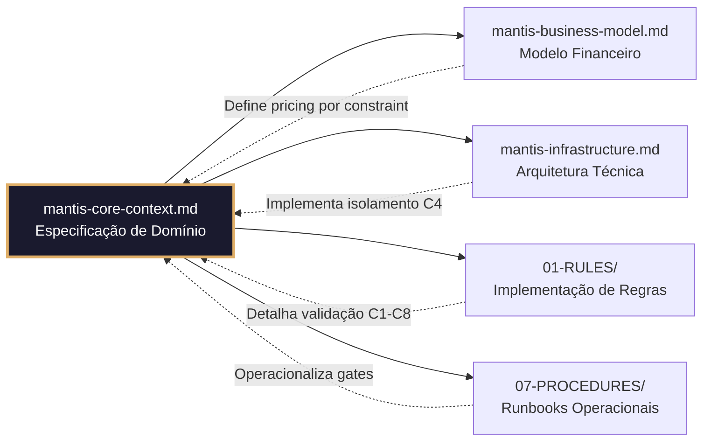

# 🧭 MANTIS CORE CONTEXT - Especificação de Domínio

> **Propósito Central:** Definir o "quê" e "porquê" do sistema MANTIS Agentic, independente do "como" técnico.  
> **Princípio Fundamental:** "Especificação contratual precede geração. Validação automatizada precede deploy. Conformidade nativa precede escala."

---

## 🎯 Propósito e Valor de Domínio

**MANTIS Agentic** é um framework de governança para geração e operação de agentes de IA que transforma desenvolvimento assistido por IA de risco operacional em ativo auditável.

**Problema de Domínio que Resolve:**
> *"Como garantir que agentes de IA gerados massivamente para PMEs atendam requisitos de segurança, conformidade LGPD, escalabilidade e manutenibilidade — sem depender de revisão humana manual em cada artefato?"*

**Proposta de Valor Conceitual:**
- ✅ **Especificação Primeiro (SDD)**: Nenhum código é gerado sem contrato formal em `norms-matrix.json`
- ✅ **Validação Automatizada (TDD em Escala)**: 8 constraints executados em paralelo antes de qualquer deploy
- ✅ **Conformidade por Design**: LGPD, isolamento multi-tenant e auditoria são requisitos não negociáveis
- ✅ **Agnosticismo de Plataforma**: Mesma lógica de governança funciona em GitHub Actions, GitLab CI, Jenkins ou Kubernetes

---

## 🧱 Princípios de Design Não Negociáveis

### 1. Contrato Antes de Código (SDD)

```mermaid
graph LR
    A[Requisito de Negócio] --> B[norms-matrix.json]
    B --> C[Validação C1-C8]
    C --> D[Geração de Código]
    D --> E[Deploy Certificado]
    
    style B fill:#1a1a2e,stroke:#E0AF68,stroke-width:2px
    style C fill:#16213e,stroke:#e94560,stroke-width:2px
```

- A especificação formal é a fonte de verdade única
- Mudanças em produção exigem atualização prévia da spec
- Geração de código é um processo derivado, não criativo

### 2. Validação Binária e Automatizada
- Resultados de validação são binários: ✅ Pass ou ❌ Fail
- Nenhum julgamento humano subjetivo na validação técnica
- Diagnósticos de falha são estruturados (JSON) para correção guiada

### 3. Isolamento como Requisito de Domínio
- Multi-tenancy não é feature, é premissa arquitetural
- Dados de clientes distintos nunca compartilham contexto de execução
- `tenant_id` é metadado obrigatório, não opcional

### 4. Transparência Auditável
- Todo artefato em produção possui rastreabilidade até sua spec original
- Logs de decisão de validação são imutáveis e consultáveis
- Dashboards de conformidade são gerados automaticamente para stakeholders

### 5. Escalabilidade Controlada
- Crescimento de capacidade exige validação prévia de KPIs operacionais
- Nenhum componente escala além de seus limites validados sem gate manual
- "Melhor estável e limitado que instável e ilimitado"

---

## 🏗️ Entidades de Domínio e Relacionamentos

**Glossário de Entidades:**
| Entidade | Definição de Domínio | Exemplo Prático |
|----------|---------------------|-----------------|
| **Tenant** | Cliente lógico isolado no sistema | Hotel em Gramado com automação WhatsApp |
| **Workflow** | Sequência executável de ações de negócio | "Reserva de mesa → Confirmação → Lembrete" |
| **RegraNegocio** | Constraint validável que protege o domínio | "C3: Nenhuma query SQL sem prepared statement" |
| **Artefato** | Unidade gerada e validada pelo framework | Script n8n, config Docker, doc HTML |
| **ValidationResult** | Prova auditável de conformidade | JSON + dashboard para auditor LGPD |

---

## ⚖️ Regras de Negócio Críticas (C1-C8) - Visão de Domínio

> 📌 **Nota:** Implementação técnica detalhada está em `01-RULES/`. Este documento define o "porquê" de cada regra.

| Constraint | Domínio Protegido | Impacto de Negócio se Violado |
|-----------|------------------|------------------------------|
| **C1: Resource Limits** | Estabilidade operacional | Degradação em cascata, SLA quebrado |
| **C2: Secrets Audit** | Confidencialidade de dados | Vazamento de credenciais, multa LGPD |
| **C3: Security Rules** | Integridade do sistema | Injeção SQL, acesso não autorizado |
| **C4: Multi-Tenancy** | Isolamento entre clientes | Vazamento de dados entre tenants |
| **C5: Documentation** | Manutenibilidade e auditoria | Impossibilidade de troubleshooting |
| **C6: Testing** | Confiabilidade funcional | Bugs em produção, perda de confiança |
| **C7: Performance** | Experiência do usuário final | Latência inaceitável, churn de clientes |
| **C8: Compliance** | Conformidade regulatória | Multas, processos, dano reputacional |

**Princípio de Aplicação:**
- Todas as regras são **preventivas**, não corretivas
- Falha em qualquer constraint = bloqueio automático do deploy
- Exceções exigem aprovação formal com justificativa documentada

---

## 🚧 Limites do Sistema (Scope)

### ✅ In Scope (O que MANTIS faz)

| Capacidade | Descrição Conceitual | Benefício para o Cliente |
|------------|---------------------|-------------------------|
| **Geração Governada** | Produz artefatos de IA que passam validação C1-C8 antes de existir | Zero "código que funciona por sorte" |
| **Validação Automatizada** | Executa 8 constraints em paralelo com diagnóstico estruturado | Decisões técnicas baseadas em dados, não em opinião |
| **Deploy Certificado** | Libera para produção apenas artefatos com selo de conformidade | Confiança para escalar sem medo |
| **Auditoria Nativa** | Gera relatórios de conformidade LGPD automaticamente | Transparência para clientes e reguladores |
| **Orquestração Agnóstica** | Aplica mesma governança em GitHub, GitLab, Jenkins ou K8s | Liberdade de escolher ferramentas sem perder controle |

### ❌ Out of Scope (O que MANTIS NÃO faz)

| Limitação | Justificativa de Domínio | Alternativa Recomendada |
|-----------|-------------------------|------------------------|
| **Geração de Código Criativo** | MANTIS valida estrutura, não inventa lógica de negócio | Usar IA generativa tradicional para prototipagem |
| **Substituição de Revisão Humana** | Validação técnica ≠ julgamento de valor de negócio | Manter gate manual para decisões estratégicas |
| **Gestão de Dados do Cliente** | MANTIS protege o pipeline, não o conteúdo | Cliente é responsável pela qualidade e legalidade dos dados |
| **Suporte Técnico Nível 1** | Framework de infraestrutura, não helpdesk | Documentar procedures em `07-PROCEDURES/` para equipe de suporte |
| **Desenvolvimento de Features de Negócio** | MANTIS é horizontal, não verticalizado | Desenvolver regras de negócio específicas em workflows por cliente |

> 🎯 **Princípio de Escopo:** "MANTIS é o guarda-chuva de governança, não o guarda-chuva de tudo."

---

## 🔄 Ciclo de Vida de um Artefato MANTIS

**Tempos de Referência (Conceitual):**
| Fase | Duração Esperada | Variável Dependente De |
|------|-----------------|------------------------|
| Especificação → Geração | 2-5 minutos | Complexidade do artefato |
| Validação C1-C8 | <15 segundos | Paralelismo do Orchestrator |
| Staging → Produção | 4-8 horas | Gate manual + testes de fumaça |
| Monitoramento Contínuo | Tempo real | Configuração de alertas |

---

## 📚 Glossário de Termos de Domínio

| Termo | Definição Conceitual | Contexto de Uso |
|-------|---------------------|-----------------|
| **Constraint C1-C8** | Regra validável que protege um aspecto crítico do domínio | "O artefato falhou no C4: tenant_id ausente" |
| **Tenant** | Cliente lógico isolado, unidade de cobrança e conformidade | "Cada tenant tem coleção Qdrant dedicada" |
| **Artefato Certificado** | Código/config/doc que passou validação C1-C8 e recebeu selo de conformidade | "Só artefatos certificados entram em produção" |
| **Gate Manual** | Aprovação humana obrigatória antes de deploy em produção | "Produção exige gate manual, staging é automático" |
| **Diagnóstico JSON** | Estrutura de dados que descreve falhas de validação para correção guiada | "O diagnóstico apontou 3 issues no C3" |
| **Dashboard de Conformidade** | Relatório HTML gerado automaticamente para auditoria humana | "Cliente Enterprise recebe dashboard mensal" |
| **Harness Hardening** | Prática de endurecer infraestrutura desde a especificação | "RLS é harness hardening para C4" |
| **SDD (Spec-Driven Development)** | Paradigma onde a especificação formal precede e direciona a geração | "MANTIS é SDD-first, não code-first" |
| **RAG Query** | Consulta vetorial ao conhecimento do cliente, isolada por tenant | "Cada RAG query inclui tenant_id no filtro" |
| **Workflow Node** | Unidade executável dentro de um fluxo de automação (n8n/LangChain) | "Cada node é validado como artefato independente" |

---

## 🔗 Conexões com Outros Domínios do Projeto

> 📌 **Nota de Navegação:** Este documento é a "bússola conceitual" do projeto. Todas as decisões técnicas, de negócio ou operacionais devem ser rastreáveis até um princípio definido aqui.

---

## 📊 Métricas de Sucesso do Domínio

| Métrica de Domínio | Como Medimos | Meta Conceitual |
|-------------------|--------------|-----------------|
| **Taxa de Certificação** | % de artefatos que passam C1-C8 na primeira validação | >90% |
| **Tempo de Diagnóstico** | Tempo médio para correção guiada por diagnóstico JSON | <30 minutos |
| **Isolamento de Tenant** | Zero incidentes de vazamento entre clientes | 100% |
| **Conformidade LGPD** | Zero multas ou notificações de autoridade | 100% |
| **Satisfação do Stakeholder** | Pesquisa pós-onboarding com clientes e auditores | >4.5/5 |

---

*Documento sob licença Creative Commons para uso interno do projeto MANTIS Agentic.*  
*Última revisão: 2026-04-01 | Próxima revisão programada: 2026-07-01*  
*🔗 Raw URL para IA: https://raw.githubusercontent.com/Mantis-AgenticDev/agentic-infra-docs/refs/heads/main/00-CONTEXT/mantis-core-context.md*
