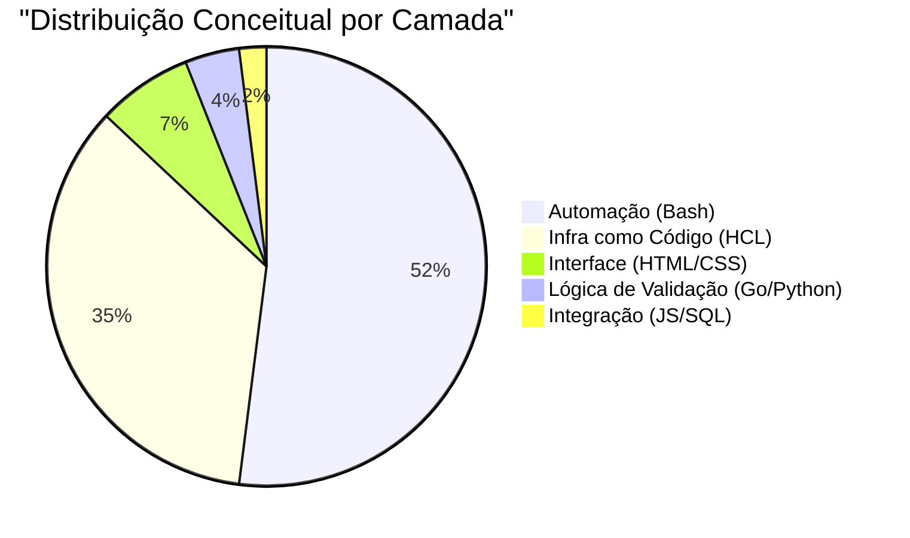
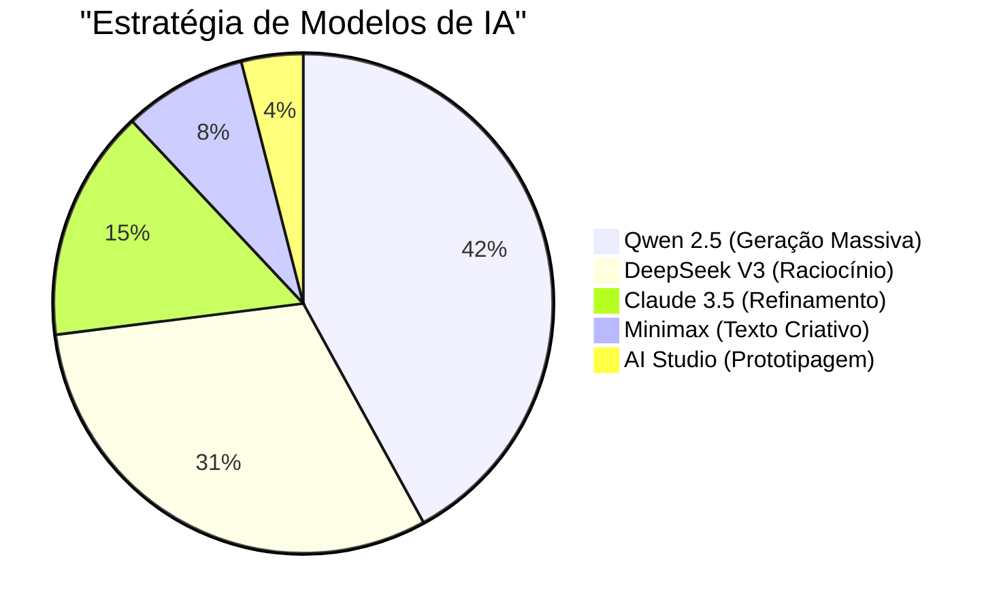
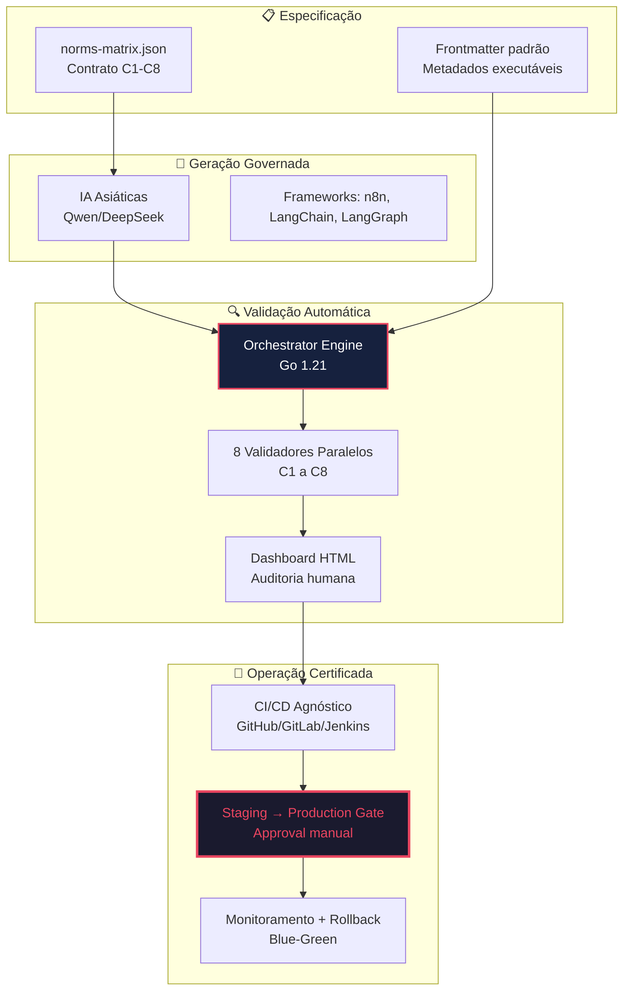
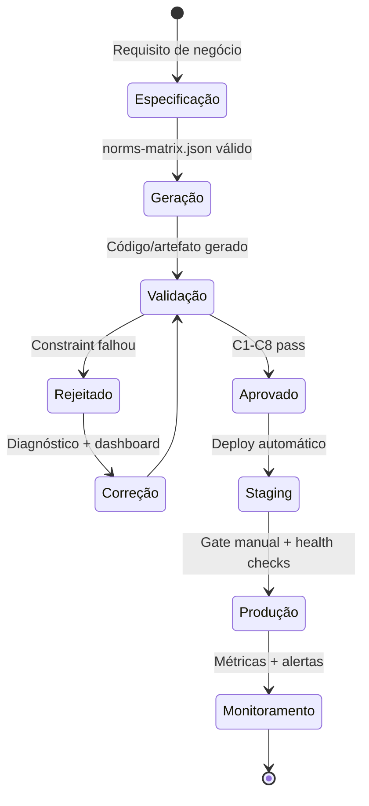
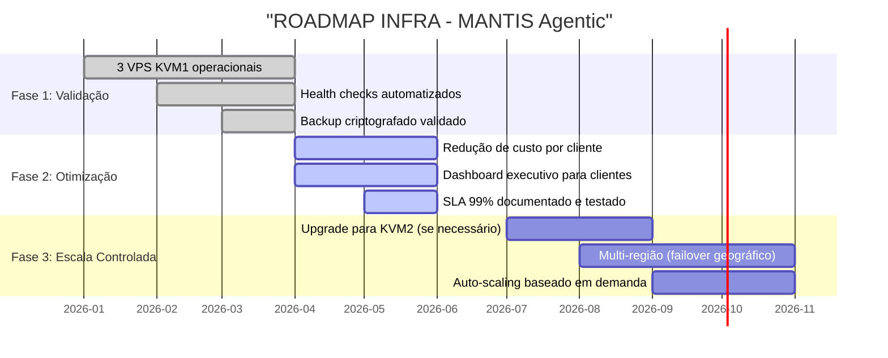
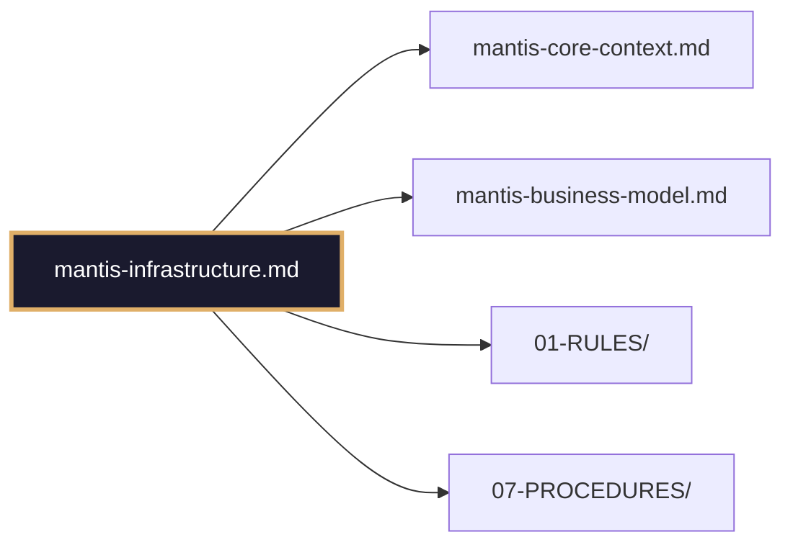

# 🏗️ MANTIS INFRASTRUCTURE - Arquitetura de Produção Conceitual

> **Propósito:** Documentar a arquitetura física e lógica do MANTIS Agentic para consumo humano estratégico.  
> **Princípio:** "Estabilidade vende mais que velocidade. Fundamentos sólidos, tanto no campo quanto na nuvem."

---

## 🎯 Visão Geral da Infraestrutura

**Objetivo operacional:** Operar 6-8 clientes de automação WhatsApp + RAG + CRM com:
- ✅ Custo mensal total < R$ 1.330
- ✅ Conformidade LGPD nativa por design
- ✅ Rollback automático em falhas críticas
- ✅ Escalabilidade controlada e validada

```mermaid
graph LR
    subgraph "🌐 Internet"
        W[WhatsApp Business API]
        U[Usuário Final]
    end
    
    subgraph "🏗️ Infraestrutura MANTIS - São Paulo"
        VPS1["VPS Edge 1<br/>Orquestração + Redis<br/>3 clientes"]
        VPS2["VPS Core<br/>Dados + CRM + Vetores<br/>6 clientes"]
        VPS3["VPS Edge 2<br/>Failover + Balanceamento<br/>3 clientes"]
        
        VPS1 <-->|Túnel Seguro| VPS2
        VPS3 <-->|Túnel Seguro| VPS2
    end
    
    subgraph "🔐 Camada de Segurança"
        FW[Firewall por Aplicação]
        ENC[Criptografia em Repouso]
        AUD[Auditoria Contínua]
    end
    
    W --> VPS1
    W --> VPS3
    U --> VPS1
    VPS1 --> VPS2
    VPS3 --> VPS2
    VPS2 --> FW --> ENC --> AUD
    
    style VPS2 fill:#1a1a2e,stroke:#E0AF68,stroke-width:3px
    style FW fill:#063a2d,stroke:#16c79a,stroke-width:2px
```

---

## 🖥️ Infraestrutura Mínima Atual (Fase de Validação)

### Topologia de 3 VPS (Hostinger KVM1 - São Paulo)

| Componente | Função Estratégica | Capacidade | Isolamento |
|------------|-------------------|------------|------------|
| **VPS Edge 1** | Orquestração de workflows n8n + Gateway WhatsApp (uazapi) + Cache Redis | 3 clientes Full | Rede Docker interna |
| **VPS Core** | Banco de dados MySQL + CRM Espo + Vetores Qdrant (RAG) | 6 clientes centralizados | Rede isolada + RLS obrigatório |
| **VPS Edge 2** | Failover de orquestração + Balanceamento de carga leve | 3 clientes em standby | Rede Docker interna + health checks |

**Especificações por VPS:**
- 🖥️ 1 vCPU dedicado
- 💾 4 GB RAM com limites por contêiner
- 💿 50 GB NVMe com criptografia em repouso
- 🌐 4 TB/mês de banda com monitoramento de pico
- 📍 Localização: São Paulo, Brasil (baixa latência para RS)

> 💡 **Custo total:** ~R$ 200/mês (contrato de 24 meses com provedor)

---

## 🚀 Infraestrutura Ampliada Proposta (Fase de Escala)

### Estratégia de Crescimento Controlado

```mermaid
graph TD
    A[Fase 1: Validação<br/>6 clientes, 3 VPS] --> B{KPIs atingidos?<br/>30 dias estáveis}
    B -->|Sim| C[Fase 2: Crescimento<br/>8 clientes, otimização]
    B -->|Não| D[Otimizar antes de escalar]
    C --> E{Receita > R$ 3k/mês<br/>por 60 dias?}
    E -->|Sim| F[Fase 3: Expansão<br/>Upgrade KVM2 ou Multi-região]
    E -->|Não| C
    
    style A fill:#16213e,stroke:#16c79a
    style C fill:#16213e,stroke:#E0AF68
    style F fill:#16213e,stroke:#e94560,stroke-width:3px
```

### Perfis de Infraestrutura por Vertical

| Perfil | Clientes Máx. | Recursos por VPS | Casos de Uso Típicos |
|--------|--------------|-----------------|---------------------|
| **Nano** | 1-3 | 1 vCPU, 4 GB RAM, 50 GB | Restaurantes, Instagram, KB leve |
| **Micro** | 4-6 | 1 vCPU, 4 GB RAM, 50 GB + cache | Hotéis, Odontologia, CRM básico |
| **Standard** | 7-12 | 2 vCPU, 8 GB RAM, 100 GB | Corporate, Multi-tenant complexo |
| **Enterprise** | 13+ | Arquitetura dedicada | Sob consulta (fora do escopo atual) |

> 🎯 **Princípio:** Nunca escalar além do perfil sem validação de KPIs por 30 dias consecutivos.

---

## 💻 Stack Tecnológico Conceitual

### 7 Linguagens, 1 Propósito: Automação Governada

| Camada | Tecnologias | Função Estratégica |
|--------|------------|-------------------|
| **Automação** | Bash, Shell scripts | Orquestração de deploy, health checks, backups |
| **Infraestrutura** | Terraform/HCL, Docker Compose | Provisionamento declarativo, isolamento por tenant |
| **Validação** | Go (Orchestrator), Python (scripts auxiliares) | Execução de constraints C1-C8, auditoria de segurança |
| **Interface** | HTML estático, CSS mínimo | Dashboards de validação, relatórios executivos |
| **Integração** | JavaScript (n8n), SQL (consultas) | Workflows de negócio, persistência de dados |

### 5 Modelos de IA, 1 Estratégia: Custo Inteligente

**Economia real:** 73% do tráfego em modelos asiáticos = **~80% de redução de custo** vs. alternativas premium.

---

## 🤖 Estrutura de Orquestração Agêntica

### Governança em 4 Camadas Conceituais

### Fluxo de Decisão do Orchestrator

1.  **Entrada:** Especificação em `norms-matrix.json` + artefato gerado por IA
2.  **Validação paralela:** 8 constraints executados simultaneamente (<15 segundos)
3.  **Decisão binária:** 
    - ✅ Todos passam → Artefato certificado para deploy
    - ❌ Algum falha → Rollback automático + diagnóstico JSON
4.  **Saída auditável:** Dashboard HTML + logs estruturados para compliance

---

## 🔐 Segurança e Conformidade por Design

### Pilares LGPD Implementados Conceitualmente

| Pilar | Implementação Conceitual | Benefício para o Cliente |
|-------|-------------------------|-------------------------|
| **Isolamento de Dados** | `tenant_id` obrigatório em todas as queries + coleções vetoriais separadas | Zero vazamento entre clientes |
| **Criptografia** | Dados em repouso criptografados + backups com chave externa | Conformidade com art. 46 da LGPD |
| **Auditoria** | Logs de acesso com retenção configurável + relatórios mensais | Transparência e rastreabilidade |
| **Direito ao Esquecimento** | Procedimento documentado para exclusão sob solicitação | Atendimento a direitos do titular |
| **Minimização** | Coleta apenas de dados estritamente necessários por workflow | Redução de superfície de risco |

### Matriz de Responsabilidades (Shared Responsibility)

| Camada | Responsabilidade MANTIS | Responsabilidade do Cliente |
|--------|------------------------|---------------------------|
| **Infraestrutura Física** | ✅ Provisionamento, monitoramento, backup | ❌ |
| **Isolamento Lógico** | ✅ RLS, tenant_id, redes Docker | ✅ Configuração correta de chaves |
| **Dados do Negócio** | ❌ | ✅ Qualidade, legalidade, consentimento |
| **Conformidade Documental** | ✅ Relatórios técnicos de auditoria | ✅ Políticas internas de privacidade |

---

## 🔄 Ciclo de Vida Operacional

### Fases de um Deploy Certificado

**Tempos médios por fase:**
- Especificação → Geração: 2-5 minutos
- Validação C1-C8: <15 segundos
- Staging → Produção: 4-8 horas (com gate manual de segurança)

---

## 📊 Monitoramento e Resiliência

### Métricas Críticas e Thresholds Conceituais

| Métrica | Threshold Warning | Threshold Critical | Ação Automática |
|---------|------------------|-------------------|----------------|
| **RAM por VPS** | >75% por 5 min | >90% por 5 min | Reduzir concorrentes |
| **Latência WhatsApp** | >3s (p95) | >10s (p95) | Failover para VPS standby |
| **Taxa de Validação** | <95% pass rate | <80% pass rate | Alerta crítico + revisão |
| **Backup Status** | Falha única | Falha consecutiva | Reintento + notificação urgente |

### Estratégia de Backup e Recuperação

| Tipo | Frequência | Retenção | Localização | RPO |
|------|-----------|----------|-------------|-----|
| **Banco de Dados** | Diário 04:00 | 7 dias local + 30 externo | PC local + cloud criptografado | <24h |
| **Vetores RAG** | Diário 04:30 | 7 dias + snapshot cloud | Mesmo do BD | <24h |
| **Configurações** | Semanal | 30 dias | Git privado + cloud | <7 dias |
| **Logs de Auditoria** | Contínuo | 90 dias | Qdrant (coleção isolada) | Real-time |

> 🎯 **RTO objetivo:** <1 hora para restauração completa de serviço crítico.

---

## 🗺️ Roadmap de Infraestrutura

🟢 **Status atual:** Fase 2 em andamento. Previsão para cliente piloto: ~6 semanas.

---

## 🔗 Conexões com Outros Domínios

> 📌 **Nota:** Este documento é a "fonte da verdade" técnica. Todas as decisões de deploy, segurança e escalabilidade devem ser rastreáveis até aqui.

---

*Documento sob licença Creative Commons para uso interno do projeto MANTIS Agentic.*  
*Última revisão: 2026-04-01 | Próxima revisão programada: 2026-07-01*  
*🔗 Raw URL para IA: https://raw.githubusercontent.com/Mantis-AgenticDev/agentic-infra-docs/refs/heads/main/00-CONTEXT/mantis-infrastructure.md*
