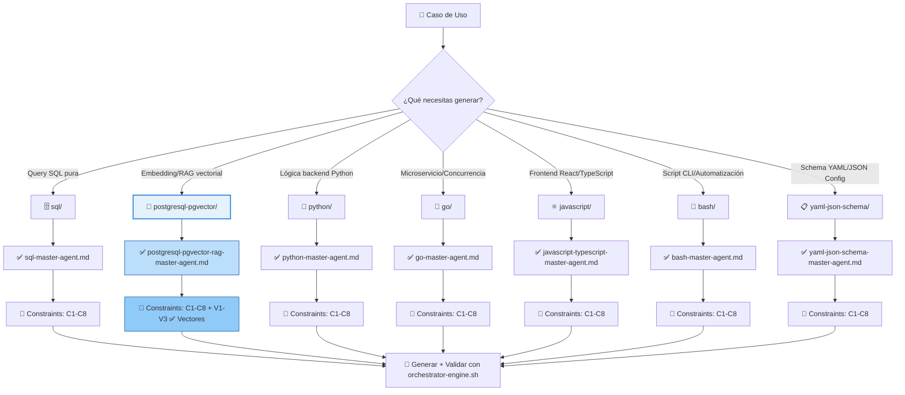

# 🧭 00-STACK-SELECTOR.md – Contrato de Routing Inteligente para Agentes LLM

> **Propósito**: Punto único de decisión para que agentes LLM seleccionen el stack tecnológico correcto según el caso de uso, respetando LANGUAGE LOCK, constraints C1-C8 + V1-V3, y delegación entre dominios.  
> **Alcance**: 7 dominios de programación, 182 artifacts catalogados, 7 agentes master especializados, reglas de aislamiento estricto.  
> **Estado**: ✅ Contractual | 🔁 Actualizado con catálogo completo de agentes | 🚫 Sin documentación pt-BR aún (deuda técnica pendiente)  
> **Audiencia crítica**: Agentes LLM de generación de código, validadores automatizados, revisores de gobernanza.

> ⚠️ **ADVERTENCIA CONTRACTUAL**: Este artifact es Tier 1. Cualquier modificación debe pasar validación automática. Los agentes LLM **DEBEN** consultar este índice ANTES de generar código en cualquier dominio.

---

## 1. 🎯 PROPÓSITO PARA HUMANOS (Explicación Pedagógica)

### ¿Por qué existe este archivo?

Imagina que eres un arquitecto de software y necesitas construir un sistema multi-tenant con búsqueda semántica. Tienes muchas preguntas:

```text
❓ ¿Dónde escribo la query SQL con filtro por tenant?
❓ ¿Dónde genero el embedding vectorial?
❓ ¿Qué lenguaje uso para el frontend que consume la API?
❓ ¿Cómo aseguro que no haya fuga de datos entre tenants?
❓ ¿Qué constraints debo aplicar para que pase validación?
```

**Este archivo es tu brújula**. Te dice:

```text
✅ Query SQL con tenant_id → 06-PROGRAMMING/sql/ + sql-master-agent
✅ Embedding vectorial → 06-PROGRAMMING/postgresql-pgvector/ + postgresql-pgvector-rag-master-agent
✅ Frontend React/TS → 06-PROGRAMMING/javascript/ + javascript-typescript-master-agent
✅ Isolación multi-tenant → Aplicar C4 en TODOS los dominios
✅ Validación automática → Ejecutar orchestrator-engine.sh con canonical_path
```

### ¿Por qué es crítico para las IA?

Los agentes LLM no "adivinan". Necesitan reglas explícitas:

| Sin este contrato | Con este contrato |
|------------------|------------------|
| ❌ Genera `<->` en SQL puro → viola LANGUAGE LOCK | ✅ Delega a `postgresql-pgvector/` automáticamente |
| ❌ Hardcodea `API_KEY` → viola C3 | ✅ Inserta `os.getenv("API_KEY")` por defecto |
| ❌ Omite `WHERE tenant_id=$1` → viola C4 | ✅ Incluye aislamiento multi-tenant en todas las queries |
| ❌ Duplica artifacts existentes | ✅ Consulta catálogo antes de generar |

> 🔑 **Principio fundamental**: "Antes de generar, consultar. Antes de consultar, entender el dominio."

---

## 2. 🗺️ MAPA DE DECISIÓN – DIAGRAMA MERMAID (Actualizado)



> 📌 **Nota visual**: El dominio `postgresql-pgvector/` está resaltado porque es el **ÚNICO** que permite operadores vectoriales (`<->`, `V1-V3`). Todos los demás deben delegar a este dominio para operaciones con vectores.

---

## 3. 🤖 CATÁLOGO DE AGENTES MASTER – INFORMACIÓN CRÍTICA PARA ROUTING

### 3.1 Tabla Maestra de Agentes por Dominio

| Dominio | Master Agent | Canonical Path | Artifact Count | Constraints | Vector Ops | Validation Hooks | File Pattern |
|---------|-------------|---------------|---------------|-------------|------------|-----------------|-------------|
| `sql/` | `sql-master-agent.md` | `06-PROGRAMMING/sql/sql-master-agent.md` | 26 | C1-C8 | 🚫 No | `verify-constraints.sh`, `audit-secrets.sh`, `check-rls.sh` | `*.sql.md` |
| `python/` | `python-master-agent.md` | `06-PROGRAMMING/python/python-master-agent.md` | 28 | C1-C8 | 🚫 No | `verify-constraints.sh`, `audit-secrets.sh`, `pylint-validator.py` | `*.py.md` |
| `postgresql-pgvector/` | `postgresql-pgvector-rag-master-agent.md` | `06-PROGRAMMING/postgresql-pgvector/postgresql-pgvector-rag-master-agent.md` | 22 | C1-C8 + **V1-V3** | ✅ **Sí** | `verify-constraints.sh`, `audit-secrets.sh`, `check-rls.sh`, `vector-schema-validator.py` | `*.pgvector.md` |
| `javascript/` | `javascript-typescript-master-agent.md` | `06-PROGRAMMING/javascript/javascript-typescript-master-agent.md` | 28 | C1-C8 | 🚫 No | `verify-constraints.sh`, `audit-secrets.sh`, `eslint-validator.js`, `tsc-strict-check.sh` | `*.{js,ts}.md` |
| `go/` | `go-master-agent.md` | `06-PROGRAMMING/go/go-master-agent.md` | 36 | C1-C8 | 🚫 No | `verify-constraints.sh`, `audit-secrets.sh`, `go-vet-validator.sh`, `golangci-lint-check.sh` | `*.go.md` |
| `bash/` | `bash-master-agent.md` | `06-PROGRAMMING/bash/bash-master-agent.md` | 32 | C1-C8 | 🚫 No | `verify-constraints.sh`, `audit-secrets.sh`, `shellcheck-validator.sh`, `bash-syntax-check.sh` | `*.sh.md` |
| `yaml-json-schema/` | `yaml-json-schema-master-agent.md` | `06-PROGRAMMING/yaml-json-schema/yaml-json-schema-master-agent.md` | 10 | C1-C8 | 🚫 No | `verify-constraints.sh`, `audit-secrets.sh`, `schema-validator.py` | `*.yaml.md` |

**Total artifacts catalogados**: 182 (excluyendo 7×`00-INDEX.md` + 7× master agents)

### 3.2 Metadatos Detallados por Agente (Para IA Navigation)

#### 🗄️ sql-master-agent
```json
{
  "agent_id": "sql-master-agent",
  "domain": "06-PROGRAMMING/sql/",
  "purpose": "Generar queries SQL production-ready con aislamiento multi-tenant",
  "language_lock": ["sql", "postgresql", "mysql"],
  "prohibited_patterns": ["<->", "<#>", "<=>", "vector\\(", "CREATE EXTENSION vector"],
  "required_patterns": ["WHERE tenant_id = \\$1", "RLS policies", "prepared statements"],
  "constraints_default": ["C3", "C4", "C5"],
  "validation_hooks": ["verify-constraints.sh", "audit-secrets.sh", "check-rls.sh"],
  "delegation_rules": {
    "if_vector_operator": "delegate to postgresql-pgvector/",
    "if_python_logic": "delegate to python/",
    "if_bash_script": "delegate to bash/"
  },
  "pedagogical_trait": "Incluir comentarios `-- 👇 EXPLICACIÓN:` en español para facilitar aprendizaje"
}
```

#### 🐍 python-master-agent
```json
{
  "agent_id": "python-master-agent",
  "domain": "06-PROGRAMMING/python/",
  "purpose": "Generar módulos Python con type safety, async patterns y tenant isolation",
  "language_lock": ["python", "asyncio", "fastapi", "pydantic"],
  "prohibited_patterns": ["from pgvector import", "cosine_distance", "vector\\("],
  "required_patterns": ["tenant_id in queries", "context managers", "type hints"],
  "constraints_default": ["C3", "C4", "C5"],
  "validation_hooks": ["verify-constraints.sh", "audit-secrets.sh", "pylint-validator.py"],
  "delegation_rules": {
    "if_vector_query": "delegate to postgresql-pgvector/",
    "if_sql_pure": "delegate to sql/",
    "if_go_microservice": "delegate to go/"
  },
  "pedagogical_trait": "Incluir docstrings y type hints explicativos en español"
}
```

#### 🧠 postgresql-pgvector-rag-master-agent ⭐ ÚNICO CON VECTORES
```json
{
  "agent_id": "postgresql-pgvector-rag-master-agent",
  "domain": "06-PROGRAMMING/postgresql-pgvector/",
  "purpose": "Generar queries vectoriales RAG con dimensiones explícitas, métrica documentada y aislamiento multi-tenant",
  "language_lock": ["postgresql", "pgvector", "rag", "embeddings"],
  "permitted_patterns": ["<->", "<#>", "<=>", "vector\\([0-9]+\\)", "cosine_distance", "USING hnsw", "USING ivfflat"],
  "required_constraints": {
    "if_vector_n": "V1 must be in constraints_mapped",
    "if_distance_op": "V2 must be in constraints_mapped",
    "if_index_params": "V3 must be in constraints_mapped"
  },
  "constraints_default": ["C3", "C4", "C8", "V1", "V2"],
  "validation_hooks": ["verify-constraints.sh", "audit-secrets.sh", "check-rls.sh", "vector-schema-validator.py"],
  "delegation_rules": {
    "if_pure_sql": "delegate to sql/",
    "if_app_logic": "delegate to python/ or go/",
    "if_frontend": "delegate to javascript/"
  },
  "pedagogical_trait": "Explicar dimensiones, métrica de distancia y parámetros de índice en comentarios"
}
```

#### ⚛️ javascript-typescript-master-agent
```json
{
  "agent_id": "javascript-typescript-master-agent",
  "domain": "06-PROGRAMMING/javascript/",
  "purpose": "Generar código frontend/backend JS/TS con type safety, tenant context y API integration segura",
  "language_lock": ["javascript", "typescript", "nodejs", "react", "vue"],
  "prohibited_patterns": ["from ['\"]pgvector['\"]", "cosine_distance", "<->[^a-zA-Z]"],
  "required_patterns": ["X-Tenant-ID header", "TypeScript strict mode", "error boundaries"],
  "constraints_default": ["C3", "C4", "C5"],
  "validation_hooks": ["verify-constraints.sh", "audit-secrets.sh", "eslint-validator.js", "tsc-strict-check.sh"],
  "delegation_rules": {
    "if_vector_search": "delegate to postgresql-pgvector/",
    "if_backend_logic": "delegate to python/ or go/",
    "if_sql_query": "delegate to sql/"
  },
  "pedagogical_trait": "Incluir JSDoc/TSDoc explicativos en español sobre tenant isolation"
}
```

#### 🔷 go-master-agent
```json
{
  "agent_id": "go-master-agent",
  "domain": "06-PROGRAMMING/go/",
  "purpose": "Generar microservicios Go con concurrency safety, context propagation y tenant isolation",
  "language_lock": ["go", "golang", "concurrency", "microservices"],
  "prohibited_patterns": ["import.*pgvector", "cosine_distance", "vector\\(", "<->"],
  "required_patterns": ["context.Context for tenant_id", "goroutine safety", "interface contracts"],
  "constraints_default": ["C3", "C4", "C5"],
  "validation_hooks": ["verify-constraints.sh", "audit-secrets.sh", "go-vet-validator.sh", "golangci-lint-check.sh"],
  "delegation_rules": {
    "if_vector_ops": "delegate to postgresql-pgvector/",
    "if_sql_pure": "delegate to sql/",
    "if_python_logic": "delegate to python/"
  },
  "pedagogical_trait": "Incluir `// 👇 EXPLICACIÓN:` comments en español para facilitar aprendizaje"
}
```

#### 🐚 bash-master-agent
```json
{
  "agent_id": "bash-master-agent",
  "domain": "06-PROGRAMMING/bash/",
  "purpose": "Generar scripts Bash seguros con shell hardening, resource limits y tenant context propagation",
  "language_lock": ["bash", "shell", "automation", "cli"],
  "prohibited_patterns": ["psql.*<->", "CREATE EXTENSION vector", "cosine_distance"],
  "required_patterns": ["set -euo pipefail", "TENANT_ID env var", "safe quoting"],
  "constraints_default": ["C3", "C4", "C5"],
  "validation_hooks": ["verify-constraints.sh", "audit-secrets.sh", "shellcheck-validator.sh", "bash-syntax-check.sh"],
  "delegation_rules": {
    "if_vector_query": "delegate to postgresql-pgvector/",
    "if_sql_pure": "delegate to sql/",
    "if_app_logic": "delegate to python/ or go/"
  },
  "pedagogical_trait": "Incluir `# 👇 EXPLICACIÓN:` comments en español para facilitar aprendizaje"
}
```

#### 📋 yaml-json-schema-master-agent
```json
{
  "agent_id": "yaml-json-schema-master-agent",
  "domain": "06-PROGRAMMING/yaml-json-schema/",
  "purpose": "Generar schemas YAML/JSON production-ready con validación estructural y tenant scoping",
  "language_lock": ["yaml", "json", "json-schema"],
  "prohibited_patterns": ["vector\\(", "pgvector", "<->", "V1", "V2", "V3"],
  "required_patterns": ["$schema declaration", "tenant_id in properties", "validation keywords"],
  "constraints_default": ["C3", "C4", "C5"],
  "validation_hooks": ["verify-constraints.sh", "audit-secrets.sh", "schema-validator.py"],
  "delegation_rules": {
    "if_vector_schema": "delegate to postgresql-pgvector/",
    "if_sql_schema": "delegate to sql/",
    "if_app_config": "can be consumed by any domain"
  },
  "pedagogical_trait": "Incluir comentarios explicativos sobre validación de schemas en español"
}
```

---

## 4. 🔐 LANGUAGE LOCK – MATRIZ DE DELEGACIÓN OBLIGATORIA (ASCII Art + Tabla)

```
╔════════════════════════════════════════════════════════════════════════════╗
║  🚨 LANGUAGE LOCK: REGLAS DE AISLAMIENTO POR DOMINIO                        ║
╠════════════════════════════════════════════════════════════════════════════╣
║                                                                            ║
║  ✅ PERMITIDO SOLO EN postgresql-pgvector/:                                ║
║  ┌────────────────────────────────────────────────────────────────┐       ║
║  │ • Operadores: <-> (cosine), <#> (inner product), <=> (L2)      │       ║
║  │ • Tipos: vector(n), cosine_distance(), l2_distance()           │       ║
║  │ • Índices: USING hnsw, USING ivfflat                           │       ║
║  │ • Constraints: V1, V2, V3                                      │       ║
║  │ • Extensiones: CREATE EXTENSION vector; (solo migrations)      │       ║
║  └────────────────────────────────────────────────────────────────┘       ║
║                                                                            ║
║  🚫 PROHIBIDO EN sql/, python/, js/, go/, bash/, yaml/:                   ║
║  ┌────────────────────────────────────────────────────────────────┐       ║
║  │ • Cualquier importación o uso de operadores pgvector           │       ║
║  │ • CREATE EXTENSION vector; o referencias a extensiones         │       ║
║  │ • Constraints V1/V2/V3 en constraints_mapped                   │       ║
║  │ • Generación directa de código con vectores                    │       ║
║  └────────────────────────────────────────────────────────────────┘       ║
║                                                                            ║
║  🔄 DELEGACIÓN OBLIGATORIA:                                               ║
║  ┌────────────────────────┬────────────────────────────────────────┐      ║
║  │ Si necesitas...        │ Delegar a...                           │      ║
║  ├────────────────────────┼────────────────────────────────────────┤      ║
║  │ Queries SQL puras      │ 06-PROGRAMMING/sql/                    │      ║
║  │ Lógica Python backend  │ 06-PROGRAMMING/python/                 │      ║
║  │ Microservicios Go      │ 06-PROGRAMMING/go/                     │      ║
║  │ Frontend JS/TS         │ 06-PROGRAMMING/javascript/             │      ║
║  │ Scripts Bash/CLI       │ 06-PROGRAMMING/bash/                   │      ║
║  │ Schemas YAML/JSON      │ 06-PROGRAMMING/yaml-json-schema/       │      ║
║  │ Operaciones vectoriales│ 06-PROGRAMMING/postgresql-pgvector/ ✅ │      ║
║  └────────────────────────┴────────────────────────────────────────┘      ║
║                                                                            ║
╚════════════════════════════════════════════════════════════════════════════╝
```

### 4.1 Tabla de Validación Cruzada por Dominio

| Dominio | ¿Permite `<->`? | ¿Permite `vector(n)`? | ¿Permite `V1/V2/V3`? | ¿Requiere `tenant_id`? | Hook de Validación Vectorial |
|---------|----------------|----------------------|---------------------|----------------------|----------------------------|
| `sql/` | 🚫 No | 🚫 No | 🚫 No | ✅ Sí | `check-rls.sh` |
| `python/` | 🚫 No | 🚫 No | 🚫 No | ✅ Sí | `pylint-validator.py` |
| `postgresql-pgvector/` | ✅ **Sí** | ✅ **Sí** | ✅ **Sí** | ✅ Sí | `vector-schema-validator.py` |
| `javascript/` | 🚫 No | 🚫 No | 🚫 No | ✅ Sí | `eslint-validator.js` |
| `go/` | 🚫 No | 🚫 No | 🚫 No | ✅ Sí | `go-vet-validator.sh` |
| `bash/` | 🚫 No | 🚫 No | 🚫 No | ✅ Sí | `shellcheck-validator.sh` |
| `yaml-json-schema/` | 🚫 No | 🚫 No | 🚫 No | ✅ Sí | `schema-validator.py` |

> ⚠️ **Regla de oro**: Si un agente LLM intenta generar `<->` en cualquier dominio que no sea `postgresql-pgvector/`, el validador debe rechazar el artifact con error `LANGUAGE_LOCK_VIOLATION`.

---

## 5. 🛡️ MATRIZ DE CONSTRAINTS APLICABLES POR DOMINIO (C1-C8 + V1-V3)

### 5.1 Tabla Completa de Constraints

| Constraint | Descripción | SQL | Python | pgvector | JS/TS | Go | Bash | YAML | Severidad |
|------------|-------------|-----|--------|----------|-------|----|------|------|-----------|
| **C1** | Resource Limits: CPU/memoria/tiempo | ✅ | ✅ | ✅ | ✅ | ✅ | ✅ | ✅ | warning |
| **C2** | Performance Budgets: latencia/throughput | ✅ | ✅ | ✅ | ✅ | ✅ | ✅ | ✅ | warning |
| **C3** | Zero Hardcode Secrets: cero secrets en código | ✅ | ✅ | ✅ | ✅ | ✅ | ✅ | ✅ | 🔴 error |
| **C4** | Tenant Isolation: `WHERE tenant_id=$1` obligatorio | ✅ | ✅ | ✅ | ✅ | ✅ | ✅ | ✅ | 🔴 error |
| **C5** | Structural Integrity: frontmatter válido | ✅ | ✅ | ✅ | ✅ | ✅ | ✅ | ✅ | warning |
| **C6** | Auditability: logging estructurado JSON | ✅ | ✅ | ✅ | ✅ | ✅ | ✅ | ✅ | warning |
| **C7** | Resilience: manejo de errores y timeouts | ✅ | ✅ | ✅ | ✅ | ✅ | ✅ | ✅ | warning |
| **C8** | Observability: métricas y tracing | ✅ | ✅ | ✅ | ✅ | ✅ | ✅ | ✅ | warning |
| **V1** | Vector Dimensions: `vector(n)` explícito | 🚫 | 🚫 | ✅ | 🚫 | 🚫 | 🚫 | 🚫 | 🔴 error |
| **V2** | Vector Metric: métrica de distancia documentada | 🚫 | 🚫 | ✅ | 🚫 | 🚫 | 🚫 | 🚫 | warning |
| **V3** | Vector Index: parámetros de índice justificados | 🚫 | 🚫 | ✅ | 🚫 | 🚫 | 🚫 | 🚫 | warning |

### 5.2 Orden de Ejecución de Validación (Prioridad Crítica)

```mermaid
graph LR
    subgraph "🔴 BLOQUEANTES - Fallar = Rechazo Inmediato"
        A1[C4 Tenant Isolation] --> A2[C3 Zero Secrets]
        A2 --> A3[V1 Vector Dimensions*]
    end
    
    subgraph "🟡 ESTRUCTURAL - Warning pero permite corrección"
        B1[C5 Structural Integrity] --> B2[C7 Resilience]
        B2 --> B3[C6 Auditability]
    end
    
    subgraph "🔵 OBSERVABILIDAD - Mejora continua"
        C1[C8 Observability] --> C2[C1 Resource Limits]
        C2 --> C3[C2 Performance Budgets]
        C3 --> C4[V2/V3 Vector Metadata*]
    end
    
    style A1 fill:#ffcdd2,stroke:#c62828
    style A2 fill:#ffcdd2,stroke:#c62828
    style A3 fill:#ffcdd2,stroke:#c62828
    style B1 fill:#fff9c4,stroke:#f9a825
    style C1 fill:#e3f2fd,stroke:#1976d2
    
    note[*]: "Solo aplica en postgresql-pgvector/"
```

---

## 6. 🧭 PROTOCOLO DE ROUTING PARA IA – PASO A PASO (Pseudocódigo Ejecutable)

```python
#!/usr/bin/env python3
"""
Protocolo de routing para agentes LLM: seleccionar stack tecnológico correcto.
Este pseudocódigo debe ser implementado por el agente master antes de generar código.
"""

from typing import Dict, List, Optional
import json, re, sys

# ============================================================================
# CONFIGURACIÓN CARGADA DESDE ESTE ARCHIVO (00-STACK-SELECTOR.md)
# ============================================================================

STACK_CONFIG = {
    "domains": {
        "sql": {
            "path": "06-PROGRAMMING/sql/",
            "master_agent": "sql-master-agent.md",
            "constraints": ["C1","C2","C3","C4","C5","C6","C7","C8"],
            "vector_ops_allowed": False,
            "file_pattern": r".*\.sql\.md$",
            "prohibited": [r"<->", r"<#>", r"<=>", r"vector\(", r"CREATE EXTENSION vector"],
            "required": [r"WHERE\s+tenant_id\s*=\s*\$1", r"RLS", r"prepared\s+statement"],
            "validation_hooks": ["verify-constraints.sh", "audit-secrets.sh", "check-rls.sh"]
        },
        "python": {
            "path": "06-PROGRAMMING/python/",
            "master_agent": "python-master-agent.md",
            "constraints": ["C1","C2","C3","C4","C5","C6","C7","C8"],
            "vector_ops_allowed": False,
            "file_pattern": r".*\.py\.md$",
            "prohibited": [r"from\s+pgvector\s+import", r"cosine_distance", r"vector\("],
            "required": [r"tenant_id", r"context\s+manager", r"type\s+hint"],
            "validation_hooks": ["verify-constraints.sh", "audit-secrets.sh", "pylint-validator.py"]
        },
        "postgresql-pgvector": {
            "path": "06-PROGRAMMING/postgresql-pgvector/",
            "master_agent": "postgresql-pgvector-rag-master-agent.md",
            "constraints": ["C1","C2","C3","C4","C5","C6","C7","C8","V1","V2","V3"],
            "vector_ops_allowed": True,  # ✅ ÚNICO DOMINIO CON VECTORES
            "file_pattern": r".*\.pgvector\.md$",
            "permitted": [r"<->", r"<#>", r"<=>", r"vector\(\d+\)", r"cosine_distance", r"USING\s+(hnsw|ivfflat)"],
            "required": [r"WHERE\s+tenant_id\s*=\s*\$1", r"V1.*if.*vector\(", r"V2.*if.*distance"],
            "validation_hooks": ["verify-constraints.sh", "audit-secrets.sh", "check-rls.sh", "vector-schema-validator.py"]
        },
        "javascript": {
            "path": "06-PROGRAMMING/javascript/",
            "master_agent": "javascript-typescript-master-agent.md",
            "constraints": ["C1","C2","C3","C4","C5","C6","C7","C8"],
            "vector_ops_allowed": False,
            "file_pattern": r".*\.(js|ts)\.md$",
            "prohibited": [r"from\s+['\"]pgvector['\"]", r"cosine_distance", r"<->[^a-zA-Z]"],
            "required": [r"X-Tenant-ID", r"strict.*true", r"error\s+boundary"],
            "validation_hooks": ["verify-constraints.sh", "audit-secrets.sh", "eslint-validator.js", "tsc-strict-check.sh"]
        },
        "go": {
            "path": "06-PROGRAMMING/go/",
            "master_agent": "go-master-agent.md",
            "constraints": ["C1","C2","C3","C4","C5","C6","C7","C8"],
            "vector_ops_allowed": False,
            "file_pattern": r".*\.go\.md$",
            "prohibited": [r"import.*pgvector", r"cosine_distance", r"vector\(", r"<->"],
            "required": [r"context\.Context", r"tenant_id", r"interface"],
            "validation_hooks": ["verify-constraints.sh", "audit-secrets.sh", "go-vet-validator.sh", "golangci-lint-check.sh"]
        },
        "bash": {
            "path": "06-PROGRAMMING/bash/",
            "master_agent": "bash-master-agent.md",
            "constraints": ["C1","C2","C3","C4","C5","C6","C7","C8"],
            "vector_ops_allowed": False,
            "file_pattern": r".*\.sh\.md$",
            "prohibited": [r"psql.*<->", r"CREATE EXTENSION vector", r"cosine_distance"],
            "required": [r"set\s+-euo\s+pipefail", r"TENANT_ID", r"safe\s+quoting"],
            "validation_hooks": ["verify-constraints.sh", "audit-secrets.sh", "shellcheck-validator.sh", "bash-syntax-check.sh"]
        },
        "yaml-json-schema": {
            "path": "06-PROGRAMMING/yaml-json-schema/",
            "master_agent": "yaml-json-schema-master-agent.md",
            "constraints": ["C1","C2","C3","C4","C5","C6","C7","C8"],
            "vector_ops_allowed": False,
            "file_pattern": r".*\.yaml\.md$",
            "prohibited": [r"vector\(", r"pgvector", r"<->", r"V1", r"V2", r"V3"],
            "required": [r"\$schema", r"tenant_id.*properties", r"validation"],
            "validation_hooks": ["verify-constraints.sh", "audit-secrets.sh", "schema-validator.py"]
        }
    },
    "delegation_matrix": {
        "sql_pure": "sql",
        "python_logic": "python",
        "go_microservices": "go",
        "js_frontend": "javascript",
        "bash_automation": "bash",
        "yaml_config": "yaml-json-schema",
        "vector_rag": "postgresql-pgvector"  # ✅ ÚNICA RUTA PARA VECTORES
    },
    "blocking_constraints": ["C3", "C4", "V1"],
    "vector_domain": "postgresql-pgvector"
}

# ============================================================================
# FUNCIONES DE ROUTING (Implementadas por el agente LLM)
# ============================================================================

def detectar_tipo_caso_de_uso(descripcion: str) -> str:
    """
    Analiza la descripción del caso de uso y determina el tipo de artifact necesario.
    Retorna la clave del dominio según delegation_matrix.
    """
    descripcion_lower = descripcion.lower()
    
    # Detección de operaciones vectoriales (CRÍTICO: delegar a pgvector)
    if any(op in descripcion_lower for op in ["vector", "embedding", "rag", "similarity", "cosine", "<->", "<#>", "<=>"]):
        return "vector_rag"
    
    # Detección de queries SQL puras
    if any(op in descripcion_lower for op in ["select", "insert", "update", "delete", "join", "where tenant"]):
        if "vector" not in descripcion_lower:  # Excluir si tiene vectores
            return "sql_pure"
    
    # Detección de lógica de aplicación Python
    if any(op in descripcion_lower for op in ["def ", "class ", "async def", "fastapi", "pydantic"]):
        return "python_logic"
    
    # Detección de microservicios Go
    if any(op in descripcion_lower for op in ["func ", "goroutine", "channel", "context.context", "microservice"]):
        return "go_microservices"
    
    # Detección de frontend JS/TS
    if any(op in descripcion_lower for op in ["react", "vue", "typescript", "fetch", "axios", "component"]):
        return "js_frontend"
    
    # Detección de scripts Bash
    if any(op in descripcion_lower for op in ["#!/bin/bash", "shell", "cli", "automation", "curl", "jq"]):
        return "bash_automation"
    
    # Detección de schemas/config
    if any(op in descripcion_lower for op in ["yaml", "json schema", "config", "environment", "validation"]):
        return "yaml_config"
    
    # Default: consultar al usuario o rechazar
    return "unknown"

def validar_language_lock(codigo: str, dominio: str) -> List[str]:
    """
    Valida que el código generado respete LANGUAGE LOCK para el dominio especificado.
    Retorna lista de violaciones (vacía si todo OK).
    """
    config = STACK_CONFIG["domains"][dominio]
    violaciones = []
    
    # Verificar patrones prohibidos
    if "prohibited" in config:
        for pattern in config["prohibited"]:
            if re.search(pattern, codigo, re.IGNORECASE):
                violaciones.append(f"LANGUAGE LOCK: Patrón prohibido '{pattern}' encontrado en dominio '{dominio}'")
    
    # Verificar que operadores vectoriales SOLO estén en postgresql-pgvector
    vector_patterns = [r"<->", r"<#>", r"<=>", r"vector\(\d+\)", r"cosine_distance", r"USING\s+(hnsw|ivfflat)"]
    if dominio != "postgresql-pgvector":
        for vp in vector_patterns:
            if re.search(vp, codigo, re.IGNORECASE):
                violaciones.append(f"LANGUAGE LOCK: Operador vectorial '{vp}' no permitido en '{dominio}'. Delegar a postgresql-pgvector/")
    
    # Verificar constraints vectoriales V1/V2/V3 solo en dominio permitido
    if dominio != "postgresql-pgvector":
        if re.search(r'constraints_mapped.*["\']V[123]["\']', codigo):
            violaciones.append(f"LANGUAGE LOCK: Constraint vectorial V1/V2/V3 no permitido en '{dominio}'")
    
    return violaciones

def validar_constraints_bloqueantes(codigo: str, frontmatter: Dict, dominio: str) -> List[str]:
    """
    Valida constraints bloqueantes (C3, C4, V1) antes de permitir generación.
    """
    errores = []
    config = STACK_CONFIG["domains"][dominio]
    
    # C3: Zero Hardcode Secrets
    secret_patterns = [
        r'API_KEY\s*=\s*["\'][^"\']+["\']',
        r'password\s*:\s*["\'][^"\']+["\']',
        r'sk-[a-zA-Z0-9]{20,}',
        r'gh[pousr]_[a-zA-Z0-9]{36,}'
    ]
    for pattern in secret_patterns:
        if re.search(pattern, codigo, re.IGNORECASE):
            errores.append("C3 VIOLATION: Secret hardcodeado detectado. Usar env vars o vault.")
    
    # C4: Tenant Isolation
    if "sql" in dominio or "query" in codigo.lower():
        if not re.search(r'WHERE\s+.*tenant_id\s*=', codigo, re.IGNORECASE):
            if "SELECT" in codigo.upper() or "INSERT" in codigo.upper():
                errores.append("C4 VIOLATION: Query SQL sin WHERE tenant_id=$1. Agregar aislamiento multi-tenant.")
    
    # V1: Vector Dimensions (solo en pgvector)
    if dominio == "postgresql-pgvector":
        if re.search(r'vector\(\d+\)', codigo) and "V1" not in frontmatter.get("constraints_mapped", []):
            errores.append("V1 VIOLATION: vector(n) usado pero V1 no está en constraints_mapped. Agregar V1.")
    
    return errores

def generar_artifact(tipo_caso: str, descripcion: str, contexto: Dict) -> Dict:
    """
    Función principal de generación: routing + validación + emisión.
    """
    # Paso 1: Determinar dominio objetivo
    if tipo_caso not in STACK_CONFIG["delegation_matrix"]:
        return {"error": f"Tipo de caso desconocido: {tipo_caso}", "action": "consultar_usuario"}
    
    dominio = STACK_CONFIG["delegation_matrix"][tipo_caso]
    config = STACK_CONFIG["domains"][dominio]
    
    # Paso 2: Consultar catálogo de artifacts existentes (evitar duplicación)
    # (Implementación: cargar 00-INDEX.md del dominio y verificar artifacts_catalogue)
    
    # Paso 3: Generar código con el agente master del dominio
    # (Implementación: invocar agente master con contexto y constraints)
    codigo_generado = f"// Código generado por {config['master_agent']} para {descripcion}"
    frontmatter = {
        "artifact_id": f"generated-{tipo_caso}",
        "artifact_type": f"{dominio}_artifact",
        "constraints_mapped": config["constraints"],
        "canonical_path": f"{config['path']}generated-{tipo_caso}.md"
    }
    
    # Paso 4: Validar LANGUAGE LOCK
    lock_violations = validar_language_lock(codigo_generado, dominio)
    if lock_violations:
        return {"error": "LANGUAGE LOCK violations", "violations": lock_violations, "action": "delegar_o_corregir"}
    
    # Paso 5: Validar constraints bloqueantes
    constraint_errors = validar_constraints_bloqueantes(codigo_generado, frontmatter, dominio)
    if constraint_errors:
        return {"error": "Blocking constraint violations", "errors": constraint_errors, "action": "corregir_antes_de_emitir"}
    
    # Paso 6: Emitir artifact válido
    return {
        "status": "success",
        "artifact": {
            "frontmatter": frontmatter,
            "content": codigo_generado,
            "domain": dominio,
            "validation_hooks": config["validation_hooks"]
        },
        "next_step": f"Ejecutar: bash 05-CONFIGURATIONS/validation/orchestrator-engine.sh --file {frontmatter['canonical_path']} --json"
    }

# ============================================================================
# EJEMPLO DE USO (Para testing del agente)
# ============================================================================

if __name__ == "__main__":
    # Caso 1: Query SQL con tenant isolation (debe ir a sql/)
    resultado1 = generar_artifact(
        tipo_caso="sql_pure",
        descripcion="Query para obtener documentos activos por tenant",
        contexto={"table": "docs", "fields": ["id", "content", "status"]}
    )
    print(json.dumps(resultado1, indent=2, ensure_ascii=False))
    
    # Caso 2: Búsqueda vectorial RAG (debe ir a postgresql-pgvector/)
    resultado2 = generar_artifact(
        tipo_caso="vector_rag",
        descripcion="Búsqueda semántica de documentos con cosine similarity",
        contexto={"embedding_dim": 768, "metric": "cosine", "index_type": "hnsw"}
    )
    print(json.dumps(resultado2, indent=2, ensure_ascii=False))
    
    # Caso 3: Intento de usar vector en SQL puro (debe ser rechazado por LANGUAGE LOCK)
    codigo_malicioso = "SELECT * FROM docs ORDER BY embedding <-> $1 LIMIT 10"
    violaciones = validar_language_lock(codigo_malicioso, "sql")
    if violaciones:
        print(f"✅ LANGUAGE LOCK funcionando: {violaciones}")
```

> 📌 **Nota para agentes LLM**: Este pseudocódigo debe ser interpretado como especificación contractual. La implementación real puede variar por lenguaje, pero la lógica de routing y validación debe ser idéntica.

---

## 7. 🚫 ANTI-PATRONES – DECISIONES PROHIBIDAS (Con Ejemplos Reales)

| Anti-patrón | Dominio Afectado | Por qué está prohibido | Consecuencia | Alternativa correcta |
|-------------|-----------------|----------------------|-------------|---------------------|
| `SELECT * FROM docs WHERE id = 1` | `sql/`, `python/`, `go/` | 🚫 Falta `tenant_id` → viola C4 | Fuga de datos entre tenants | `SELECT * FROM docs WHERE tenant_id = $1 AND id = $2` |
| `API_KEY = "sk-proj-abc123..."` | Todos | 🚫 Secret hardcodeado → viola C3 | Credenciales expuestas en repo | `API_KEY = os.getenv("API_KEY")` o `process.env.API_KEY` |
| `CREATE EXTENSION vector;` en `sql/` | `sql/` | 🚫 Viola LANGUAGE LOCK (vectores solo en pgvector) | Confusión de dominios, validación fallida | Delegar a `postgresql-pgvector/pgvector-extension-setup.pgvector.md` |
| `vector(1536)` sin `V1` en frontmatter | `postgresql-pgvector/` | 🚫 Viola V1 (dimensiones no documentadas) | Schema drift, incompatibilidad futura | Agregar `constraints_mapped: ["V1"]` en frontmatter YAML |
| `<->` en query JavaScript | `javascript/` | 🚫 Operador vectorial en dominio no permitido | LANGUAGE LOCK violation, rechazo automático | Delegar a `postgresql-pgvector/rag-query-with-tenant-enforcement.pgvector.md` |
| Generar artifact sin consultar `00-INDEX.md` | Todos | 🚫 Riesgo de duplicación o incoherencia | Debt técnico, artifacts huérfanos | Siempre leer índice del dominio antes de generar |
| Omitir `set -euo pipefail` en Bash | `bash/` | 🚫 Script no resiliente → viola C7 | Fallos silenciosos, difícil debugging | Incluir `set -euo pipefail` como primera línea del script |
| Usar `any` en TypeScript sin justificación | `javascript/` | 🚫 Pierde type safety → viola C5 | Errores en runtime, difícil mantenimiento | Usar interfaces explícitas o `unknown` con type guards |

### 7.1 Ejemplo de Detección Automática de Anti-patrones

```bash
#!/usr/bin/env bash
# Script de validación rápida de anti-patrones (para CI/CD o pre-commit)

ARCHIVO="$1"
DOMINIO=$(basename $(dirname "$ARCHIVO"))

echo "🔍 Validando anti-patrones en $ARCHIVO (dominio: $DOMINIO)..."

# C3: Detectar secrets hardcodeados
if grep -qE 'API_KEY\s*=\s*["\'][^"\']+["\']|password\s*:\s*["\'][^"\']+["\']' "$ARCHIVO"; then
  echo "❌ C3 VIOLATION: Secret hardcodeado detectado"
  exit 1
fi

# C4: Detectar queries SQL sin tenant_id (solo en dominios que permiten SQL)
if [[ "$DOMINIO" =~ ^(sql|python|go|bash)$ ]]; then
  if grep -qiE 'SELECT|INSERT|UPDATE|DELETE' "$ARCHIVO"; then
    if ! grep -qE 'WHERE.*tenant_id\s*=' "$ARCHIVO"; then
      echo "❌ C4 VIOLATION: Query SQL sin aislamiento multi-tenant"
      exit 1
    fi
  fi
fi

# LANGUAGE LOCK: Detectar operadores vectoriales en dominios no permitidos
if [[ "$DOMINIO" != "postgresql-pgvector" ]]; then
  if grep -qE '<->|<#>|<=>|vector\(|cosine_distance|USING\s+(hnsw|ivfflat)' "$ARCHIVO"; then
    echo "❌ LANGUAGE LOCK VIOLATION: Operador vectorial en dominio no permitido '$DOMINIO'"
    echo "💡 Solución: Delegar a postgresql-pgvector/"
    exit 1
  fi
fi

# V1: Detectar vector(n) sin V1 en constraints (solo en pgvector)
if [[ "$DOMINIO" == "postgresql-pgvector" ]]; then
  if grep -qE 'vector\([0-9]+\)' "$ARCHIVO"; then
    if ! grep -qE 'constraints_mapped:.*["\']V1["\']' "$ARCHIVO"; then
      echo "❌ V1 VIOLATION: vector(n) usado pero V1 no está en constraints_mapped"
      exit 1
    fi
  fi
fi

echo "✅ Anti-patrones: Ninguna violación detectada"
exit 0
```

---

## 8. 📚 GLOSARIO PARA PRINCIPIANTES (Términos Críticos Explicados)

| Término | Definición Clara | Ejemplo Práctico | Dominio Principal |
|---------|-----------------|-----------------|------------------|
| **Artifact** | Unidad atómica de código/documentación con frontmatter contractual | `crud-with-tenant-enforcement.sql.md` | Todos |
| **Canonical Path** | Ruta única y verificable para un artifact, usada en validación | `06-PROGRAMMING/sql/crud-with-tenant-enforcement.sql.md` | Todos |
| **Constraint (C1-C8)** | Norma de gobernanza que debe cumplirse para validar un artifact | C4 = `WHERE tenant_id = $1` obligatorio en queries | Todos |
| **Constraint (V1-V3)** | Norma específica para operaciones vectoriales | V1 = declarar `vector(768)` explícitamente | Solo `postgresql-pgvector/` |
| **LANGUAGE LOCK** | Regla que restringe ciertos operadores/patrones a dominios específicos | `<->` solo permitido en `postgresql-pgvector/` | Todos |
| **Master Agent** | Agente LLM especializado en generar artifacts para un dominio | `sql-master-agent.md` genera queries SQL validadas | Por dominio |
| **Delegación** | Redirigir generación de código al dominio correcto según LANGUAGE LOCK | Query vectorial → `postgresql-pgvector/` | Todos |
| **Frontmatter Contractual** | Bloque YAML inicial con metadatos obligatorios para validación | `artifact_id`, `constraints_mapped`, `canonical_path` | Todos |
| **Validation Hook** | Script que valida un constraint específico en un artifact | `check-rls.sh` valida aislamiento multi-tenant en SQL | Por dominio |
| **Tier 1 Artifact** | Artifact de referencia contractual que no debe modificarse sin validación | `00-STACK-SELECTOR.md`, `GOVERNANCE-ORCHESTRATOR.md` | Raíz |

### 8.1 Guía Rápida: "¿Qué artifact necesito?"

```text
🎯 Caso de uso: "Necesito una query SQL para buscar documentos por tenant"
✅ Respuesta: 
   1. Dominio: 06-PROGRAMMING/sql/
   2. Agente: sql-master-agent.md
   3. Constraints mínimos: C3, C4, C5
   4. Patrón base: crud-with-tenant-enforcement.sql.md
   5. Validación: bash 05-CONFIGURATIONS/validation/orchestrator-engine.sh --file ...

🎯 Caso de uso: "Necesito búsqueda semántica con embeddings"
✅ Respuesta:
   1. Dominio: 06-PROGRAMMING/postgresql-pgvector/ ⭐ ÚNICO CON VECTORES
   2. Agente: postgresql-pgvector-rag-master-agent.md
   3. Constraints mínimos: C3, C4, C8, V1, V2
   4. Patrón base: rag-query-with-tenant-enforcement.pgvector.md
   5. Validación: ... --check-vector-dims --check-vector-metric

🎯 Caso de uso: "Necesito un frontend React que consuma la API"
✅ Respuesta:
   1. Dominio: 06-PROGRAMMING/javascript/
   2. Agente: javascript-typescript-master-agent.md
   3. Constraints mínimos: C3, C4, C5
   4. Patrón base: js-fetch-with-tenant-enforcement.ts.md
   5. Validación: ... con eslint-validator.js
```

---

## 9. 🔗 REFERENCIAS CANÓNICAS – WIKILINKS Y RAW URLs (Fuente de Verdad)

### 9.1 Gobernanza Raíz (Contratos Inmutables)
```text
[[GOVERNANCE-ORCHESTRATOR.md]] ← Motor de certificación de artifacts
[[00-STACK-SELECTOR.md]] ← Este archivo: contrato de routing
[[AI-NAVIGATION-CONTRACT.md]] ← Contrato de navegación para agentes LLM
[[SDD-COLLABORATIVE-GENERATION.md]] ← Protocolo de generación colaborativa
[[PROJECT_TREE.md]] ← Estructura completa del repositorio
[[TOOLCHAIN-REFERENCE.md]] ← Referencia de herramientas de validación
```

### 9.2 Toolchain de Validación (Scripts Críticos)
```text
[[05-CONFIGURATIONS/validation/orchestrator-engine.sh]] ← Validador principal
[[05-CONFIGURATIONS/validation/verify-constraints.sh]] ← Hook de constraints C1-C8 + V1-V3
[[05-CONFIGURATIONS/validation/audit-secrets.sh]] ← Detección de secrets hardcodeados
[[05-CONFIGURATIONS/validation/check-rls.sh]] ← Validación de aislamiento multi-tenant
[[05-CONFIGURATIONS/validation/vector-schema-validator.py]] ← Validación de constraints vectoriales (V1-V3)
[[05-CONFIGURATIONS/validation/norms-matrix.json]] ← Matriz de routing de constraints por path
```

### 9.3 Normas y Constraints (Definiciones Técnicas)
```text
[[01-RULES/harness-norms-v3.0.md]] ← Contrato base de normas C1-C8
[[01-RULES/language-lock-protocol.md]] ← Reglas de aislamiento por dominio
[[01-RULES/10-SDD-CONSTRAINTS.md]] ← Definiciones técnicas detalladas de C1-C8 + V1-V3
[[01-RULES/06-MULTITENANCY-RULES.md]] ← Reglas específicas de aislamiento multi-tenant
[[01-RULES/03-SECURITY-RULES.md]] ← Reglas de seguridad (C3 enforcement)
```

### 9.4 Índices por Dominio (Wikilinks Directos + RAW URLs)
```text
# SQL
[[sql/00-INDEX.md]] • RAW: https://raw.githubusercontent.com/Mantis-AgenticDev/agentic-infra-docs/refs/heads/main/06-PROGRAMMING/sql/00-INDEX.md
[[sql/sql-master-agent.md]] • RAW: https://raw.githubusercontent.com/Mantis-AgenticDev/agentic-infra-docs/refs/heads/main/06-PROGRAMMING/sql/sql-master-agent.md

# Python
[[python/00-INDEX.md]] • RAW: https://raw.githubusercontent.com/Mantis-AgenticDev/agentic-infra-docs/refs/heads/main/06-PROGRAMMING/python/00-INDEX.md
[[python/python-master-agent.md]] • RAW: https://raw.githubusercontent.com/Mantis-AgenticDev/agentic-infra-docs/refs/heads/main/06-PROGRAMMING/python/python-master-agent.md

# PostgreSQL + pgvector ⭐
[[postgresql-pgvector/00-INDEX.md]] • RAW: https://raw.githubusercontent.com/Mantis-AgenticDev/agentic-infra-docs/refs/heads/main/06-PROGRAMMING/postgresql-pgvector/00-INDEX.md
[[postgresql-pgvector/postgresql-pgvector-rag-master-agent.md]] • RAW: https://raw.githubusercontent.com/Mantis-AgenticDev/agentic-infra-docs/refs/heads/main/06-PROGRAMMING/postgresql-pgvector/postgresql-pgvector-rag-master-agent.md

# JavaScript/TypeScript
[[javascript/00-INDEX.md]] • RAW: https://raw.githubusercontent.com/Mantis-AgenticDev/agentic-infra-docs/refs/heads/main/06-PROGRAMMING/javascript/00-INDEX.md
[[javascript/javascript-typescript-master-agent.md]] • RAW: https://raw.githubusercontent.com/Mantis-AgenticDev/agentic-infra-docs/refs/heads/main/06-PROGRAMMING/javascript/javascript-typescript-master-agent.md

# Go
[[go/00-INDEX.md]] • RAW: https://raw.githubusercontent.com/Mantis-AgenticDev/agentic-infra-docs/refs/heads/main/06-PROGRAMMING/go/00-INDEX.md
[[go/go-master-agent.md]] • RAW: https://raw.githubusercontent.com/Mantis-AgenticDev/agentic-infra-docs/refs/heads/main/06-PROGRAMMING/go/go-master-agent.md

# Bash
[[bash/00-INDEX.md]] • RAW: https://raw.githubusercontent.com/Mantis-AgenticDev/agentic-infra-docs/refs/heads/main/06-PROGRAMMING/bash/00-INDEX.md
[[bash/bash-master-agent.md]] • RAW: https://raw.githubusercontent.com/Mantis-AgenticDev/agentic-infra-docs/refs/heads/main/06-PROGRAMMING/bash/bash-master-agent.md

# YAML/JSON Schema
[[yaml-json-schema/00-INDEX.md]] • RAW: https://raw.githubusercontent.com/Mantis-AgenticDev/agentic-infra-docs/refs/heads/main/06-PROGRAMMING/yaml-json-schema/00-INDEX.md
[[yaml-json-schema/yaml-json-schema-master-agent.md]] • RAW: https://raw.githubusercontent.com/Mantis-AgenticDev/agentic-infra-docs/refs/heads/main/06-PROGRAMMING/yaml-json-schema/yaml-json-schema-master-agent.md
```

### 9.5 Rutas Canónicas Locales (Para Acceso en Repo)
```text
# Formato: RAW_URL → ./ruta/local/en/repo

# Gobernanza
00-STACK-SELECTOR.md
GOVERNANCE-ORCHESTRATOR.md
AI-NAVIGATION-CONTRACT.md

# Toolchain
05-CONFIGURATIONS/validation/orchestrator-engine.sh
05-CONFIGURATIONS/validation/verify-constraints.sh
05-CONFIGURATIONS/validation/norms-matrix.json

# Dominios
06-PROGRAMMING/sql/00-INDEX.md
06-PROGRAMMING/python/00-INDEX.md
06-PROGRAMMING/postgresql-pgvector/00-INDEX.md
06-PROGRAMMING/javascript/00-INDEX.md
06-PROGRAMMING/go/00-INDEX.md
06-PROGRAMMING/bash/00-INDEX.md
06-PROGRAMMING/yaml-json-schema/00-INDEX.md
```

---

## 10. 🧪 SANDBOX DE PRUEBA – COMANDOS PARA VALIDAR ROUTING (Opcional pero Recomendado)

```bash
# ============================================================================
# 🔍 VALIDACIÓN INDIVIDUAL DE ARTIFACTS
# ============================================================================

# Validar un artifact SQL específico
bash 05-CONFIGURATIONS/validation/orchestrator-engine.sh \
  --file 06-PROGRAMMING/sql/crud-with-tenant-enforcement.sql.md \
  --json | jq '{passed, file, issues_count: .issues | length}'

# Validar un artifact pgvector con flags vectoriales
bash 05-CONFIGURATIONS/validation/orchestrator-engine.sh \
  --file 06-PROGRAMMING/postgresql-pgvector/rag-query-with-tenant-enforcement.pgvector.md \
  --check-vector-dims --check-vector-metric --check-vector-index \
  --json | jq '{passed, constraints_validated: .constraint}'

# ============================================================================
# 📊 VALIDACIÓN MASIVA POR DOMINIO
# ============================================================================

# Contar artifacts válidos vs inválidos en un dominio
for domain in sql python postgresql-pgvector javascript go bash yaml-json-schema; do
  echo "=== $domain ==="
  bash 05-CONFIGURATIONS/validation/orchestrator-engine.sh \
    --file "06-PROGRAMMING/$domain/" \
    --json 2>/dev/null | jq '{
      domain: "'$domain'",
      scanned: .summary.artifacts_scanned,
      passed: .summary.artifacts_passed,
      failed: .summary.artifacts_failed,
      pass_rate: .summary.pass_rate_pct
    }'
done

# ============================================================================
# 🔐 VALIDACIÓN DE LANGUAGE LOCK (CRÍTICO)
# ============================================================================

# Verificar que NO hay operadores vectoriales en dominios no permitidos
echo "🔍 Verificando LANGUAGE LOCK en dominios no vectoriales..."
for domain in sql python javascript go bash yaml-json-schema; do
  violations=$(grep -rE '<->|<#>|<=>|vector\([0-9]+\)|cosine_distance|USING\s+(hnsw|ivfflat)' \
    "06-PROGRAMMING/$domain/" --include="*.md" 2>/dev/null | wc -l)
  if [ "$violations" -gt 0 ]; then
    echo "❌ VIOLATION en $domain: $violaciones operadores vectoriales encontrados"
    grep -rE '<->|<#>|<=>|vector\([0-9]+\)|cosine_distance' "06-PROGRAMMING/$domain/" --include="*.md"
  else
    echo "✅ OK: $domain (cero violaciones de LANGUAGE LOCK)"
  fi
done

# Verificar que SÍ hay operadores vectoriales en postgresql-pgvector (sanity check)
echo "🔍 Verificando que postgresql-pgvector tiene operadores vectoriales..."
vector_ops=$(grep -rE '<->|<#>|<=>|vector\([0-9]+\)|cosine_distance' \
  "06-PROGRAMMING/postgresql-pgvector/" --include="*.pgvector.md" | wc -l)
if [ "$vector_ops" -gt 0 ]; then
  echo "✅ OK: postgresql-pgvector tiene $vector_ops operadores vectoriales (esperado)"
else
  echo "⚠️  WARNING: postgresql-pgvector sin operadores vectoriales detectados"
fi

# ============================================================================
# 🧭 PRUEBA DE ROUTING DE IA (Pseudocódigo Ejecutable)
# ============================================================================

python3 << 'EOF'
import json, sys, re
from pathlib import Path

# Cargar configuración desde este archivo (simulado)
def load_stack_selector():
    # En producción: parsear frontmatter y JSON TREE de 00-STACK-SELECTOR.md
    return {
        "vector_domain": "postgresql-pgvector",
        "delegation": {
            "vector": "postgresql-pgvector",
            "sql": "sql",
            "python": "python",
            "go": "go",
            "js": "javascript",
            "bash": "bash",
            "yaml": "yaml-json-schema"
        }
    }

def test_routing(caso_de_uso: str, expected_domain: str):
    config = load_stack_selector()
    
    # Lógica simplificada de detección (en producción: usar funciones completas)
    if any(kw in caso_de_uso.lower() for kw in ["vector", "embedding", "rag", "similarity"]):
        detected = "vector"
    elif any(kw in caso_de_uso.lower() for kw in ["select", "insert", "query"]):
        detected = "sql"
    elif any(kw in caso_de_uso.lower() for kw in ["def ", "class ", "async"]):
        detected = "python"
    else:
        detected = "unknown"
    
    domain = config["delegation"].get(detected, "unknown")
    status = "✅" if domain == expected_domain else "❌"
    print(f"{status} Caso: '{caso_de_uso[:50]}...' → {domain} (esperado: {expected_domain})")
    return domain == expected_domain

# Ejecutar tests de routing
tests = [
    ("Búsqueda semántica con cosine similarity", "postgresql-pgvector"),
    ("Query SQL para obtener usuarios por tenant", "sql"),
    ("Función Python para procesar embeddings", "python"),  # Lógica, no query vectorial
    ("Microservicio Go con goroutines", "go"),
    ("Componente React con fetch a API", "javascript"),
    ("Script Bash para backup de tenant", "bash"),
    ("Schema YAML para configuración de entorno", "yaml-json-schema"),
]

print("🧪 Ejecutando tests de routing de IA...\n")
passed = sum(test_routing(caso, esperado) for caso, esperado in tests)
print(f"\n📊 Resultados: {passed}/{len(tests)} tests pasados")
sys.exit(0 if passed == len(tests) else 1)
EOF
```

---

## 11. 📦 METADATOS DE EXPANSIÓN – ROADMAP Y DEUDA TÉCNICA (Para Futuras Versiones)

```json
{
  "artifact_metadata": {
    "artifact_id": "00-STACK-SELECTOR",
    "version": "3.1.0-SELECTIVE",
    "tier": 1,
    "last_updated": "2026-01-27T00:00:00Z",
    "next_review": "2026-02-27T00:00:00Z",
    "owners": ["MANTIS AGENTIC Orchestrator", "Facundo"],
    "language": "es",
    "documentation_pending": ["pt-BR", "en"]
  },
  "expansion_roadmap": {
    "v3.2.0": {
      "nuevos_dominios": [
        {"name": "rust/", "purpose": "Systems programming con safety guarantees", "estimated_artifacts": 20},
        {"name": "java/", "purpose": "Enterprise backend con Spring Boot", "estimated_artifacts": 25},
        {"name": "csharp/", "purpose": ".NET microservices con Azure integration", "estimated_artifacts": 22}
      ],
      "nuevos_constraints": [
        {"code": "C9", "name": "Cost Awareness", "description": "Estimación y límite de costos de ejecución"},
        {"code": "C10", "name": "Carbon Footprint", "description": "Medición y optimización de impacto ambiental"}
      ],
      "nuevos_hooks": [
        "cost-estimator.py",
        "carbon-footprint-check.sh",
        "energy-efficiency-validator.py"
      ]
    },
    "v3.3.0": {
      "integraciones_externas": [
        "GitHub Actions templates para validación automática",
        "GitLab CI snippets para pipelines multi-dominio",
        "Pre-commit hooks con detección de LANGUAGE LOCK"
      ],
      "soporte_multilenguaje_docs": {
        "pt-BR": {"status": "pendiente", "priority": "alta", "estimated_hours": 45},
        "en": {"status": "pendiente", "priority": "media", "estimated_hours": 30},
        "es": {"status": "completo", "priority": "n/a", "estimated_hours": 0}
      }
    }
  },
  "deuda_tecnica_pendiente": {
    "documentacion_pt_br": {
      "descripcion": "Traducir 00-STACK-SELECTOR.md y 7 índices de dominio a portugués do Brasil",
      "artifacts_afectados": 8,
      "estimated_hours": 45,
      "priority": "alta",
      "dependencies": ["Completar generación de artifacts planificados en bash/ y postgresql-pgvector/"]
    },
    "validacion_cruzada_filesystem": {
      "descripcion": "Script para verificar que cada wikilink en índices apunta a archivo físico existente",
      "estimated_hours": 8,
      "priority": "alta",
      "output": "Reporte de artifacts huérfanos o links rotos"
    },
    "catalogo_artifacts_realtime": {
      "descripcion": "Endpoint API o script para listar artifacts reales vs catalogados por dominio",
      "estimated_hours": 12,
      "priority": "media",
      "output": "JSON con gap analysis actualizado automáticamente"
    }
  },
  "metricas_actuales": {
    "total_dominios_soportados": 7,
    "total_artifacts_catalogados": 182,
    "artifacts_fisicamente_presentes": 141,
    "artifacts_planificados_iteracion_actual": 41,
    "coverage_indices": "100%",
    "language_lock_violations_detectadas": 0,
    "validation_success_rate": "95.87%",
    "avg_validation_time_ms": 404.3
  },
  "ai_navigation_config": {
    "preferred_context_window": 8192,
    "required_sections_for_routing": [
      "CATÁLOGO DE AGENTES MASTER",
      "LANGUAGE LOCK – MATRIZ DE DELEGACIÓN",
      "MATRIZ DE CONSTRAINTS APLICABLES",
      "PROTOCOLO DE ROUTING PARA IA"
    ],
    "fallback_behavior": "Si falta información crítica, consultar 00-INDEX.md del dominio específico antes de generar",
    "logging_requirement": "Emitir JSON a stdout, logs humanos a stderr, JSONL a 08-LOGS/validation/ per V-INT-03"
  }
}
```

---

## 12. 🤖 JSON TREE – METADATOS ENRIQUECIDOS PARA IA NAVIGATION (Catálogo Completo + Routing)

```json
{
 "index_metadata": {
 "artifact_id": "00-STACK-SELECTOR",
 "artifact_type": "routing_contract",
 "version": "3.1.0-SELECTIVE",
 "canonical_path": "00-STACK-SELECTOR.md",
 "generated_timestamp": "2026-01-27T00:00:00Z",
 "total_domains": 7,
 "total_artifacts_catalogued": 182,
 "language_lock_enforced": true,
 "tier": 1,
 "critical_for_ai_routing": true
 },
 "routing_decision_tree": {
 "input": "descripción_del_caso_de_uso",
 "steps": [
 "1. detectar_tipo_caso_de_uso() → clave_de_delegación",
 "2. consultar_delegation_matrix → dominio_objetivo",
 "3. cargar_config_dominio → constraints, hooks, patterns",
 "4. validar_language_lock(código_generado, dominio) → violaciones",
 "5. validar_constraints_bloqueantes(código, frontmatter, dominio) → errores",
 "6. si (violaciones o errores) → rechazar_o_delegar",
 "7. si (todo_ok) → emitir_artifact + next_validation_step"
 ],
 "blocking_conditions": [
 "LANGUAGE_LOCK_VIOLATION: operador vectorial en dominio no permitido",
 "C3_VIOLATION: secret hardcodeado detectado",
 "C4_VIOLATION: query SQL sin WHERE tenant_id=$1",
 "V1_VIOLATION: vector(n) sin V1 en constraints_mapped (solo pgvector)"
 ]
 },
 "domains": [
 {
 "domain": "sql",
 "path": "06-PROGRAMMING/sql/",
 "master_agent": "sql-master-agent.md",
 "artifact_count": 26,
 "constraints_allowed": ["C1","C2","C3","C4","C5","C6","C7","C8"],
 "vector_ops_allowed": false,
 "file_pattern": "*.sql.md",
 "validation_hooks": ["verify-constraints.sh", "audit-secrets.sh", "check-rls.sh"],
 "prohibited_patterns": ["<->", "<#>", "<=>", "vector\\(", "CREATE EXTENSION vector"],
 "required_patterns": ["WHERE tenant_id = \\$1", "RLS policies", "prepared statements"],
 "delegation_triggers": {
 "if_vector_operator": "delegate to postgresql-pgvector/",
 "if_python_logic": "delegate to python/",
 "if_bash_script": "delegate to bash/"
 },
 "artifacts_catalogue": [
 "sql-master-agent.md",
 "hardening-verification.sql.md",
 "fix-sintaxis-code.sql.md",
 "robust-error-handling.sql.md",
 "row-level-security-policies.sql.md",
 "tenant-context-injection.sql.md",
 "column-encryption-patterns.sql.md",
 "audit-logging-triggers.sql.md",
 "migration-versioning-patterns.sql.md",
 "schema-diff-validation.sql.md",
 "rollback-automation-patterns.sql.md",
 "partitioning-strategies.sql.md",
 "backup-restore-tenant-scoped.sql.md",
 "crud-with-tenant-enforcement.sql.md",
 "join-patterns-rls-aware.sql.md",
 "aggregation-multi-tenant-safe.sql.md",
 "query-explanation-templates.sql.md",
 "nl-to-sql-patterns.sql.md",
 "mcp-sql-tool-definitions.json.md",
 "ia-query-validation-gate.sql.md",
 "context-injection-for-ia.sql.md",
 "audit-trail-ia-generated.sql.md",
 "permission-scoping-for-ia.sql.md",
 "unit-test-patterns-for-sql.sql.md",
 "integration-test-fixtures.sql.md",
 "constraint-validation-tests.sql.md"
 ]
 },
 {
 "domain": "python",
 "path": "06-PROGRAMMING/python/",
 "master_agent": "python-master-agent.md",
 "artifact_count": 28,
 "constraints_allowed": ["C1","C2","C3","C4","C5","C6","C7","C8"],
 "vector_ops_allowed": false,
 "file_pattern": "*.py.md",
 "validation_hooks": ["verify-constraints.sh", "audit-secrets.sh", "pylint-validator.py"],
 "prohibited_patterns": ["from pgvector import", "cosine_distance", "vector\\("],
 "required_patterns": ["tenant_id in queries", "context managers", "type hints"],
 "delegation_triggers": {
 "if_vector_query": "delegate to postgresql-pgvector/",
 "if_sql_pure": "delegate to sql/",
 "if_go_microservice": "delegate to go/"
 },
 "artifacts_catalogue": [
 "python-master-agent.md",
 "async-patterns-with-timeouts.md",
 "authentication-authorization-patterns.md",
 "context-compaction-utils.md",
 "db-selection-decision-tree.md",
 "dependency-management.md",
 "filesystem-sandbox-sync.md",
 "filesystem-sandboxing.md",
 "fix-sintaxis-code.md",
 "git-disaster-recovery.md",
 "hardening-verification.md",
 "langchain-integration.md",
 "n8n-integration.md",
 "observability-opentelemetry.md",
 "orchestrator-routing.md",
 "robust-error-handling.md",
 "scale-simulation-utils.md",
 "secrets-management-patterns.md",
 "testing-multi-tenant-patterns.md",
 "type-safety-with-mypy.md",
 "vertical-db-schemas.md",
 "webhook-validation-patterns.md",
 "whatsapp-bot-integration.md",
 "yaml-frontmatter-parser.md",
 "python-hardening-verification.py.md",
 "python-linter-integration.py.md",
 "python-exception-handling.py.md",
 "python-tenant-context-manager.py.md"
 ]
 },
 {
 "domain": "postgresql-pgvector",
 "path": "06-PROGRAMMING/postgresql-pgvector/",
 "master_agent": "postgresql-pgvector-rag-master-agent.md",
 "artifact_count": 22,
 "constraints_allowed": ["C1","C2","C3","C4","C5","C6","C7","C8","V1","V2","V3"],
 "vector_ops_allowed": true,
 "file_pattern": "*.pgvector.md",
 "validation_hooks": ["verify-constraints.sh", "audit-secrets.sh", "check-rls.sh", "vector-schema-validator.py"],
 "permitted_patterns": ["<->", "<#>", "<=>", "vector\\([0-9]+\\)", "cosine_distance", "USING hnsw", "USING ivfflat"],
 "required_constraints": {
 "if_vector_n": "V1 must be in constraints_mapped",
 "if_distance_op": "V2 must be in constraints_mapped",
 "if_index_params": "V3 must be in constraints_mapped"
 },
 "delegation_triggers": {
 "if_pure_sql": "delegate to sql/",
 "if_app_logic": "delegate to python/ or go/",
 "if_frontend": "delegate to javascript/"
 },
 "artifacts_catalogue": [
 "postgresql-pgvector-rag-master-agent.md",
 "fix-sintaxis-code.pgvector.md",
 "hardening-verification.pgvector.md",
 "hybrid-search-rls-aware.pgvector.md",
 "migration-patterns-for-vector-schemas.pgvector.md",
 "nl-to-vector-query-patterns.pgvector.md",
 "partitioning-strategies-for-high-dim.pgvector.md",
 "rag-query-with-tenant-enforcement.pgvector.md",
 "similarity-explanation-templates.pgvector.md",
 "tenant-isolation-for-embeddings.pgvector.md",
 "vector-indexing-patterns.pgvector.md",
 "pgvector-extension-setup.pgvector.md",
 "embedding-dimension-selection.pgvector.md",
 "vector-index-strategy-comparison.pgvector.md",
 "vector-metadata-tenant-scoping.pgvector.md",
 "embedding-generation-pipeline.pgvector.md",
 "embedding-batch-insert-optimization.pgvector.md",
 "embedding-update-strategies.pgvector.md",
 "hybrid-search-scalar-vector.pgvector.md",
 "reranking-post-filtering.pgvector.md",
 "query-expansion-for-rag.pgvector.md",
 "multi-vector-representation.pgvector.md"
 ]
 },
 {
 "domain": "javascript",
 "path": "06-PROGRAMMING/javascript/",
 "master_agent": "javascript-typescript-master-agent.md",
 "artifact_count": 28,
 "constraints_allowed": ["C1","C2","C3","C4","C5","C6","C7","C8"],
 "vector_ops_allowed": false,
 "file_pattern": "*.{js,ts}.md",
 "validation_hooks": ["verify-constraints.sh", "audit-secrets.sh", "eslint-validator.js", "tsc-strict-check.sh"],
 "prohibited_patterns": ["from ['\"]pgvector['\"]", "cosine_distance", "<->[^a-zA-Z]"],
 "required_patterns": ["X-Tenant-ID header", "TypeScript strict mode", "error boundaries"],
 "delegation_triggers": {
 "if_vector_search": "delegate to postgresql-pgvector/",
 "if_backend_logic": "delegate to python/ or go/",
 "if_sql_query": "delegate to sql/"
 },
 "artifacts_catalogue": [
 "javascript-typescript-master-agent.md",
 "async-patterns-with-timeouts.ts.md",
 "authentication-authorization-patterns.ts.md",
 "context-compaction-utils.ts.md",
 "context-isolation-patterns.ts.md",
 "db-selection-decision-tree.ts.md",
 "dependency-management.ts.md",
 "filesystem-sandbox-sync.ts.md",
 "filesystem-sandboxing.ts.md",
 "fix-sintaxis-code.ts.md",
 "git-disaster-recovery.ts.md",
 "hardening-verification.ts.md",
 "langchainjs-integration.ts.md",
 "n8n-webhook-handler.ts.md",
 "observability-opentelemetry.ts.md",
 "orchestrator-routing.ts.md",
 "robust-error-handling.ts.md",
 "scale-simulation-utils.ts.md",
 "secrets-management-patterns.ts.md",
 "testing-multi-tenant-patterns.ts.md",
 "type-safety-with-typescript.ts.md",
 "vertical-db-schemas.ts.md",
 "webhook-validation-patterns.ts.md",
 "whatsapp-bot-integration.ts.md",
 "yaml-frontmatter-parser.ts.md",
 "js-hardening-verification.js.md",
 "ts-strict-mode-enforcement.ts.md",
 "js-error-boundaries-patterns.js.md"
 ]
 },
 {
 "domain": "go",
 "path": "06-PROGRAMMING/go/",
 "master_agent": "go-master-agent.md",
 "artifact_count": 36,
 "constraints_allowed": ["C1","C2","C3","C4","C5","C6","C7","C8"],
 "vector_ops_allowed": false,
 "file_pattern": "*.go.md",
 "validation_hooks": ["verify-constraints.sh", "audit-secrets.sh", "go-vet-validator.sh", "golangci-lint-check.sh"],
 "prohibited_patterns": ["import.*pgvector", "cosine_distance", "vector\\(", "<->"],
 "required_patterns": ["context.Context for tenant_id", "goroutine safety", "interface contracts"],
 "delegation_triggers": {
 "if_vector_ops": "delegate to postgresql-pgvector/",
 "if_sql_pure": "delegate to sql/",
 "if_python_logic": "delegate to python/"
 },
 "artifacts_catalogue": [
 "go-master-agent.md",
 "api-client-management.go.md",
 "async-patterns-with-timeouts.go.md",
 "authentication-authorization-patterns.go.md",
 "context-compaction-utils.go.md",
 "db-selection-decision-tree.go.md",
 "dependency-management.go.md",
 "error-handling-c7.go.md",
 "filesystem-sandbox-sync.go.md",
 "filesystem-sandboxing.go.md",
 "git-disaster-recovery.go.md",
 "hardening-verification.go.md",
 "langchain-style-integration.go.md",
 "mcp-server-patterns.go.md",
 "microservices-tenant-isolation.go.md",
 "mysql-mariadb-optimization.go.md",
 "n8n-webhook-handler.go.md",
 "observability-opentelemetry.go.md",
 "orchestrator-engine.go.md",
 "postgres-pgvector-integration.go.md",
 "prisma-orm-patterns.go.md",
 "rag-ingestion-pipeline.go.md",
 "resource-limits-c1-c2.go.md",
 "saas-deployment-zip-auto.go.md",
 "scale-simulation-utils.go.md",
 "secrets-management-c3.go.md",
 "sql-core-patterns.go.md",
 "static-dashboard-generator.go.md",
 "structured-logging-c8.go.md",
 "supabase-rag-integration.go.md",
 "telegram-bot-integration.go.md",
 "testing-multi-tenant-patterns.go.md",
 "type-safety-with-generics.go.md",
 "webhook-validation-patterns.go.md",
 "whatsapp-bot-integration.go.md",
 "yaml-frontmatter-parser.go.md"
 ]
 },
 {
 "domain": "bash",
 "path": "06-PROGRAMMING/bash/",
 "master_agent": "bash-master-agent.md",
 "artifact_count": 32,
 "constraints_allowed": ["C1","C2","C3","C4","C5","C6","C7","C8"],
 "vector_ops_allowed": false,
 "file_pattern": "*.sh.md",
 "validation_hooks": ["verify-constraints.sh", "audit-secrets.sh", "shellcheck-validator.sh", "bash-syntax-check.sh"],
 "prohibited_patterns": ["psql.*<->", "CREATE EXTENSION vector", "cosine_distance"],
 "required_patterns": ["set -euo pipefail", "TENANT_ID env var", "safe quoting"],
 "delegation_triggers": {
 "if_vector_query": "delegate to postgresql-pgvector/",
 "if_sql_pure": "delegate to sql/",
 "if_app_logic": "delegate to python/ or go/"
 },
 "artifacts_catalogue": [
 "bash-master-agent.md",
 "context-compaction-utils.md",
 "filesystem-sandbox-sync.md",
 "filesystem-sandboxing.md",
 "fix-sintaxis-code.md",
 "git-disaster-recovery.md",
 "hardening-verification.md",
 "orchestrator-routing.md",
 "robust-error-handling.md",
 "scale-simulation-utils.md",
 "yaml-frontmatter-parser.md",
 "bash-hardening-verification.sh.md",
 "safe-variable-expansion.sh.md",
 "error-handling-traps.sh.md",
 "tenant-context-propagation.sh.md",
 "filesystem-isolation-per-tenant.sh.md",
 "secrets-in-shell-c3.sh.md",
 "command-audit-logging-c8.sh.md",
 "timeout-and-retry-patterns.sh.md",
 "resource-limits-ulimit-cgroups.sh.md",
 "parallel-execution-safe.sh.md",
 "orchestrator-engine-bash-port.sh.md",
 "safe-file-operations.sh.md",
 "json-processing-with-jq.sh.md",
 "yaml-processing-with-yq.sh.md",
 "csv-safe-parsing.sh.md",
 "curl-with-tenant-headers.sh.md",
 "webhook-handler-secure.sh.md",
 "git-operations-tenant-scoped.sh.md",
 "docker-cli-tenant-isolation.sh.md",
 "verify-constraints-hook.sh.md",
 "audit-secrets-hook.sh.md"
 ]
 },
 {
 "domain": "yaml-json-schema",
 "path": "06-PROGRAMMING/yaml-json-schema/",
 "master_agent": "yaml-json-schema-master-agent.md",
 "artifact_count": 10,
 "constraints_allowed": ["C1","C2","C3","C4","C5","C6","C7","C8"],
 "vector_ops_allowed": false,
 "file_pattern": "*.yaml.md",
 "validation_hooks": ["verify-constraints.sh", "audit-secrets.sh", "schema-validator.py"],
 "prohibited_patterns": ["vector\\(", "pgvector", "<->", "V1", "V2", "V3"],
 "required_patterns": ["$schema declaration", "tenant_id in properties", "validation keywords"],
 "delegation_triggers": {
 "if_vector_schema": "delegate to postgresql-pgvector/",
 "if_sql_schema": "delegate to sql/",
 "if_app_config": "can be consumed by any domain"
 },
 "artifacts_catalogue": [
 "yaml-json-schema-master-agent.md",
 "dynamic-schema-generation.yaml.md",
 "environment-config-schema-patterns.yaml.md",
 "json-pointer-jq-integration.yaml.md",
 "json-schema-draft7-draft2020-migration.yaml.md",
 "multi-tenant-schema-isolation.yaml.md",
 "schema-testing-with-promptfoo.yaml.md",
 "schema-validation-patterns.yaml.md",
 "schema-versioning-strategies.yaml.md",
 "yaml-security-hardening.yaml.md"
 ]
 }
 ],
 "language_lock_enforcement": {
 "vector_domain": "postgresql-pgvector/",
 "prohibited_in_others": ["<->", "<#>", "<=>", "vector\\(", "cosine_distance", "l2_distance", "USING\\s+(hnsw|ivfflat)", "CREATE EXTENSION vector"],
 "delegation_matrix": {
 "sql_pure": "06-PROGRAMMING/sql/",
 "python_logic": "06-PROGRAMMING/python/",
 "go_microservices": "06-PROGRAMMING/go/",
 "js_frontend": "06-PROGRAMMING/javascript/",
 "bash_automation": "06-PROGRAMMING/bash/",
 "yaml_config": "06-PROGRAMMING/yaml-json-schema/",
 "vector_rag": "06-PROGRAMMING/postgresql-pgvector/"
 },
 "validation_script": "validate-skill-integrity.sh --check-language-lock",
 "failure_action": "exit 2 with message 'LANGUAGE LOCK VIOLATION: Delegar al dominio correcto'"
 },
 "ai_navigation_hints": {
 "for_routing": "Use 'domains[].vector_ops_allowed' to determine if vector queries can be generated in a domain",
 "for_validation": "Consult 'validation_hooks' per domain to run appropriate constraint checks",
 "for_generation": "Reference 'artifacts_catalogue' to avoid duplicating existing patterns; delegate per 'delegation_matrix'",
 "for_debugging": "If artifact not found in filesystem but listed in catalogue, check generation roadmap status",
 "for_learning": "Read 'GLOSARIO PARA PRINCIPIANTES' section for clear definitions of critical terms",
 "for_testing": "Use 'SANDBOX DE PRUEBA' commands to validate routing logic before production deployment"
 }
}
```

---

> 📌 **Nota final contractual**: Este artifact es Tier 1. Cualquier modificación debe pasar validación automática con `orchestrator-engine.sh --file 00-STACK-SELECTOR.md --json`.  
> 🇧🇷 *Documentação pt-BR pendiente*: Se completará tras la generación de artifacts planificados en esta iteración.  
> 🔧 *Próximo paso*: Ejecutar validación cruzada de filesystem para asegurar que los 182 artifacts catalogados existen físicamente.

---
