# 📄 01-RULES/00-INDEX.md – REGENERADO COMPLETO v3.0-SELECTIVE

> **Nota para principiantes:** Este documento es el **índice agregador canónico** de toda la sección `01-RULES/` en MANTIS AGENTIC. Centraliza el acceso a las 12+ normas de gobernanza, sus propósitos, constraints aplicables y herramientas de validación. Si eres nuevo, lee las secciones en orden. Si eres experto, salta al JSON final.  
>  
> **Para IAs:** Este es tu mapa de navegación de reglas. **USAR NORMA NO INDEXADA = RIESGO DE INCONSISTENCIA**. No inventes, no asumas, no omitas.


# 📚 00-INDEX: Índice Agregador Canónico de Normas de Gobernanza (01-RULES/)

<!-- 
【PARA PRINCIPIANTES】¿Qué es este archivo?
Este documento es el "mapa maestro" de la sección 01-RULES/ en MANTIS AGENTIC.
Centraliza el acceso a las 12+ normas de gobernanza que definen:
• Cómo se estructura el proyecto (arquitectura, patrones, SDD)
• Qué constraints aplican y cómo se validan (C1-C8, V1-V3)
• Qué herramientas usar para validar automáticamente (orchestrator-engine.sh, etc.)

Si eres nuevo: lee en orden. 
Si ya conoces el proyecto: usa los wikilinks para ir directo a lo que necesitas.
-->

> **Instrucción crítica para la IA:** 
> Este documento es tu mapa de navegación de reglas. 
> **USAR NORMA NO INDEXADA = RIESGO DE INCONSISTENCIA**. 
> No inventes, no asumas, no omitas. Si algo no está claro, DETENER y preguntar.

---

## 【0】🎯 PROPÓSITO Y ALCANCE (Explicado para humanos)

<!-- 
【EDUCATIVO】Este documento responde: "¿Qué normas de gobernanza existen y cuándo usar cada una?"
No es una lista pasiva. Es un índice ejecutable que:
• Mapea cada norma a su propósito, constraints aplicables y herramienta de validación
• Proporciona wikilinks canónicos para navegación directa
• Sirve como fuente de verdad para agents remotos que consumen `RAW_URLS_INDEX.md`
• Permite validación automática del índice mismo vía `orchestrator-engine.sh`
-->

### 0.1 Arquitectura de Normas en 01-RULES/

```mermaid
graph TD
    A[01-RULES/00-INDEX.md] --> B[Definiciones Canónicas]
    A --> C[Reglas de Implementación]
    A --> D[Herramientas de Validación]
    
    B --> E[[harness-norms-v3.0.md]]
    B --> F[[10-SDD-CONSTRAINTS.md]]
    B --> G[[language-lock-protocol.md]]
    
    C --> H[[01-ARCHITECTURE-RULES.md]]
    C --> I[[02-RESOURCE-GUARDRAILS.md]]
    C --> J[[03-SECURITY-RULES.md]]
    C --> K[[04-API-RELIABILITY-RULES.md]]
    C --> L[[05-CODE-PATTERNS-RULES.md]]
    C --> M[[06-MULTITENANCY-RULES.md]]
    C --> N[[07-SCALABILITY-RULES.md]]
    C --> O[[08-SKILLS-REFERENCE.md]]
    C --> P[[09-AGENTIC-OUTPUT-RULES.md]]
    
    D --> Q[[validation-checklist.md]]
    D --> R[[TOOLCHAIN-REFERENCE.md]]
    
    style A fill:#e1f5fe,stroke:#333
    style E fill:#fff3e0
    style Q fill:#fce4ec
```



### 0.2 Tabla Maestra de Normas 01-RULES/ (Resumen Ejecutivo)

| Norma | Propósito Canónico | Constraints Principales | Tier Típico | Validator Principal | Wikilink Canónico |
|-------|-------------------|------------------------|-------------|-------------------|-----------------|
| **harness-norms-v3.0.md** | Definición canónica de C1-C8, V1-V3 | C1-C8, V1-V3 | 1 | `orchestrator-engine.sh` | `[[01-RULES/harness-norms-v3.0.md]]` |
| **01-ARCHITECTURE-RULES.md** | Contrato de diseño y estructura canónica | C1,C2,C5,C6,C7,C8 | 1 | `orchestrator-engine.sh` | `[[01-RULES/01-ARCHITECTURE-RULES.md]]` |
| **02-RESOURCE-GUARDRAILS.md** | Límites de recursos y concurrencia (C1+C2) | C1,C2,C5,C6,C7 | 1 | `orchestrator-engine.sh --checks C1,C2` | `[[01-RULES/02-RESOURCE-GUARDRAILS.md]]` |
| **03-SECURITY-RULES.md** | Zero hardcode secrets y gestión segura (C3) | C3,C4,C5,C6,C8 | 1 | `audit-secrets.sh` | `[[01-RULES/03-SECURITY-RULES.md]]` |
| **04-API-RELIABILITY-RULES.md** | Confiabilidad, resiliencia y observabilidad de APIs | C2,C6,C7,C8 | 1 | `orchestrator-engine.sh --checks C6,C7,C8` | `[[01-RULES/04-API-RELIABILITY-RULES.md]]` |
| **05-CODE-PATTERNS-RULES.md** | Patrones de código canónicos por lenguaje | C1,C2,C4,C5,C6,C7,C8 | 1 | `orchestrator-engine.sh` | `[[01-RULES/05-CODE-PATTERNS-RULES.md]]` |
| **06-MULTITENANCY-RULES.md** | Aislamiento multi-tenant (C4) | C4,C5,C6,C8 | 1 | `check-rls.sh` | `[[01-RULES/06-MULTITENANCY-RULES.md]]` |
| **07-SCALABILITY-RULES.md** | Escalabilidad, particionamiento y concurrencia distribuida | C1,C2,C7,C8 | 1 | `orchestrator-engine.sh --checks C1,C2,C7` | `[[01-RULES/07-SCALABILITY-RULES.md]]` |
| **08-SKILLS-REFERENCE.md** | Catálogo de habilidades por dominio | C1-C8 | 1 | `orchestrator-engine.sh` | `[[01-RULES/08-SKILLS-REFERENCE.md]]` |
| **09-AGENTIC-OUTPUT-RULES.md** | Formato, validación y entrega de outputs de IA | C1-C8 | 1 | `orchestrator-engine.sh` | `[[01-RULES/09-AGENTIC-OUTPUT-RULES.md]]` |
| **10-SDD-CONSTRAINTS.md** | Referencia ejecutable de constraints para validación | C1-C8, V1-V3 | 1 | `verify-constraints.sh` | `[[01-RULES/10-SDD-CONSTRAINTS.md]]` |
| **language-lock-protocol.md** | Aislamiento de operadores por dominio | C4,C5 | 1 | `verify-constraints.sh --check-language-lock` | `[[01-RULES/language-lock-protocol.md]]` |
| **validation-checklist.md** | Checklist ejecutable de validación por Tier | C5,C6 | 1 | `orchestrator-engine.sh` | `[[01-RULES/validation-checklist.md]]` |

> 💡 **Consejo para principiantes**: No memorices la tabla. Usa este índice para navegar: haz clic en el wikilink de la norma que necesitas, o consulta `[[TOOLCHAIN-REFERENCE.md]]` para herramientas de validación.

---

## 【1】🔐 NORMAS FUNDAMENTALES (Definiciones Canónicas)

<!-- 
【EDUCATIVO】Estas 3 normas definen QUÉ son las constraints, CÓMO se aplican y QUÉ operadores están permitidos.
-->

### 1.1 harness-norms-v3.0.md – Constitución Técnica de Constraints

```
【PROPÓSITO】Definición canónica de todas las constraints (C1-C8, V1-V3) con ejemplos ✅/❌/🔧 por stack.

【CUÁNDO USAR】
• Para entender QUÉ significa cada constraint
• Para consultar ejemplos canónicos de cumplimiento por lenguaje
• Como fuente de verdad para derivar documentos de implementación

【CONSTRAINTS PRINCIPALES】C1-C8, V1-V3 (todas)

【VALIDADOR PRINCIPAL】`bash 05-CONFIGURATIONS/validation/orchestrator-engine.sh --file 01-RULES/harness-norms-v3.0.md --json`

【WIKILINK CANÓNICO】`[[01-RULES/harness-norms-v3.0.md]]`

【DEPENDENCIAS CRÍTICAS】
• `[[05-CONFIGURATIONS/validation/norms-matrix.json]]` → Mapeo de constraints por carpeta
• `[[00-STACK-SELECTOR.md]]` → Resolución de stack por ruta
• `[[SDD-COLLABORATIVE-GENERATION.md]]` → Formato de artefactos
```

### 1.2 10-SDD-CONSTRAINTS.md – Referencia Ejecutable de Validación

```
【PROPÓSITO】Conecta definiciones canónicas con aplicación práctica: ejemplos por stack, validación automática, LANGUAGE LOCK.

【CUÁNDO USAR】
• Para validar que un artefacto cumple con una constraint específica
• Para consultar ejemplos de implementación por lenguaje (Go, Python, Bash, etc.)
• Para entender cómo se valida automáticamente cada constraint

【CONSTRAINTS PRINCIPALES】C1-C8, V1-V3 (todas, con aplicabilidad condicional)

【VALIDADOR PRINCIPAL】`bash 05-CONFIGURATIONS/validation/verify-constraints.sh --file <ruta> --json`

【WIKILINK CANÓNICO】`[[01-RULES/10-SDD-CONSTRAINTS.md]]`

【DEPENDENCIAS CRÍTICAS】
• `[[01-RULES/harness-norms-v3.0.md]]` → Definiciones canónicas
• `[[05-CONFIGURATIONS/validation/norms-matrix.json]]` → Mapeo por carpeta
• `[[06-PROGRAMMING/00-INDEX.md]]` → Patrones de implementación por lenguaje
```

### 1.3 language-lock-protocol.md – Firewall de Operadores por Dominio

```
【PROPÓSITO】Define QUÉ operadores y constraints están permitidos/prohibidos en cada lenguaje, y CÓMO se valida este aislamiento.

【CUÁNDO USAR】
• Antes de usar operadores vectoriales (`<->`, `<=>`, `<#>`) → verificar si estás en `postgresql-pgvector/`
• Para validar que un artefacto no filtra operadores entre dominios
• Para solicitar excepciones temporales con aprobación humana

【CONSTRAINTS PRINCIPALES】C4 (Tenant Isolation), C5 (Structural Contract)

【VALIDADOR PRINCIPAL】`bash 05-CONFIGURATIONS/validation/verify-constraints.sh --check-language-lock --file <ruta> --json`

【WIKILINK CANÓNICO】`[[01-RULES/language-lock-protocol.md]]`

【DEPENDENCIAS CRÍTICAS】
• `[[05-CONFIGURATIONS/validation/norms-matrix.json]]` → Tabla de deny_operators por carpeta
• `[[00-STACK-SELECTOR.md]]` → Resolución de stack por ruta canónica
• `[[06-PROGRAMMING/postgresql-pgvector/00-INDEX.md]]` → Único dominio para operadores vectoriales
```

---

## 【2】🏗️ NORMAS DE IMPLEMENTACIÓN (Reglas de Diseño y Código)

<!-- 
【EDUCATIVO】Estas 7 normas definen CÓMO implementar arquitectura, recursos, seguridad, APIs, patrones, multi-tenant y escalabilidad.
-->

### 2.1 01-ARCHITECTURE-RULES.md – Contrato de Diseño Canónico

```
【PROPÓSITO】Define las reglas inamovibles para garantizar que toda arquitectura sea determinista, modular y validable.

【CUÁNDO USAR】
• Al diseñar un nuevo componente o servicio
• Para validar que una ruta canónica dicta el stack correcto
• Para asegurar que LANGUAGE LOCK se respeta desde el diseño

【CONSTRAINTS PRINCIPALES】C1,C2,C5,C6,C7,C8

【VALIDADOR PRINCIPAL】`bash 05-CONFIGURATIONS/validation/orchestrator-engine.sh --file <ruta> --json`

【WIKILINK CANÓNICO】`[[01-RULES/01-ARCHITECTURE-RULES.md]]`

【REGLAS CLAVE】
• ARC-001: Route-First Design (ruta → stack → constraints)
• ARC-002: LANGUAGE LOCK Enforcement (aislamiento de operadores)
• ARC-005: Validation-First Workflow (gate pre-generación)
```

### 2.2 02-RESOURCE-GUARDRAILS.md – Límites de Recursos y Concurrencia

```
【PROPÓSITO】Define reglas para límites explícitos de memoria, CPU, pids (C1) y gestión de timeouts/concurrencia (C2).

【CUÁNDO USAR】
• Al implementar componentes que consumen recursos significativos
• Para validar que timeouts y límites están declarados explícitamente
• Para asegurar degradación elegante al alcanzar límites

【CONSTRAINTS PRINCIPALES】C1,C2,C5,C6,C7

【VALIDADOR PRINCIPAL】`bash 05-CONFIGURATIONS/validation/orchestrator-engine.sh --checks C1,C2 --file <ruta> --json`

【WIKILINK CANÓNICO】`[[01-RULES/02-RESOURCE-GUARDRAILS.md]]`

【REGLAS CLAVE】
• RG-001: Límites de memoria explícitos (mem_limit, debug.SetMemoryLimit)
• RG-003: Timeouts de operación explícitos (context.WithTimeout, asyncio.timeout)
• RG-006: Degradación elegante al alcanzar límites (fallback, no crash)
```

### 2.3 03-SECURITY-RULES.md – Zero Hardcode Secrets (C3)

```
【PROPÓSITO】Define reglas inamovibles para garantizar que secrets, API keys y credenciales NUNCA sean hardcodeados.

【CUÁNDO USAR】
• Antes de commitar cualquier código o configuración
• Para validar que no hay secrets expuestos en logs o errores
• Para implementar gestión segura de secrets en producción

【CONSTRAINTS PRINCIPALES】C3,C4,C5,C6,C8

【VALIDADOR PRINCIPAL】`bash 05-CONFIGURATIONS/validation/audit-secrets.sh --file <ruta> --strict --json`

【WIKILINK CANÓNICO】`[[01-RULES/03-SECURITY-RULES.md]]`

【REGLAS CLAVE】
• SEC-001: Secrets solo en variables de entorno o secret managers
• SEC-004: Scrubbing de PII en logs (C3 + C8)
• SEC-005: Validación de secrets en CI/CD (pre-commit hooks)
```

### 2.4 04-API-RELIABILITY-RULES.md – Confiabilidad de APIs

```
【PROPÓSITO】Define reglas para garantizar que APIs sean verificables (C6), resilientes (C7) y observables (C8).

【CUÁNDO USAR】
• Al diseñar endpoints HTTP, gRPC o CLI tools
• Para validar idempotencia, retry con backoff y fallback degradado
• Para asegurar logging estructurado con tenant_id y trace_id

【CONSTRAINTS PRINCIPALES】C2,C6,C7,C8

【VALIDADOR PRINCIPAL】`bash 05-CONFIGURATIONS/validation/orchestrator-engine.sh --checks C6,C7,C8 --file <ruta> --json`

【WIKILINK CANÓNICO】`[[01-RULES/04-API-RELIABILITY-RULES.md]]`

【REGLAS CLAVE】
• AR-001: Idempotencia por diseño (X-Idempotency-Key)
• AR-004: Retry con backoff exponencial + jitter
• AR-008: Logging estructurado con correlación distribuida
```

### 2.5 05-CODE-PATTERNS-RULES.md – Patrones de Código Canónicos

```
【PROPÓSITO】Define CÓMO debe escribirse el código en cada lenguaje para mantener coherencia, seguridad y calidad.

【CUÁNDO USAR】
• Al generar nuevo código en Go, Python, Bash, TS, SQL, YAML
• Para validar que patrones siguen estructura SDD y LANGUAGE LOCK
• Para asegurar reutilización de patrones existentes en lugar de reinventar

【CONSTRAINTS PRINCIPALES】C1,C2,C4,C5,C6,C7,C8

【VALIDADOR PRINCIPAL】`bash 05-CONFIGURATIONS/validation/orchestrator-engine.sh --file <ruta> --json`

【WIKILINK CANÓNICO】`[[01-RULES/05-CODE-PATTERNS-RULES.md]]`

【REGLAS CLAVE】
• CP-001: SDD Format Compliance (estructura canónica)
• CP-002: Tenant-First Context Injection (C4 nativo)
• CP-010: Pattern Reuse Over Reinvention (índices como fuente de verdad)
```

### 2.6 06-MULTITENANCY-RULES.md – Aislamiento Multi-Tenant (C4)

```
【PROPÓSITO】Define reglas inamovibles para garantizar que datos de un tenant NUNCA se expongan a otro.

【CUÁNDO USAR】
• Al diseñar queries SQL, APIs o caches que acceden a datos de usuario
• Para validar que tenant_id se inyecta, valida y loguea explícitamente
• Para asegurar aislamiento en bases de datos vectoriales (pgvector, Qdrant)

【CONSTRAINTS PRINCIPALES】C4,C5,C6,C8

【VALIDADOR PRINCIPAL】`bash 05-CONFIGURATIONS/validation/check-rls.sh --file <ruta> --strict --json`

【WIKILINK CANÓNICO】`[[01-RULES/06-MULTITENANCY-RULES.md]]`

【REGLAS CLAVE】
• MT-001: tenant_id obligatorio en todas las tablas
• MT-002: Aislamiento en bases de datos vectoriales
• MT-005: tenant_id en logs de auditoría (C4 + C8)
```

### 2.7 07-SCALABILITY-RULES.md – Escalabilidad y Concurrencia Distribuida

```
【PROPÓSITO】Define reglas para garantizar que el sistema pueda manejar crecimiento de carga sin degradar calidad.

【CUÁNDO USAR】
• Al diseñar servicios para auto-scaling horizontal
• Para validar statelessness, caching estratégico y colas asíncronas
• Para asegurar circuit breakers y rate limiting por tenant

【CONSTRAINTS PRINCIPALES】C1,C2,C7,C8

【VALIDADOR PRINCIPAL】`bash 05-CONFIGURATIONS/validation/orchestrator-engine.sh --checks C1,C2,C7 --file <ruta> --json`

【WIKILINK CANÓNICO】`[[01-RULES/07-SCALABILITY-RULES.md]]`

【REGLAS CLAVE】
• SC-001: Statelessness mandatorio para servicios escalables
• SC-003: Colas asíncronas para tareas pesadas
• SC-005: Circuit breaker para dependencias externas
```

---

## 【3】🧠 NORMAS DE REFERENCIA Y ENTREGA (Skills, Outputs y Validación)

<!-- 
【EDUCATIVO】Estas 3 normas definen CÓMO descubrir habilidades, CÓMO entregar outputs de IA y CÓMO validar todo automáticamente.
-->

### 3.1 08-SKILLS-REFERENCE.md – Catálogo de Habilidades por Dominio

```
【PROPÓSITO】Conecta necesidades de negocio/dominio con implementaciones técnicas validadas.

【CUÁNDO USAR】
• Para descubrir qué skill de dominio cubre una necesidad específica
• Para validar que una skill está mapeada a implementación canónica en `06-PROGRAMMING/`
• Para asegurar que constraints se heredan correctamente desde `norms-matrix.json`

【CONSTRAINTS PRINCIPALES】C1-C8 (heredadas de implementación)

【VALIDADOR PRINCIPAL】`bash 05-CONFIGURATIONS/validation/orchestrator-engine.sh --file <skill_path> --json`

【WIKILINK CANÓNICO】`[[01-RULES/08-SKILLS-REFERENCE.md]]`

【REGLAS CLAVE】
• SKR-001: Mapeo One-to-One entre dominio e implementación
• SKR-002: Constraint Inheritance automática desde norms-matrix.json
• SKR-010: Discovery Over Creation (buscar en índice antes de crear)
```

### 3.2 09-AGENTIC-OUTPUT-RULES.md – Formato y Entrega de Outputs de IA

```
【PROPÓSITO】Define CÓMO deben empacar y entregar sus resultados los agentes de IA para ser consumibles, auditable y seguros.

【CUÁNDO USAR】
• Al generar cualquier output desde una IA (código, docs, configs)
• Para validar que frontmatter, estructura y metadatos siguen SDD
• Para asegurar que validation_command es ejecutable y verificable

【CONSTRAINTS PRINCIPALES】C1-C8 (aplicables según contexto)

【VALIDADOR PRINCIPAL】`bash 05-CONFIGURATIONS/validation/orchestrator-engine.sh --file <output_path> --json`

【WIKILINK CANÓNICO】`[[01-RULES/09-AGENTIC-OUTPUT-RULES.md]]`

【REGLAS CLAVE】
• AOR-001: SDD-Compliant Structure Enforcement
• AOR-003: Tier-Gated Delivery Format (1/2/3)
• AOR-006: Validation-First Handoff (nunca entregar sin validation_command)
```

### 3.3 validation-checklist.md – Checklist Ejecutable de Validación

```
【PROPÓSITO】Proporciona checklist verificable paso a paso para validar cualquier artefacto antes de entregar.

【CUÁNDO USAR】
• Antes de entregar cualquier artefacto (Tier 1/2/3)
• Para validar manualmente + automáticamente con toolchain
• Para asegurar que score >= umbral y blocking_issues == []

【CONSTRAINTS PRINCIPALES】C5,C6 (estructura + trazabilidad)

【VALIDADOR PRINCIPAL】`bash 05-CONFIGURATIONS/validation/orchestrator-engine.sh --file <artifact> --json`

【WIKILINK CANÓNICO】`[[01-RULES/validation-checklist.md]]`

【REGLAS CLAVE】
• VC-001 a VC-010: Checklist Tier 1 (documentación)
• VC-011 a VC-020: Checklist Tier 2 (código validable)
• VC-021 a VC-030: Checklist Tier 3 (paquete desplegable)
```

---

## 【4】🧭 PROTOCOLO DE NAVEGACIÓN Y VALIDACIÓN (PASO A PASO)

<!-- 
【EDUCATIVO】Flujo determinista para navegar y validar normas en 01-RULES/.
-->

```
┌─────────────────────────────────────────────────────────┐
│ 【PASO 1】IDENTIFICAR NECESIDAD DE GOBERNANZA         │
├─────────────────────────────────────────────────────────┤
│ ¿Qué necesitas validar o implementar?                  │
│ • Definición de constraint → harness-norms-v3.0.md     │
│ • Aplicación práctica → 10-SDD-CONSTRAINTS.md          │
│ • Aislamiento de operadores → language-lock-protocol.md│
│ • Diseño arquitectónico → 01-ARCHITECTURE-RULES.md     │
│ • Límites de recursos → 02-RESOURCE-GUARDRAILS.md      │
│ • Seguridad de secrets → 03-SECURITY-RULES.md          │
│ • Confiabilidad de APIs → 04-API-RELIABILITY-RULES.md  │
│ • Patrones de código → 05-CODE-PATTERNS-RULES.md       │
│ • Aislamiento multi-tenant → 06-MULTITENANCY-RULES.md  │
│ • Escalabilidad → 07-SCALABILITY-RULES.md              │
│ • Descubrimiento de skills → 08-SKILLS-REFERENCE.md    │
│ • Formato de output de IA → 09-AGENTIC-OUTPUT-RULES.md │
│ • Validación pre-entrega → validation-checklist.md     │
└─────────────────────────────────────────────────────────┘
 ▼
┌─────────────────────────────────────────────────────────┐
│ 【PASO 2】CONSULTAR NORMA CANÓNICA                     │
├─────────────────────────────────────────────────────────┤
│ 1. Hacer clic en wikilink canónico de la norma         │
│ 2. Verificar que canonical_path coincide con URL       │
│ 3. Leer sección relevante (ej: RG-003 para timeouts)   │
│ 4. Consultar ejemplos ✅/❌/🔧 por stack si aplica    │
└─────────────────────────────────────────────────────────┘
 ▼
┌─────────────────────────────────────────────────────────┐
│ 【PASO 3】VALIDAR AUTOMÁTICAMENTE                      │
├─────────────────────────────────────────────────────────┤
│ 5. Copiar validation_command de la norma               │
│ 6. Ejecutar en terminal o CI/CD:                       │
│    bash 05-CONFIGURATIONS/validation/orchestrator-engine.sh \│
│      --file <ruta> --json                              │
│ 7. Verificar: score >= umbral, blocking_issues == []   │
└─────────────────────────────────────────────────────────┘
 ▼
┌─────────────────────────────────────────────────────────┐
│ 【PASO 4】ITERAR O ENTREGAR                            │
├─────────────────────────────────────────────────────────┤
│ Si validación pasa → proceder a entrega según Tier     │
│ Si validación falla → iterar corrección (máx 3 intentos)│
│ Registrar log de auditoría con prompt_hash, tenant_id  │
└─────────────────────────────────────────────────────────┘
```

### 4.1 Ejemplo de Navegación y Validación

```
【EJEMPLO: Validar query SQL con tenant_id】
Necesidad: "¿Cómo garantizo que mi query SQL aísla datos por tenant?"

Paso 1 - Identificar necesidad:
  • Aislamiento multi-tenant → 06-MULTITENANCY-RULES.md ✅

Paso 2 - Consultar norma canónica:
  • Wikilink: `[[01-RULES/06-MULTITENANCY-RULES.md]]` ✅
  • Sección relevante: MT-001 (tenant_id obligatorio en tablas) ✅
  • Ejemplo SQL: `SELECT * FROM messages WHERE tenant_id = $1` ✅

Paso 3 - Validar automáticamente:
  • validation_command: `bash .../check-rls.sh --file query.sql.md --strict --json` ✅
  • Ejecutar y verificar: queries_without_tenant_filter == 0 ✅

Paso 4 - Iterar o entregar:
  • Si pasa → entregar query con frontmatter: constraints_mapped: ["C4","C5"] ✅
  • Si falla → corregir query agregando WHERE tenant_id = $1 ✅

Resultado: ✅ Query certificada conforme a C4 (Tenant Isolation).
```

---

## 【5】📚 GLOSARIO PARA PRINCIPIANTES

<!-- 
【EDUCATIVO】Términos técnicos explicados en lenguaje simple.
-->

| Término | Significado simple | Ejemplo |
|---------|-------------------|---------|
| **Constraint** | Regla de calidad que debe cumplirse | C3: "Nunca escribas contraseñas en el código" |
| **LANGUAGE LOCK** | Regla que prohíbe ciertos operadores en ciertos lenguajes | `<->` solo en `postgresql-pgvector/`, nunca en `go/` |
| **canonical_path** | Ruta absoluta desde raíz del repositorio | `/01-RULES/06-MULTITENANCY-RULES.md` |
| **wikilink canónico** | Enlace interno con ruta absoluta, nunca relativa | `[[PROJECT_TREE.md]]` (no `[[../PROJECT_TREE.md]]`) |
| **Tier 1/2/3** | Niveles de madurez: 1=borrador, 2=código listo, 3=paquete desplegable | Tier 2 → código con validation_command y checksum |
| **blocking_issue** | Error que impide la entrega hasta que se corrige | `C3_VIOLATION: API key hardcodeada` |
| **score** | Puntuación de calidad del artefacto (0-100) | Score 42 ≥ 30 → aprobado para Tier 2 |
| **validation_command** | Comando ejecutable para validar un artefacto | `bash .../orchestrator-engine.sh --file ... --json` |
| **PII scrubbing** | Reemplazar datos personales por `***REDACTED***` en logs | Log: `user_email=***REDACTED***` en lugar de valor real |
| **idempotente** | Operación que puede ejecutarse N veces con mismo resultado que 1 vez | `INSERT ... ON CONFLICT DO NOTHING` |

---

## 【6】🔗 REFERENCIAS CANÓNICAS (WIKILINKS)

<!-- 
【PARA IA】Estos enlaces deben resolverse usando PROJECT_TREE.md. 
No uses rutas relativas. Usa siempre la forma canónica [[RUTA]].
-->

- `[[PROJECT_TREE]]` → Mapa canónico de rutas del repositorio
- `[[00-STACK-SELECTOR]]` → Motor de decisión: ruta → lenguaje → constraints
- `[[01-RULES/harness-norms-v3.0.md]]` → Definición canónica de constraints C1-C8, V1-V3
- `[[05-CONFIGURATIONS/validation/norms-matrix.json]]` → Mapeo de constraints por carpeta
- `[[GOVERNANCE-ORCHESTRATOR]]` → Tiers, validación y certificación
- `[[SDD-COLLABORATIVE-GENERATION]]` → Especificación de formato de artefactos
- `[[TOOLCHAIN-REFERENCE]]` → Catálogo de herramientas de validación
- `[[06-PROGRAMMING/00-INDEX]]` → Índice agregador de patrones por lenguaje
- `[[06-PROGRAMMING/postgresql-pgvector/00-INDEX]]` → Patrones vectoriales canónicos

---

## 【7】📦 METADATOS DE EXPANSIÓN (PARA FUTURAS VERSIONES)

<!-- 
【PARA MANTENEDORES】Nuevas secciones deben seguir este formato para no romper compatibilidad.
-->

```json
{
  "expansion_registry": {
    "new_rule_document": {
      "requires_files_update": [
        "01-RULES/00-INDEX.md: add entry to tabla maestra con propósito, constraints, validator, wikilink",
        "PROJECT_TREE.md: add file entry under 01-RULES/",
        "05-CONFIGURATIONS/validation/norms-matrix.json: update if new rule affects constraint mapping",
        "Human approval required: true"
      ],
      "backward_compatibility": "new rules must not break existing navigation or validation flows; must declare constraints applicability clearly"
    },
    "new_constraint_addition": {
      "possible": false,
      "reason": "Constraints C1-C8 y V1-V3 son contractuales: cambiarlas rompe compatibilidad con artifacts existentes",
      "alternative": "Añadir sub-constraints o guías de implementación en documentos derivados, no en definiciones canónicas",
      "change_requires": [
        "Major version bump (3.0.0 → 4.0.0)",
        "Migration guide for existing artifacts",
        "Update all documents that reference constraints",
        "Human approval required: true + stakeholder sign-off"
      ]
    }
  },
  "compatibility_rule": "Nuevas entradas en el índice no deben invalidar wikilinks existentes o validaciones automáticas. Cambios breaking requieren major version bump, guía de migración y aprobación humana explícita."
}
```

---

<!-- 
═══════════════════════════════════════════════════════════
🤖 SECCIÓN PARA IA: ÁRBOL JSON ENRIQUECIDO
═══════════════════════════════════════════════════════════
Esta sección contiene metadatos estructurados para consumo automático por agentes de IA.
No está diseñada para lectura humana directa. Los humanos deben usar las secciones 【1】-【7】.

Formato: JSON válido, con comentarios explicativos en claves "doc_*".
Prioridad de ejecución: Las normas se consultan en orden: fundamentales → implementación → referencia.
Dependencias: Cada nodo declara sus archivos requeridos y sus efectos colaterales.
═══════════════════════════════════════════════════════════
-->

```json
{
  "rules_index_metadata": {
    "version": "3.0.0-SELECTIVE",
    "canonical_path": "/01-RULES/00-INDEX.md",
    "artifact_type": "governance_index",
    "immutable": true,
    "requires_human_approval_for_changes": true,
    "constraints_primary": ["C5", "C6"],
    "total_documents": 13,
    "llm_optimizations": {
      "oriental_models_friendly": true,
      "delimiters_used": ["【】", "┌─┐", "▼", "✅/❌/🔧"],
      "numbered_sequences": true,
      "stop_conditions_explicit": true
    }
  },
  
  "fundamental_norms": {
    "harness-norms-v3.0.md": {
      "purpose": "Definición canónica de constraints C1-C8, V1-V3",
      "constraints": ["C1", "C2", "C3", "C4", "C5", "C6", "C7", "C8", "V1", "V2", "V3"],
      "typical_tier": 1,
      "validator": "orchestrator-engine.sh",
      "wikilink": "[[01-RULES/harness-norms-v3.0.md]]",
      "dependencies": ["norms-matrix.json", "00-STACK-SELECTOR.md", "SDD-COLLABORATIVE-GENERATION.md"]
    },
    "10-SDD-CONSTRAINTS.md": {
      "purpose": "Referencia ejecutable de constraints con ejemplos por stack",
      "constraints": ["C1", "C2", "C3", "C4", "C5", "C6", "C7", "C8", "V1", "V2", "V3"],
      "typical_tier": 1,
      "validator": "verify-constraints.sh",
      "wikilink": "[[01-RULES/10-SDD-CONSTRAINTS.md]]",
      "dependencies": ["harness-norms-v3.0.md", "norms-matrix.json", "06-PROGRAMMING/00-INDEX.md"]
    },
    "language-lock-protocol.md": {
      "purpose": "Aislamiento de operadores por dominio (LANGUAGE LOCK)",
      "constraints": ["C4", "C5"],
      "typical_tier": 1,
      "validator": "verify-constraints.sh --check-language-lock",
      "wikilink": "[[01-RULES/language-lock-protocol.md]]",
      "dependencies": ["norms-matrix.json", "00-STACK-SELECTOR.md", "postgresql-pgvector/00-INDEX.md"]
    }
  },
  
  "implementation_norms": {
    "01-ARCHITECTURE-RULES.md": {
      "purpose": "Contrato de diseño y estructura canónica",
      "constraints": ["C1", "C2", "C5", "C6", "C7", "C8"],
      "typical_tier": 1,
      "validator": "orchestrator-engine.sh",
      "wikilink": "[[01-RULES/01-ARCHITECTURE-RULES.md]]",
      "key_rules": ["ARC-001: Route-First", "ARC-002: LANGUAGE LOCK", "ARC-005: Validation-First"]
    },
    "02-RESOURCE-GUARDRAILS.md": {
      "purpose": "Límites de recursos y concurrencia (C1+C2)",
      "constraints": ["C1", "C2", "C5", "C6", "C7"],
      "typical_tier": 1,
      "validator": "orchestrator-engine.sh --checks C1,C2",
      "wikilink": "[[01-RULES/02-RESOURCE-GUARDRAILS.md]]",
      "key_rules": ["RG-001: Memory limits", "RG-003: Timeouts", "RG-006: Graceful degradation"]
    },
    "03-SECURITY-RULES.md": {
      "purpose": "Zero hardcode secrets y gestión segura (C3)",
      "constraints": ["C3", "C4", "C5", "C6", "C8"],
      "typical_tier": 1,
      "validator": "audit-secrets.sh",
      "wikilink": "[[01-RULES/03-SECURITY-RULES.md]]",
      "key_rules": ["SEC-001: Env vars only", "SEC-004: PII scrubbing", "SEC-005: CI/CD validation"]
    },
    "04-API-RELIABILITY-RULES.md": {
      "purpose": "Confiabilidad, resiliencia y observabilidad de APIs",
      "constraints": ["C2", "C6", "C7", "C8"],
      "typical_tier": 1,
      "validator": "orchestrator-engine.sh --checks C6,C7,C8",
      "wikilink": "[[01-RULES/04-API-RELIABILITY-RULES.md]]",
      "key_rules": ["AR-001: Idempotency", "AR-004: Retry with backoff", "AR-008: Structured logging"]
    },
    "05-CODE-PATTERNS-RULES.md": {
      "purpose": "Patrones de código canónicos por lenguaje",
      "constraints": ["C1", "C2", "C4", "C5", "C6", "C7", "C8"],
      "typical_tier": 1,
      "validator": "orchestrator-engine.sh",
      "wikilink": "[[01-RULES/05-CODE-PATTERNS-RULES.md]]",
      "key_rules": ["CP-001: SDD format", "CP-002: Tenant-first", "CP-010: Reuse over reinvention"]
    },
    "06-MULTITENANCY-RULES.md": {
      "purpose": "Aislamiento multi-tenant (C4)",
      "constraints": ["C4", "C5", "C6", "C8"],
      "typical_tier": 1,
      "validator": "check-rls.sh",
      "wikilink": "[[01-RULES/06-MULTITENANCY-RULES.md]]",
      "key_rules": ["MT-001: tenant_id in all tables", "MT-002: Vector DB isolation", "MT-005: Audit logs"]
    },
    "07-SCALABILITY-RULES.md": {
      "purpose": "Escalabilidad, particionamiento y concurrencia distribuida",
      "constraints": ["C1", "C2", "C7", "C8"],
      "typical_tier": 1,
      "validator": "orchestrator-engine.sh --checks C1,C2,C7",
      "wikilink": "[[01-RULES/07-SCALABILITY-RULES.md]]",
      "key_rules": ["SC-001: Stateless services", "SC-003: Async queues", "SC-005: Circuit breakers"]
    }
  },
  
  "reference_norms": {
    "08-SKILLS-REFERENCE.md": {
      "purpose": "Catálogo de habilidades por dominio",
      "constraints": ["C1", "C2", "C3", "C4", "C5", "C6", "C7", "C8"],
      "typical_tier": 1,
      "validator": "orchestrator-engine.sh",
      "wikilink": "[[01-RULES/08-SKILLS-REFERENCE.md]]",
      "key_rules": ["SKR-001: One-to-one mapping", "SKR-002: Constraint inheritance", "SKR-010: Discovery over creation"]
    },
    "09-AGENTIC-OUTPUT-RULES.md": {
      "purpose": "Formato, validación y entrega de outputs de IA",
      "constraints": ["C1", "C2", "C3", "C4", "C5", "C6", "C7", "C8"],
      "typical_tier": 1,
      "validator": "orchestrator-engine.sh",
      "wikilink": "[[01-RULES/09-AGENTIC-OUTPUT-RULES.md]]",
      "key_rules": ["AOR-001: SDD-compliant", "AOR-003: Tier-gated delivery", "AOR-006: Validation-first"]
    },
    "validation-checklist.md": {
      "purpose": "Checklist ejecutable de validación por Tier",
      "constraints": ["C5", "C6"],
      "typical_tier": 1,
      "validator": "orchestrator-engine.sh",
      "wikilink": "[[01-RULES/validation-checklist.md]]",
      "key_rules": ["VC-001-010: Tier 1 checklist", "VC-011-020: Tier 2 checklist", "VC-021-030: Tier 3 checklist"]
    }
  },
  
  "validation_integration": {
    "orchestrator-engine.sh": {
      "purpose": "Validación integral con scoring y reporte JSON",
      "flags": ["--file", "--mode", "--json", "--checks", "--bundle", "--checksum"],
      "exit_codes": {"0": "passed", "1": "failed"},
      "output_format": "JSON con score, passed, blocking_issues, constraints_applied"
    },
    "verify-constraints.sh": {
      "purpose": "Validar constraints y LANGUAGE LOCK",
      "flags": ["--file", "--dir", "--check-language-lock", "--check-constraint", "--json"],
      "exit_codes": {"0": "compliant", "1": "violation"},
      "output_format": "JSON con constraints_validated, language_lock.violations"
    },
    "audit-secrets.sh": {
      "purpose": "Detectar secrets hardcodeados (C3)",
      "flags": ["--file", "--dir", "--patterns", "--strict", "--json"],
      "exit_codes": {"0": "no_secrets_found", "1": "secrets_detected"},
      "output_format": "JSON con secrets_found, patterns_checked, findings"
    },
    "check-rls.sh": {
      "purpose": "Validar tenant isolation en SQL (C4)",
      "flags": ["--file", "--dir", "--tenant-column", "--strict", "--json"],
      "exit_codes": {"0": "rls_compliant", "1": "rls_violation"},
      "output_format": "JSON con queries_analyzed, queries_with_tenant_filter"
    }
  },
  
  "dependency_graph": {
    "critical_infrastructure": [
      {"file": "05-CONFIGURATIONS/validation/norms-matrix.json", "purpose": "Mapeo de constraints por carpeta", "load_order": 1},
      {"file": "00-STACK-SELECTOR.md", "purpose": "Determinar lenguaje por ruta", "load_order": 2},
      {"file": "GOVERNANCE-ORCHESTRATOR.md", "purpose": "Tiers y validación", "load_order": 3},
      {"file": "SDD-COLLABORATIVE-GENERATION.md", "purpose": "Especificación de formato", "load_order": 4}
    ],
    "navigation_contracts": [
      {"file": "PROJECT_TREE.md", "purpose": "Mapa canónico de rutas para wikilinks", "load_order": 1},
      {"file": "TOOLCHAIN-REFERENCE.md", "purpose": "Catálogo de herramientas de validación", "load_order": 2}
    ],
    "implementation_patterns": [
      {"file": "06-PROGRAMMING/00-INDEX.md", "purpose": "Índices de patrones por lenguaje", "load_order": 1},
      {"file": "06-PROGRAMMING/postgresql-pgvector/00-INDEX.md", "purpose": "Patrones vectoriales canónicos", "load_order": 2}
    ]
  },
  
  "human_readable_errors": {
    "norm_not_found": "Norma '{norm_name}' no encontrada en 01-RULES/00-INDEX.md. Consultar tabla maestra para normas disponibles.",
    "wikilink_not_canonical": "Wikilink '{wikilink}' no es canónico. Usar forma absoluta: [[RUTA-DESDE-RAÍZ]].",
    "constraint_not_applicable": "Constraint '{constraint}' no aplicable para stack '{stack}'. Consulte [[norms-matrix.json]] para mapeo por carpeta.",
    "validation_failed": "Validación de '{file}' falló: {error_details}. Consulte [[validation-checklist.md]] para ítems específicos a corregir.",
    "language_lock_violation": "Violación de LANGUAGE LOCK: operador '{operator}' prohibido en lenguaje '{language}'. Consulte [[language-lock-protocol.md]]."
  },
  
  "expansion_hooks": {
    "new_rule_document": {
      "requires_files_update": [
        "01-RULES/00-INDEX.md: add entry to fundamental/implementation/reference_norms with purpose, constraints, validator, wikilink",
        "PROJECT_TREE.md: add file entry under 01-RULES/",
        "05-CONFIGURATIONS/validation/norms-matrix.json: update if new rule affects constraint mapping",
        "Human approval required: true"
      ],
      "backward_compatibility": "new rules must not break existing navigation or validation flows; must declare constraints applicability clearly"
    }
  },
  
  "validation_metadata": {
    "orchestrator_compatibility": ">=3.0.0-SELECTIVE",
    "schema_version": "rules-index.v3.json",
    "checksum_algorithm": "SHA256",
    "audit_log_format": "JSON Lines with RFC3339 timestamps",
    "pii_scrubbing": "enabled for all logs (C3 + C8 compliance)",
    "reproducibility_guarantee": "Any rule navigation can be reproduced identically using this index + canonical wikilinks"
  }
}
```

---

## ✅ CHECKLIST DE VALIDACIÓN POST-GENERACIÓN

<!-- 
【PARA PRINCIPIANTES】Antes de guardar este archivo, verifica estos puntos.
-->

````markdown
```bash
# 1. Frontmatter válido
yq eval '.canonical_path' 01-RULES/00-INDEX.md | grep -q "/01-RULES/00-INDEX.md" && echo "✅ Ruta canónica correcta"

# 2. Constraints mapeadas (C5+C6)
yq eval '.constraints_mapped | contains(["C5"]) and contains(["C6"])' 01-RULES/00-INDEX.md && echo "✅ C5 y C6 declaradas"

# 3. Tabla maestra con 13 documentos presente
grep -c "harness-norms-v3.0.md\|01-ARCHITECTURE-RULES.md\|validation-checklist.md" 01-RULES/00-INDEX.md | awk '{if($1>=13) print "✅ 13 normas indexadas"; else print "⚠️ Faltan normas: "$1"/13"}'

# 4. Secciones 【1】,【2】,【3】 con normas fundamentales/implementación/referencia presentes
grep -q "NORMAS FUNDAMENTALES\|NORMAS DE IMPLEMENTACIÓN\|NORMAS DE REFERENCIA" 01-RULES/00-INDEX.md && echo "✅ Estructura de secciones correcta"

# 5. JSON final parseable
tail -n +$(grep -n '```json' 01-RULES/00-INDEX.md | tail -1 | cut -d: -f1) 01-RULES/00-INDEX.md | sed -n '/```json/,/```/p' | sed '1d;$d' | jq empty && echo "✅ JSON parseable"

# 6. Wikilinks canónicos (sin rutas relativas)
for link in $(grep -oE '\[\[[^]]+\]\]' 01-RULES/00-INDEX.md | tr -d '[]' | sort -u); do
  if [[ "$link" =~ ^\[\[\.\/ || "$link" =~ ^\[\[\.\.\/ ]]; then
    echo "❌ Wikilink relativo: $link"
  else
    [ -f "${link#//}" ] || echo "⚠️ Wikilink no resuelto: $link"
  fi
done
```
````

**Criterio de aceptación:**  
- ✅ Frontmatter válido con `canonical_path: "/01-RULES/00-INDEX.md"`  
- ✅ `constraints_mapped` incluye C5 y C6 (estructura + trazabilidad)  
- ✅ Tabla maestra con 13 normas de gobernanza documentadas con propósito, constraints y validator  
- ✅ Secciones 【1】,【2】,【3】 organizadas por tipo: fundamentales → implementación → referencia  
- ✅ Sección JSON final es válida (puede parsearse con `jq .`)  
- ✅ Todos los wikilinks son canónicos (absolutos desde raíz)  

---

> 🎯 **Mensaje final para el lector humano**:  
> Este índice es tu brújula de gobernanza. No es estático: evoluciona con el proyecto.  
> **Identificar → Consultar → Validar → Entregar**.  
> Si sigues ese flujo, nunca te perderás en las normas ni validarás mal un artefacto.  
> La gobernanza no es una carga. Es la libertad de escalar sin miedo a romper.  
