# 📄 01-RULES/10-SDD-CONSTRAINTS.md – REGENERADO COMPLETO v3.0-SELECTIVE

> **Nota para principiantes:** Este documento es la **referencia técnica ejecutable** de todas las constraints (C1-C8, V1-V3) en MANTIS AGENTIC. Define QUÉ significa cada norma, CUÁNDO aplica, CÓMO se valida y DÓNDE se documenta su implementación. Si eres nuevo, lee las secciones en orden. Si eres experto, salta al JSON final.  
>  
> **Para IAs:** Este es tu contrato de validación. **INTERPRETAR MAL UNA CONSTRAINT = DEUDA TÉCNICA AUTOMÁTICA**. No inventes, no asumas, no omitas.


# 🧩 10-SDD-CONSTRAINTS: Referencia Ejecutable de Constraints para Validación Automatizada

<!-- 
【PARA PRINCIPIANTES】¿Qué es este archivo?
Este documento es el "manual de validación" del proyecto MANTIS AGENTIC.
Conecta las definiciones canónicas de [[harness-norms-v3.0.md]] con:
• La aplicación práctica por carpeta en [[norms-matrix.json]]
• Los patrones de implementación en [[06-PROGRAMMING/]]
• Las herramientas de validación en [[TOOLCHAIN-REFERENCE.md]]

Si eres nuevo: lee en orden. 
Si ya conoces el proyecto: usa los wikilinks para ir directo a lo que necesitas.
-->

> **Instrucción crítica para la IA:** 
> Este documento es tu contrato de validación. 
> **INTERPRETAR MAL UNA CONSTRAINT = DEUDA TÉCNICA AUTOMÁTICA**. 
> No inventes, no asumas, no omitas. Si algo no está claro, DETENER y preguntar.

---

## 【0】🎯 PROPÓSITO Y ALCANCE (Explicado para humanos)

<!-- 
【EDUCATIVO】Este documento responde: "¿Cómo valido que mi artefacto cumple con C3? ¿Dónde veo ejemplos de C4 aplicado?"
No es teoría. Es una guía ejecutable que:
• Mapea cada constraint a su definición canónica, aplicación por carpeta y herramienta de validación
• Proporciona ejemplos ✅/❌/🔧 por stack para cada constraint
• Permite validación automática vía `orchestrator-engine.sh --checks <C1-C8,V1-V3>`
• Sirve como fuente de verdad para agents remotos que consumen `RAW_URLS_INDEX.md`
-->

### 0.1 Arquitectura de Constraints en MANTIS AGENTIC

```mermaid
graph LR
    A[Definición Canónica] --> B[[harness-norms-v3.0.md]]
    B --> C[Aplicación por Carpeta]
    C --> D[[norms-matrix.json]]
    D --> E[Implementación por Stack]
    E --> F[[06-PROGRAMMING/<lang>/]]
    F --> G[Validación Automática]
    G --> H[[orchestrator-engine.sh]]
    H --> I[Scoring + Reporte JSON]
    
    style A fill:#e1f5fe
    style D fill:#fff3e0
    style F fill:#e8f5e9
    style H fill:#fce4ec
```



### 0.2 Tabla Maestra de Constraints (Resumen Ejecutivo)

| Constraint | Nombre Canónico | Definición Breve | Aplicabilidad | Fail-Fast | Validator Principal | Ejemplo de Implementación |
|-----------|----------------|-----------------|--------------|-----------|-------------------|-------------------------|
| **C1** | Resource Limits | Límites explícitos de memoria, CPU, pids, tamaño de archivo | Go, Python, Bash, Docker, YAML | ❌ No | `orchestrator-engine.sh --checks C1` | `debug.SetMemoryLimit(512<<20)` en Go |
| **C2** | Explicit Timeouts & Concurrency | Timeouts, concurrencia, cancelación, cleanup garantizado | Go, Python, Bash, TS, Docker | ❌ No | `orchestrator-engine.sh --checks C2` | `context.WithTimeout(ctx, 30*time.Second)` |
| **C3** | Zero Hardcode Secrets | Nunca escribir secrets, API keys, credenciales en código/config/logs | **ALL** | ✅ Sí | `audit-secrets.sh` | `os.environ["API_KEY"]` en Python |
| **C4** | Tenant Isolation | Todo acceso a datos scoped por `tenant_id`; nunca exponer entre tenants | SQL, pgvector, Python, Go, TS, APIs | ✅ Sí | `check-rls.sh` + manual review | `WHERE tenant_id = $1` en SQL |
| **C5** | Structural Contract + Integrity | Frontmatter válido, wikilinks canónicos, estructura SDD, checksums | **ALL** | ✅ Sí | `validate-frontmatter.sh` + `check-wikilinks.sh` | `canonical_path: "/ruta/canónica"` |
| **C6** | Verifiable Execution & Auditability | Dry-run, exit codes, trace_id, prompt_hash para reproducibilidad | Scripts, APIs, CLI tools | ❌ No | `orchestrator-engine.sh --checks C6` | `X-Idempotency-Key` header |
| **C7** | Operational Resilience | Retry con backoff, fallback degradado, graceful shutdown, healthchecks | Servicios, scripts críticos, deployments | ❌ No | `orchestrator-engine.sh --checks C7` | `retry.ExponentialBackoff()` |
| **C8** | Structured Logging & Observability | Logs JSON, campos obligatorios, scrubbing de PII, OpenTelemetry | Go, Python, TS, Docker, logging config | ❌ No | `orchestrator-engine.sh --checks C8` | `slog.NewJSONHandler(os.Stderr)` |
| **V1** | Vector Dimension Declaration | Declarar dimensiones del embedding y modelo generador | **SOLO** `postgresql-pgvector/` | ✅ Sí (si usa pgvector) | `verify-constraints.sh --check-vector-dims` | `-- embedding: 1536d, model: text-embedding-3-small` |
| **V2** | Distance Metric Documentation | Documentar métrica de distancia: cosine (<=>), L2 (<->), inner product (<#>) | **SOLO** `postgresql-pgvector/` | ❌ No | `verify-constraints.sh --check-vector-metric` | `-- metric: cosine (<=>), embeddings normalized` |
| **V3** | Vector Index Justification | Justificar elección de índice (hnsw vs ivfflat) con parámetros y evidencia | **SOLO** `postgresql-pgvector/` | ❌ No | `verify-constraints.sh --check-vector-index` | `-- Index: HNSW with m=16, ef_construction=100; Justification: pgvector docs...` |

> 💡 **Consejo para principiantes**: No memorices la tabla. Usa `norms-matrix.json` para consultar aplicabilidad por carpeta, y este documento para entender el significado canónico + ejemplos prácticos.

---

## 【1】🔒 REFERENCIA DETALLADA DE CONSTRAINTS (C1-C8)

<!-- 
【EDUCATIVO】Cada constraint incluye: definición canónica, ejemplos ✅/❌/🔧 por stack, criterios de validación y referencias cruzadas.
-->

### C1 – Resource Limits Enforcement

```
【DEFINICIÓN CANÓNICA】(de [[harness-norms-v3.0.md#C1]])
C1 exige que todo componente declare y respete límites explícitos de:
• Memoria (RAM): ej: 512MB, 1GB
• CPU: ej: 0.5 cores, 2 cores  
• Número de procesos/hilos (pids): ej: máximo 100
• Tamaño de archivo: ej: logs rotados cada 100MB, payload máximo 10MB

📌 Aplica a: memoria, CPU, pids y tamaño de archivo según stack. Ejemplos detallados en [[01-RULES/02-RESOURCE-GUARDRAILS.md]].

✅ Cumplimiento por stack:
【DOCKER ✅】
services:
  app:
    deploy:
      resources:
        limits:
          memory: 512M
          cpus: '0.5'
    pids_limit: 100

【GO ✅】
import "runtime/debug"
func init() { debug.SetMemoryLimit(512 << 20) }

【PYTHON ✅】
import resource
resource.setrlimit(resource.RLIMIT_AS, (512 * 1024 * 1024, resource.RLIM_INFINITY))

【BASH ✅】
ulimit -v 524288  # 512MB en KB

❌ Violación crítica:
• Contenedor sin `mem_limit` o `deploy.resources.limits`
• Go sin `debug.SetMemoryLimit()` en producción
• Script Bash que procesa archivos grandes sin validar tamaño previo

🔧 Validación automática:
bash 05-CONFIGURATIONS/validation/orchestrator-engine.sh --file <ruta> --checks C1 --json
# Esperado: c1_validation.passed == true

📖 Referencias cruzadas:
• [[01-RULES/02-RESOURCE-GUARDRAILS.md#RG-001]] → Límites de memoria explícitos
• [[01-RULES/02-RESOURCE-GUARDRAILS.md#RG-002]] → Límites de CPU y PIDs
• [[05-CONFIGURATIONS/validation/norms-matrix.json]] → Mapeo de C1 por carpeta
```

### C2 – Explicit Timeouts & Concurrency Control

```
【DEFINICIÓN CANÓNICA】(de [[harness-norms-v3.0.md#C2]])
C2 exige que toda operación concurrente o de I/O gestione explícitamente:
• Timeouts de operación: ej: 30s para HTTP, 10s para query DB
• Límites de concurrencia: ej: máximo 10 goroutines/hilos paralelos
• Propagación de cancelación: señales de "detener" viajan de padre a hijos
• Cleanup garantizado: recursos se liberan incluso en caso de fallo

📌 Patrón aplicable a: Python (asyncio.timeout), Go (context.WithTimeout), Bash (timeout cmd), TypeScript (AbortSignal.timeout). Ver ejemplos detallados en [[01-RULES/02-RESOURCE-GUARDRAILS.md#RG-003]].

✅ Cumplimiento por stack:
【GO ✅】
ctx, cancel := context.WithTimeout(context.Background(), 30*time.Second)
defer cancel()
resp, err := http.DefaultClient.Do(req.WithContext(ctx))

【PYTHON ✅】
import asyncio
async with asyncio.timeout(30):
    await httpx.get(url)

【BASH ✅】
timeout 30s curl -sSf "$URL" || echo "Timeout after 30s"

【TYPESCRIPT ✅】
const controller = new AbortController();
const timeout = setTimeout(() => controller.abort(), 30000);
fetch(url, { signal: controller.signal });

❌ Violación crítica:
• HTTP request sin timeout → puede bloquear indefinidamente
• Goroutine que ignora `ctx.Done()` → fuga de recursos al cancelar
• Script Bash que espera input externo sin `timeout`

🔧 Validación automática:
bash 05-CONFIGURATIONS/validation/orchestrator-engine.sh --file <ruta> --checks C2 --json
# Esperado: c2_validation.passed == true

📖 Referencias cruzadas:
• [[01-RULES/02-RESOURCE-GUARDRAILS.md#RG-003]] → Timeouts de operación explícitos
• [[01-RULES/02-RESOURCE-GUARDRAILS.md#RG-004]] → Cancelación propagada en concurrencia
• [[01-RULES/02-RESOURCE-GUARDRAILS.md#RG-005]] → Cleanup garantizado en fallo
```

### C3 – Zero Hardcode Secrets

```
【DEFINICIÓN CANÓNICA】(de [[harness-norms-v3.0.md#C3]])
C3 prohíbe escribir secrets, API keys, credenciales, tokens o datos sensibles directamente en:
• Código fuente (.go, .py, .ts, .sh, .sql)
• Configuración (.yaml, .json, .env versionado)
• Logs o mensajes de error
• Commits de Git

✅ Cumplimiento canónico:
• Variables de entorno: `${VAR:?missing}` (Bash), `os.environ["VAR"]` (Python)
• Secret managers: AWS Secrets Manager, HashiCorp Vault, Doppler
• Inyección runtime: CLI flags o config files externos (NO versionados)
• Logs scrubbed: `***REDACTED***` para campos sensibles

❌ Violación crítica (blocking):
• `password = "supersecret123"` en cualquier archivo
• `API_KEY=sk-xxx` hardcodeado en script o .env versionado
• Log que incluye token o password en texto plano
• Commit que expone .env o config con secrets

🔧 Validación automática:
bash 05-CONFIGURATIONS/validation/audit-secrets.sh --file <ruta> --strict --json
# Esperado: secrets_found == 0, passed == true

📖 Referencias cruzadas:
• [[01-RULES/03-SECURITY-RULES.md]] → Reglas detalladas de seguridad
• [[05-CONFIGURATIONS/validation/audit-secrets.sh]] → Herramienta de detección
• [[01-RULES/harness-norms-v3.0.md#C3]] → Definición canónica completa
```

### C4 – Tenant Isolation

```
【DEFINICIÓN CANÓNICA】(de [[harness-norms-v3.0.md#C4]])
C4 exige que todo acceso a datos esté scoped explícitamente por `tenant_id`.
Ninguna query, API response, log, cache o métrica puede exponer datos de un tenant a otro.

✅ Cumplimiento canónico:
• SQL: `WHERE tenant_id = $1` en TODAS las queries (incluyendo JOINs)
• APIs: Validar `X-Tenant-ID` header antes de procesar request
• Logs: Incluir `tenant_id` en cada evento, scrubear PII de otros tenants
• Vector DB: Filtro por tenant en payload o colección separada por tenant

❌ Violación crítica (blocking):
• Query sin `WHERE tenant_id = ?` → fuga de datos entre clientes
• API que retorna datos de múltiples tenants sin autorización
• Log que expone contenido de mensajes de otro tenant
• Embedding search sin filtro por tenant en pgvector/Qdrant

🔧 Validación automática:
bash 05-CONFIGURATIONS/validation/check-rls.sh --file <ruta> --strict --json
# Esperado: queries_without_tenant_filter == 0, passed == true

📖 Referencias cruzadas:
• [[01-RULES/06-MULTITENANCY-RULES.md]] → Contrato completo de aislamiento
• [[05-CONFIGURATIONS/validation/check-rls.sh]] → Validador de tenant_id en SQL
• [[01-RULES/harness-norms-v3.0.md#C4]] → Definición canónica completa
```

### C5 – Structural Contract + Integrity Verification

```
【DEFINICIÓN CANÓNICA】(de [[harness-norms-v3.0.md#C5]])
C5 exige que todo artefacto cumpla con un contrato estructural validable:
1. Frontmatter YAML válido con campos obligatorios por Tier
2. Wikilinks canónicos: `[[RUTA/DESDE/RAÍZ.md]]`, nunca rutas relativas
3. Estructura SDD conforme a [[SDD-COLLABORATIVE-GENERATION.md]]
4. Checksums SHA256 para integridad de archivos críticos

📌 C5 incluye: checksums SHA256 + frontmatter válido + wikilinks canónicos + estructura SDD.

✅ Cumplimiento canónico:
【FRONTMATTER ✅】
---
canonical_path: "/06-PROGRAMMING/go/example.go.md"
artifact_id: "unique-identifier"
constraints_mapped: ["C3","C4","C5"]
validation_command: "bash .../orchestrator-engine.sh --file ... --json"
---

【WIKILINKS ✅】
- `[[00-STACK-SELECTOR]]` → resuelve a `/00-STACK-SELECTOR.md`
- `[[PROJECT_TREE]]` → resuelve a `/PROJECT_TREE.md`
- NUNCA: `[[../otra]]` o `[[./local]]`

【CHECKSUMS ✅】
echo "$(sha256sum config.sql) config.sql" | sha256sum -c

❌ Violación crítica (blocking):
• Frontmatter con YAML inválido o campos faltantes (`canonical_path`, `constraints_mapped`)
• Wikilink `[[../otra-carpeta]]` que rompe resolución canónica
• Estructura de secciones alterada respecto a SDD template
• Checksum declarado que no coincide con contenido real

🔧 Validación automática:
bash 05-CONFIGURATIONS/validation/validate-frontmatter.sh --file <ruta> --json
bash 05-CONFIGURATIONS/validation/check-wikilinks.sh --file <ruta> --json
# Esperado: passed == true en ambos

📖 Referencias cruzadas:
• [[SDD-COLLABORATIVE-GENERATION.md]] → Especificación completa de estructura
• [[05-CONFIGURATIONS/validation/validate-frontmatter.sh]] → Validador de YAML
• [[05-CONFIGURATIONS/validation/check-wikilinks.sh]] → Validador de enlaces
• [[01-RULES/harness-norms-v3.0.md#C5]] → Definición canónica completa
```

### C6 – Verifiable Execution & Auditability

```
【DEFINICIÓN CANÓNICA】(de [[harness-norms-v3.0.md#C6]])
C6 exige que todo comando o proceso sea reproducible, auditable y con trazabilidad:
• Dry-run opcional para simular cambios sin ejecutar
• Exit codes significativos (0=éxito, 1=error, 2=warning)
• Logs estructurados con `trace_id` para correlación distribuida
• `prompt_hash` en frontmatter para reproducibilidad forense

✅ Cumplimiento canónico:
【BASH ✅】
#!/bin/bash
set -euo pipefail
DRY_RUN="${DRY_RUN:-false}"

if [ "$DRY_RUN" = "true" ]; then
  echo "[DRY-RUN] Would execute: $COMMAND"
  exit 0
fi

# Ejecución real con logging estructurado
echo "{\"event\":\"command_executed\",\"trace_id\":\"$TRACE_ID\"}" >&2

【API ✅】
# Header para idempotencia y trazabilidad
X-Request-Id: <uuid>
X-Tenant-Id: <tenant_id>
X-Dry-Run: true|false

❌ Violación:
• Script sin `--dry-run` o flag equivalente
• Exit code 0 para operaciones fallidas
• Log sin `trace_id` o `tenant_id` para auditoría

🔧 Validación automática:
bash 05-CONFIGURATIONS/validation/orchestrator-engine.sh --file <ruta> --checks C6 --json
# Esperado: c6_validation.passed == true

📖 Referencias cruzadas:
• [[01-RULES/09-AGENTIC-OUTPUT-RULES.md]] → Logging estructurado y auditoría
• [[01-RULES/04-API-RELIABILITY-RULES.md#AR-001]] → Idempotencia por diseño
• [[01-RULES/harness-norms-v3.0.md#C6]] → Definición canónica completa
```

### C7 – Operational Resilience & Graceful Degradation

```
【DEFINICIÓN CANÓNICA】(de [[harness-norms-v3.0.md#C7]])
C7 exige que todo componente maneje fallos explícitamente con:
• Retry con backoff exponencial y jitter para evitar thundering herd
• Fallback degradado al alcanzar límites (no crashear)
• Graceful shutdown con cleanup garantizado
• Healthchecks para detección temprana de fallos

✅ Cumplimiento canónico:
【GO ✅】
func fetchWithRetry(ctx context.Context, url string) (Response, error) {
    for attempt := 1; attempt <= 3; attempt++ {
        resp, err := httpGet(ctx, url)
        if err == nil {
            return resp, nil
        }
        if attempt < 3 {
            time.Sleep(time.Duration(attempt*attempt) * time.Second) // backoff
            continue
        }
        // Fallback degradado
        return getCachedFallback(url), nil
    }
}

【BASH ✅】
#!/bin/bash
trap 'cleanup; exit' EXIT INT TERM

retry_command() {
    local cmd="$1" max_attempts=3 attempt=1
    while [ $attempt -le $max_attempts ]; do
        $cmd && return 0
        sleep $((attempt * attempt))  # backoff exponencial
        ((attempt++))
    done
    # Fallback
    echo "Warning: using degraded mode" >&2
    return 0  # No fallar, degradar
}

❌ Violación:
• Crashear con panic/exit 1 al primer fallo
• Retry sin backoff → agravar carga en sistema saturado
• No ofrecer fallback cuando recurso externo no responde

🔧 Validación automática:
bash 05-CONFIGURATIONS/validation/orchestrator-engine.sh --file <ruta> --checks C7 --json
# Esperado: c7_validation.passed == true

📖 Referencias cruzadas:
• [[01-RULES/04-API-RELIABILITY-RULES.md]] → Confiabilidad de APIs
• [[01-RULES/07-SCALABILITY-RULES.md#SC-005]] → Circuit Breaker para dependencias
• [[01-RULES/harness-norms-v3.0.md#C7]] → Definición canónica completa
```

### C8 – Structured Logging & Observability

```
【DEFINICIÓN CANÓNICA】(de [[harness-norms-v3.0.md#C8]])
C8 exige que todo logging sea estructurado, trazable y con scrubbing de PII:
• Formato JSON a stderr para parsing automático
• Campos obligatorios: `timestamp` (RFC3339 UTC), `level`, `event`, `tenant_id`, `trace_id`
• Scrubbing automático de campos sensibles: `password`, `secret`, `token`, `api_key` → `***REDACTED***`
• Integración opcional con OpenTelemetry para métricas y trazas distribuidas

✅ Cumplimiento canónico:
【GO ✅】
logger := slog.New(slog.NewJSONHandler(os.Stderr, &slog.HandlerOptions{
    ReplaceAttr: func(groups []string, a slog.Attr) slog.Attr {
        sensitive := map[string]bool{"password":true, "token":true, "api_key":true}
        if sensitive[a.Key] {
            return slog.String(a.Key, "***REDACTED***")
        }
        return a
    },
}))
logger.Info("query_executed", "tenant_id", tenantID, "trace_id", traceID)

【LOG JSON CANÓNICO ✅】
{
  "timestamp": "2026-04-19T12:00:00Z",
  "level": "INFO",
  "tenant_id": "cliente_001",
  "event": "validation_passed",
  "trace_id": "otel-abc123",
  "artifact": "/06-PROGRAMMING/go/example.go.md",
  "score": 42
}

❌ Violación:
• `print()` o `console.log()` sin estructura JSON
• Timestamp en formato local o sin zona horaria
• Log que expone `password` o `api_key` en texto plano
• Falta `tenant_id` o `trace_id` en logs de auditoría

🔧 Validación automática:
bash 05-CONFIGURATIONS/validation/orchestrator-engine.sh --file <ruta> --checks C8 --json
# Esperado: c8_validation.passed == true

📖 Referencias cruzadas:
• [[01-RULES/09-AGENTIC-OUTPUT-RULES.md]] → Logging estructurado y auditoría
• [[01-RULES/04-API-RELIABILITY-RULES.md#AR-008]] → Logging con correlación distribuida
• [[01-RULES/harness-norms-v3.0.md#C8]] → Definición canónica completa
```

---

## 【2】🔐 REFERENCIA DETALLADA DE CONSTRAINTS VECTORIALES (V1-V3)

<!-- 
【EDUCATIVO】V1-V3 aplican SOLO en dominios de búsqueda vectorial. Nunca se filtran a otros stacks.
-->

### V1 – Vector Dimension Declaration

```
【DEFINICIÓN CANÓNICA】(de [[harness-norms-v3.0.md#V1]])
V1 exige declaración explícita de dimensiones del embedding y modelo generador en TODO artefacto que use búsqueda vectorial.

📌 Aplica SOLO a: `06-PROGRAMMING/postgresql-pgvector/`. Nunca en `go/`, `sql/`, `python/`, etc.

✅ Cumplimiento canónico:
【SQL+PGVECTOR ✅】
-- embedding: 1536d, model: text-embedding-3-small, normalized: true
CREATE INDEX ON docs USING hnsw (embedding vector_cosine_ops) WITH (dim=1536);

SELECT id, content, embedding <=> $1 AS similarity
FROM embeddings
WHERE tenant_id = $2  -- C4 también aplica
ORDER BY similarity ASC
LIMIT 10;

【METADATA EN FRONTMATTER ✅】
---
canonical_path: "/06-PROGRAMMING/postgresql-pgvector/rag-query.md"
constraints_mapped: ["C3","C4","C5","V1","V3"]
vector_meta
  dimensions: 1536
  model: "text-embedding-3-small"
  metric: "cosine"
  normalized: true
---

❌ Violación crítica (blocking si usa pgvector):
• Query vectorial sin declarar dimensiones (`vector(1536)`)
• Frontmatter sin `vector_metadata.dimensions`
• Usar `vector(768)` pero el modelo genera 1536d → inconsistencia

🔧 Validación automática:
bash 05-CONFIGURATIONS/validation/verify-constraints.sh --file <ruta> --check-vector-dims --json
# Esperado: vector_constraints.dimensions_declared == true

📖 Referencias cruzadas:
• [[06-PROGRAMMING/postgresql-pgvector/00-INDEX.md]] → Patrones vectoriales canónicos
• [[01-RULES/harness-norms-v3.0.md#V1]] → Definición canónica completa
```

### V2 – Distance Metric Documentation

```
【DEFINICIÓN CANÓNICA】(de [[harness-norms-v3.0.md#V2]])
V2 exige documentación explícita de la métrica de distancia usada en operaciones vectoriales.

📌 Aplica SOLO a: `06-PROGRAMMING/postgresql-pgvector/`.

✅ Métricas permitidas y sintaxis:
| Métrica | Operador pgvector | Cuándo usar | Ejemplo de documentación |
|---------|-----------------|-------------|-------------------------|
| Cosine similarity | `<=>` | Embeddings normalizados (recomendado) | `-- metric: cosine (<=>), embeddings normalized` |
| L2 distance | `<->` | Embeddings no normalizados | `-- metric: L2 (<->), no normalization required` |
| Inner product | `<#>` | Cuando mayor valor = más similar | `-- metric: inner_product (<#>), use with caution` |

✅ Cumplimiento canónico:
【QUERY CON DOCUMENTACIÓN ✅】
-- metric: cosine (<=>), embeddings normalized to unit length
SELECT id, content, embedding <=> $1 AS dist
FROM embeddings
WHERE tenant_id = $2
ORDER BY dist ASC
LIMIT 10;

❌ Violación:
• Usar `<->` sin aclarar si embeddings están normalizados
• Mezclar `<=>` y `<->` en la misma tabla sin justificación
• No documentar métrica en comentarios o frontmatter

🔧 Validación automática:
bash 05-CONFIGURATIONS/validation/verify-constraints.sh --file <ruta> --check-vector-metric --json
# Esperado: vector_constraints.metric_documented == true

📖 Referencias cruzadas:
• [[06-PROGRAMMING/postgresql-pgvector/00-INDEX.md]] → Patrones vectoriales canónicos
• [[01-RULES/harness-norms-v3.0.md#V2]] → Definición canónica completa
```

### V3 – Vector Index Justification

```
【DEFINICIÓN CANÓNICA】(de [[harness-norms-v3.0.md#V3]])
V3 exige justificación basada en evidencia para la elección de tipo de índice vectorial y sus parámetros.

📌 Aplica SOLO a: `06-PROGRAMMING/postgresql-pgvector/`.

✅ Índices permitidos y justificación requerida:
| Índice | Parámetros típicos | Cuándo usar | Justificación requerida |
|--------|-------------------|-------------|------------------------|
| HNSW | `m=16`, `ef_construction=100` | Dataset <1M vectores, alta precisión | "pgvector docs: m=16 para 1536d, ef_construction=100 para balance recall/speed" |
| IVFFlat | `lists=1000` | Dataset >1M vectores, entrenamiento previo | "Benchmark interno: IVFFlat con lists=1000 para 2M vectores, recall@10=0.95" |

✅ Cumplimiento canónico:
【INDEX CON JUSTIFICACIÓN ✅】
-- Index: HNSW with m=16, ef_construction=100
-- Justification: pgvector docs recommend m=16 for 1536d embeddings; 
-- ef_construction=100 balances index build time vs recall for our dataset size (~100k vectors)
CREATE INDEX ON embeddings USING hnsw (embedding vector_cosine_ops) 
WITH (m=16, ef_construction=100);

❌ Violación:
• `USING hnsw` sin parámetros o con valores por defecto sin justificación
• Elegir IVFFlat para dataset <10k vectores sin explicar por qué no HNSW
• No referenciar documentación oficial o benchmark interno

🔧 Validación automática:
bash 05-CONFIGURATIONS/validation/verify-constraints.sh --file <ruta> --check-vector-index --json
# Esperado: vector_constraints.index_justified == true

📖 Referencias cruzadas:
• [[06-PROGRAMMING/postgresql-pgvector/00-INDEX.md]] → Patrones vectoriales canónicos
• [[01-RULES/harness-norms-v3.0.md#V3]] → Definición canónica completa
```

---

## 【3】🚫 LANGUAGE LOCK: Aislamiento de Constraints por Dominio

<!-- 
【EDUCATIVO】Esta sección define QUÉ constraints aplican en QUÉ carpetas, y QUÉ operadores están prohibidos en QUÉ stacks.
-->

### 3.1 Matriz de Aplicación de Constraints por Carpeta

```
【REGLA INAMOVIBLE】
Las constraints aplicables están mapeadas canónicamente en [[05-CONFIGURATIONS/validation/norms-matrix.json]].
Nunca declarar una constraint en un artefacto si no está en `constraints_allowed` para su carpeta.

✅ Tabla de aplicación canónica (resumen de norms-matrix.json):

| Carpeta | Constraints Allowed | Constraints Mandatory | LANGUAGE LOCK (Operadores Prohibidos) |
|---------|-------------------|---------------------|-------------------------------------|
| `06-PROGRAMMING/go/` | C1-C8 | C3, C4, C5, C8 | `<->`, `<=>`, `<#`, `vector(n)`, `USING hnsw/ivfflat`, V1-V3 |
| `06-PROGRAMMING/python/` | C1-C8 | C3, C4, C5, C8 | V1, V2, V3 |
| `06-PROGRAMMING/bash/` | C1-C8 | C3, C4, C5, C6 | V1, V2, V3 |
| `06-PROGRAMMING/sql/` | C3, C4, C5, C6 | C4, C5 | `<->`, `<=>`, `<#`, `vector(n)`, `USING hnsw/ivfflat`, V1-V3 |
| `06-PROGRAMMING/postgresql-pgvector/` | C1-C8, V1-V3 | C3, C4, C5, V1, V3 | (ninguno - operadores vectoriales permitidos) |
| `06-PROGRAMMING/javascript/` | C1-C8 | C3, C4, C5, C8 | V1, V2, V3 |
| `06-PROGRAMMING/yaml-json-schema/` | C1, C3, C4, C5, C7 | C5 | V1, V2, V3 |

✅ Cumplimiento canónico:
【GO ✅】
// Query SQL estándar, cero operadores vectoriales
rows, err := db.QueryContext(ctx, 
    "SELECT id FROM tenants WHERE id = $1", 
    tenantID)

【SQL GENÉRICO ✅】
-- Sin operadores pgvector
SELECT id, content FROM docs 
WHERE tenant_id = $1 
AND created_at > $2
ORDER BY created_at DESC;

【PGVECTOR ✅】
-- ÚNICO lugar para operadores vectoriales
SELECT id, content, embedding <=> $1 AS similarity
FROM embeddings
WHERE tenant_id = $2
ORDER BY similarity ASC;

❌ Violación crítica (blocking):
• `import "github.com/pgvector/pgvector-go"` en artefacto Go
• `CREATE INDEX ... USING hnsw` en carpeta `sql/`
• `constraints_mapped: ["V1"]` declarado en patrón Python o TS

🔧 Validación automática:
bash 05-CONFIGURATIONS/validation/verify-constraints.sh --file <ruta> --check-language-lock --json
# Esperado: language_lock.violations == 0

📖 Referencias cruzadas:
• [[05-CONFIGURATIONS/validation/norms-matrix.json]] → Matriz completa de aplicación
• [[01-RULES/language-lock-protocol.md]] → Reglas detalladas de aislamiento
• [[00-STACK-SELECTOR.md]] → Motor de decisión de stack por ruta
```

### 3.2 Prohibiciones Absolutas por Constraint

```
【C3 – Zero Hardcode Secrets】
❌ NUNCA:
• `password = "xxx"` en código, config o logs
• `.env` versionado con valores reales
• API keys en URLs query params o headers hardcodeados

【C4 – Tenant Isolation】
❌ NUNCA:
• Query sin `WHERE tenant_id = ?`
• Log que expone datos de otro tenant
• Cache compartido sin filtro por tenant

【C5 – Structural Contract】
❌ NUNCA:
• Wikilink relativo: `[[../otra]]`
• Frontmatter sin `canonical_path` o `constraints_mapped`
• Estructura SDD alterada (secciones fuera de orden)

【V1-V3 – Vector Constraints】
❌ NUNCA fuera de `postgresql-pgvector/`:
• Declarar `vector(1536)` en SQL genérico
• Usar operadores `<->`, `<=>`, `<#>` en Go/Python/TS
• Documentar métrica de distancia en carpeta no vectorial

🔧 Validación integrada:
bash 05-CONFIGURATIONS/validation/orchestrator-engine.sh --file <ruta> --mode headless --json
# Retorna: blocking_issues: ["C3_VIOLATION", "LANGUAGE_LOCK_VIOLATION", etc.] si aplica
```

---

## 【4】🧭 PROTOCOLO DE VALIDACIÓN SELECTIVA POR ARTEFACTO

<!-- 
【EDUCATIVO】Cómo se aplican estas definiciones en la práctica para validar un artefacto concreto.
-->

### 4.1 Flujo de Validación Canónico

```
┌─────────────────────────────────────────────────────────┐
│ 【PASO 1】IDENTIFICAR DOMINIO Y CONSTRAINTS APLICABLES │
├─────────────────────────────────────────────────────────┤
│ 1. Extraer canonical_path del frontmatter              │
│ 2. Consultar norms-matrix.json → constraints_allowed   │
│ 3. Determinar si aplica LANGUAGE LOCK (¿es pgvector?)  │
└─────────────────────────────────────────────────────────┘
 ▼
┌─────────────────────────────────────────────────────────┐
│ 【PASO 2】EJECUTAR VALIDADORES ESPECÍFICOS             │
├─────────────────────────────────────────────────────────┤
│ • Si C3 en constraints_mapped → audit-secrets.sh       │
│ • Si C4 en constraints_mapped → check-rls.sh (si SQL)  │
│ • Si V1/V2/V3 → verify-constraints.sh --check-vector-* │
│ • Si LANGUAGE LOCK aplica → --check-language-lock      │
└─────────────────────────────────────────────────────────┘
 ▼
┌─────────────────────────────────────────────────────────┐
│ 【PASO 3】SCORING INTEGRAL CON ORCHESTRATOR           │
├─────────────────────────────────────────────────────────┤
│ bash orchestrator-engine.sh --file <ruta> --json       │
│                                                        │
│ Criterios de aceptación:                               │
│ • score >= 30 (Tier 2) o >= 45 (Tier 3)               │
│ • blocking_issues == []                                │
│ • language_lock_violations == 0                        │
└─────────────────────────────────────────────────────────┘
 ▼
┌─────────────────────────────────────────────────────────┐
│ 【PASO 4】ENTREGA SEGÚN TIER + AUDITORÍA              │
├─────────────────────────────────────────────────────────┘
│ • Tier 1: Pantalla + nota "Requiere revisión humana"   │
│ • Tier 2: Código + validation_command + checksum       │
│ • Tier 3: ZIP con manifest + deploy.sh + rollback.sh   │
│ • Log estructurado con prompt_hash, tenant_id, trace_id│
```

### 4.2 Ejemplo de Validación End-to-End

```
【EJEMPLO: Validar query RAG con pgvector】
Artefacto: `/06-PROGRAMMING/postgresql-pgvector/rag-query.md`

Paso 1 - Identificación:
  • canonical_path → carpeta: postgresql-pgvector/
  • norms-matrix.json → allowed: [C1-C8, V1-V3], mandatory: [C3,C4,C5,V1,V3]
  • LANGUAGE LOCK: aplica (es pgvector) → permitir operadores vectoriales ✅

Paso 2 - Validadores específicos:
  • C3: audit-secrets.sh → passed (no secrets hardcodeados) ✅
  • C4: check-rls.sh → passed (WHERE tenant_id = $2 presente) ✅
  • V1: verify-constraints.sh --check-vector-dims → passed (vector(1536) declarado) ✅
  • V2: --check-vector-metric → passed (comentario: "metric: cosine (<=>)") ✅
  • V3: --check-vector-index → passed (justificación HNSW con parámetros) ✅

Paso 3 - Scoring integral:
  • orchestrator-engine.sh --json → score=48, passed=true, blocking_issues=[] ✅

Paso 4 - Entrega Tier 2:
  • Formato: código + validation_command + checksum_sha256 ✅
  • Log auditoría: {"event":"validation_passed","score":48,"tenant_id":"cli_001"} ✅

Resultado: ✅ Artefacto certificado conforme a HARNESS v3.0-SELECTIVE.
```

---

## 【5】📦 FORMATO DE ENTREGA CANÓNICO PARA ARTEFACTOS

<!-- 
【EDUCATIVO】Estructura exacta que debe tener cualquier artefacto generado bajo estas normas.
-->

### 5.1 Frontmatter Obligatorio por Tier

```yaml
---
# COMUNES A TODOS LOS TIERS
canonical_path: "/ruta/canónica/exacta/desde/raíz.md"
artifact_id: "identificador-único-del-artefacto"  # ← NO vacío, único por artefacto
artifact_type: "skill_go|skill_pgvector|documentation|config_docker|etc"
version: "1.0.0"  # SemVer
constraints_mapped: ["C3","C4","C5"]  # Subconjunto de norms-matrix[carpeta].allowed
inherited_from: "[[05-CONFIGURATIONS/validation/norms-matrix.json]]"
prompt_hash: "sha256:abc123..."  # SHA256 del prompt original para auditoría
generated_at: "2026-04-19T12:00:00Z"  # RFC3339 UTC
mode_selected: "A2"  # Confirmado en [[IA-QUICKSTART.md]]

# VALIDACIÓN
validation_command: "bash 05-CONFIGURATIONS/validation/orchestrator-engine.sh --file <ruta> --json"

# TIER 2 (adicional)
tier: 2
examples_count: 12  # ≥10 requerido
checksum_sha256: "sha256:xyz789..."

# TIER 3 (adicional)
tier: 3
bundle_required: true
bundle_contents: ["manifest.json", "deploy.sh", "rollback.sh", "healthcheck.sh", "README-DEPLOY.md"]

# METADATOS VECTORIALES (si aplica V1-V3)
vector_meta
  dimensions: 1536
  model: "text-embedding-3-small"
  metric: "cosine"
  index_type: "hnsw"
  index_params: {m: 16, ef_construction: 100}
  justification: "pgvector docs recommend m=16 for 1536d embeddings"
---
```

### 5.2 Estructura de Secciones Canónica (SDD)

```markdown
# 🎯 TÍTULO CON EMOJI DESCRIPTIVO

<!-- 【PARA PRINCIPIANTES】Comentario educativo explicando propósito -->

> **Nota crítica**: Instrucción importante para IA o lector humano.

---

## 【1】PROPÓSITO Y ALCANCE

<!-- Contenido de sección 1 -->

---

## 【2】IMPLEMENTACIÓN / CONFIGURACIÓN

<!-- Contenido de sección 2, con ejemplos por stack si aplica -->

---

## 【3】EJEMPLOS ✅/❌/🔧 (Obligatorio para Tier ≥ 2)

| Caso | Ejemplo ✅ | Anti-patrón ❌ | Corrección 🔧 |
|------|-----------|---------------|--------------|
| 1 | `code` | `bad_code` | `fixed_code` |

---

## 【4】VALIDACIÓN

```bash
# Comando ejecutable para verificar este artefacto
bash 05-CONFIGURATIONS/validation/orchestrator-engine.sh \
  --file <ruta-canónica> \
  --mode headless \
  --json
```

---

## 【5】REFERENCIAS CANÓNICAS (WIKILINKS)

- `[[00-STACK-SELECTOR]]` → Motor de decisión de stack
- `[[PROJECT_TREE]]` → Mapa canónico de rutas
- ... (otros wikilinks absolutos, nunca relativos)

---

<!-- 
═══════════════════════════════════════════════════════════
🤖 SECCIÓN PARA IA: METADATOS JSON ENRIQUECIDOS
═══════════════════════════════════════════════════════════
-->

```json
{
  "artifact_metadata": {
    "canonical_path": "/ruta/canónica/exacta/desde/raíz.md",
    "tier": 2,
    "validation_command": "bash .../orchestrator-engine.sh --file <ruta> --json",
    "checksum_sha256": "sha256:abc123..."
  }
}
```
```

---

## 【6】🔗 REFERENCIAS CANÓNICAS (WIKILINKS)

<!-- 
【PARA IA】Estos enlaces deben resolverse usando PROJECT_TREE.md. 
No uses rutas relativas. Usa siempre la forma canónica [[RUTA]].
-->

- `[[01-RULES/harness-norms-v3.0.md]]` → Definición canónica de constraints
- `[[05-CONFIGURATIONS/validation/norms-matrix.json]]` → Mapeo de constraints por carpeta
- `[[00-STACK-SELECTOR]]` → Motor de decisión: ruta → lenguaje → constraints
- `[[GOVERNANCE-ORCHESTRATOR]]` → Tiers, validación y certificación
- `[[SDD-COLLABORATIVE-GENERATION]]` → Especificación de formato de artefactos
- `[[01-RULES/language-lock-protocol.md]]` → Reglas de exclusión de operadores
- `[[TOOLCHAIN-REFERENCE]]` → Catálogo de herramientas de validación
- `[[01-RULES/02-RESOURCE-GUARDRAILS.md]]` → Implementación detallada de C1+C2
- `[[01-RULES/03-SECURITY-RULES.md]]` → Implementación detallada de C3
- `[[01-RULES/06-MULTITENANCY-RULES.md]]` → Implementación detallada de C4
- `[[06-PROGRAMMING/postgresql-pgvector/00-INDEX.md]]` → Patrones vectoriales con V1-V3

---

## 【7】📦 METADATOS DE EXPANSIÓN (PARA FUTURAS VERSIONES)

<!-- 
【PARA MANTENEDORES】Nuevas secciones deben seguir este formato para no romper compatibilidad.
-->

```json
{
  "expansion_registry": {
    "new_constraint_addition": {
      "possible": false,
      "reason": "Constraints C1-C8 y V1-V3 son contractuales: cambiarlas rompe compatibilidad con artifacts existentes",
      "alternative": "Añadir sub-constraints o guías de implementación en documentos derivados (ej: 01-RULES/02-RESOURCE-GUARDRAILS.md), no en esta definición canónica"
    },
    "new_vector_constraint": {
      "possible": false,
      "reason": "V1-V3 cubren el ciclo completo de búsqueda vectorial: declaración, métrica, índice. Nueva constraint vectorial requeriría major version bump",
      "change_requires": [
        "Major version bump (3.0.0 → 4.0.0)",
        "Migration guide for existing pgvector artifacts",
        "Update norms-matrix.json with new constraint mapping",
        "Update orchestrator-engine.sh with new validation logic",
        "Human approval required: true + stakeholder sign-off"
      ]
    },
    "clarification_addition": {
      "possible": true,
      "description": "Añadir notas de clarificación (ej: '📌 Aplica a: ...') sin cambiar significado canónico",
      "change_requires": [
        "Minor version bump (3.0.0 → 3.1.0)",
        "No breaking changes to existing artifacts",
        "Human approval required: true"
      ]
    }
  },
  "compatibility_rule": "Nuevas aclaraciones no deben invalidar artifacts generados bajo versiones anteriores. Cambios breaking a definiciones canónicas requieren major version bump, guía de migración y aprobación humana explícita."
}
```

---

<!-- 
═══════════════════════════════════════════════════════════
🤖 SECCIÓN PARA IA: ÁRBOL JSON ENRIQUECIDO
═══════════════════════════════════════════════════════════
Esta sección contiene metadatos estructurados para consumo automático por agentes de IA.
No está diseñada para lectura humana directa. Los humanos deben usar las secciones 【1】-【7】.

Formato: JSON válido, con comentarios explicativos en claves "doc_*".
Prioridad de ejecución: Las constraints se validan en orden fail-fast primero.
Dependencias: Cada nodo declara sus archivos requeridos y sus efectos colaterales.
═══════════════════════════════════════════════════════════
-->

```json
{
  "sdd_constraints_metadata": {
    "version": "3.0.0-SELECTIVE",
    "canonical_path": "/01-RULES/10-SDD-CONSTRAINTS.md",
    "artifact_type": "governance_constraints_reference",
    "immutable": true,
    "requires_human_approval_for_changes": true,
    "constraints_defined": ["C1", "C2", "C3", "C4", "C5", "C6", "C7", "C8", "V1", "V2", "V3"],
    "llm_optimizations": {
      "oriental_models_friendly": true,
      "delimiters_used": ["【】", "┌─┐", "▼", "✅/❌/🔧"],
      "numbered_sequences": true,
      "stop_conditions_explicit": true
    }
  },
  
  "constraint_reference_catalog": {
    "C1": {
      "name": "Resource Limits",
      "canonical_definition": "[[harness-norms-v3.0.md#C1]]",
      "applicable_stacks": ["go", "python", "bash", "docker", "yaml"],
      "fail_fast": false,
      "validator": "orchestrator-engine.sh --checks C1",
      "reference_implementation": "[[01-RULES/02-RESOURCE-GUARDRAILS.md]]",
      "examples": {
        "docker": "deploy.resources.limits.memory: 512M",
        "go": "debug.SetMemoryLimit(512 << 20)",
        "python": "resource.setrlimit(resource.RLIMIT_AS, (512 * 1024 * 1024, ...))",
        "bash": "ulimit -v 524288"
      }
    },
    "C2": {
      "name": "Explicit Timeouts & Concurrency",
      "canonical_definition": "[[harness-norms-v3.0.md#C2]]",
      "applicable_stacks": ["go", "python", "bash", "typescript", "docker"],
      "fail_fast": false,
      "validator": "orchestrator-engine.sh --checks C2",
      "reference_implementation": "[[01-RULES/02-RESOURCE-GUARDRAILS.md]]",
      "examples": {
        "go": "context.WithTimeout(ctx, 30*time.Second)",
        "python": "asyncio.timeout(30)",
        "bash": "timeout 30s curl ...",
        "typescript": "AbortSignal.timeout(30000)"
      }
    },
    "C3": {
      "name": "Zero Hardcode Secrets",
      "canonical_definition": "[[harness-norms-v3.0.md#C3]]",
      "applicable_stacks": ["ALL"],
      "fail_fast": true,
      "validator": "audit-secrets.sh",
      "reference_implementation": "[[01-RULES/03-SECURITY-RULES.md]]",
      "examples": {
        "go": "os.Getenv(\"API_KEY\")",
        "python": "os.environ[\"API_KEY\"]",
        "bash": "${API_KEY:?missing}",
        "yaml": "api_key: ${API_KEY}"
      }
    },
    "C4": {
      "name": "Tenant Isolation",
      "canonical_definition": "[[harness-norms-v3.0.md#C4]]",
      "applicable_stacks": ["sql", "postgresql-pgvector", "python", "go", "typescript"],
      "fail_fast": true,
      "validator": "check-rls.sh + manual review",
      "reference_implementation": "[[01-RULES/06-MULTITENANCY-RULES.md]]",
      "examples": {
        "sql": "WHERE tenant_id = $1",
        "api": "X-Tenant-ID header validation",
        "logs": "tenant_id in every log event",
        "vector": "filter by tenant_id in payload"
      }
    },
    "C5": {
      "name": "Structural Contract + Integrity",
      "canonical_definition": "[[harness-norms-v3.0.md#C5]]",
      "applicable_stacks": ["ALL"],
      "fail_fast": true,
      "validator": "validate-frontmatter.sh + check-wikilinks.sh",
      "reference_implementation": "[[SDD-COLLABORATIVE-GENERATION.md]]",
      "examples": {
        "frontmatter": "canonical_path, constraints_mapped, validation_command",
        "wikilinks": "[[00-STACK-SELECTOR]] (absolute, not relative)",
        "structure": "SDD sections in canonical order",
        "checksums": "sha256sum verification"
      }
    },
    "C6": {
      "name": "Verifiable Execution & Auditability",
      "canonical_definition": "[[harness-norms-v3.0.md#C6]]",
      "applicable_stacks": ["bash", "python", "go", "typescript"],
      "fail_fast": false,
      "validator": "orchestrator-engine.sh --checks C6",
      "reference_implementation": "[[01-RULES/09-AGENTIC-OUTPUT-RULES.md]]",
      "examples": {
        "dry_run": "--dry-run flag or query param",
        "exit_codes": "0=success, 1=retryable, 2=degraded",
        "trace_id": "trace_id in logs for correlation",
        "prompt_hash": "prompt_hash in frontmatter for reproducibility"
      }
    },
    "C7": {
      "name": "Operational Resilience",
      "canonical_definition": "[[harness-norms-v3.0.md#C7]]",
      "applicable_stacks": ["go", "python", "bash", "docker", "terraform"],
      "fail_fast": false,
      "validator": "orchestrator-engine.sh --checks C7",
      "reference_implementation": "[[01-RULES/04-API-RELIABILITY-RULES.md]]",
      "examples": {
        "retry": "exponentialBackoff + jitter",
        "fallback": "cached response or partial result",
        "shutdown": "defer cleanup() or trap EXIT",
        "healthcheck": "/health and /ready endpoints"
      }
    },
    "C8": {
      "name": "Structured Logging & Observability",
      "canonical_definition": "[[harness-norms-v3.0.md#C8]]",
      "applicable_stacks": ["go", "python", "typescript", "docker"],
      "fail_fast": false,
      "validator": "orchestrator-engine.sh --checks C8",
      "reference_implementation": "[[01-RULES/09-AGENTIC-OUTPUT-RULES.md]]",
      "examples": {
        "logging": "slog.NewJSONHandler(os.Stderr)",
        "fields": "timestamp, level, event, tenant_id, trace_id",
        "scrubbing": "***REDACTED*** for sensitive fields",
        "metrics": "Prometheus metrics at /metrics"
      }
    },
    "V1": {
      "name": "Vector Dimension Declaration",
      "canonical_definition": "[[harness-norms-v3.0.md#V1]]",
      "applicable_stacks": ["postgresql-pgvector"],
      "conditional": "only_if_uses_pgvector",
      "fail_fast": true,
      "validator": "verify-constraints.sh --check-vector-dims",
      "reference_implementation": "[[06-PROGRAMMING/postgresql-pgvector/00-INDEX.md]]",
      "examples": {
        "comment": "-- embedding: 1536d, model: text-embedding-3-small",
        "frontmatter": "vector_metadata.dimensions: 1536",
        "query": "vector(1536) in CREATE INDEX"
      }
    },
    "V2": {
      "name": "Distance Metric Documentation",
      "canonical_definition": "[[harness-norms-v3.0.md#V2]]",
      "applicable_stacks": ["postgresql-pgvector"],
      "conditional": "only_if_uses_pgvector",
      "fail_fast": false,
      "validator": "verify-constraints.sh --check-vector-metric",
      "reference_implementation": "[[06-PROGRAMMING/postgresql-pgvector/00-INDEX.md]]",
      "examples": {
        "cosine": "-- metric: cosine (<=>), embeddings normalized",
        "l2": "-- metric: L2 (<->), no normalization required",
        "inner": "-- metric: inner_product (<#>), use with caution"
      }
    },
    "V3": {
      "name": "Vector Index Justification",
      "canonical_definition": "[[harness-norms-v3.0.md#V3]]",
      "applicable_stacks": ["postgresql-pgvector"],
      "conditional": "only_if_uses_pgvector",
      "fail_fast": false,
      "validator": "verify-constraints.sh --check-vector-index",
      "reference_implementation": "[[06-PROGRAMMING/postgresql-pgvector/00-INDEX.md]]",
      "examples": {
        "hnsw": "-- Index: HNSW with m=16, ef_construction=100; Justification: pgvector docs...",
        "ivfflat": "-- Index: IVFFlat with lists=1000; Justification: benchmark for 2M vectors..."
      }
    }
  },
  
  "language_lock_enforcement": {
    "global_deny_list": {
      "operators": ["<->", "<=>", "<#", "vector(n)", "USING hnsw", "USING ivfflat"],
      "constraints": ["V1", "V2", "V3"],
      "applies_to_stacks": ["go", "bash", "python", "javascript", "typescript", "sql", "yaml"],
      "exception_stack": "postgresql-pgvector"
    },
    "validator": "verify-constraints.sh --check-language-lock",
    "failure_action": "blocking_issue: LANGUAGE_LOCK_VIOLATION"
  },
  
  "validation_execution_order": {
    "fail_fast_sequence": [
      {"constraint": "C3", "reason": "Zero Hardcode Secrets - fuga de credenciales es inaceptable"},
      {"constraint": "C4", "reason": "Tenant Isolation - mezcla de datos entre clientes es crítica"},
      {"constraint": "C5", "reason": "Structural Contract - sin frontmatter válido, no hay validación posible"}
    ],
    "standard_sequence": [
      {"constraint": "C1", "reason": "Resource Limits - previene DoS por configuración"},
      {"constraint": "C6", "reason": "Verifiable Execution - auditabilidad de comandos"},
      {"constraint": "C2", "reason": "Concurrency Control - estabilidad del sistema"},
      {"constraint": "C7", "reason": "Resilience - tolerancia a fallos operativos"},
      {"constraint": "C8", "reason": "Observability - trazabilidad post-mortem"}
    ],
    "vector_sequence": [
      {"constraint": "V1", "reason": "Vector Dimensions - declaración obligatoria si usa pgvector"},
      {"constraint": "V2", "reason": "Distance Metric - documentación semántica del operador"},
      {"constraint": "V3", "reason": "Index Justification - optimización basada en evidencia"}
    ],
    "evaluation_logic": "1) Ejecutar fail_fast_sequence. Si alguna falla → bloqueo inmediato. 2) Ejecutar standard_sequence según stack. 3) Si stack=postgresql-pgvector, ejecutar vector_sequence."
  },
  
  "dependency_graph": {
    "critical_infrastructure": [
      {"file": "01-RULES/harness-norms-v3.0.md", "purpose": "Definición canónica de constraints", "load_order": 1},
      {"file": "05-CONFIGURATIONS/validation/norms-matrix.json", "purpose": "Mapeo de constraints por carpeta", "load_order": 2},
      {"file": "00-STACK-SELECTOR.md", "purpose": "Determinar lenguaje por ruta", "load_order": 3},
      {"file": "GOVERNANCE-ORCHESTRATOR.md", "purpose": "Tiers y formatos de entrega", "load_order": 4}
    ],
    "reference_implementations": [
      {"file": "01-RULES/02-RESOURCE-GUARDRAILS.md", "purpose": "Implementación detallada de C1+C2", "load_order": 1},
      {"file": "01-RULES/03-SECURITY-RULES.md", "purpose": "Implementación detallada de C3", "load_order": 2},
      {"file": "01-RULES/06-MULTITENANCY-RULES.md", "purpose": "Implementación detallada de C4", "load_order": 3},
      {"file": "06-PROGRAMMING/postgresql-pgvector/00-INDEX.md", "purpose": "Patrones vectoriales con V1-V3", "load_order": 4}
    ],
    "validation_toolchain": [
      {"file": "05-CONFIGURATIONS/validation/orchestrator-engine.sh", "purpose": "Motor principal de validación", "load_order": 1},
      {"file": "05-CONFIGURATIONS/validation/audit-secrets.sh", "purpose": "Detección de secrets hardcodeados", "load_order": 2},
      {"file": "05-CONFIGURATIONS/validation/check-rls.sh", "purpose": "Validación de tenant isolation en SQL", "load_order": 3},
      {"file": "05-CONFIGURATIONS/validation/verify-constraints.sh", "purpose": "Validación de constraints y LANGUAGE LOCK", "load_order": 4}
    ]
  },
  
  "human_readable_errors": {
    "constraint_not_applicable": "Constraint '{constraint}' no aplicable para stack '{stack}'. Consulte [[norms-matrix.json]] para mapeo por carpeta.",
    "fail_fast_violation": "Constraint fail-fast '{constraint}' falló: {details}. Bloqueo inmediato según [[harness-norms-v3.0.md]].",
    "language_lock_violation": "Violación de LANGUAGE LOCK: operador '{operator}' prohibido en stack '{stack}'. Consulte [[01-RULES/language-lock-protocol.md]].",
    "vector_constraint_outside_pgvector": "Constraint vectorial '{constraint}' declarada fuera de dominio postgresql-pgvector/. Mover a carpeta canónica o remover.",
    "frontmatter_invalid": "Frontmatter en '{file}' inválido: {details}. Consulte [[SDD-COLLABORATIVE-GENERATION.md]] para formato canónico.",
    "wikilink_not_canonical": "Wikilink '{wikilink}' no es canónico. Usar forma absoluta: [[RUTA-DESDE-RAÍZ]]."
  },
  
  "validation_metadata": {
    "orchestrator_compatibility": ">=3.0.0-SELECTIVE",
    "schema_version": "sdd-constraints.v3.json",
    "checksum_algorithm": "SHA256",
    "audit_log_format": "JSON Lines with RFC3339 timestamps",
    "pii_scrubbing": "enabled for all logs (C3 + C8 compliance)",
    "reproducibility_guarantee": "Any constraint validation can be reproduced identically using this reference + orchestrator-engine.sh + prompt_hash"
  }
}
```

---

## ✅ CHECKLIST DE VALIDACIÓN POST-GENERACIÓN

<!-- 
【PARA PRINCIPIANTES】Antes de guardar este archivo, verifica estos puntos.
-->

````markdown
```bash
# 1. Frontmatter válido
yq eval '.canonical_path' 01-RULES/10-SDD-CONSTRAINTS.md | grep -q "/01-RULES/10-SDD-CONSTRAINTS.md" && echo "✅ Ruta canónica correcta"

# 2. Todas las constraints definidas (C1-C8 + V1-V3)
for c in C1 C2 C3 C4 C5 C6 C7 C8 V1 V2 V3; do
  grep -q "^### $c " 01-RULES/10-SDD-CONSTRAINTS.md && echo "✅ $c definida" || echo "❌ $c faltante"
done

# 3. LANGUAGE LOCK table presente
grep -q "LANGUAGE LOCK.*Aislamiento de Constraints" 01-RULES/10-SDD-CONSTRAINTS.md && echo "✅ LANGUAGE LOCK documentado"

# 4. Validación de ejemplos por stack en C1/C2/C3
grep -q "【GO ✅】\|【PYTHON ✅】\|【BASH ✅】" 01-RULES/10-SDD-CONSTRAINTS.md && echo "✅ Ejemplos multi-stack presentes"

# 5. JSON final parseable
tail -n +$(grep -n '```json' 01-RULES/10-SDD-CONSTRAINTS.md | tail -1 | cut -d: -f1) 01-RULES/10-SDD-CONSTRAINTS.md | \
  sed -n '/```json/,/```/p' | sed '1d;$d' | jq empty && echo "✅ JSON parseable"

# 6. Wikilinks canónicos (sin rutas relativas)
for link in $(grep -oE '\[\[[^]]+\]\]' 01-RULES/10-SDD-CONSTRAINTS.md | tr -d '[]' | sort -u); do
  if [[ "$link" =~ ^\[\[\.\/ || "$link" =~ ^\[\[\.\.\/ ]]; then
    echo "❌ Wikilink relativo: $link"
  else
    [ -f "${link#//}" ] || echo "⚠️ Wikilink no resuelto: $link"
  fi
done
```
````

**Criterio de aceptación:**  
- ✅ Frontmatter válido con `canonical_path: "/01-RULES/10-SDD-CONSTRAINTS.md"`  
- ✅ Las 11 constraints (C1-C8 + V1-V3) definidas con ejemplos ✅/❌/🔧 por stack  
- ✅ LANGUAGE LOCK documentado con tabla de aplicación por carpeta  
- ✅ Formato de entrega alineado con `SDD-COLLABORATIVE-GENERATION.md`  
- ✅ `validation_command` apunta a `orchestrator-engine.sh` con flags correctos  
- ✅ JSON tree final alineado con salida real de `orchestrator-engine.sh`  
- ✅ Sección JSON final es válida (puede parsearse con `jq .`)  
- ✅ Todos los wikilinks son canónicos (absolutos desde raíz)  

---

> 🎯 **Mensaje final para el lector humano**:  
> Este documento es tu referencia de validación. No es negociable.  
> **Definición → Aplicación → Ejemplo → Validación → Auditoría**.  
> Si sigues ese flujo, nunca validarás mal un artefacto ni generarás deuda técnica.  
> La gobernanza no es una carga. Es la libertad de escalar sin miedo a romper.  
