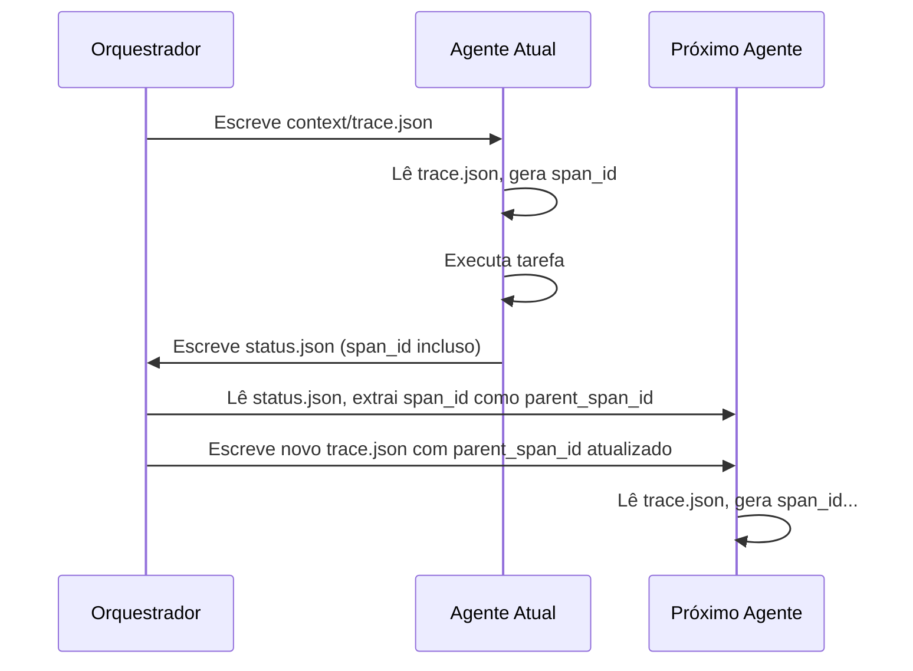

# 11 – Regras de Comunicação A2A (Agent-to-Agent)

## Propósito

Definir o contrato de comunicação confiável entre **agentes mestres** (master agents) do ecossistema MANTIS.  
Essa regra assegura que toda transferência de controle (_handoff_) entre agentes seja rastreável, auditável e resiliente, por meio de um esquema de contexto distribuído.

> **Escopo**: Exclusivamente para agentes mestres (Tier ≥ 2). Não se aplica a artefatos filhos, scripts isolados ou documentação.

---

## C9 – A2A Contract Compliance

**Definição canônica** (extraída de `harness-norms-v3.0.md`):

```
C9 exige que toda comunicação entre master agents cumpra o contrato A2A:
- trace_id (herdado do orquestador)
- parent_span_id (span_id do agente anterior)
- span_id (único, gerado pelo agente atual)
- status.json com schema completo ao final do trabalho
- context/trace.json presente antes do início do trabalho
```

### Campos Obrigatórios do Contrato A2A

#### Antes da execução (`context/trace.json`)
O orquestador deve gravar, antes de lançar o agente:
```json
{
  "trace_id": "uuid-raiz",
  "parent_span_id": "span-anterior-ou-null",
  "current_agent": "nome-do-agente",
  "task_id": "id-da-tarefa",
  "timestamp_injected": "ISO8601"
}
```

#### Após a execução (`status.json`)
O agente deve gravar, ao finalizar (com sucesso ou falha):
```json
{
  "agent_id": "nome-do-agente",
  "trace_id": "uuid-raiz",
  "span_id": "span-gerado-pelo-agente",
  "parent_span_id": "span-do-agente-anterior",
  "status": "completed | failed",
  "output_ref": "caminho/relativo/do/artefato/principal",
  "next_agent_hint": "sugestão-para-orquestador",
  "timestamp_completed": "ISO8601",
  "a2a_contract_version": "1.0"
}
```

### Regras de Ouro

1. **`trace_id` imutável** durante toda a cadeia de agentes.
2. **`parent_span_id` deve coincidir** com o `span_id` do agente imediatamente anterior.
3. **`span_id` único** por agente, gerado no início da execução (UUID v4 ou similar).
4. **`status.json` obrigatório** mesmo em caso de falha (com `status: failed`).
5. **Proibido handoff sem `trace.json`** – o agente deve recusar iniciar se o arquivo estiver ausente ou inválido.

---

## Fluxo de Handoff



---

## Validação (C9 Check)

A conformidade é verificada pelo script dedicado:

```bash
bash ./goals/check-a2a-contract.sh --task-id <id> --agent <nome> [--json]
```

**O script valida:**
- Existência de `status.json` no caminho esperado.
- Presença dos campos obrigatórios (`trace_id`, `span_id`, `parent_span_id`, `status`, `output_ref`).
- Coerência entre `trace_id` do `status.json` e do `context/trace.json` original.
- Formato UUID para `trace_id` e `span_id`.
- `status` é `completed` ou `failed`.

**Retorno:**  
Código de saída `0` se válido, `1` se violação de contrato.

---

## Penalidades por Violação

| Violação | Severidade | Consequência |
|----------|------------|--------------|
| `status.json` ausente | Crítica | Handoff bloqueado (fail-fast) |
| `trace_id` inconsistente | Crítica | Handoff bloqueado |
| `span_id` duplicado | Alta | Alerta + exigência de reexecução |
| Campos opcionais faltando | Baixa | Aviso, não bloqueante |

---

## Exemplos

### ✅ Conformidade
```bash
# Orquestrador prepara contexto
mkdir -p ./goals/task-123/context
cat > ./goals/task-123/context/trace.json <<EOF
{"trace_id":"550e8400-e29b-41d4-a716-446655440000","parent_span_id":null,"current_agent":"bash-master-agent","task_id":"task-123","timestamp_injected":"2026-05-18T22:00:00Z"}
EOF

# Agente executa e gera status.json
cat > ./goals/task-123/artifacts/bash-master-agent/status.json <<EOF
{"agent_id":"bash-master-agent","trace_id":"550e8400-e29b-41d4-a716-446655440000","span_id":"f47ac10b-58cc-4372-a567-0e02b2c3d479","parent_span_id":null,"status":"completed","output_ref":"artifacts/output.json","next_agent_hint":"go-master-agent","timestamp_completed":"2026-05-18T22:35:00Z","a2a_contract_version":"1.0"}
EOF

# Validação
bash ./goals/check-a2a-contract.sh --task-id task-123 --agent bash-master-agent --json
# Saída: {"status":"ok","message":"C9 compliant"}
```

### ❌ Violação
```json
// status.json sem parent_span_id → bloqueio
{
  "agent_id": "bash-master-agent",
  "trace_id": "...",
  "span_id": "...",
  "status": "completed"
}
```

---

## Referências

- [[01-RULES/harness-norms-v3.0.md]] – definição canônica de C9
- [[06-PROGRAMMING/template_master-agent.md]] – implementação nos agentes
- [[./goals/check-a2a-contract.sh]] – script validador
- [[./goals/README.md]] – sistema de metas MANTIS

---

> **Versão 1.0.0** | Contrato de comunicação confiável entre master agents MANTIS.
> Aplicável a partir de 2026-05-18.


---
