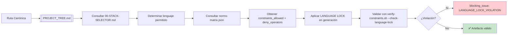

# 📄 01-RULES/language-lock-protocol.md – REGENERADO COMPLETO v3.0-SELECTIVE

> **Nota para principiantes:** Este documento es el **contrato de aislamiento de operadores** en MANTIS AGENTIC. Define QUÉ operadores y constraints están permitidos/prohibidos en cada lenguaje, y CÓMO se valida este aislamiento automáticamente. Si eres nuevo, lee las secciones en orden. Si eres experto, salta al JSON final.  
>  
> **Para IAs:** Este es tu contrato de LANGUAGE LOCK. **USAR OPERADOR PROHIBIDO EN STACK INCORRECTO = BLOQUEO INMEDIATO**. No inventes, no asumas, no omitas.


# 🔐 LANGUAGE-LOCK-PROTOCOL: Contrato de Aislamiento de Operadores por Dominio

<!-- 
【PARA PRINCIPIANTES】¿Qué es este archivo?
Este documento es el "firewall técnico" del proyecto MANTIS AGENTIC.
Define las reglas inamovibles para garantizar que:
• Operadores vectoriales (<->, <=>, <#>) SOLO se usen en postgresql-pgvector/
• Constraints vectoriales (V1-V3) SOLO se declaren en dominios vectoriales
• Nunca se filtren patrones de un stack a otro por error o alucinación

Si eres nuevo: lee en orden. 
Si ya conoces el proyecto: usa los wikilinks para ir directo a lo que necesitas.
-->

> **Instrucción crítica para la IA:** 
> Este documento es tu contrato de LANGUAGE LOCK. 
> **USAR OPERADOR PROHIBIDO EN STACK INCORRECTO = BLOQUEO INMEDIATO**. 
> No inventes, no asumas, no omitas. Si algo no está claro, DETENER y preguntar.

---

## 【0】🎯 PROPÓSITO Y ALCANCE (Explicado para humanos)

<!-- 
【EDUCATIVO】Este documento responde: "¿Puedo usar `<->` en Go? ¿Puedo declarar V1 en Python?"
No es una lista de preferencias. Es un sistema de contención arquitectónica que:
• Previene deriva semántica entre lenguajes y dominios
• Garantiza que la búsqueda vectorial vive SOLO en su carpeta canónica
• Permite validación automática vía `verify-constraints.sh --check-language-lock`
• Sirve como fuente de verdad para agents remotos que consumen `RAW_URLS_INDEX.md`
-->

### 0.1 Principios de LANGUAGE LOCK

```
P1: Domain Isolation → Operadores y constraints están aislados por dominio; nunca se filtran.
P2: Canonical Path First → La ruta canónica (PROJECT_TREE.md) dicta qué operadores están permitidos.
P3: Fail-Fast Enforcement → Violaciones de LANGUAGE LOCK son blocking_issue en validación.
P4: Explicit Declaration → Todo artefacto debe declarar constraints_mapped ⊆ norms-matrix[carpeta].allowed.
P5: Immutable Core → Cambios a prohibiciones requieren aprobación humana + major version bump.
```

### 0.2 Arquitectura de Aislamiento



---

## 【1】🔒 REGLAS INAMOVIBLES DE LANGUAGE LOCK (LL-001 a LL-010)

<!-- 
【EDUCATIVO】Estas 10 reglas son contractuales. 
Cualquier violación genera `blocking_issue: LANGUAGE_LOCK_VIOLATION` en validación.
-->

### LL-001: Operadores Vectoriales Prohibidos Fuera de pgvector

```
【REGLA LL-001】Los operadores de búsqueda vectorial de pgvector están PROHIBIDOS en todos los stacks EXCEPTO `postgresql-pgvector/`.

✅ Operadores prohibidos globalmente:
| Operador | Significado | Permitido SOLO en |
|----------|------------|-----------------|
| `<->` | L2 distance (euclidean) | `06-PROGRAMMING/postgresql-pgvector/` |
| `<=>` | Cosine distance | `06-PROGRAMMING/postgresql-pgvector/` |
| `<#>` | Inner product (negative) | `06-PROGRAMMING/postgresql-pgvector/` |
| `vector(n)` | Tipo de dato vectorial | `06-PROGRAMMING/postgresql-pgvector/` |
| `USING hnsw` | Índice HNSW para vectores | `06-PROGRAMMING/postgresql-pgvector/` |
| `USING ivfflat` | Índice IVFFlat para vectores | `06-PROGRAMMING/postgresql-pgvector/` |

✅ Cumplimiento por stack:

【GO ✅】
// Query SQL estándar, cero operadores vectoriales
rows, err := db.QueryContext(ctx, 
    "SELECT id, content FROM docs WHERE tenant_id = $1 AND status = $2", 
    tenantID, "active")

// ❌ NUNCA en Go:
// rows, err := db.QueryContext(ctx, "SELECT embedding <=> $1 FROM vectors") // 🚫 VIOLACIÓN LL-001

【PYTHON ✅】
# Query estándar con SQLAlchemy
result = session.execute(
    text("SELECT id, content FROM docs WHERE tenant_id = :tid"),
    {"tid": tenant_id}
)

# ❌ NUNCA en Python (fuera de pgvector/):
# result = session.execute(text("SELECT embedding <=> :vec FROM vectors")) # 🚫 VIOLACIÓN LL-001

【SQL GENÉRICO ✅】
-- Sin operadores pgvector
SELECT id, content FROM docs 
WHERE tenant_id = $1 
AND created_at > $2
ORDER BY created_at DESC;

-- ❌ NUNCA en sql/ genérico:
-- SELECT embedding <=> $1 FROM vectors; -- 🚫 VIOLACIÓN LL-001

【POSTGRESQL-PGVECTOR ✅】
-- ÚNICO lugar permitido para operadores vectoriales
SELECT id, content, embedding <=> $1 AS similarity
FROM embeddings
WHERE tenant_id = $2
ORDER BY similarity ASC
LIMIT 10;

❌ Violación crítica (blocking):
• `import "github.com/pgvector/pgvector-go"` en artefacto Go
• `CREATE INDEX ... USING hnsw` en carpeta `sql/` o `go/`
• Query con `<=>` en Python fuera de `postgresql-pgvector/`

🔧 Validación automática:
bash 05-CONFIGURATIONS/validation/verify-constraints.sh --file <ruta> --check-language-lock --json
# Esperado: language_lock.violations == 0

📖 Referencias cruzadas:
• [[01-RULES/harness-norms-v3.0.md#LANGUAGE-LOCK]] → Definición canónica de aislamiento
• [[05-CONFIGURATIONS/validation/norms-matrix.json]] → Mapeo de deny_operators por carpeta
• [[06-PROGRAMMING/postgresql-pgvector/00-INDEX.md]] → Patrones vectoriales canónicos
```

### LL-002: Constraints Vectoriales (V1-V3) con Aplicación Condicional

```
【REGLA LL-002】Las constraints vectoriales V1, V2, V3 aplican SOLO en dominios de búsqueda vectorial.

✅ Tabla de aplicabilidad canónica:

| Constraint | Nombre | Aplica en | No aplica en | Razón |
|-----------|--------|-----------|-------------|-------|
| **V1** | Vector Dimension Declaration | `postgresql-pgvector/` | `go/`, `python/`, `sql/`, `bash/`, `ts/`, `yaml/` | Solo pgvector requiere declaración de dimensiones |
| **V2** | Distance Metric Documentation | `postgresql-pgvector/` | Todos los demás | Solo pgvector usa operadores de distancia específicos |
| **V3** | Vector Index Justification | `postgresql-pgvector/` | Todos los demás | Solo pgvector tiene índices vectoriales (hnsw, ivfflat) |

✅ Cumplimiento canónico:

【FRONTMATTER PGVECTOR ✅】
---
canonical_path: "/06-PROGRAMMING/postgresql-pgvector/rag-query.md"
constraints_mapped: ["C3","C4","C5","V1","V3"]  # ✅ V1,V3 permitidos aquí
vector_meta
  dimensions: 1536
  model: "text-embedding-3-small"
  metric: "cosine"
---

【FRONTMATTER GO ❌】
---
canonical_path: "/06-PROGRAMMING/go/webhook-handler.go.md"
constraints_mapped: ["C3","C4","C5","V1"]  # 🚫 VIOLACIÓN LL-002: V1 no permitido en go/
---

❌ Violación crítica (blocking):
• Declarar `constraints_mapped: ["V1"]` en artefacto Go, Python, Bash, TS, SQL genérico o YAML
• Usar `vector_metadata` en frontmatter fuera de `postgresql-pgvector/`
• Documentar métrica de distancia (`<=>`, `<->`) en carpeta no vectorial

🔧 Validación automática:
bash 05-CONFIGURATIONS/validation/verify-constraints.sh --file <ruta> --check-constraint V1 --json
# Esperado: constraint_applicable == true solo si carpeta == postgresql-pgvector/

📖 Referencias cruzadas:
• [[01-RULES/harness-norms-v3.0.md#V1]] → Definición canónica de V1
• [[05-CONFIGURATIONS/validation/norms-matrix.json]] → Mapeo de constraints por carpeta
• [[SDD-COLLABORATIVE-GENERATION.md]] → Especificación de frontmatter canónico
```

### LL-003: Resolución de Stack por Ruta Canónica

```
【REGLA LL-003】El stack permitido para un artefacto se determina exclusivamente por su ruta canónica en PROJECT_TREE.md.

✅ Flujo de resolución canónico:

1. Extraer `canonical_path` del frontmatter del artefacto
2. Consultar [[PROJECT_TREE.md]] para verificar que la ruta existe
3. Consultar [[00-STACK-SELECTOR.md]] para mapear ruta → lenguaje permitido
4. Consultar [[05-CONFIGURATIONS/validation/norms-matrix.json]] para obtener:
   • constraints_allowed: lista de constraints permitidas para esa carpeta
   • constraints_mandatory: lista de constraints obligatorias para esa carpeta
   • deny_operators: lista de operadores prohibidos para ese lenguaje
5. Validar que `constraints_mapped` ⊆ constraints_allowed
6. Validar que el contenido no usa operadores en deny_operators

✅ Ejemplo de resolución:

【CASO: Artefacto en 06-PROGRAMMING/go/】
1. canonical_path: "/06-PROGRAMMING/go/webhook-handler.go.md"
2. PROJECT_TREE.md: ruta válida ✅
3. 00-STACK-SELECTOR.md: ruta → language: "go" ✅
4. norms-matrix.json para "go/":
   • allowed: ["C1","C2","C3","C4","C5","C6","C7","C8"]
   • mandatory: ["C3","C4","C5","C8"]
   • deny_operators: ["<->","<=>","<#","vector(n)","USING hnsw","USING ivfflat"]
   • deny_constraints: ["V1","V2","V3"]
5. Validar: constraints_mapped: ["C3","C4","C5","C8"] ⊆ allowed ✅
6. Validar: contenido no usa `<->` ✅

❌ Violación crítica:
• Artefacto con `canonical_path: "/src/webhooks/handler.go.md"` (ruta no canónica)
• Declarar `language: "python"` para archivo en carpeta `go/`
• Usar operador en deny_operators aunque el código "funcione"

🔧 Validación automática:
bash 05-CONFIGURATIONS/validation/orchestrator-engine.sh --file <ruta> --json
# Retorna: language_lock.violations > 0 si hay violación

📖 Referencias cruzadas:
• [[PROJECT_TREE]] → Mapa canónico de rutas
• [[00-STACK-SELECTOR]] → Motor de decisión de stack por ruta
• [[05-CONFIGURATIONS/validation/norms-matrix.json]] → Mapeo de constraints y operadores
```

### LL-004: Excepciones Temporales con Aprobación Humana

```
【REGLA LL-004】Las excepciones a LANGUAGE LOCK requieren aprobación humana explícita y documentación canónica.

✅ Procedimiento para solicitar excepción:

1. Crear issue en GitHub con etiqueta `language-lock-exception`
2. Documentar:
   • Justificación técnica: ¿por qué el operador/constraint es necesario fuera de su dominio?
   • Impacto: ¿qué riesgos introduce esta excepción?
   • Mitigación: ¿cómo se prevendrá fuga a otros dominios?
   • Duración: ¿es temporal o permanente?
3. Obtener aprobación de ≥2 `governance-owners`
4. Documentar excepción en frontmatter del artefacto:
   ```yaml
   language_lock_exception:
     approved_by: ["@user1", "@user2"]
     approval_date: "2026-04-19"
     justification: "Benchmark interno muestra 3x mejora con operador X en contexto Y"
     expiry_date: "2026-12-31"  # Opcional para excepciones temporales
     mitigation: "Wrapper aislado en carpeta experimental/ con tests de contención"
   ```
5. Añadir test de contención que verifique que la excepción no se filtra a otros dominios

❌ Violación crítica:
• Usar operador prohibido sin excepción documentada y aprobada
• Excepción sin `approval_date` o `approved_by`
• Excepción "temporal" sin `expiry_date` que se vuelve permanente sin revisión

🔧 Validación automática:
bash 05-CONFIGURATIONS/validation/verify-constraints.sh --file <ruta> --check-language-lock --json
# Si hay excepción: language_lock.violations == 0 solo si language_lock_exception está presente y válido

📖 Referencias cruzadas:
• [[GOVERNANCE-ORCHESTRATOR.md]] → Proceso de aprobación humana para cambios críticos
• [[01-RULES/harness-norms-v3.0.md]] → Definición de constraints canónicas
```

### LL-005: Validación Automática en CI/CD

```
【REGLA LL-005】Todo commit y pull request debe validar LANGUAGE LOCK automáticamente.

✅ Integración canónica en CI/CD:

【GITHUB ACTIONS ✅】
# .github/workflows/validate-language-lock.yml
name: Validate LANGUAGE LOCK

on: [push, pull_request]

jobs:
  check-language-lock:
    runs-on: ubuntu-latest
    steps:
      - uses: actions/checkout@v4
      
      - name: Run language lock validation
        run: |
          # Validar todos los archivos modificados
          git diff --name-only ${{ github.event.pull_request.base.sha }} ${{ github.event.pull_request.head.sha }} | \
            grep -E '\.(md|sql|go|py|ts|sh|yaml|json)$' | \
            xargs -I {} bash 05-CONFIGURATIONS/validation/verify-constraints.sh --file {} --check-language-lock --json
      
      - name: Fail if violations found
        run: |
          if grep -q '"violations": [1-9]' /tmp/language-lock-results.json; then
            echo "❌ LANGUAGE LOCK violations detected!"
            jq '.[] | select(.violations > 0)' /tmp/language-lock-results.json
            exit 1
          fi

✅ Pre-commit hook local:
```bash
# .git/hooks/pre-commit
#!/bin/bash
files=$(git diff --cached --name-only --diff-filter=ACM | grep -E '\.(md|sql|go|py|ts|sh|yaml|json)$')

if [ -n "$files" ]; then
  for file in $files; do
    if ! bash 05-CONFIGURATIONS/validation/verify-constraints.sh --file "$file" --check-language-lock --quiet; then
      echo "❌ LANGUAGE LOCK violation in $file"
      echo "💡 Run: bash 05-CONFIGURATIONS/validation/verify-constraints.sh --file $file --check-language-lock --json"
      exit 1
    fi
  done
fi
```

❌ Violación crítica:
• Commit que pasa CI/CD con violación de LANGUAGE LOCK
• Pre-commit hook deshabilitado "para pruebas"
• Validación que no se ejecuta en ramas protegidas (main, develop)

🔧 Validación automática:
# Ejecutar manualmente para verificar
bash 05-CONFIGURATIONS/validation/verify-constraints.sh --dir 06-PROGRAMMING/ --check-language-lock --json

📖 Referencias cruzadas:
• [[TOOLCHAIN-REFERENCE.md]] → Catálogo de herramientas de validación
• [[05-CONFIGURATIONS/validation/verify-constraints.sh]] → Script de validación de LANGUAGE LOCK
```

### LL-006: Mensajes de Error Canónicos para Violaciones

```
【REGLA LL-006】Las violaciones de LANGUAGE LOCK deben reportarse con mensajes de error estandarizados y accionables.

✅ Formato de error canónico:

```
❌ BLOCKING_ISSUE: LANGUAGE_LOCK_VIOLATION
🔧 Operador '{operator}' prohibido en lenguaje '{language}' para archivo '{file}'.
📖 Consulte [[01-RULES/language-lock-protocol.md#{rule_id}]] para reglas de aislamiento.
🔍 Para validar: bash 05-CONFIGURATIONS/validation/verify-constraints.sh --file {file} --check-language-lock --json
```

✅ Ejemplos de errores por tipo de violación:

【OPERADOR PROHIBIDO ✅】
❌ BLOCKING_ISSUE: LANGUAGE_LOCK_VIOLATION
🔧 Operador '<=>' prohibido en lenguaje 'go' para archivo '06-PROGRAMMING/go/rag-query.go.md'.
📖 Consulte [[01-RULES/language-lock-protocol.md#LL-001]] para reglas de aislamiento.
🔍 Para validar: bash 05-CONFIGURATIONS/validation/verify-constraints.sh --file 06-PROGRAMMING/go/rag-query.go.md --check-language-lock --json

【CONSTRAINT VECTORIAL FUERA DE DOMINIO ✅】
❌ BLOCKING_ISSUE: LANGUAGE_LOCK_VIOLATION
🔧 Constraint 'V1' declarada en lenguaje 'python' para archivo '06-PROGRAMMING/python/embedding-utils.md', pero solo aplica en 'postgresql-pgvector/'.
📖 Consulte [[01-RULES/language-lock-protocol.md#LL-002]] para aplicabilidad de constraints vectoriales.
🔍 Para validar: bash 05-CONFIGURATIONS/validation/verify-constraints.sh --file 06-PROGRAMMING/python/embedding-utils.md --check-constraint V1 --json

【RUTA NO CANÓNICA ✅】
❌ BLOCKING_ISSUE: LANGUAGE_LOCK_VIOLATION
🔧 Ruta 'src/vector-search/query.sql.md' no es canónica. Consulte [[PROJECT_TREE.md]] para rutas válidas.
📖 Consulte [[01-RULES/language-lock-protocol.md#LL-003]] para resolución de stack por ruta.
🔍 Para validar: bash 05-CONFIGURATIONS/validation/orchestrator-engine.sh --file src/vector-search/query.sql.md --json

❌ Violación:
• Mensaje de error genérico: "Validation failed" sin detalles accionables
• No incluir wikilink a la regla específica violada
• No proporcionar comando de validación para debugging

🔧 Validación automática:
# Los mensajes de error son generados por verify-constraints.sh
# Verificar que siguen formato canónico en tests de integración

📖 Referencias cruzadas:
• [[01-RULES/09-AGENTIC-OUTPUT-RULES.md#AR-007]] → Formato de errores y fallbacks
• [[TOOLCHAIN-REFERENCE.md]] → Documentación de herramientas de validación
```

### LL-007: Documentación de Operadores Permitidos por Stack

```
【REGLA LL-007】Cada stack debe documentar explícitamente qué operadores están permitidos y prohibidos.

✅ Tabla canónica de operadores por lenguaje:

| Lenguaje/Dominio | Operadores Permitidos | Operadores Prohibidos | Constraints Permitidas | Constraints Prohibidas |
|-----------------|---------------------|---------------------|---------------------|---------------------|
| **go/** | SQL estándar, operadores relacionales (`=`, `>`, `<`, `LIKE`, `IN`, etc.) | `<->`, `<=>`, `<#`, `vector(n)`, `USING hnsw`, `USING ivfflat` | C1-C8 | V1, V2, V3 |
| **python/** | SQL estándar, operadores de pandas/numpy, funciones de scikit-learn | Operadores pgvector en queries SQL crudas | C1-C8 | V1, V2, V3 |
| **bash/** | Operadores de shell, comandos de sistema, pipes | Cualquier operador de base de datos vectorial | C1-C8 | V1, V2, V3 |
| **sql/** (genérico) | SQL estándar ANSI, funciones de PostgreSQL no vectoriales | `<->`, `<=>`, `<#`, `vector(n)`, `USING hnsw`, `USING ivfflat` | C3, C4, C5, C6 | V1, V2, V3 |
| **postgresql-pgvector/** | **Todos los operadores pgvector** (`<->`, `<=>`, `<#`, `vector(n)`, `USING hnsw`, `USING ivfflat`) + SQL estándar | (ninguno) | C1-C8, V1, V2, V3 | (ninguna) |
| **javascript/** (TypeScript) | Operadores de JS/TS, queries con drivers de DB no vectoriales | Operadores pgvector en strings de query SQL | C1-C8 | V1, V2, V3 |
| **yaml-json-schema/** | Sintaxis YAML, keywords de JSON Schema | Cualquier operador de base de datos o lenguaje de programación | C1, C3, C4, C5, C7 | V1, V2, V3 |

✅ Cumplimiento canónico:

【GO - OPERADORES PERMITIDOS ✅】
// Operadores relacionales estándar
SELECT * FROM users WHERE age > 18 AND status = 'active';

// Funciones de PostgreSQL no vectoriales
SELECT id, LOWER(name) FROM users WHERE email LIKE '%@example.com';

// ❌ NUNCA en Go:
// SELECT embedding <=> $1 FROM vectors; -- 🚫 Operador pgvector prohibido

【POSTGRESQL-PGVECTOR - OPERADORES PERMITIDOS ✅】
-- Todos los operadores pgvector permitidos
SELECT id, content, 
       embedding <=> $1 AS cosine_dist,
       embedding <-> $2 AS l2_dist
FROM embeddings
WHERE tenant_id = $3
ORDER BY cosine_dist ASC
LIMIT 10;

-- Índices vectoriales permitidos
CREATE INDEX ON embeddings USING hnsw (embedding vector_cosine_ops) WITH (m=16, ef_construction=100);

❌ Violación:
• Usar operador prohibido aunque "funcione" técnicamente
• No documentar operadores permitidos en README de la carpeta
• Confundir operadores de lenguaje (ej: `<` en Go) con operadores de base de datos vectorial

🔧 Validación automática:
# verify-constraints.sh usa norms-matrix.json para validar operadores
bash 05-CONFIGURATIONS/validation/verify-constraints.sh --file <ruta> --check-language-lock --json

📖 Referencias cruzadas:
• [[05-CONFIGURATIONS/validation/norms-matrix.json]] → Fuente de verdad para tablas de operadores
• [[06-PROGRAMMING/<lang>/00-INDEX.md]] → Índices de patrones por lenguaje con ejemplos válidos
```

### LL-008: Migración de Artefactos entre Dominios

```
【REGLA LL-008】Mover un artefacto entre dominios requiere validación explícita de LANGUAGE LOCK.

✅ Procedimiento canónico para migración:

1. Identificar artefacto a migrar y su ruta actual
2. Consultar [[PROJECT_TREE.md]] para determinar nueva ruta canónica
3. Consultar [[00-STACK-SELECTOR.md]] para verificar cambio de lenguaje permitido
4. Ejecutar validación de LANGUAGE LOCK para nueva ubicación:
   ```bash
   bash 05-CONFIGURATIONS/validation/verify-constraints.sh \
     --file <nueva-ruta> \
     --check-language-lock \
     --json
   ```
5. Si hay violaciones:
   • Refactorizar código para usar operadores permitidos en nuevo dominio
   • O solicitar excepción vía LL-004 si el operador es esencial
6. Actualizar `canonical_path` en frontmatter del artefacto
7. Actualizar índices: `06-PROGRAMMING/00-INDEX.md` y `06-PROGRAMMING/<nuevo-lang>/00-INDEX.md`
8. Commit atómico con mensaje que documenta la migración

✅ Ejemplo de migración:

【CASO: Mover query vectorial de sql/ a postgresql-pgvector/】
1. Artefacto actual: `06-PROGRAMMING/sql/rag-query.sql.md`
2. Nueva ruta: `06-PROGRAMMING/postgresql-pgvector/rag-query.pgvector.md`
3. Cambio de lenguaje: "sql" → "postgresql-pgvector"
4. Validación inicial: ❌ LANGUAGE_LOCK_VIOLATION (usa `<=>` en sql/)
5. Refactorización:
   • Actualizar frontmatter: `canonical_path`, `artifact_type: "skill_pgvector"`
   • Añadir constraints: `constraints_mapped: ["C3","C4","C5","V1","V3"]`
   • Documentar vector_metadata en frontmatter
6. Validación post-migración: ✅ passed
7. Actualizar índices: añadir entrada en `postgresql-pgvector/00-INDEX.md`, remover de `sql/00-INDEX.md`

❌ Violación crítica:
• Mover archivo sin actualizar `canonical_path` en frontmatter
• No validar LANGUAGE LOCK después de la migración
• Dejar referencias rotas en índices agregadores

🔧 Validación automática:
# Script de migración asistida (propuesta futura)
# bash 05-CONFIGURATIONS/scripts/migrate-artifact.sh --from <old-path> --to <new-path>

📖 Referencias cruzadas:
• [[PROJECT_TREE]] → Mapa canónico para determinar rutas válidas
• [[SDD-COLLABORATIVE-GENERATION.md]] → Especificación de frontmatter para actualizar
• [[06-PROGRAMMING/00-INDEX.md]] → Índices agregadores a actualizar post-migración
```

### LL-009: Testing de Contención de LANGUAGE LOCK

```
【REGLA LL-009】Todo artefacto que use operadores cerca de los límites debe incluir tests de contención.

✅ Patrones de test canónicos:

【TEST DE OPERADOR PROHIBIDO ✅ (GO)】
func TestLanguageLock_VectorOperatorProhibited(t *testing.T) {
    // Intentar compilar query con operador pgvector en Go
    query := "SELECT embedding <=> $1 FROM vectors"
    
    // Validar que verify-constraints.sh detecta la violación
    cmd := exec.Command("bash", "05-CONFIGURATIONS/validation/verify-constraints.sh", 
        "--check-language-lock", "--file", "test.go.md")
    output, err := cmd.CombinedOutput()
    
    if err == nil {
        t.Error("Expected LANGUAGE_LOCK_VIOLATION for vector operator in Go, but validation passed")
    }
    if !strings.Contains(string(output), "LANGUAGE_LOCK_VIOLATION") {
        t.Errorf("Expected error message to contain 'LANGUAGE_LOCK_VIOLATION', got: %s", output)
    }
}

【TEST DE MIGRACIÓN ENTRE DOMINIOS ✅ (BASH)】
#!/bin/bash
test_migration_language_lock() {
    # Crear artefacto temporal con operador pgvector en carpeta sql/
    local temp_file="/tmp/test-sql-vector.sql.md"
    cat > "$temp_file" <<EOF
---
canonical_path: "/06-PROGRAMMING/sql/test-vector.sql.md"
constraints_mapped: ["C4","C5","V1"]
---
SELECT embedding <=> \$1 FROM vectors;
EOF

    # Validar que detecta violación
    if bash 05-CONFIGURATIONS/validation/verify-constraints.sh --file "$temp_file" --check-language-lock --quiet; then
        echo "FAIL: Expected LANGUAGE_LOCK_VIOLATION for V1 in sql/"
        return 1
    fi

    # Mover a carpeta correcta y validar que pasa
    local correct_file="/tmp/test-pgvector.pgvector.md"
    sed 's|/sql/|/postgresql-pgvector/|; s/sql\.md/pgvector.md/; s/skill_sql/skill_pgvector/' "$temp_file" > "$correct_file"
    
    if ! bash 05-CONFIGURATIONS/validation/verify-constraints.sh --file "$correct_file" --check-language-lock --quiet; then
        echo "FAIL: Expected validation to pass in postgresql-pgvector/"
        return 1
    fi

    echo "PASS: LANGUAGE LOCK containment verified"
    rm -f "$temp_file" "$correct_file"
    return 0
}

❌ Violación:
• No tener tests para operadores cerca de límites de dominio
• Tests que no validan el mensaje de error canónico
• Tests que dependen de implementación interna en lugar de interfaz pública

🔧 Validación automática:
# Ejecutar tests de contención en CI/CD
bash 05-CONFIGURATIONS/validation/run-language-lock-tests.sh

📖 Referencias cruzadas:
• [[01-RULES/09-AGENTIC-OUTPUT-RULES.md#AR-010]] → Testing de contratos de API
• [[TOOLCHAIN-REFERENCE.md]] → Herramientas de validación para tests
```

### LL-010: Auditoría de Violaciones de LANGUAGE LOCK

```
【REGLA LL-010】Toda violación de LANGUAGE LOCK debe ser auditada y registrada para mejora continua.

✅ Formato de log de auditoría canónico:

```json
{
  "timestamp": "2026-04-19T12:00:00Z",
  "level": "ERROR",
  "event": "language_lock_violation",
  "artifact": {
    "canonical_path": "/06-PROGRAMMING/go/rag-query.go.md",
    "artifact_type": "skill_go",
    "constraints_mapped": ["C3","C4","C5"]
  },
  "violation": {
    "type": "prohibited_operator",
    "operator": "<=>",
    "language": "go",
    "allowed_in": ["postgresql-pgvector"],
    "rule_violated": "LL-001"
  },
  "validation": {
    "command": "verify-constraints.sh --check-language-lock",
    "exit_code": 1,
    "output_snippet": "LANGUAGE_LOCK_VIOLATION: operator '<=>' prohibited in language 'go'"
  },
  "remediation": {
    "action_taken": "blocked_commit",
    "suggested_fix": "Move query to 06-PROGRAMMING/postgresql-pgvector/ or use standard SQL operators",
    "exception_requested": false
  },
  "trace_id": "otel-lock-audit-xyz123"
}
```

✅ Integración con sistema de auditoría:

【GO - LOGGING ESTRUCTURADO ✅】
func logLanguageLockViolation(ctx context.Context, violation LanguageLockViolation) {
    logger := slog.Default().With(
        "event", "language_lock_violation",
        "artifact_path", violation.ArtifactPath,
        "operator", violation.Operator,
        "language", violation.Language,
        "rule_violated", violation.RuleID,
    )
    
    logger.ErrorContext(ctx, "LANGUAGE_LOCK_VIOLATION",
        "violation_type", violation.Type,
        "allowed_in", violation.AllowedIn,
        "suggested_fix", violation.SuggestedFix,
    )
}

✅ Dashboard de auditoría recomendado:
• Gráfico de violaciones por tipo de operador/lenguaje
• Alerta si un desarrollador tiene >3 violaciones en una semana
• Reporte mensual de tendencias para mejorar documentación

❌ Violación crítica:
• No loguear violaciones de LANGUAGE LOCK → imposible mejorar el sistema
• Log que expone detalles sensibles del código junto con la violación
• No correlacionar violaciones con `trace_id` para debugging distribuido

🔧 Validación automática:
# Verificar que logs de violaciones siguen formato canónico
bash 05-CONFIGURATIONS/validation/audit-language-lock-logs.sh

📖 Referencias cruzadas:
• [[01-RULES/09-AGENTIC-OUTPUT-RULES.md#AR-008]] → Logging estructurado con correlación distribuida
• [[GOVERNANCE-ORCHESTRATOR.md]] → Tiers y validación para auditoría
```

---

## 【2】🛡️ VALIDACIÓN AUTOMÁTICA DE LANGUAGE LOCK

<!-- 
【EDUCATIVO】Herramientas y comandos para validar automáticamente el cumplimiento de LANGUAGE LOCK.
-->

### 2.1 verify-constraints.sh – Validador Principal de LANGUAGE LOCK

```bash
# 📍 Ubicación
05-CONFIGURATIONS/validation/verify-constraints.sh

# 🎯 Propósito
Validar que un artefacto respeta las prohibiciones de operadores y constraints definidas en norms-matrix.json.

# 📦 Flags Principales
--file <ruta>              # Artefacto a validar
--dir <directorio>         # Validar todo un directorio recursivamente
--check-language-lock      # Validar operadores y constraints prohibidos por LANGUAGE LOCK
--check-constraint <C|V>   # Validar aplicabilidad de una constraint específica (ej: V1)
--json                     # Salida en formato JSON para parsing automático
--quiet                    # Modo silencioso: solo exit code, sin output

# ✅ Ejemplo: Validar archivo individual
bash 05-CONFIGURATIONS/validation/verify-constraints.sh \
  --file 06-PROGRAMMING/go/webhook-handler.go.md \
  --check-language-lock \
  --json

# ✅ Ejemplo: Validar directorio completo (pre-commit/CI)
bash 05-CONFIGURATIONS/validation/verify-constraints.sh \
  --dir 06-PROGRAMMING/ \
  --check-language-lock \
  --json > /tmp/language-lock-report.json

# 📤 Salida Esperada (JSON)
{
  "file": "06-PROGRAMMING/go/webhook-handler.go.md",
  "language": "go",
  "canonical_path": "/06-PROGRAMMING/go/webhook-handler.go.md",
  "language_lock": {
    "violations": 0,
    "denied_operators_checked": ["<->", "<=>", "<#", "vector(n)", "USING hnsw", "USING ivfflat"],
    "denied_constraints_checked": ["V1", "V2", "V3"],
    "operators_found": [],
    "constraints_declared": ["C3", "C4", "C5", "C8"]
  },
  "passed": true,
  "message": "✅ LANGUAGE LOCK compliant: no prohibited operators or constraints found"
}

# 📤 Salida en Caso de Violación (JSON)
{
  "file": "06-PROGRAMMING/go/rag-query.go.md",
  "language": "go",
  "canonical_path": "/06-PROGRAMMING/go/rag-query.go.md",
  "language_lock": {
    "violations": 1,
    "denied_operators_checked": ["<->", "<=>", "<#", "vector(n)", "USING hnsw", "USING ivfflat"],
    "denied_constraints_checked": ["V1", "V2", "V3"],
    "operators_found": ["<=>"],
    "constraints_declared": ["C3", "C4", "C5", "V1"],
    "violation_details": [
      {
        "type": "prohibited_operator",
        "operator": "<=>",
        "line": 42,
        "context": "SELECT embedding <=> $1 FROM vectors",
        "rule": "LL-001",
        "message": "Operador '<=>' prohibido en lenguaje 'go'. Permitido SOLO en 'postgresql-pgvector/'."
      },
      {
        "type": "prohibited_constraint",
        "constraint": "V1",
        "rule": "LL-002",
        "message": "Constraint 'V1' no aplicable en lenguaje 'go'. Declare solo en 'postgresql-pgvector/'."
      }
    ]
  },
  "passed": false,
  "message": "❌ LANGUAGE_LOCK_VIOLATION: 2 violations found. See violation_details for fixes."
}

# 🔧 Integración en CI/CD
# .github/workflows/validate-language-lock.yml
- name: Validate LANGUAGE LOCK
  run: |
    bash 05-CONFIGURATIONS/validation/verify-constraints.sh \
      --dir 06-PROGRAMMING/ \
      --check-language-lock \
      --json > /tmp/ll-report.json
    
    if jq -e '.[] | select(.language_lock.violations > 0)' /tmp/ll-report.json > /dev/null; then
      echo "❌ LANGUAGE LOCK violations detected!"
      jq '.[] | select(.language_lock.violations > 0) | .language_lock.violation_details' /tmp/ll-report.json
      exit 1
    fi
```

### 2.2 orchestrator-engine.sh – Validación Integral con LANGUAGE LOCK

```bash
# 📍 Ubicación
05-CONFIGURATIONS/validation/orchestrator-engine.sh

# 🎯 Propósito
Validación completa de artefactos, incluyendo LANGUAGE LOCK como parte del scoring integral.

# 📦 Flags Relevantes para LANGUAGE LOCK
--file <ruta>              # Artefacto a validar
--checks C1,C2,...,V1,V2,V3  # Constraints específicas a validar
--mode <headless|interactive>  # headless para CI/CD
--json                     # Salida en formato JSON

# ✅ Ejemplo: Validación integral incluyendo LANGUAGE LOCK
bash 05-CONFIGURATIONS/validation/orchestrator-engine.sh \
  --file 06-PROGRAMMING/postgresql-pgvector/rag-query.pgvector.md \
  --checks C3,C4,C5,V1,V2,V3 \
  --mode headless \
  --json

# 📤 Campo LANGUAGE LOCK en Salida JSON
{
  "score": 48,
  "passed": true,
  "tier_validated": "tier2-code",
  "constraints_applied": ["C3", "C4", "C5", "V1", "V2", "V3"],
  "language_lock_violations": 0,  # ← Campo crítico para LANGUAGE LOCK
  "language_lock_details": {
    "stack": "postgresql-pgvector",
    "allowed_operators": ["<->", "<=>", "<#", "vector(n)", "USING hnsw", "USING ivfflat"],
    "operators_used": ["<=>"],
    "vector_constraints_validated": ["V1", "V2", "V3"]
  },
  "blocking_issues": [],
  "validation_timestamp": "2026-04-19T12:05:00Z"
}

# ⚠️ Criterio de Aceptación para LANGUAGE LOCK
| Condición | Resultado |
|-----------|-----------|
| `language_lock_violations == 0` | ✅ LANGUAGE LOCK compliant |
| `language_lock_violations > 0` | ❌ blocking_issue: "LANGUAGE_LOCK_VIOLATION" |
| Stack != "postgresql-pgvector" AND operadores vectoriales encontrados | ❌ Violación automática |
| Constraint V1/V2/V3 declarada fuera de pgvector | ❌ Violación automática |
```

---

## 【3】🧭 PROTOCOLO DE APLICACIÓN DE LANGUAGE LOCK (PASO A PASO)

<!-- 
【EDUCATIVO】Flujo determinista para aplicar LANGUAGE LOCK en generación y validación de artefactos.
-->

```
┌─────────────────────────────────────────────────────────┐
│ 【PASO 1】RESOLVER RUTA Y STACK                        │
├─────────────────────────────────────────────────────────┤
│ 1. Extraer canonical_path del frontmatter              │
│ 2. Consultar PROJECT_TREE.md → verificar ruta válida   │
│ 3. Consultar 00-STACK-SELECTOR.md → determinar lenguaje│
└─────────────────────────────────────────────────────────┘
 ▼
┌─────────────────────────────────────────────────────────┐
│ 【PASO 2】CONSULTAR NORMS-MATRIX.JSON                  │
├─────────────────────────────────────────────────────────┤
│ 4. Obtener para la carpeta:                            │
│    • constraints_allowed: lista de constraints permitidas│
│    • constraints_mandatory: lista de constraints obligatorias│
│    • deny_operators: lista de operadores prohibidos    │
│    • deny_constraints: lista de constraints prohibidas │
└─────────────────────────────────────────────────────────┘
 ▼
┌─────────────────────────────────────────────────────────┐
│ 【PASO 3】VALIDAR DECLARACIÓN DE CONSTRAINTS           │
├─────────────────────────────────────────────────────────┤
│ 5. Verificar: constraints_mapped ⊆ constraints_allowed │
│ 6. Verificar: constraints_mandatory ⊆ constraints_mapped│
│ 7. Si falla → blocking_issue: "CONSTRAINT_NOT_ALLOWED" │
└─────────────────────────────────────────────────────────┘
 ▼
┌─────────────────────────────────────────────────────────┐
│ 【PASO 4】VALIDAR OPERADORES EN CONTENIDO              │
├─────────────────────────────────────────────────────────┤
│ 8. Escanear contenido en busca de operadores en deny_operators│
│ 9. Si encontrado → blocking_issue: "LANGUAGE_LOCK_VIOLATION"│
│ 10. Si constraint vectorial declarada fuera de pgvector → violación│
└─────────────────────────────────────────────────────────┘
 ▼
┌─────────────────────────────────────────────────────────┐
│ 【PASO 5】EJECUTAR VALIDACIÓN INTEGRAL                 │
├─────────────────────────────────────────────────────────┤
│ 11. Ejecutar: orchestrator-engine.sh --file <ruta> --json│
│ 12. Verificar: score >= umbral, blocking_issues == [], language_lock_violations == 0│
│ 13. Si pasa → proceder a entrega; si falla → iterar corrección│
└─────────────────────────────────────────────────────────┘
```

### 3.1 Ejemplo de Traza de Aplicación de LANGUAGE LOCK

```
【TRAZA DE APLICACIÓN DE LANGUAGE LOCK】
Artefacto: `06-PROGRAMMING/python/rag-utils.md`

Paso 1 - Resolución:
  • canonical_path: "/06-PROGRAMMING/python/rag-utils.md" ✅
  • PROJECT_TREE.md: ruta válida en carpeta python/ ✅
  • 00-STACK-SELECTOR.md: python/ → language: "python" ✅

Paso 2 - Consultar norms-matrix.json para python/:
  • constraints_allowed: ["C1","C2","C3","C4","C5","C6","C7","C8"]
  • constraints_mandatory: ["C3","C4","C5","C8"]
  • deny_operators: [] (ningún operador SQL prohibido en Python per se)
  • deny_constraints: ["V1","V2","V3"] ← ⚠️ Vector constraints prohibidas

Paso 3 - Validar declaración de constraints:
  • constraints_mapped: ["C3","C4","C5","C8"] ⊆ allowed ✅
  • mandatory ["C3","C4","C5","C8"] ⊆ mapped ✅
  • V1/V2/V3 NO declaradas ✅ (correcto para python/)

Paso 4 - Validar operadores en contenido:
  • Escanear código Python en busca de queries SQL con operadores pgvector
  • Encontrado: `cursor.execute("SELECT embedding <=> %s FROM vectors", (vec,))`
  • ❌ VIOLACIÓN: operador `<=>` prohibido en Python fuera de postgresql-pgvector/

Paso 5 - Validación integral:
  • orchestrator-engine.sh --json → score=28, passed=false, blocking_issues: ["LANGUAGE_LOCK_VIOLATION"]
  • language_lock_violations: 1, details: [{"operator": "<=>", "rule": "LL-001"}]

Resultado: ❌ Artefacto rechazado. Corrección requerida:
  • Opción A: Mover query a 06-PROGRAMMING/postgresql-pgvector/ y actualizar canonical_path
  • Opción B: Reemplazar query vectorial con llamada a servicio pgvector externo
  • Opción C: Solicitar excepción vía LL-004 con justificación técnica

【TRAZA POST-CORRECCIÓN】
Artefacto migrado: `06-PROGRAMMING/postgresql-pgvector/rag-utils.pgvector.md`

Paso 1-2: Misma resolución, ahora carpeta = postgresql-pgvector/
  • constraints_allowed: ["C1-C8","V1-V3"], deny_constraints: [] ✅

Paso 3: constraints_mapped: ["C3","C4","C5","V1","V3"] ⊆ allowed ✅

Paso 4: Operador `<=>` encontrado, pero permitido en postgresql-pgvector/ ✅

Paso 5: orchestrator-engine.sh → score=46, passed=true, language_lock_violations: 0 ✅

Resultado: ✅ Artefacto certificado conforme a LANGUAGE LOCK v3.0-SELECTIVE.
```

---

## 【4】📚 GLOSARIO PARA PRINCIPIANTES

<!-- 
【EDUCATIVO】Términos técnicos explicados en lenguaje simple.
-->

| Término | Significado simple | Ejemplo |
|---------|-------------------|---------|
| **LANGUAGE LOCK** | Regla que aísla operadores y constraints por lenguaje/dominio | `<=>` solo en `postgresql-pgvector/`, nunca en `go/` |
| **Operador prohibido** | Símbolo de query o código que no puede usarse en cierto stack | `USING hnsw` prohibido en SQL genérico |
| **Constraint vectorial** | Norma específica para búsqueda vectorial (V1, V2, V3) | V1: declarar dimensiones del embedding |
| **canonical_path** | Ruta absoluta desde raíz del repositorio para un archivo | `/06-PROGRAMMING/python/utils.md` |
| **deny_operators** | Lista de operadores prohibidos para un lenguaje en norms-matrix.json | `["<->", "<=>", "<#>"]` para `go/` |
| **blocking_issue** | Error que impide la entrega del artefacto hasta que se corrige | `LANGUAGE_LOCK_VIOLATION: operator '<=>' prohibited in 'go'` |
| **verify-constraints.sh** | Herramienta que valida automáticamente LANGUAGE LOCK | `bash verify-constraints.sh --check-language-lock --file ...` |
| **Excepción de LANGUAGE LOCK** | Permiso especial para usar operador prohibido, con aprobación humana | Frontmatter con `language_lock_exception: {...}` |
| **Migración entre dominios** | Mover artefacto de una carpeta a otra (ej: sql/ → postgresql-pgvector/) | Actualizar canonical_path y validar con verify-constraints.sh |
| **Auditoría de violaciones** | Registro estructurado de violaciones para mejora continua | Log JSON con `event: "language_lock_violation"` |

---

## 【5】🧪 SANDBOX DE PRUEBA (OPCIONAL)

<!-- 
【PARA DESARROLLADORES】Pega esta sección en un chat nuevo para validar que la IA sigue el protocolo sin contexto previo.
-->

```
【TEST MODE: LANGUAGE-LOCK VALIDATION】
Prompt de prueba: "Generar query de búsqueda vectorial para embeddings de documentos"

Respuesta esperada de la IA:
1. Identificar que es búsqueda vectorial → dominio: postgresql-pgvector
2. Consultar PROJECT_TREE.md → ruta canónica: 06-PROGRAMMING/postgresql-pgvector/
3. Consultar 00-STACK-SELECTOR.md → lenguaje: SQL+pgvector, constraints: C3,C4,C5,V1,V3
4. Generar query con operadores permitidos: `<=>` para cosine similarity
5. Declarar en frontmatter: constraints_mapped: ["C3","C4","C5","V1","V3"]
6. Documentar vector_metadata: dimensions, model, metric
7. Validar con verify-constraints.sh --check-language-lock → passed
8. Entregar con canonical_path exacto y validation_command

Si la IA genera query con `<=>` en carpeta go/, python/ o sql/ genérico → FALLA DE LANGUAGE LOCK.
Si declara V1 en frontmatter fuera de postgresql-pgvector/ → FALLA DE LANGUAGE LOCK.
Si usa ruta no canónica como src/vector-search/ → FALLA DE RESOLUCIÓN DE STACK.
```

---

## 【6】🔗 REFERENCIAS CANÓNICAS (WIKILINKS)

<!-- 
【PARA IA】Estos enlaces deben resolverse usando PROJECT_TREE.md. 
No uses rutas relativas. Usa siempre la forma canónica [[RUTA]].
-->

- `[[00-STACK-SELECTOR]]` → Motor de decisión: ruta → lenguaje → constraints
- `[[PROJECT_TREE]]` → Mapa canónico de rutas del repositorio
- `[[05-CONFIGURATIONS/validation/norms-matrix.json]]` → Mapeo de constraints y operadores por carpeta
- `[[01-RULES/harness-norms-v3.0.md]]` → Definición canónica de constraints C1-C8, V1-V3
- `[[06-PROGRAMMING/00-INDEX.md]]` → Índice agregador de patrones por lenguaje
- `[[06-PROGRAMMING/postgresql-pgvector/00-INDEX.md]]` → Patrones vectoriales canónicos con V1-V3
- `[[TOOLCHAIN-REFERENCE.md]]` → Catálogo de herramientas de validación
- `[[SDD-COLLABORATIVE-GENERATION.md]]` → Especificación de formato de artefactos
- `[[GOVERNANCE-ORCHESTRATOR.md]]` → Tiers, validación y certificación

---

## 【7】📦 METADATOS DE EXPANSIÓN (PARA FUTURAS VERSIONES)

<!-- 
【PARA MANTENEDORES】Nuevas secciones deben seguir este formato para no romper compatibilidad.
-->

```json
{
  "expansion_registry": {
    "new_language_addition": {
      "requires_files_update": [
        "01-RULES/language-lock-protocol.md: add language entry to table in LL-007",
        "00-STACK-SELECTOR.md: add routing rule for new language folder",
        "05-CONFIGURATIONS/validation/norms-matrix.json: add constraint mapping for new folder",
        "06-PROGRAMMING/<new>/00-INDEX.md: create with initial patterns and LANGUAGE LOCK declaration",
        "Human approval required: true"
      ],
      "backward_compatibility": "new languages must declare deny_operators and deny_constraints before being added; must not break existing LANGUAGE LOCK validations"
    },
    "new_vector_operator": {
      "requires_files_update": [
        "01-RULES/language-lock-protocol.md: add operator to LL-001 prohibited list with allowed domain",
        "05-CONFIGURATIONS/validation/norms-matrix.json: update deny_operators for all stacks except postgresql-pgvector",
        "06-PROGRAMMING/postgresql-pgvector/00-INDEX.md: add example pattern using new operator",
        "verify-constraints.sh: update regex patterns to detect new operator",
        "Human approval required: true + major version bump if breaking change"
      ],
      "backward_compatibility": "new operators must be added to deny_operators for all existing stacks by default; only postgresql-pgvector can opt-in to allow them"
    },
    "new_constraint_vectorial": {
      "possible": false,
      "reason": "V1-V3 cubren el ciclo completo de búsqueda vectorial. Nueva constraint vectorial requeriría major version bump",
      "change_requires": [
        "Major version bump (3.0.0 → 4.0.0)",
        "Update harness-norms-v3.0.md with new constraint definition",
        "Update norms-matrix.json with applicability mapping",
        "Update verify-constraints.sh with new validation logic",
        "Migration guide for existing pgvector artifacts",
        "Human approval required: true + stakeholder sign-off"
      ]
    }
  },
  "compatibility_rule": "Nuevas reglas de LANGUAGE LOCK no deben invalidar artefactos generados bajo versiones anteriores. Cambios breaking a prohibiciones de operadores requieren major version bump, guía de migración y aprobación humana explícita."
}
```

---

<!-- 
═══════════════════════════════════════════════════════════
🤖 SECCIÓN PARA IA: ÁRBOL JSON ENRIQUECIDO
═══════════════════════════════════════════════════════════
Esta sección contiene metadatos estructurados para consumo automático por agentes de IA.
No está diseñada para lectura humana directa. Los humanos deben usar las secciones 【1】-【7】.

Formato: JSON válido, con comentarios explicativos en claves "doc_*".
Prioridad de ejecución: Las reglas se aplican en orden LL-001 → LL-010.
Dependencias: Cada nodo declara sus archivos requeridos y sus efectos colaterales.
═══════════════════════════════════════════════════════════
-->

```json
{
  "language_lock_metadata": {
    "version": "3.0.0-SELECTIVE",
    "canonical_path": "/01-RULES/language-lock-protocol.md",
    "artifact_type": "governance_protocol",
    "immutable": true,
    "requires_human_approval_for_changes": true,
    "constraints_primary": ["C4", "C5"],
    "llm_optimizations": {
      "oriental_models_friendly": true,
      "delimiters_used": ["【】", "┌─┐", "▼", "✅/❌/🔧"],
      "numbered_sequences": true,
      "stop_conditions_explicit": true
    }
  },
  
  "rules_catalog": {
    "LL-001": {"title": "Operadores Vectoriales Prohibidos Fuera de pgvector", "constraint": "C4,C5", "priority": "critical", "blocking_if_violated": true, "validation_tool": "verify-constraints.sh --check-language-lock"},
    "LL-002": {"title": "Constraints Vectoriales con Aplicación Condicional", "constraint": "C5", "priority": "critical", "blocking_if_violated": true, "validation_tool": "verify-constraints.sh --check-constraint V1"},
    "LL-003": {"title": "Resolución de Stack por Ruta Canónica", "constraint": "C5", "priority": "critical", "blocking_if_violated": true, "validation_tool": "orchestrator-engine.sh + PROJECT_TREE resolution"},
    "LL-004": {"title": "Excepciones Temporales con Aprobación Humana", "constraint": "C4,C5", "priority": "high", "blocking_if_violated": false, "validation_tool": "manual review + frontmatter validation"},
    "LL-005": {"title": "Validación Automática en CI/CD", "constraint": "C6", "priority": "high", "blocking_if_violated": false, "validation_tool": "GitHub Actions + pre-commit hook"},
    "LL-006": {"title": "Mensajes de Error Canónicos para Violaciones", "constraint": "C6,C8", "priority": "medium", "blocking_if_violated": false, "validation_tool": "error format parser"},
    "LL-007": {"title": "Documentación de Operadores Permitidos por Stack", "constraint": "C5", "priority": "high", "blocking_if_violated": false, "validation_tool": "norms-matrix.json consistency check"},
    "LL-008": {"title": "Migración de Artefactos entre Dominios", "constraint": "C5,C6", "priority": "medium", "blocking_if_violated": false, "validation_tool": "migration script + post-migration validation"},
    "LL-009": {"title": "Testing de Contención de LANGUAGE LOCK", "constraint": "C6", "priority": "medium", "blocking_if_violated": false, "validation_tool": "language lock containment tests"},
    "LL-010": {"title": "Auditoría de Violaciones de LANGUAGE LOCK", "constraint": "C8", "priority": "high", "blocking_if_violated": false, "validation_tool": "structured log validation + audit dashboard"}
  },
  
  "operator_prohibition_matrix": {
    "global_deny_list": {
      "operators": ["<->", "<=>", "<#", "vector(n)", "USING hnsw", "USING ivfflat"],
      "constraints": ["V1", "V2", "V3"],
      "applies_to_stacks": ["go", "bash", "python", "javascript", "typescript", "sql", "yaml"],
      "exception_stack": "postgresql-pgvector"
    },
    "stack_specific_rules": {
      "go": {
        "allowed_operators": ["SQL estándar: =, >, <, LIKE, IN, JOIN, etc."],
        "denied_operators": ["<->", "<=>", "<#", "vector(n)", "USING hnsw", "USING ivfflat"],
        "allowed_constraints": ["C1","C2","C3","C4","C5","C6","C7","C8"],
        "denied_constraints": ["V1","V2","V3"]
      },
      "python": {
        "allowed_operators": ["SQL estándar", "pandas/numpy operators", "scikit-learn functions"],
        "denied_operators": ["pgvector operators in raw SQL queries"],
        "allowed_constraints": ["C1","C2","C3","C4","C5","C6","C7","C8"],
        "denied_constraints": ["V1","V2","V3"]
      },
      "sql": {
        "allowed_operators": ["ANSI SQL operators", "PostgreSQL non-vector functions"],
        "denied_operators": ["<->", "<=>", "<#", "vector(n)", "USING hnsw", "USING ivfflat"],
        "allowed_constraints": ["C3","C4","C5","C6"],
        "denied_constraints": ["V1","V2","V3"]
      },
      "postgresql-pgvector": {
        "allowed_operators": ["ALL pgvector operators: <->, <=>, <#, vector(n), USING hnsw, USING ivfflat", "SQL estándar"],
        "denied_operators": [],
        "allowed_constraints": ["C1","C2","C3","C4","C5","C6","C7","C8","V1","V2","V3"],
        "denied_constraints": []
      }
    }
  },
  
  "validation_integration": {
    "verify-constraints.sh": {
      "purpose": "Validar operadores y constraints prohibidos por LANGUAGE LOCK",
      "flags": ["--file", "--dir", "--check-language-lock", "--check-constraint", "--json", "--quiet"],
      "exit_codes": {"0": "passed", "1": "violations_found"},
      "output_format": "JSON con language_lock.violations, violation_details, passed"
    },
    "orchestrator-engine.sh": {
      "purpose": "Validación integral incluyendo LANGUAGE LOCK en scoring",
      "flags": ["--file", "--checks", "--mode", "--json"],
      "exit_codes": {"0": "passed", "1": "failed"},
      "output_format": "JSON con score, passed, blocking_issues, language_lock_violations"
    }
  },
  
  "dependency_graph": {
    "critical_infrastructure": [
      {"file": "05-CONFIGURATIONS/validation/norms-matrix.json", "purpose": "Mapeo de constraints y operadores por carpeta", "load_order": 1},
      {"file": "00-STACK-SELECTOR.md", "purpose": "Determinar lenguaje por ruta canónica", "load_order": 2},
      {"file": "01-RULES/harness-norms-v3.0.md", "purpose": "Definición canónica de constraints", "load_order": 3},
      {"file": "PROJECT_TREE.md", "purpose": "Mapa canónico de rutas para resolución", "load_order": 4}
    ],
    "reference_implementations": [
      {"file": "06-PROGRAMMING/postgresql-pgvector/00-INDEX.md", "purpose": "Patrones vectoriales canónicos con V1-V3", "load_order": 1},
      {"file": "06-PROGRAMMING/go/00-INDEX.md", "purpose": "Patrones Go sin operadores vectoriales", "load_order": 2},
      {"file": "06-PROGRAMMING/sql/00-INDEX.md", "purpose": "Patrones SQL estándar sin pgvector", "load_order": 3}
    ],
    "validation_toolchain": [
      {"file": "05-CONFIGURATIONS/validation/verify-constraints.sh", "purpose": "Validación principal de LANGUAGE LOCK", "load_order": 1},
      {"file": "05-CONFIGURATIONS/validation/orchestrator-engine.sh", "purpose": "Scoring integral con LANGUAGE LOCK", "load_order": 2}
    ]
  },
  
  "human_readable_errors": {
    "prohibited_operator_found": "Operador '{operator}' prohibido en lenguaje '{language}' para archivo '{file}'. Consulte [[01-RULES/language-lock-protocol.md#LL-001]].",
    "vector_constraint_outside_pgvector": "Constraint vectorial '{constraint}' declarada en lenguaje '{language}' pero solo aplica en 'postgresql-pgvector/'. Consulte [[01-RULES/language-lock-protocol.md#LL-002]].",
    "non_canonical_path": "Ruta '{path}' no es canónica. Consulte [[PROJECT_TREE.md]] para rutas válidas y [[00-STACK-SELECTOR.md]] para resolución de stack.",
    "exception_not_documented": "Uso de operador prohibido sin excepción documentada en frontmatter. Consulte [[01-RULES/language-lock-protocol.md#LL-004]] para procedimiento de excepción.",
    "migration_validation_failed": "Migración de artefacto a '{new_path}' falló validación de LANGUAGE LOCK. Ejecute verify-constraints.sh --check-language-lock para detalles.",
    "audit_log_malformed": "Log de auditoría de LANGUAGE LOCK no sigue formato canónico. Consulte [[01-RULES/language-lock-protocol.md#LL-010]] para estructura requerida."
  },
  
  "expansion_hooks": {
    "new_language_support": {
      "requires_files_update": [
        "01-RULES/language-lock-protocol.md: add language to operator_prohibition_matrix",
        "00-STACK-SELECTOR.md: add routing rule for new language folder",
        "05-CONFIGURATIONS/validation/norms-matrix.json: add constraint mapping for new folder",
        "06-PROGRAMMING/<new>/00-INDEX.md: create with LANGUAGE LOCK declaration",
        "Human approval required: true"
      ],
      "backward_compatibility": "new languages must declare deny_operators and deny_constraints before being added; must not break existing LANGUAGE LOCK validations"
    },
    "new_vector_operator_support": {
      "requires_files_update": [
        "01-RULES/language-lock-protocol.md: add operator to LL-001 with allowed domain",
        "05-CONFIGURATIONS/validation/norms-matrix.json: update deny_operators for all stacks except postgresql-pgvector",
        "verify-constraints.sh: update regex to detect new operator",
        "06-PROGRAMMING/postgresql-pgvector/00-INDEX.md: add example pattern using new operator",
        "Human approval required: true"
      ],
      "backward_compatibility": "new operators must be added to deny_operators for all existing stacks by default; only postgresql-pgvector can opt-in to allow them"
    }
  },
  
  "validation_metadata": {
    "orchestrator_compatibility": ">=3.0.0-SELECTIVE",
    "schema_version": "language-lock-protocol.v3.json",
    "checksum_algorithm": "SHA256",
    "audit_log_format": "JSON Lines with RFC3339 timestamps",
    "pii_scrubbing": "enabled for all logs (C3 + C8 compliance)",
    "reproducibility_guarantee": "Any LANGUAGE LOCK validation can be reproduced identically using this protocol + verify-constraints.sh + norms-matrix.json"
  }
}
```

---

## ✅ CHECKLIST DE VALIDACIÓN POST-GENERACIÓN

<!-- 
【PARA PRINCIPIANTES】Antes de guardar este archivo, verifica estos puntos.
-->

````markdown
```bash
# 1. Frontmatter válido
yq eval '.canonical_path' 01-RULES/language-lock-protocol.md | grep -q "/01-RULES/language-lock-protocol.md" && echo "✅ Ruta canónica correcta"

# 2. Constraints mapeadas (C4+C5)
yq eval '.constraints_mapped | contains(["C4"]) and contains(["C5"])' 01-RULES/language-lock-protocol.md && echo "✅ C4 y C5 declaradas"

# 3. Reglas LL-001 a LL-010 presentes
grep -c "LL-0[0-9][0-9]:" 01-RULES/language-lock-protocol.md | awk '{if($1==10) print "✅ 10 reglas de LANGUAGE LOCK"; else print "⚠️ Faltan reglas"}'

# 4. Tabla de operadores por stack presente
grep -q "Operadores Permitidos\|Operadores Prohibidos" 01-RULES/language-lock-protocol.md && echo "✅ Tabla de operadores documentada"

# 5. JSON final parseable
tail -n +$(grep -n '```json' 01-RULES/language-lock-protocol.md | tail -1 | cut -d: -f1) 01-RULES/language-lock-protocol.md | sed -n '/```json/,/```/p' | sed '1d;$d' | jq empty && echo "✅ JSON parseable"

# 6. Wikilinks canónicos (sin rutas relativas)
for link in $(grep -oE '\[\[[^]]+\]\]' 01-RULES/language-lock-protocol.md | tr -d '[]' | sort -u); do
  if [[ "$link" =~ ^\[\[\.\/ || "$link" =~ ^\[\[\.\.\/ ]]; then
    echo "❌ Wikilink relativo: $link"
  else
    [ -f "${link#//}" ] || echo "⚠️ Wikilink no resuelto: $link"
  fi
done
```
````

**Criterio de aceptación:**  
- ✅ Frontmatter válido con `canonical_path: "/01-RULES/language-lock-protocol.md"`  
- ✅ `constraints_mapped` incluye C4 y C5 (aplicables a aislamiento)  
- ✅ 10 reglas LL-001 a LL-010 documentadas con ejemplos ✅/❌/🔧  
- ✅ Tabla de operadores permitidos/prohibidos por stack presente y alineada con `norms-matrix.json`  
- ✅ Integración con `verify-constraints.sh --check-language-lock` para validación automática  
- ✅ Sección JSON final es válida (puede parsearse con `jq .`)  
- ✅ Todos los wikilinks son canónicos (absolutos desde raíz)  

---

> 🎯 **Mensaje final para el lector humano**:  
> Este protocolo es tu firewall técnico. No es negociable.  
> **Ruta → Stack → Operadores Permitidos → Validación → Auditoría**.  
> Si sigues ese flujo, nunca filtrarás operadores entre dominios ni romperás la arquitectura.  
> La gobernanza no es una carga. Es la libertad de escalar sin miedo a romper.  
