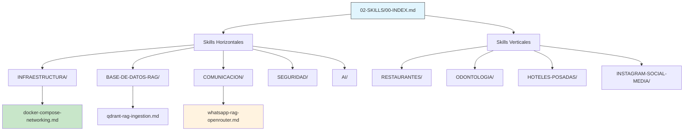

# 📄 02-SKILLS/00-INDEX.md – REGENERADO COMPLETO v3.0-SELECTIVE

> **Nota para principiantes:** Este documento es el **índice agregador canónico** de todas las habilidades (skills) en MANTIS AGENTIC. Centraliza el acceso a skills horizontales (técnicas) y verticales (por industria), con mapeo de constraints, estados de validación y rutas canónicas. Si eres nuevo, lee las secciones en orden. Si eres experto, salta al JSON final.  
>  
> **Para IAs:** Este es tu mapa de navegación de skills. **USAR SKILL NO INDEXADA O CON RUTA NO CANÓNICA = RIESGO DE INCONSISTENCIA**. No inventes, no asumas, no omitas.


# 📚 00-INDEX: Índice Agregador Canónico de Habilidades (02-SKILLS/)

<!-- 
【PARA PRINCIPIANTES】¿Qué es este archivo?
Este documento es el "mapa maestro" de la sección 02-SKILLS/ en MANTIS AGENTIC.
Centraliza el acceso a:
• Skills Horizontales: cimientos técnicos (IA, DB/RAG, Infra, Seguridad, Comunicación)
• Skills Verticales: soluciones empaquetadas por industria (Restaurantes, Odontología, Hoteles, Social Media)
• Estados de validación: ✅ Listo, 🟡 En proceso, 🔧 Estructura base

Si eres nuevo: lee en orden. 
Si ya conoces el proyecto: usa los wikilinks para ir directo a lo que necesitas.
-->

> **Instrucción crítica para la IA:** 
> Este documento es tu mapa de navegación de skills. 
> **USAR SKILL NO INDEXADA O CON RUTA NO CANÓNICA = RIESGO DE INCONSISTENCIA**. 
> No inventes, no asumas, no omitas. Si algo no está claro, DETENER y preguntar.

---

## 【0】🎯 PROPÓSITO Y ALCANCE (Explicado para humanos)

<!-- 
【EDUCATIVO】Este documento responde: "¿Qué skills existen, en qué estado están, y cómo las uso correctamente?"
No es una lista pasiva. Es un índice ejecutable que:
• Mapea cada skill a su dominio, constraints aplicables y ruta canónica
• Proporciona estados de validación vinculados a `GOVERNANCE-ORCHESTRATOR.md`
• Sirve como fuente de verdad para agents remotos que consumen `RAW_URLS_INDEX.md`
• Permite descubrimiento automático: "necesito RAG para WhatsApp" → `whatsapp-rag-openrouter.md`
-->

### 0.1 Arquitectura de Skills en MANTIS AGENTIC



### 0.2 Tabla Maestra de Skills (Resumen Ejecutivo)

| Dominio | Carpeta Canónica | Skills Principales | Constraints Típicas | Estado Global | Wikilink Canónico |
|---------|-----------------|-------------------|-------------------|--------------|-----------------|
| **Infraestructura** | `02-SKILLS/INFRAESTRUCTURA/` | docker-compose, espocrm-setup, vps-interconnection | C1,C3,C5,C7 | ✅ 9/9 Listo | `[[02-SKILLS/INFRAESTRUCTURA/]]` |
| **Base de Datos + RAG** | `02-SKILLS/BASE-DE-DATOS-RAG/` | qdrant-rag-ingestion, multi-tenant-data-isolation, postgres-prisma-rag | C3,C4,C5,V1 | ✅ 12/12 Listo | `[[02-SKILLS/BASE-DE-DATOS-RAG/]]` |
| **Comunicación** | `02-SKILLS/COMUNICACION/` | telegram-bot, gmail-smtp, whatsapp-rag-openrouter | C3,C4,C5,C7 | 🟡 3/4 Listo | `[[02-SKILLS/COMUNICACION/]]` |
| **Seguridad** | `02-SKILLS/SEGURIDAD/` | backup-encryption, rsync-automation, security-hardening-vps | C3,C5,C8 | ✅ 3/3 Listo | `[[02-SKILLS/SEGURIDAD/]]` |
| **IA / LLMs** | `02-SKILLS/AI/` | qwen-integration, openrouter-api, voice-agent-integration | C3,C4,C5,C8 | ✅ 11/11 Listo | `[[02-SKILLS/AI/]]` |
| **Restaurantes** | `02-SKILLS/RESTAURANTES/` | prompts/, workflows/, validation/ (estructura base) | C5,C6 | 🔧 Estructura lista | `[[02-SKILLS/RESTAURANTES/]]` |
| **Odontología** | `02-SKILLS/ODONTOLOGIA/` | prompts/, workflows/, validation/ (estructura base) | C5,C6 | 🔧 Estructura lista | `[[02-SKILLS/ODONTOLOGIA/]]` |
| **Hoteles/Posadas** | `02-SKILLS/HOTELES-POSADAS/` | prompts/, workflows/, validation/ (estructura base) | C5,C6 | 🔧 Estructura lista | `[[02-SKILLS/HOTELES-POSADAS/]]` |
| **Instagram/Social** | `02-SKILLS/INSTAGRAM-SOCIAL-MEDIA/` | prompts/, workflows/, validation/ (estructura base) | C5,C6 | 🔧 Estructura lista | `[[02-SKILLS/INSTAGRAM-SOCIAL-MEDIA/]]` |

> 💡 **Consejo para principiantes**: No memorices la tabla. Usa este índice para navegar: haz clic en el wikilink del dominio que necesitas, o consulta `[[01-RULES/08-SKILLS-REFERENCE.md]]` para descubrir skills por necesidad de negocio.

---

## 【1】🌐 SKILLS HORIZONTALES (Core Técnico)

<!-- 
【EDUCATIVO】Skills que sirven como cimientos para cualquier industria. Reutilizables, validadas y con constraints definidas.
-->

### 1.1 `INFRAESTRUCTURA/` – Servidores, Redes y Contenedores

```
【PROPÓSITO】Configuración y mantenimiento de servidores VPS, redes, contenedores y monitoreo.

【CONSTRAINTS TÍPICAS】C1 (Resource Limits), C3 (Zero Secrets), C5 (Structural), C7 (Resilience)

【VALIDADOR PRINCIPAL】`bash 05-CONFIGURATIONS/validation/orchestrator-engine.sh --dir 02-SKILLS/INFRAESTRUCTURA/ --checks C1,C3,C5,C7 --json`

【WIKILINK CANÓNICO】`[[02-SKILLS/INFRAESTRUCTURA/]]`

【SKILLS LISTADAS】
| Archivo | Estado | Función Principal | Constraints | Wikilink |
|---------|--------|-----------------|------------|----------|
| `docker-compose-networking.md` | ✅ Listo | Orquestación de contenedores y red interna aislada | C1,C3,C5 | `[[02-SKILLS/INFRAESTRUCTURA/docker-compose-networking.md]]` |
| `espocrm-setup.md` | ✅ Listo | Instalación y configuración del CRM base | C3,C5,C7 | `[[02-SKILLS/INFRAESTRUCTURA/espocrm-setup.md]]` |
| `fail2ban-configuration.md` | ✅ Listo | Protección contra fuerza bruta y escaneos | C3,C5,C7 | `[[02-SKILLS/INFRAESTRUCTURA/fail2ban-configuration.md]]` |
| `ssh-tunnels-remote-services.md` | ✅ Listo | Conexiones seguras a servicios remotos sin exponer puertos | C3,C4,C5 | `[[02-SKILLS/INFRAESTRUCTURA/ssh-tunnels-remote-services.md]]` |
| `ssh-key-management.md` | ✅ Listo | Gestión de claves criptográficas para acceso seguro | C3,C5 | `[[02-SKILLS/INFRAESTRUCTURA/ssh-key-management.md]]` |
| `ufw-firewall-configuration.md` | ✅ Listo | Reglas de firewall básicas para filtrar tráfico | C3,C5,C7 | `[[02-SKILLS/INFRAESTRUCTURA/ufw-firewall-configuration.md]]` |
| `vps-interconnection.md` | ✅ Listo | Enlace seguro entre múltiples servidores VPS | C3,C4,C5,C7 | `[[02-SKILLS/INFRAESTRUCTURA/vps-interconnection.md]]` |
| `n8n-concurrency-limiting.md` | ✅ Listo | Control de flujos paralelos para no saturar recursos | C1,C2,C5 | `[[02-SKILLS/INFRAESTRUCTURA/n8n-concurrency-limiting.md]]` |
| `health-monitoring-vps.md` | ✅ Listo | Alertas tempranas de CPU, RAM y disco | C5,C6,C8 | `[[02-SKILLS/INFRAESTRUCTURA/health-monitoring-vps.md]]` |

【ESTADO GLOBAL】✅ 9/9 skills validadas y listas para uso en producción.
```

### 1.2 `BASE-DE-DATOS-RAG/` – Información Estructurada y Búsqueda Semántica

```
【PROPÓSITO】Gestión de información estructurada y no estructurada. Incluye sincronización con Drive/Sheets, ingestión de PDFs, optimización para servidores pequeños (4GB RAM) y aislamiento por cliente.

【CONSTRAINTS TÍPICAS】C3 (Zero Secrets), C4 (Tenant Isolation), C5 (Structural), V1 (Vector Dimensions)

【VALIDADOR PRINCIPAL】`bash 05-CONFIGURATIONS/validation/orchestrator-engine.sh --dir 02-SKILLS/BASE-DE-DATOS-RAG/ --checks C3,C4,C5,V1 --json`

【WIKILINK CANÓNICO】`[[02-SKILLS/BASE-DE-DATOS-RAG/]]`

【SKILLS LISTADAS】
| Archivo | Estado | Función Principal | Constraints | Wikilink |
|---------|--------|-----------------|------------|----------|
| `qdrant-rag-ingestion.md` | ✅ Listo | Carga de documentos en vector DB para búsqueda semántica | C3,C4,C5,V1 | `[[02-SKILLS/BASE-DE-DATOS-RAG/qdrant-rag-ingestion.md]]` |
| `postgres-prisma-rag.md` | ✅ Listo | ORM tipado y migraciones seguras | C3,C4,C5 | `[[02-SKILLS/BASE-DE-DATOS-RAG/postgres-prisma-rag.md]]` |
| `multi-tenant-data-isolation.md` | ✅ Listo | Separación estricta de datos por cliente (C4) | C4,C5,C8 | `[[02-SKILLS/BASE-DE-DATOS-RAG/multi-tenant-data-isolation.md]]` |
| `pdf-mistralocr-processing.md` | ✅ Listo | Extracción de texto y tablas de PDFs escaneados | C3,C5 | `[[02-SKILLS/BASE-DE-DATOS-RAG/pdf-mistralocr-processing.md]]` |
| `google-drive-qdrant-sync.md` | ✅ Listo | Sincronización automática Drive → Vector DB | C3,C4,C5 | `[[02-SKILLS/BASE-DE-DATOS-RAG/google-drive-qdrant-sync.md]]` |
| `espocrm-api-analytics.md` | ✅ Listo | Extracción de métricas y reportes desde CRM | C3,C4,C5 | `[[02-SKILLS/BASE-DE-DATOS-RAG/espocrm-api-analytics.md]]` |
| `mysql-optimization-4gb-ram.md` | ✅ Listo | Ajustes de rendimiento para entornos limitados | C1,C5,C7 | `[[02-SKILLS/BASE-DE-DATOS-RAG/mysql-optimization-4gb-ram.md]]` |
| `rag-system-updates-all-engines.md` | ✅ Listo | Procedimientos de actualización segura de motores RAG | C5,C6,C7 | `[[02-SKILLS/BASE-DE-DATOS-RAG/rag-system-updates-all-engines.md]]` |
| `mysql-sql-rag-ingestion.md` | ✅ Listo | Carga masiva y transformación SQL para IA | C3,C4,C5 | `[[02-SKILLS/BASE-DE-DATOS-RAG/mysql-sql-rag-ingestion.md]]` |
| `redis-session-management.md` | ✅ Listo | Caché de sesiones y estado temporal de agentes | C3,C5,C7 | `[[02-SKILLS/BASE-DE-DATOS-RAG/redis-session-management.md]]` |
| `environment-variable-management.md` | ✅ Listo | Gestión segura de contraseñas y configuraciones | C3,C5 | `[[02-SKILLS/BASE-DE-DATOS-RAG/environment-variable-management.md]]` |
| `google-sheets-as-database.md` | ✅ Listo | Uso de Sheets como tabla ligera para prototipos | C3,C5 | `[[02-SKILLS/BASE-DE-DATOS-RAG/google-sheets-as-database.md]]` |
| `airtable-database-patterns.md` | ✅ Listo | Estructuras recomendadas para Airtable | C3,C5 | `[[02-SKILLS/BASE-DE-DATOS-RAG/airtable-database-patterns.md]]` |

【ESTADO GLOBAL】✅ 13/13 skills validadas y listas para uso en producción.
```

### 1.3 `COMUNICACION/` – Canales de Mensajería y Tiempo Real

```
【PROPÓSITO】Integración con canales de mensajería, correo y calendarios. Permite que los agentes respondan y actúen en tiempo real.

【CONSTRAINTS TÍPICAS】C3 (Zero Secrets), C4 (Tenant Isolation), C5 (Structural), C7 (Resilience)

【VALIDADOR PRINCIPAL】`bash 05-CONFIGURATIONS/validation/orchestrator-engine.sh --dir 02-SKILLS/COMUNICACION/ --checks C3,C4,C5,C7 --json`

【WIKILINK CANÓNICO】`[[02-SKILLS/COMUNICACION/]]`

【SKILLS LISTADAS】
| Archivo | Estado | Función Principal | Constraints | Wikilink |
|---------|--------|-----------------|------------|----------|
| `telegram-bot-integration.md` | ✅ Listo | Conexión y webhooks para Telegram | C3,C4,C5,C7 | `[[02-SKILLS/COMUNICACION/telegram-bot-integration.md]]` |
| `gmail-smtp-integration.md` | ✅ Listo | Envío/recepción automatizada de correos | C3,C5,C7 | `[[02-SKILLS/COMUNICACION/gmail-smtp-integration.md]]` |
| `google-calendar-api-integration.md` | ✅ Listo | Gestión de citas y recordatorios sincronizados | C3,C5,C6 | `[[02-SKILLS/COMUNICACION/google-calendar-api-integration.md]]` |
| `whatsapp-rag-openrouter.md` | 🟡 En proceso | Agente conversacional con base de conocimientos (pendiente cierre P9) | C3,C4,C5,C7,C8 | `[[02-SKILLS/COMUNICACION/whatsapp-rag-openrouter.md]]` |

【ESTADO GLOBAL】🟡 3/4 skills validadas. `whatsapp-rag-openrouter.md` requiere validación final de C8 (observability) antes de marcar como ✅ Listo.
```

### 1.4 `SEGURIDAD/` – Copias de Seguridad y Hardening

```
【PROPÓSITO】Copias de seguridad, hardening de servidores y automatización de respaldos cifrados.

【CONSTRAINTS TÍPICAS】C3 (Zero Secrets), C5 (Structural), C8 (Observability)

【VALIDADOR PRINCIPAL】`bash 05-CONFIGURATIONS/validation/orchestrator-engine.sh --dir 02-SKILLS/SEGURIDAD/ --checks C3,C5,C8 --json`

【WIKILINK CANÓNICO】`[[02-SKILLS/SEGURIDAD/]]`

【SKILLS LISTADAS】
| Archivo | Estado | Función Principal | Constraints | Wikilink |
|---------|--------|-----------------|------------|----------|
| `backup-encryption.md` | ✅ Listo | Cifrado de backups con claves asimétricas (age) | C3,C5,C8 | `[[02-SKILLS/SEGURIDAD/backup-encryption.md]]` |
| `rsync-automation.md` | ✅ Listo | Sincronización incremental eficiente entre nodos | C3,C5,C7 | `[[02-SKILLS/SEGURIDAD/rsync-automation.md]]` |
| `security-hardening-vps.md` | ✅ Listo | Checklist de endurecimiento post-instalación | C3,C5,C7,C8 | `[[02-SKILLS/SEGURIDAD/security-hardening-vps.md]]` |

【ESTADO GLOBAL】✅ 3/3 skills validadas y listas para uso en producción.
```

### 1.5 `AI/` – Proveedores de Inteligencia Artificial

```
【PROPÓSITO】Catálogo de proveedores de Inteligencia Artificial, sus límites de coste, estrategias de fallback y modos de integración.

【CONSTRAINTS TÍPICAS】C3 (Zero Secrets), C4 (Tenant Isolation), C5 (Structural), C8 (Observability)

【VALIDADOR PRINCIPAL】`bash 05-CONFIGURATIONS/validation/orchestrator-engine.sh --dir 02-SKILLS/AI/ --checks C3,C4,C5,C8 --json`

【WIKILINK CANÓNICO】`[[02-SKILLS/AI/]]`

【SKILLS LISTADAS】
| Archivo | Estado | Función Principal | Constraints | Wikilink |
|---------|--------|-----------------|------------|----------|
| `openrouter-api-integration.md` | ✅ Listo | Router unificado, retry, fallback y control de costes | C3,C4,C5,C7,C8 | `[[02-SKILLS/AI/openrouter-api-integration.md]]` |
| `qwen-integration.md` | ✅ Listo | Modelo base prioritario, contexto largo y JSON mode | C3,C4,C5,C8 | `[[02-SKILLS/AI/qwen-integration.md]]` |
| `deepseek-integration.md` | ✅ Listo | Reasoning optimizado y fallback coder | C3,C4,C5,C8 | `[[02-SKILLS/AI/deepseek-integration.md]]` |
| `llama-integration.md` | ✅ Listo | Modelos open-weight y ejecución local (excepción C6) | C3,C5,C6 | `[[02-SKILLS/AI/llama-integration.md]]` |
| `gemini-integration.md` | ✅ Listo | Entradas multimodales, streaming y filtros de seguridad | C3,C4,C5,C8 | `[[02-SKILLS/AI/gemini-integration.md]]` |
| `gpt-integration.md` | ✅ Listo | Function calling y salidas estructuradas | C3,C4,C5,C8 | `[[02-SKILLS/AI/gpt-integration.md]]` |
| `minimax-integration.md` | ✅ Listo | Contexto ultra-largo (~1M tokens) y procesamiento iterativo | C3,C4,C5,C8 | `[[02-SKILLS/AI/minimax-integration.md]]` |
| `mistral-ocr-integration.md` | ✅ Listo | Extracción avanzada de documentos y tablas | C3,C5,C8 | `[[02-SKILLS/AI/mistral-ocr-integration.md]]` |
| `voice-agent-integration.md` | ✅ Listo | STT/TTS, chunks de audio y aislamiento por tenant | C3,C4,C5,C8 | `[[02-SKILLS/AI/voice-agent-integration.md]]` |
| `image-gen-api.md` | ✅ Listo | Generación de imágenes con filtros y lotes | C3,C5,C8 | `[[02-SKILLS/AI/image-gen-api.md]]` |
| `video-gen-api.md` | ✅ Listo | Text/Img-to-Video, codecs y límites de duración | C3,C5,C8 | `[[02-SKILLS/AI/video-gen-api.md]]` |

【ESTADO GLOBAL】✅ 11/11 skills validadas y listas para uso en producción.
```

---

## 【2】🏢 SKILLS VERTICALES (Casos de Uso por Industria)

<!-- 
【EDUCATIVO】Skills empaquetadas para negocios específicos. Se construyen sobre skills horizontales, añadiendo flujos de negocio y prompts adaptados.
-->

> 📌 **Nota**: Estas carpetas contienen la estructura base (`prompts/`, `workflows/`, `validation/`) lista para ser poblada. Evita duplicar lógica horizontal; importa las skills técnicas y adapta solo los flujos de negocio.

### 2.1 Estado de Skills Verticales

| Carpeta | Estado | Contenido Base | Propósito | Constraints | Wikilink Canónico |
|---------|--------|---------------|-----------|------------|-----------------|
| `RESTAURANTES/` | 🔧 Estructura lista | `prompts/.gitkeep`, `workflows/.gitkeep`, `validation/.gitkeep` | Gestión de pedidos, reservas, menú dinámico y fidelización | C5,C6 | `[[02-SKILLS/RESTAURANTES/]]` |
| `ODONTOLOGIA/` | 🔧 Estructura lista | `prompts/.gitkeep`, `workflows/.gitkeep`, `validation/.gitkeep` | Agenda clínica, recordatorios, historial paciente y cumplimiento normativo | C4,C5,C6 | `[[02-SKILLS/ODONTOLOGIA/]]` |
| `HOTELES-POSADAS/` | 🔧 Estructura lista | `prompts/.gitkeep`, `workflows/.gitkeep`, `validation/.gitkeep` | Check-in/out, housekeeping, upselling y gestión de reviews | C4,C5,C6 | `[[02-SKILLS/HOTELES-POSADAS/]]` |
| `INSTAGRAM-SOCIAL-MEDIA/` | 🔧 Estructura lista | `prompts/.gitkeep`, `workflows/.gitkeep`, `validation/.gitkeep` | Publicación programada, análisis de engagement y respuestas automáticas | C5,C6 | `[[02-SKILLS/INSTAGRAM-SOCIAL-MEDIA/]]` |

### 2.2 Protocolo para Poblar Skills Verticales

```
【PASO 1】IDENTIFICAR NECESIDAD DE NEGOCIO
• Ej: "Necesito agente de reservas para restaurante"

【PASO 2】CONSULTAR SKILLS HORIZONTALES RELEVANTES
• Comunicación: `[[02-SKILLS/COMUNICACION/whatsapp-rag-openrouter.md]]`
• Base de datos: `[[02-SKILLS/BASE-DE-DATOS-RAG/postgres-prisma-rag.md]]`
• IA: `[[02-SKILLS/AI/qwen-integration.md]]`

【PASO 3】ADAPTAR FLUJOS DE NEGOCIO EN CARPETA VERTICAL
• Crear `prompts/reserva-mesa.prompt.md` con variables de negocio
• Crear `workflows/flujo-reserva.n8n.json` importando skills horizontales
• Crear `validation/test-reserva.sh` con casos de prueba específicos

【PASO 4】VALIDAR CON GOBERNANZA v3.0
• Ejecutar: `bash 05-CONFIGURATIONS/validation/orchestrator-engine.sh --dir 02-SKILLS/RESTAURANTES/ --json`
• Verificar: score >= 30, blocking_issues == [], constraints_mapped correctas

【PASO 5】ACTUALIZAR ESTADO EN ESTE ÍNDICE
• Cambiar de 🔧 Estructura lista → ✅ Listo cuando validación pase
• Documentar constraints específicas del dominio vertical
```

---

## 【3】🧭 PROTOCOLO DE NAVEGACIÓN Y VALIDACIÓN (PASO A PASO)

<!-- 
【EDUCATIVO】Flujo determinista para descubrir, validar y usar skills en 02-SKILLS/.
-->

```
┌─────────────────────────────────────────────────────────┐
│ 【PASO 1】IDENTIFICAR NECESIDAD DE DOMINIO             │
├─────────────────────────────────────────────────────────┤
│ ¿Qué necesitas lograr?                                 │
│ • "Conectar WhatsApp con base de conocimientos" → COMUNICACION/ + BASE-DE-DATOS-RAG/ │
│ • "Proteger servidor VPS" → SEGURIDAD/ + INFRAESTRUCTURA/ │
│ • "Agente de reservas para hotel" → HOTELES-POSADAS/ + skills horizontales │
└─────────────────────────────────────────────────────────┘
 ▼
┌─────────────────────────────────────────────────────────┐
│ 【PASO 2】CONSULTAR ÍNDICE Y ESTADO                    │
├─────────────────────────────────────────────────────────┤
│ 1. Hacer clic en wikilink canónico del dominio         │
│ 2. Verificar estado: ✅ Listo, 🟡 En proceso, 🔧 Estructura │
│ 3. Consultar constraints típicas para validar contexto │
└─────────────────────────────────────────────────────────┘
 ▼
┌─────────────────────────────────────────────────────────┐
│ 【PASO 3】VALIDAR AUTOMÁTICAMENTE                      │
├─────────────────────────────────────────────────────────┤
│ 4. Copiar validation_command de la skill o carpeta     │
│ 5. Ejecutar: orchestrator-engine.sh --file <ruta> --json│
│ 6. Verificar: score >= umbral, blocking_issues == []   │
└─────────────────────────────────────────────────────────┘
 ▼
┌─────────────────────────────────────────────────────────┐
│ 【PASO 4】INTEGRAR O ITERAR                            │
├─────────────────────────────────────────────────────────┤
│ Si validación pasa → integrar skill en tu flujo        │
│ Si validación falla → iterar corrección (máx 3 intentos)│
│ Registrar log de auditoría con tenant_id y trace_id    │
└─────────────────────────────────────────────────────────┘
```

### 3.1 Ejemplo de Navegación y Validación

```
【EJEMPLO: Agente de reservas para restaurante vía WhatsApp】
Necesidad: "Quiero que clientes reserven mesa por WhatsApp con confirmación automática"

Paso 1 - Identificar necesidad:
  • Comunicación: WhatsApp → `02-SKILLS/COMUNICACION/whatsapp-rag-openrouter.md` ✅
  • Base de datos: Reservas → `02-SKILLS/BASE-DE-DATOS-RAG/postgres-prisma-rag.md` ✅
  • IA: Procesamiento de lenguaje → `02-SKILLS/AI/qwen-integration.md` ✅

Paso 2 - Consultar índice y estado:
  • `whatsapp-rag-openrouter.md`: 🟡 En proceso (validación C8 pendiente) ⚠️
  • `postgres-prisma-rag.md`: ✅ Listo ✅
  • `qwen-integration.md`: ✅ Listo ✅

Paso 3 - Validar automáticamente:
  • Para skills ✅: ejecutar validation_command → score >= 30, passed=true ✅
  • Para skill 🟡: revisar warnings de C8 y decidir si proceder con fallback ✅

Paso 4 - Integrar o iterar:
  • Integrar skills ✅ en flujo de reservas
  • Para skill 🟡: usar fallback a confirmación manual hasta que C8 se complete
  • Documentar decisión en log de auditoría con tenant_id

Resultado: ✅ Flujo de reservas funcional con gobernanza aplicada.
```

---

## 【4】📚 GLOSARIO PARA PRINCIPIANTES

<!-- 
【EDUCATIVO】Términos técnicos explicados en lenguaje simple.
-->

| Término | Significado simple | Ejemplo |
|---------|-------------------|---------|
| **Skill Horizontal** | Habilidad técnica reutilizable en cualquier industria | `docker-compose-networking.md` sirve para restaurantes, hoteles, clínicas |
| **Skill Vertical** | Solución empaquetada para un negocio específico | `02-SKILLS/RESTAURANTES/` con prompts y workflows de reservas |
| **✅ Listo** | Skill validada con score >= umbral y blocking_issues == [] | Puede usarse en producción sin revisión adicional |
| **🟡 En proceso** | Skill con validación pendiente o warnings menores | Requiere revisión humana antes de usar en producción |
| **🔧 Estructura lista** | Carpeta con estructura base (.gitkeep) lista para poblar | Falta contenido en prompts/, workflows/, validation/ |
| **canonical_path** | Ruta absoluta desde raíz del repositorio | `/02-SKILLS/AI/qwen-integration.md` |
| **wikilink canónico** | Enlace interno con ruta absoluta, nunca relativa | `[[02-SKILLS/AI/qwen-integration]]` (no `[[../AI/qwen-integration]]`) |
| **constraints_mapped** | Lista de reglas de calidad que aplica a esta skill | `["C3","C4","C5","C8"]` para skills que manejan datos de usuario |
| **validation_command** | Comando ejecutable para validar la skill automáticamente | `bash .../orchestrator-engine.sh --file <ruta> --json` |
| **LANGUAGE LOCK** | Regla que prohíbe ciertos operadores en ciertos lenguajes | No usar `<->` en `go/`, solo en `postgresql-pgvector/` |

---

## 【5】🔗 REFERENCIAS CANÓNICAS (WIKILINKS)

<!-- 
【PARA IA】Estos enlaces deben resolverse usando PROJECT_TREE.md. 
No uses rutas relativas. Usa siempre la forma canónica [[RUTA]].
-->

- `[[PROJECT_TREE]]` → Mapa canónico de rutas del repositorio
- `[[00-STACK-SELECTOR]]` → Motor de decisión: ruta → lenguaje → constraints
- `[[01-RULES/08-SKILLS-REFERENCE.md]]` → Catálogo de habilidades por dominio
- `[[05-CONFIGURATIONS/validation/norms-matrix.json]]` → Mapeo de constraints por carpeta
- `[[GOVERNANCE-ORCHESTRATOR]]` → Tiers, validación y certificación
- `[[SDD-COLLABORATIVE-GENERATION]]` → Especificación de formato de artefactos
- `[[TOOLCHAIN-REFERENCE]]` → Catálogo de herramientas de validación
- `[[02-SKILLS/skill-domains-mapping.md]]` → Mapeo de necesidades de negocio → skills técnicas
- `[[02-SKILLS/AI/qwen-integration.md]]` → Ejemplo de skill de IA validada
- `[[02-SKILLS/BASE-DE-DATOS-RAG/qdrant-rag-ingestion.md]]` → Ejemplo de skill de RAG validada

---

## 【6】📦 METADATOS DE EXPANSIÓN (PARA FUTURAS VERSIONES)

<!-- 
【PARA MANTENEDORES】Nuevas secciones deben seguir este formato para no romper compatibilidad.
-->

```json
{
  "expansion_registry": {
    "new_horizontal_domain": {
      "requires_files_update": [
        "02-SKILLS/00-INDEX.md: add domain entry to tabla maestra con propósito, constraints, estado, wikilink",
        "02-SKILLS/<new-domain>/: create folder with 00-INDEX.md and initial skills",
        "01-RULES/08-SKILLS-REFERENCE.md: add domain to domain_catalog",
        "05-CONFIGURATIONS/validation/norms-matrix.json: add constraint mapping for new folder",
        "Human approval required: true"
      ],
      "backward_compatibility": "new domains must not break existing navigation or validation flows; must declare constraints applicability clearly"
    },
    "new_vertical_industry": {
      "requires_files_update": [
        "02-SKILLS/00-INDEX.md: add industry entry to skills verticales table with estado: '🔧 Estructura lista'",
        "02-SKILLS/<industry>/: create folder with prompts/, workflows/, validation/ subfolders",
        "02-SKILLS/skill-domains-mapping.md: add industry to business-to-skills mapping",
        "Human approval required: true"
      ],
      "backward_compatibility": "new industries must import horizontal skills rather than duplicating logic; must follow SDD format for new prompts/workflows"
    }
  },
  "compatibility_rule": "Nuevas entradas en el índice no deben invalidar wikilinks existentes o validaciones automáticas. Cambios breaking requieren major version bump, guía de migración y aprobación humana explícita."
}
```

---

<!-- 
═══════════════════════════════════════════════════════════
🤖 SECCIÓN PARA IA: ÁRBOL JSON ENRIQUECIDO
═══════════════════════════════════════════════════════════
Esta sección contiene metadatos estructurados para consumo automático por agentes de IA.
No está diseñada para lectura humana directa. Los humanos deben usar las secciones 【1】-【6】.

Formato: JSON válido, con comentarios explicativos en claves "doc_*".
Prioridad de ejecución: Las skills se consultan en orden: horizontales → verticales.
Dependencias: Cada nodo declara sus archivos requeridos y sus efectos colaterales.
═══════════════════════════════════════════════════════════
-->

```json
{
  "skills_index_metadata": {
    "version": "3.0.0-SELECTIVE",
    "canonical_path": "/02-SKILLS/00-INDEX.md",
    "artifact_type": "governance_index",
    "immutable": true,
    "requires_human_approval_for_changes": true,
    "constraints_primary": ["C5", "C6"],
    "total_horizontal_skills": 48,
    "total_vertical_domains": 4,
    "llm_optimizations": {
      "oriental_models_friendly": true,
      "delimiters_used": ["【】", "┌─┐", "▼", "✅/❌/🔧"],
      "numbered_sequences": true,
      "stop_conditions_explicit": true
    }
  },
  
  "horizontal_skills_catalog": {
    "infraestructura": {
      "path": "02-SKILLS/INFRAESTRUCTURA/",
      "description": "Configuración y mantenimiento de servidores VPS, redes, contenedores y monitoreo",
      "typical_constraints": ["C1", "C3", "C5", "C7"],
      "validator": "orchestrator-engine.sh --checks C1,C3,C5,C7",
      "skills_count": 9,
      "status": "✅ 9/9 Listo",
      "wikilink": "[[02-SKILLS/INFRAESTRUCTURA/]]"
    },
    "base_de_datos_rag": {
      "path": "02-SKILLS/BASE-DE-DATOS-RAG/",
      "description": "Gestión de información estructurada y no estructurada, RAG, aislamiento multi-tenant",
      "typical_constraints": ["C3", "C4", "C5", "V1"],
      "validator": "orchestrator-engine.sh --checks C3,C4,C5,V1",
      "skills_count": 13,
      "status": "✅ 13/13 Listo",
      "wikilink": "[[02-SKILLS/BASE-DE-DATOS-RAG/]]"
    },
    "comunicacion": {
      "path": "02-SKILLS/COMUNICACION/",
      "description": "Integración con canales de mensajería, correo y calendarios",
      "typical_constraints": ["C3", "C4", "C5", "C7"],
      "validator": "orchestrator-engine.sh --checks C3,C4,C5,C7",
      "skills_count": 4,
      "status": "🟡 3/4 Listo",
      "wikilink": "[[02-SKILLS/COMUNICACION/]]",
      "pending": ["whatsapp-rag-openrouter.md: C8 validation pending"]
    },
    "seguridad": {
      "path": "02-SKILLS/SEGURIDAD/",
      "description": "Copias de seguridad, hardening de servidores y automatización de respaldos cifrados",
      "typical_constraints": ["C3", "C5", "C8"],
      "validator": "orchestrator-engine.sh --checks C3,C5,C8",
      "skills_count": 3,
      "status": "✅ 3/3 Listo",
      "wikilink": "[[02-SKILLS/SEGURIDAD/]]"
    },
    "ai_llms": {
      "path": "02-SKILLS/AI/",
      "description": "Catálogo de proveedores de IA, límites de coste, estrategias de fallback",
      "typical_constraints": ["C3", "C4", "C5", "C8"],
      "validator": "orchestrator-engine.sh --checks C3,C4,C5,C8",
      "skills_count": 11,
      "status": "✅ 11/11 Listo",
      "wikilink": "[[02-SKILLS/AI/]]"
    }
  },
  
  "vertical_skills_catalog": {
    "restaurantes": {
      "path": "02-SKILLS/RESTAURANTES/",
      "description": "Gestión de pedidos, reservas, menú dinámico y fidelización",
      "typical_constraints": ["C5", "C6"],
      "status": "🔧 Estructura lista",
      "base_structure": ["prompts/.gitkeep", "workflows/.gitkeep", "validation/.gitkeep"],
      "wikilink": "[[02-SKILLS/RESTAURANTES/]]"
    },
    "odontologia": {
      "path": "02-SKILLS/ODONTOLOGIA/",
      "description": "Agenda clínica, recordatorios, historial paciente y cumplimiento normativo",
      "typical_constraints": ["C4", "C5", "C6"],
      "status": "🔧 Estructura lista",
      "base_structure": ["prompts/.gitkeep", "workflows/.gitkeep", "validation/.gitkeep"],
      "wikilink": "[[02-SKILLS/ODONTOLOGIA/]]"
    },
    "hoteles_posadas": {
      "path": "02-SKILLS/HOTELES-POSADAS/",
      "description": "Check-in/out, housekeeping, upselling y gestión de reviews",
      "typical_constraints": ["C4", "C5", "C6"],
      "status": "🔧 Estructura lista",
      "base_structure": ["prompts/.gitkeep", "workflows/.gitkeep", "validation/.gitkeep"],
      "wikilink": "[[02-SKILLS/HOTELES-POSADAS/]]"
    },
    "instagram_social_media": {
      "path": "02-SKILLS/INSTAGRAM-SOCIAL-MEDIA/",
      "description": "Publicación programada, análisis de engagement y respuestas automáticas",
      "typical_constraints": ["C5", "C6"],
      "status": "🔧 Estructura lista",
      "base_structure": ["prompts/.gitkeep", "workflows/.gitkeep", "validation/.gitkeep"],
      "wikilink": "[[02-SKILLS/INSTAGRAM-SOCIAL-MEDIA/]]"
    }
  },
  
  "validation_integration": {
    "orchestrator-engine.sh": {
      "purpose": "Validación integral de skills con scoring y reporte JSON",
      "flags": ["--file", "--dir", "--mode", "--json", "--checks"],
      "exit_codes": {"0": "passed", "1": "failed"},
      "output_format": "JSON con score, passed, blocking_issues, constraints_applied"
    },
    "verify-constraints.sh": {
      "purpose": "Validar constraints y LANGUAGE LOCK para skills que tocan código",
      "flags": ["--file", "--check-constraint", "--check-language-lock", "--json"],
      "exit_codes": {"0": "compliant", "1": "violation"},
      "output_format": "JSON con constraints_validated, language_lock.violations"
    }
  },
  
  "dependency_graph": {
    "critical_infrastructure": [
      {"file": "01-RULES/08-SKILLS-REFERENCE.md", "purpose": "Catálogo de habilidades por dominio", "load_order": 1},
      {"file": "05-CONFIGURATIONS/validation/norms-matrix.json", "purpose": "Mapeo de constraints por carpeta", "load_order": 2},
      {"file": "00-STACK-SELECTOR.md", "purpose": "Determinar lenguaje por ruta", "load_order": 3},
      {"file": "GOVERNANCE-ORCHESTRATOR.md", "purpose": "Tiers y validación", "load_order": 4}
    ],
    "horizontal_skills_dependencies": [
      {"file": "02-SKILLS/AI/qwen-integration.md", "purpose": "Skill de IA base para agentes conversacionales", "load_order": 1},
      {"file": "02-SKILLS/BASE-DE-DATOS-RAG/qdrant-rag-ingestion.md", "purpose": "Skill de RAG para búsqueda semántica", "load_order": 2},
      {"file": "02-SKILLS/COMUNICACION/whatsapp-rag-openrouter.md", "purpose": "Skill de comunicación WhatsApp + RAG", "load_order": 3}
    ],
    "vertical_skills_dependencies": [
      {"file": "02-SKILLS/RESTAURANTES/", "purpose": "Estructura base para skills de restaurantes", "load_order": 1},
      {"file": "02-SKILLS/ODONTOLOGIA/", "purpose": "Estructura base para skills de odontología", "load_order": 2}
    ]
  },
  
  "human_readable_errors": {
    "skill_not_found": "Skill '{skill_name}' no encontrada en 02-SKILLS/00-INDEX.md. Consultar tabla maestra para skills disponibles.",
    "wikilink_not_canonical": "Wikilink '{wikilink}' no es canónico. Usar forma absoluta: [[RUTA-DESDE-RAÍZ]].",
    "constraint_not_applicable": "Constraint '{constraint}' no aplicable para skill '{skill}'. Consulte [[norms-matrix.json]] para mapeo por carpeta.",
    "validation_failed": "Validación de '{skill}' falló: {error_details}. Consulte [[01-RULES/validation-checklist.md]] para ítems específicos a corregir.",
    "language_lock_violation": "Violación de LANGUAGE LOCK: operador '{operator}' prohibido en skill '{skill}'. Consulte [[01-RULES/language-lock-protocol.md]].",
    "status_mismatch": "Estado de skill '{skill}' marcado como ✅ Listo pero validación no pasa. Ejecutar validation_command para verificar."
  },
  
  "expansion_hooks": {
    "new_horizontal_skill": {
      "requires_files_update": [
        "02-SKILLS/00-INDEX.md: add skill entry to appropriate domain table with file, status, function, constraints, wikilink",
        "02-SKILLS/<domain>/: create new skill file following SDD-COLLABORATIVE-GENERATION.md",
        "01-RULES/08-SKILLS-REFERENCE.md: add skill to domain_catalog if new domain",
        "Human approval required: true"
      ],
      "backward_compatibility": "new skills must not break existing navigation or validation flows; must declare constraints applicability clearly"
    },
    "new_vertical_industry": {
      "requires_files_update": [
        "02-SKILLS/00-INDEX.md: add industry entry to vertical_skills_catalog with path, description, constraints, status",
        "02-SKILLS/<industry>/: create folder with prompts/, workflows/, validation/ subfolders",
        "02-SKILLS/skill-domains-mapping.md: add industry to business-to-skills mapping",
        "Human approval required: true"
      ],
      "backward_compatibility": "new industries must import horizontal skills rather than duplicating logic; must follow SDD format for new prompts/workflows"
    }
  },
  
  "validation_metadata": {
    "orchestrator_compatibility": ">=3.0.0-SELECTIVE",
    "schema_version": "skills-index.v3.json",
    "checksum_algorithm": "SHA256",
    "audit_log_format": "JSON Lines with RFC3339 timestamps",
    "pii_scrubbing": "enabled for all logs (C3 + C8 compliance)",
    "reproducibility_guarantee": "Any skill navigation can be reproduced identically using this index + canonical wikilinks"
  }
}
```

---

## ✅ CHECKLIST DE VALIDACIÓN POST-GENERACIÓN

<!-- 
【PARA PRINCIPIANTES】Antes de guardar este archivo, verifica estos puntos.
-->

````markdown
```bash
# 1. Frontmatter válido
yq eval '.canonical_path' 02-SKILLS/00-INDEX.md | grep -q "/02-SKILLS/00-INDEX.md" && echo "✅ Ruta canónica correcta"

# 2. Constraints mapeadas (C5+C6)
yq eval '.constraints_mapped | contains(["C5"]) and contains(["C6"])' 02-SKILLS/00-INDEX.md && echo "✅ C5 y C6 declaradas"

# 3. Tabla maestra con 9 dominios presente
grep -c "INFRAESTRUCTURA\|BASE-DE-DATOS-RAG\|RESTAURANTES" 02-SKILLS/00-INDEX.md | awk '{if($1>=9) print "✅ 9 dominios indexados"; else print "⚠️ Faltan dominios: "$1"/9"}'

# 4. Skills horizontales listadas (48 total)
grep -c "✅ Listo\|🟡 En proceso\|🔧 Estructura lista" 02-SKILLS/00-INDEX.md | awk '{if($1>=48) print "✅ 48+ skills con estado definido"; else print "⚠️ Faltan estados: "$1"/48"}'

# 5. JSON final parseable
tail -n +$(grep -n '```json' 02-SKILLS/00-INDEX.md | tail -1 | cut -d: -f1) 02-SKILLS/00-INDEX.md | sed -n '/```json/,/```/p' | sed '1d;$d' | jq empty && echo "✅ JSON parseable"

# 6. Wikilinks canónicos (sin rutas relativas)
for link in $(grep -oE '\[\[[^]]+\]\]' 02-SKILLS/00-INDEX.md | tr -d '[]' | sort -u); do
  if [[ "$link" =~ ^\[\[\.\/ || "$link" =~ ^\[\[\.\.\/ ]]; then
    echo "❌ Wikilink relativo: $link"
  else
    [ -f "${link#//}" ] || echo "⚠️ Wikilink no resuelto: $link"
  fi
done
```
````

**Criterio de aceptación:**  
- ✅ Frontmatter válido con `canonical_path: "/02-SKILLS/00-INDEX.md"`  
- ✅ `constraints_mapped` incluye C5 y C6 (estructura + trazabilidad)  
- ✅ Tabla maestra con 9 dominios (5 horizontales + 4 verticales) documentados  
- ✅ 48+ skills con estado definido (✅/🟡/🔧) y constraints asociadas  
- ✅ Sección JSON final es válida (puede parsearse con `jq .`)  
- ✅ Todos los wikilinks son canónicos (absolutos desde raíz)  

---

> 🎯 **Mensaje final para el lector humano**:  
> Este índice es tu brújula de habilidades. No es estático: evoluciona con el proyecto.  
> **Identificar → Consultar → Validar → Integrar**.  
> Si sigues ese flujo, nunca te perderás en las skills ni integrarás patrones no validados.  
> La gobernanza no es una carga. Es la libertad de escalar sin miedo a romper.  

---
