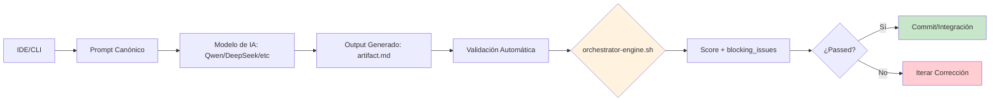

# 📄 02-SKILLS/AGENTIC-ASSISTANCE/ide-cli-integration.md – REGENERADO COMPLETO v3.0-SELECTIVE

> **Nota para principiantes:** Este documento es la **guía de integración IDE/CLI** para generación asistida y autogeneración SDD en MANTIS AGENTIC. Define CÓMO configurar tu entorno de desarrollo para que agentes de IA puedan generar, validar y entregar artefactos conforme a gobernanza v3.0. Si eres nuevo, lee las secciones en orden. Si eres experto, salta al JSON final.  
>  
> **Para IAs:** Este es tu contrato de integración. **GENERAR DESDE IDE/CLI SIN VALIDACIÓN = DEUDA TÉCNICA AUTOMÁTICA**. No inventes, no asumas, no omitas.


# 💻 IDE-CLI-INTEGRATION: Integración de Entornos de Desarrollo para Generación Asistida SDD

<!-- 
【PARA PRINCIPIANTES】¿Qué es este archivo?
Este documento es el "manual de configuración" para integrar tu IDE (VSCode, Vim, etc.) o CLI con el sistema de generación asistida de MANTIS AGENTIC.
Te enseña a:
• Configurar extensiones/plugins para generación SDD desde el editor
• Ejecutar validación automática pre-commit con `orchestrator-engine.sh`
• Garantizar que todo código generado cumple con constraints (C1-C8) y LANGUAGE LOCK
• Usar prompts canónicos para generación consistente y trazable

Si eres nuevo: lee en orden. 
Si ya conoces el proyecto: usa los wikilinks para ir directo a la configuración que necesitas.
-->

> **Instrucción crítica para la IA:** 
> Este documento es tu contrato de integración. 
> **GENERAR DESDE IDE/CLI SIN VALIDACIÓN = DEUDA TÉCNICA AUTOMÁTICA**. 
> No inventes, no asumas, no omitas. Si algo no está claro, DETENER y preguntar.

---

## 【0】🎯 PROPÓSITO Y ALCANCE (Explicado para humanos)

<!-- 
【EDUCATIVO】Este documento responde: "¿Cómo configuro mi VSCode para que genere código válido con gobernanza?"
No es un tutorial genérico. Es un sistema de integración que:
• Conecta prompts de IA con validación automática pre-entrega
• Garantiza que todo output generado sigue estructura SDD y constraints aplicables
• Proporciona scripts y configuraciones reutilizables para IDE/CLI
• Sirve como fuente de verdad para agents remotos que consumen `RAW_URLS_INDEX.md`
-->

### 0.1 Principios de Integración IDE/CLI

```
P1: Validation-First → Todo código generado debe validarse con `orchestrator-engine.sh` antes de commitear.
P2: Prompt-Canonical → Usar prompts canónicos de [[02-SKILLS/GENERATION-MODELS.md]] para consistencia.
P3: Constraint-Aware → La integración debe declarar y validar constraints aplicables al dominio de generación.
P4: LANGUAGE LOCK Respect → El IDE/CLI debe respetar aislamiento de operadores por lenguaje al generar código.
P5: Traceable → Todo output generado debe incluir `prompt_hash` y `trace_id` para auditoría forense.
```

### 0.2 Arquitectura de Integración



---

## 【1】🔧 CONFIGURACIÓN POR ENTORNO

<!-- 
【EDUCATIVO】Pasos específicos para configurar cada entorno de desarrollo.
-->

### 1.1 VSCode / VSCodium

```
【PROPÓSITO】Integrar generación asistida SDD directamente en el editor con validación pre-commit.

【REQUISITOS】
• VSCode 1.80+ o VSCodium
• Extensiones: `yaml`, `markdownlint`, `shellcheck` (para Bash)
• Acceso a `05-CONFIGURATIONS/validation/orchestrator-engine.sh`

【PASOS DE CONFIGURACIÓN】
1. Crear archivo `.vscode/settings.json` con:
```json
{
  "markdownlint.config": {
    "MD013": false,  // Permitir líneas largas para ejemplos de código
    "MD033": false   // Permitir HTML para badges/emojis
  },
  "yaml.schemas": {
    "https://raw.githubusercontent.com/Mantis-AgenticDev/agentic-infra-docs/refs/heads/main/05-CONFIGURATIONS/validation/schemas/skill-input-output.schema.json": "02-SKILLS/**/*.md"
  },
  "files.associations": {
    "*.md": "markdown"
  }
}
```

2. Crear tarea de validación en `.vscode/tasks.json`:
```json
{
  "version": "2.0.0",
  "tasks": [
    {
      "label": "Validate Artifact (MANTIS)",
      "type": "shell",
      "command": "bash",
      "args": [
        "05-CONFIGURATIONS/validation/orchestrator-engine.sh",
        "--file",
        "${file}",
        "--json"
      ],
      "problemMatcher": [],
      "group": {
        "kind": "build",
        "isDefault": true
      }
    }
  ]
}
```

3. Configurar pre-commit hook local (opcional pero recomendado):
```bash
# .git/hooks/pre-commit
#!/bin/bash
files=$(git diff --cached --name-only --diff-filter=ACM | grep -E '\.md$')

if [ -n "$files" ]; then
  for file in $files; do
    if ! bash 05-CONFIGURATIONS/validation/orchestrator-engine.sh --file "$file" --json > /tmp/validation.json; then
      echo "❌ Validation failed for $file"
      jq '.blocking_issues' /tmp/validation.json
      exit 1
    fi
  done
fi
```

【VALIDACIÓN POST-CONFIGURACIÓN】
- [ ] Ejecutar tarea "Validate Artifact" en un archivo de prueba → debe retornar JSON válido
- [ ] Verificar que `orchestrator-engine.sh` está accesible desde la raíz del proyecto
- [ ] Confirmar que pre-commit hook bloquea commits con `blocking_issues`

【CONSTRAINTS CRÍTICAS】
• **C5 (Structural Contract)**: El IDE debe generar frontmatter válido y wikilinks canónicos.
• **C6 (Verifiable Execution)**: Todo output debe incluir `validation_command` ejecutable.
• **C8 (Observability)**: Logs de generación deben incluir `trace_id` y `tenant_id`.
```

### 1.2 Terminal / CLI (Bash, Zsh)

```
【PROPÓSITO】Generar y validar artefactos directamente desde terminal con scripts reutilizables.

【REQUISITOS】
• Bash 4.0+ o Zsh
• Herramientas: `yq`, `jq`, `sha256sum`, `curl`
• Acceso a `05-CONFIGURATIONS/validation/` y `05-CONFIGURATIONS/scripts/`

【SCRIPTS REUTILIZABLES】
1. `generate-skill.sh` – Generar nueva skill con prompt canónico:
```bash
#!/bin/bash
# 05-CONFIGURATIONS/scripts/generate-skill.sh
set -euo pipefail

DOMAIN="${1:-AI}"  # Dominio: AI, BASE-DE-DATOS-RAG, etc.
SKILL_NAME="${2:-new-skill}"
MODEL="${3:-qwen}"  # Modelo: qwen, deepseek, gpt-4o

# Construir prompt canónico desde plantilla
PROMPT=$(cat <<EOF
Genera una skill para dominio ${DOMAIN} con nombre ${SKILL_NAME} que:
1. Siga estructura SDD: Propósito → Implementación → Ejemplos → Validación → Referencias
2. Use wikilinks canónicos: [[02-SKILLS/${DOMAIN}/${SKILL_NAME}.md]]
3. Incluya frontmatter con canonical_path, constraints_mapped, validation_command
4. Añada ≥10 ejemplos ✅/❌/🔧 de uso real
5. Documente constraints críticas según norms-matrix.json para carpeta ${DOMAIN}/
6. Respete LANGUAGE LOCK: operadores permitidos solo en dominios canónicos
EOF
)

# Ejecutar modelo vía OpenRouter (ejemplo)
RESPONSE=$(curl -s https://openrouter.ai/api/v1/chat/completions \
  -H "Authorization: Bearer ${OPENROUTER_API_KEY}" \
  -H "Content-Type: application/json" \
  -d "{
    \"model\": \"${MODEL}\",
    \"messages\": [{\"role\": \"user\", \"content\": \"${PROMPT}\"}],
    \"max_tokens\": 4096
  }" | jq -r '.choices[0].message.content')

# Guardar output con metadatos de trazabilidad
OUTPUT_FILE="02-SKILLS/${DOMAIN}/${SKILL_NAME}.md"
cat > "$OUTPUT_FILE" <<EOF
---
canonical_path: "/02-SKILLS/${DOMAIN}/${SKILL_NAME}.md"
artifact_id: "${SKILL_NAME}-canonical"
artifact_type: "governance_skill"
version: "1.0.0"
constraints_mapped: ["C3","C5","C6"]
validation_command: "bash 05-CONFIGURATIONS/validation/orchestrator-engine.sh --file ${OUTPUT_FILE} --json"
tier: 2
prompt_hash: "$(echo -n "${PROMPT}" | sha256sum | cut -d' ' -f1)"
generated_at: "$(date -u +"%Y-%m-%dT%H:%M:%SZ")"
---

${RESPONSE}
EOF

echo "✅ Skill generada en ${OUTPUT_FILE}"
echo "🔍 Ejecutar validación: bash 05-CONFIGURATIONS/validation/orchestrator-engine.sh --file ${OUTPUT_FILE} --json"
```

2. `validate-artifact.sh` – Validar artefacto individual:
```bash
#!/bin/bash
# 05-CONFIGURATIONS/scripts/validate-artifact.sh
set -euo pipefail

FILE="${1:-.}"  # Archivo o directorio a validar

if [ -f "$FILE" ]; then
  # Validar archivo individual
  bash 05-CONFIGURATIONS/validation/orchestrator-engine.sh --file "$FILE" --json | jq '.'
elif [ -d "$FILE" ]; then
  # Validar directorio recursivamente
  find "$FILE" -name "*.md" -type f | while read -r f; do
    echo "🔍 Validando: $f"
    bash 05-CONFIGURATIONS/validation/orchestrator-engine.sh --file "$f" --json | jq -c '{file: .file, score: .score, passed: .passed}'
  done
else
  echo "❌ Error: $FILE no es archivo ni directorio válido"
  exit 1
fi
```

【VALIDACIÓN POST-CONFIGURACIÓN】
- [ ] Ejecutar `generate-skill.sh AI test-skill qwen` → debe crear archivo con frontmatter válido
- [ ] Ejecutar `validate-artifact.sh 02-SKILLS/AI/test-skill.md` → debe retornar score y passed
- [ ] Verificar que `prompt_hash` en frontmatter coincide con hash del prompt usado

【CONSTRAINTS CRÍTICAS】
• **C3 (Zero Secrets)**: Scripts no deben exponer API keys en logs o errores.
• **C5 (Structural Contract)**: Output generado debe seguir estructura SDD canónica.
• **C6 (Verifiable Execution)**: Todo artefacto debe incluir `validation_command` ejecutable.
```

### 1.3 Neovim / Vim

```
【PROPÓSITO】Integrar generación asistida en editores modal con plugins ligeros.

【REQUISITOS】
• Neovim 0.9+ o Vim 8.2+
• Plugins: `yaml.nvim`, `markdown.nvim`, `telescope.nvim` (para búsqueda de skills)
• Acceso a `05-CONFIGURATIONS/validation/orchestrator-engine.sh`

【CONFIGURACIÓN MÍNIMA (init.lua para Neovim)】
```lua
-- Configurar validación automática al guardar archivos .md
vim.api.nvim_create_autocmd("BufWritePost", {
  pattern = "*.md",
  callback = function()
    local file = vim.api.nvim_buf_get_name(0)
    if file:match("02-SKILLS/") then
      -- Ejecutar validación en background
      vim.fn.jobstart({
        "bash",
        "05-CONFIGURATIONS/validation/orchestrator-engine.sh",
        "--file", file,
        "--json"
      }, {
        on_exit = function(_, exit_code)
          if exit_code ~= 0 then
            vim.notify("❌ Validation failed for " .. file, vim.log.levels.ERROR)
          else
            vim.notify("✅ Validation passed for " .. file, vim.log.levels.INFO)
          end
        end
      })
    end
  end
})

-- Atajo para generar nueva skill: <leader>gs
vim.keymap.set("n", "<leader>gs", function()
  vim.ui.input({ prompt = "Dominio (ej: AI): " }, function(domain)
    vim.ui.input({ prompt = "Nombre de skill: " }, function(skill_name)
      -- Abrir terminal con comando de generación
      vim.cmd("term bash 05-CONFIGURATIONS/scripts/generate-skill.sh " .. domain .. " " .. skill_name)
    end)
  end)
end, { desc = "Generate new MANTIS skill" })
```

【VALIDACIÓN POST-CONFIGURACIÓN】
- [ ] Guardar archivo .md en `02-SKILLS/` → debe ejecutar validación en background
- [ ] Usar atajo `<leader>gs` → debe abrir terminal con prompt de generación
- [ ] Verificar que notificaciones de validación aparecen correctamente

【CONSTRAINTS CRÍTICAS】
• **C5 (Structural Contract)**: El plugin debe generar frontmatter válido al crear nueva skill.
• **C6 (Verifiable Execution)**: Validación debe ejecutarse automáticamente al guardar.
• **C8 (Observability)**: Logs de validación deben incluir `trace_id` si está disponible.
```

---

## 【2】🧠 PROMPTS CANÓNICOS PARA GENERACIÓN ASISTIDA

<!-- 
【EDUCATIVO】Plantillas de prompt reutilizables para generación consistente desde IDE/CLI.
-->

### 2.1 Prompt para Generación de Código (Go, Python, Bash)

```
【PROPÓSITO】Generar código fuente que cumpla con patrones canónicos, constraints de seguridad y LANGUAGE LOCK.

【PLANTILLA CANÓNICA】
```text
Genera un {tipo_archivo} para {dominio} con nombre {nombre_skill} que:

1. SIGA ESTRUCTURA SDD:
   - Frontmatter YAML válido con campos obligatorios: canonical_path, artifact_id, constraints_mapped, validation_command
   - Secciones en orden: Propósito → Implementación → Ejemplos → Validación → Referencias
   - Wikilinks canónicos: [[RUTA/DESDE/RAÍZ.md]], nunca relativos

2. CUMPLA CONSTRAINTS CRÍTICAS:
   - C3 (Zero Secrets): NUNCA hardcodear API keys, passwords o tokens. Usar variables de entorno: ${VAR:?missing}
   - C4 (Tenant Isolation): Si accede a datos, incluir WHERE tenant_id = $1 o validación equivalente
   - C5 (Structural Contract): Frontmatter válido, estructura SDD, checksums si aplica
   - LANGUAGE LOCK: Respetar operadores permitidos por lenguaje (ej: no <-> en Go, solo en postgresql-pgvector/)

3. INCLUYA EJEMPLOS PRÁCTICOS:
   - ≥10 ejemplos en formato ✅ (correcto) / ❌ (incorrecto) / 🔧 (corrección)
   - Casos reales de uso, no genéricos
   - Incluir validación de edge cases y errores comunes

4. PROPORCIONE VALIDACIÓN AUTOMÁTICA:
   - validation_command ejecutable: bash 05-CONFIGURATIONS/validation/orchestrator-engine.sh --file <ruta> --json
   - Score esperado: >= 30 para Tier 2
   - blocking_issues debe estar vacío para entrega

5. DOCUMENTE METADATOS DE TRAZABILIDAD:
   - prompt_hash: SHA256 de este prompt para reproducibilidad forense
   - generated_at: Timestamp RFC3339 UTC
   - tenant_id: Identificador del tenant para aislamiento de logs (si aplica)

Contexto adicional: {contexto_específico}
```

【EJEMPLO DE USO】
```bash
# Generar handler de webhook en Go
bash 05-CONFIGURATIONS/scripts/generate-skill.sh AI webhook-handler-go qwen <<EOF
Genera un handler de webhook en Go que:
1. Valide firma HMAC (C3)
2. Inyecte tenant_id desde header X-Tenant-ID (C4)
3. Siga estructura SDD con frontmatter válido (C5)
4. Respete LANGUAGE LOCK: cero operadores pgvector en Go
5. Incluya ≥10 ejemplos ✅/❌/🔧
6. Retorne validation_command ejecutable
EOF
```

【VALIDACIÓN POST-GENERACIÓN】
- [ ] Ejecutar `orchestrator-engine.sh --file generated.md --json` → score >= 30, passed=true
- [ ] Verificar que `audit-secrets.sh` no detecta secrets hardcodeados
- [ ] Confirmar que `verify-constraints.sh --check-language-lock` retorna 0 violaciones
```

### 2.2 Prompt para Generación de Documentación Técnica

```
【PROPÓSITO】Generar documentación (README, guías, specs) que sea clara, validable y trazable.

【PLANTILLA CANÓNICA】
```text
Genera documentación técnica para {skill_name} en dominio {dominio} que:

1. SIGA ESTRUCTURA SDD:
   - Frontmatter YAML válido con: canonical_path, artifact_type: "documentation", constraints_mapped: ["C5","C6"]
   - Secciones: Propósito y Alcance → Implementación / Configuración → Ejemplos ✅/❌/🔧 → Validación → Referencias Canónicas
   - Wikilinks absolutos: [[02-SKILLS/...]], nunca relativos

2. CUMPLA CONSTRAINTS CRÍTICAS:
   - C5 (Structural Contract): Frontmatter válido, wikilinks canónicos, estructura en orden
   - C6 (Verifiable Execution): Incluir validation_command ejecutable y prompt_hash para reproducibilidad
   - C8 (Observability): Si incluye ejemplos de código con logs, deben ser estructurados JSON con tenant_id y trace_id

3. SEA CLARA Y ACCESIBLE:
   - Explicar conceptos técnicos en lenguaje simple para principiantes
   - Usar tablas, listas y código formateado para mejorar legibilidad
   - Incluir glosario de términos técnicos si es necesario

4. PROPORCIONE VALIDACIÓN AUTOMÁTICA:
   - validation_command: bash 05-CONFIGURATIONS/validation/orchestrator-engine.sh --file <ruta> --checks C5,C6 --json
   - Score esperado: >= 15 para Tier 1 (documentación)

5. DOCUMENTE METADATOS DE TRAZABILIDAD:
   - prompt_hash: SHA256 de este prompt
   - generated_at: Timestamp RFC3339 UTC
   - mode_selected: A1|A2|B1|B2 según complejidad

Contexto adicional: {contexto_específico}
```

【EJEMPLO DE USO】
```bash
# Generar documentación para skill de integración WhatsApp-RAG
bash 05-CONFIGURATIONS/scripts/generate-skill.sh COMUNICACIÓN whatsapp-rag-doc qwen <<EOF
Genera documentación para skill de integración WhatsApp-RAG que:
1. Siga estructura SDD: Propósito → Implementación → Ejemplos → Validación → Referencias
2. Use wikilinks canónicos: [[02-SKILLS/COMUNICACIÓN/whatsapp-rag-openrouter.md]]
3. Incluya frontmatter con canonical_path, constraints_mapped, validation_command
4. Añada ≥10 ejemplos ✅/❌/🔧 de uso real
5. Documente constraints críticas: C3 (secrets), C4 (tenant isolation)
EOF
```

【VALIDACIÓN POST-GENERACIÓN】
- [ ] Ejecutar `orchestrator-engine.sh --file doc.md --checks C5,C6 --json` → score >= 15, passed=true
- [ ] Verificar que wikilinks son absolutos y resuelven correctamente
- [ ] Confirmar que validation_command es ejecutable y retorna JSON válido
```

---

## 【3】🛡️ VALIDACIÓN AUTOMÁTICA EN IDE/CLI

<!-- 
【EDUCATIVO】Cómo integrar validación automática en tu flujo de trabajo diario.
-->

### 3.1 Pre-commit Hook con Validación de Constraints

```bash
# .git/hooks/pre-commit (ejemplo completo)
#!/bin/bash
set -euo pipefail

# Archivos modificados en este commit
files=$(git diff --cached --name-only --diff-filter=ACM | grep -E '\.(md|yaml|yml|json|sh|go|py|ts)$' || true)

if [ -z "$files" ]; then
  exit 0
fi

echo "🔍 Validando ${files} con gobernanza v3.0-SELECTIVE..."

errors=0
for file in $files; do
  # Validar solo si el archivo está en 02-SKILLS/ o 06-PROGRAMMING/
  if [[ "$file" =~ ^(02-SKILLS|06-PROGRAMMING)/ ]]; then
    echo "  → Validando: $file"
    
    # Ejecutar orchestrator-engine.sh
    if ! result=$(bash 05-CONFIGURATIONS/validation/orchestrator-engine.sh --file "$file" --json 2>&1); then
      echo "❌ Error ejecutando validador para $file: $result"
      errors=$((errors + 1))
      continue
    fi
    
    # Parsear resultado JSON
    passed=$(echo "$result" | jq -r '.passed // false')
    score=$(echo "$result" | jq -r '.score // 0')
    blocking_issues=$(echo "$result" | jq -r '.blocking_issues // [] | length')
    
    if [ "$passed" != "true" ] || [ "$blocking_issues" -gt 0 ]; then
      echo "❌ Validation failed for $file:"
      echo "   • Score: $score (mínimo requerido: 30 para Tier 2)"
      echo "   • Blocking issues: $blocking_issues"
      echo "   • Detalles: $(echo "$result" | jq -c '.blocking_issues')"
      errors=$((errors + 1))
    else
      echo "  ✅ Passed (score: $score)"
    fi
  fi
done

if [ $errors -gt 0 ]; then
  echo ""
  echo "❌ $errors archivo(s) fallaron validación. Corrige los errores antes de commitear."
  echo "💡 Usa: bash 05-CONFIGURATIONS/scripts/validate-artifact.sh <archivo> para debug"
  exit 1
fi

echo "✅ Todos los archivos pasaron validación de gobernanza."
exit 0
```

### 3.2 Validación en CI/CD (GitHub Actions)

```yaml
# .github/workflows/validate-skills.yml
name: Validate MANTIS Skills

on:
  push:
    paths:
      - '02-SKILLS/**'
      - '06-PROGRAMMING/**'
      - '01-RULES/**'
  pull_request:
    paths:
      - '02-SKILLS/**'
      - '06-PROGRAMMING/**'
      - '01-RULES/**'

jobs:
  validate:
    runs-on: ubuntu-latest
    steps:
      - uses: actions/checkout@v4
      
      - name: Install dependencies
        run: |
          sudo apt-get update
          sudo apt-get install -y jq yq shellcheck
      
      - name: Validate modified artifacts
        run: |
          # Encontrar archivos modificados
          if [ "${{ github.event_name }}" = "pull_request" ]; then
            files=$(git diff --name-only ${{ github.event.pull_request.base.sha }} ${{ github.event.pull_request.head.sha }} | grep -E '^(02-SKILLS|06-PROGRAMMING|01-RULES)/.*\.(md|yaml|yml|json|sh|go|py|ts)$' || true)
          else
            files=$(git diff --name-only HEAD~1 HEAD | grep -E '^(02-SKILLS|06-PROGRAMMING|01-RULES)/.*\.(md|yaml|yml|json|sh|go|py|ts)$' || true)
          fi
          
          if [ -z "$files" ]; then
            echo "✅ No artifacts to validate in this PR/commit"
            exit 0
          fi
          
          errors=0
          for file in $files; do
            echo "🔍 Validating: $file"
            if ! result=$(bash 05-CONFIGURATIONS/validation/orchestrator-engine.sh --file "$file" --json 2>&1); then
              echo "❌ Validator error for $file: $result"
              errors=$((errors + 1))
              continue
            fi
            
            passed=$(echo "$result" | jq -r '.passed // false')
            score=$(echo "$result" | jq -r '.score // 0')
            blocking=$(echo "$result" | jq -r '.blocking_issues | length')
            
            if [ "$passed" != "true" ] || [ "$blocking" -gt 0 ]; then
              echo "❌ Failed: $file (score=$score, blocking=$blocking)"
              echo "$result" | jq '.blocking_issues'
              errors=$((errors + 1))
            else
              echo "✅ Passed: $file (score=$score)"
            fi
          done
          
          if [ $errors -gt 0 ]; then
            echo ""
            echo "❌ $errors artifact(s) failed validation."
            echo "💡 Run locally: bash 05-CONFIGURATIONS/scripts/validate-artifact.sh <file>"
            exit 1
          fi
          
          echo "✅ All artifacts passed governance validation."
```

---

## 【4】📚 GLOSARIO PARA PRINCIPIANTES

<!-- 
【EDUCATIVO】Términos técnicos explicados en lenguaje simple.
-->

| Término | Significado simple | Ejemplo |
|---------|-------------------|---------|
| **Validation-First** | Validar antes de commitear, no después | Ejecutar `orchestrator-engine.sh` antes de `git commit` |
| **Prompt Canónico** | Plantilla de prompt estandarizada para generación consistente | Usar plantilla de Sección 【2.1】 para código Go |
| **Constraint-Aware** | La herramienta sabe qué reglas aplicar según el dominio | IDE aplica C3 para código, C5 para documentación |
| **LANGUAGE LOCK** | Regla que prohíbe ciertos operadores en ciertos lenguajes | No generar `<->` en Go, solo en `postgresql-pgvector/` |
| **prompt_hash** | SHA256 del prompt original para reproducibilidad forense | `prompt_hash: "sha256:abc123..."` en frontmatter |
| **trace_id** | Identificador único para correlacionar logs de una generación | `trace_id: "otel-xyz"` en logs de auditoría |
| **blocking_issue** | Error que impide la entrega hasta que se corrige | `C3_VIOLATION: API key hardcodeada` |
| **Tier 1/2/3** | Niveles de madurez: 1=doc, 2=código, 3=paquete desplegable | Tier 2 → código con validation_command y checksum |

---

## 【5】🔗 REFERENCIAS CANÓNICAS (WIKILINKS)

<!-- 
【PARA IA】Estos enlaces deben resolverse usando PROJECT_TREE.md. 
No uses rutas relativas. Usa siempre la forma canónica [[RUTA]].
-->

- `[[02-SKILLS/00-INDEX.md]]` → Índice maestro de skills por dominio
- `[[02-SKILLS/AGENTIC-ASSISTANCE/00-INDEX.md]]` → Índice de skills de asistencia agéntica
- `[[02-SKILLS/GENERATION-MODELS.md]]` → Catálogo de modelos de IA para generación
- `[[01-RULES/08-SKILLS-REFERENCE.md]]` → Mapeo de habilidades por dominio
- `[[05-CONFIGURATIONS/validation/norms-matrix.json]]` → Mapeo de constraints por carpeta
- `[[GOVERNANCE-ORCHESTRATOR.md]]` → Tiers, validación y certificación
- `[[SDD-COLLABORATIVE-GENERATION.md]]` → Especificación de formato de artefactos
- `[[TOOLCHAIN-REFERENCE.md]]` → Catálogo de herramientas de validación
- `[[01-RULES/validation-checklist.md]]` → Checklist ejecutable de validación

---

## 【6】📦 METADATOS DE EXPANSIÓN (PARA FUTURAS VERSIONES)

<!-- 
【PARA MANTENEDORES】Nuevas secciones deben seguir este formato para no romper compatibilidad.
-->

```json
{
  "expansion_registry": {
    "new_ide_integration": {
      "requires_files_update": [
        "02-SKILLS/AGENTIC-ASSISTANCE/ide-cli-integration.md: add section for new IDE with configuration steps, validation hooks, constraints",
        "05-CONFIGURATIONS/scripts/: add helper scripts if needed for new IDE",
        "02-SKILLS/AGENTIC-ASSISTANCE/00-INDEX.md: add entry for new IDE integration",
        "Human approval required: true"
      ],
      "backward_compatibility": "new IDE integrations must not break existing VSCode/CLI/Neovim flows; must declare constraints applicability clearly"
    },
    "new_prompt_template": {
      "requires_files_update": [
        "02-SKILLS/AGENTIC-ASSISTANCE/ide-cli-integration.md: add prompt template to sección 【2】 with propósito, plantilla canónica, ejemplo de uso, validación",
        "02-SKILLS/GENERATION-MODELS.md: reference new prompt template if applicable",
        "Human approval required: true"
      ],
      "backward_compatibility": "new prompt templates must not invalidate existing prompts; must follow SDD structure and constraint declaration"
    }
  },
  "compatibility_rule": "Nuevas integraciones o prompts no deben invalidar configuraciones existentes. Cambios breaking requieren major version bump, guía de migración y aprobación humana explícita."
}
```

---

<!-- 
═══════════════════════════════════════════════════════════
🤖 SECCIÓN PARA IA: ÁRBOL JSON ENRIQUECIDO
═══════════════════════════════════════════════════════════
Esta sección contiene metadatos estructurados para consumo automático por agentes de IA.
No está diseñada para lectura humana directa. Los humanos deben usar las secciones 【1】-【6】.

Formato: JSON válido, con comentarios explicativos en claves "doc_*".
Prioridad de ejecución: Las integraciones se consultan en orden: VSCode → CLI → Neovim.
Dependencias: Cada nodo declara sus archivos requeridos y sus efectos colaterales.
═══════════════════════════════════════════════════════════
-->

```json
{
  "ide_cli_integration_metadata": {
    "version": "3.0.0-SELECTIVE",
    "canonical_path": "/02-SKILLS/AGENTIC-ASSISTANCE/ide-cli-integration.md",
    "artifact_type": "governance_skill",
    "immutable": true,
    "requires_human_approval_for_changes": true,
    "constraints_primary": ["C3", "C5", "C6", "C8"],
    "supported_environments": ["VSCode", "CLI/Bash", "Neovim"],
    "llm_optimizations": {
      "oriental_models_friendly": true,
      "delimiters_used": ["【】", "┌─┐", "▼", "✅/❌/🔧"],
      "numbered_sequences": true,
      "stop_conditions_explicit": true
    }
  },
  
  "ide_configurations": {
    "vscode": {
      "description": "Integración de generación asistida SDD en VSCode/VSCodium",
      "requirements": ["VSCode 1.80+", "extensions: yaml, markdownlint, shellcheck"],
      "configuration_files": [".vscode/settings.json", ".vscode/tasks.json", ".git/hooks/pre-commit"],
      "validation_command": "bash 05-CONFIGURATIONS/validation/orchestrator-engine.sh --file ${file} --json",
      "critical_constraints": ["C5", "C6", "C8"],
      "wikilink": "[[02-SKILLS/AGENTIC-ASSISTANCE/ide-cli-integration.md#11-vscode--vscodium]]"
    },
    "cli_bash": {
      "description": "Generación y validación desde terminal con scripts reutilizables",
      "requirements": ["Bash 4.0+", "tools: yq, jq, sha256sum, curl"],
      "helper_scripts": ["generate-skill.sh", "validate-artifact.sh"],
      "validation_command": "bash 05-CONFIGURATIONS/scripts/validate-artifact.sh <file>",
      "critical_constraints": ["C3", "C5", "C6"],
      "wikilink": "[[02-SKILLS/AGENTIC-ASSISTANCE/ide-cli-integration.md#12-terminal--cli-bash-zsh]]"
    },
    "neovim": {
      "description": "Integración ligera en editores modal con plugins",
      "requirements": ["Neovim 0.9+", "plugins: yaml.nvim, markdown.nvim, telescope.nvim"],
      "configuration_file": "init.lua",
      "validation_command": "jobstart orchestrator-engine.sh en background",
      "critical_constraints": ["C5", "C6", "C8"],
      "wikilink": "[[02-SKILLS/AGENTIC-ASSISTANCE/ide-cli-integration.md#13-neovim--vim]]"
    }
  },
  
  "canonical_prompts": {
    "code_generation": {
      "purpose": "Generar código fuente que cumpla con patrones canónicos, constraints y LANGUAGE LOCK",
      "template_file": "02-SKILLS/AGENTIC-ASSISTANCE/ide-cli-integration.md#21",
      "example_usage": "bash generate-skill.sh AI webhook-handler-go qwen <<EOF ...",
      "validation_command": "orchestrator-engine.sh --file generated.md --json",
      "expected_score": 30
    },
    "documentation_generation": {
      "purpose": "Generar documentación clara, validable y trazable",
      "template_file": "02-SKILLS/AGENTIC-ASSISTANCE/ide-cli-integration.md#22",
      "example_usage": "bash generate-skill.sh COMUNICACIÓN whatsapp-rag-doc qwen <<EOF ...",
      "validation_command": "orchestrator-engine.sh --file doc.md --checks C5,C6 --json",
      "expected_score": 15
    }
  },
  
  "validation_integration": {
    "pre_commit_hook": {
      "file": ".git/hooks/pre-commit",
      "purpose": "Validar artifacts modificados antes de commit",
      "command": "bash 05-CONFIGURATIONS/validation/orchestrator-engine.sh --file <file> --json",
      "exit_behavior": "exit 1 si blocking_issues > 0 o score < umbral"
    },
    "github_actions": {
      "file": ".github/workflows/validate-skills.yml",
      "purpose": "Validación automática en CI/CD para PRs y pushes",
      "trigger_paths": ["02-SKILLS/**", "06-PROGRAMMING/**", "01-RULES/**"],
      "validation_command": "bash 05-CONFIGURATIONS/validation/orchestrator-engine.sh --file <file> --json"
    }
  },
  
  "dependency_graph": {
    "critical_infrastructure": [
      {"file": "05-CONFIGURATIONS/validation/orchestrator-engine.sh", "purpose": "Motor principal de validación", "load_order": 1},
      {"file": "05-CONFIGURATIONS/validation/norms-matrix.json", "purpose": "Mapeo de constraints por carpeta", "load_order": 2},
      {"file": "02-SKILLS/GENERATION-MODELS.md", "purpose": "Catálogo de modelos de IA para generación", "load_order": 3},
      {"file": "SDD-COLLABORATIVE-GENERATION.md", "purpose": "Especificación de formato de artefactos", "load_order": 4}
    ],
    "helper_scripts": [
      {"file": "05-CONFIGURATIONS/scripts/generate-skill.sh", "purpose": "Generar nueva skill con prompt canónico", "load_order": 1},
      {"file": "05-CONFIGURATIONS/scripts/validate-artifact.sh", "purpose": "Validar artifact individual o directorio", "load_order": 2}
    ]
  },
  
  "human_readable_errors": {
    "ide_not_configured": "Entorno '{ide}' no configurado para validación automática. Consultar sección correspondiente en ide-cli-integration.md.",
    "prompt_not_canonical": "Prompt usado no sigue plantilla canónica. Usar plantilla de sección 【2】 para consistencia.",
    "validation_failed": "Validación de '{file}' falló: {error_details}. Consultar [[01-RULES/validation-checklist.md]] para ítems específicos a corregir.",
    "language_lock_violation": "Output generado viola LANGUAGE LOCK: operador '{operator}' prohibido en lenguaje '{language}'. Consultar [[01-RULES/language-lock-protocol.md]].",
    "prompt_hash_missing": "Output generado no incluye prompt_hash en frontmatter. Añadir para reproducibilidad forense (C6).",
    "constraint_not_declared": "Output generado no declara constraints aplicables en frontmatter. Añadir constraints_mapped: [\"C3\",\"C5\",...]."
  },
  
  "expansion_hooks": {
    "new_ide_integration": {
      "requires_files_update": [
        "02-SKILLS/AGENTIC-ASSISTANCE/ide-cli-integration.md: add section for new IDE with configuration steps, validation hooks, constraints",
        "05-CONFIGURATIONS/scripts/: add helper scripts if needed for new IDE",
        "02-SKILLS/AGENTIC-ASSISTANCE/00-INDEX.md: add entry for new IDE integration",
        "Human approval required: true"
      ],
      "backward_compatibility": "new IDE integrations must not break existing VSCode/CLI/Neovim flows; must declare constraints applicability clearly"
    },
    "new_prompt_template": {
      "requires_files_update": [
        "02-SKILLS/AGENTIC-ASSISTANCE/ide-cli-integration.md: add prompt template to canonical_prompts section with purpose, template, example_usage, validation_command, expected_score",
        "02-SKILLS/GENERATION-MODELS.md: reference new prompt template if applicable",
        "Human approval required: true"
      ],
      "backward_compatibility": "new prompt templates must not invalidate existing prompts; must follow SDD structure and constraint declaration"
    }
  },
  
  "validation_metadata": {
    "orchestrator_compatibility": ">=3.0.0-SELECTIVE",
    "schema_version": "ide-cli-integration.v3.json",
    "checksum_algorithm": "SHA256",
    "audit_log_format": "JSON Lines with RFC3339 timestamps",
    "pii_scrubbing": "enabled for all logs (C3 + C8 compliance)",
    "reproducibility_guarantee": "Any IDE/CLI generation can be reproduced identically using this integration guide + canonical_prompt + prompt_hash"
  }
}
```

---

## ✅ CHECKLIST DE VALIDACIÓN POST-GENERACIÓN

<!-- 
【PARA PRINCIPIANTES】Antes de guardar este archivo, verifica estos puntos.
-->

````markdown
```bash
# 1. Frontmatter válido
yq eval '.canonical_path' 02-SKILLS/AGENTIC-ASSISTANCE/ide-cli-integration.md | grep -q "/02-SKILLS/AGENTIC-ASSISTANCE/ide-cli-integration.md" && echo "✅ Ruta canónica correcta"

# 2. Constraints mapeadas (C3,C5,C6,C8)
yq eval '.constraints_mapped | contains(["C3"]) and contains(["C5"]) and contains(["C6"]) and contains(["C8"])' 02-SKILLS/AGENTIC-ASSISTANCE/ide-cli-integration.md && echo "✅ C3, C5, C6, C8 declaradas"

# 3. 3 entornos de IDE/CLI documentados
grep -c "VSCode\|CLI/Bash\|Neovim" 02-SKILLS/AGENTIC-ASSISTANCE/ide-cli-integration.md | awk '{if($1>=3) print "✅ 3 entornos documentados"; else print "⚠️ Faltan entornos: "$1"/3"}'

# 4. 2 prompts canónicos presentes
grep -c "Prompt para Generación de Código\|Prompt para Generación de Documentación" 02-SKILLS/AGENTIC-ASSISTANCE/ide-cli-integration.md | awk '{if($1>=2) print "✅ 2 prompts canónicos documentados"; else print "⚠️ Faltan prompts: "$1"/2"}'

# 5. JSON final parseable
tail -n +$(grep -n '```json' 02-SKILLS/AGENTIC-ASSISTANCE/ide-cli-integration.md | tail -1 | cut -d: -f1) 02-SKILLS/AGENTIC-ASSISTANCE/ide-cli-integration.md | sed -n '/```json/,/```/p' | sed '1d;$d' | jq empty && echo "✅ JSON parseable"

# 6. Wikilinks canónicos (sin rutas relativas)
for link in $(grep -oE '\[\[[^]]+\]\]' 02-SKILLS/AGENTIC-ASSISTANCE/ide-cli-integration.md | tr -d '[]' | sort -u); do
  if [[ "$link" =~ ^\[\[\.\/ || "$link" =~ ^\[\[\.\.\/ ]]; then
    echo "❌ Wikilink relativo: $link"
  else
    [ -f "${link#//}" ] || echo "⚠️ Wikilink no resuelto: $link"
  fi
done
```
````

**Criterio de aceptación:**  
- ✅ Frontmatter válido con `canonical_path: "/02-SKILLS/AGENTIC-ASSISTANCE/ide-cli-integration.md"`  
- ✅ `constraints_mapped` incluye C3, C5, C6, C8 (seguridad, estructura, trazabilidad, observabilidad)  
- ✅ 3 entornos de IDE/CLI documentados (VSCode, CLI/Bash, Neovim) con configuración y validación  
- ✅ 2 prompts canónicos presentes para generación de código y documentación  
- ✅ Sección JSON final es válida (puede parsearse con `jq .`)  
- ✅ Todos los wikilinks son canónicos (absolutos desde raíz)  

---

> 🎯 **Mensaje final para el lector humano**:  
> Esta integración es tu puente entre creatividad y gobernanza. No es estática: evoluciona con el proyecto.  
> **Prompt Canónico → Generación → Validación → Commit**.  
> Si sigues ese flujo, nunca generarás código o docs que no cumplan con gobernanza.  
> La gobernanza no es una carga. Es la libertad de escalar sin miedo a romper.  

---
