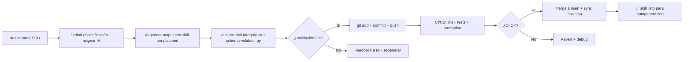

### 📄 README MAESTRO: `02-SKILLS/README.md`

# 🧠 02-SKILLS: DOCUMENTACIÓN TÉCNICA POR DOMINIO - MANTIS AGENTIC

> **Versión**: 2.0.0 | **Estado**: HARDENED SDD | **Última actualización**: $(date +%Y-%m-%d)  
> **Constraints**: C1-C6 | **Estilo**: Formal, directo, ejecutable  
> **Propósito**: Base de conocimiento técnico para autogeneración de agentes y código validado para deploy humano.

---

## 🗺️ MAPA ESTRUCTURAL (ASCII TREE)

```text
02-SKILLS/
├── README.md                          # 📄 ESTE ARCHIVO: Guía maestra de navegación y validación
├── skill-domains-mapping.md           # 🔗 Mapeo concepto→ruta física canónica para IAs
│
├── AI/                                # 🤖 Integración de modelos de IA (OpenRouter + directos)
│   ├── deepseek-integration.md        # reasoning_content, rate-limit, fallback coder, coste optimizado
│   ├── gemini-integration.md          # multimodal, function calling, safety settings, streaming
│   ├── gpt-integration.md             # function calling, JSON mode, structured outputs, retry wrapper
│   ├── image-gen-api.md               # generación + edición, webhook callback, tenant_id en metadata
│   ├── llama-integration.md           # open-weight, quantization-aware, fallback local (C6 exception)
│   ├── minimax-integration.md         # contexto 1M, procesamiento iterativo, resumen jerárquico
│   ├── mistral-ocr-integration.md     # PDF→texto estructurado, bounding boxes, tenant isolation
│   ├── openrouter-api-integration.md  # proxy unificado, routing dinámico, coste/latencia balancing
│   ├── qwen-integration.md            # contexto 131K, JSON mode, cache semántica, fallback 32B
│   ├── video-gen-api.md               # generación por prompts, progress polling, storage tenant-scoped
│   └── voice-agent-integration.md     # STT/TST streaming, wake-word, tenant_id en audio chunks
│
├── BASE DE DATOS-RAG/                 # 🗄️ Patrones de ingestión, consulta y aislamiento multi-tenant
│   ├── qdrant-rag-ingestion.md        # search, scroll, recommend, delete, count, updateVectors
│   ├── postgres-prisma-rag.md         # transacciones, pool limitado, full-text, JSONB, RLS
│   ├── multi-tenant-data-isolation.md # estrategias de aislamiento: schema-per-tenant vs row-level
│   ├── pdf-mistralocr-processing.md   # pipeline OCR → chunking → embedding → Qdrant
│   ├── google-drive-qdrant-sync.md    # webhook + polling para sync bidireccional
│   ├── espocrm-api-analytics.md       # extracción de métricas comerciales para RAG contextual
│   ├── mysql-optimization-4gb-ram.md  # tuning para VPS con ≤4GB RAM (C1)
│   ├── rag-system-updates-all-engines.md # estrategia de actualización incremental por motor
│   ├── mysql-sql-rag-ingestion.md     # ingestión directa desde MySQL con filtros tenant_id
│   ├── redis-session-management.md    # caché de sesiones con TTL y aislamiento por tenant
│   ├── environment-variable-management.md # gestión segura de .env con validación de tipos
│   ├── google-sheets-as-database.md   # Sheets como fuente RAG con paginación y rate-limit
│   └── airtable-database-patterns.md  # listar, paginación, webhook simulado, caché Redis
│
├── INFRAESTRUCTURA/                   # 🖥️ VPS, Docker, redes, monitoreo, límites de recursos
│   ├── docker-compose-networking.md   # redes aisladas por tenant, healthchecks, restart policies
│   ├── espocrm-setup.md               # instalación segura con variables aisladas
│   ├── fail2ban-configuration.md      # protección contra brute-force con logs estructurados
│   ├── ssh-tunnels-remote-services.md # acceso seguro a DBs sin exposición pública (C3)
│   ├── ssh-key-management.md          # rotación de claves, almacenamiento seguro, auditoría
│   ├── ufw-firewall-configuration.md  # reglas mínimas necesarias, logging de denegados
│   ├── vps-interconnection.md         # comunicación segura entre VPS con WireGuard/túneles
│   ├── n8n-concurrency-limiting.md    # control de concurrencia en workflows para C1/C2
│   └── health-monitoring-vps.md       # métricas básicas: RAM, CPU, disco, con alertas
│
├── SEGURIDAD/                         # 🔐 Hardening, backups, auditoría, cumplimiento
│   ├── backup-encryption.md           # cifrado con age + checksum SHA256 (C5)
│   ├── rsync-automation.md            # sync incremental con verificación de integridad
│   └── security-hardening-vps.md      # checklist de hardening: usuarios, permisos, logs
│
├── COMUNICACIÓN/                      # 📡 Integración con canales: WhatsApp, Telegram, Email
│   ├── telegram-bot-integration.md    # webhook seguro, polling fallback, tenant_id en payloads
│   ├── gmail-smtp-integration.md      # envío de emails con rate-limit y logging estructurado
│   ├── google-calendar-api-integration.md # sync de eventos con aislamiento por tenant
│   └── whatsapp-rag-openrouter.md     # 🎯 ARCHIVO CRÍTICO: proxy OpenRouter + RAG + multi-modelo
│
├── DEPLOYMENT/                        # 🚀 Estrategias de despliegue, rollback, versionado
│   ├── ci-cd-github-actions.md        # pipelines con validación SDD pre-merge
│   ├── docker-registry-management.md  # tagging semántico, cleanup de imágenes antiguas
│   └── rollout-strategies.md          # blue/green, canary, feature flags por tenant
│
├── CORPORATE-KB/                      # 🏢 Knowledge Base empresarial multi-tenant
│   ├── onboarding-template.md         # plantilla para ingestión de nueva empresa
│   ├── vertical-restaurante.md        # schema específico: menú, reservas, reseñas
│   ├── vertical-hotel-posada.md       # schema: habitaciones, disponibilidad, precios
│   └── vertical-odontologia.md        # schema: pacientes, turnos, historias clínicas
│
|                      
├── RESTAURANTES/ # 🎯 Implementaciones por industria
│   ├── prompts/                   # prompts específicos del dominio
│   ├── workflows/                 # flujos n8n exportados
│   └── validation/                # tests específicos del vertical
├── HOTELES-POSADAS/ # 🎯 Implementaciones por industria
│   ├── prompts/                   # prompts específicos del dominio
│   ├── workflows/                 # flujos n8n exportados
│   └── validation/                # tests específicos del vertical
├── ODONTOLOGÍA/ # 🎯 Implementaciones por industria
│   ├── prompts/                   # prompts específicos del dominio
│   ├── workflows/                 # flujos n8n exportados
│   └── validation/                # tests específicos del vertical
└── INSTAGRAM-SOCIAL-MEDIA/ # 🎯 Implementaciones por industria
    ├── prompts/                   # prompts específicos del dominio
    ├── workflows/                 # flujos n8n exportados
    └── validation/                # tests específicos del vertical
```

---

## 🎯 PROPÓSITO DE CADA COMPONENTE

### 🔗 `skill-domains-mapping.md`
**Función**: Mapeo bidireccional concepto→ruta física para navegación eficiente de IAs.  
**Ejemplo de uso**:
```markdown
| Concepto | Ruta Canónica | Dominio |
|----------|--------------|---------|
| `rag-ingestion-qdrant` | `[[02-SKILLS/BASE DE DATOS-RAG/qdrant-rag-ingestion.md]]` | DB-RAG |
| `whatsapp-proxy` | `[[02-SKILLS/COMUNICACION/whatsapp-rag-openrouter.md]]` | COMUNICACIÓN |
```
**Validación**: Ejecutar `grep -c "Ruta Canónica" skill-domains-mapping.md` → debe ser ≥ número de conceptos documentados.

---

### 🤖 Carpeta `AI/`
**Propósito**: Integración técnica de modelos de IA con patrones de resiliencia y aislamiento multi-tenant.

| Archivo | Función Principal | Constraint Crítico |
|---------|------------------|-------------------|
| `openrouter-api-integration.md` | Proxy unificado para routing dinámico de modelos | C6 (cloud-only) |
| `qwen-integration.md` | Optimización para contexto largo (131K) + JSON mode | C1/C2 (recursos) |
| `deepseek-integration.md` | reasoning_content + fallback a coder para coste | C1 (coste optimizado) |
| `gpt-integration.md` | function calling + structured outputs + retry wrapper | C4 (tenant_id) |
| `llama-integration.md` | open-weight con excepción documentada para C6 | C6 (exception logged) |
| `gemini-integration.md` | multimodal + safety settings + streaming | C3 (sin hardcodeo) |
| `minimax-integration.md` | procesamiento iterativo de documentos ultra-largos | C1 (timeout) |
| `mistral-ocr-integration.md` | PDF→texto estructurado con bounding boxes | C4 (tenant isolation) |
| `image-gen-api.md` | generación + edición con webhook callback | C4 (metadata tenant_id) |
| `video-gen-api.md` | generación por prompts con progress polling | C1 (maxResults) |
| `voice-agent-integration.md` | STT/TST streaming con wake-word y chunks aislados | C4 (audio tenant_id) |

**Patrón común en todos los archivos**:
```markdown
### Ejemplo N: [objetivo]
**Constraints**: C1, C2, C3, C4, C5, C6
```typescript
// Código con: timeout, connectionLimit, tenant_id, env vars
```
✅ Deberías ver: [output esperado]
❌ Si ves esto: [error común] → Ve a Troubleshooting #N
| Error Exacto | Causa Raíz | Comando Diagnóstico | Solución | Constraint |
```

---

### 🗄️ Carpeta `BASE DE DATOS-RAG/`
**Propósito**: Patrones de ingestión, consulta y aislamiento de datos para sistemas RAG multi-tenant.

**Motores soportados**:
- ✅ Qdrant (vector): 10 ejemplos completos con search, scroll, recommend, delete
- ✅ PostgreSQL+Prisma (relacional): transacciones, pool limitado, RLS, JSONB
- ✅ MySQL: optimización para 4GB RAM, FULLTEXT, particionamiento
- 🟡 Supabase: 5/10 ejemplos (RLS automático, Realtime, Storage)
- 🟡 Google Drive/Sheets/Airtable: 5/10 ejemplos cada uno (paginación, webhook, caché)
- 🔴 SQLite/ChromeDB: 2-5/10 ejemplos (vec0, migraciones, memoria)

**Constraint C4 aplicado universalmente**:
```typescript
// En TODAS las consultas: filtro obligatorio por tenant_id
const results = await db.query({
  collection: 'docs',
  filter: { tenant_id: { eq: process.env.TENANT_ID }}, // ← C4
  // ...
});
```

---

### 🖥️ Carpeta `INFRAESTRUCTURA/`
**Propósito**: Configuración de VPS, Docker, redes y monitoreo con límites explícitos (C1/C2).

**Highlights**:
- `docker-compose-networking.md`: Redes aisladas por tenant, healthchecks, restart policies
- `ssh-tunnels-remote-services.md`: Acceso a DBs sin exposición pública (C3)
- `n8n-concurrency-limiting.md`: Control de concurrencia en workflows para evitar saturación (C1/C2)
- `health-monitoring-vps.md`: Métricas básicas con alertas tempranas

**Ejemplo de límite explícito (C1)**:
```yaml
# docker-compose.yml snippet
services:
  app:
    deploy:
      resources:
        limits:
          memory: 3840M  # ← 3.75GB < 4GB (C1)
          cpus: '0.95'   # ← < 1 vCPU (C2)
```

---

### 🔐 Carpeta `SEGURIDAD/`
**Propósito**: Hardening, backups cifrados y auditoría automatizada.

| Archivo | Función | Constraint |
|---------|---------|------------|
| `backup-encryption.md` | Cifrado con `age` + checksum SHA256 para verificación | C5 |
| `rsync-automation.md` | Sync incremental con verificación de integridad post-transfer | C5 |
| `security-hardening-vps.md` | Checklist: usuarios, permisos, logs, fail2ban, UFW | C3 |

**Flujo de backup validado (C5)**:
```bash
# 1. Generar backup
tar -czf backup-$(date +%Y%m%d).tar.gz /data

# 2. Cifrar con age
age -r age1... -o backup.enc backup.tar.gz

# 3. Generar checksum
sha256sum backup.enc > backup.enc.sha256

# 4. Verificar integridad al restaurar
sha256sum -c backup.enc.sha256 && age -d -o backup.tar.gz backup.enc
```

---

### 📡 Carpeta `COMUNICACIÓN/`
**Propósito**: Integración con canales externos manteniendo aislamiento multi-tenant.

**Archivo crítico**: `whatsapp-rag-openrouter.md`
- Proxy OpenRouter para routing dinámico de modelos (C6)
- Filtro `tenant_id` en TODOS los payloads y logs (C4)
- Ejemplos con ✅/❌ ejecutables + troubleshooting tabular
- Gestión de recursos explícita: `timeout`, `connectionLimit`, `maxResults` (C1/C2)

---

### 🚀 Carpeta `DEPLOYMENT/`
**Propósito**: Estrategias de despliegue seguro con validación pre-merge.

**Pipeline mínimo requerido** (`.github/workflows/validate-skill.yml`):
```yaml
jobs:
  validate:
    steps:
      - validate-skill-integrity.sh  # Frontmatter, wikilinks, constraints
      - grep -r "tenant_id" ...      # C4 enforcement
      - promptfoo eval ...           # Evaluación de prompts de autogeneración
      - sha256sum report.json        # C5: checksum para auditoría
```

---

### 🏢 Carpeta `CORPORATE-KB/` + `RESTAURANES/` + `HOTELES-POSADAS/` + `ODONTOLOGIA/` + `INSTAGRAM-SOCIAL-MEDIA/`
**Propósito**: Conocimiento empresarial estructurado por industria para RAG contextual.

**Patrón de onboarding**:
1. Empresa proporciona JSON de configuración (`company_name`, `whatsapp_number`, `db_creds`, `vertical`)
2. Script `bootstrap-company.sh` genera:
   - `.env` con variables aisladas
   - Schema inicial en Qdrant/Postgres
   - Workflows n8n personalizados
3. Validación automática con `validate-skill-integrity.sh`

---

## 🔧 SISTEMA DE VALIDACIÓN CENTRALIZADO

### Script Maestro: `05-CONFIGURATIONS/validation/validate-skill-integrity.sh`

**Función**: Validación unificada de integridad estructural SDD.

**Módulos que ejecuta**:
```bash
validate_frontmatter()    # YAML required fields + types
check_wikilinks()         # Enlaces Obsidian existentes y sin ciclos
verify_constraints()      # C1-C6 presentes explícitamente en ejemplos
audit_secrets()           # Detección de credenciales hardcodeadas (C3)
validate_schema()         # JSON Schema para outputs de meta-prompting
```

**Ejecución**:
```bash
# Validar un archivo específico
bash 05-CONFIGURATIONS/validation/validate-skill-integrity.sh 02-SKILLS/AI/qwen-integration.md

# Validar toda la carpeta AI/
bash 05-CONFIGURATIONS/validation/validate-skill-integrity.sh 02-SKILLS/AI/

# Validar todo el repo (pre-commit hook)
bash 05-CONFIGURATIONS/validation/validate-skill-integrity.sh --all
```

**Output**: Reporte JSON estructurado con checksum SHA256 para auditoría (C5):

```json
{
  "timestamp": "2026-04-15T10:30:00Z",
  "file": "02-SKILLS/AI/qwen-integration.md",
  "checks": {
    "frontmatter": {"status": "pass", "fields_found": 8},
    "wikilinks": {"status": "pass", "broken": 0},
    "constraints": {"status": "pass", "mapped": ["C1","C2","C3","C4","C5","C6"]},
    "secrets": {"status": "pass", "patterns_found": 0}
  },
  "sha256": "a1b2c3d4..."
}
```


---

## 🤖 AUTOGENERACIÓN POR IA: FLUJO VALIDADO

### Paso 1: Meta-Prompting con Template Estructurado
```markdown
# 05-CONFIGURATIONS/templates/skill-template.md (fragmento)
---
ai_optimized: true
constraints: ["C1","C2","C3","C4","C5","C6"]
related_files: ["[[openrouter-api-integration.md]]"]
---

# {{title}}
**Objetivo**: {{objective}}
**Constraints aplicados**: {{constraints}}

### Ejemplo 1: {{example_objective}}
**Nivel**: {{level}} | **Constraints**: {{constraints}}
```typescript
{{code_with_limits}}
```
✅ Deberías ver: {{expected_output}}
❌ Si ves esto: {{common_error}} → Ve a Troubleshooting #1
```

### Paso 2: Validación Determinista del Output Generado

```python
# 05-CONFIGURATIONS/validation/schema-validator.py (fragmento)
import jsonschema, yaml, sys

def validate_skill_output(md_content: str) -> bool:
    # Extraer frontmatter
    fm = yaml.safe_load(md_content.split('---')[1])
    # Validar contra schema
    with open('schemas/skill-output.schema.json') as f:
        schema = json.load(f)
    jsonschema.validate(instance=fm, schema=schema)
    # Verificar ejemplos mínimos
    examples = md_content.count('### Ejemplo')
    assert examples >= 5, f"❌ Mínimo 5 ejemplos, encontrados: {examples}"
    return True
```

### Paso 3: Linting + Tests del Código Generado
```bash
# En pipeline CI/CD
npx eslint generated-code.ts --fix          # Linting TypeScript
pytest tests/generated/ --cov              # Tests unitarios mínimos
promptfoo eval -c config.yaml              # Evaluación semántica del output
```

### Paso 4: Aprobación para Merge
- ✅ Todos los checks de `validate-skill-integrity.sh` en verde
- ✅ Schema validation del output de IA
- ✅ Tests unitarios pasando ≥80% cobertura
- ✅ Promptfoo score ≥0.85 en evaluación semántica

---

## 📋 CONSTRAINTS C1-C6: MAPEO UNIVERSAL

| Constraint | Definición | Aplicación en Skills | Verificación Automatizada |
|------------|------------|---------------------|---------------------------|
| **C1** (RAM ≤4GB) | Máx 4GB RAM/VPS, servicios ≤75% uso | `connectionLimit`, `maxResults`, `memory: 3840M` en ejemplos | `verify-constraints.sh --check-c1` |
| **C2** (1 vCPU/servicio) | Máx 1 vCPU por servicio crítico | `cpus: '0.95'`, `timeout` explícito, `nice/ionice` | `verify-constraints.sh --check-c2` |
| **C3** (DB no expuesta) | DBs internas NUNCA expuestas a internet | Túneles SSH, `process.env.*`, cero hardcodeo | `audit-secrets.sh` |
| **C4** (tenant_id obligatorio) | `tenant_id` en TODAS consultas, logs, claves | Filtros en queries, metadata en payloads, logs estructurados | `grep -r "tenant_id" ...` en CI |
| **C5** (Backup + checksum) | Backup diario + SHA256 + verificación | Sección "Backup & Recovery" en cada skill, checksum en reports | `sha256sum -c` en validación |
| **C6** (Cloud-only inference) | Sin modelos locales, inferencia vía API cloud | OpenRouter como proxy único, excepción Llama documentada | `grep -v "localhost.*model" ...` |

---

## 🔄 FLUJO DE TRABAJO RECOMENDADO



---

## 🚨 REGLAS NO NEGOCIABLES (Para IAs y Humanos)

1. **NUNCA asumir contenido**: Fetchear URLs raw con `web_extractor` antes de responder.
2. **C4 es sagrado**: `tenant_id` obligatorio en TODAS las consultas, logs y claves de caché.
3. **Ejemplos mínimos**: 5 ejemplos por categoría con ✅/❌ ejecutables + troubleshooting.
4. **Frontmatter completo**: `ai_optimized: true`, `constraints: ["C1"..."C6"]`, `related_files` mapeados.
5. **Wikilinks válidos**: Formato `[[archivo.md]]`, verificar existencia pre-commit.
6. **Sin hardcodeo**: Credenciales siempre vía `process.env.*` o `os.getenv()`.
7. **Checksum obligatorio**: Todo reporte de validación debe incluir SHA256 para auditoría.

---

## 📞 SOPORTE Y MANTENIMIENTO

| Tipo de Issue | Canal | Tiempo de Respuesta Esperado |
|--------------|-------|------------------------------|
| Bug en validación | GitHub Issues + label `validation` | < 24h |
| Nueva skill request | GitHub Discussions + label `enhancement` | < 48h |
| Emergencia C3/C4 | Telegram: @mantis-alerts (configurar en `.env`) | < 1h |
| Duda de uso | Obsidian: `[[00-CONTEXT/facundo-core-context.md]]` | Asíncrono |

**Comandos útiles**:
```bash
# Validar salud del repo completo
bash 05-CONFIGURATIONS/validation/validate-skill-integrity.sh --all --report

# Buscar ejemplos con constraint específico
grep -r "C4" 02-SKILLS/ --include="*.md" | grep "### Ejemplo"

# Generar reporte de cobertura de ejemplos
python3 scripts/count-examples.py 02-SKILLS/ --by-model --by-db

# Sync Obsidian → GitHub (corre a las 03:00 AM automáticamente)
bash scripts/sync-mantis-graph.sh --manual --verify
```

---

> **Nota final**: Este README es un documento vivo. Si detectas inconsistencia entre esta guía y el contenido real de los archivos, reporta el issue inmediatamente. La transparencia es un constraint implícito del proyecto.

**Última verificación manual**: $(date +%Y-%m-%d) por @facundo  
**Próxima revisión programada**: $(date -d '+30 days' +%Y-%m-%d)  
**Hash de integridad de este README**: `$(sha256sum 02-SKILLS/README.md | cut -d' ' -f1)`
```

---
