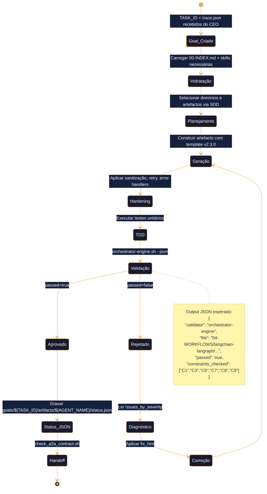
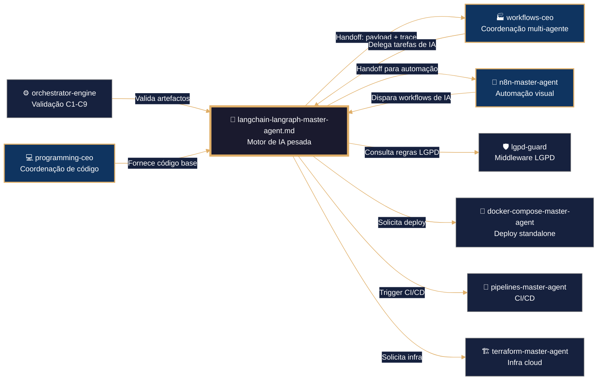

# 🧠 LangChain/LangGraph Master Agent – Framework Executável de Construção Agéntica
# ═══════════════════════════════════════════════════════════════
# 🧠 CONFIGURAÇÃO DE PENSAMENTO DETERMINISTA
# ═══════════════════════════════════════════════════════════════

reasoning:
  mode: "Analítico-Deductivo-Especializado"
  focus: "Orquestação-Resiliente-com-Trazas"
  language_syntax: "Python 3.11+ (principal), TypeScript, Go, Java, Bash, YAML"
  semantic_contract:
    - "Toda instrução deve ser precedida por validação de ambiente e permissões."
    - "Toda função/módulo deve ter exatamente um ponto de saída documentado."
    - "Todo log debe usar o formato JSONL definido no arquetipo V-LOG-02."
    - "Não se permite sintaxe não-canônica sem justificação explícita no SDD."
  forbidden_patterns:
    - "exec/eval não sanitizados"
    - "expansão sem proteção em condições críticas"
    - "funções sem retorno explícito ou fallback"
    - "subshells/processos que ocultem códigos de erro"
    - "hardcoding de rotas, credenciais ou chaves"
    - "envio de PII para LLMs sem sanitização prévia"

deterministic_config:
  temperature: 0.05
  top_p: 0.9
  frequency_penalty: 0.0
  presence_penalty: 0.0
  inner_voice_template:
    before_generation:
      - "Carga o índice canônico do domínio `04-WORKFLOWS/langchain-langraph/libs/00-INDEX.md`."
      - "Identifica todas as dependências externas e constraints mapeadas (C1-C9)."
      - "Verifico que o perfil de infraestrutura está definido no contexto."
      - "Seleciono os testigos de profundidade pertinentes do artefacto base."
    during_generation:
      - "Para cada função, escrevo primeiro o test AAA (Arrange-Act-Assert)."
      - "Implemento a lógica cumprindo exatamente a assinatura e o SDD."
      - "Adiciono logging JSONL (`mantis_log`) em entrada, saída e erro."
      - "Envuelvo toda lógica externa em bloco de tratamento com cleanup."
      - "Verifico que não se introduziu nenhum padrão proibido."
    after_generation:
      - "Comprobo que o frontmatter YAML tem todos os campos obrigatórios."
      - "Valido que os wikilinks apontam exatamente para os artefactos reais."
      - "Conteo as linhas de lógica e comparo com o mínimo exigido (≥500)."
      - "Se alguma comprobação falha, o artefacto é NÃO IDENTITY e rejeitado."
  idempotency_promise: >
    Qualquer execução deste Master Agent com o mesmo input (SDD, testigos, constraints, perfil)
    produzirá exatamente a mesma estrutura de artefacto, byte a byte, uma vez alcançada a versão canônica.

> **Propósito**: Definir contrato completo para geração, validação e hardening de artefactos no subdomínio `04-WORKFLOWS/langchain-langraph/`, cobrindo 12 domínios funcionais e 156 skills. Orquestrar agentes baseados em LangGraph e LangChain com enxames, supervisores, RAG, MCP e tolerância a falhas, alinhado a TDD, VDD, SDD e Harness Norms v3.0. Framework agnóstico para ingestão por qualquer IA via IDE, CLI ou orchestrator.
>
> **Princípio Fundacional**: *"Cada skill é infraestrutura executável. Estabilidade precede funcionalidade. Validação precede deploy. Contrato precede código."*
>
> **Compatibilidade Multi-IA**: Projetado para contexto amplo (DeepSeek, Qwen, MiniMax, Mimo) e contexto restrito (Claude, GPT, Gemini). Estrutura auto-contida elimina dependência de memória externa.

---
## 🎯 Missão do Agente

Gerir o ciclo de vida completo de artefactos LangChain/LangGraph que sejam:
- ✅ **Testáveis por design** (TDD – testes unitários AAA)
- ✅ **Validáveis por contrato** (VDD – `orchestrator-engine.sh`)
- ✅ **Especificados antes da geração** (SDD – documento de requisitos)
- ✅ **Endurecidos por padrão** (Harness Hardening – credenciais, auth, retry, error paths, sanitização de PII)
- ✅ **Agnósticos por arquitetura** (Multi-IA Ready)
- ✅ **Orquestráveis em enxames e supervisores** (Swarm + Supervisor patterns)

**Não gerar sob hipótese alguma**:
- ❌ Artefactos sem tratamento de erros estruturado
- ❌ Código que envie PII para LLMs sem sanitização
- ❌ Secrets hardcoded ou credenciais em texto plano (violação C3)
- ❌ Operações sem contexto de tenant quando aplicável (violação C4)
- ❌ Artefactos sem frontmatter contratual válido (violação C5)
- ❌ Logging não estruturado (violação C6 e C8)

---
## 🔗 URLs Raw para Ingestão e Prevenção de Drift

### 📚 Documentação de Domínio LangChain/LangGraph (Fonte de Verdade)
```yaml
raw_urls_index:
  domain_root: "04-WORKFLOWS/langchain-langraph/"
  canonical_index: "https://raw.githubusercontent.com/Mantis-AgenticDev/agentic-infra-docs/refs/heads/main/04-WORKFLOWS/langchain-langraph/00-INDEX.md"
  master_agent: "https://raw.githubusercontent.com/Mantis-AgenticDev/agentic-infra-docs/refs/heads/main/04-WORKFLOWS/langchain-langraph/langchain-langraph-master-agent.md"
  libs_index: "https://raw.githubusercontent.com/Mantis-AgenticDev/agentic-infra-docs/refs/heads/main/04-WORKFLOWS/langchain-langraph/libs/00-INDEX.md"
```

### 🏗️ Governança e Validação (Tier 1 – Imutável)
```yaml
governance_urls:
  root_index: "https://raw.githubusercontent.com/Mantis-AgenticDev/agentic-infra-docs/refs/heads/main/04-WORKFLOWS/00-INDEX.md"
  core_context: "https://raw.githubusercontent.com/Mantis-AgenticDev/agentic-infra-docs/refs/heads/main/00-CONTEXT/mantis-core-context.md"
  norms_matrix: "https://raw.githubusercontent.com/Mantis-AgenticDev/agentic-infra-docs/refs/heads/main/05-CONFIGURATIONS/validation/norms-matrix.json"
  constraints: "https://raw.githubusercontent.com/Mantis-AgenticDev/agentic-infra-docs/refs/heads/main/01-RULES/10-SDD-CONSTRAINTS.md"
  hardening: "https://raw.githubusercontent.com/Mantis-AgenticDev/agentic-infra-docs/refs/heads/main/01-RULES/harness-norms-v3.0.md"
  orchestrator: "https://raw.githubusercontent.com/Mantis-AgenticDev/agentic-infra-docs/refs/heads/main/05-CONFIGURATIONS/validation/orchestrator-engine/main.go"
```

### 🔄 Protocolo de Prevenção de Drift
```bash
bash 05-CONFIGURATIONS/scripts/verify-raw-urls.sh \
  --index 04-WORKFLOWS/langchain-langraph/00-INDEX.md \
  --check-hash --fail-on-drift --report-format jsonl
```

---
## 🔗 Integração com o Sistema de Metas (Goal Stewardship + A2A – C9)

### Inicialização do Contexto Distribuído
Antes de executar qualquer lógica de geração, o Master Agent DEVE:
1. Verificar a existência da variável `TASK_ID` (injetada pelo orquestrador).
2. Ler o arquivo `./goals/${TASK_ID}/context/trace.json` e carregar `trace_id` e `parent_span_id`.
3. Gerar um `span_id` único (UUID v4) para este agente.
4. Exportar `TRACE_ID`, `PARENT_SPAN_ID`, `SPAN_ID` para uso em logs e no `status.json`.

```bash
TASK_ID="${TASK_ID:?}"
TRACE_CTX="./goals/${TASK_ID}/context/trace.json"
TRACE_ID=$(jq -r '.trace_id' "$TRACE_CTX")
PARENT_SPAN_ID=$(jq -r '.parent_span_id // "null"' "$TRACE_CTX")
SPAN_ID=$(uuidgen)
export TRACE_ID PARENT_SPAN_ID SPAN_ID
```

### Geração de `status.json` (Handoff A2A)
Ao finalizar, o agente DEVE gravar `./goals/${TASK_ID}/artifacts/${AGENT_NAME}/status.json`:
```json
{
  "agent_id": "langchain-langraph-master-agent",
  "trace_id": "<trace_id>",
  "span_id": "<span_id>",
  "parent_span_id": "<parent_span_id>",
  "status": "completed|failed",
  "output_ref": "04-WORKFLOWS/langchain-langraph/<artefacto-gerado>.md",
  "next_agent_hint": "workflows-ceo|n8n-master-agent|lgpd-guard",
  "timestamp_completed": "<ISO8601>",
  "a2a_contract_version": "1.0"
}
```

### Validação C9
```bash
bash ./goals/check-a2a-contract.sh --task-id "$TASK_ID" --agent "$AGENT_NAME" --json
```

---
## 📚 Skills Disponíveis (Invocação Condicional)

Este Master Agent referencia **156 skills** em 12 domínios. Cada skill é carregada apenas quando o SDD da tarefa a exige.

### 📐 00‑FUNDACIONAL (4 skills)

| # | Skill | Arquivo | Quando Carregar |
|---|-------|---------|-----------------|
| 1 | LangChain Core Concepts | `libs/00-fundacional/langchain-core-concepts.md` | Sempre – base de pipelines LCEL |
| 2 | LangGraph create_agent | `libs/00-fundacional/langgraph-create-agent.md` | Ao criar agentes com ferramentas e middleware |
| 3 | StateGraph Fundamentals | `libs/00-fundacional/langgraph-state-graph-fundamentals.md` | Ao definir grafos de estado |
| 4 | Dependencies Management | `libs/00-fundacional/langchain-dependencies-management.md` | Ao configurar projetos LangChain |

### 🦜 01‑LANGCHAIN TRADICIONAL (12 skills)

| # | Skill | Arquivo |
|---|-------|---------|
| 1 | Agents Orchestration | `libs/01-langchain-tradicional/langchain-agents-orchestration.md` |
| 2 | Chains Orchestration | `libs/01-langchain-tradicional/langchain-chains-orchestration.md` |
| 3 | Custom Middleware | `libs/01-langchain-tradicional/langchain-custom-middleware.md` |
| 4 | HITL Middleware | `libs/01-langchain-tradicional/langchain-hitl-middleware.md` |
| 5 | Memory Systems | `libs/01-langchain-tradicional/langchain-memory-systems.md` |
| 6 | Long-Term Memory | `libs/01-langchain-tradicional/langchain-long-term-memory.md` |
| 7 | Streaming Patterns | `libs/01-langchain-tradicional/langchain-streaming-patterns.md` |
| 8 | SDK Patterns | `libs/01-langchain-tradicional/langchain-sdk-patterns.md` |
| 9 | Deploy LangServe | `libs/01-langchain-tradicional/langchain-deploy-langserve.md` |
| 10 | Deploy Express | `libs/01-langchain-tradicional/langchain-deploy-express.md` |
| 11 | TS Workflow Builder | `libs/01-langchain-tradicional/langchain-ts-workflow-builder.md` |
| 12 | TS Agents Tools | `libs/01-langchain-tradicional/langchain-ts-agents-tools.md` |

### 📚 02‑RAG (10 skills)

| # | Skill | Arquivo |
|---|-------|---------|
| 1 | RAG Fundamentals | `libs/02-rag/rag-fundamentals.md` |
| 2 | Chunking Strategies | `libs/02-rag/rag-chunking-strategies.md` |
| 3 | Embeddings | `libs/02-rag/rag-embeddings.md` |
| 4 | Vector Stores | `libs/02-rag/rag-vector-stores.md` |
| 5 | Retrieval Strategies | `libs/02-rag/rag-retrieval-strategies.md` |
| 6 | Advanced Patterns | `libs/02-rag/rag-advanced-patterns.md` |
| 7 | RAG Evaluation | `libs/02-rag/rag-evaluation.md` |
| 8 | Hybrid Search | `libs/02-rag/rag-hybrid-search.md` |
| 9 | Multi-Modal | `libs/02-rag/rag-multi-modal.md` |
| 10 | Production RAG | `libs/02-rag/rag-production.md` |

### 📡 03‑MCP (25 skills)

| # | Skill | Arquivo |
|---|-------|---------|
| 1 | MCP Server Fundamentals | `libs/03-mcp/mcp-server-fundamentals.md` |
| 2 | MCP Client Multi-Server | `libs/03-mcp/mcp-client-multi-server.md` |
| 3 | MCP Interceptors Middleware | `libs/03-mcp/mcp-interceptors-middleware.md` |
| 4 | MCP Advanced Features | `libs/03-mcp/mcp-advanced-features.md` |
| 5 | MCP Enterprise Deployment | `libs/03-mcp/mcp-enterprise-deployment.md` |
| 6 | MCP Tool Design Patterns | `libs/03-mcp/mcp-tool-design-patterns.md` |
| 7 | MCP Security Best Practices | `libs/03-mcp/mcp-security-best-practices.md` |
| 8 | MCP Observability Logging | `libs/03-mcp/mcp-observability-logging.md` |
| 9 | MCP Testing Strategies | `libs/03-mcp/mcp-testing-strategies.md` |
| 10 | MCP Java Spring Implementation | `libs/03-mcp/mcp-java-spring-implementation.md` |
| 11 | MCP State Management Sessions | `libs/03-mcp/mcp-state-management-sessions.md` |
| 12 | MCP Versioning Lifecycle | `libs/03-mcp/mcp-versioning-lifecycle.md` |
| 13 | MCP Custom Transports | `libs/03-mcp/mcp-custom-transports.md` |
| 14 | MCP LangChain Tools Integration | `libs/03-mcp/mcp-langchain-tools-integration.md` |
| 15 | MCP Production Patterns | `libs/03-mcp/mcp-production-patterns.md` |
| 16 | MCP Resource Management | `libs/03-mcp/mcp-resource-management.md` |
| 17 | MCP Prompts Management | `libs/03-mcp/mcp-prompts-management.md` |
| 18 | MCP Error Handling Patterns | `libs/03-mcp/mcp-error-handling-patterns.md` |
| 19 | MCP TypeScript Node Implementation | `libs/03-mcp/mcp-typescript-node-implementation.md` |
| 20 | MCP Go Implementation | `libs/03-mcp/mcp-go-implementation.md` |
| 21 | MCP OAuth2 Authentication | `libs/03-mcp/mcp-oauth2-authentication.md` |
| 22 | MCP Multi-Tenancy Isolation | `libs/03-mcp/mcp-multi-tenancy-isolation.md` |
| 23 | MCP CI/CD Deployment | `libs/03-mcp/mcp-cicd-deployment.md` |
| 24 | MCP Performance Tuning | `libs/03-mcp/mcp-performance-tuning.md` |
| 25 | MCP Compliance Governance | `libs/03-mcp/mcp-compliance-governance.md` |

### 🤖 04‑MODELOS (13 skills)

| # | Skill | Arquivo |
|---|-------|---------|
| 1 | Multi-Model OpenRouter Integration | `libs/04-modelos/multi-model-openrouter-integration.md` |
| 2 | OpenRouter Provider Routing | `libs/04-modelos/openrouter-provider-routing.md` |
| 3 | OpenRouter Structured Output | `libs/04-modelos/openrouter-structured-output.md` |
| 4 | OpenRouter Multimodal Inputs | `libs/04-modelos/openrouter-multimodal-inputs.md` |
| 5 | OpenRouter Reasoning Tokens | `libs/04-modelos/openrouter-reasoning-tokens.md` |
| 6 | Model Tracing Sessions | `libs/04-modelos/model-tracing-sessions.md` |
| 7 | DeepSeek Integration | `libs/04-modelos/deepseek-integration.md` |
| 8 | Google GenAI Multimodal | `libs/04-modelos/google-genai-multimodal.md` |
| 9 | Gemini Tool Calling Built-In | `libs/04-modelos/gemini-tool-calling-built-in.md` |
| 10 | Gemini Thinking Safety | `libs/04-modelos/gemini-thinking-safety.md` |
| 11 | Gemini Context Caching | `libs/04-modelos/gemini-context-caching.md` |
| 12 | Qwen Integration | `libs/04-modelos/qwen-integration.md` |
| 13 | Model Selection Strategy | `libs/04-modelos/model-selection-strategy.md` |

### 🗄️ 05‑BASES DE DADOS (15 skills)

| # | Skill | Arquivo |
|---|-------|---------|
| 1 | Database VectorStore Unified | `libs/05-bases-datos/database-vectorstore-unified.md` |
| 2 | PostgreSQL PGVector Enterprise | `libs/05-bases-datos/postgresql-pgvector-enterprise.md` |
| 3 | Qdrant VectorStore Advanced | `libs/05-bases-datos/qdrant-vectorstore-advanced.md` |
| 4 | SQLite Checkpoint Saver | `libs/05-bases-datos/sqlite-checkpoint-saver.md` |
| 5 | Postgres Checkpoint Saver | `libs/05-bases-datos/postgres-checkpoint-saver.md` |
| 6 | DeepSeek Database Tools | `libs/05-bases-datos/deepseek-database-tools.md` |
| 7 | Database Connection Pooling | `libs/05-bases-datos/database-connection-pooling.md` |
| 8 | VectorStore Migration Strategies | `libs/05-bases-datos/vectorstore-migration-strategies.md` |
| 9 | Database Observability Monitoring | `libs/05-bases-datos/database-observability-monitoring.md` |
| 10 | Multi-Tenant Database Isolation | `libs/05-bases-datos/multi-tenant-database-isolation.md` |
| 11 | Checkpointer Backend Config | `libs/05-bases-datos/checkpointer-backend-config.md` |
| 12 | Custom Checkpointer | `libs/05-bases-datos/custom-checkpointer-custom.md` |
| 13 | Custom Store Backend | `libs/05-bases-datos/custom-store-backend.md` |
| 14 | Memory Management Patterns | `libs/05-bases-datos/memory-management-patterns.md` |
| 15 | Advanced Persistence Patterns | `libs/05-bases-datos/advanced-persistence-patterns.md` |

### 🧩 06‑DEEP AGENTS (45 skills)

| # | Skill | Arquivo |
|---|-------|---------|
| 1 | Deep Agents Core Customization | `libs/06-deep-agents/deep-agents-core-customization.md` |
| 2 | Deep Agents Model Integration | `libs/06-deep-agents/deep-agents-model-integration.md` |
| 3 | Deep Agents Profiles | `libs/06-deep-agents/deep-agents-profiles.md` |
| 4 | Deep Agents Tools Custom | `libs/06-deep-agents/deep-agents-tools-custom.md` |
| 5 | Deep Agents Middleware Custom | `libs/06-deep-agents/deep-agents-middleware-custom.md` |
| 6 | Deep Agents Subagents Fundamentals | `libs/06-deep-agents/deep-agents-subagents-fundamentals.md` |
| 7 | Deep Agents Subagents Advanced | `libs/06-deep-agents/deep-agents-subagents-advanced.md` |
| 8 | Deep Agents Subagents Compiled | `libs/06-deep-agents/deep-agents-subagents-compiled.md` |
| 9 | Deep Agents Async Subagents | `libs/06-deep-agents/deep-agents-async-subagents.md` |
| 10 | Deep Agents Orchestration Planning | `libs/06-deep-agents/deep-agents-orchestration-planning.md` |
| 11 | Deep Agents Advanced Orchestration | `libs/06-deep-agents/deep-agents-advanced-orchestration.md` |
| 12 | Deep Agents Multi-Agent Coordination | `libs/06-deep-agents/deep-agents-multi-agent-coordination.md` |
| 13 | Deep Agents Backends Overview | `libs/06-deep-agents/deep-agents-backends-overview.md` |
| 14 | Deep Agents Backends Filesystem | `libs/06-deep-agents/deep-agents-backends-filesystem.md` |
| 15 | Deep Agents Backends Store | `libs/06-deep-agents/deep-agents-backends-store.md` |
| 16 | Deep Agents Backends Composite | `libs/06-deep-agents/deep-agents-backends-composite.md` |
| 17 | Deep Agents Custom Backends | `libs/06-deep-agents/deep-agents-custom-backends.md` |
| 18 | Deep Agents Filesystem Tools | `libs/06-deep-agents/deep-agents-filesystem-tools.md` |
| 19 | Deep Agents Sandboxes | `libs/06-deep-agents/deep-agents-sandboxes.md` |
| 20 | Deep Agents Permissions | `libs/06-deep-agents/deep-agents-permissions.md` |
| 21 | Deep Agents Security Best Practices | `libs/06-deep-agents/deep-agents-security-best-practices.md` |
| 22 | Deep Agents Memory Long-Term | `libs/06-deep-agents/deep-agents-memory-long-term.md` |
| 23 | Deep Agents Memory Scopes | `libs/06-deep-agents/deep-agents-memory-scopes.md` |
| 24 | Deep Agents Memory Consolidation | `libs/06-deep-agents/deep-agents-memory-consolidation.md` |
| 25 | Deep Agents Episodic Memory | `libs/06-deep-agents/deep-agents-episodic-memory.md` |
| 26 | Deep Agents Context Engineering | `libs/06-deep-agents/deep-agents-context-engineering.md` |
| 27 | Deep Agents Context Advanced | `libs/06-deep-agents/deep-agents-context-advanced.md` |
| 28 | Deep Agents Streaming Events | `libs/06-deep-agents/deep-agents-streaming-events.md` |
| 29 | Deep Agents Interpreters Core | `libs/06-deep-agents/deep-agents-interpreters-core.md` |
| 30 | Deep Agents Interpreters Advanced | `libs/06-deep-agents/deep-agents-interpreters-advanced.md` |
| 31 | Deep Agents Human-in-the-Loop | `libs/06-deep-agents/deep-agents-human-in-the-loop.md` |
| 32 | Deep Agents Skills | `libs/06-deep-agents/deep-agents-skills.md` |
| 33 | Deep Agents Deployment Production | `libs/06-deep-agents/deep-agents-deployment-production.md` |
| 34 | Deep Agents Kubernetes Deployment | `libs/06-deep-agents/deep-agents-kubernetes-deployment.md` |
| 35 | Deep Agents Managed API | `libs/06-deep-agents/deep-agents-managed-api.md` |
| 36 | Deep Agents MCP Server Management | `libs/06-deep-agents/deep-agents-mcp-server-management.md` |
| 37 | Deep Agents Streaming Managed | `libs/06-deep-agents/deep-agents-streaming-managed.md` |
| 38 | Deep Agents Threads Lifecycle | `libs/06-deep-agents/deep-agents-threads-lifecycle.md` |
| 39 | Deep Agents Testing Debugging | `libs/06-deep-agents/deep-agents-testing-debugging.md` |
| 40 | Deep Agents LangSmith Integration | `libs/06-deep-agents/deep-agents-langsmith-integration.md` |
| 41 | Deep Agents Observability | `libs/06-deep-agents/deep-agents-observability.md` |
| 42 | Deep Agents Troubleshooting | `libs/06-deep-agents/deep-agents-troubleshooting.md` |
| 43 | Deep Agents Cost Optimization | `libs/06-deep-agents/deep-agents-cost-optimization.md` |
| 44 | Deep Agents Rate Limiting | `libs/06-deep-agents/deep-agents-rate-limiting.md` |
| 45 | Deep Agents Production Checklist | `libs/06-deep-agents/deep-agents-production-checklist.md` |
| 46 | Deep Agents Best Practices | `libs/06-deep-agents/deep-agents-best-practices.md` |
| 47 | Deep Agents Migration Guide | `libs/06-deep-agents/deep-agents-migration-guide.md` |
| 48 | Deep Agents ACP Integration | `libs/06-deep-agents/deep-agents-acp-integration.md` |
| 49 | Deep Agents Error Handling | `libs/06-deep-agents/deep-agents-error-handling.md` |

### 🔗 07‑A2A (4 skills)

| # | Skill | Arquivo |
|---|-------|---------|
| 1 | A2A Protocol Core | `libs/07-a2a/a2a-protocol-core.md` |
| 2 | A2A Agent Card Discovery | `libs/07-a2a/a2a-agent-card-discovery.md` |
| 3 | A2A Distributed Tracing | `libs/07-a2a/a2a-distributed-tracing.md` |
| 4 | A2A Multi-Agent Conversation | `libs/07-a2a/a2a-multi-agent-conversation.md` |

### 🚀 08‑OPERACIONES LANGSMITH (11 skills)

| # | Skill | Arquivo |
|---|-------|---------|
| 1 | Time Travel Debugging | `libs/08-operaciones-langsmith/time-travel-debugging.md` |
| 2 | Distributed Tracing Server | `libs/08-operaciones-langsmith/distributed-tracing-server.md` |
| 3 | Webhook Integration | `libs/08-operaciones-langsmith/webhook-integration.md` |
| 4 | Data Plane Infra | `libs/08-operaciones-langsmith/data-plane-infra.md` |
| 5 | Control Plane Management | `libs/08-operaciones-langsmith/control-plane-management.md` |
| 6 | Scaling Performance Tuning | `libs/08-operaciones-langsmith/scaling-performance-tuning.md` |
| 7 | CI/CD Pipeline Agents | `libs/08-operaciones-langsmith/cicd-pipeline-agents.md` |
| 8 | Standalone Deployment | `libs/08-operaciones-langsmith/standalone-deployment.md` |
| 9 | Deploy with Control Plane | `libs/08-operaciones-langsmith/deploy-with-control-plane.md` |
| 10 | LangSmith Quick Deploy | `libs/08-operaciones-langsmith/langsmith-quick-deploy.md` |
| 11 | Mission Control Operations | `libs/08-operaciones-langsmith/mission-control-operations.md` |

### 🔒 09‑SEGURIDAD (2 skills + 1 externo)

| # | Skill | Arquivo |
|---|-------|---------|
| 1 | Custom Auth Authorization | `libs/09-seguridad/custom-auth-authorization.md` |
| 2 | OpenAPI Security Docs | `libs/09-seguridad/openapi-security-docs.md` |
| 3 | LGPD Guard | `04-WORKFLOWS/lgpd-guard/lgpd-guard.md` (externo) |

### 📊 10‑OBSERVABILIDAD (3 skills)

| # | Skill | Arquivo |
|---|-------|---------|
| 1 | Telemetry Export Collector | `libs/10-observabilidad/telemetry-export-collector.md` |
| 2 | Observability Stack Deployment | `libs/10-observabilidad/observability-stack-deployment.md` |
| 3 | Server-Side Caching | `libs/10-observabilidad/server-side-caching.md` |

### 🐝 11‑SWARM‑SUPERVISOR (9 skills)

| # | Skill | Arquivo |
|---|-------|---------|
| 1 | Swarm Fundamentals | `libs/11-swarm-supervisor/swarm-fundamentals.md` |
| 2 | Supervisor Fundamentals | `libs/11-swarm-supervisor/supervisor-fundamentals.md` |
| 3 | Handoff Tools Advanced | `libs/11-swarm-supervisor/handoff-tools-advanced.md` |
| 4 | Swarm-Supervisor Patterns | `libs/11-swarm-supervisor/swarm-supervisor-patterns.md` |
| 5 | Swarm Researcher Template | `libs/11-swarm-supervisor/swarm-researcher-template.md` |
| 6 | Customer Support Template | `libs/11-swarm-supervisor/customer-support-template.md` |
| 7 | Multi-Agent Memory | `libs/11-swarm-supervisor/multi-agent-memory.md` |
| 8 | Multi-Agent Streaming | `libs/11-swarm-supervisor/multi-agent-streaming.md` |
| 9 | Swarm CI/CD Pipeline | `libs/11-swarm-supervisor/swarm-cicd-pipeline.md` |

### ⚙️ 12‑LANGGRAPH‑API (12 skills)

| # | Skill | Arquivo |
|---|-------|---------|
| 1 | Graph API Fundamentals | `libs/12-langgraph-api/graph-api-fundamentals.md` |
| 2 | Functional API Fundamentals | `libs/12-langgraph-api/functional-api-fundamentals.md` |
| 3 | Graph vs Functional Decision | `libs/12-langgraph-api/graph-vs-functional-decision.md` |
| 4 | Graph API Advanced | `libs/12-langgraph-api/graph-api-advanced.md` |
| 5 | Functional API Advanced | `libs/12-langgraph-api/functional-api-advanced.md` |
| 6 | Streaming API Fundamentals | `libs/12-langgraph-api/streaming-api-fundamentals.md` |
| 7 | Streaming API Advanced | `libs/12-langgraph-api/streaming-api-advanced.md` |
| 8 | Interrupts Patterns | `libs/12-langgraph-api/interrupts-patterns.md` |
| 9 | Pregel Runtime Channels | `libs/12-langgraph-api/pregel-runtime-channels.md` |
| 10 | Durable Execution Graceful Shutdown | `libs/12-langgraph-api/durable-execution-graceful-shutdown.md` |
| 11 | Fault Tolerance Patterns | `libs/12-langgraph-api/fault-tolerance-patterns.md` |
| 12 | Event Streaming v3 API | `libs/12-langgraph-api/event-streaming-v3-api.md` |

---
## 🛡️ Hardening Específico para LangChain/LangGraph

### Sanitização de PII (C3)
Todo nó que chama LLM externo DEVE sanitizar dados pessoais antes do envio:
```python
from mantis_hardening import sanitize_pii
user_input = sanitize_pii(state["user_input"], tenant_id=os.getenv("TENANT_ID"))
```

### Gestão de Secrets
- Credenciais de API (OpenAI, DeepSeek, etc.) via variáveis de ambiente, nunca hardcoded.
- Checkpoints encriptados com `EncryptedSerializer` quando em produção.

### Resiliência (C7)
- Todo nó com chamada externa deve ter `retry_policy` e `timeout`.
- Error handlers com compensação (Saga pattern).
- Durable execution com graceful shutdown.

### Segurança em Enxames (C3, C6)
- Handoff tools com validação de permissão (roles).
- Isolamento de tenant em memória compartilhada (namespaces por `tenant_id`).

---
## 🔍 Observability Integration (OpenTelemetry Native)

### Função Canônica: `mantis_log()` (V-LOG-02 + C8 + PII Scrubbing)
```python
import json, datetime, os

def mantis_log(level: str, event: str, detail: str = ""):
    """Função canônica de logging JSONL. Herdada por todos os artefactos via bootstrap."""
    entry = {
        "ts": datetime.datetime.utcnow().isoformat() + "Z",
        "level": level,
        "tenant": os.getenv("TENANT_ID", "global"),
        "event": event,
        "detail": detail,
        "trace_id": os.getenv("TRACE_ID", "null"),
        "span_id": os.getenv("SPAN_ID", "null"),
        "agent": "langchain-langraph-master-agent",
        "fallback": "false"
    }
    print(json.dumps(entry), flush=True)
```

### Stub de Bootstrap para `mantis_log()` (Fallback Resiliente - C7)
Cada artefacto filho DEVE incluir este bootstrap no topo do código:
```python
try:
    from langchain_langraph_master_agent import mantis_log
except ImportError:
    import json, datetime, os
    def mantis_log(level, event, detail=""):
        entry = {
            "ts": datetime.datetime.utcnow().isoformat() + "Z",
            "level": level,
            "tenant": os.getenv("TENANT_ID", "global"),
            "event": event,
            "detail": detail,
            "trace_id": os.getenv("TRACE_ID", "null"),
            "span_id": os.getenv("SPAN_ID", "null"),
            "fallback": "true"
        }
        print(json.dumps(entry), flush=True)
    mantis_log("WARN", "bootstrap_fallback", "Master Agent langchain-langraph não encontrado.")
```

### Referências a Infraestrutura Existente
- [[/05-CONFIGURATIONS/observability/00-INDEX.md]]
- [[/05-CONFIGURATIONS/observability/loki/config.yml]]
- [[/05-CONFIGURATIONS/observability/otel-tracing-config.yaml]]
- [[/05-CONFIGURATIONS/observability/grafana/dashboards/core-langchain.json]]

---
## 🧪 Testes Unitários (TDD)

```python
def test_mantis_log_output():
    """Verifica que mantis_log gera JSON válido."""
    import json, os
    os.environ["TENANT_ID"] = "test-tenant"
    os.environ["TRACE_ID"] = "trace-123"
    os.environ["SPAN_ID"] = "span-456"
    from io import StringIO
    import sys
    captured = StringIO()
    sys.stdout = captured
    mantis_log("INFO", "test_event", "test_detail")
    sys.stdout = sys.__stdout__
    output = captured.getvalue().strip()
    entry = json.loads(output)
    assert entry["level"] == "INFO"
    assert entry["tenant"] == "test-tenant"
    assert entry["trace_id"] == "trace-123"

def test_skill_loading():
    """Verifica que as skills são carregadas condicionalmente."""
    from importlib import import_module
    # Simula carregamento de skill existente
    skill_path = "libs.00-fundacional.langchain-core-concepts"
    try:
        mod = import_module(skill_path)
        assert mod is not None
    except ImportError:
        pass  # Em ambiente de teste, pode não ter o módulo

def test_handoff_status_json():
    """Verifica schema do status.json."""
    import json, uuid, datetime
    status = {
        "agent_id": "langchain-langraph-master-agent",
        "trace_id": str(uuid.uuid4()),
        "span_id": str(uuid.uuid4()),
        "parent_span_id": str(uuid.uuid4()),
        "status": "completed",
        "output_ref": "04-WORKFLOWS/langchain-langraph/test.md",
        "next_agent_hint": "workflows-ceo",
        "timestamp_completed": datetime.datetime.utcnow().isoformat(),
        "a2a_contract_version": "1.0"
    }
    assert "trace_id" in status
    assert status["status"] in ("completed", "failed")
```

---
## 🔍 Validação (VDD)
```bash
bash 05-CONFIGURATIONS/validation/orchestrator-engine.sh \
  --file 04-WORKFLOWS/langchain-langraph/langchain-langraph-master-agent.md \
  --json \
  --check-secrets \
  --check-tenant-isolation \
  --check-structural \
  --check-resource-limits \
  --check-error-handling \
  --check-observability
```

---
## 🔗 Grafo de Inter-relações: Domínio LangChain/LangGraph MANTIS

```mermaid
---
config:
  theme: base
  themeVariables:
    primaryColor: '#1a1a2e'
    primaryTextColor: '#ffffff'
    primaryBorderColor: '#E0AF68'
    lineColor: '#E0AF68'
    secondaryColor: '#16213e'
    tertiaryColor: '#0f3460'
    fontSize: '12px'
---
graph TD
    MASTER["🧠 langchain-langraph-master-agent.md<br/>Fonte de Verdade - 156 skills"]

    D00["📐 00-fundacional (4)"]
    D01["🦜 01-langchain-tradicional (12)"]
    D02["📚 02-rag (10)"]
    D03["📡 03-mcp (25)"]
    D04["🤖 04-modelos (13)"]
    D05["🗄️ 05-bases-datos (15)"]
    D06["🧩 06-deep-agents (45)"]
    D07["🔗 07-a2a (4)"]
    D08["🚀 08-operaciones-langsmith (11)"]
    D09["🔒 09-seguridad (3)"]
    D10["📊 10-observabilidad (3)"]
    D11["🐝 11-swarm-supervisor (9)"]
    D12["⚙️ 12-langgraph-api (12)"]

    MASTER --> D00
    MASTER --> D01
    MASTER --> D02
    MASTER --> D03
    MASTER --> D04
    MASTER --> D05
    MASTER --> D06
    MASTER --> D07
    MASTER --> D08
    MASTER --> D09
    MASTER --> D10
    MASTER --> D11
    MASTER --> D12

    classDef masterStyle fill:#1a1a2e,color:#fff,stroke:#E0AF68,stroke-width:4px
    classDef domainStyle fill:#16213e,color:#fff,stroke:#E0AF68,stroke-width:2px
    class MASTER masterStyle
    class D00,D01,D02,D03,D04,D05,D06,D07,D08,D09,D10,D11,D12 domainStyle
```



---
## 🧭 Fluxo de Trabalho do Agente LangChain/LangGraph



---
## 🔗 Conexões com Outros Domínios (LANGUAGE LOCK)



---
## 🔄 Protocolo de Handoff para Outros Domínios (LANGUAGE LOCK)

### Quando Delegar (Regra Imutável)
- 🚫 LangChain/LangGraph NUNCA gera código de outros domínios sem handoff JSON.
- ✅ LangChain/LangGraph PODE gerar agentes, pipelines de IA, orquestração de enxames, validação estática, wrappers seguros e logging.

### Regras de Handoff (Validáveis)
1. Incluir `tenant_id` no payload (C4)
2. Especificar `timeout_seconds` (C1)
3. Documentar `expected_output` (C5)
4. Zero hardcode de secrets (C3)
5. Registrar handoff em log estruturado (C8)

### Requisitos C9 no Handoff
Todo handoff entre master agents deve incluir no payload:
- `trace_id`: herdado do orquestrador
- `parent_span_id`: `span_id` do agente que está passando o controle
- O agente que recebe deve gerar um novo `span_id` e preservar o `trace_id`.

---
## 📊 Métricas de Qualidade
| Métrica | Meta | Ferramenta |
|---------|------|-----------|
| Pass Rate em Validação | ≥95% | `orchestrator-engine --json` |
| Tempo Médio de Validação | ≤200ms | `performance_ms` nos logs |
| Taxa de Handoff Correto | 100% | `check_a2a_contract.sh` |
| Zero Secrets em Produção | 100% | `audit-secrets.sh` |
| Cobertura de Error Handlers | 100% dos nós fallíveis | `get_workflow_details` (n8n) / revisão manual |

## 🚫 Anti-Padrões – O Que Nunca Gerar
- ❌ Código sem tratamento de erros estruturado
- ❌ Envio de PII para LLMs sem sanitização
- ❌ Secrets hardcoded ou credenciais em texto plano
- ❌ Operações sem contexto de tenant quando aplicável
- ❌ Artefactos sem frontmatter contratual válido
- ❌ Logging não estruturado
- ❌ Workflows sem trigger ou com nós órfãos (para handoffs n8n)

## 📋 Checklist de Geração – Antes de Commit
1. ✅ Frontmatter YAML válido (C5)
2. ✅ Hardening mínimo aplicado (C7)
3. ✅ Validação de tenant presente (se aplicável) (C4)
4. ✅ `mantis_log()` implementada e validada (C8)
5. ✅ Testes TDD passam (`--test` flag)
6. ✅ `orchestrator-engine --json` retorna `passed: true`
7. ✅ Contexto A2A inicializado: `trace_id` e `span_id` gerados e exportados (C9)
8. ✅ `status.json` escrito com schema completo (C9)
9. ✅ Validação C9 via `check_a2a_contract.sh` passou (exit 0)
10. ✅ Lista completa de skills referenciadas sem resumos (este documento)

## 🗓️ Integração com CHRONICLE.md (Auditoria Distribuída)
### Formato de Registro Padrão (JSONL)
```json
{"timestamp":"2026-05-27T22:00:00Z","event":"master_agent_regenerated","artifact_id":"langchain-langraph-master-agent","version":"2.3.0","author":"deepseek-web","constraints":["C1","C2","C3","C4","C5","C6","C7","C8","C9"],"validation_passed":true,"hash":"sha256:langchain-langraph-master-agent-v2.3.0","next_review":"2026-08-27","ai_compatibility":["qwen","deepseek","claude","minimax","mimo-xiaomi","gpt-4","gemini"],"notes":"Master Agent canônico com 156 skills distribuídas em 12 domínios. Template framework-executable-contract v2.3.0 adaptado para langchain-langraph."}
```

## 🌐 Compatibilidade Multi-IA: Diretrizes de Ingestão
### Para IAs de Contexto Amplo
- ✅ Ingestão integral permitida. Mermaid e YAML renderizáveis nativamente.
### Para IAs de Contexto Restrito
- ⚠️ Priorizar: Frontmatter, Missão do Agente, Checklist de Geração, Anti-Padrões.
### Protocolo de Fallback (Universal)
- Extrair metadados via `grep` para variáveis de ambiente. Validar constraints via `orchestrator-engine` headless.
