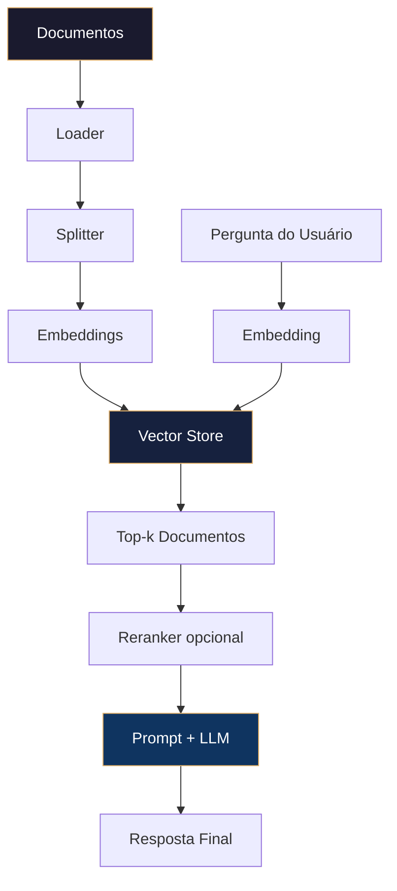

# 📚 RAG Fundamentals – Pipeline de Geração Aumentada por Recuperação

> **Contrato modular**: Artefato filho do Master Agent. Contém APENAS a lógica de domínio específica para os fundamentos de RAG (Retrieval Augmented Generation), incluindo pipeline completo, boas práticas e comparação de frameworks.

---

## 🎯 Propósito
Fornecer o conhecimento canônico e exemplos executáveis do pipeline RAG moderno usando LangChain e LangGraph, capacitando agentes MANTIS a responder com base em documentos externos, reduzindo alucinações e ancorando respostas em fontes verificáveis.

## 📋 Especificação (SDD – Apenas o Específico deste Módulo)
- **Entradas**: Documentos (PDF, web, texto), consulta do usuário, configuração de chunking, embedding e vector store.
- **Saídas**: Resposta gerada com contexto recuperado, opcionalmente com citações.
- **Side Effects**: Persistência da vector store (se configurada).
- **Constraints Aplicáveis**: C1 (tipagem de dados), C3 (proteção de conteúdo sensível), C5 (estrutura de resposta), C7 (fallback se recuperação falhar), C8 (rastreamento de cada etapa), C9 (thread_id para rastreio distribuído).
- **Dependências**: `langchain`, `langchain-core`, `langchain-openai` (ou equivalente), `chromadb`/`faiss`.

---

## 🛡️ Bootstrap Resiliente + Lógica de Domínio (C3+C8)

```python
try:
    from mantis_master import mantis_log
except ImportError:
    import json, datetime, os
    def mantis_log(level, event, detail=""):
        entry = {
            "ts": datetime.datetime.utcnow().isoformat() + "Z",
            "level": level,
            "tenant": os.getenv("TENANT_ID", "global"),
            "event": event,
            "detail": detail,
            "trace_id": os.getenv("TRACE_ID", "null"),
            "span_id": os.getenv("SPAN_ID", "null"),
            "fallback": "true"
        }
        print(json.dumps(entry), flush=True)
    mantis_log("WARN", "bootstrap_fallback", "Master Agent não encontrado. Usando fallback mínimo.")
```

### 1. Pipeline RAG Clássico (Indexação + Recuperação + Geração)

```python
from langchain_community.document_loaders import WebBaseLoader, PyPDFLoader
from langchain_text_splitters import RecursiveCharacterTextSplitter
from langchain_openai import OpenAIEmbeddings, ChatOpenAI
from langchain_chroma import Chroma
from langchain_core.prompts import ChatPromptTemplate
from langchain_core.runnables import RunnablePassthrough
from langchain_core.output_parsers import StrOutputParser

# 1. Carregar documentos
loader = WebBaseLoader("https://docs.langchain.com")
docs = loader.load()
mantis_log("INFO", "docs_loaded", f"{len(docs)} documentos carregados")

# 2. Dividir em chunks
text_splitter = RecursiveCharacterTextSplitter(
    chunk_size=1000,
    chunk_overlap=200,
    separators=["\n\n", "\n", ". ", " ", ""]
)
chunks = text_splitter.split_documents(docs)
mantis_log("INFO", "docs_split", f"{len(chunks)} chunks gerados")

# 3. Criar embeddings e vector store
embeddings = OpenAIEmbeddings(model="text-embedding-3-small")
vectorstore = Chroma.from_documents(
    documents=chunks,
    embedding=embeddings,
    persist_directory="./chroma_rag_db"
)
mantis_log("INFO", "vectorstore_created", "Chroma persistente inicializado")

# 4. Criar retriever
retriever = vectorstore.as_retriever(search_kwargs={"k": 4})

# 5. Definir prompt RAG
prompt = ChatPromptTemplate.from_template("""
Responda a pergunta baseando-se APENAS no contexto abaixo.
Se a resposta não estiver no contexto, diga "Não encontrei essa informação nos documentos fornecidos".

Contexto:
{context}

Pergunta: {question}

Resposta:
""")

# 6. Criar chain LCEL
def format_docs(docs):
    return "\n\n---\n\n".join(doc.page_content for doc in docs)

rag_chain = (
    {"context": retriever | format_docs, "question": RunnablePassthrough()}
    | prompt
    | ChatOpenAI(model="gpt-4.1", temperature=0.2)
    | StrOutputParser()
)

# 7. Executar consulta
question = "O que é LangChain?"
answer = rag_chain.invoke(question)
mantis_log("INFO", "rag_query_completed", f"Pergunta: {question}, Resposta: {answer[:100]}...")
print(f"Resposta: {answer}")
```

### 2. RAG Conversacional com Memória

```python
from langchain.chains import ConversationalRetrievalChain
from langchain.memory import ConversationBufferMemory
from langchain_openai import ChatOpenAI

llm = ChatOpenAI(model="gpt-4.1", temperature=0.3)
memory = ConversationBufferMemory(
    memory_key="chat_history",
    return_messages=True,
    output_key="answer"
)

qa_chain = ConversationalRetrievalChain.from_llm(
    llm=llm,
    retriever=retriever,
    memory=memory,
    return_source_documents=True,
    verbose=False
)

# Primeira pergunta
result1 = qa_chain({"question": "O que é LangChain?"})
print(result1["answer"])
mantis_log("INFO", "conv_rag_turn1", f"Resposta: {result1['answer'][:80]}...")

# Segunda pergunta (usa histórico)
result2 = qa_chain({"question": "Quais são seus principais componentes?"})
print(result2["answer"])
mantis_log("INFO", "conv_rag_turn2", f"Resposta: {result2['answer'][:80]}...")
```

### 3. Comparação de Frameworks RAG

| Framework | Melhor para | Curva de Aprendizado | Flexibilidade |
|-----------|-------------|----------------------|---------------|
| **LangChain** | Agentes, chains, ferramentas | Íngreme | Máxima |
| **LlamaIndex** | Indexação de dados, QA simples | Suave | Média |
| **Sentence Transformers** | Embeddings customizados | Baixa | Alta (embeddings) |
| **Haystack** | Pipelines de busca em produção | Média | Alta |
| **LangChain4j** | Ecossistema Java/Spring | Média | Média |

**Recomendação MANTIS**: LangChain + LangGraph para agentes complexos e swarm; LlamaIndex para prototipagem rápida de QA sobre documentos.

### 4. Padrões de Arquitetura RAG



### 5. Estratégias de Indexação para Diferentes Fontes

```python
# PDF
from langchain_community.document_loaders import PyPDFLoader
pdf_loader = PyPDFLoader("manual.pdf")
docs = pdf_loader.load()

# CSV
from langchain_community.document_loaders import CSVLoader
csv_loader = CSVLoader("dados.csv")
docs = csv_loader.load()

# Diretório inteiro
from langchain_community.document_loaders import DirectoryLoader, TextLoader
dir_loader = DirectoryLoader("./docs", glob="**/*.md", loader_cls=TextLoader)
docs = dir_loader.load()

# GitHub
from langchain_community.document_loaders import GithubFileLoader
git_loader = GithubFileLoader(
    repo="usuario/repo",
    access_token=os.getenv("GITHUB_TOKEN"),
    file_filter=lambda x: x.endswith(".py")
)
docs = git_loader.load()
mantis_log("INFO", "multi_source_loaded", f"Total de documentos carregados: {len(docs)}")
```

### 6. Tratamento de Erros e Fallback no RAG

```python
def safe_rag_query(question: str, retriever, llm, max_retries=3):
    for attempt in range(max_retries):
        try:
            docs = retriever.invoke(question)
            if not docs:
                mantis_log("WARN", "no_docs_retrieved", f"Tentativa {attempt+1}: sem documentos")
                return "Desculpe, não encontrei informações relevantes."
            context = format_docs(docs)
            prompt_text = f"Contexto:\n{context}\n\nPergunta: {question}\nResposta:"
            response = llm.invoke(prompt_text)
            mantis_log("INFO", "rag_success", f"Tentativa {attempt+1}")
            return response.content
        except Exception as e:
            mantis_log("ERROR", "rag_attempt_failed", f"Tentativa {attempt+1}: {str(e)}")
            if attempt == max_retries - 1:
                return "Erro interno ao processar sua pergunta. Tente novamente mais tarde."
```

---

## 🧪 Testes Unitários (TDD)

```python
import pytest
from langchain_core.documents import Document

# Teste: formato_docs deve concatenar corretamente
def test_format_docs():
    docs = [
        Document(page_content="Texto 1"),
        Document(page_content="Texto 2")
    ]
    result = format_docs(docs)
    assert "Texto 1" in result
    assert "---" in result
    assert "Texto 2" in result

# Teste: fallback quando não há documentos
def test_no_docs_fallback():
    result = safe_rag_query("pergunta impossível", retriever_vazio, mock_llm)
    assert "não encontrei" in result.lower()
```

---

## 🔍 Validação (VDD)
```bash
bash 05-CONFIGURATIONS/validation/orchestrator-engine.sh \
  --file 04-WORKFLOWS/langchain-langraph/libs/rag-fundamentals.md \
  --json \
  --check-structural \
  --check-error-handling \
  --check-observability
```

---

## 🔗 Referências Cruzadas (Wikilinks Mínimos)
- [[langchain-langraph-master-agent.md]] ← Fonte de hardening, observability, constraints
- [[/05-CONFIGURATIONS/validation/orchestrator-engine/main.go]] ← Motor de validação
- [[/05-CONFIGURATIONS/validation/norms-matrix.json]] ← Mapeamento constraints por rota
- [[rag-chunking-strategies.md]] ← Próximo passo: chunking avançado
- [[rag-embeddings.md]] ← Embeddings

---

## 📊 Métricas de Qualidade
| Métrica | Meta | Como Medir |
|---------|------|-----------|
| Latência RAG (com cache) | < 2s | logs de `mantis_log` |
| Cobertura de fallback | 100% fluxos | Testes unitários |
| Precisão do contexto | ≥ 80% | Avaliação RAGAS (ver rag-evaluation.md) |

---

## 📋 Checklist de Geração
1. ✅ Frontmatter mínimo válido (C5)
2. ✅ Bootstrap com `mantis_log()` herdado (C8)
3. ✅ Exemplo completo de pipeline RAG
4. ✅ Padrão conversacional com memória
5. ✅ Fallback seguro
6. ✅ Testes unitários
7. ✅ Wikilinks para skills dependentes

---

## 📝 Histórico de Revisões
| Versão | Data | Autor | Mudança Principal | Constraints Afetadas |
|--------|------|-------|------------------|---------------------|
| 1.0.0 | 2026-05-24T23:55:00Z | langchain-langraph-master-agent | Criação inicial: fundamentos RAG | C1,C3,C5,C7,C8,C9 |
