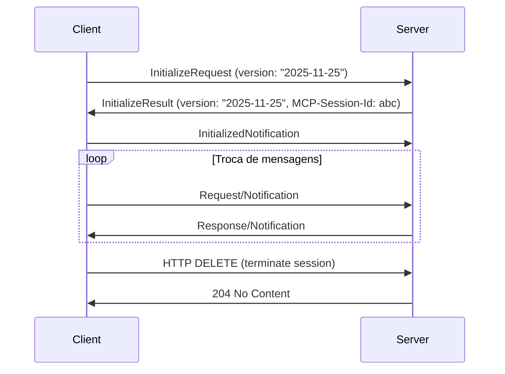

# 🔄 MCP Versioning & Lifecycle – Negociação de Versão e Compatibilidade

> **Contrato modular**: Documenta o processo de versionamento do protocolo MCP, negociação entre cliente e servidor, e ciclo de vida completo desde a inicialização até o encerramento.

---

## 🎯 Propósito
Garantir que servidores e clientes MCP no ecossistema MANTIS lidem corretamente com diferentes versões do protocolo, mantendo compatibilidade e facilitando upgrades.

## 📋 Especificação (SDD)
- **Entradas**: Requisição de inicialização, headers de versão.
- **Saídas**: Conexão estabelecida na versão correta ou erro de incompatibilidade.
- **Side Effects**: Negociação que define o comportamento futuro da conexão.
- **Constraints Aplicáveis**: C1 (contrato de versão), C2 (reprodutibilidade), C5 (validação), C7 (fallback), C8 (logs).
- **Dependências**: `mcp`.

---

## 🛡️ Bootstrap (C3+C8)
```python
try:
    from mantis_master import mantis_log
except ImportError:
    # ...
```

### 1. Fluxo de Inicialização (Lifecycle)
1. Cliente envia `InitializeRequest` com a versão do protocolo que suporta.
2. Servidor responde com `InitializeResult` contendo a versão negociada.
3. Cliente envia `InitializedNotification`.
4. A partir daí, todas as mensagens respeitam a versão acordada.

```python
# Exemplo de negociação
SUPPORTED_VERSIONS = ["2025-11-25", "2025-03-26"]
DEFAULT_VERSION = "2025-03-26"

def negotiate_version(client_version: str) -> str:
    if client_version in SUPPORTED_VERSIONS:
        return client_version
    # Fallback para a versão mais recente suportada por ambos
    compatible = [v for v in SUPPORTED_VERSIONS if v <= client_version]
    return max(compatible) if compatible else DEFAULT_VERSION
```

### 2. Cabeçalho MCP-Protocol-Version
- Em transporte HTTP, o cliente DEVE incluir `MCP-Protocol-Version` em todas as requisições após a inicialização.
- Exemplo: `MCP-Protocol-Version: 2025-11-25`

### 3. Tratamento de Versões Não Suportadas
- Se o servidor não reconhece a versão, deve retornar HTTP 400 com um erro JSON-RPC.
```python
if client_version not in SUPPORTED_VERSIONS:
    return JSONResponse(status_code=400, content={
        "jsonrpc": "2.0",
        "error": {"code": -32602, "message": f"Versão {client_version} não suportada."}
    })
```

### 4. Ciclo de Vida da Conexão


### 5. Versionamento de Ferramentas e Recursos
- Mudanças na assinatura de ferramentas devem ser tratadas com versionamento semântico.
- É possível expor múltiplas versões de uma ferramenta (ex: `get_weather_v1`, `get_weather_v2`).

### 6. Boas Práticas de Upgrade
- Mantenha compatibilidade retroativa sempre que possível.
- Anuncie depreciações com antecedência.
- Use testes de contrato para validar a comunicação entre versões.

---

## 🧪 Testes Unitários (TDD)
```python
def test_version_negotiation():
    assert negotiate_version("2025-11-25") == "2025-11-25"
    assert negotiate_version("2024-11-05") == "2025-03-26"  # fallback
```

---

## 🔍 Validação (VDD)
```bash
bash 05-CONFIGURATIONS/validation/orchestrator-engine.sh \
  --file 04-WORKFLOWS/langchain-langraph/libs/mcp-versioning-lifecycle.md --json
```

---

## 🔗 Referências Cruzadas
- [[mcp-state-management-sessions.md]]
- [[integration-configurations.md]]
