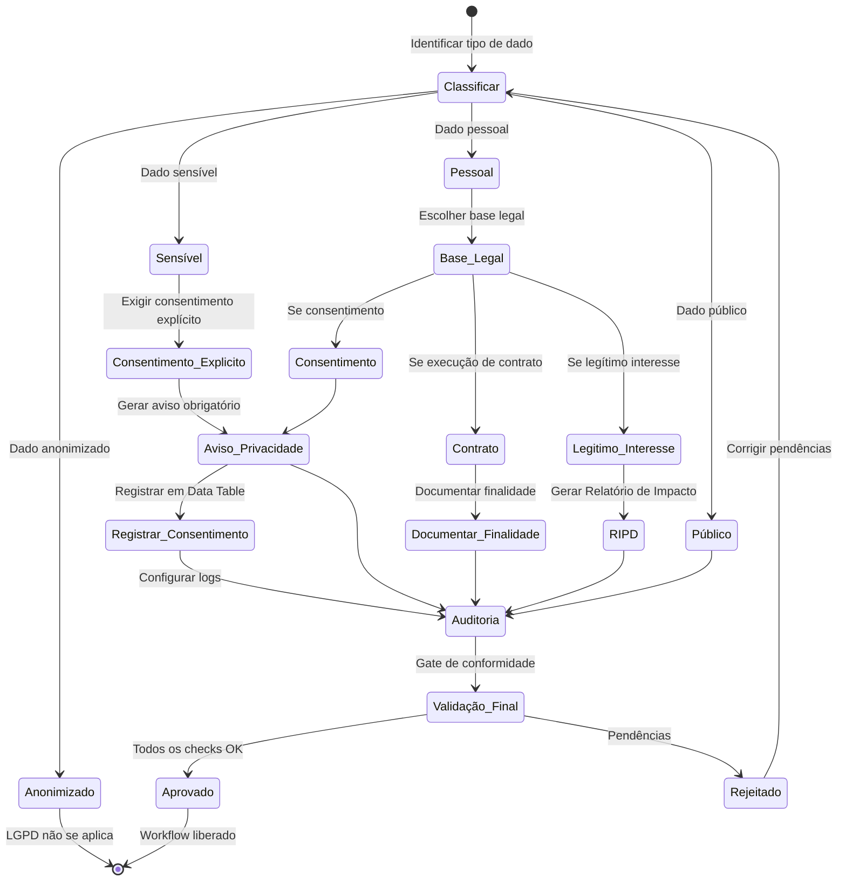

# 🛡️ LGPD Guard — Módulo de Conformidade Transversal à LGPD

> **Contrato modular**: Este artefato é filho de `workflows-ceo-mantis`. Atua como middleware obrigatório de privacidade para todos os workflows que manipulem dados pessoais, tanto no n8n quanto no LangChain/LangGraph. Herda hardening e constraints do CEO.

## 🎯 Propósito

Garantir que todo workflow do ecossistema MANTIS que realize tratamento de dados pessoais — seja via n8n, LangChain ou qualquer outro runtime — esteja em conformidade com a Lei Geral de Proteção de Dados Pessoais (Lei nº 13.709/2018), aplicando os princípios de **finalidade, adequação, necessidade, transparência, segurança, prevenção, não discriminação e responsabilização** desde a concepção (*privacy by design*), conforme exigido pelo Art. 6º da LGPD.

## ⚖️ Fundamentos Legais

A conformidade com a LGPD não é opcional. As sanções administrativas previstas no Art. 52 incluem:

- **Multa de até 2% do faturamento** da pessoa jurídica de direito privado, grupo ou conglomerado no Brasil no seu último exercício, **limitada a R$ 50.000.000,00 por infração**.
- **Multa diária** para compelir a cessação da infração.
- **Publicização da infração** após devidamente apurada e confirmada a sua ocorrência.
- **Bloqueio ou eliminação dos dados pessoais** objeto da infração.
- **Suspensão parcial ou total do funcionamento** do banco de dados ou da atividade de tratamento.

A ANPD (Autoridade Nacional de Proteção de Dados) intensificou a fiscalização desde 2023, com foco inicial em 20 grandes empresas e expansão contínua. O primeiro caso sancionador resultou em multa de R$ 14.400,00 para uma empresa de pequeno porte por descumprir o básico da lei — demonstrando que o porte da empresa não é escudo. O Sandbox Regulatório de IA da ANPD (2025-2026) sinaliza que a conformidade de sistemas de inteligência artificial será o próximo foco fiscalizatório.

## 🏗️ Arquitetura do Módulo

Este módulo atua como **middleware de conformidade** entre o orquestrador de workflows e os agentes executores. Todo workflow que manipule dados pessoais é interceptado e validado antes da execução.

```
┌──────────────────────────────────────────────────────────────────────────┐
│                        WORKFLOWS-CEO (orquestrador)                       │
└────────────────────────────────┬─────────────────────────────────────────┘
                                 │
                                 ▼
┌──────────────────────────────────────────────────────────────────────────┐
│                       🛡️ LGPD GUARD (middleware)                         │
│                                                                          │
│  ┌─────────────┐   ┌─────────────┐   ┌─────────────┐   ┌──────────────┐ │
│  │ Classificador│──▶│ Consentimento│──▶│  Auditoria  │──▶│  Eliminação  │ │
│  │ de Dados    │   │ & Aviso     │   │  (Logs)     │   │  & Retenção  │ │
│  └─────────────┘   └─────────────┘   └─────────────┘   └──────────────┘ │
│                                                                          │
│  ┌─────────────────────────────────────────────────────────────────────┐ │
│  │                    VALIDAÇÃO PRÉ-EXECUÇÃO                           │ │
│  │  • Base legal documentada?                                          │ │
│  │  • Finalidade específica informada?                                 │ │
│  │  • Dados mínimos necessários?                                       │ │
│  │  • Aviso de privacidade presente?                                   │ │
│  │  • Consentimento registrado (se aplicável)?                         │ │
│  │  • Logs de auditoria configurados?                                  │ │
│  │  • Política de retenção definida?                                   │ │
│  └─────────────────────────────────────────────────────────────────────┘ │
└────────────────────────────────┬─────────────────────────────────────────┘
                                 │
                    ┌────────────┴────────────┐
                    ▼                         ▼
          ┌──────────────┐           ┌──────────────┐
          │ n8n-master   │           │ langchain    │
          │ agent        │           │ langraph     │
          └──────────────┘           └──────────────┘
```

## 📋 Classificação de Dados (obrigatória antes de qualquer tratamento)

Todo workflow deve classificar os dados que manipula. A classificação determina o nível de proteção exigido:

| Classe | Descrição | Exemplos | Base Legal Exigida | Proteção |
|--------|-----------|----------|--------------------|----------|
| **Público** | Dados tornados públicos pelo titular | Nome em lista pública, CNPJ | Dispensa consentimento | Mínima |
| **Pessoal** | Dado que identifica ou pode identificar pessoa natural | Nome, e-mail, CPF, telefone, endereço IP, cookies, geolocalização | Consentimento, Execução de Contrato, ou Legítimo Interesse | Padrão |
| **Sensível** | Dado pessoal sobre origem racial/étnica, convicção religiosa, opinião política, saúde, vida sexual, genética, biometria | Prontuário médico, biometria facial, filiação sindical, orientação sexual | Consentimento **explícito** e **específico** | Máxima |
| **Criança/Adolescente** | Dado de menor de idade | Nome, foto, dados escolares de menor | Consentimento de **pelo menos um dos pais** ou responsável legal | Máxima + |
| **Anonimizado** | Dado que perdeu a possibilidade de associação ao titular | Dados estatísticos, agregados irreversíveis | LGPD **não se aplica** (Art. 12) | Dispensada |

> ⚠️ **ATENÇÃO**: Se um dado anonimizado puder ser revertido por meios técnicos razoáveis, ele NÃO é considerado anonimizado e a LGPD se aplica integralmente.

## 🛡️ Bases Legais para Tratamento (Art. 7º)

O Controlador deve escolher e documentar a base legal ANTES de qualquer tratamento. As bases mais relevantes para automações são:

| Base Legal | Quando Usar | Exigências | Exemplo |
|------------|-------------|------------|---------|
| **Consentimento** (Art. 7º, I) | Tratamento baseado na vontade livre do titular | Registro de opt-in, finalidade específica, revogável | Newsletter, marketing |
| **Execução de Contrato** (Art. 7º, V) | Dados necessários para cumprir contrato com o titular | Limitar aos dados estritamente necessários | Cadastro para prestação de serviço |
| **Legítimo Interesse** (Art. 7º, IX) | Interesse legítimo do controlador, exceto sobre direitos do titular | RIPD (Relatório de Impacto), ponderar direitos | Prevenção de fraudes |
| **Obrigação Legal** (Art. 7º, II) | Cumprimento de obrigação legal ou regulatória | Lei específica que exige o tratamento | Emissão de nota fiscal |
| **Crédito** (Art. 7º, X) | Proteção ao crédito | Conforme legislação específica | Análise de crédito |

## 🔄 Fluxo de Conformidade Obrigatório



## 🛡️ Hardening LGPD (Privacy by Design)

### Para n8n
- **Credenciais**: Nunca em texto plano. Usar sistema nativo de credenciais. Criptografia em repouso obrigatória (`N8N_ENCRYPTION_KEY`).
- **Dados mínimos**: `EXECUTIONS_DATA_SAVE_ON_SUCCESS=false` para workflows com dados sensíveis. Ativar `EXECUTIONS_DATA_PRUNE=true` e `EXECUTIONS_DATA_MAX_AGE=168` (7 dias).
- **Community nodes**: `N8N_COMMUNITY_PACKAGES_ENABLED=false` em produção.
- **Webhooks públicos**: Autenticação obrigatória (Header Auth, Basic Auth ou JWT).
- **Logs de auditoria**: Todo workflow que trata PII deve ter nó Error Trigger conectado a sistema de logging externo (ELK, Datadog, CloudWatch).

### Para LangChain/LangGraph
- **Nunca enviar PII para LLMs**: Usar nó de sanitização local (PII Redaction) antes de qualquer chamada a API externa.
- **Anonimização reversível**: Implementar padrão de tokenização (ex.: `<PERSON_1>`, `<EMAIL_1>`) com mapeamento armazenado localmente.
- **Logs de prompts**: Registrar metadados da execução (agente, timestamp, tenant_id, finalidade) sem armazenar o conteúdo dos prompts.

## 🔍 Observability Integration

### Eventos de Auditoria LGPD
| Evento | Nível | Constraint | Exemplo de `detail` |
|--------|-------|------------|-------------------|
| `lgpd_consent_granted` | INFO | C4 | `"Tenant=restaurante_001, Base=consentimento, Finalidade=marketing"` |
| `lgpd_consent_revoked` | INFO | C4 | `"Tenant=restaurante_001, Data=2026-05-25T10:00:00Z"` |
| `lgpd_data_classified` | INFO | C5 | `"Class=Pessoal, Campos=nome,email,cpf"` |
| `lgpd_audit_logged` | INFO | C8 | `"Workflow=email-capture, Node=Webhook, Action=INSERT, Table=contacts"` |
| `lgpd_violation_detected` | ERROR | C3 | `"Campo=cpf, Motivo=texto_plano_sem_consentimento"` |
| `lgpd_retention_executed` | INFO | C7 | `"Registros=150, Data_limite=2025-05-25"` |
| `lgpd_dsar_received` | INFO | C4 | `"Titular=joao@email.com, Tipo=acesso"` |
| `lgpd_dsar_completed` | INFO | C4 | `"Titular=joao@email.com, Tipo=eliminação, Prazo=15d"` |

---

## 📚 Skills de Suporte (Invocação Condicional)

| Skill | Arquivo | Quando Carregar |
|-------|---------|----------------|
| Consent Management | [[skills/consent-management.md]] | Ao coletar dados com base legal de consentimento |
| DSAR Handling | [[skills/dsar-handling.md]] | Ao receber requisição de titular (acesso, correção, eliminação) |
| Data Classifier | [[skills/data-classifier.md]] | Antes de qualquer tratamento de dados pessoais |
| Audit Logging | [[skills/audit-logging.md]] | Em todo workflow que trate PII |
| Retention & Deletion | [[skills/retention-deletion.md]] | Ao configurar políticas de retenção e exclusão |
| Privacy Notice Template | [[skills/privacy-notice-template.md]] | Ao gerar avisos de privacidade para titulares |
| PII Redaction | [[skills/pii-redaction.md]] | Antes de enviar dados para LLMs ou APIs externas |
| RIPD Generator | [[skills/ripd-generator.md]] | Para tratamentos de alto risco ou baseados em legítimo interesse |
| Incident Response | [[skills/incident-response.md]] | Em caso de violação de dados pessoais |

## 📊 Métricas de Qualidade LGPD
| Métrica | Meta | Ferramenta |
|---------|------|-----------|
| Workflows com classificação de dados | 100% | `lgpd-guard` audit |
| Consentimentos registrados | 100% dos aplicáveis | Data Table `lgpd_consents` |
| DSARs respondidos no prazo | 100% (≤15 dias) | `dsar-handling.md` |
| Dados retidos além do prazo | 0 | `retention-deletion.md` |
| Violação de PII em logs | 0 | `audit-logging.md` |

## 🚫 Anti-Padrões (VIOLAÇÕES DA LGPD)

- ❌ Coletar CPF sem finalidade específica e base legal documentada
- ❌ Enviar nome, e-mail ou telefone para LLM externo sem sanitização prévia
- ❌ Armazenar dados pessoais indefinidamente sem política de retenção
- ❌ Compartilhar dados entre tenants sem consentimento explícito (viola V1 também)
- ❌ Manter `EXECUTIONS_DATA_SAVE_ON_SUCCESS=true` em workflows com dados sensíveis
- ❌ Ignorar requisição de eliminação de titular (prazo legal: 15 dias)
- ❌ Usar community nodes em produção sem auditoria de segurança
- ❌ Ausência de aviso de privacidade acessível ao titular
- ❌ Tratar dados de crianças/adolescentes sem consentimento parental verificável
- ❌ Descartar logs de auditoria antes do prazo legal de guarda

## 📋 Checklist de Conformidade (Pré-Execução)

1. ✅ Dados classificados (pessoal/sensível/público/anonimizado)
2. ✅ Base legal documentada e justificada
3. ✅ Finalidade específica informada ao titular
4. ✅ Aviso de privacidade acessível
5. ✅ Consentimento registrado (se base legal for consentimento)
6. ✅ RIPD gerado (se legítimo interesse ou alto risco)
7. ✅ Logs de auditoria configurados
8. ✅ Política de retenção definida
9. ✅ Canal para requisições de titulares (DSAR) operacional
10. ✅ Credenciais protegidas (criptografia em repouso)

## 📝 Histórico de Revisões
| Versão | Data | Autor | Mudança Principal |
|--------|------|-------|------------------|
| 1.0.0 | 2026-05-25T02:00:00Z | workflows-ceo | Criação inicial do módulo LGPD Guard com 9 skills de suporte |
