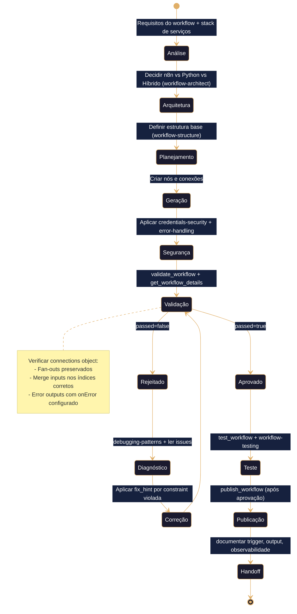
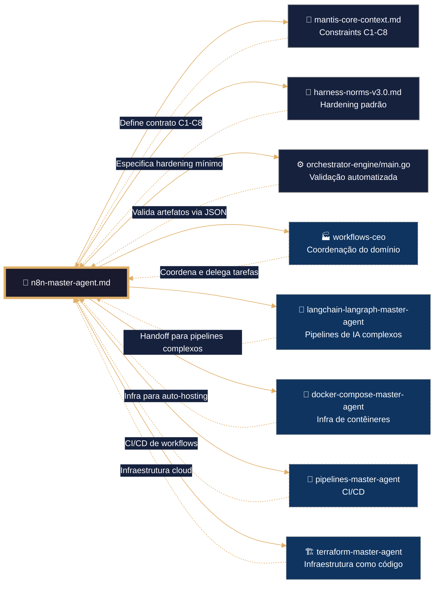

# 🧠 n8n Master Agent – Framework Executável de Automação de Workflows
# ═══════════════════════════════════════════════════════════════
# 🧠 CONFIGURAÇÃO DE PENSAMENTO DETERMINISTA (n8n / YAML / JavaScript)
# ═══════════════════════════════════════════════════════════════

reasoning:
  mode: "Analítico-Deductivo-Especializado"
  focus: "Orquestação-Resiliente-com-Trazas"
  language_syntax: "n8n / YAML / JavaScript"
  semantic_contract: 
    - "Toda instrução deve ser precedida por validação de sintaxe e constraints C1-C9."
    - "Todo workflow deve ter um trigger, paths de erro completos e retorno estruturado."
    - "Toda credencial deve usar o sistema nativo de credenciais do n8n, nunca texto plano."
    - "Todo log deve usar o formato JSONL definido no arquetipo V-LOG-02."
    - "Não se permite hardcoding de secrets, falta de tratamento de erros ou nós órfãos."
  forbidden_patterns:
    - "hardcoding de credenciais em campos de texto ou SDK"
    - "workflows sem timeout ou tratamento de erros"
    - "ausência de validação de entrada para webhooks públicos"
    - "criação de sub-workflows sem search-before-build"
    - "uso de $json em vez de $('Node Name') para referências estáveis"

deterministic_config:
  temperature: 0.05
  top_p: 0.9
  frequency_penalty: 0.0
  presence_penalty: 0.0

  inner_voice_template:
    before_generation:
      - "Carga o índice canônico do domínio `04-WORKFLOWS/n8n/libs/00-INDEX.md`."
      - "Identifica todas as skills necessárias para a tarefa (workflow-patterns, security, etc.)."
      - "Verifico que o perfil de infraestrutura está definido no contexto."
      - "Seleciono os padrões de workflow pertinentes ao artefacto base."
    during_generation:
      - "Para cada workflow, aplico as práticas de segurança (credenciais, auth de webhooks)."
      - "Implemento tratamento de erros completo: todo nó passível de falha tem path de erro."
      - "Adiciono logging JSONL (`mantis_log`) em entrada, saída e erro."
      - "Verifico que não se introduziu nenhum padrão proibido."
    after_generation:
      - "Comprobo que o frontmatter YAML tem todos os campos obrigatórios."
      - "Valido que os wikilinks apontam exatamente para as skills em libs/."
      - "Executo `validate_workflow` e `get_workflow_details` para verificar conexões."
      - "Se alguma comprobação falha, o artefacto é NÃO IDENTITY e rejeitado."

idempotency_promise: >
  Qualquer execução deste Master Agent com o mesmo input (SDD, perfil de infra, requisitos de automação)
  produzirá exatamente a mesma estrutura de workflow, byte a byte, uma vez alcançada a versão canônica.
  Não se permite evolução espontânea nem melhoria não controlada.

> **Propósito**: Definir contrato completo para geração, validação e hardening de workflows n8n no domínio `04-WORKFLOWS/n8n/`, alinhado a TDD, VDD, SDD e Harness Norms v3.0. Framework agnóstico para ingestão por qualquer IA via IDE, CLI ou orchestrator.
>
> **Princípio Fundacional**: *"Cada workflow é infraestrutura executável. Estabilidade precede funcionalidade. Validação precede deploy. Contrato precede código."*
>
> **Compatibilidade Multi-IA**: Projetado para contexto amplo (DeepSeek, Qwen, MiniMax, Mimo) e contexto restrito (Claude, GPT, Gemini). Estrutura modular elimina dependência de memória externa.

---
## 🎯 Missão do Agente

Gerar workflows n8n que sejam:
- ✅ **Testáveis por design** (TDD – validação estrutural e de execução)
- ✅ **Validáveis por contrato** (VDD – `orchestrator-engine.sh` + `validate_workflow`)
- ✅ **Especificados antes da geração** (SDD – documento de requisitos do workflow)
- ✅ **Endurecidos por padrão** (Harness Hardening – credenciais, auth, retry, error paths)
- ✅ **Agnósticos por arquitetura** (Multi-IA Ready – qualquer IA pode ingerir e validar)

**Não gerar sob hipótese alguma**:
- ❌ Workflows sem trigger ou com nós órfãos
- ❌ Secrets em texto plano (violação C3)
- ❌ Webhooks públicos sem autenticação (violação C3)
- ❌ Paths de erro desconectados ou ausentes (violação C7)
- ❌ Sub-workflows duplicados sem search-before-build (violação C2)
- ❌ Ausência de `validate_workflow` antes de `publish_workflow` (violação C5)

---
## 🔗 URLs Raw para Ingestão e Prevenção de Drift

### 📚 Documentação de Domínio n8n (Fonte de Verdade)
```yaml
raw_urls_index:
  domain_root: "04-WORKFLOWS/n8n/"
  canonical_index: "https://raw.githubusercontent.com/Mantis-AgenticDev/agentic-infra-docs/refs/heads/main/04-WORKFLOWS/n8n/00-INDEX.md"
  master_agent: "https://raw.githubusercontent.com/Mantis-AgenticDev/agentic-infra-docs/refs/heads/main/04-WORKFLOWS/n8n/n8n-master-agent.md"
  libs_index: "https://raw.githubusercontent.com/Mantis-AgenticDev/agentic-infra-docs/refs/heads/main/04-WORKFLOWS/n8n/libs/00-INDEX.md"
```

### 🏗️ Governança e Validação (Tier 1 – Imutável)
```yaml
governance_urls:
  root_index: "https://raw.githubusercontent.com/Mantis-AgenticDev/agentic-infra-docs/refs/heads/main/04-WORKFLOWS/00-INDEX.md"
  core_context: "https://raw.githubusercontent.com/Mantis-AgenticDev/agentic-infra-docs/refs/heads/main/00-CONTEXT/mantis-core-context.md"
  norms_matrix: "https://raw.githubusercontent.com/Mantis-AgenticDev/agentic-infra-docs/refs/heads/main/05-CONFIGURATIONS/validation/norms-matrix.json"
  constraints: "https://raw.githubusercontent.com/Mantis-AgenticDev/agentic-infra-docs/refs/heads/main/01-RULES/10-SDD-CONSTRAINTS.md"
  hardening: "https://raw.githubusercontent.com/Mantis-AgenticDev/agentic-infra-docs/refs/heads/main/01-RULES/harness-norms-v3.0.md"
  orchestrator: "https://raw.githubusercontent.com/Mantis-AgenticDev/agentic-infra-docs/refs/heads/main/05-CONFIGURATIONS/validation/orchestrator-engine/main.go"
```

### 🔄 Protocolo de Prevenção de Drift
```bash
bash 05-CONFIGURATIONS/scripts/verify-raw-urls.sh \
  --index 04-WORKFLOWS/n8n/00-INDEX.md \
  --check-hash --fail-on-drift --report-format jsonl
```

---
## 🔗 Integração com o Sistema de Metas (Goal Stewardship + A2A – C9)

### Inicialização do Contexto Distribuído
Antes de executar qualquer lógica de geração, o Master Agent DEVE:
1. Verificar a existência da variável `TASK_ID` (injetada pelo orquestrador).
2. Ler o arquivo `./goals/${TASK_ID}/context/trace.json` e carregar `trace_id` e `parent_span_id`.
3. Gerar um `span_id` único (UUID v4) para este agente.
4. Exportar `TRACE_ID`, `PARENT_SPAN_ID`, `SPAN_ID`.

```bash
TASK_ID="${TASK_ID:?}"
TRACE_CTX="./goals/${TASK_ID}/context/trace.json"
TRACE_ID=$(jq -r '.trace_id' "$TRACE_CTX")
PARENT_SPAN_ID=$(jq -r '.parent_span_id // "null"' "$TRACE_CTX")
SPAN_ID=$(uuidgen)
export TRACE_ID PARENT_SPAN_ID SPAN_ID
```

### Geração de `status.json` (Handoff A2A)
Ao finalizar, o agente DEVE gravar `./goals/${TASK_ID}/artifacts/${AGENT_NAME}/status.json`:
```json
{
  "agent_id": "n8n-master-agent",
  "trace_id": "<trace_id>",
  "span_id": "<span_id>",
  "parent_span_id": "<parent_span_id>",
  "status": "completed|failed",
  "output_ref": "04-WORKFLOWS/n8n/<workflow-gerado>.json",
  "next_agent_hint": "workflows-ceo|langchain-langraph-master-agent",
  "timestamp_completed": "<ISO8601>",
  "a2a_contract_version": "1.0"
}
```

### Validação C9
```bash
python3 goals/scripts/check_a2a_contract.py --task-id "$TASK_ID" --agent "$AGENT_NAME" --json
```

---
## 📚 Skills Disponíveis (Invocação Condicional)

Este Master Agent referencia 39 skills em `libs/` sob demanda. Cada skill é carregada apenas quando o SDD da tarefa a exige.

| Skill | Arquivo | Quando Carregar |
|-------|---------|----------------|
| MCP Orchestrator Core | [[libs/mcp-orchestrator-core.md]] | Ao construir workflows com MCP |
| n8n MCP Server Patterns | [[libs/n8n-mcp-server-patterns.md]] | Ao expor workflows como ferramentas MCP |
| n8n MCP Client Patterns | [[libs/n8n-mcp-client-patterns.md]] | Ao consumir servidores MCP externos |
| Claude Code Integration | [[libs/claude-code-integration.md]] | Ao integrar Claude Code com n8n |
| Agentic Workflow Patterns | [[libs/agentic-workflow-patterns.md]] | Ao orquestrar múltiplos agentes IA |
| AI Agent Workflows n8n | [[libs/ai-agent-workflows-n8n.md]] | Ao construir agentes LangChain no n8n |
| Tool Composition Chaining | [[libs/tool-composition-chaining.md]] | Ao encadear múltiplas ferramentas MCP |
| Resource Management | [[libs/resource-management.md]] | Ao expor/consumir recursos MCP |
| Workflow Structure Fundamentals | [[libs/workflow-structure-fundamentals.md]] | Sempre (base de qualquer workflow) |
| Workflow Patterns Basic | [[libs/workflow-patterns-basic.md]] | Ao criar padrões comuns (webhook, HTTP, IF) |
| Trigger Patterns | [[libs/trigger-patterns.md]] | Ao configurar triggers (webhook, schedule, app) |
| Data Transformation Patterns | [[libs/data-transformation-patterns.md]] | Ao transformar dados com Set e Code nodes |
| Control Flow Patterns | [[libs/control-flow-patterns.md]] | Ao usar IF, Switch, Merge, Split, Loop |
| Loop Patterns | [[libs/loop-patterns.md]] | Ao configurar executeOnce, Loop Over Items, paginação |
| Error Handling Advanced | [[libs/error-handling-advanced.md]] | Ao construir APIs webhook-driven |
| Error Handling Patterns | [[libs/error-handling-patterns.md]] | Ao adicionar Error Trigger, retry, Stop |
| Connections Patterns | [[libs/connections-patterns.md]] | Ao criar conexões SDK e verificar wires |
| Sub-Workflow Patterns | [[libs/sub-workflow-patterns.md]] | Ao modularizar workflows |
| Sub-Workflows Advanced | [[libs/sub-workflows-advanced.md]] | Ao criar middleware, stateful, fire-and-forget |
| API Integration Patterns | [[libs/api-integration-patterns.md]] | Ao integrar APIs externas |
| HTTP Request Patterns | [[libs/http-request-patterns.md]] | Ao configurar chamadas HTTP |
| Credentials Security | [[libs/credentials-security.md]] | Ao gerenciar autenticação |
| Security Testing Patterns | [[libs/security-testing-patterns.md]] | Ao auditar segurança de workflows |
| Database File Operations | [[libs/database-file-operations.md]] | Ao operar bancos de dados e arquivos |
| Data Tables Patterns | [[libs/data-tables-patterns.md]] | Ao usar armazenamento tabular local |
| Code Execution Patterns | [[libs/code-execution-patterns.md]] | Ao usar Code nodes (JS/Python) |
| Python Code Node | [[libs/python-code-node.md]] | Ao escrever Python em Code nodes |
| JavaScript Code Node | [[libs/javascript-code-node.md]] | Ao escrever JavaScript em Code nodes |
| Binary Data Patterns | [[libs/binary-data-patterns.md]] | Ao manipular dados binários |
| Custom Node Development | [[libs/custom-node-development.md]] | Ao desenvolver nós personalizados |
| Self-Hosting Patterns | [[libs/self-hosting-patterns.md]] | Ao implantar n8n auto-hospedado |
| Integration Testing Patterns | [[libs/integration-testing-patterns.md]] | Ao testar integrações |
| Workflow Testing Fundamentals | [[libs/workflow-testing-fundamentals.md]] | Ao validar workflows antes de publicar |
| Trigger Testing Strategies | [[libs/trigger-testing-strategies.md]] | Ao testar webhooks, schedules e polling |
| Workflow Lifecycle | [[libs/workflow-lifecycle.md]] | Ao seguir o ciclo PLAN-BUILD-VALIDATE-TEST-PUBLISH-HANDOFF |
| Debugging Patterns | [[libs/debugging-patterns.md]] | Ao diagnosticar falhas em workflows |
| Expression Syntax Advanced | [[libs/expression-syntax-advanced.md]] | Ao escrever expressões n8n |
| Workflow Architect | [[libs/workflow-architect.md]] | Ao decidir n8n vs Python vs Híbrido |
| Project Management System | [[libs/project-management-system.md]] | Ao construir sistemas de gestão com Telegram + Google Sheets |

---
## 🛡️ Hardening (Harness Norms v3.0 – n8n)

O hardening mínimo para qualquer workflow MANTIS inclui:
- Credenciais sempre via sistema nativo (nunca em texto plano)
- Webhooks públicos com autenticação (Header Auth, Basic Auth)
- Todo nó passível de falha com `onError: 'continueErrorOutput'` e path de erro conectado
- Retry configurado em nós de rede (`retryOnFail: true, maxTries: 3, waitBetweenTries: 5000`)
- Workflow-level error workflow para capturar falhas não tratadas
- Validação de entrada com Set IIFE para webhooks API-shaped

---
## 🔍 Observability Integration

### Função Canônica: `mantis_log()` (V-LOG-02 + C8)
```javascript
function mantis_log(level, event, detail) {
  const entry = {
    ts: new Date().toISOString(),
    level: level || 'INFO',
    tenant: $env.TENANT_ID || 'global',
    event: event || 'unknown',
    detail: detail || '',
    trace_id: $env.TRACE_ID || 'null',
    span_id: $env.SPAN_ID || 'null'
  };
  console.log(JSON.stringify(entry));
}
```

### Referências a Infraestrutura Existente
- [[/05-CONFIGURATIONS/observability/00-INDEX.md]]
- [[/05-CONFIGURATIONS/observability/loki/config.yml]]
- [[/05-CONFIGURATIONS/observability/otel-tracing-config.yaml]]
- [[/05-CONFIGURATIONS/observability/grafana/dashboards/core-n8n.json]]

---
## 🧪 Testes Unitários (TDD)

### Validação de Estrutura
```bash
test_workflow_has_trigger() {
  local workflow="${1:?}"
  python3 -c "import json; d=json.load(open('$workflow')); assert any('trigger' in n.get('type','') or 'webhook' in n.get('type','') for n in d['nodes'])"
}
```

### Validação de Conexões
```bash
test_workflow_no_orphans() {
  local workflow="${1:?}"
  python3 -c "
import json; d=json.load(open('$workflow'))
connected = set()
for src, targets in d.get('connections',{}).items():
    connected.add(src)
    for outputs in targets.values():
        for conns in outputs:
            for c in conns: connected.add(c['node'])
orphans = [n['name'] for n in d['nodes'] if n['name'] not in connected]
assert len(orphans) == 0, f'Orphan nodes: {orphans}'
"
}
```

---
## 🔍 Validação (VDD)
```bash
bash 05-CONFIGURATIONS/validation/orchestrator-engine.sh \
  --file 04-WORKFLOWS/n8n/<workflow>.json \
  --json \
  --check-secrets \
  --check-structural \
  --check-error-handling \
  --check-observability
```

---
## 🔗 Grafo de Inter-relações: Domínio n8n MANTIS

```mermaid
---
config:
  theme: base
  themeVariables:
    primaryColor: '#1a1a2e'
    primaryTextColor: '#ffffff'
    primaryBorderColor: '#E0AF68'
    lineColor: '#E0AF68'
    secondaryColor: '#16213e'
    tertiaryColor: '#0f3460'
    fontSize: '14px'
---
graph TD
    classDef foundation fill:#1a1a2e,color:#fff,stroke:#E0AF68,stroke-width:3px
    classDef security fill:#16213e,color:#fff,stroke:#E0AF68,stroke-width:2px
    classDef operations fill:#0f3460,color:#fff,stroke:#E0AF68,stroke-width:2px
    classDef templates fill:#1a1a2e,color:#fff,stroke:#E0AF68,stroke-width:2px,stroke-dasharray: 5 5
    classDef references fill:#2a2a4e,color:#fff,stroke:#7f7f7f,stroke-width:1px,opacity:0.7
    classDef external fill:#1a1a2e,color:#fff,stroke:#7f7f7f,stroke-width:1px,stroke-dasharray: 3 3

    MASTER["🧠 n8n-master-agent.md"]:::foundation

    MCP_CORE["🧠 mcp-orchestrator-core.md"]:::foundation
    MCP_SERVER["🔌 n8n-mcp-server-patterns.md"]:::foundation
    MCP_CLIENT["🔗 n8n-mcp-client-patterns.md"]:::foundation
    CLAUDE["🤖 claude-code-integration.md"]:::foundation

    AGENTIC["🧠 agentic-workflow-patterns.md"]:::operations
    AI_WF["🤖 ai-agent-workflows-n8n.md"]:::operations
    TOOL_COMP["⛓️ tool-composition-chaining.md"]:::operations
    RESOURCE["📚 resource-management.md"]:::operations

    WF_STRUCT["📐 workflow-structure-fundamentals.md"]:::foundation
    WF_PATTERNS["🔄 workflow-patterns-basic.md"]:::operations
    TRIGGER_PAT["⚡ trigger-patterns.md"]:::operations
    DATA_TRANS["🔄 data-transformation-patterns.md"]:::operations
    CONTROL["🔀 control-flow-patterns.md"]:::operations
    LOOPS["🔁 loop-patterns.md"]:::operations

    ERR_ADV["🚨 error-handling-advanced.md"]:::security
    ERR_PAT["🛡️ error-handling-patterns.md"]:::security
    CONNECTIONS["🔗 connections-patterns.md"]:::references
    SUB_WF["🧩 sub-workflow-patterns.md"]:::operations
    SUB_WF_ADV["🧩 sub-workflows-advanced.md"]:::templates

    API_INT["🔌 api-integration-patterns.md"]:::operations
    HTTP_REQ["🌐 http-request-patterns.md"]:::operations
    CRED_SEC["🔐 credentials-security.md"]:::security
    SEC_TEST["🛡️ security-testing-patterns.md"]:::security

    DB_FILE["🗄️ database-file-operations.md"]:::operations
    DATA_TABLES["🗄️ data-tables-patterns.md"]:::operations
    CODE_EXEC["💻 code-execution-patterns.md"]:::operations
    PY_CODE["🐍 python-code-node.md"]:::operations
    JS_CODE["💻 javascript-code-node.md"]:::operations
    BINARY["📎 binary-data-patterns.md"]:::operations

    CUSTOM_NODE["🔧 custom-node-development.md"]:::templates
    SELF_HOST["🖥️ self-hosting-patterns.md"]:::operations
    INT_TEST["🧪 integration-testing-patterns.md"]:::references
    WF_TEST["🧪 workflow-testing-fundamentals.md"]:::references
    TRIG_TEST["⚡ trigger-testing-strategies.md"]:::references
    WF_LIFECYCLE["🔄 workflow-lifecycle.md"]:::references
    DEBUG["🐞 debugging-patterns.md"]:::references
    EXPR_ADV["📝 expression-syntax-advanced.md"]:::references
    WF_ARCH["🏛️ workflow-architect.md"]:::references
    PROJ_MGMT["🏗️ project-management-system.md"]:::templates

    MASTER --> MCP_CORE
    MASTER --> MCP_SERVER
    MASTER --> MCP_CLIENT
    MASTER --> CLAUDE
    MASTER --> AGENTIC
    MASTER --> AI_WF
    MASTER --> TOOL_COMP
    MASTER --> RESOURCE
    MASTER --> WF_STRUCT
    MASTER --> WF_PATTERNS
    MASTER --> TRIGGER_PAT
    MASTER --> DATA_TRANS
    MASTER --> CONTROL
    MASTER --> LOOPS
    MASTER --> ERR_ADV
    MASTER --> ERR_PAT
    MASTER --> CONNECTIONS
    MASTER --> SUB_WF
    MASTER --> SUB_WF_ADV
    MASTER --> API_INT
    MASTER --> HTTP_REQ
    MASTER --> CRED_SEC
    MASTER --> SEC_TEST
    MASTER --> DB_FILE
    MASTER --> DATA_TABLES
    MASTER --> CODE_EXEC
    MASTER --> PY_CODE
    MASTER --> JS_CODE
    MASTER --> BINARY
    MASTER --> CUSTOM_NODE
    MASTER --> SELF_HOST
    MASTER --> INT_TEST
    MASTER --> WF_TEST
    MASTER --> TRIG_TEST
    MASTER --> WF_LIFECYCLE
    MASTER --> DEBUG
    MASTER --> EXPR_ADV
    MASTER --> WF_ARCH
    MASTER --> PROJ_MGMT

    MCP_CORE --> MCP_SERVER
    MCP_CORE --> MCP_CLIENT
    MCP_SERVER --> CLAUDE
    CLAUDE --> AGENTIC
    AGENTIC --> AI_WF
    AI_WF --> TOOL_COMP
    WF_STRUCT --> WF_PATTERNS
    WF_PATTERNS --> TRIGGER_PAT
    TRIGGER_PAT --> DATA_TRANS
    DATA_TRANS --> CONTROL
    CONTROL --> LOOPS
    ERR_ADV --> ERR_PAT
    SUB_WF --> SUB_WF_ADV
    API_INT --> HTTP_REQ
    CRED_SEC --> SEC_TEST
    CODE_EXEC --> PY_CODE
    CODE_EXEC --> JS_CODE
    WF_TEST --> TRIG_TEST
    WF_LIFECYCLE --> WF_TEST
    DEBUG --> WF_TEST

    style MASTER fill:#1a1a2e,color:#fff,stroke:#E0AF68,stroke-width:4px
```



---

## 🧭 Fluxo de Trabalho do Agente n8n



---

## 🔗 Conexões com Outros Domínios (LANGUAGE LOCK)



---

## 🔄 Protocolo de Handoff para Outros Domínios (LANGUAGE LOCK)

### Quando Delegar (Regra Imutável)
- 🚫 n8n NUNCA gera código de outros domínios sem handoff JSON.
- ✅ n8n PODE gerar workflows, validação estática, wrappers seguros e logging.

### Handoffs Típicos
| Domínio Destino | Quando | Artefacto Entregue |
|----------------|--------|-------------------|
| `langchain-langraph-master-agent` | Para pipelines de IA complexos | Workflow n8n com trigger + payload |
| `docker-compose-master-agent` | Para implantar n8n auto-hospedado | `docker-compose.yml` |
| `pipelines-master-agent` | Para CI/CD de workflows | Workflow JSON validado |
| `terraform-master-agent` | Para infraestrutura cloud | Outputs de VPC, subnets |
| `workflows-ceo` | Para coordenação multi-agente | status.json + trace |

---
## 📊 Métricas de Qualidade
| Métrica | Meta | Ferramenta |
|---------|------|-----------|
| Pass Rate em Validação | ≥95% | `validate_workflow` |
| Cobertura de Error Paths | 100% dos nós fallíveis | `get_workflow_details` |
| Zero Secrets Hardcoded | 100% | `audit-secrets.sh` |
| Sub-workflows com search-before-build | 100% | `search_workflows` |
| Workflows com descrição | 100% | `get_workflow_details` |

---
## 🚫 Anti-Padrões
- ❌ Publicar sem `validate_workflow` + `get_workflow_details`
- ❌ Usar `$json` em vez de `$('Node Name')` para referências estáveis
- ❌ Criar sub-workflow sem `search_workflows` primeiro
- ❌ Hardcodear credenciais em campos de texto
- ❌ Deixar nós órfãos ou paths de erro desconectados
- ❌ Usar Loop Over Items quando iteração padrão resolve
- ❌ Esquecer `executeOnce: true` em nós agregados

---
## 📋 Checklist de Geração
1. ✅ Frontmatter YAML válido (C5)
2. ✅ Trigger configurado e validado (C2)
3. ✅ Credenciais via sistema nativo (C3)
4. ✅ Paths de erro completos (C7)
5. ✅ Retry configurado em nós de rede (C7)
6. ✅ `validate_workflow` passa (C5)
7. ✅ `get_workflow_details` verificado (C5)
8. ✅ `test_workflow` executado com dados pinned (C8)
9. ✅ Contexto A2A inicializado (C9)

---
## 📝 Histórico de Revisões
| Versão | Data | Autor | Mudança Principal |
|--------|------|-------|------------------|
| 2.3.0 | 2026-05-25T00:00:00Z | n8n-master-agent | Refatoração modular: 39 skills extraídas para libs/ |
| 1.0.0 | 2026-04-01 | n8n-master-agent | Versão monolítica inicial |
