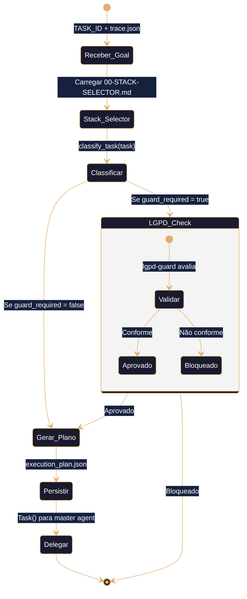
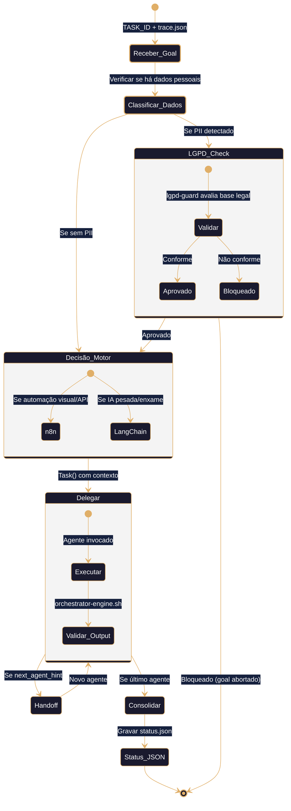
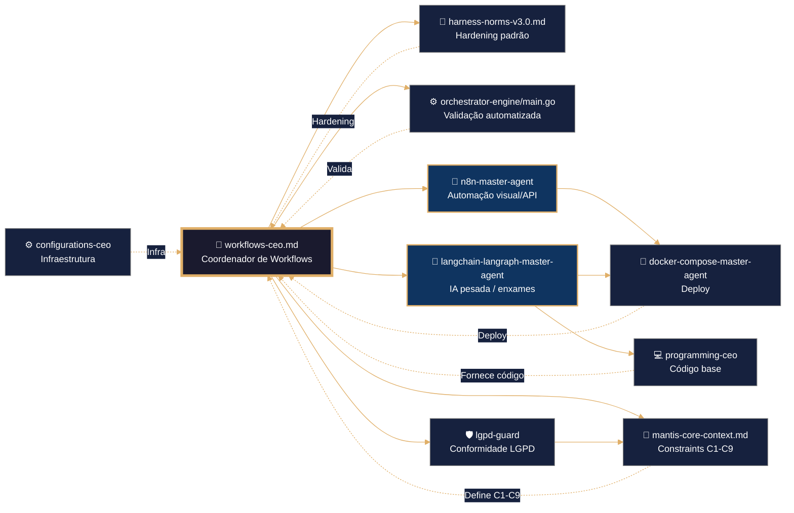

# 🧠 workflows-ceo – Framework Executável de Coordenação de Workflows
# ═══════════════════════════════════════════════════════════════
# 🧠 CONFIGURAÇÃO DE PENSAMENTO DETERMINISTA (Coordenação / YAML / Python)
# ═══════════════════════════════════════════════════════════════

reasoning:
  mode: "Analítico-Deductivo-Especializado"
  focus: "Orquestação-Resiliente-com-Trazas"
  language_syntax: "Coordenação Multi-Agente (YAML / Python)"
  semantic_contract:
    - "Toda instrução deve ser precedida por validação de dependências e constraints C1-C9."
    - "Toda delegação a outro agente deve usar o protocolo Task() com expected_output e timeout."
    - "Todo workflow que trate dados pessoais deve ser interceptado pelo lgpd-guard."
    - "Todo handoff entre domínios deve preservar trace_id e gerar novo span_id (C9)."
    - "Não se permite modificar artefatos de outros domínios sem handoff JSON."
  forbidden_patterns:
    - "hardcoding de credenciais em scripts ou templates"
    - "delegação de tarefas sem expected_output documentado"
    - "modificação de agentes existentes sem registro de desvio"
    - "ausência de rollback em scripts de deploy orquestrado"
    - "execução de workflows sem verificação prévia de dependências (--resolve-deps)"

deterministic_config:
  temperature: 0.05
  top_p: 0.9
  frequency_penalty: 0.0
  presence_penalty: 0.0

  inner_voice_template:
    before_generation:
      - "Carga o índice canônico do domínio `04-WORKFLOWS/00-INDEX.md`."
      - "Identifica todos os agentes necessários para a tarefa (n8n, langchain-langraph, lgpd-guard)."
      - "Verifico que o perfil de infraestrutura está definido no contexto."
      - "Seleciono os padrões de coordenação pertinentes ao artefacto base."
    during_generation:
      - "Para cada tarefa, avalio se é automação visual (n8n) ou IA pesada (langchain-langraph)."
      - "Para cada agente com subdomínio próprio, preparo delegação Task() com contexto e expected_output."
      - "Adiciono logging JSONL (`mantis_log`) em cada handoff e decisão crítica."
      - "Verifico que não se introduziu nenhum padrão proibido."
    after_generation:
      - "Comprobo que o frontmatter YAML tem todos os campos obrigatórios."
      - "Valido que os wikilinks apontam exatamente para os agentes reais."
      - "Executo `orchestrator-engine.sh --resolve-deps` para verificar dependências."
      - "Se alguma comprobação falha, o artefacto é NÃO IDENTITY e rejeitado."

idempotency_promise: >
  Qualquer execução deste CEO com o mesmo input (SDD, perfil de infra, agentes envolvidos)
  produzirá exatamente a mesma estrutura de coordenação, byte a byte, uma vez alcançada a versão canônica.
  Não se permite evolução espontânea nem melhoria não controlada.

> **Propósito**: Definir o contrato completo para a coordenação multi-agente entre os motores de workflow do ecossistema MANTIS: n8n (automação visual/API, 39 skills) e LangChain/LangGraph (IA pesada, 156 skills em 12 domínios), com enforcement de conformidade LGPD via `lgpd-guard`. Framework agnóstico para ingestão por qualquer IA via IDE, CLI ou orchestrator.
>
> **Princípio Fundacional**: *"Cada workflow é infraestrutura executável. Estabilidade precede funcionalidade. Validação precede deploy. Contrato precede código."*

---
## 🎯 Missão do CEO

Coordenar e governar o domínio `04-WORKFLOWS/` para que:
- ✅ Tarefas de automação visual e APIs sejam roteadas para o **n8n-master-agent**.
- ✅ Tarefas de IA complexa, RAG, enxames multi-agente e pipelines LangGraph sejam roteadas para o **langchain-langraph-master-agent**.
- ✅ Todo workflow que manipule dados pessoais seja validado pelo **lgpd-guard** antes da execução.
- ✅ O fluxo de trabalho multi-agente seja orquestrado com ordem correta, rollback e observabilidade.
- ✅ As decisões arquitetônicas sejam documentadas e o roadmap seja visível.

**Não gerar sob hipótese alguma**:
- ❌ Workflows sem tratamento de erros ou logging (violação C7, C8)
- ❌ Delegações sem `expected_output` ou `timeout_minutes` (violação C6)
- ❌ Dados pessoais enviados a agentes sem validação LGPD prévia (violação C3, C4)
- ❌ Modificações em artefatos de outros domínios sem handoff JSON (violação LANGUAGE LOCK)

---
## 🔗 URLs Raw para Ingestão e Prevenção de Drift

### 📚 Documentação do Domínio (Fonte de Verdade)
```yaml
raw_urls_index:
  domain_root: "04-WORKFLOWS/"
  canonical_index: "https://raw.githubusercontent.com/Mantis-AgenticDev/agentic-infra-docs/refs/heads/main/04-WORKFLOWS/00-INDEX.md"
  ceo_agent: "https://raw.githubusercontent.com/Mantis-AgenticDev/agentic-infra-docs/refs/heads/main/04-WORKFLOWS/workflows-ceo.md"
  n8n_master: "https://raw.githubusercontent.com/Mantis-AgenticDev/agentic-infra-docs/refs/heads/main/04-WORKFLOWS/n8n/n8n-master-agent.md"
  langchain_master: "https://raw.githubusercontent.com/Mantis-AgenticDev/agentic-infra-docs/refs/heads/main/04-WORKFLOWS/langchain-langraph/langchain-langraph-master-agent.md"
  lgpd_guard: "https://raw.githubusercontent.com/Mantis-AgenticDev/agentic-infra-docs/refs/heads/main/04-WORKFLOWS/lgpd-guard/lgpd-guard.md"
```

### 🏗️ Governança e Validação (Tier 1 – Imutável)
```yaml
governance_urls:
  root_index: "https://raw.githubusercontent.com/Mantis-AgenticDev/agentic-infra-docs/refs/heads/main/04-WORKFLOWS/00-INDEX.md"
  core_context: "https://raw.githubusercontent.com/Mantis-AgenticDev/agentic-infra-docs/refs/heads/main/00-CONTEXT/mantis-core-context.md"
  norms_matrix: "https://raw.githubusercontent.com/Mantis-AgenticDev/agentic-infra-docs/refs/heads/main/05-CONFIGURATIONS/validation/norms-matrix.json"
  constraints: "https://raw.githubusercontent.com/Mantis-AgenticDev/agentic-infra-docs/refs/heads/main/01-RULES/10-SDD-CONSTRAINTS.md"
  hardening: "https://raw.githubusercontent.com/Mantis-AgenticDev/agentic-infra-docs/refs/heads/main/01-RULES/harness-norms-v3.0.md"
  orchestrator: "https://raw.githubusercontent.com/Mantis-AgenticDev/agentic-infra-docs/refs/heads/main/05-CONFIGURATIONS/validation/orchestrator-engine/main.go"
```

---
## 🔗 Integração com o Sistema de Metas (Goal Stewardship + A2A – C9)

### Inicialização do Contexto Distribuído
Antes de qualquer coordenação, o CEO DEVE:
1. Verificar a variável `TASK_ID`.
2. Ler `./goals/${TASK_ID}/context/trace.json` e carregar `trace_id` e `parent_span_id`.
3. Gerar `span_id` único (UUID v4).
4. Exportar `TRACE_ID`, `PARENT_SPAN_ID`, `SPAN_ID`.

```bash
TASK_ID="${TASK_ID:?}"
TRACE_CTX="./goals/${TASK_ID}/context/trace.json"
TRACE_ID=$(jq -r '.trace_id' "$TRACE_CTX")
PARENT_SPAN_ID=$(jq -r '.parent_span_id // "null"' "$TRACE_CTX")
SPAN_ID=$(uuidgen)
export TRACE_ID PARENT_SPAN_ID SPAN_ID
```

### Geração de `status.json` (Handoff A2A)
```json
{
  "agent_id": "workflows-ceo",
  "trace_id": "<trace_id>",
  "span_id": "<span_id>",
  "parent_span_id": "<parent_span_id>",
  "status": "completed|failed",
  "output_ref": "04-WORKFLOWS/<artefacto-gerado>",
  "next_agent_hint": "n8n-master-agent|langchain-langraph-master-agent|lgpd-guard",
  "timestamp_completed": "<ISO8601>",
  "a2a_contract_version": "1.0"
}
```

### Validação C9
```bash
python3 goals/scripts/check_a2a_contract.py --task-id "$TASK_ID" --agent "$AGENT_NAME" --json
```

---

## 🧠 Stack Selector Integration – Motor de Decisão de Workflows

> **Contrato de integração**: Este bloco implementa a consulta determinista ao `00-STACK-SELECTOR.md`.  
> O CEO carrega o kernel JSON do Stack Selector, classifica a tarefa recebida via `task.json` e gera um `execution_plan.json` que define qual motor (n8n ou LangChain/LangGraph) será acionado, com quais skills e se a validação LGPD é necessária.

### 🔌 Inicialização do Stack Selector

```python
import json, os, uuid, datetime
from typing import Dict, Any, Optional, List

STACK_SELECTOR_PATH = "04-WORKFLOWS/00-STACK-SELECTOR.md"

def load_stack_selector() -> dict:
    """Carrega o kernel JSON do Stack Selector."""
    with open(STACK_SELECTOR_PATH, "r", encoding="utf-8") as f:
        content = f.read()
    start = content.find("```json")
    end = content.find("```", start + 7)
    json_str = content[start + 7:end].strip()
    kernel = json.loads(json_str)
    mantis_log("INFO", "stack_selector_loaded", 
               f"Engines: {list(kernel['stack_selector_kernel']['engine_registry']['engines'].keys())}")
    return kernel["stack_selector_kernel"]
```

### 📥 Schema do `task.json` (entrada obrigatória)

```python
TASK_SCHEMA = {
    "type": "object",
    "required": ["task_id", "description", "data_contains_pii"],
    "properties": {
        "task_id": {"type": "string"},
        "description": {"type": "string"},
        "data_contains_pii": {"type": "boolean"},
        "complexity": {"type": "string", "enum": ["low", "medium", "high"]},
        "deployment_target": {"type": "string", "enum": ["standalone", "cloud", "hybrid"]},
        "constraints": {"type": "array", "items": {"type": "string"}},
        "tenant_id": {"type": "string"},
        "trace_id": {"type": "string"},
        "parent_span_id": {"type": "string"}
    }
}
```

### 🎯 Classificação da Tarefa (aplica matriz do Stack Selector)

```python
def classify_task(task: dict, kernel: dict) -> Dict[str, Any]:
    """
    Aplica a task_classification_matrix do Stack Selector para determinar:
    - engine principal
    - necessidade de lgpd-guard
    - domínios e skills sugeridos
    """
    desc = task.get("description", "").lower()
    matrix = kernel["task_classification_matrix"]["matrix"]
    engine = None
    guard_required = task.get("data_contains_pii", False)
    domains = set()
    skills = set()

    for rule in sorted(matrix, key=lambda r: r["weight"], reverse=True):
        characteristic = rule["characteristic"]
        if characteristic in desc or _match_keywords(desc, characteristic):
            if "engine" in rule:
                engine = rule["engine"]
            if "domain_hint" in rule:
                domains.add(rule["domain_hint"])
            if "guard" in rule:
                guard_required = True

    if engine is None:
        engine = "langchain-langraph" if task.get("complexity") == "high" else "n8n"
        mantis_log("WARN", "engine_fallback", f"Task={task['task_id']}, Engine={engine}")

    engine_rules = kernel["skill_selection_rules"].get(f"{engine}_skill_rules", [])
    for rule in engine_rules:
        for kw in rule["task_keywords"]:
            if kw in desc:
                if "domain" in rule:
                    domains.add(rule["domain"])
                for skill in rule["skills"]:
                    skills.add(skill)

    return {
        "engine": engine,
        "guard_required": guard_required,
        "domains": list(domains),
        "skills": list(skills)
    }

def _match_keywords(desc: str, characteristic: str) -> bool:
    keywords = characteristic.replace("_", " ").split()
    return any(kw in desc for kw in keywords)
```

### 🗺️ Resolução de Caminhos das Skills

```python
def resolve_skill_paths(engine: str, skill_ids: List[str], kernel: dict) -> List[dict]:
    """Converte IDs de skills em caminhos completos no repositório."""
    resolved = []
    if engine == "n8n":
        base = "04-WORKFLOWS/n8n/libs/"
        for skill_id in skill_ids:
            resolved.append({"skill_id": skill_id, "skill_path": f"{base}{skill_id}.md"})
    elif engine == "langchain-langraph":
        base = "04-WORKFLOWS/langchain-langraph/libs/"
        domains_map = kernel["engine_registry"]["engines"]["langchain-langraph"]["skill_domains"]
        for domain_key, domain_data in domains_map.items():
            domain_skills = [s.replace(".md", "") for s in domain_data.get("skills", [])]
            for skill_id in skill_ids:
                if skill_id in domain_skills:
                    resolved.append({
                        "skill_id": skill_id,
                        "skill_path": f"{base}{domain_key}/{skill_id}.md"
                    })
    return resolved
```

### 📦 Geração do `execution_plan.json`

```python
def generate_execution_plan(task: dict, kernel: dict) -> dict:
    classification = classify_task(task, kernel)
    engine = classification["engine"]
    guard_required = classification["guard_required"]
    skill_paths = resolve_skill_paths(engine, classification["skills"], kernel)

    plan = {
        "execution_plan": {
            "task_id": task["task_id"],
            "trace_id": task.get("trace_id", str(uuid.uuid4())),
            "generated_at": datetime.datetime.utcnow().isoformat() + "Z",
            "selected_engine": engine,
            "lgpd_guard_required": guard_required,
            "pre_validation_steps": [],
            "primary_agent_path": kernel["engine_registry"]["engines"][engine]["master_agent_path"],
            "required_skills": skill_paths,
            "secondary_engine_handoff": None,
            "expected_output_path": f"04-WORKFLOWS/artifacts/{task['task_id']}/output/",
            "timeout_minutes": 30 if task.get("complexity") == "high" else 15,
            "mode": "B1"
        }
    }

    if guard_required:
        plan["execution_plan"]["pre_validation_steps"] = [
            "lgpd_data_classification", "consent_verification", "pii_redaction_if_needed"
        ]
        plan["execution_plan"]["lgpd_guard_path"] = kernel["engine_registry"]["guard_registry"]["lgpd_guard"]["master_agent_path"]

    mantis_log("INFO", "execution_plan_generated", 
               f"Task={task['task_id']}, Engine={engine}, Skills={len(skill_paths)}")
    return plan
```

### 🚀 Função Principal de Entrada do CEO

```python
def ceo_process_task(task: dict) -> dict:
    """
    Função principal invocada pelo workflows-ceo ao receber uma goal.
    1. Carrega o Stack Selector
    2. Valida o task.json
    3. Gera o execution_plan.json
    4. Persiste o plano em goals/${TASK_ID}/artifacts/workflows-ceo/
    """
    kernel = load_stack_selector()
    # Validar schema
    for field in TASK_SCHEMA["required"]:
        if field not in task:
            raise ValueError(f"Campo obrigatório ausente: {field}")
    plan = generate_execution_plan(task, kernel)
    # Persistir
    artifacts_dir = f"goals/{task['task_id']}/artifacts/workflows-ceo/"
    os.makedirs(artifacts_dir, exist_ok=True)
    plan_path = os.path.join(artifacts_dir, "execution_plan.json")
    with open(plan_path, "w") as f:
        json.dump(plan, f, indent=2)
    mantis_log("INFO", "execution_plan_saved", plan_path)
    return plan
```

### 📊 Diagrama de Fluxo do CEO com Stack Selector



---

## 📚 Skills Disponíveis (Invocação Condicional)

### Skills Próprias do CEO (`workflows/libs/`)

| Skill | Arquivo | Quando Carregar |
|-------|---------|-----------------|
| Workflow Decision Matrix | `libs/workflow-decision-matrix.md` | Ao decidir entre n8n e LangChain |
| Multi-Agent Orchestration | `libs/multi-agent-orchestration.md` | Ao orquestrar múltiplos agentes |
| Goal Stewardship Protocol | `libs/goal-stewardship-protocol.md` | Ao gerenciar goals/ |
| LGPD Enforcement Rules | `libs/lgpd-enforcement-rules.md` | Ao validar conformidade |
| A2A Contract Validator | `libs/a2a-contract-validator.md` | Ao validar handoffs C9 |
| Tenant Context Propagation | `libs/tenant-context-propagation.md` | Ao propagar tenant_id |

### Skills Referenciadas de Agentes

#### n8n-master-agent (39 skills)
| # | Skill | Caminho |
|---|-------|---------|
| 1 | MCP Orchestrator Core | `04-WORKFLOWS/n8n/libs/mcp-orchestrator-core.md` |
| 2 | n8n MCP Server Patterns | `04-WORKFLOWS/n8n/libs/n8n-mcp-server-patterns.md` |
| 3 | n8n MCP Client Patterns | `04-WORKFLOWS/n8n/libs/n8n-mcp-client-patterns.md` |
| 4 | Claude Code Integration | `04-WORKFLOWS/n8n/libs/claude-code-integration.md` |
| 5 | Agentic Workflow Patterns | `04-WORKFLOWS/n8n/libs/agentic-workflow-patterns.md` |
| 6 | AI Agent Workflows n8n | `04-WORKFLOWS/n8n/libs/ai-agent-workflows-n8n.md` |
| 7 | Tool Composition Chaining | `04-WORKFLOWS/n8n/libs/tool-composition-chaining.md` |
| 8 | Resource Management | `04-WORKFLOWS/n8n/libs/resource-management.md` |
| 9 | Workflow Structure Fundamentals | `04-WORKFLOWS/n8n/libs/workflow-structure-fundamentals.md` |
| 10 | Workflow Patterns Basic | `04-WORKFLOWS/n8n/libs/workflow-patterns-basic.md` |
| 11 | Trigger Patterns | `04-WORKFLOWS/n8n/libs/trigger-patterns.md` |
| 12 | Data Transformation Patterns | `04-WORKFLOWS/n8n/libs/data-transformation-patterns.md` |
| 13 | Control Flow Patterns | `04-WORKFLOWS/n8n/libs/control-flow-patterns.md` |
| 14 | Loop Patterns | `04-WORKFLOWS/n8n/libs/loop-patterns.md` |
| 15 | Error Handling Advanced | `04-WORKFLOWS/n8n/libs/error-handling-advanced.md` |
| 16 | Error Handling Patterns | `04-WORKFLOWS/n8n/libs/error-handling-patterns.md` |
| 17 | Connections Patterns | `04-WORKFLOWS/n8n/libs/connections-patterns.md` |
| 18 | Sub-Workflow Patterns | `04-WORKFLOWS/n8n/libs/sub-workflow-patterns.md` |
| 19 | Sub-Workflows Advanced | `04-WORKFLOWS/n8n/libs/sub-workflows-advanced.md` |
| 20 | API Integration Patterns | `04-WORKFLOWS/n8n/libs/api-integration-patterns.md` |
| 21 | HTTP Request Patterns | `04-WORKFLOWS/n8n/libs/http-request-patterns.md` |
| 22 | Credentials Security | `04-WORKFLOWS/n8n/libs/credentials-security.md` |
| 23 | Security Testing Patterns | `04-WORKFLOWS/n8n/libs/security-testing-patterns.md` |
| 24 | Database File Operations | `04-WORKFLOWS/n8n/libs/database-file-operations.md` |
| 25 | Data Tables Patterns | `04-WORKFLOWS/n8n/libs/data-tables-patterns.md` |
| 26 | Code Execution Patterns | `04-WORKFLOWS/n8n/libs/code-execution-patterns.md` |
| 27 | Python Code Node | `04-WORKFLOWS/n8n/libs/python-code-node.md` |
| 28 | JavaScript Code Node | `04-WORKFLOWS/n8n/libs/javascript-code-node.md` |
| 29 | Binary Data Patterns | `04-WORKFLOWS/n8n/libs/binary-data-patterns.md` |
| 30 | Custom Node Development | `04-WORKFLOWS/n8n/libs/custom-node-development.md` |
| 31 | Self-Hosting Patterns | `04-WORKFLOWS/n8n/libs/self-hosting-patterns.md` |
| 32 | Integration Testing Patterns | `04-WORKFLOWS/n8n/libs/integration-testing-patterns.md` |
| 33 | Workflow Testing Fundamentals | `04-WORKFLOWS/n8n/libs/workflow-testing-fundamentals.md` |
| 34 | Trigger Testing Strategies | `04-WORKFLOWS/n8n/libs/trigger-testing-strategies.md` |
| 35 | Workflow Lifecycle | `04-WORKFLOWS/n8n/libs/workflow-lifecycle.md` |
| 36 | Debugging Patterns | `04-WORKFLOWS/n8n/libs/debugging-patterns.md` |
| 37 | Expression Syntax Advanced | `04-WORKFLOWS/n8n/libs/expression-syntax-advanced.md` |
| 38 | Workflow Architect | `04-WORKFLOWS/n8n/libs/workflow-architect.md` |
| 39 | Project Management System | `04-WORKFLOWS/n8n/libs/project-management-system.md` |

#### langchain-langraph-master-agent (156 skills em 12 domínios)
*(Lista completa conforme documentada no `langchain-langraph-master-agent.md`. Este CEO referencia os 12 domínios e carrega skills condicionalmente.)*

| Domínio | Skills | Caminho Base |
|---------|--------|-------------|
| 00-fundacional | 4 | `04-WORKFLOWS/langchain-langraph/libs/00-fundacional/` |
| 01-langchain-tradicional | 12 | `04-WORKFLOWS/langchain-langraph/libs/01-langchain-tradicional/` |
| 02-rag | 10 | `04-WORKFLOWS/langchain-langraph/libs/02-rag/` |
| 03-mcp | 25 | `04-WORKFLOWS/langchain-langraph/libs/03-mcp/` |
| 04-modelos | 13 | `04-WORKFLOWS/langchain-langraph/libs/04-modelos/` |
| 05-bases-datos | 15 | `04-WORKFLOWS/langchain-langraph/libs/05-bases-datos/` |
| 06-deep-agents | 45 | `04-WORKFLOWS/langchain-langraph/libs/06-deep-agents/` |
| 07-a2a | 4 | `04-WORKFLOWS/langchain-langraph/libs/07-a2a/` |
| 08-operaciones-langsmith | 11 | `04-WORKFLOWS/langchain-langraph/libs/08-operaciones-langsmith/` |
| 09-seguridad | 3 | `04-WORKFLOWS/langchain-langraph/libs/09-seguridad/` |
| 10-observabilidad | 3 | `04-WORKFLOWS/langchain-langraph/libs/10-observabilidad/` |
| 11-swarm-supervisor | 9 | `04-WORKFLOWS/langchain-langraph/libs/11-swarm-supervisor/` |
| 12-langgraph-api | 12 | `04-WORKFLOWS/langchain-langraph/libs/12-langgraph-api/` |

#### lgpd-guard (1 skill externa)
| Skill | Caminho |
|-------|---------|
| LGPD Guard | `04-WORKFLOWS/lgpd-guard/lgpd-guard.md` |

---
## 🛡️ Hardening (Harness Norms v3.0 – Coordenação)

O hardening mínimo para a coordenação inclui:
- Todas as delegações usam `Task()` com `expected_output` e `timeout_minutes`.
- Workflows que manipulam dados pessoais são interceptados pelo `lgpd-guard`.
- Variáveis de ambiente sensíveis nunca são hardcoded.
- Toda decisão arquitetônica é documentada em ADR.
- Logs de handoff e decisões críticas usam `mantis_log()`.

---
## 🔍 Observability Integration

### Função Canônica: `mantis_log()` (V-LOG-02 + C8)
```python
import json, datetime, os

def mantis_log(level: str, event: str, detail: str = ""):
    entry = {
        "ts": datetime.datetime.utcnow().isoformat() + "Z",
        "level": level,
        "tenant": os.getenv("TENANT_ID", "global"),
        "event": event,
        "detail": detail,
        "trace_id": os.getenv("TRACE_ID", "null"),
        "span_id": os.getenv("SPAN_ID", "null"),
        "agent": "workflows-ceo",
        "fallback": "false"
    }
    print(json.dumps(entry), flush=True)
```

### Referências a Infraestrutura Existente
- [[/05-CONFIGURATIONS/observability/00-INDEX.md]]
- [[/05-CONFIGURATIONS/observability/otel-tracing-config.yaml]]
- [[/05-CONFIGURATIONS/observability/grafana/dashboards/core-workflows.json]]

---
## 🧪 Testes Unitários (TDD)

```python
def test_task_delegation():
    """Verifica que uma delegação Task() contém todos os campos obrigatórios."""
    task = {
        "agent": "n8n-master-agent",
        "expected_output": "workflow.json",
        "timeout_minutes": 15,
        "context": {"tenant_id": "test", "trace_id": "trace-123"}
    }
    assert "agent" in task
    assert "expected_output" in task
    assert "timeout_minutes" in task

def test_lgpd_intercept():
    """Verifica que dados pessoais acionam o lgpd-guard."""
    from workflows_ceo import classify_data
    assert classify_data({"cpf": "123.456.789-00"}) == "pessoal"
    assert classify_data({"cnpj": "00.000.000/0001-00"}) == "publico"
```

---
## 🔍 Validação (VDD)
```bash
bash 05-CONFIGURATIONS/validation/orchestrator-engine.sh \
  --file 04-WORKFLOWS/workflows-ceo.md \
  --json \
  --check-secrets \
  --check-structural \
  --check-resource-limits \
  --check-error-handling \
  --check-observability
```

---
## 🔗 Grafo de Inter-relações: Domínio workflows MANTIS

```mermaid
---
config:
  theme: base
  themeVariables:
    primaryColor: '#1a1a2e'
    primaryTextColor: '#ffffff'
    primaryBorderColor: '#E0AF68'
    lineColor: '#E0AF68'
    secondaryColor: '#16213e'
    tertiaryColor: '#0f3460'
    fontSize: '12px'
---
graph TD
    CEO["🧠 workflows-ceo.md<br/>Coordenador Central"]

    subgraph "Motores de Workflow"
        N8N["🔄 n8n-master-agent<br/>39 skills de automação"]
        LANG["🦜 langchain-langraph-master-agent<br/>156 skills de IA pesada"]
    end

    subgraph "Governança Transversal"
        LGPD["🛡️ lgpd-guard<br/>Middleware de privacidade"]
    end

    subgraph "Domínios LangChain/LangGraph"
        D00["📐 00-fundacional (4)"]
        D01["🦜 01-langchain-tradicional (12)"]
        D02["📚 02-rag (10)"]
        D03["📡 03-mcp (25)"]
        D04["🤖 04-modelos (13)"]
        D05["🗄️ 05-bases-datos (15)"]
        D06["🧩 06-deep-agents (45)"]
        D07["🔗 07-a2a (4)"]
        D08["🚀 08-operaciones-langsmith (11)"]
        D09["🔒 09-seguridad (3)"]
        D10["📊 10-observabilidad (3)"]
        D11["🐝 11-swarm-supervisor (9)"]
        D12["⚙️ 12-langgraph-api (12)"]
    end

    CEO --> N8N
    CEO --> LANG
    CEO --> LGPD

    LANG --> D00
    LANG --> D01
    LANG --> D02
    LANG --> D03
    LANG --> D04
    LANG --> D05
    LANG --> D06
    LANG --> D07
    LANG --> D08
    LANG --> D09
    LANG --> D10
    LANG --> D11
    LANG --> D12

    N8N --> LGPD
    LANG --> LGPD

    classDef ceoStyle fill:#1a1a2e,color:#fff,stroke:#E0AF68,stroke-width:4px
    classDef engineStyle fill:#0f3460,color:#fff,stroke:#E0AF68,stroke-width:2px
    classDef govStyle fill:#16213e,color:#fff,stroke:#E0AF68,stroke-width:2px
    classDef domainStyle fill:#1a1a2e,color:#fff,stroke:#7f7f7f,stroke-width:1px

    class CEO ceoStyle
    class N8N,LANG engineStyle
    class LGPD govStyle
    class D00,D01,D02,D03,D04,D05,D06,D07,D08,D09,D10,D11,D12 domainStyle
```



---
## 🧭 Fluxo de Trabalho do CEO



---
## 🔗 Conexões com Outros Domínios (LANGUAGE LOCK)



---
## 🔄 Protocolo de Handoff para Outros Domínios (LANGUAGE LOCK)

### Quando Delegar (Regra Imutável)
- 🚫 O CEO NUNCA gera código de outros domínios sem handoff JSON.
- ✅ O CEO PODE gerar scripts de coordenação, ADRs, roadmaps e validações estáticas.

### Handoffs Típicos
| Domínio Destino | Quando | Artefacto Entregue |
|----------------|--------|-------------------|
| `n8n-master-agent` | Para criar workflow de automação | Workflow JSON validado |
| `langchain-langraph-master-agent` | Para pipeline de IA complexo | Agente compilado + trace |
| `lgpd-guard` | Para validar tratamento de dados | Payload de dados + base legal |
| `docker-compose-master-agent` | Para implantar Agent Server | `docker-compose.yml` |

---
## 📊 Métricas de Qualidade
| Métrica | Meta | Ferramenta |
|---------|------|-----------|
| Pass Rate em Validação | ≥95% | `orchestrator-engine --json` |
| Workflows com validação LGPD | 100% dos que tratam PII | `lgpd-guard` audit |
| Delegações com timeout | 100% | `Task()` validator |
| Handoffs com trace íntegro | 100% | `check_a2a_contract.sh` |

---
## 🚫 Anti-Padrões
- ❌ Delegar tarefa sem `expected_output` ou `timeout_minutes`
- ❌ Enviar dados pessoais a agentes sem passar pelo `lgpd-guard`
- ❌ Modificar agentes existentes sem documentar em ADR
- ❌ Ignorar `--resolve-deps` antes de orquestrar

---
## 📋 Checklist de Geração
1. ✅ Frontmatter YAML válido (C5)
2. ✅ Dados classificados e validados pelo LGPD (se aplicável)
3. ✅ Motor correto selecionado (n8n vs LangChain)
4. ✅ Delegações com protocolo `Task()` (C6)
5. ✅ `orchestrator-engine --json` retorna `passed: true`
6. ✅ Contexto A2A inicializado (C9)
7. ✅ `status.json` escrito com schema completo

---
## 📝 Histórico de Revisões
| Versão | Data | Autor | Mudança Principal |
|--------|------|-------|------------------|
| 2.3.0 | 2026-05-28T00:00:00Z | workflows-ceo | Criação do CEO de workflows coordenando n8n (39 skills) e langchain-langraph (156 skills) |
