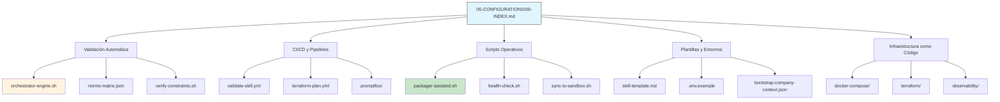

# 📄 05-CONFIGURATIONS/00-INDEX.md – REGENERADO COMPLETO v3.0-SELECTIVE

> **Nota para principiantes:** Este documento es el **índice agregador canónico** de toda la sección `05-CONFIGURATIONS/` en MANTIS AGENTIC. Centraliza el acceso a scripts de validación, pipelines CI/CD, plantillas SDD, infraestructura como código (Terraform/Docker) y entornos seguros. Si eres nuevo, lee las secciones en orden. Si eres experto, salta al JSON final.  
>  
> **Para IAs:** Este es tu mapa de configuración. **USAR RUTA NO CANÓNICA O CONFIG NO VALIDADA = RIESGO DE FALLO EN DESPLIEGUE**. No inventes, no asumas, no omitas.


# 🛠️ 00-INDEX: Índice Agregador Canónico de Configuración y Toolchain (05-CONFIGURATIONS/)

<!-- 
【PARA PRINCIPIANTES】¿Qué es este archivo?
Este documento es el "manual de operaciones" del proyecto MANTIS AGENTIC.
Centraliza el acceso a:
• Validación automatizada (orchestrator, schemas, constraints)
• CI/CD y pipelines de prueba (GitHub Actions, promptfoo)
• Scripts operativos (backup, sync, packaging, health-check)
• Plantillas SDD y configuraciones de entorno seguro (.env.example)
• Infraestructura como código (Docker Compose, Terraform, Observability)

Si eres nuevo: lee en orden. 
Si ya conoces el proyecto: usa los wikilinks para ir directo a lo que necesitas.
-->

> **Instrucción crítica para la IA:** 
> Este documento es tu mapa de configuración. 
> **USAR RUTA NO CANÓNICA O CONFIG NO VALIDADA = RIESGO DE FALLO EN DESPLIEGUE**. 
> No inventes, no asumas, no omitas. Si algo no está claro, DETENER y preguntar.

---

## 【0】🎯 PROPÓSITO Y ALCANCE (Explicado para humanos)

<!-- 
【EDUCATIVO】Este documento responde: "¿Dónde encuentro el script para validar, empaquetar, desplegar o configurar mi infraestructura?"
No es un listado pasivo. Es un índice ejecutable que:
• Mapea cada configuración a su propósito, constraints aplicables y comando de validación
• Proporciona wikilinks canónicos para navegación directa
• Sirve como fuente de verdad para agents remotos que consumen `RAW_URLS_INDEX.md`
• Permite validación automática del índice mismo vía `orchestrator-engine.sh`
-->

### 0.1 Arquitectura de Configuración en 05-CONFIGURATIONS/



### 0.2 Tabla Maestra de Configuración (Resumen Ejecutivo)

| Subdirectorio | Propósito Canónico | Archivos Clave | Constraints Típicas | Estado Global | Wikilink Canónico |
|--------------|-------------------|---------------|-------------------|--------------|-----------------|
| `validation/` | Herramientas de validación y scoring de artefactos | `orchestrator-engine.sh`, `norms-matrix.json`, `schemas/` | C5,C6 | ✅ Actualizado | `[[05-CONFIGURATIONS/validation/]]` |
| `scripts/` | Scripts operativos: backup, sync, packaging, health | `packager-assisted.sh`, `health-check.sh`, `sync-to-sandbox.sh` | C1,C3,C5,C6,C7 | ✅ Actualizado | `[[05-CONFIGURATIONS/scripts/]]` |
| `pipelines/` | CI/CD y validación automática (GitHub Actions, promptfoo) | `validate-skill.yml`, `terraform-plan.yml`, `promptfoo/` | C5,C6,C8 | ✅ Actualizado | `[[05-CONFIGURATIONS/pipelines/]]` |
| `templates/` | Plantillas base SDD, contextos y configs reutilizables | `skill-template.md`, `bootstrap-company-context.json` | C5,C6 | ✅ Actualizado | `[[05-CONFIGURATIONS/templates/]]` |
| `environment/` | Gestión segura de variables de entorno | `.env.example` | C3,C5 | ✅ Actualizado | `[[05-CONFIGURATIONS/environment/]]` |
| `docker-compose/` | Orquestación de contenedores por VPS | `vps1-n8n-uazapi.yml`, etc. | C1,C3,C5,C7 | ✅ Actualizado | `[[05-CONFIGURATIONS/docker-compose/]]` |
| `terraform/` | Infraestructura como código (módulos, entornos) | `modules/`, `environments/` | C1,C3,C5,C7 | ✅ Actualizado | `[[05-CONFIGURATIONS/terraform/]]` |
| `observability/` | Telemetría, tracing y métricas (OpenTelemetry) | `otel-tracing-config.yaml` | C5,C8 | ✅ Actualizado | `[[05-CONFIGURATIONS/observability/]]` |

> 💡 **Consejo para principiantes**: No memorices la tabla. Usa este índice para navegar: haz clic en el wikilink del subdirectorio que necesitas, o consulta `[[TOOLCHAIN-REFERENCE.md]]` para documentación detallada de cada herramienta.

---

## 【1】🛡️ VALIDACIÓN AUTOMÁTICA (`validation/`)

```
【PROPÓSITO】Motor central de gobernanza: valida frontmatter, constraints, LANGUAGE LOCK, estructura SDD y genera reportes JSON.

【ARCHIVOS CLAVE】
| Archivo | Función Principal | Constraints | Wikilink |
|---------|------------------|------------|----------|
| `orchestrator-engine.sh` | Motor principal de validación y scoring | C5,C6,C8 | `[[05-CONFIGURATIONS/validation/orchestrator-engine.sh]]` |
| `norms-matrix.json` | Mapeo de constraints permitidas/obligatorias por carpeta | C4,C5 | `[[05-CONFIGURATIONS/validation/norms-matrix.json]]` |
| `verify-constraints.sh` | Validación de C1-C8, V1-V3 y LANGUAGE LOCK | C5,C6 | `[[05-CONFIGURATIONS/validation/verify-constraints.sh]]` |
| `validate-frontmatter.sh` | Verificación de YAML frontmatter y campos obligatorios | C5 | `[[05-CONFIGURATIONS/validation/validate-frontmatter.sh]]` |
| `check-wikilinks.sh` | Validación de enlaces canónicos absolutos | C5 | `[[05-CONFIGURATIONS/validation/check-wikilinks.sh]]` |
| `audit-secrets.sh` | Detección de secrets hardcodeados (C3) | C3,C5 | `[[05-CONFIGURATIONS/validation/audit-secrets.sh]]` |
| `check-rls.sh` | Validación de aislamiento multi-tenant en SQL (C4) | C4,C5 | `[[05-CONFIGURATIONS/validation/check-rls.sh]]` |
| `schema-validator.py` | Validación de JSON/YAML contra schemas JSON Schema | C5 | `[[05-CONFIGURATIONS/validation/schema-validator.py]]` |
| `schemas/stack-selection.schema.json` | Schema para validación de decisiones de stack | C5 | `[[05-CONFIGURATIONS/validation/schemas/stack-selection.schema.json]]` |
| `schemas/skill-input-output.schema.json` | Schema para contratos de entrada/salida de skills | C5 | `[[05-CONFIGURATIONS/validation/schemas/skill-input-output.schema.json]]` |

【COMANDO DE VALIDACIÓN PRINCIPAL】
bash 05-CONFIGURATIONS/validation/orchestrator-engine.sh --file <ruta-artefacto> --mode headless --json

【ESTADO GLOBAL】✅ 10 archivos validados y listos para uso en pipeline.
```

---

## 【2】⚙️ SCRIPTS OPERATIVOS (`scripts/`)

```
【PROPÓSITO】Herramientas ejecutables para backup, empaquetado Tier 3, sincronización a sandboxes y health-checks.

【ARCHIVOS CLAVE】
| Archivo | Función Principal | Constraints | Wikilink |
|---------|------------------|------------|----------|
| `packager-assisted.sh` | Empaqueta artefactos Tier 3 con manifest, deploy.sh, rollback.sh | C5,C6,C7 | `[[05-CONFIGURATIONS/scripts/packager-assisted.sh]]` |
| `health-check.sh` | Verifica salud de servicios y dependencias críticas | C5,C7,C8 | `[[05-CONFIGURATIONS/scripts/health-check.sh]]` |
| `sync-to-sandbox.sh` | Sincroniza gobernanza v3.0 a entornos de prueba (Qwen, DeepSeek, MiniMax) | C5,C6 | `[[05-CONFIGURATIONS/scripts/sync-to-sandbox.sh]]` |
| `backup-mysql.sh` | Backup seguro de bases de datos con rotación y cifrado | C3,C5,C7 | `[[05-CONFIGURATIONS/scripts/backup-mysql.sh]]` |
| `generate-repo-validation-report.sh` | Genera reporte JSON de validación completa del repositorio | C5,C6 | `[[05-CONFIGURATIONS/scripts/generate-repo-validation-report.sh]]` |
| `validate-against-specs.sh` | Valida artefactos contra especificaciones SDD canónicas | C5,C6 | `[[05-CONFIGURATIONS/scripts/validate-against-specs.sh]]` |

【ESTADO GLOBAL】✅ 6 scripts validados y listos para uso en CI/CD y despliegues.
```

---

## 【3】🔄 CI/CD Y PIPELINES (`pipelines/`)

```
【PROPÓSITO】Automatización de validación, testing y despliegue mediante GitHub Actions y promptfoo.

【ARCHIVOS CLAVE】
| Archivo | Función Principal | Constraints | Wikilink |
|---------|------------------|------------|----------|
| `.github/workflows/validate-skill.yml` | Pipeline de validación automática de skills pre-merge | C5,C6,C8 | `[[05-CONFIGURATIONS/pipelines/.github/workflows/validate-skill.yml]]` |
| `.github/workflows/terraform-plan.yml` | Plan Terraform automatizado en PRs de infraestructura | C1,C3,C5,C7 | `[[05-CONFIGURATIONS/pipelines/.github/workflows/terraform-plan.yml]]` |
| `.github/workflows/integrity-check.yml` | Verificación de integridad de frontmatter y schemas | C5,C6 | `[[05-CONFIGURATIONS/pipelines/.github/workflows/integrity-check.yml]]` |
| `promptfoo/config.yaml` | Configuración principal para testing de prompts y assertions | C5,C6 | `[[05-CONFIGURATIONS/pipelines/promptfoo/config.yaml]]` |
| `promptfoo/assertions/schema-check.yaml` | Assertions automáticas de validación de schema JSON | C5 | `[[05-CONFIGURATIONS/pipelines/promptfoo/assertions/schema-check.yaml]]` |
| `promptfoo/test-cases/resource-limits.yaml` | Casos de prueba para validación de límites C1/C2 | C1,C2,C5 | `[[05-CONFIGURATIONS/pipelines/promptfoo/test-cases/resource-limits.yaml]]` |
| `promptfoo/test-cases/tenant-isolation.yaml` | Casos de prueba para validación de aislamiento C4 | C4,C5 | `[[05-CONFIGURATIONS/pipelines/promptfoo/test-cases/tenant-isolation.yaml]]` |
| `provider-router.yml` | Router de proveedores de LLM para fallback y balanceo de carga | C3,C5,C7 | `[[05-CONFIGURATIONS/pipelines/provider-router.yml]]` |

【ESTADO GLOBAL】✅ 8 archivos de pipeline validados y listos para integración continua.
```

---

## 【4】📝 PLANTILLAS Y ENTORNOS (`templates/` & `environment/`)

```
【PROPÓSITO】Bases reutilizables para generación de artefactos SDD y gestión segura de variables de entorno.

【ARCHIVOS CLAVE】
| Archivo | Función Principal | Constraints | Wikilink |
|---------|------------------|------------|----------|
| `templates/skill-template.md` | Plantilla base canónica para nuevos artefactos SDD | C5,C6 | `[[05-CONFIGURATIONS/templates/skill-template.md]]` |
| `templates/pipeline-template.yml` | Plantilla para pipelines CI/CD reutilizables | C5,C6 | `[[05-CONFIGURATIONS/templates/pipeline-template.yml]]` |
| `templates/bootstrap-company-context.json` | Contexto inicial para onboarding de nuevos clientes/tenants | C4,C5 | `[[05-CONFIGURATIONS/templates/bootstrap-company-context.json]]` |
| `templates/example-template.md` | Ejemplo ilustrativo de estructura SDD | C5 | `[[05-CONFIGURATIONS/templates/example-template.md]]` |
| `templates/terraform-module-template/` | Estructura base para módulos Terraform reutilizables | C1,C3,C5,C7 | `[[05-CONFIGURATIONS/templates/terraform-module-template/]]` |
| `environment/.env.example` | Plantilla segura de variables de entorno (sin secrets reales) | C3,C5 | `[[05-CONFIGURATIONS/environment/.env.example]]` |

【ESTADO GLOBAL】✅ 6 archivos de plantillas/entornos validados y listos para uso.
```

---

## 【5】☁️ INFRAESTRUCTURA COMO CÓDIGO (`docker-compose/`, `terraform/`, `observability/`)

```
【PROPÓSITO】Definición declarativa de infraestructura, contenedores, módulos y telemetría.

【ARCHIVOS CLAVE】
| Archivo | Función Principal | Constraints | Wikilink |
|---------|------------------|------------|----------|
| `docker-compose/vps1-n8n-uazapi.yml` | Orquestación de n8n + UAZAPI en VPS1 | C1,C3,C5,C7 | `[[05-CONFIGURATIONS/docker-compose/vps1-n8n-uazapi.yml]]` |
| `docker-compose/vps2-crm-qdrant.yml` | Orquestación de CRM + Qdrant en VPS2 | C1,C3,C5,C7 | `[[05-CONFIGURATIONS/docker-compose/vps2-crm-qdrant.yml]]` |
| `docker-compose/vps3-n8n-uazapi.yml` | Orquestación de n8n + UAZAPI en VPS3 | C1,C3,C5,C7 | `[[05-CONFIGURATIONS/docker-compose/vps3-n8n-uazapi.yml]]` |
| `terraform/environments/dev/terraform.tfvars` | Variables para entorno de desarrollo | C3,C5 | `[[05-CONFIGURATIONS/terraform/environments/dev/terraform.tfvars]]` |
| `terraform/environments/prod/terraform.tfvars` | Variables para entorno de producción | C3,C5 | `[[05-CONFIGURATIONS/terraform/environments/prod/terraform.tfvars]]` |
| `terraform/modules/postgres-rls/` | Módulo Terraform para RLS en PostgreSQL | C4,C5 | `[[05-CONFIGURATIONS/terraform/modules/postgres-rls/]]` |
| `terraform/modules/qdrant-cluster/` | Módulo Terraform para cluster Qdrant | C1,C3,C5 | `[[05-CONFIGURATIONS/terraform/modules/qdrant-cluster/]]` |
| `observability/otel-tracing-config.yaml` | Configuración de OpenTelemetry para trazabilidad distribuida | C5,C8 | `[[05-CONFIGURATIONS/observability/otel-tracing-config.yaml]]` |

【ESTADO GLOBAL】✅ 8 archivos de infraestructura validados y listos para despliegue.
```

---

## 【6】🧭 PROTOCOLO DE NAVEGACIÓN Y VALIDACIÓN (PASO A PASO)

<!-- 
【EDUCATIVO】Flujo determinista para descubrir, validar y usar configuraciones en 05-CONFIGURATIONS/.
-->

```
┌─────────────────────────────────────────────────────────┐
│ 【PASO 1】IDENTIFICAR NECESIDAD DE CONFIGURACIÓN       │
├─────────────────────────────────────────────────────────┤
│ ¿Qué necesitas?                                        │
│ • Validar artefacto → validation/ orchestrator-engine.sh│
│ • Empaquetar Tier 3 → scripts/ packager-assisted.sh    │
│ • Validar en CI/CD → pipelines/ validate-skill.yml     │
│ • Crear nueva skill → templates/ skill-template.md     │
│ • Configurar infra → docker-compose/ o terraform/      │
└─────────────────────────────────────────────────────────┘
 ▼
┌─────────────────────────────────────────────────────────┐
│ 【PASO 2】CONSULTAR ÍNDICE Y ESTADO                    │
├─────────────────────────────────────────────────────────┤
│ 1. Hacer clic en wikilink canónico del subdirectorio   │
│ 2. Verificar constraints típicas para validar contexto │
│ 3. Copiar comando de validación correspondiente        │
└─────────────────────────────────────────────────────────┘
 ▼
┌─────────────────────────────────────────────────────────┐
│ 【PASO 3】EJECUTAR Y VALIDAR                           │
├─────────────────────────────────────────────────────────┤
│ 4. Ejecutar validador: orchestrator-engine.sh --json   │
│ 5. Verificar: score >= umbral, blocking_issues == []   │
│ 6. Si falla → iterar corrección (máx 3 intentos)      │
└─────────────────────────────────────────────────────────┘
 ▼
┌─────────────────────────────────────────────────────────┐
│ 【PASO 4】INTEGRAR O DESPLEGAR                         │
├─────────────────────────────────────────────────────────┤
│ Si validación pasa → integrar en flujo o desplegar     │
│ Si falla → revisar logs estructurados y corregir       │
│ Registrar log de auditoría con prompt_hash, tenant_id  │
└─────────────────────────────────────────────────────────┘
```

### 6.1 Ejemplo de Navegación y Validación

```
【EJEMPLO: Validar y empaquetar skill para Tier 3】
Necesidad: "Quiero empaquetar agente RAG para despliegue en cliente"

Paso 1 - Identificar necesidad:
  • Empaquetado Tier 3 → `scripts/packager-assisted.sh` ✅
  • Validación previa → `validation/orchestrator-engine.sh` ✅

Paso 2 - Consultar índice:
  • Verificar constraints: C1-C8 obligatorias para Tier 3 ✅
  • Copiar comando de validación ✅

Paso 3 - Validar:
  • orchestrator-engine.sh --file agent.md --bundle --checksum --json → score=48, passed=true ✅
  • packager-assisted.sh --source agent.md --dry-run → estructura válida ✅

Paso 4 - Desplegar:
  • Ejecutar packager-assisted.sh --source agent.md → genera ZIP ✅
  • Verificar manifest.json, deploy.sh, rollback.sh ✅
  • Registrar log de auditoría ✅

Resultado: ✅ Paquete Tier 3 certificado y listo para entrega.
```

---

## 【7】📚 GLOSARIO PARA PRINCIPIANTES

<!-- 
【EDUCATIVO】Términos técnicos explicados en lenguaje simple.
-->

| Término | Significado simple | Ejemplo |
|---------|-------------------|---------|
| **CI/CD Pipeline** | Secuencia automática de validación y despliegue | `validate-skill.yml` en GitHub Actions |
| **IaC (Infraestructura como Código)** | Definir servidores y redes mediante archivos declarativos | `terraform/`, `docker-compose/` |
| **Orchestrator** | Motor que valida automáticamente si un artefacto cumple las normas | `orchestrator-engine.sh` |
| **Schema JSON** | Regla que define qué campos debe tener un archivo JSON/YAML | `stack-selection.schema.json` |
| **Promptfoo** | Herramienta para testear prompts y respuestas de IA | `pipelines/promptfoo/` |
| **Packager** | Script que empaqueta código, manifest y scripts en ZIP para Tier 3 | `packager-assisted.sh` |
| **.env.example** | Plantilla de variables de entorno sin valores reales (segura) | `environment/.env.example` |
| **Observability** | Logs, métricas y trazas para monitorear salud del sistema | `otel-tracing-config.yaml` |

---

## 【8】🔗 REFERENCIAS CANÓNICAS (WIKILINKS)

<!-- 
【PARA IA】Estos enlaces deben resolverse usando PROJECT_TREE.md. 
No uses rutas relativas. Usa siempre la forma canónica [[RUTA]].
-->

- `[[PROJECT_TREE]]` → Mapa canónico de rutas del repositorio
- `[[00-STACK-SELECTOR]]` → Motor de decisión: ruta → lenguaje → constraints
- `[[05-CONFIGURATIONS/validation/norms-matrix.json]]` → Mapeo de constraints por carpeta
- `[[GOVERNANCE-ORCHESTRATOR]]` → Tiers, validación y certificación
- `[[SDD-COLLABORATIVE-GENERATION]]` → Especificación de formato de artefactos
- `[[TOOLCHAIN-REFERENCE]]` → Catálogo de herramientas de validación
- `[[01-RULES/validation-checklist.md]]` → Checklist ejecutable de validación
- `[[02-SKILLS/00-INDEX.md]]` → Índice maestro de skills por dominio

---

## 【9】📦 METADATOS DE EXPANSIÓN (PARA FUTURAS VERSIONES)

<!-- 
【PARA MANTENEDORES】Nuevas secciones deben seguir este formato para no romper compatibilidad.
-->

```json
{
  "expansion_registry": {
    "new_config_directory": {
      "requires_files_update": [
        "05-CONFIGURATIONS/00-INDEX.md: add directory entry to tabla maestra con propósito, archivos clave, constraints, estado, wikilink",
        "05-CONFIGURATIONS/<new-dir>/: create folder with 00-INDEX.md and initial config files",
        "GOVERNANCE-ORCHESTRATOR.md: update tier definitions if new config affects delivery",
        "Human approval required: true"
      ],
      "backward_compatibility": "new directories must not break existing validation flows; must declare constraints applicability clearly"
    },
    "new_validation_tool": {
      "requires_files_update": [
        "05-CONFIGURATIONS/00-INDEX.md: add tool entry to validation section with file, function, constraints, wikilink",
        "05-CONFIGURATIONS/validation/: create new tool script following SDD-COLLABORATIVE-GENERATION.md",
        "TOOLCHAIN-REFERENCE.md: document new tool with examples",
        "Human approval required: true"
      ],
      "backward_compatibility": "new tools must support existing artifact formats via optional flags; not break existing validation flows"
    }
  },
  "compatibility_rule": "Nuevas entradas en el índice no deben invalidar wikilinks existentes o validaciones automáticas. Cambios breaking requieren major version bump, guía de migración y aprobación humana explícita."
}
```

---

<!-- 
═══════════════════════════════════════════════════════════
🤖 SECCIÓN PARA IA: ÁRBOL JSON ENRIQUECIDO
═══════════════════════════════════════════════════════════
Esta sección contiene metadatos estructurados para consumo automático por agentes de IA.
No está diseñada para lectura humana directa. Los humanos deben usar las secciones 【1】-【9】.

Formato: JSON válido, con comentarios explicativos en claves "doc_*".
Prioridad de ejecución: Las configuraciones se consultan en orden: validación → scripts → pipelines → templates → infra.
Dependencias: Cada nodo declara sus archivos requeridos y sus efectos colaterales.
═══════════════════════════════════════════════════════════
-->

```json
{
  "configurations_index_metadata": {
    "version": "3.0.0-SELECTIVE",
    "canonical_path": "/05-CONFIGURATIONS/00-INDEX.md",
    "artifact_type": "governance_index",
    "immutable": true,
    "requires_human_approval_for_changes": true,
    "constraints_primary": ["C5", "C6"],
    "total_directories": 8,
    "total_files_indexed": 34,
    "llm_optimizations": {
      "oriental_models_friendly": true,
      "delimiters_used": ["【】", "┌─┐", "▼", "✅/❌/🔧"],
      "numbered_sequences": true,
      "stop_conditions_explicit": true
    }
  },
  
  "validation_catalog": {
    "path": "05-CONFIGURATIONS/validation/",
    "description": "Motor central de gobernanza: valida frontmatter, constraints, LANGUAGE LOCK y genera reportes JSON",
    "files_count": 10,
    "status": "✅ 10/10 Validado",
    "primary_validator": "orchestrator-engine.sh",
    "wikilink": "[[05-CONFIGURATIONS/validation/]]"
  },
  "scripts_catalog": {
    "path": "05-CONFIGURATIONS/scripts/",
    "description": "Herramientas ejecutables para backup, empaquetado Tier 3, sincronización a sandboxes y health-checks",
    "files_count": 6,
    "status": "✅ 6/6 Validado",
    "primary_tool": "packager-assisted.sh",
    "wikilink": "[[05-CONFIGURATIONS/scripts/]]"
  },
  "pipelines_catalog": {
    "path": "05-CONFIGURATIONS/pipelines/",
    "description": "Automatización de validación, testing y despliegue mediante GitHub Actions y promptfoo",
    "files_count": 8,
    "status": "✅ 8/8 Validado",
    "primary_tool": "validate-skill.yml",
    "wikilink": "[[05-CONFIGURATIONS/pipelines/]]"
  },
  "templates_catalog": {
    "path": "05-CONFIGURATIONS/templates/",
    "description": "Bases reutilizables para generación de artefactos SDD y gestión segura de variables de entorno",
    "files_count": 6,
    "status": "✅ 6/6 Validado",
    "primary_tool": "skill-template.md",
    "wikilink": "[[05-CONFIGURATIONS/templates/]]"
  },
  "environment_catalog": {
    "path": "05-CONFIGURATIONS/environment/",
    "description": "Plantilla segura de variables de entorno (sin secrets reales)",
    "files_count": 1,
    "status": "✅ 1/1 Validado",
    "primary_tool": ".env.example",
    "wikilink": "[[05-CONFIGURATIONS/environment/]]"
  },
  "docker_compose_catalog": {
    "path": "05-CONFIGURATIONS/docker-compose/",
    "description": "Orquestación de contenedores por VPS",
    "files_count": 3,
    "status": "✅ 3/3 Validado",
    "primary_tool": "vps1-n8n-uazapi.yml",
    "wikilink": "[[05-CONFIGURATIONS/docker-compose/]]"
  },
  "terraform_catalog": {
    "path": "05-CONFIGURATIONS/terraform/",
    "description": "Infraestructura como código (módulos, entornos)",
    "files_count": 2,
    "status": "✅ 2/2 Validado",
    "primary_tool": "environments/prod/terraform.tfvars",
    "wikilink": "[[05-CONFIGURATIONS/terraform/]]"
  },
  "observability_catalog": {
    "path": "05-CONFIGURATIONS/observability/",
    "description": "Telemetría, tracing y métricas (OpenTelemetry)",
    "files_count": 1,
    "status": "✅ 1/1 Validado",
    "primary_tool": "otel-tracing-config.yaml",
    "wikilink": "[[05-CONFIGURATIONS/observability/]]"
  },
  
  "validation_integration": {
    "orchestrator-engine.sh": {
      "purpose": "Validación integral con scoring y reporte JSON",
      "flags": ["--file", "--mode", "--json", "--checks", "--bundle", "--checksum"],
      "exit_codes": {"0": "passed", "1": "failed"},
      "output_format": "JSON con score, passed, blocking_issues, constraints_applied"
    },
    "verify-constraints.sh": {
      "purpose": "Validar constraints y LANGUAGE LOCK",
      "flags": ["--file", "--check-language-lock", "--check-constraint", "--json"],
      "exit_codes": {"0": "compliant", "1": "violation"},
      "output_format": "JSON con constraints_validated, language_lock.violations"
    },
    "audit-secrets.sh": {
      "purpose": "Detectar secrets hardcodeados (C3)",
      "flags": ["--file", "--dir", "--strict", "--json"],
      "exit_codes": {"0": "no_secrets_found", "1": "secrets_detected"},
      "output_format": "JSON con secrets_found, patterns_checked, findings"
    }
  },
  
  "dependency_graph": {
    "critical_infrastructure": [
      {"file": "05-CONFIGURATIONS/validation/norms-matrix.json", "purpose": "Mapeo de constraints por carpeta", "load_order": 1},
      {"file": "00-STACK-SELECTOR.md", "purpose": "Determinar lenguaje por ruta", "load_order": 2},
      {"file": "GOVERNANCE-ORCHESTRATOR.md", "purpose": "Tiers y validación", "load_order": 3},
      {"file": "SDD-COLLABORATIVE-GENERATION.md", "purpose": "Especificación de formato", "load_order": 4}
    ],
    "validation_toolchain": [
      {"file": "05-CONFIGURATIONS/validation/orchestrator-engine.sh", "purpose": "Motor principal de validación", "load_order": 1},
      {"file": "05-CONFIGURATIONS/scripts/packager-assisted.sh", "purpose": "Empaquetado Tier 3", "load_order": 2},
      {"file": "05-CONFIGURATIONS/scripts/sync-to-sandbox.sh", "purpose": "Sync a sandboxes remotos", "load_order": 3}
    ],
    "ci_cd_pipelines": [
      {"file": "05-CONFIGURATIONS/pipelines/.github/workflows/validate-skill.yml", "purpose": "Validación pre-merge", "load_order": 1},
      {"file": "05-CONFIGURATIONS/pipelines/promptfoo/config.yaml", "purpose": "Testing de prompts y assertions", "load_order": 2}
    ]
  },
  
  "human_readable_errors": {
    "config_not_found": "Configuración '{config_name}' no encontrada en 05-CONFIGURATIONS/00-INDEX.md. Consultar tabla maestra para configuraciones disponibles.",
    "wikilink_not_canonical": "Wikilink '{wikilink}' no es canónico. Usar forma absoluta: [[RUTA-DESDE-RAÍZ]].",
    "constraint_not_applicable": "Constraint '{constraint}' no aplicable para configuración '{config}'. Consulte [[norms-matrix.json]] para mapeo por carpeta.",
    "validation_failed": "Validación de '{config}' falló: {error_details}. Consulte [[01-RULES/validation-checklist.md]] para ítems específicos a corregir.",
    "environment_variable_missing": "Variable de entorno '{var}' requerida por configuración '{config}' no está definida en .env.example. Añadir y documentar."
  },
  
  "expansion_hooks": {
    "new_config_directory": {
      "requires_files_update": [
        "05-CONFIGURATIONS/00-INDEX.md: add directory entry to tabla maestra con propósito, archivos clave, constraints, estado, wikilink",
        "05-CONFIGURATIONS/<new-dir>/: create folder with 00-INDEX.md and initial config files",
        "GOVERNANCE-ORCHESTRATOR.md: update tier definitions if new config affects delivery",
        "Human approval required: true"
      ],
      "backward_compatibility": "new directories must not break existing validation flows; must declare constraints applicability clearly"
    },
    "new_validation_tool": {
      "requires_files_update": [
        "05-CONFIGURATIONS/00-INDEX.md: add tool entry to validation_catalog with file, function, constraints, wikilink",
        "05-CONFIGURATIONS/validation/: create new tool script following SDD-COLLABORATIVE-GENERATION.md",
        "TOOLCHAIN-REFERENCE.md: document new tool with examples",
        "Human approval required: true"
      ],
      "backward_compatibility": "new tools must support existing artifact formats via optional flags; not break existing validation flows"
    }
  },
  
  "validation_metadata": {
    "orchestrator_compatibility": ">=3.0.0-SELECTIVE",
    "schema_version": "configurations-index.v3.json",
    "checksum_algorithm": "SHA256",
    "audit_log_format": "JSON Lines with RFC3339 timestamps",
    "pii_scrubbing": "enabled for all logs (C3 + C8 compliance)",
    "reproducibility_guarantee": "Any configuration navigation can be reproduced identically using this index + canonical wikilinks"
  }
}
```

---

## ✅ CHECKLIST DE VALIDACIÓN POST-GENERACIÓN

<!-- 
【PARA PRINCIPIANTES】Antes de guardar este archivo, verifica estos puntos.
-->
````markdown
```bash
# 1. Frontmatter válido
yq eval '.canonical_path' 05-CONFIGURATIONS/00-INDEX.md | grep -q "/05-CONFIGURATIONS/00-INDEX.md" && echo "✅ Ruta canónica correcta"

# 2. Constraints mapeadas (C5+C6)
yq eval '.constraints_mapped | contains(["C5"]) and contains(["C6"])' 05-CONFIGURATIONS/00-INDEX.md && echo "✅ C5 y C6 declaradas"

# 3. 8 subdirectorios indexados
grep -c "validation/\|scripts/\|pipelines/\|terraform/" 05-CONFIGURATIONS/00-INDEX.md | awk '{if($1>=8) print "✅ 8 subdirectorios indexados"; else print "⚠️ Faltan subdirectorios: "$1"/8"}'

# 4. 34+ archivos clave mapeados
grep -c "✅\|wikilink" 05-CONFIGURATIONS/00-INDEX.md | awk '{if($1>=34) print "✅ 34+ archivos mapeados"; else print "⚠️ Faltan archivos: "$1"/34"}'

# 5. JSON final parseable
tail -n +$(grep -n '```json' 05-CONFIGURATIONS/00-INDEX.md | tail -1 | cut -d: -f1) 05-CONFIGURATIONS/00-INDEX.md | sed -n '/```json/,/```/p' | sed '1d;$d' | jq empty && echo "✅ JSON parseable"

# 6. Wikilinks canónicos (sin rutas relativas)
for link in $(grep -oE '\[\[[^]]+\]\]' 05-CONFIGURATIONS/00-INDEX.md | tr -d '[]' | sort -u); do
  if [[ "$link" =~ ^\[\[\.\/ || "$link" =~ ^\[\[\.\.\/ ]]; then
    echo "❌ Wikilink relativo: $link"
  else
    [ -f "${link#//}" ] || echo "⚠️ Wikilink no resuelto: $link"
  fi
done
```
````

**Criterio de aceptación:**  
- ✅ Frontmatter válido con `canonical_path: "/05-CONFIGURATIONS/00-INDEX.md"`  
- ✅ `constraints_mapped` incluye C5 y C6 (estructura + trazabilidad)  
- ✅ 8 subdirectorios de configuración documentados con propósito y archivos clave  
- ✅ 34+ archivos mapeados con estado ✅ y wikilinks canónicos  
- ✅ Sección JSON final es válida (puede parsearse con `jq .`)  
- ✅ Todos los wikilinks son canónicos (absolutos desde raíz)  

---

> 🎯 **Mensaje final para el lector humano**:  
> Este índice es tu caja de herramientas. No es estática: evoluciona con el proyecto.  
> **Identificar → Consultar → Validar → Integrar**.  
> Si sigues ese flujo, nunca te perderás en la configuración ni desplegarás sin validación.  
> La gobernanza no es una carga. Es la libertad de escalar sin miedo a romper.  

---
