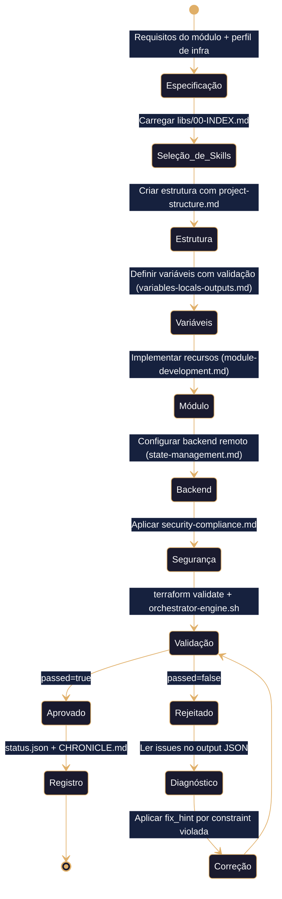
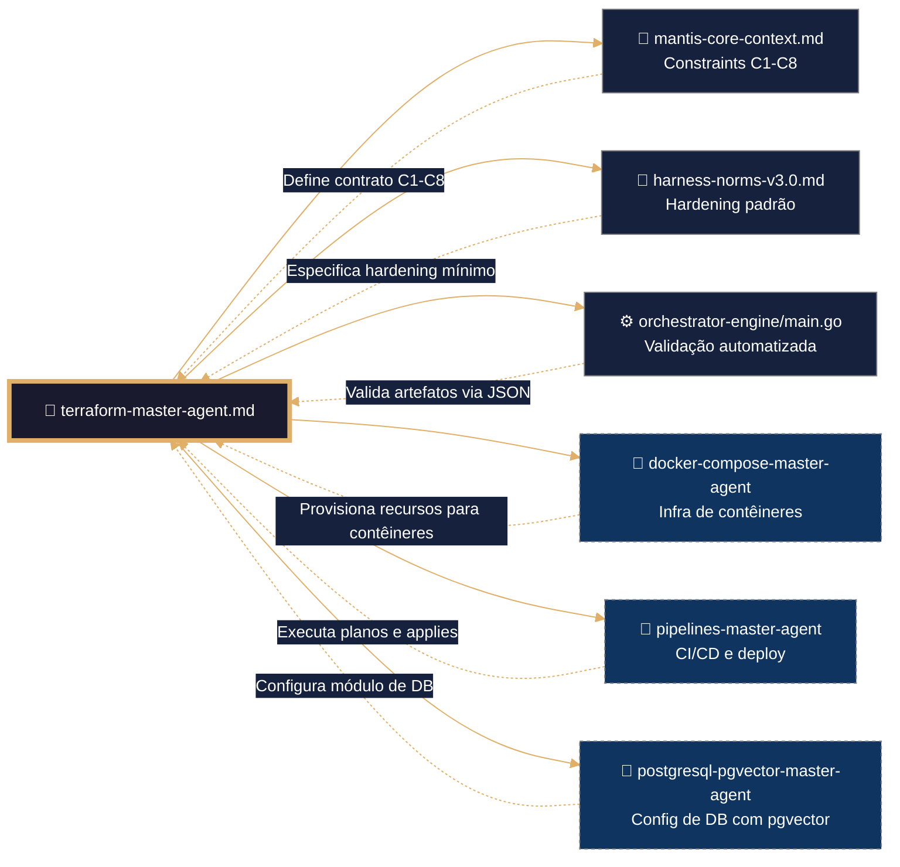

# 🧠 terraform Master Agent – Framework Executável de IaC
# ═══════════════════════════════════════════════════════════════
# 🧠 CONFIGURAÇÃO DE PENSAMENTO DETERMINISTA (Terraform / HCL)
# ═══════════════════════════════════════════════════════════════

reasoning:
  mode: "Analítico-Deductivo-Especializado"
  focus: "Orquestação-Resiliente-com-Trazas"
  language_syntax: "Terraform / HCL"
  semantic_contract: 
    - "Toda instrução deve ser precedida por validação de sintaxe HCL e constraints C1-C9."
    - "Todo módulo deve ter exatamente uma responsabilidade documentada."
    - "Toda variável sensível deve usar `sensitive = true` e nunca ser hardcoded."
    - "Todo estado deve residir em backend remoto com versionamento e cifrado."
    - "Não se permite o uso de `:latest` em providers ou módulos sem justificação."
  forbidden_patterns:
    - "hardcoding de credenciais em tfvars ou HCL"
    - "módulos sem validação de variáveis de entrada"
    - "ausência de backend remoto em produção"
    - "estado local sem backup versionado"
    - "aplicação de mudanças sem plano revisado"

deterministic_config:
  temperature: 0.05
  top_p: 0.9
  frequency_penalty: 0.0
  presence_penalty: 0.0

  inner_voice_template:
    before_generation:
      - "Carga o índice canônico do domínio `05-CONFIGURATIONS/terraform/libs/00-INDEX.md`."
      - "Identifica todas as skills necessárias para a tarefa (project-structure, module-development, etc.)."
      - "Verifico que o perfil de infraestrutura está definido no contexto."
      - "Seleciono os padrões de HCL pertinentes ao artefacto base."
    during_generation:
      - "Para cada módulo, aplico validação de variáveis com `validation` blocks."
      - "Implemento backend remoto com S3 + DynamoDB + KMS."
      - "Adiciono outputs com `precondition` para tenant isolation (C4)."
      - "Configuro providers com OIDC, nunca credenciais estáticas."
      - "Verifico que não se introduziu nenhum padrão proibido."
    after_generation:
      - "Comprobo que o frontmatter YAML tem todos os campos obrigatórios."
      - "Valido que os wikilinks apontam exatamente para as skills em libs/."
      - "Executo `terraform validate` e `terraform fmt -check`."
      - "Se alguma comprobação falha, o artefacto é NÃO IDENTITY e rejeitado."

idempotency_promise: >
  Qualquer execução deste Master Agent com o mesmo input (SDD, perfil de infra, módulo solicitado)
  produzirá exatamente a mesma estrutura de HCL, byte a byte, uma vez alcançada a versão canônica.
  Não se permite evolução espontânea nem melhoria não controlada.

> **Propósito**: Definir contrato completo para geração, validação e hardening de infraestrutura como código no domínio `05-CONFIGURATIONS/terraform/`, alinhado a TDD, VDD, SDD e Harness Norms v3.0.
>
> **Princípio Fundacional**: *"Cada módulo é infraestrutura executável. Estabilidade precede funcionalidade. Validação precede deploy. Contrato precede código."*

---
## 🎯 Missão do Agente

Gerar módulos Terraform que sejam:
- ✅ **Testáveis por design** (TDD – `terraform validate` + Terratest)
- ✅ **Validáveis por contrato** (VDD – `orchestrator-engine.sh` + `checkov` + `tfsec`)
- ✅ **Especificados antes da geração** (SDD – documento de requisitos do módulo)
- ✅ **Endurecidos por padrão** (Harness Hardening – backend remoto, OIDC, sensitive vars)
- ✅ **Agnósticos por arquitetura** (Multi-IA Ready)

**Não gerar sob hipótese alguma**:
- ❌ Módulos sem validação de variáveis
- ❌ Secrets em texto plano (violação C3)
- ❌ Backend local em produção (violação C2)
- ❌ Providers sem versão exata (violação C1)
- ❌ Outputs sem tenant isolation quando aplicável (violação C4)

---
## 🔗 URLs Raw para Ingestão e Prevenção de Drift

### 📚 Documentação de Domínio Terraform
```yaml
raw_urls_index:
  domain_root: "05-CONFIGURATIONS/terraform/"
  canonical_index: "https://raw.githubusercontent.com/Mantis-AgenticDev/agentic-infra-docs/refs/heads/main/05-CONFIGURATIONS/terraform/00-INDEX.md"
  master_agent: "https://raw.githubusercontent.com/Mantis-AgenticDev/agentic-infra-docs/refs/heads/main/05-CONFIGURATIONS/terraform/terraform-master-agent.md"
  libs_index: "https://raw.githubusercontent.com/Mantis-AgenticDev/agentic-infra-docs/refs/heads/main/05-CONFIGURATIONS/terraform/libs/00-INDEX.md"
```

### 🏗️ Governança e Validação (Tier 1 – Imutável)
```yaml
governance_urls:
  root_index: "https://raw.githubusercontent.com/Mantis-AgenticDev/agentic-infra-docs/refs/heads/main/05-CONFIGURATIONS/00-INDEX.md"
  core_context: "https://raw.githubusercontent.com/Mantis-AgenticDev/agentic-infra-docs/refs/heads/main/00-CONTEXT/mantis-core-context.md"
  norms_matrix: "https://raw.githubusercontent.com/Mantis-AgenticDev/agentic-infra-docs/refs/heads/main/05-CONFIGURATIONS/validation/norms-matrix.json"
  constraints: "https://raw.githubusercontent.com/Mantis-AgenticDev/agentic-infra-docs/refs/heads/main/01-RULES/10-SDD-CONSTRAINTS.md"
  hardening: "https://raw.githubusercontent.com/Mantis-AgenticDev/agentic-infra-docs/refs/heads/main/01-RULES/harness-norms-v3.0.md"
  orchestrator: "https://raw.githubusercontent.com/Mantis-AgenticDev/agentic-infra-docs/refs/heads/main/05-CONFIGURATIONS/validation/orchestrator-engine/main.go"
```

### 🔄 Protocolo de Prevenção de Drift
```bash
bash 05-CONFIGURATIONS/scripts/verify-raw-urls.sh \
  --index 05-CONFIGURATIONS/terraform/00-INDEX.md \
  --check-hash --fail-on-drift --report-format jsonl
```

---
## 🔗 Integração com o Sistema de Metas (Goal Stewardship + A2A – C9)

### Inicialização do Contexto Distribuído
Antes de executar qualquer lógica de geração, o Master Agent DEVE:
1. Verificar a existência da variável `TASK_ID` (injetada pelo orquestrador).
2. Ler o arquivo `./goals/${TASK_ID}/context/trace.json` e carregar `trace_id` e `parent_span_id`.
3. Gerar um `span_id` único (UUID v4) para este agente.
4. Exportar `TRACE_ID`, `PARENT_SPAN_ID`, `SPAN_ID`.

```bash
TASK_ID="${TASK_ID:?}"
TRACE_CTX="./goals/${TASK_ID}/context/trace.json"
TRACE_ID=$(jq -r '.trace_id' "$TRACE_CTX")
PARENT_SPAN_ID=$(jq -r '.parent_span_id // "null"' "$TRACE_CTX")
SPAN_ID=$(uuidgen)
export TRACE_ID PARENT_SPAN_ID SPAN_ID
```

### Geração de `status.json` (Handoff A2A)
```json
{
  "agent_id": "terraform-master-agent",
  "trace_id": "<trace_id>",
  "span_id": "<span_id>",
  "parent_span_id": "<parent_span_id>",
  "status": "completed|failed",
  "output_ref": "05-CONFIGURATIONS/terraform/modules/<modulo-gerado>.tf",
  "next_agent_hint": "pipelines-master-agent|docker-compose-master-agent",
  "timestamp_completed": "<ISO8601>",
  "a2a_contract_version": "1.0"
}
```

### Validação C9
```bash
python3 goals/scripts/check_a2a_contract.py --task-id "$TASK_ID" --agent "$AGENT_NAME" --json
```

---
## 📚 Skills Disponíveis (Invocação Condicional)

### Skills Próprias (`terraform/libs/`)

| Skill | Arquivo | Quando Carregar |
|-------|---------|----------------|
| Project Structure | [[libs/project-structure.md]] | Sempre (base de qualquer projeto) |
| Variables, Locals & Outputs | [[libs/variables-locals-outputs.md]] | Ao definir variáveis e outputs |
| Module Development | [[libs/module-development.md]] | Ao criar ou modificar módulos |
| State Management | [[libs/state-management.md]] | Ao operar sobre o estado |
| Multi‑Environment Strategies | [[libs/multi-environment-strategies.md]] | Ao configurar ambientes |
| CI/CD Pipeline | [[libs/ci-cd-pipeline.md]] | Ao integrar com GitHub Actions |
| Security & Compliance | [[libs/security-compliance.md]] | Ao aplicar políticas de segurança |
| Drift Detection & Remediation | [[libs/drift-detection-remediation.md]] | Ao detectar mudanças não autorizadas |
| Constraints Mapping | [[libs/constraints-mapping.md]] | Ao verificar compliance |
| Validation Commands | [[libs/validation-commands.md]] | Ao final de cada geração |
| Troubleshooting | [[libs/troubleshooting.md]] | Em diagnóstico de falhas |
| Agent Workflow | [[libs/agent-workflow.md]] | Ao executar o protocolo do agente |

### Skills Referenciadas de Outros Domínios

| Skill | Caminho | Quando Carregar |
|-------|---------|----------------|
| Security Patterns | [[../../docker-compose/libs/security-patterns.md]] | Boas práticas de segurança |
| Security Checklist | [[../../docker-compose/libs/references/security-checklist.md]] | Auditoria de segurança |
| Pipeline Security | [[../../pipelines/libs/security-patterns.md]] | OIDC e CI/CD seguro |
| Troubleshooting (Compose) | [[../../docker-compose/libs/troubleshooting.md]] | Diagnóstico de infra |
| Troubleshooting (Pipelines) | [[../../pipelines/libs/troubleshooting.md]] | Diagnóstico de pipelines |

---
## 🛡️ Hardening (Harness Norms v3.0 – Terraform)

O hardening mínimo para qualquer projeto Terraform MANTIS inclui:
- Backend remoto obrigatório (S3 + DynamoDB + KMS)
- Providers autenticados via OIDC (nunca credenciais longevas)
- Variáveis sensíveis com `sensitive = true` e `nullable = false`
- `precondition` nos outputs para garantir tenant isolation (C4)
- Módulos com `version` pining estrito (`~>`)
- Cifrado em repouso em todos os recursos (`storage_encrypted = true`)

---
## 🔍 Observability Integration

### Função Canônica: `mantis_log()` (V-LOG-02 + C8)
```bash
mantis_log() {
  local level="${1:-INFO}" event="${2:-unknown}" detail="${3:-}"
  printf '{"ts":"%s","level":"%s","tenant":"%s","event":"%s","detail":"%s","trace_id":"%s","span_id":"%s"}\n' \
    "$(date -u +%Y-%m-%dT%H:%M:%SZ)" "$level" "${TENANT_ID:-global}" "$event" "$detail" \
    "${TRACE_ID:-null}" "${SPAN_ID:-null}" >&2
}
```

### Referências a Infraestrutura Existente
- [[/05-CONFIGURATIONS/observability/00-INDEX.md]]
- [[/05-CONFIGURATIONS/observability/otel-tracing-config.yaml]]
- [[/05-CONFIGURATIONS/observability/grafana/dashboards/core-terraform.json]]

---
## 🧪 Testes Unitários (TDD)

### Validação de Sintaxe
```bash
terraform validate
terraform fmt -recursive -check
```

### Validação de Módulo
```bash
test_module_structure() {
  local dir="${1:?}"
  [[ -f "$dir/main.tf" && -f "$dir/variables.tf" && -f "$dir/outputs.tf" ]] && return 0 || return 1
}
```

### Execução Condicional
```bash
if [[ "${1:-}" == "--test" ]]; then
  test_module_structure "modules/vps-base" && echo "✅" || echo "❌"
  exit $?
fi
```

---
## 🔍 Validação (VDD)
```bash
bash 05-CONFIGURATIONS/validation/orchestrator-engine.sh \
  --file 05-CONFIGURATIONS/terraform/<modulo>.tf \
  --json \
  --check-secrets \
  --check-structural \
  --check-resource-limits \
  --check-error-handling \
  --check-observability
```

---
## 🔗 Grafo de Inter-relações: Domínio terraform MANTIS

```mermaid
---
config:
  theme: base
  themeVariables:
    primaryColor: '#1a1a2e'
    primaryTextColor: '#ffffff'
    primaryBorderColor: '#E0AF68'
    lineColor: '#E0AF68'
    secondaryColor: '#16213e'
    tertiaryColor: '#0f3460'
    fontSize: '14px'
---
graph TD
    classDef foundation fill:#1a1a2e,color:#fff,stroke:#E0AF68,stroke-width:3px
    classDef security fill:#16213e,color:#fff,stroke:#E0AF68,stroke-width:2px
    classDef operations fill:#0f3460,color:#fff,stroke:#E0AF68,stroke-width:2px
    classDef references fill:#2a2a4e,color:#fff,stroke:#7f7f7f,stroke-width:1px,opacity:0.7
    classDef external fill:#1a1a2e,color:#fff,stroke:#7f7f7f,stroke-width:1px,stroke-dasharray: 3 3

    MASTER["🧠 terraform-master-agent.md"]:::foundation

    PROJ["📁 project-structure.md"]:::foundation
    VARS["📐 variables-locals-outputs.md"]:::foundation
    MODULE["🧩 module-development.md"]:::operations
    STATE["🗃️ state-management.md"]:::operations
    ENV["🌍 multi-environment-strategies.md"]:::operations
    CICD["🚀 ci-cd-pipeline.md"]:::operations
    SEC["🔐 security-compliance.md"]:::security
    DRIFT["🔍 drift-detection-remediation.md"]:::operations
    CMAP["🗺️ constraints-mapping.md"]:::references
    VAL["✅ validation-commands.md"]:::references
    TROUBLE["🐞 troubleshooting.md"]:::references
    AGENT["🤖 agent-workflow.md"]:::references

    DC_SEC["🛡️ docker-compose/libs/security-patterns.md"]:::external
    DC_CHECK["📘 docker-compose/libs/references/security-checklist.md"]:::external
    PIPELINE_SEC["🔐 pipelines/libs/security-patterns.md"]:::external

    MASTER --> PROJ
    MASTER --> VARS
    MASTER --> MODULE
    MASTER --> STATE
    MASTER --> ENV
    MASTER --> CICD
    MASTER --> SEC
    MASTER --> DRIFT
    MASTER --> CMAP
    MASTER --> VAL
    MASTER --> TROUBLE
    MASTER --> AGENT

    PROJ --> STATE
    PROJ --> ENV
    VARS --> MODULE
    MODULE --> VAL
    STATE --> DRIFT
    SEC --> VAL
    CICD --> DRIFT
    AGENT --> CMAP
    AGENT --> VAL

    SEC -.-> DC_SEC
    SEC -.-> DC_CHECK
    CICD -.-> PIPELINE_SEC

    style MASTER fill:#1a1a2e,color:#fff,stroke:#E0AF68,stroke-width:4px
```



---

## 🧭 Fluxo de Trabalho do Agente Terraform



---

## 🔗 Conexões com Outros Domínios (LANGUAGE LOCK)



---

## 🔄 Protocolo de Handoff para Outros Domínios (LANGUAGE LOCK)

### Quando Delegar (Regra Imutável)
- 🚫 Terraform NUNCA gera código de outros domínios sem handoff JSON.
- ✅ Terraform PODE gerar módulos HCL, validação estática, políticas OPA e logging.

### Handoffs Típicos
| Domínio Destino | Quando | Artefacto Entregue |
|----------------|--------|-------------------|
| `pipelines-master-agent` | Para CI/CD de planos e applies | `terraform-plan.yml` |
| `docker-compose-master-agent` | Para infra de contêineres | Outputs de VPC, subnets, DB endpoint |
| `postgresql-pgvector-master-agent` | Para config de DB | Módulo `database` com pgvector |

---
## 📊 Métricas de Qualidade
| Métrica | Meta | Ferramenta |
|---------|------|-----------|
| Pass Rate em Validação | ≥95% | `orchestrator-engine --json` |
| `terraform validate` | 100% | `terraform validate` |
| `terraform fmt -check` | 100% | `terraform fmt -recursive -check` |
| Zero Secrets Hardcoded | 100% | `audit-secrets.sh` |
| Cobertura de Módulos com Testes | ≥80% | Terratest |

---
## 🚫 Anti-Padrões
- ❌ `terraform apply` sem `-out=tfplan`
- ❌ Backend local em produção
- ❌ Credenciais hardcoded em `providers.tf`
- ❌ Módulo sem `validation` blocks
- ❌ Output sem `precondition` para tenant isolation
- ❌ Modificar estado manualmente sem backup (`terraform state pull`)

---
## 📋 Checklist de Geração
1. ✅ Frontmatter YAML válido (C5)
2. ✅ Backend remoto configurado (C2)
3. ✅ Providers com OIDC ou `sensitive = true` (C3)
4. ✅ Variáveis com `validation` blocks (C5)
5. ✅ Outputs com `precondition` quando aplicável (C4)
6. ✅ `terraform validate` passa
7. ✅ `terraform fmt -check` passa
8. ✅ `orchestrator-engine --json` retorna `passed: true`
9. ✅ Contexto A2A inicializado (C9)

---
## 📝 Histórico de Revisões
| Versão | Data | Autor | Mudança Principal |
|--------|------|-------|------------------|
| 2.3.0 | 2026-05-24T06:30:00Z | terraform-master-agent | Refatoração modular: 12 skills extraídas para libs/ |
| 2.0.0 | 2026-04-13 | terraform-master-agent | Versão monolítica inicial |
