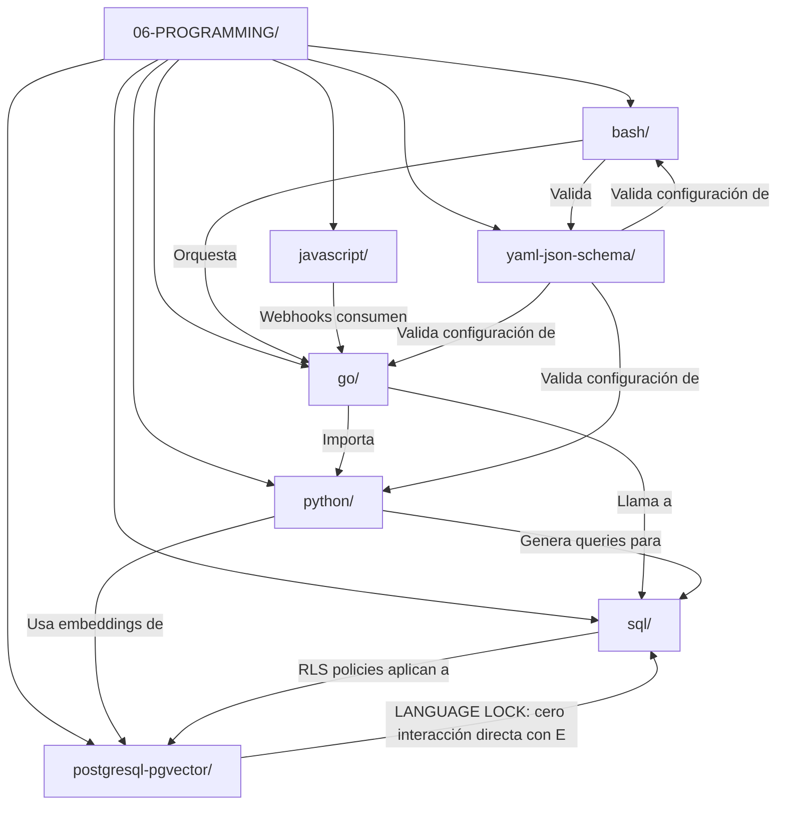

# 📄 06-PROGRAMMING/00-INDEX.md – AGREGADOR MAESTRO CANÓNICO

> **Nota para principiantes:** Este archivo es el "índice de índices". No contiene código, sino la brújula para navegar entre los 7 lenguajes del proyecto. Si eres nuevo, lee la Sección 1 primero. Si eres experto, salta al JSON final.


# 🗂️ 06-PROGRAMMING – Índice Maestro Agregador

<!-- 
【PARA PRINCIPIANTES】¿Qué es este archivo?
Este es el "mapa central" de toda la programación en MANTIS AGENTIC. 
No es código ejecutable. Es una guía de navegación que te dice:
• Qué lenguajes existen en el proyecto
• Dónde encontrar patrones para cada lenguaje
• Cómo interactúan entre sí
• Qué normas aplicar según el lenguaje y la tarea

Si estás empezando: lee las secciones en orden. 
Si ya conoces el proyecto: usa los wikilinks para ir directo a lo que necesitas.
-->

## 1. 🎯 PROPÓSITO Y ALCANCE (Explicado para humanos)

Este índice agrega y orquesta los 7 índices de lenguaje en `06-PROGRAMMING/`:

| Lenguaje | Carpeta | Archivos | Propósito Principal | Wikilink al Índice |
|----------|---------|----------|-------------------|-------------------|
| **Go** | `06-PROGRAMMING/go/` | 35 artifacts | Microservicios, alta concurrencia, binarios estáticos | `[[06-PROGRAMMING/go/00-INDEX]]` |
| **Python** | `06-PROGRAMMING/python/` | 24 artifacts | IA/ML, LangChain, prototipado rápido, scripts complejos | `[[06-PROGRAMMING/python/00-INDEX]]` |
| **Bash** | `06-PROGRAMMING/bash/` | 12 artifacts | Scripts de sistema, orquestación, glue code, validación | `[[06-PROGRAMMING/bash/00-INDEX]]` |
| **SQL (genérico)** | `06-PROGRAMMING/sql/` | 25 artifacts | Queries relacionales, RLS, migraciones, sin extensiones vectoriales | `[[06-PROGRAMMING/sql/00-INDEX]]` |
| **PostgreSQL + pgvector** | `06-PROGRAMMING/postgresql-pgvector/` | 10 artifacts | **ÚNICO** lugar para búsqueda vectorial, embeddings, RAG | `[[06-PROGRAMMING/postgresql-pgvector/00-INDEX]]` |
| **TypeScript/JavaScript** | `06-PROGRAMMING/javascript/` | 22 artifacts | Webhooks, n8n, frontend, bots de mensajería | `[[06-PROGRAMMING/javascript/00-INDEX]]` |
| **YAML + JSON Schema** | `06-PROGRAMMING/yaml-json-schema/` | 9 artifacts | Validación estructural, configuración, schemas canónicos | `[[06-PROGRAMMING/yaml-json-schema/00-INDEX]]` |

> 🔐 **Regla de Oro**: Antes de elegir un lenguaje, consulta `[[00-STACK-SELECTOR]]`. La ruta canónica (dónde va el archivo) determina el lenguaje permitido. No al revés.

---

## 2. 🔗 NAVEGACIÓN HUMANA – WIKILINKS CANÓNICOS

<!-- 
【EDUCATIVO】Los wikilinks usan doble corchete [[RUTA]] para referencias canónicas. 
No uses rutas relativas como ../otra-carpeta. Siempre usa la forma absoluta desde la raíz.
-->

### 2.1 Acceso Rápido por Lenguaje

| Si necesitas... | Ve a... | Wikilink |
|----------------|---------|----------|
| Microservicio en Go con alta concurrencia | `go/00-INDEX.md` | `[[06-PROGRAMMING/go/00-INDEX]]` |
| Agente LangChain o integración con LLM | `python/00-INDEX.md` | `[[06-PROGRAMMING/python/00-INDEX]]` |
| Script de sistema, backup, validación | `bash/00-INDEX.md` | `[[06-PROGRAMMING/bash/00-INDEX]]` |
| Query SQL con aislamiento multi-tenant | `sql/00-INDEX.md` | `[[06-PROGRAMMING/sql/00-INDEX]]` |
| Búsqueda vectorial, embeddings, RAG | `postgresql-pgvector/00-INDEX.md` | `[[06-PROGRAMMING/postgresql-pgvector/00-INDEX]]` |
| Webhook, n8n, frontend, bot de WhatsApp | `javascript/00-INDEX.md` | `[[06-PROGRAMMING/javascript/00-INDEX]]` |
| Validar configuración con schema | `yaml-json-schema/00-INDEX.md` | `[[06-PROGRAMMING/yaml-json-schema/00-INDEX]]` |

### 2.2 Interacciones Críticas entre Lenguajes



#### Tabla de Dependencias Cruzadas

| Lenguaje Origen | Lenguaje Destino | Tipo de Interacción | Constraint Crítico | Wikilink al Patrón |
|----------------|-----------------|-------------------|-------------------|-------------------|
| `go/` | `sql/` | Queries parametrizadas con tenant_id | C4 (Tenant Isolation) | `[[06-PROGRAMMING/go/sql-core-patterns.go]]` |
| `go/` | `postgresql-pgvector/` | **PROHIBIDO**: LANGUAGE LOCK | 🔴 Bloqueo estricto | `[[01-RULES/language-lock-protocol]]` |
| `python/` | `postgresql-pgvector/` | Embeddings + búsqueda vectorial | V1 (Dimension Declaration) | `[[06-PROGRAMMING/python/langchain-integration]]` |
| `python/` | `sql/` | Queries RLS-aware con psycopg | C4 + C5 | `[[06-PROGRAMMING/python/vertical-db-schemas]]` |
| `bash/` | `go/` | Ejecución de binarios con timeout | C2 + C7 | `[[06-PROGRAMMING/bash/orchestrator-routing]]` |
| `bash/` | `yaml-json-schema/` | Validación de configs con check-jsonschema | C5 | `[[06-PROGRAMMING/bash/yaml-frontmatter-parser]]` |
| `javascript/` | `go/` | Webhooks con firma HMAC | C3 + C6 | `[[06-PROGRAMMING/javascript/webhook-validation-patterns]]` |
| `sql/` | `postgresql-pgvector/` | **PROHIBIDO**: operadores vectoriales en sql/ | 🔴 LANGUAGE LOCK | `[[01-RULES/language-lock-protocol]]` |

> ⚠️ **LANGUAGE LOCK RESUMEN**:
> - `go/` y `sql/` → **PROHIBIDO** usar `<->`, `<=>`, `<#>`, `vector(n)`, `USING hnsw/ivfflat`
> - `postgresql-pgvector/` → **ÚNICO** lugar permitido para operadores vectoriales + constraints V1-V3
> - Violaciones son bloqueantes: `orchestrator-engine.sh` retorna `blocking_issues: ["LANGUAGE_LOCK_VIOLATION"]`

---

## 3. 🛡️ APLICACIÓN DE NORMAS POR LENGUAJE (C1-C8 + V1-V3)

<!-- 
【PARA PRINCIPIANTES】Las constraints son reglas de calidad. 
C1-C8 aplican a casi todo. 
V1-V3 aplican SOLO a búsqueda vectorial (postgresql-pgvector/).

Este resumen te dice qué normas son obligatorias en cada lenguaje.
-->

### 3.1 Matriz de Constraints por Lenguaje

| Constraint | go | python | bash | sql | pgvector | js/ts | yaml |
|-----------|----|--------|------|-----|----------|-------|------|
| **C1** Resource Limits | 🔴 | 🟢 | 🟢 | 🟡 | 🟡 | 🟡 | 🟢 |
| **C2** Concurrency/Timeout | 🔴 | 🟢 | 🟡 | 🟡 | 🟡 | 🟢 | ⚪ |
| **C3** Zero Hardcode Secrets | 🔴 | 🔴 | 🔴 | 🔴 | 🔴 | 🔴 | 🔴 |
| **C4** Tenant Isolation | 🔴 | 🔴 | 🔴 | 🔴 | 🔴 | 🔴 | 🟢 |
| **C5** Structural Contract | 🔴 | 🔴 | 🔴 | 🔴 | 🔴 | 🔴 | 🔴 |
| **C6** Verifiable Execution | 🔴 | 🟢 | 🔴 | 🟢 | 🟢 | 🟢 | 🟡 |
| **C7** Operational Resilience | 🔴 | 🟢 | 🔴 | 🟢 | 🟢 | 🟢 | 🟢 |
| **C8** Structured Logging | 🔴 | 🔴 | 🟡 | 🟢 | 🔴 | 🟢 | 🟡 |
| **V1** Vector Dimensions | ⚪ | ⚪ | ⚪ | ⚪ | 🔴 | ⚪ | ⚪ |
| **V2** Distance Metric | ⚪ | ⚪ | ⚪ | ⚪ | 🟢 | ⚪ | ⚪ |
| **V3** Index Justification | ⚪ | ⚪ | ⚪ | ⚪ | 🟢 | ⚪ | ⚪ |

*Legenda*: 🔴 = mandatory (bloqueo si falla), 🟢 = applicable (advertencia), 🟡 = contextual, ⚪ = not_applicable

### 3.2 Orden de Ejecución de Normas (Prioridad)

<!-- 
【EDUCATIVO】El orchestrator valida constraints en este orden para fail-fast. 
Las críticas se evalúan primero para detener generación temprana si hay violación grave.
-->

```text
FASE 1 – CRÍTICAS (fail_fast = true)
├─ C3: Zero Hardcode Secrets → Bloqueo inmediato si hay credenciales en código
├─ C4: Tenant Isolation → Bloqueo si hay riesgo de fuga entre tenants
└─ C5: Structural Contract → Bloqueo si frontmatter o schema es inválido

FASE 2 – ESENCIALES (fail_fast = false, pero score crítico)
├─ C1: Resource Limits → Previene DoS por configuración
├─ C6: Verifiable Execution → Garantiza auditabilidad de comandos
├─ C7: Operational Resilience → Manejo de fallos y rollback
└─ C2: Concurrency Control → Estabilidad en ejecución paralela

FASE 3 – COMPLEMENTARIAS (mejora de calidad)
├─ C8: Structured Logging → Observabilidad post-mortem
└─ V1/V2/V3: Vector Constraints → SOLO si language=sql_pgvector

REGLA DE EJECUCIÓN:
1. Si falla FASE 1 → bloqueo inmediato, score = 0
2. Si falla FASE 2 → score reducido, pero puede pasar si otras compensan
3. FASE 3 → mejora score, pero no es bloqueante (excepto V1 en pgvector)
```

---

## 4. 🧭 PROTOCOLO DE NAVEGACIÓN PARA IA (PASO A PASO)

<!-- 
【PARA IA】Este es el flujo determinista que DEBES seguir antes de generar código en cualquier lenguaje.
Mismos inputs → mismos outputs. Si algo no está claro, DETENER y preguntar.
-->

```
┌─────────────────────────────────────────────────────────┐
│ PASO 0: CONFIRMAR MODO (A1-B3) Y RUTA CANÓNICA          │
├─────────────────────────────────────────────────────────┤
│ 1. Leer [[00-STACK-SELECTOR]] para determinar:          │
│    • mode_selected (A1/A2/A3/B1/B2/B3)                  │
│    • canonical_path (ej: /06-PROGRAMMING/go/mi-archivo)│
│ 2. Si ruta no está en PROJECT_TREE.md → ERROR          │
│ 3. Si lenguaje no coincide con ruta → ERROR            │
└─────────────────────────────────────────────────────────┘
 ▼
┌─────────────────────────────────────────────────────────┐
│ PASO 1: CARGAR ÍNDICE DEL LENGUAJE CORRESPONDIENTE     │
├─────────────────────────────────────────────────────────┤
│ • Si canonical_path contiene /go/ → cargar [[go/00-INDEX]] │
│ • Si contiene /python/ → cargar [[python/00-INDEX]]       │
│ • ... (aplicar para los 7 lenguajes)                     │
│ • Si índice no disponible → NOTIFICAR y DETENER         │
└─────────────────────────────────────────────────────────┘
 ▼
┌─────────────────────────────────────────────────────────┐
│ PASO 2: VALIDAR LANGUAGE LOCK Y CONSTRAINTS            │
├─────────────────────────────────────────────────────────┤
│ 1. Extraer language de canonical_path                   │
│ 2. Consultar [[05-CONFIGURATIONS/validation/norms-matrix.json]] │
│ 3. Verificar:                                           │
│    • ¿constraints_mapped ⊆ allowed para esta carpeta?  │
│    • ¿denied_operators no aparecen en el contenido?    │
│ 4. Si viola LANGUAGE LOCK → blocking_issue inmediato   │
└─────────────────────────────────────────────────────────┘
 ▼
┌─────────────────────────────────────────────────────────┐
│ PASO 3: SELECCIONAR PLANTILLA Y GENERAR                │
├─────────────────────────────────────────────────────────┤
│ 1. Cargar skill-template.md desde 05-CONFIGURATIONS/   │
│ 2. Aplicar frontmatter canónico con:                   │
│    • canonical_path exacto                             │
│    • constraints_mapped según norms-matrix             │
│    • validation_command ejecutable                     │
│ 3. Generar cuerpo con ≥10 ejemplos ✅/❌/🔧 (Tier 2-3)│
│ 4. Incluir comentarios educativos si artifact_type lo permite │
└─────────────────────────────────────────────────────────┘
 ▼
┌─────────────────────────────────────────────────────────┐
│ PASO 4: VALIDAR Y ENTREGAR                             │
├─────────────────────────────────────────────────────────┤
│ Ejecutar:                                               │
│   bash 05-CONFIGURATIONS/validation/orchestrator-engine.sh \ │
│     --file <ruta> --mode headless --json                │
│ Esperar:                                                │
│   • score >= 30                                         │
│   • blocking_issues == []                               │
│   • language_lock_violations == 0                       │
│ Entregar según Tier (pantalla/código/ZIP)              │
└─────────────────────────────────────────────────────────┘
```

> 💡 **Consejo para principiantes**: Si te pierdes, vuelve al inicio. Este protocolo está diseñado para ser repetible y auditable.

---

## 5. 🚫 ANTI-PATRONES (DECISIONES PROHIBIDAS)

<!-- 
【EDUCATIVO】Estos errores son comunes en principiantes. Evítalos desde el inicio.
-->

| Anti-patrón | Por qué está prohibido | Alternativa correcta |
|------------|----------------------|---------------------|
| **Elegir lenguaje antes que ruta** | Viola LANGUAGE LOCK, genera inconsistencias | Primero ruta (PROJECT_TREE.md) → luego lenguaje (00-STACK-SELECTOR) |
| **Usar operadores pgvector en go/ o sql/** | Violación crítica de LANGUAGE LOCK | Para vectores, usar EXCLUSIVAMENTE `06-PROGRAMMING/postgresql-pgvector/` |
| **Declarar V1/V2/V3 en constraints_mapped de lenguajes no-pgvector** | Falsa aplicación de normas vectoriales | V1-V3 solo aplican si `language == "sql_pgvector"` |
| **Omitir frontmatter o validation_command** | Rompe validación automática, Tier 1 imposible | Siempre incluir frontmatter canónico + command ejecutable |
| **Generar sin confirmar modo (A1-B3)** | Deriva de gobernanza, validación inconsistente | Gate de modo obligatorio (Paso 0 del protocolo) |
| **Inventar constraints no mapeadas en norms-matrix.json** | Falsa sensación de seguridad, auditoría imposible | Solo usar C1-C8 y V1-V3 definidas canónicamente |
| **Usar wikilinks relativos (`[[../otra]]`)** | Rompe resolución canónica, imposible auditar | Siempre usar forma absoluta: `[[RUTA-CANÓNICA-DESDE-RAÍZ]]` |

---

## 6. 📚 GLOSARIO PARA PRINCIPIANTES

<!-- 
【EDUCATIVO】Términos técnicos explicados en lenguaje simple.
-->

| Término | Significado simple | Ejemplo |
|---------|-------------------|---------|
| **Canonical Path** | La ruta "oficial" donde debe vivir un archivo | `/06-PROGRAMMING/go/orchestrator-engine.go.md` |
| **Frontmatter** | Metadatos al inicio de un archivo Markdown (entre `---`) | `version: "1.0.0"`, `constraints_mapped: ["C1","C3"]` |
| **LANGUAGE LOCK** | Regla que prohíbe ciertos operadores en ciertas carpetas | No usar `<->` en `go/`, solo en `postgresql-pgvector/` |
| **Tenant Isolation (C4)** | Aislar datos de cada cliente para que no se mezclen | `WHERE tenant_id = $1` en cada query |
| **Tier 1/2/3** | Niveles de madurez: 1=borrador, 2=código listo, 3=desplegable | Tier 3 incluye healthcheck, rollback, checksums |
| **Validation Command** | Comando que cualquiera puede ejecutar para verificar el artefacto | `bash orchestrator-engine.sh --file mi-archivo.md --json` |
| **Wikilink** | Enlace interno al proyecto con doble corchete | `[[PROJECT_TREE.md]]` se resuelve a la ruta real |
| **Constraint** | Regla de calidad que debe cumplirse | C3: "Nunca escribas contraseñas en el código" |

---

## 7. 🔗 REFERENCIAS CANÓNICAS (WIKILINKS)

<!-- 
【PARA IA】Estos enlaces deben resolverse usando PROJECT_TREE.md. 
No uses rutas relativas. Usa siempre la forma canónica [[RUTA]].
-->

- `[[00-STACK-SELECTOR]]` → Motor de decisión de stack (ruta → lenguaje → constraints)
- `[[PROJECT_TREE]]` → Mapa maestro de rutas del repositorio
- `[[05-CONFIGURATIONS/validation/norms-matrix.json]]` → Matriz de aplicación de constraints por carpeta
- `[[01-RULES/harness-norms-v3.0.md]]` → Definición textual de C1-C8
- `[[01-RULES/language-lock-protocol.md]]` → Reglas de exclusión de operadores por lenguaje
- `[[GOVERNANCE-ORCHESTRATOR]]` → Tiers, validación y certificación
- `[[IA-QUICKSTART]]` → Punto de entrada para IAs, define modos A1-B3
- `[[AI-NAVIGATION-CONTRACT]]` → Reglas de interacción y navegación
- `[[05-CONFIGURATIONS/templates/skill-template.md]]` → Plantilla base para nuevos artefactos

---

## 8. 🧪 SANDBOX DE PRUEBA (OPCIONAL)

<!-- 
【PARA DESARROLLADORES】Pega esta sección en un chat nuevo para validar que la IA sigue el protocolo sin contexto previo.
-->

```
【TEST MODE: PROGRAMMING-INDEX VALIDATION】
Prompt de prueba: "Generar patrón de webhook seguro para cliente agrícola"

Respuesta esperada de la IA:
1. 【GATE MODO】Solicitar selección: [A1]...[B3]
2. Si humano responde "B2":
   - Cargar PROJECT_TREE.md → ruta: 06-PROGRAMMING/javascript/ (webhooks)
   - Consultar 00-STACK-SELECTOR → lenguaje: TypeScript
   - Cargar norms-matrix.json → constraints: C3🔴, C4🔴, C5🔴, C6🟢, C7🟢
   - Aplicar LANGUAGE LOCK → TypeScript: cero pgvector
3. Cargar índice: [[06-PROGRAMMING/javascript/00-INDEX]]
4. Seleccionar plantilla: webhook-validation-patterns.ts.md
5. Generar artefacto con:
   - Frontmatter: canonical_path, constraints_mapped, validation_command
   - Cuerpo: firma HMAC, validación de schema, tenant_id en headers
   - ≥10 ejemplos ✅/❌/🔧
   - Bloque de validación: orchestrator-engine.sh --file ...
6. Entregar: Código + validation_command + checksum

Si la IA omite el Paso 1 o usa lenguaje incorrecto → FALLA DE GOBERNANZA.
```

---

## 9. 📦 METADATOS DE EXPANSIÓN (PARA FUTURAS VERSIONES)

<!-- 
【PARA MANTENEDORES】Nuevas secciones deben seguir este formato para no romper compatibilidad.
-->

```json
{
  "expansion_registry": {
    "languages": {
      "current": ["go", "python", "bash", "sql", "postgresql-pgvector", "javascript", "yaml-json-schema"],
      "extensible": true,
      "addition_requires": [
        "Update this index: add new row to language table",
        "Update 00-STACK-SELECTOR.md: add routing rule",
        "Update norms-matrix.json: add constraint mapping",
        "Create new language index: 06-PROGRAMMING/<new>/00-INDEX.md",
        "Human approval required: true"
      ]
    },
    "constraints": {
      "current_c": ["C1", "C2", "C3", "C4", "C5", "C6", "C7", "C8"],
      "current_v": ["V1", "V2", "V3"],
      "extensible": false,
      "change_requires": [
        "Update harness-norms-v3.0.md with new definition",
        "Update norms-matrix.json with applicability matrix",
        "Update orchestrator-engine.sh with validation logic",
        "Human approval required: true + major version bump"
      ]
    }
  },
  "compatibility_rule": "Nuevos lenguajes deben declarar LANGUAGE LOCK rules (deny_operators/require_constraints) antes de ser aceptados. Nuevas constraints no deben invalidar artefactos existentes que no las usen."
}
```

---

<!-- 
═══════════════════════════════════════════════════════════
🤖 SECCIÓN PARA IA: ÁRBOL JSON ENRIQUECIDO
═══════════════════════════════════════════════════════════
Esta sección contiene metadatos estructurados para consumo automático por agentes de IA.
No está diseñada para lectura humana directa. Los humanos deben usar las secciones 1-9.

Formato: JSON válido, con comentarios explicativos en claves "doc_*".
Prioridad de ejecución: Las normas se aplican en el orden definido en "norm_execution_order".
Dependencias: Cada nodo declara sus archivos requeridos y sus efectos colaterales.
═══════════════════════════════════════════════════════════
-->

```json
{
  "programming_index_metadata": {
    "version": "3.0.0-SELECTIVE",
    "canonical_path": "/06-PROGRAMMING/00-INDEX.md",
    "artifact_type": "skill_index_aggregator",
    "total_languages": 7,
    "total_artifacts_aggregated": 137,
    "last_updated": "2026-04-19T00:00:00Z",
    "llm_optimizations": {
      "oriental_models_friendly": true,
      "delimiters_used": ["【】", "┌─┐", "▼", "✅/❌/🔧"],
      "numbered_sequences": true,
      "stop_conditions_explicit": true
    }
  },
  
  "language_registry": {
    "go": {
      "index_path": "06-PROGRAMMING/go/00-INDEX.md",
      "artifact_count": 35,
      "primary_use_cases": ["microservices", "high-concurrency", "static-binaries", "mcp-servers"],
      "constraints_mandatory": ["C3", "C4", "C5", "C8"],
      "language_lock": {
        "deny_operators": ["<->", "<=>", "<#", "vector(n)", "USING hnsw", "USING ivfflat"],
        "deny_constraints": ["V1", "V2", "V3"],
        "hard_block_violation": true
      },
      "dependencies": ["sql/", "python/ (for migration reference)", "bash/ (for orchestration)"],
      "provides_to": ["deploy/", "services/api/", "04-WORKFLOWS/n8n/ (via webhooks)"]
    },
    "python": {
      "index_path": "06-PROGRAMMING/python/00-INDEX.md",
      "artifact_count": 24,
      "primary_use_cases": ["ai-ml", "langchain", "rapid-prototyping", "data-processing"],
      "constraints_mandatory": ["C3", "C4", "C5", "C8"],
      "language_lock": {
        "deny_operators": [],
        "deny_constraints": ["V1", "V2", "V3"],
        "hard_block_violation": true
      },
      "dependencies": ["postgresql-pgvector/ (for RAG)", "sql/ (for relational queries)"],
      "provides_to": ["02-SKILLS/AI/", "04-WORKFLOWS/langchain/", "services/rag/"]
    },
    "bash": {
      "index_path": "06-PROGRAMMING/bash/00-INDEX.md",
      "artifact_count": 12,
      "primary_use_cases": ["system-scripts", "orchestration", "glue-code", "validation"],
      "constraints_mandatory": ["C3", "C4", "C5", "C6"],
      "language_lock": {
        "deny_operators": [],
        "deny_constraints": ["V1", "V2", "V3"],
        "hard_block_violation": true
      },
      "dependencies": ["go/ (for binary execution)", "yaml-json-schema/ (for config validation)"],
      "provides_to": ["05-CONFIGURATIONS/scripts/", "deploy/", "05-CONFIGURATIONS/validation/"]
    },
    "sql": {
      "index_path": "06-PROGRAMMING/sql/00-INDEX.md",
      "artifact_count": 25,
      "primary_use_cases": ["relational-queries", "rls-policies", "migrations", "audit-triggers"],
      "constraints_mandatory": ["C4", "C5"],
      "language_lock": {
        "deny_operators": ["<->", "<=>", "<#", "vector(n)", "USING hnsw", "USING ivfflat"],
        "deny_constraints": ["V1", "V2", "V3"],
        "hard_block_violation": true
      },
      "dependencies": ["01-RULES/06-MULTITENANCY-RULES.md"],
      "provides_to": ["06-PROGRAMMING/go/", "06-PROGRAMMING/python/", "services/api/"]
    },
    "postgresql-pgvector": {
      "index_path": "06-PROGRAMMING/postgresql-pgvector/00-INDEX.md",
      "artifact_count": 10,
      "primary_use_cases": ["vector-search", "embeddings", "rag-queries", "hybrid-search"],
      "constraints_mandatory": ["C3", "C4", "C5", "V1", "V3"],
      "language_lock": {
        "require_artifact_type": "skill_pgvector",
        "require_vector_declaration": true,
        "require_distance_metric_doc": true,
        "validator": "verify-constraints.sh --check-vector-dims --check-vector-metric --check-vector-index"
      },
      "dependencies": ["sql/ (for RLS foundation)", "02-SKILLS/BASE DE DATOS-RAG/"],
      "provides_to": ["06-PROGRAMMING/python/", "services/rag/", "02-SKILLS/AI/"]
    },
    "javascript": {
      "index_path": "06-PROGRAMMING/javascript/00-INDEX.md",
      "artifact_count": 22,
      "primary_use_cases": ["webhooks", "n8n-integration", "frontend", "messaging-bots"],
      "constraints_mandatory": ["C3", "C4", "C5", "C8"],
      "language_lock": {
        "deny_operators": [],
        "deny_constraints": ["V1", "V2", "V3"],
        "hard_block_violation": true
      },
      "dependencies": ["go/ (for backend APIs)", "yaml-json-schema/ (for config validation)"],
      "provides_to": ["04-WORKFLOWS/n8n/", "services/bot/", "services/dashboard/"]
    },
    "yaml-json-schema": {
      "index_path": "06-PROGRAMMING/yaml-json-schema/00-INDEX.md",
      "artifact_count": 9,
      "primary_use_cases": ["structural-validation", "config-management", "schema-definitions"],
      "constraints_mandatory": ["C5"],
      "language_lock": {
        "require_json_schema_validation": true,
        "deny_constraints": ["V1", "V2", "V3"],
        "hard_block_violation": true
      },
      "dependencies": ["05-CONFIGURATIONS/validation/schema-validator.py"],
      "provides_to": ["ALL languages (for config validation)", "05-CONFIGURATIONS/docker-compose/", "05-CONFIGURATIONS/terraform/"]
    }
  },
  
  "norm_execution_order": {
    "description": "Orden de aplicación de constraints durante validación. Críticas primero para fail-fast.",
    "fail_fast_sequence": [
      {"constraint": "C3", "reason": "Zero Hardcode Secrets - bloqueo crítico inmediato si falla"},
      {"constraint": "C4", "reason": "Tenant Isolation - fuga de datos es inaceptable"},
      {"constraint": "C5", "reason": "Structural Contract - sin frontmatter válido, no hay validación posible"}
    ],
    "standard_sequence": [
      {"constraint": "C1", "reason": "Resource Limits - previene DoS por configuración"},
      {"constraint": "C6", "reason": "Verifiable Execution - auditabilidad de comandos"},
      {"constraint": "C2", "reason": "Concurrency Control - estabilidad del sistema"},
      {"constraint": "C7", "reason": "Resilience - tolerancia a fallos operativos"},
      {"constraint": "C8", "reason": "Observability - trazabilidad post-mortem"}
    ],
    "vector_sequence": [
      {"constraint": "V1", "reason": "Vector Dimensions - declaración obligatoria para pgvector"},
      {"constraint": "V2", "reason": "Distance Metric - documentación semántica del operador"},
      {"constraint": "V3", "reason": "Index Justification - optimización basada en evidencia"}
    ],
    "evaluation_logic": "1) Ejecutar fail_fast_sequence. Si alguna falla → bloqueo inmediato. 2) Ejecutar standard_sequence según lenguaje. 3) Si language=postgresql-pgvector, ejecutar vector_sequence."
  },
  
  "dependency_graph": {
    "critical_infrastructure": [
      {"file": "PROJECT_TREE.md", "purpose": "Resolver rutas canónicas", "load_order": 1},
      {"file": "00-STACK-SELECTOR.md", "purpose": "Determinar lenguaje por ruta", "load_order": 2},
      {"file": "05-CONFIGURATIONS/validation/norms-matrix.json", "purpose": "Mapear constraints por carpeta", "load_order": 3},
      {"file": "01-RULES/harness-norms-v3.0.md", "purpose": "Definición textual de constraints", "load_order": 4},
      {"file": "01-RULES/language-lock-protocol.md", "purpose": "Reglas de exclusión de operadores", "load_order": 5}
    ],
    "language_indices": [
      {"file": "06-PROGRAMMING/go/00-INDEX.md", "purpose": "Patrones de microservicios en Go", "load_order": 10},
      {"file": "06-PROGRAMMING/python/00-INDEX.md", "purpose": "Patrones de IA y procesamiento en Python", "load_order": 10},
      {"file": "06-PROGRAMMING/bash/00-INDEX.md", "purpose": "Patrones de scripts de sistema en Bash", "load_order": 10},
      {"file": "06-PROGRAMMING/sql/00-INDEX.md", "purpose": "Patrones de queries relacionales en SQL", "load_order": 10},
      {"file": "06-PROGRAMMING/postgresql-pgvector/00-INDEX.md", "purpose": "Patrones de búsqueda vectorial", "load_order": 10},
      {"file": "06-PROGRAMMING/javascript/00-INDEX.md", "purpose": "Patrones de webhooks y frontend en TypeScript", "load_order": 10},
      {"file": "06-PROGRAMMING/yaml-json-schema/00-INDEX.md", "purpose": "Patrones de validación estructural", "load_order": 10}
    ],
    "validation_toolchain": [
      {"file": "05-CONFIGURATIONS/validation/orchestrator-engine.sh", "purpose": "Motor principal de validación", "load_order": 20},
      {"file": "05-CONFIGURATIONS/validation/verify-constraints.sh", "purpose": "Validación de constraints y LANGUAGE LOCK", "load_order": 21},
      {"file": "05-CONFIGURATIONS/validation/audit-secrets.sh", "purpose": "Detección de secrets hardcodeados", "load_order": 22},
      {"file": "05-CONFIGURATIONS/validation/check-rls.sh", "purpose": "Validación de tenant isolation en SQL", "load_order": 23},
      {"file": "05-CONFIGURATIONS/validation/schema-validator.py", "purpose": "Validación de JSON/YAML contra schemas", "load_order": 24}
    ]
  },
  
  "cross_reference_map": {
    "00-STACK-SELECTOR.md": {
      "relationship": "Decision engine for language selection",
      "rule": "Consult BEFORE selecting any language pattern",
      "sync_point": "canonical_path in this index must match routing rules in STACK-SELECTOR"
    },
    "05-CONFIGURATIONS/validation/norms-matrix.json": {
      "relationship": "Constraint applicability matrix",
      "rule": "constraints_mapped in any artifact must be subset of norms-matrix[folder].allowed",
      "sync_point": "Update this index when adding new constraints to norms-matrix"
    },
    "01-RULES/language-lock-protocol.md": {
      "relationship": "LANGUAGE LOCK canonical definition",
      "rule": "Deny operators listed here must be enforced in language_registry[].language_lock",
      "sync_point": "Any change to language-lock-protocol.md requires update to this index"
    },
    "06-PROGRAMMING/postgresql-pgvector/00-INDEX.md": {
      "relationship": "Sole provider of vector operations",
      "rule": "All other languages MUST deny V1/V2/V3 and pgvector operators",
      "sync_point": "If pgvector index adds new vector pattern, update cross-dependencies in other languages"
    }
  },
  
  "language_lock_enforcement": {
    "global_deny_list": {
      "operators": ["<->", "<=>", "<#", "vector(n)", "USING hnsw", "USING ivfflat"],
      "constraints": ["V1", "V2", "V3"],
      "applies_to_languages": ["go", "bash", "python", "javascript", "typescript", "sql", "yaml"],
      "exception_language": "postgresql-pgvector"
    },
    "validation_command_template": "bash 05-CONFIGURATIONS/validation/verify-constraints.sh --check-language-lock --dir 06-PROGRAMMING/<language>/",
    "failure_action": "orchestrator-engine.sh returns blocking_issues: ['LANGUAGE_LOCK_VIOLATION'] with specific operator/constraint details"
  },
  
  "ai_navigation_hints": {
    "for_generation": "Read this index FIRST to select correct language index, then load specific pattern",
    "for_validation": "Use norm_execution_order to sequence constraint checks; fail_fast constraints first",
    "for_migration": "Consult dependency_graph before modifying patterns that are consumed by other languages",
    "for_debugging": "Check language_lock_enforcement if pgvector operators appear in non-pgvector language artifacts",
    "for_expansion": "Follow expansion_registry rules when adding new languages or constraints"
  },
  
  "validation_metadata": {
    "orchestrator_compatibility": ">=3.0.0-SELECTIVE",
    "schema_version": "programming-index.v1.json",
    "checksum_algorithm": "SHA256",
    "audit_log_format": "JSON Lines with RFC3339 timestamps",
    "pii_scrubbing": "enabled for all logs (C8 compliance)"
  }
}
```

---

## ✅ CHECKLIST DE VALIDACIÓN POST-GENERACIÓN

<!-- 
【PARA PRINCIPIANTES】Antes de guardar este archivo, verifica estos puntos.
-->

```bash
# 1. Verificar que el frontmatter es YAML válido
yq eval '.canonical_path' 06-PROGRAMMING/00-INDEX.md
# Esperado: "/06-PROGRAMMING/00-INDEX.md"

# 2. Verificar que constraints_mapped solo contiene C1-C8 (no V1-V3, este índice no es pgvector)
yq eval '.constraints_mapped | .[]' 06-PROGRAMMING/00-INDEX.md | grep -E '^C[1-8]$' | wc -l
# Esperado: 8 líneas

# 3. Verificar que todos los wikilinks apuntan a archivos existentes
for link in $(grep -oE '\[\[[^]]+\]\]' 06-PROGRAMMING/00-INDEX.md | tr -d '[]' | sort -u); do
  if [ ! -f "${link#//}" ] && [ ! -f "${link}" ]; then
    echo "⚠️  Wikilink roto: $link"
  fi
done

# 4. Validar que la sección JSON final es parseable
tail -n +$(grep -n '```json' 06-PROGRAMMING/00-INDEX.md | tail -1 | cut -d: -f1) 06-PROGRAMMING/00-INDEX.md | \
  sed -n '/```json/,/```/p' | sed '1d;$d' | jq empty && echo "✅ JSON válido"

# 5. Validar con orchestrator (simulación mental)
# - ¿El archivo está en 06-PROGRAMMING/? → SÍ
# - ¿El lenguaje es markdown con índice agregador? → SÍ
# - ¿Constraints aplicables según norms-matrix.json? → C5 mandatory → SÍ
# - ¿validation_command es ejecutable? → SÍ, apunta a orchestrator-engine.sh
```

**Criterio de aceptación:**  
- ✅ Frontmatter válido con `canonical_path: "/06-PROGRAMMING/00-INDEX.md"`  
- ✅ `constraints_mapped` contiene solo C1-C8 (este índice no es pgvector)  
- ✅ Sección JSON final es válida (puede parsearse con `jq .`)  
- ✅ Todos los wikilinks apuntan a archivos existentes en `PROJECT_TREE.md`  
- ✅ `validation_command` es ejecutable y apunta al orchestrator correcto  

---

> 🎯 **Mensaje final para el lector humano**:  
> Este índice es tu mapa. No memorices cada ruta. Confía en el protocolo:  
> **Ruta → Lenguaje → Constraints → Validación**.  
> Si sigues ese flujo, nunca generarás un artefacto fuera de norma.  
> La gobernanza no es una carga. Es la libertad de crear sin miedo a romper.  
