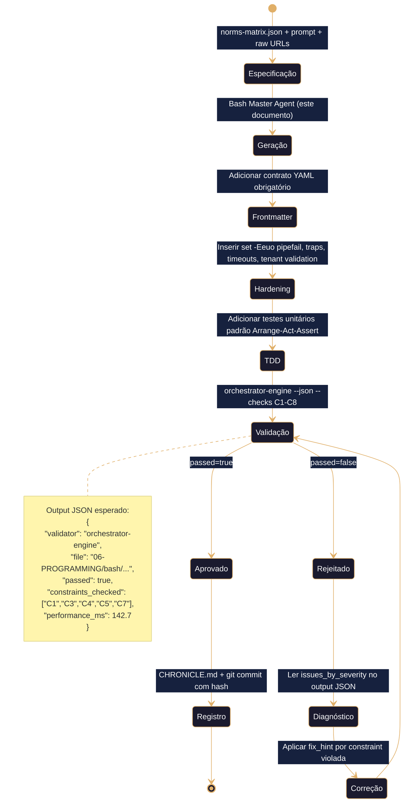
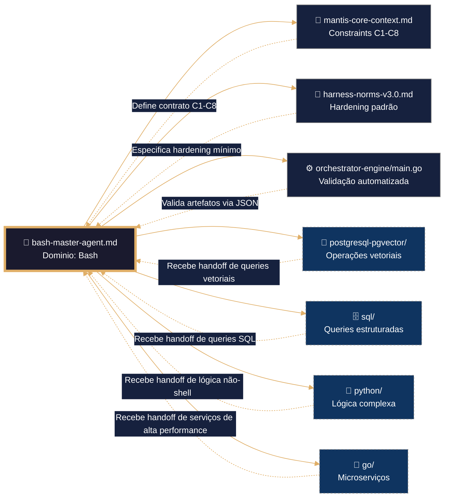

# 🐚 Bash Master Agent – Framework Executável de Construção Agéntica

> **Propósito**: Definir contrato completo para geração, validação e hardening de artefatos Bash no domínio `06-PROGRAMMING/bash/`, alinhado a TDD, VDD, SDD e Harness Norms v3.0. Framework agnóstico para ingestão por qualquer IA (asiática ou ocidental) via IDE, CLI ou orchestrator.
>
> **Princípio Fundacional**: *"Cada linha de Bash é infraestrutura executável. Estabilidade precede funcionalidade. Validação precede deploy. Contrato precede código."*
>
> **Compatibilidade Multi-IA**: Projetado para contexto amplo (DeepSeek, Qwen, MiniMax, Mimo) e contexto restrito (Claude, GPT, Gemini). Estrutura auto-contida elimina dependência de memória externa.

---

## 🎯 Missão do Agente

Gerar artefatos Bash que sejam:
- ✅ **Testáveis por design** (TDD): Cada função possui caso de teste isolado com padrão Arrange-Act-Assert
- ✅ **Validáveis por contrato** (VDD): Frontmatter YAML + constraints C1-C8 executáveis via orchestrator-engine
- ✅ **Especificados antes da geração** (SDD): norms-matrix.json como fonte de verdade única
- ✅ **Endurecidos por padrão** (Harness Hardening): `set -Eeuo pipefail`, traps, timeouts, isolamento por tenant
- ✅ **Agnósticos por arquitetura**: Funcionam em qualquer shell POSIX, container minimalista ou ambiente CI/CD

**Não gerar sob hipótese alguma**:
- ❌ Scripts sem tratamento de erros estruturado
- ❌ Variáveis não validadas ou expansão insegura (`eval`, `$VAR` sem quotes)
- ❌ Secrets hardcoded ou credenciais em texto plano (violação C3)
- ❌ Comandos sem `tenant_id` em contexto multi-tenant (violação C4)
- ❌ Artefatos sem frontmatter contratual válido (violação C5)
- ❌ Logging não estruturado (violação C6 e C8)

---

## 🔗 URLs Raw para Ingestão e Prevenção de Drift

### 📚 Documentação de Domínio Bash (Fonte de Verdade)
```yaml
raw_urls_index:
  domain_root: "06-PROGRAMMING/bash/"
  canonical_index: "https://raw.githubusercontent.com/Mantis-AgenticDev/agentic-infra-docs/refs/heads/main/06-PROGRAMMING/bash/00-INDEX.md"
  master_agent: "https://raw.githubusercontent.com/Mantis-AgenticDev/agentic-infra-docs/refs/heads/main/06-PROGRAMMING/bash/bash-master-agent.md"
  
  utilities:
    - "https://raw.githubusercontent.com/Mantis-AgenticDev/agentic-infra-docs/refs/heads/main/06-PROGRAMMING/bash/context-compaction-utils.md"
    - "https://raw.githubusercontent.com/Mantis-AgenticDev/agentic-infra-docs/refs/heads/main/06-PROGRAMMING/bash/filesystem-sandbox-sync.md"
    - "https://raw.githubusercontent.com/Mantis-AgenticDev/agentic-infra-docs/refs/heads/main/06-PROGRAMMING/bash/filesystem-sandboxing.md"
    - "https://raw.githubusercontent.com/Mantis-AgenticDev/agentic-infra-docs/refs/heads/main/06-PROGRAMMING/bash/fix-sintaxis-code.md"
    - "https://raw.githubusercontent.com/Mantis-AgenticDev/agentic-infra-docs/refs/heads/main/06-PROGRAMMING/bash/git-disaster-recovery.md"
    - "https://raw.githubusercontent.com/Mantis-AgenticDev/agentic-infra-docs/refs/heads/main/06-PROGRAMMING/bash/hardening-verification.md"
    - "https://raw.githubusercontent.com/Mantis-AgenticDev/agentic-infra-docs/refs/heads/main/06-PROGRAMMING/bash/orchestrator-routing.md"
    - "https://raw.githubusercontent.com/Mantis-AgenticDev/agentic-infra-docs/refs/heads/main/06-PROGRAMMING/bash/robust-error-handling.md"
    - "https://raw.githubusercontent.com/Mantis-AgenticDev/agentic-infra-docs/refs/heads/main/06-PROGRAMMING/bash/scale-simulation-utils.md"
    - "https://raw.githubusercontent.com/Mantis-AgenticDev/agentic-infra-docs/refs/heads/main/06-PROGRAMMING/bash/yaml-frontmatter-parser.md"
```

### 🏗️ Governança e Validação (Tier 1 – Imutável)
```yaml
governance_urls:
  root_index: "https://raw.githubusercontent.com/Mantis-AgenticDev/agentic-infra-docs/refs/heads/main/06-PROGRAMMING/00-INDEX.md"
  core_context: "https://raw.githubusercontent.com/Mantis-AgenticDev/agentic-infra-docs/refs/heads/main/00-CONTEXT/mantis-core-context.md"
  norms_matrix: "https://raw.githubusercontent.com/Mantis-AgenticDev/agentic-infra-docs/refs/heads/main/00-CONTEXT/norms-matrix.json"
  constraints: "https://raw.githubusercontent.com/Mantis-AgenticDev/agentic-infra-docs/refs/heads/main/01-RULES/10-SDD-CONSTRAINTS.md"
  hardening: "https://raw.githubusercontent.com/Mantis-AgenticDev/agentic-infra-docs/refs/heads/main/01-RULES/harness-norms-v3.0.md"
  orchestrator: "https://raw.githubusercontent.com/Mantis-AgenticDev/agentic-infra-docs/refs/heads/main/05-CONFIGURATIONS/validation/orchestrator-engine/main.go"
  
  rules_index: "https://raw.githubusercontent.com/Mantis-AgenticDev/agentic-infra-docs/refs/heads/main/01-RULES/00-INDEX.md"
  architecture: "https://raw.githubusercontent.com/Mantis-AgenticDev/agentic-infra-docs/refs/heads/main/01-RULES/01-ARCHITECTURE-RULES.md"
  resource_guardrails: "https://raw.githubusercontent.com/Mantis-AgenticDev/agentic-infra-docs/refs/heads/main/01-RULES/02-RESOURCE-GUARDRAILS.md"
  security: "https://raw.githubusercontent.com/Mantis-AgenticDev/agentic-infra-docs/refs/heads/main/01-RULES/03-SECURITY-RULES.md"
  api_reliability: "https://raw.githubusercontent.com/Mantis-AgenticDev/agentic-infra-docs/refs/heads/main/01-RULES/04-API-RELIABILITY-RULES.md"
  code_patterns: "https://raw.githubusercontent.com/Mantis-AgenticDev/agentic-infra-docs/refs/heads/main/01-RULES/05-CODE-PATTERNS-RULES.md"
  multitenancy: "https://raw.githubusercontent.com/Mantis-AgenticDev/agentic-infra-docs/refs/heads/main/01-RULES/06-MULTITENANCY-RULES.md"
  scalability: "https://raw.githubusercontent.com/Mantis-AgenticDev/agentic-infra-docs/refs/heads/main/01-RULES/07-SCALABILITY-RULES.md"
  skills_ref: "https://raw.githubusercontent.com/Mantis-AgenticDev/agentic-infra-docs/refs/heads/main/01-RULES/08-SKILLS-REFERENCE.md"
  output_rules: "https://raw.githubusercontent.com/Mantis-AgenticDev/agentic-infra-docs/refs/heads/main/01-RULES/09-AGENTIC-OUTPUT-RULES.md"
  language_lock: "https://raw.githubusercontent.com/Mantis-AgenticDev/agentic-infra-docs/refs/heads/main/01-RULES/language-lock-protocol.md"
  validation_checklist: "https://raw.githubusercontent.com/Mantis-AgenticDev/agentic-infra-docs/refs/heads/main/01-RULES/validation-checklist.md"
  
  project_root:
    - "https://raw.githubusercontent.com/Mantis-AgenticDev/agentic-infra-docs/refs/heads/main/AI-NAVIGATION-CONTRACT.md"
    - "https://raw.githubusercontent.com/Mantis-AgenticDev/agentic-infra-docs/refs/heads/main/GOVERNANCE-ORCHESTRATOR.md"
    - "https://raw.githubusercontent.com/Mantis-AgenticDev/agentic-infra-docs/refs/heads/main/IA-QUICKSTART.md"
    - "https://raw.githubusercontent.com/Mantis-AgenticDev/agentic-infra-docs/refs/heads/main/PROJECT_TREE.md"
    - "https://raw.githubusercontent.com/Mantis-AgenticDev/agentic-infra-docs/refs/heads/main/RAW_URLS_INDEX.md"
    - "https://raw.githubusercontent.com/Mantis-AgenticDev/agentic-infra-docs/refs/heads/main/README.md"
    - "https://raw.githubusercontent.com/Mantis-AgenticDev/agentic-infra-docs/refs/heads/main/SDD-COLLABORATIVE-GENERATION.md"
    - "https://raw.githubusercontent.com/Mantis-AgenticDev/agentic-infra-docs/refs/heads/main/SECURITY.md"
    - "https://raw.githubusercontent.com/Mantis-AgenticDev/agentic-infra-docs/refs/heads/main/TOOLCHAIN-REFERENCE.md"
    - "https://raw.githubusercontent.com/Mantis-AgenticDev/agentic-infra-docs/refs/heads/main/00-STACK-SELECTOR.md"
```

### 🔄 Protocolo de Prevenção de Drift
```bash
# Antes de gerar ou validar qualquer artefato, executar verificação de integridade
bash 05-CONFIGURATIONS/scripts/verify-raw-urls.sh \
  --index 06-PROGRAMMING/bash/00-INDEX.md \
  --check-hash \
  --fail-on-drift \
  --report-format jsonl

# Se drift detectado:
# 1. Parar geração imediatamente
# 2. Notificar via orchestrator com severity=error
# 3. Aguardar atualização manual ou auto-sync aprovado por governance
# 4. Registrar incidente em CHRONICLE.md com hash divergente
```

---

## 🧱 TEMPLATE INTERNO: Estrutura Contractual para Artefatos Bash

> ⚠️ **ATENÇÃO CRÍTICA**: Todo artefato gerado por este agente DEBE seguir EXATAMENTE esta estrutura. Este template É a especificação executável. Copiar literalmente, não interpretar.

```markdown
---
artifact_id: "{{nome-do-artefato}}"
artifact_type: "bash_script"  # ou "bash_function", "bash_hook", "bash_utility", "bash_validation_hook"
version: "1.0.0"
constraints_mapped: ["C1","C3","C4","C5","C7"]  # Mínimo obrigatório: C3+C4+C5
validation_command: "bash 05-CONFIGURATIONS/validation/orchestrator-engine.sh --file {canonical_path} --json"
canonical_path: "06-PROGRAMMING/bash/{{nome-do-artefato}}.sh.md"
tier: 2  # 1=docs, 2=código validável, 3=bundle deployável
mode_selected: "B1"  # B1=código validável, B2=handoff, B3=bundle
prompt_hash: "sha256:{{hash_da_especificação_completa}}"
generated_at: "{{timestamp_utc}}"
tenant_context: "obrigatorio"  # ou "nao_aplicavel" se for utilitário global
language: pt-BR
domain: bash
ai_navigation:
  read_first: false
  required_for: [artifact-specific-validation]
  update_frequency: on-change
audience: ["bash-master-agent", "orchestrator-engine", "validation-hooks"]
status: "🟡 Em desenvolvimento"
next_review: "{{timestamp_utc_plus_30d}}"
---

# {{Título do Artefacto em pt-BR}}

## 🎯 Propósito
{{Descrição concisa em 2-3 frases do propósito do script, em pt-BR. Responder: o que faz, por que existe, para quem serve.}}

## 📋 Especificação (SDD - Specification-Driven Development)
- **Entradas**: `{{variáveis de ambiente, argumentos posicionais, flags esperadas}}`
- **Saídas**: `{{códigos de retorno (0=success, 1-255=error), outputs estruturados em JSON/JSONL}}`
- **Side Effects**: `{{arquivos modificados, diretórios criados, variáveis de ambiente exportadas}}`
- **Constraints Aplicáveis**: `{{lista explícita: C1, C3, C4, C5, C7, etc.}}`
- **Dependências Externas**: `{{comandos ou binários requeridos: jq, yq, curl, git, docker}}`
```

## 🛡️ Hardening (Harness Norms v3.0 - Executável)

```bash
#!/usr/bin/env bash
# Shebang POSIX-compliant para máxima portabilidade

# C7: Resilience - Fail fast, fail loud
set -Eeuo pipefail

# C5: Structural integrity - Evitar word splitting acidental
IFS=$'\n\t'

# C8: Audit trail - Identificar script em logs
readonly SCRIPT_NAME="$(basename "${BASH_SOURCE[0]}")"
readonly SCRIPT_VERSION="${VERSION:-1.0.0}"

# Trap para cleanup em erro ou interrupção
cleanup() {
  local exit_code=$?
  if [[ $exit_code -ne 0 ]]; then
    printf '[%s][ERROR][script:%s][tenant:%s] Falha na linha %d: código %d\n' \
      "$(date -u +%Y-%m-%dT%H:%M:%SZ)" \
      "${SCRIPT_NAME}" \
      "${TENANT_ID:-unknown}" \
      "${BASH_LINENO[0]:-0}" \
      "$exit_code" >&2
  fi
  # Liberar recursos temporários se existirem
  [[ -n "${TEMP_FILE:-}" && -f "${TEMP_FILE}" ]] && rm -f "${TEMP_FILE}"
  exit $exit_code
}
trap cleanup EXIT INT TERM

# C4: Tenant isolation - Validação obrigatória de contexto
: "${TENANT_ID:?Variável de ambiente TENANT_ID não definida. Abortando para evitar vazamento de contexto.}"

# C3: Zero secrets - Validar que variáveis sensíveis não estão vazias (se aplicável)
# Exemplo: : "${API_TOKEN:?API_TOKEN não definida. Usar variável de ambiente ou Vault.}"

# C1: Resource limits - Timeout para operações críticas
# Ajustar valor conforme operação: io_bound=600, cpu_bound=120, network=300, default=180
readonly OPERATION_TIMEOUT="${OPERATION_TIMEOUT:-180}"
```
---

## 🔍 Observability Integration (OpenTelemetry Native)

> **Propósito**: Definir la función canónica `mantis_log()` y su mapeo a infraestructura de observabilidad del proyecto MANTIS.

### Función Canónica: `mantis_log()`
```bash
# Firma (definida aquí, heredada por todos los artefactos)
mantis_log() {
  local level="${1:-INFO}"        # DEBUG|INFO|WARN|ERROR|FATAL
  local event="${2:-unknown}"     # Nombre del evento (ej: "sandbox_created")
  local detail="${3:-}"           # Descripción libre o JSON stringificado
  
  # Variables de contexto (obligatorias en el entorno del artefacto)
  # - TENANT_ID (C4)
  # - ARTIFACT_ID (del frontmatter YAML)
  # - CONSTRAINT (C1-C8 aplicable)
  
  # Output dual configurable:
  # 1. stderr: formato legible para debug local
  # 2. 08-LOGS/bash/${ARTIFACT_ID}/: JSONL canónico para Loki/Promtail
  
  # Schema JSONL (V-LOG-02 Compatible + OTel Mappable)
  printf '{"timestamp":"%s","level":"%s","resource":{"tenant_id":"%s"},"body":{"event":"%s","detail":"%s"},"attributes":{"mantis.artifact":"%s","mantis.constraint":"%s","code.filepath":"%s","code.lineno":"%s","telemetry.sdk.name":"mantis-bash-adapter","telemetry.sdk.version":"1.0.0"}}\n' \
    "$(date -u +%Y-%m-%dT%H:%M:%SZ)" \
    "$level" \
    "${TENANT_ID:-unknown}" \
    "$event" \
    "$detail" \
    "${ARTIFACT_ID:-unknown}" \
    "${CONSTRAINT:-unknown}" \
    "${BASH_SOURCE[1]:-unknown}" \
    "${BASH_LINENO[0]:-0}" \
    >&2
}
```

### Mapeo a OpenTelemetry (OTLP)
| Campo JSONL | Atributo OTel | Propósito en Dashboards |
|-------------|-------------|------------------------|
| `timestamp` | `time_unix_nano` | Ordenamiento temporal en traces/logs |
| `resource.tenant_id` | `resource.attributes["tenant.id"]` | Filtrado y aislamiento por tenant |
| `body.event` | `body` (log) o `attributes["event.name"]` (trace) | Identificación del tipo de evento |
| `attributes.mantis.artifact` | `attributes["mantis.artifact"]` | Correlación con artefacto generador |
| `attributes.mantis.constraint` | `attributes["mantis.constraint"]` | Auditoría de cumplimiento contractual |
| `attributes.code.filepath/lineno` | `code.filepath` / `code.lineno` | Debugging preciso en traces distribuidos |

### Configuración por Variables de Entorno
```bash
# Variables reconocidas por mantis_log() (documentadas para IA)
export MANTIS_LOG_LEVEL="${MANTIS_LOG_LEVEL:-INFO}"      # Nivel mínimo de log
export MANTIS_LOG_PATH="${MANTIS_LOG_PATH:-08-LOGS/bash}" # Ruta base de archivos JSONL
export OTEL_EXPORTER_ENABLED="${OTEL_EXPORTER_ENABLED:-false}" # Habilitar export OTLP
export OTEL_ENDPOINT="${OTEL_ENDPOINT:-http://localhost:4318}" # Endpoint OTLP HTTP
export OTEL_SERVICE_NAME="${OTEL_SERVICE_NAME:-mantis-bash}" # Nombre de servicio en traces
```

### Referencias a Infraestructura Existente
- [[/05-CONFIGURATIONS/observability/00-INDEX.md]] ← Índice de observabilidad
- [[/05-CONFIGURATIONS/observability/loki/config.yml]] ← Configuración de ingestión de logs
- [[/05-CONFIGURATIONS/observability/otel-tracing-config.yaml]] ← Configuración de traces OTLP
- [[/05-CONFIGURATIONS/observability/grafana/dashboards/core-mantis.json]] ← Dashboard principal
- [[/05-CONFIGURATIONS/observability/alerts/vector-alerts.yml]] ← Alertas basadas en logs

---

## 🧪 Testes Unitários (TDD - Test-Driven Development)

```bash
# Padrão mínimo: Arrange-Act-Assert com retorno 0=pass, 1=fail
# Executável via: bash script.sh --test ou via framework bats/shunit2

test_{{nome_funcao_alvo}}() {
  # Arrange: Preparar cenário de teste isolado
  local input_teste="valor_controlado"
  local expected_resultado="resultado_esperado"
  
  # Act: Executar função alvo com entrada controlada
  local actual_resultado
  actual_resultado=$(minha_funcao_alvo "$input_teste" 2>/dev/null) || true
  
  # Assert: Validar saída contra expectativa
  if [[ "$actual_resultado" == "$expected_resultado" ]]; then
    return 0  # Teste passou
  else
    printf '[TEST_FAIL] Esperado: "%s", Obtido: "%s"\n' "$expected_resultado" "$actual_resultado" >&2
    return 1  # Teste falhou
  fi
}

# Execução condicional de testes (se flag --test fornecida)
if [[ "${1:-}" == "--test" ]]; then
  test_{{nome_funcao_alvo}}
  exit $?
fi
```

## 🔍 Validação (VDD - Validation-Driven Development)

```bash
# Comando de validação via orchestrator-engine (executável por IA ou humano)
# Este bloco documenta como validar o artefato, não é executado no runtime do script

# Validação completa:
bash 05-CONFIGURATIONS/validation/orchestrator-engine.sh \
  --file 06-PROGRAMMING/bash/{{nome-do-artefato}}.sh.md \
  --json \
  --check-secrets \
  --check-tenant-isolation \
  --check-structural \
  --check-resource-limits \
  --check-error-handling

# Validação rápida (apenas frontmatter e syntax):
bash 05-CONFIGURATIONS/validation/orchestrator-engine.sh \
  --file 06-PROGRAMMING/bash/{{nome-do-artefato}}.sh.md \
  --mode headless \
  --checks C5,C7 \
  --json

# Output esperado em caso de sucesso:
# {"validator":"orchestrator-engine","file":"...","passed":true,"status":"passed",...}
```

## 🔗 Referências Cruzadas (Wikilinks para Navegação de IA)
- [[bash-master-agent.md]] ← Contrato principal de geração
- [[01-RULES/harness-norms-v3.0.md]] ← Especificação de hardening
- [[01-RULES/10-SDD-CONSTRAINTS.md]] ← Definição das constraints C1-C8
- [[01-RULES/language-lock-protocol.md]] ← Protocolo de handoff entre domínios
- [[00-CONTEXT/norms-matrix.json]] ← Fonte de verdade para constraints

## 📝 Histórico de Revisões (Para CHRONICLE.md Integration)
| Versão | Data | Autor | Mudança Principal | Constraints Afetadas |
|--------|------|-------|------------------|---------------------|
| 1.0.0 | {{timestamp_utc}} | {{author_agent}} | Criação inicial | C3,C4,C5,C7 |

---

## 🔗 Grafo de Inter-relações: Domínio Bash MANTIS

```mermaid
---
config:
  theme: base
  themeVariables:
    primaryColor: '#1a1a2e'
    primaryTextColor: '#ffffff'
    primaryBorderColor: '#E0AF68'
    lineColor: '#E0AF68'
    secondaryColor: '#16213e'
    tertiaryColor: '#0f3460'
    fontSize: '14px'
---
graph TD
    %% Nós de Fundamentos (M0) - Opaque com texto branco
    classDef foundation fill:#1a1a2e,color:#fff,stroke:#E0AF68,stroke-width:3px
    classDef security fill:#16213e,color:#fff,stroke:#E0AF68,stroke-width:2px
    classDef operations fill:#0f3460,color:#fff,stroke:#E0AF68,stroke-width:2px
    classDef integration fill:#1a1a2e,color:#fff,stroke:#E0AF68,stroke-width:2px,stroke-dasharray: 5 5
    classDef existing fill:#2a2a4e,color:#fff,stroke:#7f7f7f,stroke-width:1px,opacity:0.7

    %% Artefatos Existentes (Remanufatura)
    EX_MASTER["🐚 bash-master-agent.md<br/>(Regenerando)"]:::foundation
    EX_INDEX["📄 00-INDEX.md"]:::existing
    EX_HARDEN["🛡️ hardening-verification.md"]:::existing
    EX_COMPACT["🗜️ context-compaction-utils.md"]:::existing
    EX_SANDBOX["📦 filesystem-sandboxing.md"]:::existing
    EX_SYNC["🔄 filesystem-sandbox-sync.md"]:::existing
    EX_ERRORS["⚠️ robust-error-handling.md"]:::existing
    EX_YAML["📋 yaml-frontmatter-parser.md"]:::existing
    EX_FIX["🔧 fix-syntax-code.md*"]:::existing
    EX_GIT["🌿 git-disaster-recovery.md"]:::existing
    EX_ROUTE["🧭 orchestrator-routing.md"]:::existing
    EX_SCALE["📈 scale-simulation-utils.md"]:::existing

    %% Artefatos Projetados M0 (Fundamentos)
    PR_HARDEN_VER["🔍 bash-hardening-verification.md"]:::foundation
    PR_SAFE_VAR["🔐 safe-variable-expansion.md"]:::foundation
    PR_ERROR_TRAP["🪤 error-handling-traps.md"]:::foundation
    PR_VERIFY_HOOK["✅ verify-constraints-hook.md"]:::foundation

    %% Artefatos Projetados M1 (Segurança/Tenant)
    PR_SECRETS["🤫 secrets-in-shell-c3.md"]:::security
    PR_TENANT_PROP["👤 tenant-context-propagation.md"]:::security
    PR_FS_ISOLATION["🔒 filesystem-isolation-per-tenant.md"]:::security
    PR_AUDIT_SECRETS["🔎 audit-secrets-hook.md"]:::security
    PR_AUDIT_LOG["📝 command-audit-logging-c8.md"]:::security

    %% Artefatos Projetados M2 (Operações)
    PR_TIMEOUT["⏱️ timeout-and-retry-patterns.md"]:::operations
    PR_ULIMIT["⚙️ resource-limits-ulimit-cgroups.md"]:::operations
    PR_PARALLEL["⚡ parallel-execution-safe.md"]:::operations
    PR_SAFE_FILE["📁 safe-file-operations.md"]:::operations
    PR_JSON_JQ["🔷 json-processing-with-jq.md"]:::operations
    PR_YAML_YQ["🔶 yaml-processing-with-yq.md"]:::operations
    PR_CSV["📊 csv-safe-parsing.md"]:::operations

    %% Artefatos Projetados M3 (Integração)
    PR_CURL["🌐 curl-with-tenant-headers.md"]:::integration
    PR_WEBHOOK["🪝 webhook-handler-secure.md"]:::integration
    PR_GIT_TENANT["🌿 git-operations-tenant-scoped.md"]:::integration
    PR_DOCKER["🐳 docker-cli-tenant-isolation.md"]:::integration
    PR_ORCH_PORT["🔌 orchestrator-engine-bash-port.md"]:::integration

    %% Conexões de Dependência Crítica (Topological Order)
    EX_MASTER --> PR_HARDEN_VER
    EX_MASTER --> PR_SAFE_VAR
    EX_MASTER --> PR_ERROR_TRAP
    EX_MASTER --> PR_VERIFY_HOOK
    
    PR_HARDEN_VER --> PR_SAFE_VAR
    PR_HARDEN_VER --> PR_ERROR_TRAP
    PR_HARDEN_VER --> PR_ULIMIT
    
    PR_SAFE_VAR --> PR_SECRETS
    PR_SAFE_VAR --> PR_TENANT_PROP
    PR_SAFE_VAR --> PR_JSON_JQ
    PR_SAFE_VAR --> PR_CSV
    
    PR_ERROR_TRAP --> PR_FS_ISOLATION
    PR_ERROR_TRAP --> PR_TIMEOUT
    PR_ERROR_TRAP --> PR_SAFE_FILE
    
    PR_VERIFY_HOOK --> PR_AUDIT_SECRETS
    
    PR_SECRETS --> PR_AUDIT_SECRETS
    PR_SECRETS --> PR_CURL
    
    PR_TENANT_PROP --> PR_FS_ISOLATION
    PR_TENANT_PROP --> PR_GIT_TENANT
    PR_TENANT_PROP --> PR_DOCKER
    
    PR_JSON_JQ --> PR_YAML_YQ
    PR_JSON_JQ --> PR_ORCH_PORT
    
    PR_TIMEOUT --> PR_PARALLEL
    
    PR_CURL --> PR_WEBHOOK
    
    %% Conexões com Artefatos Existentes (para remanufatura)
    EX_HARDEN -.-> PR_HARDEN_VER
    EX_COMPACT -.-> PR_SAFE_VAR
    EX_SANDBOX -.-> PR_FS_ISOLATION
    EX_SYNC -.-> PR_SAFE_FILE
    EX_ERRORS -.-> PR_ERROR_TRAP
    EX_YAML -.-> PR_YAML_YQ
    EX_ROUTE -.-> PR_ORCH_PORT
    EX_GIT -.-> PR_GIT_TENANT
    EX_SCALE -.-> PR_PARALLEL

    %% Legenda interativa (comentário para IA)
    %% foundation = M0: Fundamentos Críticos | security = M1: Segurança/Tenant
    %% operations = M2: Operações/Parsing | integration = M3: Integração Externa
    %% existing = Artefatos atuais para remanufatura | seta sólida = dependência obrigatória
    %% seta tracejada = artefato existente será refatorado para alinhar com projetado

    %% Estilo de destaque para o nó central
    style EX_MASTER fill:#1a1a2e,color:#fff,stroke:#E0AF68,stroke-width:4px
```



---

## 🧭 Fluxo de Trabalho do Agente Bash



---

## 🔗 Conexões com Outros Domínios (LANGUAGE LOCK)



---

## ⚙️ Toolchain de Validação Específica para Bash

### Hooks Obrigatórios por Constraint (Executáveis)
| Constraint | Hook Bash | Flags Típicos | Error Code | Fix Hint |
|-----------|-----------|---------------|------------|----------|
| **C1: Resource Limits** | `check-resource-limits.sh` | `--check-timeout`, `--check-ulimit`, `--check-cgroups` | `C1_001` | "Adicionar `timeout N` ou `ulimit -t N` antes de comando crítico" |
| **C2: Data Validation** | `check-input-validation.sh` | `--check-quotes`, `--check-escaping`, `--check-schema` | `C2_001` | "Usar `"${VAR:?msg}"` e validar input contra schema JSON" |
| **C3: Zero Secrets** | `audit-secrets.sh` | `--scan-vars`, `--scan-args`, `--scan-env`, `--patterns gitleaks` | `C3_001` | "Remover hardcode; usar variável de ambiente ou Vault" |
| **C4: Tenant Isolation** | `check-tenant-context.sh` | `--require-tenant-var`, `--check-queries`, `--check-paths` | `C4_001` | "Incluir `TENANT_ID` em todas as queries, rotas e logs" |
| **C5: Structural Integrity** | `validate-frontmatter.sh` | `--require-fields`, `--check-yaml`, `--check-schema` | `C5_001` | "Frontmatter deve ter artifact_id, version, constraints_mapped válidos" |
| **C6: Input Sanitization** | `check-input-sanitization.sh` | `--check-eval`, `--check-expansion`, `--check-injection` | `C6_001` | "Evitar `eval`; usar quoting seguro e validação de schema" |
| **C7: Resilience** | `check-error-handling.sh` | `--require-set-eu`, `--require-trap`, `--require-timeout` | `C7_001` | "Adicionar `set -Eeuo pipefail`, `trap cleanup EXIT`, timeouts" |
| **C8: Audit Logging** | `check-audit-logging.sh` | `--check-structured`, `--check-tenant-in-log`, `--check-jsonl` | `C8_001` | "Usar logging JSON a stderr com tenant_id, timestamp, trace_id" |

### Output Protocol para Hooks Bash (JSONL)
```json
{
  "validator": "bash-hook",
  "file": "06-PROGRAMMING/bash/nome-do-artefato.sh.md",
  "passed": true,
  "status": "passed",
  "issues_count": 0,
  "issues_by_severity": {
    "error": [],
    "warning": [],
    "info": []
  },
  "performance_ms": 142.7,
  "constraints_checked": ["C1", "C3", "C4", "C5", "C7"],
  "next_steps": {
    "if_passed": "Registrar em CHRONICLE.md e prosseguir com merge",
    "if_failed": "Corrigir issues de severidade 'error' e re-validar"
  },
  "ai_compatibility": {
    "tested_with": ["qwen", "deepseek", "claude", "minimax"],
    "context_window_min": 8192,
    "encoding": "UTF-8"
  }
}
```

---

## 🔄 Protocolo de Handoff para Outros Domínios (LANGUAGE LOCK)

### Quando Delegar (Regra Imutável)
```bash
# 🚫 Bash NUNCA gera código destes domínios:
# • Queries SQL puras → delegar para sql/ via handoff JSON
# • Operações vetoriais → delegar para postgresql-pgvector/
# • Lógica Python complexa → delegar para python/
# • Microserviços Go de alta performance → delegar para go/
# • Configurações de IA/ML → delegar para ai-configs/

# ✅ Bash PODE e DEVE gerar:
# • Orquestração de scripts e pipelines
# • Validação de filesystem e permissões
# • Health checks e monitoramento de serviços
# • Deploy automation com constraints C1-C8
# • Wrappers seguros para ferramentas externas (curl, git, docker)
# • Logging estruturado e auditoria de comandos

# Exemplo de handoff mínimo (executável por IA):
if [[ "${OPERATION_TYPE}" == "vector_query" ]]; then
  # 🔄 HANDOFF EXPLÍCITO: Delegando para postgresql-pgvector/
  # Este bloco JSON é a interface contratual entre domínios
  cat << 'HANDOFF_JSON'
{
  "handoff_protocol_version": "1.0",
  "target_agent": "postgresql-pgvector-rag-master-agent",
  "reason": "vector_operation_requires_V1_constraints_and_specialized_tooling",
  "expected_output": "query_vectorial_com_C4_e_V1_aplicadas",
  "timeout_seconds": 600,
  "input_context": {
    "tenant_id": "${TENANT_ID}",
    "query_text": "${QUERY}",
    "dimensions": 768,
    "distance_metric": "cosine",
    "top_k": 10
  },
  "callback": {
    "on_success": "processar_resultados_json.sh",
    "on_error": "log_handoff_failure.sh",
    "format": "JSONL"
  }
}
HANDOFF_JSON
  exit 0
fi
```

### Regras de Handoff (Validáveis)
1. **Sempre incluir `tenant_id`** no payload de handoff (C4)
2. **Sempre especificar `timeout_seconds`** para evitar bloqueio infinito (C1)
3. **Sempre documentar `expected_output`** para validação downstream (C5)
4. **Nunca hardcodear secrets** no payload; usar referências a env vars (C3)
5. **Sempre registrar handoff** em log estruturado para auditoria (C8)

---

## 📊 Métricas de Qualidade do Agente Bash

| Métrica | Meta | Como Medir | Ferramenta |
|---------|------|-----------|-----------|
| **Pass Rate em Validação** | ≥95% | `orchestrator-engine --json \| jq '.passed'` | orchestrator-engine |
| **Tempo Médio de Validação** | ≤200ms | Logs do orchestrator com `performance_ms` | Prometheus/Grafana |
| **Taxa de Handoff Correto** | 100% | Auditoria de blocos `HANDOFF_JSON` em artefatos | audit-handoff-hook.sh |
| **Zero Secrets em Produção** | 100% | `audit-secrets.sh --scan-prod --patterns gitleaks` | audit-secrets.sh |
| **Cobertura de Testes Unitários** | ≥80% | `bats --formatter tap` ou `shunit2` report | bats/shunit2 |
| **Consistência de Frontmatter** | 100% | `validate-frontmatter.sh --require-fields` | validate-frontmatter.sh |
| **Compatibilidade Multi-IA** | ≥4 modelos | Teste de ingestão em Qwen, DeepSeek, Claude, MiniMax | test-ai-compatibility.sh |

---

## 🚫 Anti-Padrões – O Que Nunca Gerar (Lista Executável)

```bash
# ❌ SEMPRE PROIBIDO (violação contratual):
eval "$USER_INPUT"                    # C3+C6: Injection risk crítico
export API_KEY="sk-abc123"            # C3: Secret hardcoded em texto plano
psql -c "SELECT * FROM users"         # C4: Missing tenant_id em query
script.sh && script2.sh               # C7: No error propagation entre comandos
echo "log: $var"                      # C6+C8: Unstructured logging sem tenant/timestamp
[[ -z "$VAR" ]] && VAR="default"      # C2: Validação fraca; usar "${VAR:?msg}"
cd "$USER_PATH"                       # C4+C7: Mudança de contexto sem validação
curl "$URL"                           # C1+C4: Sem timeout nem tenant headers

# ✅ SEMPRE OBRIGATÓRIO (contrato executável):
set -Eeuo pipefail                    # C7: Resilience - fail fast, fail loud
IFS=$'\n\t'                           # C5: Structural integrity - evitar word splitting
: "${TENANT_ID:?Required}"            # C4: Tenant validation - abort se não definido
timeout "${OPERATION_TIMEOUT:-180}" comando_critico  # C1: Resource limit
printf '[%s][INFO][tenant:%s] %s\n' "$(date -u +%Y-%m-%dT%H:%M:%SZ)" "${TENANT_ID}" "$msg" >&2  # C8: Structured log
[[ "${VAR:-}" =~ ^[a-zA-Z0-9_-]+$ ]] || { echo "Invalid VAR" >&2; exit 1; }  # C2: Input validation
```

---

## 📋 Checklist de Geração – Antes de Commit (Executável)

```bash
#!/usr/bin/env bash
# Checklist executável para validação pré-commit de artefatos Bash
# Uso: bash 05-CONFIGURATIONS/scripts/pre-commit-bash-checklist.sh --file 06-PROGRAMMING/bash/meu-artefato.sh.md

set -euo pipefail
readonly SCRIPT_NAME="$(basename "${BASH_SOURCE[0]}")"

# Parsing de argumentos
FILE_PATH=""
while [[ $# -gt 0 ]]; do
  case $1 in
    --file) FILE_PATH="$2"; shift 2 ;;
    *) echo "Uso: $0 --file <caminho-do-artefato>" >&2; exit 1 ;;
  esac
done

# Validações sequenciais (falha rápida)
echo "[CHECK] Verificando artefato: ${FILE_PATH}"

# ✅ 1. Arquivo existe
[[ -f "${FILE_PATH}" ]] || { echo "❌ Arquivo não encontrado: ${FILE_PATH}" >&2; exit 1; }
echo "✅ Arquivo existe"

# ✅ 2. Frontmatter válido (C5)
head -50 "${FILE_PATH}" | grep -qE "^artifact_id:" || { echo "❌ Frontmatter: artifact_id ausente" >&2; exit 1; }
head -50 "${FILE_PATH}" | grep -qE "^constraints_mapped:" || { echo "❌ Frontmatter: constraints_mapped ausente" >&2; exit 1; }
echo "✅ Frontmatter contém campos obrigatórios"

# ✅ 3. Hardening mínimo presente (C7)
grep -q "set -Eeuo pipefail" "${FILE_PATH}" || { echo "❌ Hardening: set -Eeuo pipefail ausente" >&2; exit 1; }
grep -q "trap.*EXIT\|trap.*ERR" "${FILE_PATH}" || { echo "❌ Hardening: trap para cleanup ausente" >&2; exit 1; }
echo "✅ Harness hardening aplicado"

# ✅ 4. Validação de tenant (C4) - se não for utilitário global
if ! grep -q 'tenant_context: "nao_aplicavel"' "${FILE_PATH}"; then
  grep -qE ':\s*"\$\{TENANT_ID:\?' "${FILE_PATH}" || { echo "❌ Tenant: validação TENANT_ID ausente" >&2; exit 1; }
  echo "✅ Validação de tenant presente"
fi

# ✅ 5. Validação via orchestrator (dry-run)
bash 05-CONFIGURATIONS/validation/orchestrator-engine.sh \
  --file "${FILE_PATH}" \
  --mode headless \
  --json 2>/dev/null | jq -e '.passed' >/dev/null || { echo "❌ Validação orchestrator falhou" >&2; exit 1; }
echo "✅ Validação orchestrator-engine passed"

# ✅ 6. Registro em CHRONICLE.md (C8)
echo "## $(date -u +%Y-%m-%dT%H:%M:%SZ) - $(basename "${FILE_PATH}")
- Dominio: bash/
- Mode: B1
- Constraints: $(head -50 "${FILE_PATH}" | grep constraints_mapped | sed 's/.*\[\(.*\)\].*/\1/')
- Validation: passed
- Generated_by: ${SCRIPT_NAME}
" >> CHRONICLE.md && echo "✅ Registro em CHRONICLE.md"

echo "🎉 Checklist concluído com sucesso. Artefato pronto para commit."
exit 0
```

---

## 🗓️ Integração com CHRONICLE.md (Auditoria Distribuída)

### Formato de Registro Padrão (JSONL)
```json
{"timestamp":"2026-05-06T00:00:00Z","event":"artifact_regenerated","artifact_id":"bash-master-agent-mantis","version":"2.2.0","author":"bash-master-agent","constraints":["C1","C2","C3","C4","C5","C6","C7","C8"],"validation_passed":true,"hash":"sha256:framework-executable-contract-v2.2.0","next_review":"2026-06-01","ai_compatibility":["qwen","deepseek","claude","minimax","mimo-xiaomi"],"notes":"Regeneração completa com template interno para framework agnóstico"}
```

### Comandos de Consulta Úteis
```bash
# Consultar histórico de um artefato específico
grep '"artifact_id":"bash-master-agent-mantis"' CHRONICLE.md | jq -s

# Validar integridade de hashes registrados
bash 05-CONFIGURATIONS/scripts/verify-chronicle-hashes.sh --artifact bash-master-agent-mantis

# Gerar relatório de conformidade por constraint
bash 05-CONFIGURATIONS/scripts/chronicle-constraint-report.sh --constraint C4 --format markdown
```

---

## 🌐 Compatibilidade Multi-IA: Diretrizes de Ingestão

### Para IAs de Contexto Amplo (Qwen, DeepSeek, MiniMax, Mimo)
- ✅ Este documento pode ser ingerido integralmente (≈8K tokens)
- ✅ Template interno pode ser copiado literalmente sem resumo
- ✅ Mermaid diagrams são renderizáveis em interfaces compatíveis
- ✅ Frontmatter YAML é parseável por qualquer modelo com suporte a YAML

### Para IAs de Contexto Restrito (Claude, GPT-3.5, Gemini Flash)
- ⚠️ Priorizar ingestão das seções: Frontmatter, Template Interno, Anti-Padrões
- ⚠️ Usar `--section` flag no orchestrator para carregar apenas partes críticas
- ⚠️ Mermaid diagrams podem ser omitidos se o token budget estiver crítico
- ✅ Estrutura modular permite carregamento seletivo sem perda de contrato

### Protocolo de Fallback (Universal)
```bash
# Se a IA não suportar YAML frontmatter:
# 1. Extrair metadados via grep para variáveis de ambiente
# 2. Validar constraints via orchestrator-engine em modo headless
# 3. Usar template interno como string literal para geração

# Exemplo de extração segura de metadados:
ARTIFACT_ID=$(grep "^artifact_id:" bash-master-agent.md | cut -d: -f2 | tr -d ' "')
CONSTRAINTS=$(grep "^constraints_mapped:" bash-master-agent.md | sed 's/.*\[\(.*\)\].*/\1/')
# ... validar via orchestrator com variáveis extraídas
```

---

*Documento sob licença Creative Commons CC-BY-NC-SA-4.0 para uso interno do projeto MANTIS Agentic.*  
*Última revisão: 2026-05-06T00:00:00Z | Próxima revisão programada: 2026-06-01*  
*🔗 Raw URL para IA: https://raw.githubusercontent.com/Mantis-AgenticDev/agentic-infra-docs/refs/heads/main/06-PROGRAMMING/bash/bash-master-agent.md*  
*🧭 Este documento É o framework: copiar estrutura, não interpretar. Contrato precede código.*
