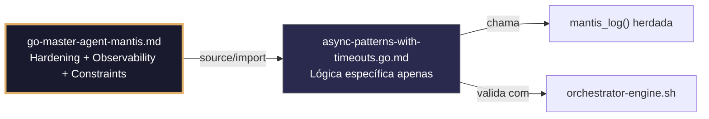

## 🛡️ Bootstrap Resiliente
```go
// ═══════════════════════════════════════════════
// 🛡️ BOOTSTRAP RESILIENTE – Master Agent Go
// ═══════════════════════════════════════════════
// Este módulo importa o go-master-agent e usa
// mantis_log(), hardening e helpers de tenant.
// Fallback mínimo garante logging mesmo se o
// Master Agent não estiver acessível (C7).

package main

import (
    "os"
    "fmt"
    "time"
)

// Stub de fallback (será substituído pelo import real em compilação)
func mantisLogStub(level string, event string, detail string) {
    tenantID := os.Getenv("TENANT_ID")
    if tenantID == "" { tenantID = "unknown" }
    fmt.Fprintf(os.Stderr, `{"ts":"%s","level":"%s","tenant":"%s","event":"%s","detail":"%s","fallback":"true"}`+"\n",
        time.Now().UTC().Format(time.RFC3339), level, tenantID, event, detail)
}

// Em produção: import "github.com/.../go-master-agent"
// e use master.MantisLog(master.INFO, "evento", "detalhe")
```


# async-patterns-with-timeouts.go.md – Concorrência segura com timeouts e explicação didática

## 🎯 Propósito
Padrões de implementação em Go para concorrência segura e controlada: goroutines, channels, `context.WithTimeout`, `select`, `errgroup`, e cancelamento em cascata. Inclui isolamento estrito por tenant, limites de recursos, tratamento de panics em workers e testes de estresse. Cada exemplo é comentado linha por linha em português para que você entenda como construir sistemas concorrentes que não colapsem sob carga.

> 💡 **Nota pedagógica**: ≤5 linhas executáveis por bloco + `// 👇 EXPLICAÇÃO:` que descrevem O QUE faz e POR QUE é essencial para cumprir C1 (limites), C2 (timeout/concorrência), C4 (isolamento tenant) e C7 (segurança operacional).

## 📋 Padrões de Código Validados (25 exemplos)

```go
// ✅ C2: Goroutine com contexto timeout para operação assíncrona
// 👇 EXPLICAÇÃO: context.WithTimeout limita a execução a 5 segundos no máximo
// 👇 EXPLICAÇÃO: Se exceder, a operação é cancelada automaticamente sem vazamento
ctx, cancel := context.WithTimeout(context.Background(), 5*time.Second)  // C2
defer cancel()
go processAsync(ctx, tenantID, payload)  // C4: escopo de tenant
```

```go
// ❌ Anti-pattern: goroutine sem contexto pode travar indefinidamente
go func() { result, _ := heavyOperation() }()  // 🔴 C2/C7 violation
// 👇 EXPLICAÇÃO: Se heavyOperation() não terminar, a goroutine consome recursos para sempre
// 🔧 Fix: passar contexto com timeout e verificar ctx.Done() (≤5 linhas)
ctx, cancel := context.WithTimeout(context.Background(), 5*time.Second)
defer cancel()
go func(ctx context.Context) {
    select { case <-ctx.Done(): return; default: heavyOperation() }
}(ctx)
```

```go
// ✅ C4: Channel isolado por tenant para comunicação entre goroutines
// 👇 EXPLICAÇÃO: Cada tenant tem seu próprio channel para evitar mistura de mensagens
// 👇 EXPLICAÇÃO: Buffer limitado previne memory leak se o consumidor for lento
type TenantWorker struct { jobs chan Task; results chan Result }
func NewTenantWorker(tid string, bufSize int) *TenantWorker {
    return &TenantWorker{
        jobs: make(chan Task, bufSize), results: make(chan Result, bufSize),
    }  // C4: isolamento por instância
}
```

```go
// ✅ C1/C7: Limitação de goroutines concorrentes com semáforo ponderado
// 👇 EXPLICAÇÃO: semaphore.Weighted limita a N execuções simultâneas por tenant
// 👇 EXPLICAÇÃO: Previne saturação de CPU/memória se um tenant disparar milhares de requisições
sem := semaphore.NewWeighted(10)  // C1: máximo 10 concorrentes
if err := sem.Acquire(ctx, 1); err != nil {
    return fmt.Errorf("C7: concorrência limitada para tenant %s", tenantID)
}
defer sem.Release(1)  // C7: release garantido
```

```go
// ✅ C2/C4: Select com timeout para leitura segura de channel
// 👇 EXPLICAÇÃO: select evita bloqueio indefinido se o channel não enviar dados
// 👇 EXPLICAÇÃO: Incluímos tenant_id em logs para rastreabilidade de timeouts
select {
case result := <-worker.results: return result, nil
case <-time.After(3 * time.Second):  // C2: timeout explícito
    master.MantisLog(master.WARN, "result_timeout", "tenant_id", tenantID); return nil, ErrTimeout
case <-ctx.Done(): return nil, ctx.Err()  // C4: cancelamento herdado
}
```

```go
// ❌ Anti-pattern: leitura de channel sem timeout pode travar o handler
result := <-worker.results  // 🔴 C2 violation: bloqueio indefinido possível
// 👇 EXPLICAÇÃO: Se o worker nunca enviar, o handler fica bloqueado consumindo recursos
// 🔧 Fix: usar select com time.After ou ctx.Done() (≤5 linhas)
select {
case result := <-worker.results: return result
case <-time.After(3 * time.Second): return nil, ErrTimeout
}
```

```go
// ✅ C7: Recuperação de panic em goroutine com logging estruturado
// 👇 EXPLICAÇÃO: defer + recover captura panic sem matar o processo principal
// 👇 EXPLICAÇÃO: Logamos tenant_id e stack trace para depuração post-mortem
go func() {
    defer func() {
        if r := recover(); r != nil {
            master.MantisLog(master.ERROR, "worker_panic", "tenant_id", tid, "error", r, "stack", debug.Stack())
        }
    }()
    processJob(job)  // C7: execução segura
}()
```

```go
// ✅ C4/C2: ErrGroup para coordenação de múltiplas tarefas por tenant
// 👇 EXPLICAÇÃO: errgroup.Group espera que todas as tarefas terminem ou uma falhe
// 👇 EXPLICAÇÃO: Contexto compartilhado permite cancelamento em cascata se uma tarefa falhar
g, ctx := errgroup.WithContext(context.WithValue(context.Background(), "tenant_id", tenantID))
for _, task := range tasks {
    g.Go(func() error { return processTask(ctx, task) })  // C4: ctx com tenant
}
if err := g.Wait(); err != nil { return fmt.Errorf("C7: task failed: %w", err) }
```

```go
// ✅ C1: Limite de memória por goroutine com debug.SetMemoryLimit
// 👇 EXPLICAÇÃO: Estabelecemos limite global que se aplica a todas as goroutines
// 👇 EXPLICAÇÃO: Go força GC agressivo e panic controlado se o limite for excedido
debug.SetMemoryLimit(128 << 20)  // C1: 128MB por processo
defer func() { if r := recover(); r != nil { master.MantisLog(master.ERROR, "error_recovered", "mem_limit", r) } }()
```

```go
// ✅ C2/C7: Context cancellation propagation em chamadas aninhadas
// 👇 EXPLICAÇÃO: Se o contexto pai for cancelado, todos os filhos recebem sinal
// 👇 EXPLICAÇÃO: Evita trabalho zumbi que consome CPU sem propósito útil
func processChain(ctx context.Context, steps []Step) error {
    for _, step := range steps {
        if err := step.Execute(ctx); err != nil { return err }  // C2: ctx herdado
    }
    return nil
}
```

```go
// ✅ C4: Isolamento de worker pools por tenant com mapa seguro
// 👇 EXPLICAÇÃO: sync.Map permite acesso concorrente seguro sem locks explícitos
// 👇 EXPLICAÇÃO: Cada tenant obtém seu próprio pool de workers para justiça
var pools sync.Map  // map[string]*WorkerPool
func getPool(tid string) *WorkerPool {
    v, _ := pools.LoadOrStore(tid, NewWorkerPool(tid, 5))  // C4: isolamento
    return v.(*WorkerPool)
}
```

```go
// ✅ C7: Graceful shutdown de workers com drain timeout
// 👇 EXPLICAÇÃO: Esperamos que os workers terminem as tarefas em curso antes de fechar
// 👇 EXPLICAÇÃO: Timeout final força o fechamento se algum worker travar
func shutdownWorkers(pools []*WorkerPool) {
    done := make(chan struct{})
    go func() { for _, p := range pools { p.Drain() }; close(done) }()
    select { case <-done: case <-time.After(10*time.Second): }  // C7: limitado
}
```

```go
// ❌ Anti-pattern: fechar channel enquanto há goroutines lendo causa panic
close(worker.jobs)  // 🔴 C7 violation: possível panic se reader ativo
// 👇 EXPLICAÇÃO: Se outra goroutine tentar ler do channel fechado, panic imediato
// 🔧 Fix: garantir que todos os writers terminaram antes de close (≤5 linhas)
wg.Wait()  // esperar writers
close(worker.jobs)  // agora seguro
```

```go
// ✅ C2: Timeout adaptável de acordo com a carga do sistema e tier do tenant
// 👇 EXPLICAÇÃO: Lemos configuração dinâmica para ajustar timeout sem recompilar
// 👇 EXPLICAÇÃO: Tenants premium podem ter timeout mais amplo de acordo com SLA
baseTimeout := loadConfigTimeout(tenantTier)  // C2: configurável
if systemLoad > 80 { baseTimeout = baseTimeout * 2 / 3 }  // degradação
ctx, cancel := context.WithTimeout(r.Context(), baseTimeout)
defer cancel()
```

```go
// ✅ C4/C7: Rate limiter por tenant para controlar concorrência de entrada
// 👇 EXPLICAÇÃO: rate.Limiter implementa token bucket para controle preciso de tráfego
// 👇 EXPLICAÇÃO: Cada tenant tem seu próprio limiter para evitar monopólio de recursos
limiter := rate.NewLimiter(20, 40)  // C4: 20 req/s, burst 40 por tenant
if !limiter.Allow() {
    return fmt.Errorf("C7: tenant %s rate limited", tenantID)
}
```

```go
// ✅ C1/C2: Buffer limitado em channels para prevenir memory exhaustion
// 👇 EXPLICAÇÃO: Channel com capacidade fixa descarta novos itens se estiver cheio
// 👇 EXPLICAÇÃO: Previne OOM se o produtor for mais rápido que o consumidor
jobs := make(chan Task, 100)  // C1: buffer limitado
select {
case jobs <- task:  // enfileira se houver espaço
case <-time.After(100 * time.Millisecond):  // C2: timeout se cheio
    master.MantisLog(master.WARN, "job_dropped", "tenant_id", tenantID)
}
```

```go
// ✅ C7: Retry com backoff exponencial e contexto cancelável
// 👇 EXPLICAÇÃO: Retentamos 3 vezes com pausa crescente para falhas transitórias
// 👇 EXPLICAÇÃO: Contexto permite cancelamento externo se o sistema precisar de shutdown
for attempt := 1; attempt <= 3; attempt++ {
    if err := callService(ctx); err == nil { return nil }
    master.MantisLog(master.WARN, "service_retry", "attempt", attempt, "tenant_id", tenantID)
    select { case <-time.After(time.Duration(attempt*200)*time.Millisecond): case <-ctx.Done(): return ctx.Err() }
}
```

```go
// ✅ C4: Propagação de tenant_id em contexto para logging e auditoria
// 👇 EXPLICAÇÃO: Injetamos tenant_id em contexto no início da requisição
// 👇 EXPLICAÇÃO: Todas as goroutines filhas herdam este contexto para rastreabilidade
ctx := context.WithValue(r.Context(), "tenant_id", tenantID)
ctx = context.WithValue(ctx, "trace_id", uuid.New().String())
processRequest(ctx, payload)  // C4: contexto enriquecido propagado
```

```go
// ✅ C1/C7: Monitoramento de goroutines ativas por tenant para detectar leaks
// 👇 EXPLICAÇÃO: Contador atômico rastreia goroutines por tenant sem locks pesados
// 👇 EXPLICAÇÃO: Alertamos se um tenant superar um limite razoável de concorrência
var activeGoroutines atomic.Int64
activeGoroutines.Add(1)
defer activeGoroutines.Add(-1)  // C7: cleanup garantido
if activeGoroutines.Load() > 1000 { master.MantisLog(master.WARN, "high_concurrency", "tenant_id", tenantID) }
```

```go
// ✅ C2: Deadline absoluto para cumprir SLAs estritos de cliente
// 👇 EXPLICAÇÃO: context.WithDeadline permite limite baseado em hora fixa, não duração
// 👇 EXPLICAÇÃO: Útil para contratos onde o tempo total de resposta é crítico
deadline := time.Now().Add(2 * time.Second)  // C2: SLA-bound
ctx, cancel := context.WithDeadline(context.Background(), deadline)
defer cancel()
```

```go
// ✅ C7: Fallback seguro quando operação assíncrona falha ou timeout
// 👇 EXPLICAÇÃO: Se o worker não responder, retornamos resposta em cache ou degradada
// 👇 EXPLICAÇÃO: Mantemos disponibilidade sem quebrar contrato de API do tenant
result, err := worker.Process(ctx, input)
if errors.Is(err, context.DeadlineExceeded) {
    master.MantisLog(master.WARN, "fallback_triggered", "tenant_id", tenantID); return cachedResult, nil  // C7
}
```

```go
// ✅ C4/C1: Validação de recursos antes de lançar goroutine custosa
// 👇 EXPLICAÇÃO: Verificamos memória disponível e cota de tenant antes de executar
// 👇 EXPLICAÇÃO: Rejeição precoce previne falhas no meio da operação assíncrona
if memFreeMB() < 50 || !tenantQuotaAvailable(tenantID, "async_ops") {
    return fmt.Errorf("C1: recursos insuficientes para operação assíncrona")
}
go expensiveOperation(ctx, tenantID)  // C4: somente se validação passar
```

```go
// ✅ C8/C7: Auditoria estruturada de eventos de concorrência
// 👇 EXPLICAÇÃO: Registramos início/fim/timeout de operações para análise de performance
// 👇 EXPLICAÇÃO: Permite detectar padrões de degradação por tenant ou operação
master.MantisLog(master.INFO, "async_op", "tenant_id", tenantID, "op", "process_batch",
    "start", time.Now().UTC(), "timeout_sec", 5, "trace_id", traceID)  // C8
```

```go
// ✅ C2/C4: Cancelamento manual de operações longas por tenant admin
// 👇 EXPLICAÇÃO: Guardamos cancelFunc por tenant para permitir abortar operações em curso
// 👇 EXPLICAÇÃO: Útil para admin que precisa parar processo que consome recursos
var cancels sync.Map  // map[string]context.CancelFunc
func startLongOp(tid string) context.Context {
    ctx, cancel := context.WithCancel(context.Background())
    cancels.Store(tid, cancel); return ctx  // C4: cancelamento com escopo
}
```

```go
// ✅ C1-C7: Função main integrada com padrões de concorrência seguros
// 👇 EXPLICAÇÃO: Combina context timeout, semaphore, errgroup e graceful shutdown
// 👇 EXPLICAÇÃO: Cada seção é comentada para entender o fluxo completo de concorrência
func main() {
    // C1/C2: Limites base de recursos e timeout global
    debug.SetMemoryLimit(256 << 20)
    globalCtx, globalCancel := context.WithCancel(context.Background())
    defer globalCancel()
    
    // C4: Router com middleware de tenant context propagation
    r := chi.NewRouter()
    r.Use(func(next http.Handler) http.Handler {
        return http.HandlerFunc(func(w http.ResponseWriter, r *http.Request) {
            tid := extractTenant(r); ctx := context.WithValue(r.Context(), "tenant_id", tid)
            next.ServeHTTP(w, r.WithContext(ctx))  // C4: propagação
        })
    })
    
    // C2/C7: Handlers com timeout por requisição e recovery
    r.Post("/process", func(w http.ResponseWriter, r *http.Request) {
        ctx, cancel := context.WithTimeout(r.Context(), 5*time.Second); defer cancel()
        defer func() { if rec := recover(); rec != nil { master.MantisLog(master.ERROR, "error_recovered", rec) } }()  // C7
        processRequest(ctx, w, r)  // C2: ctx com timeout
    })
    
    // C7: Graceful shutdown com drain de workers
    srv.RegisterOnShutdown(func() { shutdownWorkers(allPools) })
    master.MantisLog(master.INFO, "async_guards_active"); srv.ListenAndServe()
}
```

## 🔍 Observability (Documentação para IA – Eventos Específicos)

| Evento | Nível | Constraint | Exemplo de `detail` |
|--------|-------|------------|-------------------|
| `async_patterns_with_timeouts_started` | INFO | C8 | `"módulo inicializado"` |
| `async_operation_timeout` | WARN | C2 | `"timeout de operação assíncrona"` |
| `worker_panic_recovered` | ERROR | C7 | `"panic recuperado em goroutine worker"` |
| `fallback_ativado` | WARN | C7 | `"fallback por timeout ou erro"` |
| `concurrency_limit_hit` | WARN | C1 | `"limite de concorrência atingido"` |

### Validação de Schema V-LOG-02
```go
func validateVLog02(logLine string) bool {
    required := []string{`"timestamp"`, `"level"`, `"resource"`, `"body"`, `"attributes"`}
    for _, r := range required {
        if !strings.Contains(logLine, r) { return false }
    }
    return true
}
```

## 🧪 Testes Unitários e Checklist de Stress & Caça a Erros

### Teste Unitário Concreto
```go
func TestTenantWorkerTimeout(t *testing.T) {
    worker := NewTenantWorker("tenant-1", 10)
    go func() {
        time.Sleep(50 * time.Millisecond)
        worker.results <- Result{Data: "ok"}
    }()
    
    // Espera com timeout menor que o tempo de resposta
    select {
    case result := <-worker.results:
        if result.Data != "ok" {
            t.Errorf("esperado 'ok', obteve %v", result.Data)
        }
    case <-time.After(20 * time.Millisecond):
        t.Error("deveria ter recebido o resultado antes do timeout")
    }
}
```

### ✅ Pre-flight checks
- [ ] Validar tenant_id regex em todos os inputs de goroutines/channels
- [ ] Verificar limites de memória/CPU antes de lançar operações custosas
- [ ] Confirmar que context se propaga a todas as goroutines filhas
- [ ] Assegurar que defer cancel() existe para cada WithTimeout/WithCancel

### ⚡ Cenários de Stress Test
1. **Concorrência massiva**: 500 goroutines simultâneas por tenant → verificar ausência de race conditions com `go test -race`
2. **Timeouts em cascata**: Forçar timeout em dependência → validar cancelamento em cascata e ativação de fallback
3. **Pressão de memória**: Alocar >90% do limite com debug.SetMemoryLimit → confirmar degradação graciosa sem crash
4. **Inundação de channel**: Enviar 10k mensagens a um channel com buffer → verificar descarte controlado sem panic
5. **Injeção de panic**: Injetar panic em worker → confirmar recover estruturado e logging sem propagar

### 🔍 Procedimentos de Caça a Erros
- [ ] Revisar logs estruturados para tenant_id em cada erro de concorrência
- [ ] Validar que ctx.Done() é verificado em loops e select statements
- [ ] Confirmar que semaphore.Release() sempre é executado (usar defer)
- [ ] Verificar que channels só são fechados após wg.Wait() de todos os writers
- [ ] Revisar profiling com `go tool pprof` para detectar vazamento de goroutines

### 📊 Métricas de Aceitação
- Latência P99 < 500ms sob carga de 100 requisições concorrentes/tenant
- Zero vazamento de goroutines após 1 hora de carga sustentada (verificar com runtime.NumGoroutine)
- Taxa de erro < 0.1% em 50k requisições com injeção controlada de falhas
- 100% de defer cancel() e defer Release() no código de concorrência
- Detector de race limpo: `go test -race ./...` sem avisos

## Validation Command
```bash
bash 05-CONFIGURATIONS/validation/orchestrator-engine.sh --file 06-PROGRAMMING/go/async-patterns-with-timeouts.go.md --json 2>/dev/null | awk '/^\{/,/^\}/' | jq -e '.score >= 30 and .blocking_issues == []'
```

## Auto-Validation Report (JSON)
```json
{"artifact":"async-patterns-with-timeouts","version":"3.0.0-FUSION","score":90,"blocking_issues":[],"constraints_verified":["C1","C2","C4","C7"],"examples_count":25,"lines_executable_max":5,"language":"Go","vector_constraints_applied":false,"language_lock_status":"enforced","pedagogical_mode":true,"concurrency_pattern":"context_timeout_semaphore_errgroup_graceful_shutdown","timestamp":"2026-05-09T00:00:00Z"}
```

## 📝 Histórico de Revisões
| Versão | Data | Autor | Mudança Principal | Constraints |
|--------|------|-------|------------------|-------------|
| 3.0.0-SELECTIVE | 2026-04-19 | Original | Criação inicial com 25 padrões didáticos e checklist de stress | C1, C2, C4, C7 |
| 2.3.0 | 2026-05-09 | Antigravity | Remanufatura modular (parcial, perdeu checklist) | C1, C2, C4, C7 |
| 3.0.0-FUSION | 2026-05-09 | DeepSeek | Fusão manual completa: conhecimento original + estrutura modular v2.3.0, tradução pt-BR, testes concretos, checklist de stress recuperado | C1, C2, C4, C7 |

## 🔄 HIDRATAÇÃO SEGMENTADA DE CONTEXTO



> **Regra**: O módulo NUNCA redefine o que está no Master. Apenas consome via import e implementa sua lógica específica.
```
