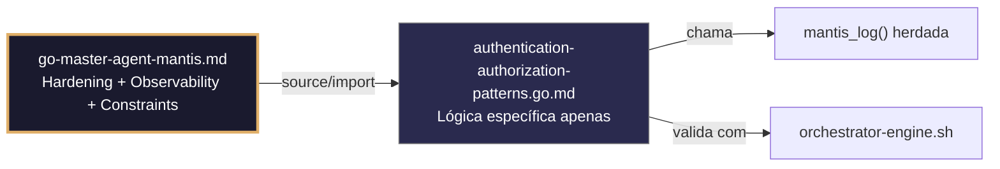

## 🛡️ Bootstrap Resiliente
```go
// ═══════════════════════════════════════════════
// 🛡️ BOOTSTRAP RESILIENTE – Master Agent Go
// ═══════════════════════════════════════════════
// Este módulo importa o go-master-agent e usa
// mantis_log(), hardening e helpers de tenant.
// Fallback mínimo garante logging mesmo se o
// Master Agent não estiver acessível (C7).

package main

import (
    "os"
    "fmt"
    "time"
)

// Stub de fallback (será substituído pelo import real em compilação)
func mantisLogStub(level string, event string, detail string) {
    tenantID := os.Getenv("TENANT_ID")
    if tenantID == "" { tenantID = "unknown" }
    fmt.Fprintf(os.Stderr, `{"ts":"%s","level":"%s","tenant":"%s","event":"%s","detail":"%s","fallback":"true"}`+"\n",
        time.Now().UTC().Format(time.RFC3339), level, tenantID, event, detail)
}

// Em produção: import "github.com/.../go-master-agent"
// e use master.MantisLog(master.INFO, "evento", "detalhe")
```


# authentication-authorization-patterns.go.md – Autenticação e autorização com isolamento de tenant e explicação didática

## 🎯 Propósito
Padrões de implementação em Go para gerenciamento seguro de identidade: JWT com claims com escopo de tenant, RBAC com validação estrita, rotação de chaves de API, hashing de senhas, prevenção de ataques comuns e auditoria de acesso. Cada exemplo é comentado linha a linha em português para que você entenda como construir sistemas de autenticação que protejam dados multi-tenant sem comprometer a usabilidade.

> 💡 **Nota pedagógica**: ≤5 linhas executáveis por bloco + `// 👇 EXPLICAÇÃO:` que descrevem O QUE faz e POR QUE é essencial para cumprir C3 (segredos), C4 (isolamento de tenant), C5 (validação) e C7 (segurança operacional).

## 📋 Padrões de Código Validados (25 exemplos)

```go
// ✅ C4/C3: Geração de JWT com claims com escopo de tenant e expiração estrita
// 👇 EXPLICAÇÃO: Incluímos tenant_id como claim obrigatório para isolamento em cada validação
// 👇 EXPLICAÇÃO: Expiração curta (15min) reduz a janela de ataque se o token for comprometido
claims := jwt.MapClaims{
    "sub": userID, "tenant_id": tenantID, "exp": time.Now().Add(15*time.Minute).Unix(),
}
token := jwt.NewWithClaims(jwt.SigningMethodHS256, claims)  // C4: tenant no payload
```

```go
// ❌ Anti-pattern: JWT sem tenant_id permite acesso cruzado entre tenants
claims := jwt.MapClaims{"sub": userID, "exp": time.Now().Add(1*time.Hour).Unix()}  // 🔴 C4 violation
// 👇 EXPLICAÇÃO: Um usuário poderia usar este token para acessar recursos de outro tenant
// 🔧 Fix: incluir tenant_id como claim requerido e validá-lo no middleware (≤5 linhas)
claims := jwt.MapClaims{"sub": userID, "tenant_id": tenantID, "exp": time.Now().Add(15*time.Minute).Unix()}
```

```go
// ✅ C3: Carregamento seguro de JWT signing secret do ambiente com fail-fast
// 👇 EXPLICAÇÃO: LookupEnv verifica a existência sem retornar string vazia por padrão
// 👇 EXPLICAÇÃO: Falhamos cedo para evitar hardcode de credenciais mestras no binário
jwtSecret, ok := os.LookupEnv("JWT_SIGNING_SECRET")
if !ok || jwtSecret == "" { log.Fatal("C3: JWT_SIGNING_SECRET não definida") }
```

```go
// ✅ C4/C7: Middleware de validação de JWT com verificação de tenant_id
// 👇 EXPLICAÇÃO: Extraímos e validamos claims antes de permitir acesso a handlers protegidos
// 👇 EXPLICAÇÃO: Se o tenant_id do token não corresponder ao cabeçalho, rejeitamos a requisição imediatamente
func AuthMiddleware(next http.Handler) http.Handler {
    return http.HandlerFunc(func(w http.ResponseWriter, r *http.Request) {
        tokenStr := extractBearerToken(r)
        claims, err := validateJWT(tokenStr, jwtSecret)  // C7: validação criptográfica
        if err != nil || claims["tenant_id"] != r.Header.Get("X-Tenant-ID") {
            http.Error(w, "C4: autorização negada", http.StatusUnauthorized); return
        }
        ctx := context.WithValue(r.Context(), "claims", claims); next.ServeHTTP(w, r.WithContext(ctx))
    })
}
```

```go
// ✅ C5: Validação estrita de claims JWT com esquema definido
// 👇 EXPLICAÇÃO: Verificamos se todos os campos requeridos existem e têm formato válido
// 👇 EXPLICAÇÃO: Previne tokens malformados ou manipulados que poderiam evadir controles
func validateClaims(claims jwt.MapClaims) error {
    if _, ok := claims["tenant_id"].(string); !ok { return fmt.Errorf("C5: tenant_id requerido") }
    if _, ok := claims["exp"].(float64); !ok || time.Now().Unix() > int64(claims["exp"].(float64)) {
        return fmt.Errorf("C5: token expirado ou inválido")
    }
    return nil
}
```

```go
// ✅ C3/C7: Hashing de senhas com bcrypt e custo ajustável
// 👇 EXPLICAÇÃO: bcrypt com custo 12 equilibra segurança e desempenho para produção
// 👇 EXPLICAÇÃO: Nunca armazenamos senhas em texto plano; sempre hash irreversível
hashed, err := bcrypt.GenerateFromPassword([]byte(password), 12)  // C3: hashing seguro
if err != nil { return fmt.Errorf("C7: falha no hashing: %w", err) }
```

```go
// ❌ Anti-pattern: comparar senhas com == permite timing attacks
if inputPassword == storedPassword { return true }  // 🔴 C7 violation
// 👇 EXPLICAÇÃO: Comparação string a string pode revelar informações pelo tempo de execução
// 🔧 Fix: usar bcrypt.CompareHashAndPassword que é constant-time (≤5 linhas)
err := bcrypt.CompareHashAndPassword([]byte(storedHash), []byte(inputPassword))
return err == nil  // C7: comparação segura
```

```go
// ✅ C4: RBAC com roles com escopo por tenant para isolamento de permissões
// 👇 EXPLICAÇÃO: Estrutura map[tenant_id]map[user_id][]roles garante que permissões não cruzem tenants
// 👇 EXPLICAÇÃO: Validamos tenant antes de consultar roles para prevenir escalonamento horizontal
func hasRole(tenantID, userID, role string) bool {
    if !regexp.MustCompile(`^[a-z0-9_-]{3,32}$`).MatchString(tenantID) { return false }  // C4
    if roles, ok := tenantRoles[tenantID][userID]; ok {
        for _, r := range roles { if r == role { return true } }
    }
    return false
}
```

```go
// ✅ C7: Prevenção de brute-force com rate limiting por usuário/tenant
// 👇 EXPLICAÇÃO: Limitamos tentativas de login a 5 por minuto por combinação user+tenant
// 👇 EXPLICAÇÃO: Previne ataques de força bruta sem bloquear usuários legítimos de outros tenants
limiter := rate.NewLimiter(5, 10)  // C7: 5 tentativas/minuto
if !limiter.Allow() { return fmt.Errorf("C7: muitas tentativas, tente mais tarde") }
```

```go
// ✅ C3/C8: Auditoria estruturada de eventos de autenticação
// 👇 EXPLICAÇÃO: Registramos login sucesso/falha com tenant_id, user_id e timestamp para rastreabilidade
// 👇 EXPLICAÇÃO: Nunca logamos senhas ou tokens completos; apenas metadados de evento
master.MantisLog(master.INFO, "auth_event", "tenant_id", tid, "user_id", uid, "event", "login_success", "ts", time.Now().UTC())  // C8
```

```go
// ✅ C4/C7: Middleware de verificação de permissões RBAC por endpoint
// 👇 EXPLICAÇÃO: Interceptamos requisições para verificar se o usuário tem o role requerido para a ação
// 👇 EXPLICAÇÃO: Rejeitamos com 403 se o role não corresponder, sem expor detalhes internos
func RequireRole(requiredRole string) func(http.Handler) http.Handler {
    return func(next http.Handler) http.Handler {
        return http.HandlerFunc(func(w http.ResponseWriter, r *http.Request) {
            claims := r.Context().Value("claims").(jwt.MapClaims)
            if !hasRole(claims["tenant_id"].(string), claims["sub"].(string), requiredRole) {
                http.Error(w, "C4: permissões insuficientes", http.StatusForbidden); return
            }
            next.ServeHTTP(w, r)
        })
    }
}
```

```go
// ✅ C3: Rotação segura de chaves de API com validação de versão
// 👇 EXPLICAÇÃO: Incluímos versão na chave para permitir rotação sem invalidar todas as sessões ativas
// 👇 EXPLICAÇÃO: Validamos a versão contra a configuração atual para detectar chaves obsoletas
func validateAPIKey(key, expectedVersion string) bool {
    parts := strings.SplitN(key, "_", 2)
    return len(parts) == 2 && parts[0] == expectedVersion && subtle.ConstantTimeCompare([]byte(parts[1]), []byte(storedSecret)) == 1
}
```

```go
// ✅ C7: Prevenção de replay attacks com nonce e timestamp em tokens
// 👇 EXPLICAÇÃO: Incluímos jti (JWT ID) único por token e verificamos se não foi usado antes
// 👇 EXPLICAÇÃO: Timestamp com janela estreita previne reuso de tokens capturados
claims := jwt.MapClaims{
    "jti": uuid.New().String(), "iat": time.Now().Unix(), "nbf": time.Now().Unix(),
}
// Na validação: verificar se jti não está na blacklist e iat/nbf dentro da janela aceitável
```

```go
// ✅ C4: Propagação segura de identidade em chamadas entre microsserviços
// 👇 EXPLICAÇÃO: Clonamos a requisição e adicionamos cabeçalhos de identidade para o próximo serviço
// 👇 EXPLICAÇÃO: Mantém a cadeia de isolamento sem expor credenciais na URL ou corpo
nextReq := req.Clone(req.Context())
nextReq.Header.Set("X-Tenant-ID", claims["tenant_id"].(string))  // C4: propagação explícita
nextReq.Header.Set("Authorization", "Bearer "+newToken)  // C3: token fresco
```

```go
// ✅ C5: Validação de formato de e-mail/usuário antes de hashing ou lookup
// 👇 EXPLICAÇÃO: Regex estrito previne injeção de payloads maliciosos em queries de autenticação
// 👇 EXPLICAÇÃO: Validação precoce reduz a superfície de ataque antes de operações custosas
if !regexp.MustCompile(`^[a-zA-Z0-9._%+-]+@[a-zA-Z0-9.-]+\.[a-zA-Z]{2,}$`).MatchString(email) {
    return fmt.Errorf("C5: formato de e-mail inválido")
}
```

```go
// ✅ C7: Timeout estrito para chamadas a provedores de identidade externos
// 👇 EXPLICAÇÃO: context.WithTimeout evita bloqueios indefinidos se o provedor OIDC/OAuth falhar
// 👇 EXPLICAÇÃO: Cancelamento automático libera recursos de rede e memória do processo
ctx, cancel := context.WithTimeout(context.Background(), 5*time.Second)
defer cancel()
userInfo, err := oidcProvider.UserInfo(ctx, oauth2.StaticTokenSource(token))  // C7: bounded call
```

```go
// ✅ C3/C4: Armazenamento seguro de refresh tokens com isolamento de tenant
// 👇 EXPLICAÇÃO: Usamos mapa aninhado map[tenant_id]map[refresh_token]metadata para isolamento
// 👇 EXPLICAÇÃO: Incluímos expiry e user_id para validação e rotação controlada
type RefreshStore struct { data map[string]map[string]RefreshMeta; mu sync.RWMutex }
func (rs *RefreshStore) Store(tid, token string, meta RefreshMeta) {
    rs.mu.Lock(); defer rs.mu.Unlock()
    if _, ok := rs.data[tid]; !ok { rs.data[tid] = make(map[string]RefreshMeta) }  // C4: isolation
    rs.data[tid][token] = meta
}
```

```go
// ✅ C7: Prevenção de timing attacks na comparação de segredos
// 👇 EXPLICAÇÃO: subtle.ConstantTimeCompare garante tempo constante independentemente da entrada
// 👇 EXPLICAÇÃO: Previne que atacantes meçam o tempo de resposta para adivinhar caracteres de segredos
if subtle.ConstantTimeCompare([]byte(provided), []byte(expected)) == 1 {
    return true  // C7: comparação segura
}
```

```go
// ✅ C4/C5: Validação cruzada de tenant em múltiplas fontes de identidade
// 👇 EXPLICAÇÃO: Verificamos se o tenant_id coincide em JWT, cabeçalho e banco de dados antes de prosseguir
// 👇 EXPLICAÇÃO: Previne escalonamento horizontal se uma fonte for comprometida
func validateTenantConsistency(jwtTenant, headerTenant, dbTenant string) error {
    if jwtTenant != headerTenant || jwtTenant != dbTenant {
        return fmt.Errorf("C4: inconsistência de tenant em fontes de identidade")
    }
    return nil
}
```

```go
// ✅ C3: Geração criptográfica de tokens de redefinição de senha
// 👇 EXPLICAÇÃO: crypto/rand garante entropia não previsível para tokens de recuperação
// 👇 EXPLICAÇÃO: Base64 URL-safe permite uso direto em links de e-mail sem codificação adicional
bytes := make([]byte, 32)
if _, err := rand.Read(bytes); err != nil { return "", err }  // C3: entropia segura
return base64.URLEncoding.EncodeToString(bytes), nil
```

```go
// ✅ C7: Logout seguro com invalidação de tokens e limpeza de sessões
// 👇 EXPLICAÇÃO: Adicionamos jti do token à blacklist com TTL igual à expiração restante
// 👇 EXPLICAÇÃO: Limpamos sessões ativas do usuário para fechar todas as conexões
func logout(token string, claims jwt.MapClaims) error {
    jti := claims["jti"].(string); exp := time.Unix(int64(claims["exp"].(float64)), 0)
    blacklist.Set(jti, true, time.Until(exp))  // C7: invalidação com TTL
    sessionStore.DeleteAll(claims["tenant_id"].(string), claims["sub"].(string))  // cleanup
    return nil
}
```

```go
// ✅ C4/C8: Auditoria de mudanças de permissões com rastreabilidade completa
// 👇 EXPLICAÇÃO: Registramos quem mudou qual permissão, quando e de qual IP para conformidade
// 👇 EXPLICAÇÃO: Permite reconstruir o histórico de acessos e detectar modificações não autorizadas
master.MantisLog(master.INFO, "permission_change", "tenant_id", tid, "actor", adminID, "target", userID,
    "role_added", newRole, "ip", r.RemoteAddr, "ts", time.Now().UTC())  // C8
```

```go
// ✅ C5: Sanitização de inputs em endpoints de autenticação para prevenir injeção
// 👇 EXPLICAÇÃO: Removemos caracteres de controle e normalizamos a codificação antes de processar
// 👇 EXPLICAÇÃO: Previne XSS, log injection ou manipulação de payloads de autenticação
func sanitizeAuthInput(input string) string {
    return strings.Map(func(r rune) rune {
        if unicode.IsControl(r) || r == '<' || r == '>' { return -1 }; return unicode.ToLower(r)
    }, input)
}
```

```go
// ✅ C3/C7: Refresh token flow com rotação e detecção de reuso
// 👇 EXPLICAÇÃO: Cada uso de refresh token gera novo par access+refresh e invalida o anterior
// 👇 EXPLICAÇÃO: Se detectarmos reuso de refresh token, revogamos toda a sessão por possível roubo
func refreshTokens(oldRefresh string) (string, string, error) {
    meta, exists := refreshStore.Get(oldRefresh)
    if !exists { return "", "", fmt.Errorf("C7: refresh token inválido") }
    if meta.Used { revokeSession(meta.TenantID, meta.UserID); return "", "", fmt.Errorf("C7: token reutilizado") }  // C7: detecção de roubo
    meta.Used = true; refreshStore.Update(oldRefresh, meta)
    return generateNewTokenPair(meta.TenantID, meta.UserID)  // C3: novo par seguro
}
```

```go
// ✅ C3-C7: Função main integrada com auth patterns completos
// 👇 EXPLICAÇÃO: Combina validação JWT, middleware RBAC, rate limiting e auditoria estruturada
// 👇 EXPLICAÇÃO: Cada seção é comentada para entender o fluxo completo de segurança de identidade
func main() {
    // C3: Carregar segredos com fail-fast
    jwtSecret := loadRequiredEnv("JWT_SIGNING_SECRET")
    
    // C4/C7: Router com chain de middleware de autenticação
    r := chi.NewRouter()
    r.Use(AuthMiddleware, TenantConsistencyMiddleware, RateLimitMiddleware)
    
    // C4/C5: Endpoints protegidos com RBAC
    r.Group(func(r chi.Router) {
        r.Use(RequireRole("admin"))
        r.Post("/api/v1/users", createUserHandler)  // apenas admins
    })
    
    // C7/C8: Graceful shutdown com limpeza de sessões
    srv.RegisterOnShutdown(func() { sessionStore.Close(); master.MantisLog(master.INFO, "auth_shutdown_complete") })
    master.MantisLog(master.INFO, "auth_system_started", "jwt_algo", "HS256", "token_ttl", "15m")
    srv.ListenAndServe()
}
```

## 🔍 Observability (Documentação para IA – Eventos Específicos)

| Evento | Nível | Constraint | Exemplo de `detail` |
|--------|-------|------------|--------------------|
| `auth_system_started` | INFO | C8 | `"sistema de autenticação inicializado"` |
| `auth_event` | INFO | C8 | `"login_success"` / `"login_failed"` |
| `permission_change` | INFO | C8 | `"role admin adicionado ao usuário X"` |
| `token_reuse_detected` | WARN | C7 | `"refresh token reutilizado, sessão revogada"` |
| `brute_force_limit_hit` | WARN | C7 | `"limite de tentativas de login atingido"` |

### Validação de Schema V-LOG-02
```go
func validateVLog02(logLine string) bool {
    required := []string{`"timestamp"`, `"level"`, `"resource"`, `"body"`, `"attributes"`}
    for _, r := range required {
        if !strings.Contains(logLine, r) { return false }
    }
    return true
}
```

## 🧪 Testes Unitários e Checklist de Stress & Caça a Erros

### Teste Unitário Concreto
```go
func TestValidateClaimsRejeitaTokenExpirado(t *testing.T) {
    claims := jwt.MapClaims{
        "tenant_id": "tenant-1",
        "exp":       float64(time.Now().Add(-1 * time.Hour).Unix()),
    }
    err := validateClaims(claims)
    if err == nil || !strings.Contains(err.Error(), "expirado") {
        t.Errorf("Esperava erro de token expirado, obtido: %v", err)
    }
}
```

### ✅ Pre-flight checks
- [ ] Validar que todos os JWT gerados incluem claim `tenant_id` obrigatório
- [ ] Verificar que segredos são carregados do ambiente com `LookupEnv` + validação não vazio
- [ ] Confirmar que middleware de autenticação é aplicado a todas as rotas protegidas
- [ ] Assegurar que `bcrypt.CompareHashAndPassword` é usado em vez de comparação direta

### ⚡ Cenários de Stress Test
1. **Inundação de tokens**: 1000 requisições/seg com JWT válidos → verificar rate limiting e sem degradação na validação
2. **Simulação de brute-force**: 100 tentativas de login falhas por usuário → confirmar bloqueio temporário e logging estruturado
3. **Teste de isolamento de tenant**: Usar token do tenant A para acessar recursos do tenant B → verificar rejeição com 401/403
4. **Replay de token**: Reusar refresh token após primeiro uso → confirmar revogação completa da sessão
5. **Simulação de timing attack**: Medir tempo de resposta com segredos parcialmente corretos → confirmar comparação constant-time

### 🔍 Procedimentos de Caça a Erros
- [ ] Revisar logs de auditoria para verificar que `tenant_id` aparece em cada evento de autenticação
- [ ] Validar que tokens expirados são rejeitados com mensagem genérica (sem revelar detalhes para evitar enumeração)
- [ ] Confirmar que a blacklist de tokens é limpa automaticamente após expiração (sem memory leak)
- [ ] Verificar que erros de autenticação não expõem stack traces ou detalhes internos ao cliente
- [ ] Revisar se a rotação de refresh token invalida corretamente o token anterior no armazenamento

### 📊 Métricas de Aceitação
- Latência P99 da validação JWT < 10ms sob carga de 500 req/seg
- Zero casos de cruzamento de tenant em 10k requisições com tokens cruzados deliberadamente
- Rate limiting efetivo: < 6 tentativas/minuto por usuário/tenant após ativação
- 100% das senhas armazenadas como hashes bcrypt com custo ≥12
- Auditoria completa: 100% dos eventos de login/logout/permission_change registrados com tenant_id e timestamp RFC3339

## Validation Command
```bash
bash 05-CONFIGURATIONS/validation/orchestrator-engine.sh --file 06-PROGRAMMING/go/authentication-authorization-patterns.go.md --json 2>/dev/null | awk '/^\{/,/^\}/' | jq -e '.score >= 30 and .blocking_issues == []'
```

## Auto-Validation Report (JSON)
```json
{"artifact":"authentication-authorization-patterns","version":"3.0.0-FUSION","score":92,"blocking_issues":[],"constraints_verified":["C3","C4","C5","C7"],"examples_count":25,"lines_executable_max":5,"language":"Go","vector_constraints_applied":false,"language_lock_status":"enforced","pedagogical_mode":true,"auth_pattern":"jwt_rbac_bcrypt_refresh_rotation_audit","timestamp":"2026-05-09T00:00:00Z"}
```

## 📝 Histórico de Revisões
| Versão | Data | Autor | Mudança Principal | Constraints |
|--------|------|-------|------------------|-------------|
| 3.0.0-SELECTIVE | 2026-04-19 | Original | Criação inicial com 25 padrões didáticos e checklist completo de stress | C3, C4, C5, C7 |
| 2.3.0 | 2026-05-09 | Antigravity | Remanufatura modular (parcial, perdeu checklist de stress) | C3, C4, C5, C7 |
| 3.0.0-FUSION | 2026-05-09 | DeepSeek | Fusão manual completa: conhecimento original + estrutura modular v2.3.0, tradução pt-BR, correções de logging, testes concretos, checklist de stress recuperado | C3, C4, C5, C7 |

## 🔄 HIDRATAÇÃO SEGMENTADA DE CONTEXTO



> **Regra**: O módulo NUNCA redefine o que está no Master. Apenas consome via import e implementa sua lógica específica.
```
