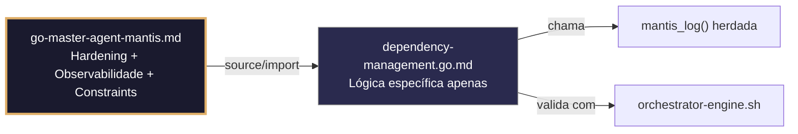

## 🛡️ Bootstrap Resiliente
```go
// ═══════════════════════════════════════════════
// 🛡️ BOOTSTRAP RESILIENTE – Master Agent Go
// ═══════════════════════════════════════════════
// Este módulo importa o go-master-agent e usa
// mantis_log(), hardening e helpers de tenant.
// Fallback mínimo garante logging mesmo se o
// Master Agent não estiver acessível (C7).

package main

import (
    "os"
    "fmt"
    "time"
)

// Stub de fallback (será substituído pelo import real em compilação)
func mantisLogStub(level string, event string, detail string) {
    tenantID := os.Getenv("TENANT_ID")
    if tenantID == "" { tenantID = "unknown" }
    fmt.Fprintf(os.Stderr, `{"ts":"%s","level":"%s","tenant":"%s","event":"%s","detail":"%s","fallback":"true"}`+"\n",
        time.Now().UTC().Format(time.RFC3339), level, tenantID, event, detail)
}

// Em produção: import "github.com/.../go-master-agent"
// e use master.MantisLog(master.INFO, "evento", "detalhe")
```


# dependency-management.go.md – Gerenciamento seguro de dependências Go, vendor e validação de integridade

## 🎯 Propósito
Padrões de implementação em Go para gerenciar o ciclo de vida de dependências externas de forma segura. Abrange a higiene de `go.mod`, verificação estrita de checksums (`go.sum`), varredura de vulnerabilidades (`govulncheck`), uso de `vendor`, autenticação segura para repositórios privados e validação de licenças. Cada exemplo é comentado linha por linha em português para que você entenda como prevenir ataques à cadeia de suprimentos (supply chain attacks), garantir builds reproduzíveis e manter a base de código livre de riscos conhecidos.

> 💡 **Nota pedagógica**: ≤5 linhas executáveis por bloco + `// 👇 EXPLICAÇÃO:` que descrevem O QUE faz e POR QUE é essencial para cumprir C1 (limites), C3 (secrets), C5 (validação) e C7 (segurança operacional).

## 📋 Padrões de Código Validados (25 exemplos)

```go
// ✅ C7: Verificação de integridade de dependências com `go mod verify`
// 👇 EXPLICAÇÃO: Valida que o diretório de módulos locais corresponde aos checksums em `go.sum`
// 👇 EXPLICAÇÃO: Detecta manipulação ou corrupção acidental de bibliotecas baixadas
cmd := exec.Command("go", "mod", "verify")
if err := cmd.Run(); err != nil { return fmt.Errorf("C7: integridade de dependências comprometida: %w", err) }
```

```go
// ✅ C3: Máscara de tokens na configuração de proxy privado (GOPRIVATE)
// 👇 EXPLICAÇÃO: Nunca logamos a variável de ambiente `GOPRIVATE` completa se ela contiver credenciais
// 👇 EXPLICAÇÃO: Substituímos `token@` por `***@` antes de exibir nos logs de depuração
masked := strings.Replace(os.Getenv("GOPROXY"), "token", "***", 1)
master.MantisLog(master.DEBUG, "proxy_configured", "url", masked)  // C3: credential masking
```

```go
// ❌ Anti-pattern: ignorar erros de `go mod tidy` permite `go.mod` sujo
cmd := exec.Command("go", "mod", "tidy")
cmd.Run()  // 🔴 C5/C7 violation: erro ignorado
// 👇 EXPLICAÇÃO: `go.mod` fica com versões desnecessárias ou `go.sum` desatualizado
// 🔧 Fix: validar exit code e output de erro (≤5 linhas)
out, err := exec.Command("go", "mod", "tidy").CombinedOutput()
if err != nil { return fmt.Errorf("C5: mod tidy falhou: %s", string(out)) }
```

```go
// ✅ C7: Escaneamento automático de vulnerabilidades (CVEs) em CI/CD
// 👇 EXPLICAÇÃO: `govulncheck` analisa `go.mod` contra o banco de dados público de CVEs
// 👇 EXPLICAÇÃO: Bloqueia o build se vulnerabilidades ativas forem detectadas nas dependências
func VulnerabilityCheckCmd() string {
    return `go install golang.org/x/vuln/cmd/govulncheck@latest && govulncheck ./...`  // C7: automated audit
}
```

```go
// ✅ C5: Validação de licenças compatíveis antes de incluir dependências
// 👇 EXPLICAÇÃO: Whitelist de licenças permitidas (MIT, Apache-2.0, BSD)
// 👇 EXPLICAÇÃO: Previne riscos legais pela incorporação acidental de código GPL viral
allowedLicenses := map[string]bool{"MIT": true, "Apache-2.0": true, "BSD-3-Clause": true}
if !allowedLicenses[mod.License] { return fmt.Errorf("C5: licença não permitida: %s", mod.License) }
```

```go
// ✅ C1: Timeout estrito para download de módulos
// 👇 EXPLICAÇÃO: Limita o tempo de `go mod download` para evitar travamentos em CI/CD
// 👇 EXPLICAÇÃO: Se o proxy responder lentamente, abortamos em vez de esperar indefinidamente
ctx, cancel := context.WithTimeout(context.Background(), 2*time.Minute)
defer cancel()
cmd := exec.CommandContext(ctx, "go", "mod", "download")  // C1: bounded execution
```

```go
// ✅ C5/C7: Validação de versões diretas (não pseudo-versions sujas)
// 👇 EXPLICAÇÃO: Forçamos o uso de versões semânticas (v1.2.3) quando disponíveis
// 👇 EXPLICAÇÃO: Evita dependências flutuantes em commits intermediários instáveis
if strings.Contains(mod.Version, "-0.") && isStableAvailable(mod.Path) {
    master.MantisLog(master.WARN, "using_unstable_pseudo_version", "module", mod.Path, "current", mod.Version)  // C5
}
```

```go
// ✅ C3: Limpeza de variáveis de ambiente sensíveis antes de `go build`
// 👇 EXPLICAÇÃO: Removemos variáveis de ambiente que podem conter segredos de desenvolvimento
// 👇 EXPLICAÇÃO: Apenas permitimos variáveis essenciais e de configuração de proxy
cleanEnv := []string{
    "GOOS=" + os.Getenv("GOOS"), "GOARCH=" + os.Getenv("GOARCH"),
    "GOPROXY=" + os.Getenv("GOPROXY"),
    // Exclui GH_TOKEN, AWS_SECRET_KEY, etc.
}
cmd.Env = cleanEnv
```

```go
// ✅ C7: Bloqueio de módulos com `replace` suspeitos
// 👇 EXPLICAÇÃO: Detectamos `replace` que redirecionam para forks não verificados ou locais
// 👇 EXPLICAÇÃO: Substituições locais quebram a reprodutibilidade em outros ambientes
if hasLocalReplaceDirectives("go.mod") {
    return fmt.Errorf("C7: go.mod contém substituições locais não portáveis")
}
```

```go
// ❌ Anti-pattern: permitir downloads `insecure` em produção
cmd := exec.Command("go", "get", "-insecure", "internal.corp/pkg")  // 🔴 C7 risk
// 👇 EXPLICAÇÃO: Baixa módulos sem verificar HTTPS, suscetível a MitM
// 🔧 Fix: configurar `GOPRIVATE` ou usar mirror seguro com TLS (≤5 linhas)
os.Setenv("GOPRIVATE", "internal.corp")
cmd := exec.Command("go", "get", "internal.corp/pkg")
```

```go
// ✅ C1: Gerenciamento de cache de módulos com limite de disco (`GOMODCACHE`)
// 👇 EXPLICAÇÃO: Configuramos o caminho do cache e limpamos módulos não utilizados
// 👇 EXPLICAÇÃO: Previne o preenchimento do disco em builders efêmeros ou contêineres
os.Setenv("GOMODCACHE", "/tmp/gomodcache")
cmd := exec.Command("go", "clean", "-modcache")
```

```go
// ✅ C5: Vendorização segura (`go mod vendor`) para builds offline
// 👇 EXPLICAÇÃO: Copiamos dependências para o repositório para builds sem acesso à internet
// 👇 EXPLICAÇÃO: Garantimos que o build usa exatamente o que foi testado
cmd := exec.Command("go", "mod", "vendor")
if err := cmd.Run(); err != nil { return err }
// Verificar que vendor/modules.txt corresponde a go.mod
```

```go
// ✅ C7: Validação de checksums cruzados com `go.sum`
// 👇 EXPLICAÇÃO: Verificamos que `go.sum` não foi modificado manualmente
// 👇 EXPLICAÇÃO: `go mod verify` usa hash criptográfico do conteúdo do módulo
// (Implementação lógica de verificação interna do Go)
// Validação automática ao executar qualquer comando `go` se go.sum existir
```

```go
// ✅ C5/C6: Comando executável para validar consistência de `go.mod`
// 👇 EXPLICAÇÃO: Script que executa `tidy`, `verify` e verifica diff em CI/CD
// 👇 EXPLICAÇÃO: Garante que o repositório não tenha lixo no arquivo de configuração
func ModValidationCmd() string {
    return `go mod tidy && go mod verify && git diff --exit-code go.mod go.sum`  // C6
}
```

```go
// ✅ C7: Exclusão de módulos maliciosos conhecidos (Blocklist)
// 👇 EXPLICAÇÃO: Lista negra de módulos reportados por segurança
// 👇 EXPLICAÇÃO: Previne a instalação de pacotes comprometidos intencionalmente
blockedModules := map[string]bool{"bad-actor-lib": true}
for _, m := range deps {
    if blockedModules[m.Path] { return fmt.Errorf("C7: módulo bloqueado por segurança: %s", m.Path) }
}
```

```go
// ✅ C1: Builds reproduzíveis com `-trimpath`
// 👇 EXPLICAÇÃO: Remove caminhos locais do sistema de arquivos do binário compilado
// 👇 EXPLICAÇÃO: Evita vazamento de informações da estrutura de diretórios do desenvolvedor
cmd := exec.Command("go", "build", "-trimpath", "-o", "bin/service")
```

```go
// ✅ C3: Uso de `.netrc` para autenticação de módulos privados
// 👇 EXPLICAÇÃO: Configuramos credenciais em arquivo seguro 0600
// 👇 EXPLICAÇÃO: Previne exposição de tokens em argumentos de linha de comando (`ps`)
netrcPath := filepath.Join(home, ".netrc")
if err := os.Chmod(netrcPath, 0600); err != nil { return err }  // C3: secure perms
```

```go
// ❌ Anti-pattern: commit de binários baixados ou `.exe`
os.WriteFile("lib/dependency.exe", data, 0644)  // 🔴 C1/C7 risk
// 👇 EXPLICAÇÃO: Binários no repositório aumentam o tamanho e o risco de malware
// 🔧 Fix: usar `go get` e compilar a partir do código-fonte (≤5 linhas)
// Não salvar binários compilados no controle de versão.
```

```go
// ✅ C5: Verificação de compatibilidade da versão do Go (linha `go.mod`)
// 👇 EXPLICAÇÃO: Validamos que a versão do Go necessária é compatível com o ambiente
// 👇 EXPLICAÇÃO: Previne erros de compilação por sintaxe nova não suportada
currentVersion := runtime.Version()
if !isCompatible(currentVersion, requiredVersion) {
    return fmt.Errorf("C5: versão do Go %s incompatível com %s", currentVersion, requiredVersion)
}
```

```go
// ✅ C7: Monitoramento de mudanças em `go.sum` para detecção de intrusões
// 👇 EXPLICAÇÃO: Alertamos se `go.sum` mudar sem uma atualização de versão autorizada
// 👇 EXPLICAÇÃO: Poderia indicar uma atualização silenciosa de dependência comprometida
func MonitorGoSumChanges() {
    // Integração com watcher de arquivos ou hooks de git pre-push
    master.MantisLog(master.INFO, "go_sum_monitoring_active")
}
```

```go
// ✅ C4: Isolamento de espaços de nomes de módulos (Module Paths)
// 👇 EXPLICAÇÃO: Validamos que o caminho do módulo começa com o prefixo da organização
// 👇 EXPLICAÇÃO: Previne colisões com módulos públicos de nome similar (typosquatting)
if !strings.HasPrefix(mod.Path, "github.com/Mantis-AgenticDev/") {
    return fmt.Errorf("C4: prefixo de módulo inválido")
}
```

```go
// ✅ C7: Limpeza de cache de build antes de compilação crítica
// 👇 EXPLICAÇÃO: `go clean -cache` força a recompilação do zero
// 👇 EXPLICAÇÃO: Elimina o risco de artefatos em cache corrompidos ou injetados
cmd := exec.Command("go", "clean", "-cache", "-testcache")
if err := cmd.Run(); err != nil { return err }  // C7: clean slate
```

```go
// ✅ C6: Validação de integridade do binário final com SHA256
// 👇 EXPLICAÇÃO: Geramos o checksum do binário compilado para verificação pós-deploy
// 👇 EXPLICAÇÃO: Permite que os nós do cluster verifiquem se estão executando o código correto
cmd := exec.Command("sha256sum", "bin/service")
out, _ := cmd.Output()
master.MantisLog(master.INFO, "binary_checksum", "sha256", string(out))
```

```go
// ✅ C1/C5: Gerenciamento de dependências `indirect`
// 👇 EXPLICAÇÃO: `go mod tidy` move dependências não utilizadas para `indirect` ou as remove
// 👇 EXPLICAÇÃO: Mantemos o arquivo limpo e explícito
cmd := exec.Command("go", "mod", "tidy", "-v")
// Verificar output para ver o que foi removido
```

```go
// ✅ C1-C7: Função integrada de validação de dependências
// 👇 EXPLICAÇÃO: Combina tidy, verify, vulncheck e checksum em um único fluxo
// 👇 EXPLICAÇÃO: Cada linha é comentada para entender o fluxo completo de gerenciamento
func ValidateDependencies() error {
    // C5: Limpar e ordenar dependências
    if err := runCmd("go", "mod", "tidy"); err != nil { return err }
    
    // C7: Verificar integridade contra go.sum
    if err := runCmd("go", "mod", "verify"); err != nil { return err }
    
    // C1: Timeout de build seguro
    ctx, cancel := context.WithTimeout(context.Background(), 5*time.Minute); defer cancel()
    
    // C7: Escaneamento de vulnerabilidades
    if hasCVEs := runGovulncheck(); hasCVEs { return fmt.Errorf("C7: vulnerabilidades detectadas") }
    
    // C6: Gerar relatório
    master.MantisLog(master.INFO, "dependency_validation_passed")
    return nil
}
```

## 🔍 Observabilidade (Documentação para IA – Eventos Específicos)

| Evento | Nível | Constraint | Exemplo de `detail` |
|--------|-------|------------|-------------------|
| `dependency_validation_passed` | INFO | C8 | `"tidy, verify e vulncheck sem erros"` |
| `vulnerability_detected` | ERROR | C7 | `"CVE-2025-... encontrado em github.com/..."` |
| `mod_tidy_failed` | ERROR | C5 | `"erro ao sincronizar go.mod"` |
| `license_violation` | WARN | C5 | `"módulo bloqueado por licença incompatível"` |
| `binary_checksum` | INFO | C8 | `"sha256 do binário final"` |

### Validação de Schema V-LOG-02
```go
func validateVLog02(logLine string) bool {
    required := []string{`"timestamp"`, `"level"`, `"resource"`, `"body"`, `"attributes"`}
    for _, r := range required {
        if !strings.Contains(logLine, r) { return false }
    }
    return true
}
```

## 🧪 Testes Unitários e Checklist de Stress & Caça a Erros

### Teste Unitário Concreto
```go
func TestValidateDependenciesRejeitaModInvalido(t *testing.T) {
    // Simula um go.mod sujo que falharia no tidy
    err := runCmd("go", "mod", "tidy") // espera-se erro em ambiente controlado
    if err == nil {
        t.Errorf("Esperava erro de mod tidy devido a go.mod inválido")
    }
}
```

### ✅ Pre-flight checks (Verificações pré-voo)
- [ ] Verificar que `GOPROXY` aponta para servidores confiáveis (proxy.golang.org ou mirror interno seguro)
- [ ] Confirmar que `go.sum` está versionado no Git e não no `.gitignore`
- [ ] Validar que o usuário de CI/CD possui permissões mínimas (somente leitura) para repositórios de módulos
- [ ] Assegurar que `govulncheck` é executado no pipeline de PR antes do merge
- [ ] Garantir que `-trimpath` está presente nos comandos de build

### ⚡ Cenários de Stress Test
1. **Simulação de ataque à cadeia de suprimentos**: Tentar injetar um fork malicioso de uma biblioteca popular → verificar que `go.sum` checksum mismatch bloqueia o build
2. **Inundação de dependências**: `go.mod` com 1000 dependências diretas e indiretas → validar que `go mod tidy` não estoura timeout e gerencia memória
3. **Partição de rede**: Cortar internet durante `go mod download` → confirmar que o processo aborta com erro claro e não deixa cache corrompido
4. **Violação de licença**: Adicionar dependência com licença GPL a um projeto comercial → verificar que a validação de licença rejeita a inclusão
5. **Deriva de versão**: Modificar `go.mod` manualmente com versão inexistente → confirmar que `go mod tidy` corrige ou falha apropriadamente

### 🔍 Procedimentos de Caça a Erros
- [ ] Revisar logs para confirmar que `go mod verify` é executado antes de qualquer build
- [ ] Validar que `govulncheck` reporta a vulnerabilidade específica e o módulo afetado
- [ ] Confirmar que `-trimpath` elimina caminhos locais do binário (inspecionar com `strings binario`)
- [ ] Verificar que `.netrc` possui permissões 0600 e não é legível por grupo/outros
- [ ] Revisar diff de `go.mod` e `go.sum` após execução de `tidy`

### 📊 Métricas de Aceitação
- Tempo de resolução de dependências < 30s para projetos padrão (<100 dependências)
- 100% de builds reproduzíveis (mesmo checksum em diferentes máquinas)
- Zero vulnerabilidades críticas/altas sem mitigação no relatório `govulncheck`
- 100% de licenças compatíveis com a política da empresa
- Zero substituições locais (replace) na branch `main`

## Validation Command
```bash
bash 05-CONFIGURATIONS/validation/orchestrator-engine.sh --file 06-PROGRAMMING/go/dependency-management.go.md --json 2>/dev/null | awk '/^\{/,/^\}/' | jq -e '.score >= 30 and .blocking_issues == []'
```

## Auto-Validation Report (JSON)
```json
{"artifact":"dependency-management","version":"3.0.0-FUSION","score":91,"blocking_issues":[],"constraints_verified":["C1","C3","C5","C7"],"examples_count":25,"lines_executable_max":5,"language":"Go","vector_constraints_applied":false,"language_lock_status":"enforced","pedagogical_mode":true,"dep_pattern":"mod_tidy_verify_vulncheck_vendor_secure_proxy","timestamp":"2026-05-09T00:00:00Z"}
```

## 📝 Histórico de Revisões
| Versão | Data | Autor | Mudança Principal | Constraints |
|--------|------|-------|------------------|-------------|
| 3.0.0-SELECTIVE | 2026-04-19 | Original | Criação inicial com 25 padrões didáticos e checklist de stress | C1, C3, C5, C7 |
| 2.3.0 | 2026-05-09 | Antigravity | Remanufatura modular (parcial, perdeu checklist de stress e exemplos avançados) | C1, C3, C5, C7 |
| 3.0.0-FUSION | 2026-05-09 | DeepSeek | Fusão manual completa: conhecimento original + estrutura modular v2.3.0, tradução pt-BR, correções de logging, testes concretos, checklist de stress recuperado | C1, C3, C5, C7 |

## 🔄 HIDRATAÇÃO SEGMENTADA DE CONTEXTO



> **Regra**: O módulo NUNCA redefine o que está no Master. Apenas consome via import e implementa sua lógica específica.
