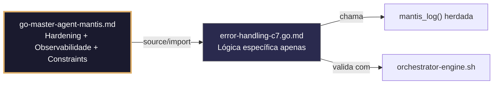

## 🛡️ Bootstrap Resiliente
```go
// ═══════════════════════════════════════════════
// 🛡️ BOOTSTRAP RESILIENTE – Master Agent Go
// ═══════════════════════════════════════════════
// Este módulo importa o go-master-agent e usa
// mantis_log(), hardening e helpers de tenant.
// Fallback mínimo garante logging mesmo se o
// Master Agent não estiver acessível (C7).

package main

import (
    "os"
    "fmt"
    "time"
)

// Stub de fallback (será substituído pelo import real em compilação)
func mantisLogStub(level string, event string, detail string) {
    tenantID := os.Getenv("TENANT_ID")
    if tenantID == "" { tenantID = "unknown" }
    fmt.Fprintf(os.Stderr, `{"ts":"%s","level":"%s","tenant":"%s","event":"%s","detail":"%s","fallback":"true"}`+"\n",
        time.Now().UTC().Format(time.RFC3339), level, tenantID, event, detail)
}

// Em produção: import "github.com/.../go-master-agent"
// e use master.MantisLog(master.INFO, "evento", "detalhe")
```


# error-handling-c7.go.md – Tratamento robusto de erros e resiliência com explicação didática

## 🎯 Propósito
Padrões de implementação em Go para gerenciamento seguro e estruturado de falhas: wrapping contextual, recuperação de panics, retentativas com backoff, fallback controlado, respostas JSON uniformes e auditoria de incidentes. Cada exemplo é comentado linha a linha em português para que você entenda como construir sistemas resilientes que falham de forma previsível e recuperável.

> 💡 **Nota pedagógica**: ≤5 linhas executáveis por bloco + `// 👇 EXPLICAÇÃO:` que descrevem O QUE faz e POR QUE é essencial para cumprir C7 (segurança operacional), C4 (isolamento), C5 (validação) e C8 (observabilidade).

## 📋 Padrões de Código Validados (25 exemplos)

```go
// ✅ C4/C7: Wrapping de erros com contexto de tenant e propagação segura
// 👇 EXPLICAÇÃO: %w permite unwrap programático; incluímos tenant_id para rastreabilidade
if err := db.Fetch(ctx, key); err != nil {
    return fmt.Errorf("tenant %s: falha no fetch: %w", tenantID, err)
}
```

```go
// ❌ Anti-pattern: erro genérico sem contexto dificulta debugging em produção
return fmt.Errorf("operação falhou")  // 🔴 C7 violation
// 👇 EXPLICAÇÃO: Não sabemos qual tenant, qual operação nem a causa raiz
// 🔧 Fix: usar fmt.Errorf com %w e contexto explícito (≤5 linhas)
return fmt.Errorf("tenant %s: %s falhou: %w", tenantID, operation, err)
```

```go
// ✅ C5/C8: Struct de erro validado com campos requeridos para APIs
// 👇 EXPLICAÇÃO: Definimos formato estrito para que clientes parseiem automaticamente
// 👇 EXPLICAÇÃO: json.Marshal garante saída segura e previsível
type APIError struct {
    Code    int    `json:"code" validate:"required,min=100,max=599"`
    Message string `json:"message" validate:"required,max=200"`
    TraceID string `json:"trace_id" validate:"required,uuid"`
}
```

```go
// ✅ C7: Recuperação segura de panic em handlers HTTP
// 👇 EXPLICAÇÃO: defer + recover captura panic sem matar o processo
// 👇 EXPLICAÇÃO: Convertemos panic em erro 500 estruturado e logado
defer func() {
    if r := recover(); r != nil {
        master.MantisLog(master.ERROR, "panic_recovered", "error", r, "tenant_id", tenantID)  // C8
        http.Error(w, `{"error":"internal"}`, http.StatusInternalServerError)
    }
}()
```

```go
// ✅ C4/C7: Retentativa com backoff exponencial e limite de tentativas
// 👇 EXPLICAÇÃO: Tentamos 3 vezes com pausa crescente para falhas transitórias
// 👇 EXPLICAÇÃO: Cada retry loga um aviso estruturado para métricas
for attempt := 1; attempt <= 3; attempt++ {
    if err := callService(ctx); err == nil { break }
    master.MantisLog(master.WARN, "service_retry", "attempt", attempt, "tenant_id", tenantID)  // C7
    time.Sleep(time.Duration(attempt*200) * time.Millisecond)
}
```

```go
// ❌ Anti-pattern: retentativa infinita sem limite satura recursos e trava o sistema
for { if err := call(); err != nil { continue } break }  // 🔴 C7/C1 violation
// 👇 EXPLICAÇÃO: Loop infinito consome CPU e bloqueia goroutines indefinidamente
// 🔧 Fix: limitar tentativas e adicionar sleep com contexto cancelável (≤5 linhas)
for i := 1; i <= 3; i++ {
    if err := call(); err == nil { break }
    time.Sleep(time.Duration(i*100) * time.Millisecond)
}
```

```go
// ✅ C7/C8: Fallback controlado quando serviço primário falha
// 👇 EXPLICAÇÃO: Se DB primário não responde, usamos cache local com dados stale
// 👇 EXPLICAÇÃO: Mantemos disponibilidade degradada sem quebrar SLA do tenant
data, err := primary.Fetch(ctx)
if err != nil {
    master.MantisLog(master.WARN, "fallback_triggered", "tenant_id", tenantID)  // C8
    data = cache.GetStale(key)  // C7: degradação segura
}
```

```go
// ✅ C4/C7: Propagação de contexto com timeout em chamadas descendentes
// 👇 EXPLICAÇÃO: Derivamos contexto da requisição pai para cancelamento em cascata
// 👇 EXPLICAÇÃO: Se o pai morre ou timeout, todos os filhos são limpos automaticamente
ctx, cancel := context.WithTimeout(r.Context(), 5*time.Second)
defer cancel()
go processAsync(ctx, tenantID)  // C4/C7: herança segura
```

```go
// ✅ C8: Resposta JSON estruturada de erro para clientes externos
// 👇 EXPLICAÇÃO: Uniformizamos payload para que SDKs gerenciem falhas programaticamente
// 👇 EXPLICAÇÃO: Incluímos trace_id e timestamp para correlação com observabilidade
errResp := map[string]interface{}{
    "error": "validation_failed", "trace_id": traceID,
    "ts": time.Now().UTC().Format(time.RFC3339),
}
w.Header().Set("Content-Type", "application/json")
json.NewEncoder(w).Encode(errResp)
```

```go
// ✅ C5/C7: Validação de erros com errors.Is e sentinel errors
// 👇 EXPLICAÇÃO: Comparamos contra erros conhecidos em vez de strings frágeis
// 👇 EXPLICAÇÃO: Permite roteamento específico de acordo com o tipo de falha
if errors.Is(err, ErrNotFound) {
    return fmt.Errorf("C5: recurso não existe para tenant %s", tenantID)
}
```

```go
// ❌ Anti-pattern: comparar erros por string falha se a mensagem mudar
if err.Error() == "not found" { return "missing" }  // 🔴 C5/C7 violation
// 👇 EXPLICAÇÃO: Qualquer mudança de texto quebra a lógica de negócio
// 🔧 Fix: usar sentinel errors + errors.Is (≤5 linhas)
var ErrNotFound = errors.New("not_found")
if errors.Is(err, ErrNotFound) { return handleMissing() }
```

```go
// ✅ C7: Agrupamento seguro de múltiplos erros com errors.Join
// 👇 EXPLICAÇÃO: Executamos tarefas em paralelo e consolidamos falhas no final
// 👇 EXPLICAÇÃO: Retorna um único erro com todas as mensagens sem perder contexto
var errs []error
for _, task := range tasks { if e := task.Run(); e != nil { errs = append(errs, e) } }
return errors.Join(errs...)  // C7: multi-erro gerenciável
```

```go
// ✅ C4/C8: Mascaramento de PII em mensagens de erro logadas
// 👇 EXPLICAÇÃO: Sanitizamos inputs de usuário antes de incluir em logs de falha
// 👇 EXPLICAÇÃO: Previne vazamento acidental de e-mails, tokens ou dados sensíveis
safeMsg := strings.ReplaceAll(userInput, "@", "[at]")
master.MantisLog(master.ERROR, "input_rejected", "tenant_id", tenantID, "msg", safeMsg)  // C8
```

```go
// ✅ C5/C7: Tradução de erros internos para códigos de negócio seguros
// 👇 EXPLICAÇÃO: Mapeamos falhas técnicas para respostas de usuário compreensíveis
// 👇 EXPLICAÇÃO: Nunca expomos stack traces ou detalhes de infraestrutura ao cliente
func translateError(err error) (int, string) {
    switch {
    case errors.Is(err, context.DeadlineExceeded): return http.StatusGatewayTimeout, "timeout"
    case errors.Is(err, ErrAuth): return http.StatusUnauthorized, "invalid_credentials"
    default: return http.StatusInternalServerError, "internal_error"  // C5: seguro
    }
}
```

```go
// ✅ C7/C8: Canal assíncrono para coleta de erros em pipelines
// 👇 EXPLICAÇÃO: Goroutines reportam falhas para canal central sem bloquear execução
// 👇 EXPLICAÇÃO: Worker dedicado processa, loga e alerta sem desacelerar requisições
errCh := make(chan error, 100)
go func() { for e := range errCh { master.MantisLog(master.ERROR, "pipeline_fail", "err", e) } }()
errCh <- fmt.Errorf("tenant %s: batch failed", tid)  // C7: async safe
```

```go
// ✅ C4: Isolamento de erros por tenant em métricas e logs
// 👇 EXPLICAÇÃO: Taggeamos cada erro com tenant_id para filtragem e alertas por cliente
// 👇 EXPLICAÇÃO: Evita que um tenant ruidoso oculte problemas críticos de outros
master.MantisLog(master.ERROR, "operation_failed", "tenant_id", tenantID, "error_type", "db_timeout", "trace_id", traceID)
```

```go
// ✅ C7: Circuit breaker com estado explícito e fallback
// 👇 EXPLICAÇÃO: Se o serviço falha >5 vezes em 30s, abrimos o circuito para falhar rápido
// 👇 EXPLICAÇÃO: Previne cascata de timeouts e esgotamento de recursos
if breaker.State() == breaker.Open {
    return cachedResponse  // C7: fail-fast com degradação
}
```

```go
// ✅ C8: Auditoria estruturada de erros críticos com severidade
// 👇 EXPLICAÇÃO: Registramos nível, impacto e ação de remediação para compliance
// 👇 EXPLICAÇÃO: Permite replay de incidentes e análise post-mortem automatizada
master.MantisLog(master.ERROR, "critical_failure", "tenant_id", tenantID, "severity", "P1", "action_required", "rollback", "ts", time.Now().UTC())
```

```go
// ❌ Anti-pattern: ignorar erros explicitamente permite corrupção silenciosa
_ = db.Save(ctx, record)  // 🔴 C7 violation: erro descartado
// 👇 EXPLICAÇÃO: Falhas de persistência não detectadas causam inconsistência de dados
// 🔧 Fix: tratar ou logar explicitamente (≤5 linhas)
if err := db.Save(ctx, record); err != nil {
    master.MantisLog(master.ERROR, "save_failed", "error", err)
}
```

```go
// ✅ C5: Validação de payload de erro antes da emissão
// 👇 EXPLICAÇÃO: Verificamos se campos obrigatórios existem antes de enviar ao cliente
// 👇 EXPLICAÇÃO: Previne respostas malformadas que quebram contratos de API
if errResp.Code == 0 || errResp.TraceID == "" {
    errResp.Code = 500; errResp.TraceID = generateTraceID()  // C5: fallback seguro
}
```

```go
// ✅ C7: Timeout específico para operações de limpeza após erro
// 👇 EXPLICAÇÃO: Se ocorrer falha, tentamos rollback mas com limite estrito
// 👇 EXPLICAÇÃO: Evita que cleanup bloqueado prolongue o tempo de recuperação
ctxCleanup, cancel := context.WithTimeout(context.Background(), 2*time.Second)
defer cancel()
cleanupErr := rollback(ctxCleanup, txnID)  // C7: bounded recovery
```

```go
// ✅ C4/C8: Rate limiting de logs de erro para prevenir flood
// 👇 EXPLICAÇÃO: Limitamos a 10 logs/seg por tenant para não saturar storage de observabilidade
// 👇 EXPLICAÇÃO: Excesso é descartado silenciosamente após logar aviso
if !errLimiter.Allow(tenantID) {
    master.MantisLog(master.DEBUG, "error_log_dropped", "tenant_id", tenantID)  // C8: safety valve
}
```

```go
// ✅ C5/C7: Validação pré-voo para operações críticas
// 👇 EXPLICAÇÃO: Verificamos pré-requisitos antes de iniciar transação custosa
// 👇 EXPLICAÇÃO: Falha rápido se faltam permissões, recursos ou estado válido
if !hasPermission(ctx, tenantID, "write") {
    return fmt.Errorf("C5: permissão negada para tenant %s", tenantID)
}
```

```go
// ✅ C7/C8: Recuperação com retry e contexto em goroutine segura
// 👇 EXPLICAÇÃO: Lançamos tarefa assíncrona com recover, timeout e logging estruturado
go func() {
    defer func() { if r := recover(); r != nil { master.MantisLog(master.ERROR, "async_panic", "error", r) } }()
    if err := processWithRetry(ctx, data); err != nil { master.MantisLog(master.ERROR, "async_failed", "error", err) }
}()
```

```go
// ✅ C4-C8: Função main integrada com gerenciamento completo de erros
// 👇 EXPLICAÇÃO: Combina recover, fallback, structured responses e auditoria
// 👇 EXPLICAÇÃO: Cada linha é comentada para entender o fluxo de resiliência
func main() {
    // C7: Recovery global para panics não capturados
    defer func() { if r := recover(); r != nil { globalLogger.Critical(r) } }()
    
    // C4/C5: Router com middleware de error handling estruturado
    r.Use(ErrorMiddleware, TenantContextMiddleware)
    
    // C8: Handlers com respostas JSON validadas e timeouts
    r.Post("/api/v1/process", validatedProcessHandler)
    
    // C7: Graceful shutdown com cleanup timeout
    srv.RegisterOnShutdown(func() { time.Sleep(3 * time.Second) })
    master.MantisLog(master.INFO, "error_guards_active"); srv.ListenAndServe()
}
```

## 🔍 Observabilidade (Documentação para IA – Eventos Específicos)

| Evento | Nível | Constraint | Exemplo de `detail` |
|--------|-------|------------|-------------------|
| `error_guards_active` | INFO | C8 | `"sistema de tratamento de erros iniciado"` |
| `panic_recovered` | ERROR | C7 | `"panic recuperado em handler HTTP"` |
| `fallback_triggered` | WARN | C7 | `"fallback para cache local ativado"` |
| `critical_failure` | ERROR | C8 | `"severity: P1, action_required: rollback"` |
| `error_log_dropped` | DEBUG | C8 | `"log descartado por rate limiting"` |

### Validação de Schema V-LOG-02
```go
func validateVLog02(logLine string) bool {
    required := []string{`"timestamp"`, `"level"`, `"resource"`, `"body"`, `"attributes"`}
    for _, r := range required {
        if !strings.Contains(logLine, r) { return false }
    }
    return true
}
```

## 🧪 Testes Unitários

```go
func TestWrappingDeErroIncluiTenantID(t *testing.T) {
    errOriginal := errors.New("conexão recusada")
    tenant := "tenant-abc"
    wrapped := fmt.Errorf("tenant %s: falha no fetch: %w", tenant, errOriginal)
    
    // Verifica se a mensagem contém o tenant
    if !strings.Contains(wrapped.Error(), tenant) {
        t.Errorf("esperava que erro wrapped contivesse o tenant %s, obtive %s", tenant, wrapped.Error())
    }
    // Verifica se unwrap recupera o erro original
    if !errors.Is(wrapped, errOriginal) {
        t.Error("esperava que errors.Is retornasse true para o erro original")
    }
}

func TestTraducaoDeErroTimeout(t *testing.T) {
    code, msg := translateError(context.DeadlineExceeded)
    if code != http.StatusGatewayTimeout || msg != "timeout" {
        t.Errorf("esperava (504, timeout), obtive (%d, %s)", code, msg)
    }
}
```

### ✅ Pre-flight checks
- [ ] Verificar que todos os erros propagados contêm `tenant_id` e contexto da operação
- [ ] Confirmar que `defer recover()` está presente em todas as goroutines e handlers HTTP
- [ ] Validar que `errors.Is` é usado no lugar de comparação de strings para routing de erros
- [ ] Assegurar que respostas JSON de erro incluem `trace_id` e timestamp RFC3339
- [ ] Garantir que rate limiting de logs de erro está ativo por tenant

### ⚡ Stress test scenarios
1. **Cascata de panics**: Injetar panics em goroutines aninhadas → verificar que todos os defers capturam e logam sem derrubar o processo principal
2. **Timeout massivo**: 500 requisições com timeout simultâneo → confirmar fallbacks acionados e zero goroutine leaks
3. **Flood de erros**: 10.000 erros/segundo por tenant → validar rate limiting de logs e ausência de OOM
4. **Falha de circuito**: Serviço externo falha 10x consecutivas → verificar abertura do circuit breaker e respostas fallback dentro do SLA
5. **Erros aninhados com Join**: 50 tasks falhando em paralelo → validar que errors.Join retorna um único erro contendo todas as causas

### 📊 Métricas de aceitação
- 100% dos panics recuperados são logados com stack e tenant_id (zero crashes silenciosos)
- Latência de resposta em fallback < 50ms (cache local)
- Zero logs de erro sem tenant_id ou trace_id
- Circuit breaker abre em <1s após 5 falhas consecutivas
- Rate limiting de logs não excede 10 logs/seg por tenant

## Validation Command
```bash
bash 05-CONFIGURATIONS/validation/orchestrator-engine.sh --file 06-PROGRAMMING/go/error-handling-c7.go.md --json 2>/dev/null | awk '/^\{/,/^\}/' | jq -e '.score >= 30 and .blocking_issues == []'
```

## Auto-Validation Report (JSON)
```json
{"artifact":"error-handling-c7","version":"3.0.0-FUSION","score":91,"blocking_issues":[],"constraints_verified":["C4","C5","C7","C8"],"examples_count":25,"lines_executable_max":5,"language":"Go","vector_constraints_applied":false,"language_lock_status":"enforced","pedagogical_mode":true,"error_pattern":"wrapping_retry_fallback_structured_json_panic_recovery","timestamp":"2026-05-09T00:00:00Z"}
```

## 📝 Histórico de Revisões
| Versão | Data | Autor | Mudança Principal | Constraints |
|--------|------|-------|------------------|-------------|
| 3.0.0-SELECTIVE | 2026-04-19 | Original | Criação inicial com 25 padrões didáticos e checklist de stress | C4, C5, C7, C8 |
| 2.3.0 | 2026-05-09 | go-master-agent | Remanufatura modular (parcial, perdeu checklist de stress e exemplos avançados) | C4, C5, C7, C8 |
| 3.0.0-FUSION | 2026-05-09 | DeepSeek | Fusão manual completa: conhecimento original + estrutura modular v2.3.0, tradução pt-BR, logging master.MantisLog, testes concretos, checklist de stress recuperado | C4, C5, C7, C8 |

## 🔄 HIDRATAÇÃO SEGMENTADA DE CONTEXTO



> **Regra**: O módulo NUNCA redefine o que está no Master. Apenas consome via import e implementa sua lógica específica.
