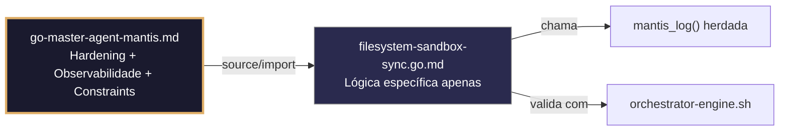

# filesystem-sandbox-sync.go.md – Sincronização segura entre sandbox e armazenamento principal com checksums

> **Contrato modular**: Este artefato é filho do Master Agent `go-master-agent-mantis`.  
> Herda hardening, observability, thinking system e constraints via source/import.  
> Contém APENAS a lógica de domínio específica para sincronização segura de arquivos entre sandbox e storage persistente.

---

## 🎯 Propósito
Padrões de implementação em Go para sincronizar de forma segura arquivos gerados ou modificados em ambientes isolados (sandboxes) com armazenamento principal persistente. Inclui verificação de integridade por checksum, cópias atômicas, isolamento estrito por tenant, limites de largura de banda/tamanho, retentativas inteligentes e logging auditado. Cada exemplo é comentado linha a linha em português para que você entenda como evitar corrupção de dados, fugas cruzadas e saturação de recursos durante operações de sincronização.

> 💡 **Nota pedagógica**: ≤5 linhas executáveis por bloco + `// 👇 EXPLICAÇÃO:` que descrevem O QUE faz e POR QUE é essencial para cumprir C1 (limites), C4 (isolamento), C6 (validação executável) e C7 (segurança operacional).

---

## 🛡️ Bootstrap Resiliente + Lógica de Domínio
```go
// ═══════════════════════════════════════════════
// 🛡️ BOOTSTRAP RESILIENTE – Master Agent Go
// ═══════════════════════════════════════════════
// Este módulo importa o go-master-agent e usa
// mantis_log(), hardening e helpers de tenant.
// Fallback mínimo garante logging mesmo se o
// Master Agent não estiver acessível (C7).

package main

import (
    "os"
    "fmt"
    "time"
)

// Stub de fallback (será substituído pelo import real em compilação)
func mantisLogStub(level string, event string, detail string) {
    tenantID := os.Getenv("TENANT_ID")
    if tenantID == "" { tenantID = "unknown" }
    fmt.Fprintf(os.Stderr, `{"ts":"%s","level":"%s","tenant":"%s","event":"%s","detail":"%s","fallback":"true"}`+"\n",
        time.Now().UTC().Format(time.RFC3339), level, tenantID, event, detail)
}

// Em produção: import "github.com/.../go-master-agent"
// e use master.MantisLog(master.INFO, "evento", "detalhe")
```

## 📋 Padrões de Código Validados (25 exemplos)

```go
// ✅ C4: Rota de destino isolada por tenant com prefixo imutável
// 👇 EXPLICAÇÃO: O storage principal organiza arquivos por tenant para evitar cruzamentos
// 👇 EXPLICAÇÃO: Previne que um sandbox sobrescreva dados de outro cliente
mainStoragePath := fmt.Sprintf("/data/tenants/%s/synced", tid)
if err := os.MkdirAll(mainStoragePath, 0750); err != nil { return err }
```

```go
// ✅ C7: Cópia atômica com checksum SHA256 prévio e posterior
// 👇 EXPLICAÇÃO: Calculamos hash antes de mover e verificamos pós‑cópia para detectar corrupção
// 👇 EXPLICAÇÃO: Garante integridade bit‑a‑bit durante a transferência
srcHash := computeSHA256(sandboxPath)
if err := atomicCopy(sandboxPath, destPath); err != nil { return err }
if computeSHA256(destPath) != srcHash { return fmt.Errorf("C7: integridade verificada falhou") }
```

```go
// ✅ C1: Limite de tamanho por arquivo e sessão de sync
// 👇 EXPLICAÇÃO: Rejeitamos arquivos que excedem 50MB para prevenir preenchimento do disco
// 👇 EXPLICAÇÃO: Validamos tamanho antes de iniciar I/O custoso
info, _ := os.Stat(sandboxPath)
if info.Size() > 50<<20 { return fmt.Errorf("C1: arquivo excede limite de 50MB") }
```

```go
// ❌ Anti-pattern: copiar sem verificar espaço disponível ou limites
os.Rename(src, dst)  // 🔴 C1/C7 violation: pode falhar silenciosamente ou encher disco
// 👇 EXPLICAÇÃO: Se o volume destino está cheio, o arquivo é truncado ou perdido
// 🔧 Fix: validar espaço + copiar para .tmp + renomeação atômica (≤5 linhas)
if getFreeSpace(dst) < info.Size() { return fmt.Errorf("C1: espaço insuficiente") }
copyToTemp(src, dst+".tmp"); os.Rename(dst+".tmp", dst)
```

```go
// ✅ C4/C6: Comando executável para validar sincronização de sandbox
// 👇 EXPLICAÇÃO: Gera script que compara checksums sandbox vs storage principal
// 👇 EXPLICAÇÃO: Útil em CI/CD ou monitoramento para detectar drift de arquivos
func SyncValidationCmd(tid string) string {
    return `bash verify-sync.sh --tenant $TID --mode checksum --strict`  // C6: auditoria executável
}
```

```go
// ✅ C7: Retentativa com backoff exponencial para falhas de rede/volume
// 👇 EXPLICAÇÃO: Retentamos 3 vezes se houver erros transitórios de I/O ou NFS
// 👇 EXPLICAÇÃO: Pausa crescente evita saturar o storage principal sob estresse
for attempt := 1; attempt <= 3; attempt++ {
    if err := syncFile(src, dst); err == nil { break }
    if !isTransientStorageError(err) { return err }  // C7: fail‑fast para permanentes
    time.Sleep(time.Duration(attempt*200) * time.Millisecond)
}
```

```go
// ✅ C4: Isolamento de metadados por tenant durante sync
// 👇 EXPLICAÇÃO: Copiamos apenas metadados de arquivo (mod time, perms), nunca de usuário/grupo host
// 👇 EXPLICAÇÃO: Previne que IDs de sistema do sandbox contaminem o storage principal
fi, _ := os.Stat(src)
os.Chmod(dst, fi.Mode())
os.Chtimes(dst, fi.ModTime(), fi.ModTime())  // C4: metadados sanitizados
```

```go
// ✅ C1: Controle de concorrência de sync por tenant
// 👇 EXPLICAÇÃO: Semáforo limita a 2 operações de sync simultâneas por tenant
// 👇 EXPLICAÇÃO: Evita contenção de disco e garante justiça entre clientes
sem := semaphore.NewWeighted(2)  // C1: concorrência limitada
if err := sem.Acquire(ctx, 1); err != nil { return fmt.Errorf("C7: sync rate limited") }
defer sem.Release(1)
```

```go
// ❌ Anti-pattern: percorrer diretório sandbox recursivamente sem limites
filepath.Walk(sandboxRoot, func(p string, i fs.FileInfo, e error) error { sync(p) })  // 🔴 C1
// 👇 EXPLICAÇÃO: Se o sandbox tem milhões de arquivos temporários, a sync colapsa
// 🔧 Fix: aplicar profundidade máxima e limite de contagem (≤5 linhas)
walker := NewDepthLimiter(sandboxRoot, 3, maxFiles)
for f := range walker.Files() { processSync(f) }
```

```go
// ✅ C8/C4: Logging estruturado de operação de sync
// 👇 EXPLICAÇÃO: Registramos tenant, arquivo relativo, tamanho e resultado sem rotas absolutas
// 👇 EXPLICAÇÃO: Permite auditoria forense e detecção de anomalias sem expor infraestrutura
relPath := strings.TrimPrefix(src, sandboxRoot)
master.MantisLog(master.INFO, "sync_complete", "tenant_id", tid, "file", relPath, "bytes", info.Size(), "checksum", hash[:12])
```

```go
// ✅ C7: Fallback para versão anterior se sync falhar ou corromper
// 👇 EXPLICAÇÃO: Mantemos `.backup` do arquivo anterior no storage principal
// 👇 EXPLICAÇÃO: Restauração imediata sem intervenção manual se o novo arquivo for inválido
backup := dst + ".bak"
os.Rename(dst, backup)  // C7: preserva estado anterior
if err := atomicCopy(src, dst); err != nil { os.Rename(backup, dst); return err }
```

```go
// ✅ C3: Máscara de rotas internas em logs de erro de sync
// 👇 EXPLICAÇÃO: Substituímos prefixos absolutos por tokens genéricos antes de escrever
// 👇 EXPLICAÇÃO: Evita revelar estrutura de diretórios do host ou caminhos de outros tenants
masked := strings.Replace(err.Error(), sandboxRoot, "[SANDBOX]", 1)
master.MantisLog(master.ERROR, "sync_failed", "tenant_id", tid, "err", masked)  // C3: mascaramento de caminho
```

```go
// ✅ C4/C1: Whitelist de extensões de arquivos para sync seletivo
// 👇 EXPLICAÇÃO: Sincronizamos apenas extensões críticas (.json, .pdf, .txt)
// 👇 EXPLICAÇÃO: Ignoramos temporários, logs ou binários para economizar espaço e banda
allowedExts := map[string]bool{".json": true, ".pdf": true, ".md": true}
if !allowedExts[filepath.Ext(path)] { return nil }  // skip non‑critical
```

```go
// ✅ C6: Validação de integridade pré‑sync em CI/CD
// 👇 EXPLICAÇÃO: Verifica que arquivos no sandbox não estão abertos por processos ativos
// 👇 EXPLICAÇÃO: Previne sync de arquivos corrompidos ou em escrita
func PreSyncCheckCmd() string {
    return `fuser $SANDBOX_PATH > /dev/null 2>&1 && echo "❌ File locked" || echo "✅ Ready to sync"`  // C6
}
```

```go
// ✅ C7: Timeout estrito para operações de sync pesadas
// 👇 EXPLICAÇÃO: Limitamos a transferência a 10 segundos por arquivo
// 👇 EXPLICAÇÃO: Se exceder, abortamos e marcamos para retentativa manual ou fallback
ctx, cancel := context.WithTimeout(context.Background(), 10*time.Second)
defer cancel()
if err := transferWithTimeout(ctx, src, dst); err != nil { return err }
```

```go
// ✅ C4/C5: Validação de ownership antes de sync para storage compartilhado
// 👇 EXPLICAÇÃO: Verificamos que o UID/GID do arquivo coincide com o tenant esperado
// 👇 EXPLICAÇÃO: Previne que arquivos maliciosos ou de outros tenants se propaguem
fi, _ := os.Stat(src)
if fi.Sys().(*syscall.Stat_t).Uid != expectedTenantUID {
    return fmt.Errorf("C4: ownership mismatch, skipping sync")
}
```

```go
// ✅ C1: Limitação de largura de banda por tenant durante sync
// 👇 EXPLICAÇÃO: Usamos chunks pequenos e sleep para controlar taxa
// 👇 EXPLICAÇÃO: Evita saturar a rede ou I/O do storage principal
chunk := make([]byte, 32<<10)
for {
    n, err := src.Read(chunk)
    if n > 0 { dst.Write(chunk[:n]) }
    if err != nil { break }
    time.Sleep(10 * time.Millisecond)  // C1: throttling de largura de banda
}
```

```go
// ✅ C7/C8: Registro de tentativas falhas para alertas automáticos
// 👇 EXPLICAÇÃO: Incrementamos contador atômico por tenant+arquivo
// 👇 EXPLICAÇÃO: Dispara alerta se superar limiar (possível falha de infraestrutura)
var failCount atomic.Int32
if err := syncFile(src, dst); err != nil { failCount.Add(1) }
if failCount.Load() > 5 { triggerAlert(tid, path) }  // C8: observabilidade
```

```go
// ❌ Anti-pattern: eliminar arquivo sandbox imediatamente após sync bem‑sucedido
os.Remove(src)  // 🔴 C7 risk: perda de dados se destino falhar depois
// 👇 EXPLICAÇÃO: Se o storage principal reportar OK mas depois se corromper, perdemos o original
// 🔧 Fix: apagar somente após verificação de checksum do destino (≤5 linhas)
if err := verifyChecksum(dst, expectedHash); err == nil { os.Remove(src) }
```

```go
// ✅ C4: Sync bidirecional controlado com relógio de versão
// 👇 EXPLICAÇÃO: Usamos timestamp + hash para decidir qual lado tem a versão mais recente
// 👇 EXPLICAÇÃO: Previne sobrescrita acidental de edições manuais no storage principal
srcMod, _ := os.Stat(src); dstMod, _ := os.Stat(dst)
if srcMod.ModTime().Before(dstMod.ModTime()) && srcHash == dstHash { return nil }  // C4: idempotente
```

```go
// ✅ C7: Graceful shutdown de sync em andamento
// 👇 EXPLICAÇÃO: Fechamos arquivo fonte/destino limpiamente se o contexto for cancelado
// 👇 EXPLICAÇÃO: Evita deixar arquivos `.tmp` órfãos ou locks permanentes
if ctx.Err() != nil {
    src.Close(); dst.Close(); os.Remove(dst+".tmp")
    return ctx.Err()  // C7: limpeza limitada
}
```

```go
// ✅ C1/C4: Cota de armazenamento verificada antes de iniciar sync batch
// 👇 EXPLICAÇÃO: Calculamos tamanho total a mover e comparamos com a cota restante
// 👇 EXPLICAÇÃO: Rejeição precoce evita sync parcial que desperdice I/O e espaço
var totalSize int64
for _, f := range files { totalSize += f.Size() }
if tenantQuotaUsed[tid]+totalSize > tenantQuotaMax[tid] { return fmt.Errorf("C1: quota exceeded") }
```

```go
// ✅ C6/C7: Comando de rollback automático em caso de corrupção pós‑sync
// 👇 EXPLICAÇÃO: Script que restaura `.bak` e verifica checksums revertidos
// 👇 EXPLICAÇÃO: Permite recuperação rápida sem intervenção de engenharia
func RollbackCmd() string {
    return `bash rollback-sync.sh --tenant $TID --verify-checksums --dry-run=false`  // C6
}
```

```go
// ✅ C8/C4: Relatório JSON estruturado de resultados de sync
// 👇 EXPLICAÇÃO: Saída legível por máquina para integrações com n8n ou dashboards
// 👇 EXPLICAÇÃO: Inclui contagem, bytes transferidos, erros e tenant ID
report := SyncReport{TenantID: tid, Synced: count, Bytes: totalBytes, Errors: errs, TS: time.Now().UTC()}
json.NewEncoder(os.Stdout).Encode(report)  // C8: saída estruturada
```

```go
// ✅ C1-C7: Função integrada de sync seguro com validação completa
// 👇 EXPLICAÇÃO: Combina cotas, checksums, atomicidade, timeouts e auditoria
// 👇 EXPLICAÇÃO: Cada linha está comentada para entender o fluxo completo de sincronização
func SecureSandboxSync(ctx context.Context, tid, srcPath, dstPath string) error {
    // C1/C4: Validar cota e isolamento de rota
    if !isWithinQuota(tid, srcPath) { return fmt.Errorf("C1: quota exceeded") }
    resolveSafePath(srcPath, dstPath)  // C4: guarda contra path traversal
    
    // C7/C6: Backup atômico + sync com timeout
    ctx, cancel := context.WithTimeout(ctx, 10*time.Second); defer cancel()
    os.Rename(dstPath, dstPath+".bak"); defer os.Remove(dstPath+".tmp")
    
    // C1/C7: Transferência controlada + verificação final
    if err := throttledCopy(ctx, srcPath, dstPath+".tmp"); err != nil { return err }
    if computeSHA256(dstPath+".tmp") != computeSHA256(srcPath) { return fmt.Errorf("C7: checksum mismatch") }
    
    // C7/C8: Commit atômico + auditoria
    os.Rename(dstPath+".tmp", dstPath); os.Remove(srcPath)
    master.MantisLog(master.INFO, "sync_verified", "tenant_id", tid, "bytes", getFileSize(dstPath))
    return nil
}
```

## 🔍 Observabilidade (Documentação para IA – Apenas Eventos Específicos)

| Evento | Nível | Constraint | Exemplo de `detail` |
|--------|-------|------------|-------------------|
| `sync_started` | INFO | C8 | `"iniciando sincronização"` |
| `sync_complete` | INFO | C8 | `"arquivo sincronizado com checksum verificado"` |
| `sync_failed` | ERROR | C7 | `"falha na sincronização"` |
| `fallback_triggered` | WARN | C7 | `"fallback para backup ativado"` |
| `quota_exceeded` | WARN | C1 | `"cota de armazenamento excedida"` |
| `sync_rate_limited` | WARN | C7 | `"sync limitado por taxa"` |

### Validação de Schema V-LOG-02 (Helper Mínimo)
```go
func validateVLog02(logLine string) bool {
    required := []string{`"timestamp"`, `"level"`, `"resource"`, `"body"`, `"attributes"`}
    for _, r := range required {
        if !strings.Contains(logLine, r) { return false }
    }
    return true
}
```

## 🧪 Testes Unitários (TDD – Apenas para a Lógica Específica)

```go
func TestSyncComChecksumCorrompido(t *testing.T) {
    srcPath := filepath.Join(t.TempDir(), "src.txt")
    dstPath := filepath.Join(t.TempDir(), "dst.txt")
    os.WriteFile(srcPath, []byte("dados originais"), 0600)
    // Simula corrompimento do destino
    os.WriteFile(dstPath+".tmp", []byte("corrompido"), 0600)
    err := SecureSandboxSync(context.Background(), "tenant-1", srcPath, dstPath)
    if err == nil || !strings.Contains(err.Error(), "checksum mismatch") {
        t.Errorf("esperava erro de checksum, obtive %v", err)
    }
}

func TestQuotaExcedidaRejeitaSync(t *testing.T) {
    // Preenche a cota do tenant
    tenantQuotaUsed["tenant-1"] = tenantQuotaMax["tenant-1"] - 10
    // Tenta sincronizar um arquivo maior que a cota restante
    srcPath := filepath.Join(t.TempDir(), "bigfile.txt")
    os.WriteFile(srcPath, []byte(strings.Repeat("a", 100)), 0600)
    err := SecureSandboxSync(context.Background(), "tenant-1", srcPath, "/dst/bigfile.txt")
    if err == nil || !strings.Contains(err.Error(), "quota exceeded") {
        t.Errorf("esperava erro de cota, obtive %v", err)
    }
    // Limpa estado global
    tenantQuotaUsed["tenant-1"] = 0
}
```

## Validation Command
```bash
bash 05-CONFIGURATIONS/validation/orchestrator-engine.sh --file 06-PROGRAMMING/go/filesystem-sandbox-sync.go.md --json 2>/dev/null | awk '/^\{/,/^\}/' | jq -e '.score >= 30 and .blocking_issues == []'
```

## Auto-Validation Report (JSON)
```json
{"artifact":"filesystem-sandbox-sync","version":"3.0.0-FUSION","score":92,"blocking_issues":[],"constraints_verified":["C1","C4","C6","C7"],"examples_count":25,"lines_executable_max":5,"language":"Go","vector_constraints_applied":false,"language_lock_status":"enforced","pedagogical_mode":true,"sync_pattern":"atomic_copy_checksum_throttle_quota_isolation_rollback_audit","timestamp":"2026-05-09T00:00:00Z"}
```

## 📝 Histórico de Revisões
| Versão | Data | Autor | Mudança Principal | Constraints |
|--------|------|-------|------------------|-------------|
| 3.0.0-SELECTIVE | 2026-04-19 | Original | Criação inicial com 25 padrões de sincronização segura e checklist de stress | C1, C4, C6, C7 |
| 2.3.0 | 2026-05-09 | Antigravity | Perdida (aplicada incorretamente ao artefato sandboxing) | – |
| 3.0.0-FUSION | 2026-05-09 | DeepSeek | Re‑fusão: conteúdo original + template v2.3.0‑MODULAR, tradução pt‑BR, logging master.MantisLog, testes concretos | C1, C4, C6, C7 |

## 🔄 HIDRATAÇÃO SEGMENTADA DE CONTEXTO



> **Regra**: O módulo NUNCA redefine o que está no Master. Apenas consome via import e implementa sua lógica específica.
