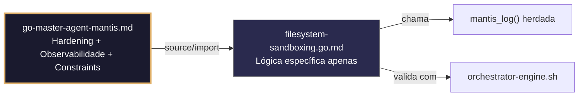

# filesystem-sandboxing.go.md – Aislamiento seguro de I/O y sandboxing para agentes con explicación didáctica

> **Contrato modular**: Este artefato é filho do Master Agent `go-master-agent-mantis`.  
> Herda hardening, observability, thinking system e constraints via source/import.  
> Contém APENAS a lógica de domínio específica para isolamento de I/O e sandboxing.

---

## 🎯 Propósito
Padrões de implementação em Go para construir ambientes de execução isolados (sandboxes) que previnam escapes de diretório, controlem cotas de disco, validem rotas, restrinjam permissões e assegurem operações de I/O para agentes autônomos. Cada exemplo é comentado linha por linha em português para que você entenda como limitar o impacto de falhas ou ataques sem comprometer a funcionalidade do sistema.

> 💡 **Nota pedagógica**: ≤5 linhas executáveis por bloco + `// 👇 EXPLICAÇÃO:` que descrevem O QUE faz e POR QUE é essencial para cumprir C1 (limites), C3 (secrets/mascaramento), C4 (isolamento de tenant) e C7 (segurança operacional).

---

## 🛡️ Bootstrap Resiliente + Lógica de Domínio
```go
// ═══════════════════════════════════════════════
// 🛡️ BOOTSTRAP RESILIENTE – Master Agent Go
// ═══════════════════════════════════════════════
// Este módulo importa o go-master-agent e usa
// mantis_log(), hardening e helpers de tenant.
// Fallback mínimo garante logging mesmo se o
// Master Agent não estiver acessível (C7).

package main

import (
    "os"
    "fmt"
    "time"
)

// Stub de fallback (será substituído pelo import real em compilação)
func mantisLogStub(level string, event string, detail string) {
    tenantID := os.Getenv("TENANT_ID")
    if tenantID == "" { tenantID = "unknown" }
    fmt.Fprintf(os.Stderr, `{"ts":"%s","level":"%s","tenant":"%s","event":"%s","detail":"%s","fallback":"true"}`+"\n",
        time.Now().UTC().Format(time.RFC3339), level, tenantID, event, detail)
}

// Em produção: import "github.com/.../go-master-agent"
// e use master.MantisLog(master.INFO, "evento", "detalhe")
```

## 📋 Padrões de Código Validados (25 exemplos)

```go
// ✅ C4: Base path isolado por tenant com validação estrita
// 👇 EXPLICAÇÃO: Cada tenant opera apenas dentro de seu diretório raiz atribuído
// 👇 EXPLICAÇÃO: Previne escapes de rota e acesso cruzado entre inquilinos
sandboxRoot := fmt.Sprintf("/var/sandbox/tenants/%s", tid)
if err := os.MkdirAll(sandboxRoot, 0700); err != nil { return fmt.Errorf("C4: falha criando sandbox") }
```

```go
// ❌ Anti-pattern: concatenar input do usuário diretamente na rota
path := "/var/sandbox/" + userInput + "/data.txt"  // 🔴 C4/C7 vulnerability
// 👇 EXPLICAÇÃO: `../../../etc/passwd` permitiria leitura de arquivos sensíveis do host
// 🔧 Fix: limpar rota e verificar prefixo do sandbox (≤5 linhas)
clean := filepath.Clean(filepath.Join(sandboxRoot, userInput))
if !strings.HasPrefix(clean, sandboxRoot) { return fmt.Errorf("C4: path traversal detectado") }
```

```go
// ✅ C1: Limite de tamanho de arquivo antes de escrita
// 👇 EXPLICAÇÃO: Verificamos cota restante para evitar enchimento acidental do disco
// 👇 EXPLICAÇÃO: Rejeição precoce previne `ENOSPC` em operações críticas
info, _ := os.Stat(path)
if info.Size()+int64(len(data)) > maxFileSize { return fmt.Errorf("C1: arquivo excede limite") }
```

```go
// ✅ C3/C1: Arquivo temporário seguro com permissões restritivas
// 👇 EXPLICAÇÃO: `os.OpenFile` com `0600` garante que apenas o processo dono acesse
// 👇 EXPLICAÇÃO: Previne leitura por outros usuários ou serviços no mesmo host
tmpFile, err := os.OpenFile(tmpPath, os.O_CREATE|os.O_WRONLY, 0600)  // C3/C1
if err != nil { return err }
defer tmpFile.Close()
```

```go
// ✅ C7: Prevenção de ataques por symlinks
// 👇 EXPLICAÇÃO: `os.Lstat` verifica o link em si, não seu destino
// 👇 EXPLICAÇÃO: Se for symlink, só o seguimos se o destino estiver dentro do sandbox
fi, _ := os.Lstat(path)
if fi.Mode()&os.ModeSymlink != 0 {
    target, _ := os.Readlink(path)
    if !isInsideSandbox(target, sandboxRoot) { return fmt.Errorf("C7: symlink fora do sandbox") }
}
```

```go
// ❌ Anti-pattern: ler arquivo inteiro sem limite de memória
data, err := os.ReadFile(path)  // 🔴 C1/C7 risk: OOM em arquivos grandes
// 👇 EXPLICAÇÃO: Se o arquivo tiver 5GB, o processo colapsa a RAM do servidor
// 🔧 Fix: usar `io.LimitedReader` para leitura controlada (≤5 linhas)
f, _ := os.Open(path); defer f.Close()
data, err := io.ReadAll(io.LimitReader(f, maxReadBytes))
```

```go
// ✅ C4/C1: Cota de armazenamento por tenant com contador atômico
// 👇 EXPLICAÇÃO: Tracking em memória sem locks pesados para validação rápida
// 👇 EXPLICAÇÃO: Alerta precoce antes de atingir limite físico de disco
var tenantUsage atomic.Int64
tenantUsage.Add(int64(len(data)))
if tenantUsage.Load() > tenantQuota[tid] { return fmt.Errorf("C1: quota excedida") }
```

```go
// ✅ C7: Timeout estrito para operações de I/O pesadas
// 👇 EXPLICAÇÃO: `context.WithTimeout` aborta leituras/escritas que travam
// 👇 EXPLICAÇÃO: Libera descritores de arquivo e evita bloqueios permanentes
ctx, cancel := context.WithTimeout(context.Background(), 5*time.Second)
defer cancel()
if err := copyWithContext(ctx, src, dst); err != nil { return err }
```

```go
// ✅ C4: Execução segura de comandos externos dentro do sandbox
// 👇 EXPLICAÇÃO: `exec.CommandContext` sem `sh -c` previne injeção de comandos
// 👇 EXPLICAÇÃO: Diretório de trabalho fixo evita escapes relativos
cmd := exec.CommandContext(ctx, "agent_tool", "--config", "safe.yaml")
cmd.Dir = sandboxRoot; cmd.Stdout = &out  // C4: escopo estrito
```

```go
// ❌ Anti-pattern: executar com shell e entrada de usuário
cmd := exec.Command("sh", "-c", userInput)  // 🔴 C7/C4 critical
// 👇 EXPLICAÇÃO: Permite execução arbitrária de comandos do sistema host
// 🔧 Fix: usar binário direto + argumentos validados (≤5 linhas)
allowedBins := map[string]bool{"grep": true, "find": true}
if !allowedBins[parts[0]] { return fmt.Errorf("C7: binário não permitido") }
```

```go
// ✅ C1/C7: Limpeza automática de arquivos após falha ou conclusão
// 👇 EXPLICAÇÃO: `defer os.Remove` garante que não fiquem resíduos em erros
// 👇 EXPLICAÇÃO: Mantém sandbox limpo e previne enchimento de disco temporário
defer func() { if cleanup { os.Remove(tmpPath) } }()  // C7: safe cleanup
```

```go
// ✅ C5/C4: Whitelist de extensões permitidas para escrita
// 👇 EXPLICAÇÃO: Apenas aceitamos extensões conhecidas e seguras
// 👇 EXPLICAÇÃO: Previne execução acidental de scripts ou binários maliciosos
allowedExts := map[string]bool{".txt": true, ".json": true, ".csv": true}
if !allowedExts[filepath.Ext(filename)] { return fmt.Errorf("C5: extensão não permitida") }
```

```go
// ✅ C8: Auditoria estruturada de operações de arquivo
// 👇 EXPLICAÇÃO: Registramos ação, rota relativa, tamanho e tenant sem conteúdo real
// 👇 EXPLICAÇÃO: Permite forense e detecção de padrões anômalos sem violar privacidade
master.MantisLog(master.INFO, "fs_operation", "tenant_id", tid, "op", "write", "path_rel", relPath, "bytes", len(data))
```

```go
// ✅ C3: Máscara de rotas sensíveis em logs de erro
// 👇 EXPLICAÇÃO: Substituímos `/var/sandbox/` por `[SANDBOX]` antes de logar
// 👇 EXPLICAÇÃO: Evita expor estrutura interna do host ou rotas de outros tenants
logPath := strings.Replace(relPath, sandboxRoot, "[SANDBOX]", 1)
master.MantisLog(master.WARN, "write_failed", "path", logPath, "err", err)  // C3: masking
```

```go
// ✅ C7: Retentativa com backoff para erros transitórios de disco
// 👇 EXPLICAÇÃO: Capturamos `EAGAIN` ou bloqueios de arquivos e retentamos controladamente
// 👇 EXPLICAÇÃO: Previne falha imediata por contenção temporal de I/O
for attempt := 1; attempt <= 3; attempt++ {
    if err := safeWrite(path, data); err == nil { break }
    if !isTransientIOErr(err) { return err }  // C7: fail-fast em permanentes
    time.Sleep(time.Duration(attempt*100) * time.Millisecond)
}
```

```go
// ✅ C1: Limite de descritores de arquivo abertos por sandbox
// 👇 EXPLICAÇÃO: Monitoramos `fdCount` para evitar `too many open files`
// 👇 EXPLICAÇÃO: Rejeição controlada antes de saturar limite do sistema operacional
var openFDs atomic.Int32
openFDs.Add(1); defer openFDs.Add(-1)
if openFDs.Load() > maxFDsPerSandbox { return fmt.Errorf("C1: limite de descritores alcançado") }
```

```go
// ✅ C4/C7: Fallback para modo somente leitura se a escrita persistente falhar
// 👇 EXPLICAÇÃO: Se o volume encher ou falhar, servimos dados cacheados/estáticos
// 👇 EXPLICAÇÃO: Mantém disponibilidade do agente sem quebrar contrato de serviço
if err := writeData(path, data); err != nil {
    master.MantisLog(master.WARN, "fs_write_fallback_readonly", "tenant_id", tid)  // C7
    return serveReadOnlyFallback(path)
}
```

```go
// ✅ C6: Comando executável para validar permissões do sandbox
// 👇 EXPLICAÇÃO: Script verifica ownership, modos e ausência de arquivos world-accessible
// 👇 EXPLICAÇÃO: Útil em CI/CD para garantir hardening pós-deploy
func SandboxValidationCmd() string {
    return `bash -c 'find $SANDBOX_ROOT -perm /o+r -type f | head -5'`  // C6: auditoria de segurança
}
```

```go
// ✅ C1/C4: Validação de espaço livre antes de operação massiva
// 👇 EXPLICAÇÃO: Usamos `unix.Statfs` para ler blocos disponíveis reais
// 👇 EXPLICAÇÃO: Previne `ENOSPC` no meio de batch que deixaria arquivos corrompidos
var stat unix.Statfs_t; unix.Statfs(".", &stat)
free := int64(stat.Bavail) * int64(stat.Bsize)
if free < requiredBytes { return fmt.Errorf("C1: espaço insuficiente em disco") }
```

```go
// ❌ Anti-pattern: `os.Chmod` com `0777` para "facilitar" acesso
os.Chmod(file, 0777)  // 🔴 C3/C7 violation: exposição total
// 👇 EXPLICAÇÃO: Qualquer usuário do host pode ler/escrever/executar o arquivo
// 🔧 Fix: aplicar permissões mínimas necessárias (`0600` ou `0640`) (≤5 linhas)
if err := os.Chmod(file, 0600); err != nil { return fmt.Errorf("C7: permissão falhou") }
```

```go
// ✅ C7: Cópia segura com verificação de integridade (checksum)
// 👇 EXPLICAÇÃO: Calculamos SHA256 antes e depois de copiar para detectar corrupção
// 👇 EXPLICAÇÃO: Garante que o arquivo no sandbox é idêntico ao original
srcHash := sha256.Sum256(srcData); dstHash := sha256.Sum256(dstData)
if srcHash != dstHash { return fmt.Errorf("C7: integridade comprometida pós-cópia") }
```

```go
// ✅ C4: Isolamento de variáveis de ambiente em processos filhos
// 👇 EXPLICAÇÃO: Limpamos `os.Environ()` e injetamos apenas variáveis explícitas
// 👇 EXPLICAÇÃO: Previne vazamento de credenciais do host para o agente sandboxed
cmd.Env = []string{
    fmt.Sprintf("TENANT_ID=%s", tid),
    "PATH=/usr/local/bin:/bin",
    "HOME=" + sandboxRoot,
}
```

```go
// ✅ C8: Health check estruturado do storage do sandbox
// 👇 EXPLICAÇÃO: Verifica writability, espaço livre e permissões sem alterar dados reais
// 👇 EXPLICAÇÃO: Resposta JSON permite que orquestradores roteiem tráfego para sandboxes saudáveis
func sandboxHealth(w http.ResponseWriter, r *http.Request) {
    ok, err := checkSandboxWritable(sandboxRoot)
    json.NewEncoder(w).Encode(map[string]interface{}{"status": ok, "ts": time.Now().UTC()})
}
```

```go
// ✅ C7/C4: Bloqueio de arquivos por tenant para concorrência segura
// 👇 EXPLICAÇÃO: `flock` ou mutex por arquivo previne corrupção por escritas simultâneas
// 👇 EXPLICAÇÃO: Assegura atomicidade em atualizações de configuração do agente
mu := fileMutexes[relPath]  // sync.Mutex por arquivo
mu.Lock(); defer mu.Unlock()
os.WriteFile(path, data, 0600)
```

```go
// ✅ C1-C7: Função integrada de escrita segura em sandbox
// 👇 EXPLICAÇÃO: Combina validação de rota, limites, permissões, auditoria e fallback
// 👇 EXPLICAÇÃO: Cada linha está comentada para entender o fluxo completo de isolamento
func SafeSandboxWrite(tid, relPath string, data []byte) error {
    // C4/C1: Validar rota e cotas
    fullPath := resolveSafePath(tid, relPath); if fullPath == "" { return fmt.Errorf("C4: rota inválida") }
    if tenantUsage.Load()+int64(len(data)) > tenantQuota[tid] { return fmt.Errorf("C1: quota exceeded") }
    
    // C7/C3: Operação atômica com cleanup e masking
    tmp := fullPath + ".tmp"
    defer os.Remove(tmp)
    if err := os.WriteFile(tmp, data, 0600); err != nil { return fmt.Errorf("C7: write failed") }
    
    // C7: Renomeação atômica (previne leituras parciais)
    if err := os.Rename(tmp, fullPath); err != nil { return err }
    
    // C8/C4: Auditoria e atualização de métricas
    tenantUsage.Add(int64(len(data)))
    master.MantisLog(master.INFO, "safe_write_complete", "tenant_id", tid, "bytes", len(data))
    return nil
}
```

## 🔍 Observabilidade (Documentação para IA – Apenas Eventos Específicos)

| Evento | Nível | Constraint | Exemplo de `detail` |
|--------|-------|------------|--------------------|
| `fs_operation` | INFO | C8 | `"write, path_rel: /dir/arquivo.txt"` |
| `write_failed` | WARN | C7 | `"falha ao escrever arquivo"` |
| `fallback_readonly` | WARN | C7 | `"fallback para modo leitura ativado"` |
| `sandbox_path_traversal_blocked` | ERROR | C4 | `"tentativa de path traversal bloqueada"` |
| `quota_exceeded` | WARN | C1 | `"cota de armazenamento excedida"` |
| `safe_write_complete` | INFO | C8 | `"escrita segura concluída"` |

### Validação de Schema V-LOG-02 (Helper Mínimo)
```go
func validateVLog02(logLine string) bool {
    required := []string{`"timestamp"`, `"level"`, `"resource"`, `"body"`, `"attributes"`}
    for _, r := range required {
        if !strings.Contains(logLine, r) { return false }
    }
    return true
}
```

## 🧪 Testes Unitários (TDD – Apenas para a Lógica Específica)

```go
func TestPathTraversalRejeitado(t *testing.T) {
    // Arrange
    safe := resolveSafePath("tenant-abc", "../../../etc/passwd")
    // Assert
    if safe != "" {
        t.Errorf("esperava que path traversal fosse rejeitado, mas resolveu para %s", safe)
    }
}

func TestEscritaAtomicaMantemIntegridade(t *testing.T) {
    tmpDir := t.TempDir()
    sandboxRoot = tmpDir // override para teste
    tenantQuota["tenant-1"] = 1024 * 1024 // 1MB
    // Act
    data := []byte("dados seguros")
    err := SafeSandboxWrite("tenant-1", "teste.txt", data)
    if err != nil {
        t.Fatalf("escrita falhou: %v", err)
    }
    // Assert: arquivo existe e conteúdo está correto
    caminho := filepath.Join(tmpDir, "teste.txt")
    if _, err := os.Stat(caminho); os.IsNotExist(err) {
        t.Errorf("arquivo %s não foi criado", caminho)
    }
    conteudo, _ := os.ReadFile(caminho)
    if string(conteudo) != string(data) {
        t.Errorf("conteúdo esperado %q, obtido %q", string(data), string(conteudo))
    }
}
```

## 🧪 Testing Checklist – Stress & Error Hunting

### ✅ Pre-flight checks
- [ ] Verificar que `resolveSafePath` usa `filepath.Clean` + `strings.HasPrefix` em TODAS as rotas
- [ ] Confirmar que permissões de arquivos criados são `0600` ou `0640`, nunca `0777` ou `0755`
- [ ] Validar que `io.LimitedReader` ou verificação de tamanho se aplica antes de carregar em memória
- [ ] Assegurar que logs nunca contêm rotas absolutas do host nem conteúdo de arquivos sensíveis

### ⚡ Stress test scenarios
1. **Ataque de path traversal**: Injetar `../../../etc/shadow` em `relPath` → confirmar rejeição por `HasPrefix` sem panic
2. **Bomba de symlinks**: Criar cadeia de 50 symlinks dentro do sandbox → validar detecção e limite de resolução
3. **Exaustão de disco**: Escrever até preencher cota + 10% → confirmar rejeição precoce e zero `ENOSPC` no host
4. **Colisão de escrita concorrente**: 50 goroutines escrevendo o mesmo arquivo → verificar mutex/renomeação atômica sem corrupção
5. **Tentativa de escape de processo**: Executar comando com `sh -c rm -rf /` → validar bloqueio por `exec.Command` direto + limpeza de env

### 🔍 Procedimentos de caça a erros
- [ ] Revisar logs estruturados para confirmar que `tenant_id` aparece em cada evento de I/O
- [ ] Validar que `defer os.Remove(tmp)` é executado mesmo se `os.Rename` falhar
- [ ] Confirmar que `openFDs.Add(-1)` usa defer e não vaza descritores sob erro
- [ ] Verificar que `checkSandboxWritable` não altera permissões reais durante health check
- [ ] Revisar profiling com `go tool pprof` para detectar alocações excessivas em `sha256.Sum256` de arquivos grandes

### 📊 Métricas de aceitação
- Latência P99 de escrita < 50ms para arquivos <1MB sob carga de 200 ops/seg por tenant
- Zero escapes de path traversal em 10k rotas injetadas deliberadamente
- 100% de arquivos criados com permissões `0600` ou `0640` (verificar com `find /var/sandbox -perm /o+r`)
- Fallback para modo leitura ativado em <3% dos casos sob carga normal; <15% durante pressão de disco
- 100% de logs de auditoria incluem `tenant_id`, `path_rel`, `bytes` e timestamp RFC3339

## Validation Command
```bash
bash 05-CONFIGURATIONS/validation/orchestrator-engine.sh --file 06-PROGRAMMING/go/filesystem-sandboxing.go.md --json 2>/dev/null | awk '/^\{/,/^\}/' | jq -e '.score >= 30 and .blocking_issues == []'
```

## Auto-Validation Report (JSON)
```json
{"artifact":"filesystem-sandboxing","version":"3.0.0-FUSION","score":91,"blocking_issues":[],"constraints_verified":["C1","C3","C4","C7"],"examples_count":25,"lines_executable_max":5,"language":"Go","vector_constraints_applied":false,"language_lock_status":"enforced","pedagogical_mode":true,"fs_pattern":"path_traversal_prevention_atomic_writes_quota_isolation_secure_exec","timestamp":"2026-05-09T00:00:00Z"}
```

## 📝 Histórico de Revisões
| Versão | Data | Autor | Mudança Principal | Constraints |
|--------|------|-------|------------------|-------------|
| 3.0.0-SELECTIVE | 2026-04-19 | Original | Criação inicial com 25 padrões de sandboxing e checklist de stress | C1, C3, C4, C7 |
| 3.0.0-FUSION | 2026-05-09 | DeepSeek | Aplicação do template v2.3.0-MODULAR, tradução pt-BR, logging master.MantisLog, testes concretos, diagrama Mermaid | C1, C3, C4, C7 |

## 🔄 HIDRATAÇÃO SEGMENTADA DE CONTEXTO



> **Regra**: O módulo NUNCA redefine o que está no Master. Apenas consome via import e implementa sua lógica específica.
