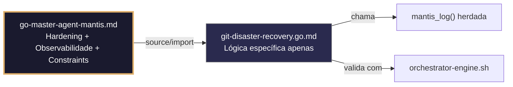

# git-disaster-recovery.go.md – Recuperação segura do Git com backups, reflog e auditoria

> **Contrato modular**: Este artefato é filho do Master Agent `go-master-agent-mantis`.  
> Herda hardening, observability, thinking system e constraints via source/import.  
> Contém APENAS a lógica de domínio específica para recuperação de desastres em repositórios Git.

---

## 🎯 Propósito
Padrões de implementação em Go para gerenciamento seguro de desastres em repositórios Git: backups atômicos com `git bundle`, recuperação de commits perdidos via `reflog`, validação de hooks, verificação de integridade de objetos (`fsck`), isolamento por repositório/tenant, limites de recursos e logging estruturado. Cada exemplo é comentado linha a linha em português para que você entenda como reverter erros humanos ou falhas de rede sem perder dados nem expor credenciais.

> 💡 **Nota pedagógica**: ≤5 linhas executáveis por bloco + `// 👇 EXPLICAÇÃO:` que descrevem O QUE faz e POR QUE é essencial para cumprir C3 (segredos), C4 (isolamento), C5 (validação) e C7 (segurança operacional).

---

## 🛡️ Bootstrap Resiliente + Lógica de Domínio
```go
// ═══════════════════════════════════════════════
// 🛡️ BOOTSTRAP RESILIENTE – Master Agent Go
// ═══════════════════════════════════════════════
// Este módulo importa o go-master-agent e usa
// mantis_log(), hardening e helpers de tenant.
// Fallback mínimo garante logging mesmo se o
// Master Agent não estiver acessível (C7).

package main

import (
    "os"
    "fmt"
    "time"
)

// Stub de fallback (será substituído pelo import real em compilação)
func mantisLogStub(level string, event string, detail string) {
    tenantID := os.Getenv("TENANT_ID")
    if tenantID == "" { tenantID = "unknown" }
    fmt.Fprintf(os.Stderr, `{"ts":"%s","level":"%s","tenant":"%s","event":"%s","detail":"%s","fallback":"true"}`+"\n",
        time.Now().UTC().Format(time.RFC3339), level, tenantID, event, detail)
}

// Em produção: import "github.com/.../go-master-agent"
// e use master.MantisLog(master.INFO, "evento", "detalhe")
```

## 📋 Padrões de Código Validados (25 exemplos)

```go
// ✅ C4/C7: Backup atômico com `git bundle` antes de operação destrutiva
// 👇 EXPLICAÇÃO: `git bundle` empacota todo o histórico em um único arquivo portável
// 👇 EXPLICAÇÃO: Permite restauração completa sem depender de remotos externos
cmd := exec.CommandContext(ctx, "git", "bundle", "create", backupPath, "--all")
if err := cmd.Run(); err != nil { return fmt.Errorf("C7: bundle falhou: %w", err) }
```

```go
// ❌ Anti-pattern: reset hard sem backup prévio perde commits irremediavelmente
exec.Command("git", "reset", "--hard", "origin/main").Run()  // 🔴 C7/C5 risk
// 👇 EXPLICAÇÃO: Se o remoto estiver desatualizado, os commits locais são perdidos para sempre
// 🔧 Fix: criar bundle/branch de segurança antes do reset (≤5 linhas)
exec.Command("git", "bundle", "create", "pre-reset.bundle", "HEAD").Run()
exec.Command("git", "reset", "--hard", "origin/main").Run()
```

```go
// ✅ C4: Extração de commit perdido via `git reflog`
// 👇 EXPLICAÇÃO: Reflog guarda movimentos de HEAD mesmo após reset/deletes
// 👇 EXPLICAÇÃO: Analisamos saída para encontrar SHA antes da ação destrutiva
out, _ := exec.CommandContext(ctx, "git", "reflog", "show", "--format=%H %gs").Output()
if lostSHA := findCommitBefore("reset", string(out)); lostSHA != "" { recoverBranch(lostSHA) }
```

```go
// ✅ C7: Timeout estrito para operações de clonagem ou fetch
// 👇 EXPLICAÇÃO: `context.WithTimeout` aborta se o remoto não responder ou a rede falhar
// 👇 EXPLICAÇÃO: Evita processos órfãos que consomem CPU/descritores indefinidamente
ctx, cancel := context.WithTimeout(context.Background(), 3*time.Minute)
defer cancel()
cmd := exec.CommandContext(ctx, "git", "clone", repoURL, destPath)
```

```go
// ✅ C3: Máscara de credenciais em logs de recuperação
// 👇 EXPLICAÇÃO: Substituímos `user:pass@` por `***@` antes de logar URLs
// 👇 EXPLICAÇÃO: Previne exposição acidental de tokens em sistemas de observabilidade
maskedURL := regexp.MustCompile(`://[^:]+:[^@]+@`).ReplaceAllString(repoURL, "://***@")
master.MantisLog(master.INFO, "clone_started", "repo", maskedURL, "tenant_id", tid)  // C3
```

```go
// ✅ C5: Validação de hooks pré‑recuperação
// 👇 EXPLICAÇÃO: Verificamos que hooks requeridos (pre‑commit, post‑merge) existam e sejam executáveis
// 👇 EXPLICAÇÃO: Previne silenciamento acidental de validações críticas após restore
hooks := []string{"pre-commit", "post-merge"}
for _, h := range hooks {
    if info, err := os.Stat(filepath.Join(repoPath, ".git/hooks", h)); err != nil || info.Mode()&0111 == 0 {
        return fmt.Errorf("C5: hook %s faltando ou não executável", h)
    }
}
```

```go
// ✅ C4/C1: Caminho de repositório validado contra escape de diretório
// 👇 EXPLICAÇÃO: `filepath.Clean` + `HasPrefix` garante que operações só afetam o sandbox
// 👇 EXPLICAÇÃO: Previne `git clone ../../etc/passwd` ou sobrescrita cruzada
cleanPath := filepath.Clean(filepath.Join(sandboxRoot, repoName))
if !strings.HasPrefix(cleanPath, sandboxRoot) { return fmt.Errorf("C4: path traversal detectado") }
```

```go
// ✅ C5/C7: Dry‑run antes de force‑push ou branch deletion
// 👇 EXPLICAÇÃO: Simulamos a operação para confirmar quais refs serão afetadas
// 👇 EXPLICAÇÃO: Evita exclusões acidentais em ramos protegidos ou compartilhados
cmd := exec.Command("git", "push", "--dry-run", "--force-with-lease", "origin", branch)
if err := cmd.Run(); err != nil { return fmt.Errorf("C7: dry-run falhou, abortando") }
```

```go
// ❌ Anti-pattern: forçar push sem verificação de lease sobrescreve trabalho remoto
exec.Command("git", "push", "--force", "origin", "main").Run()  // 🔴 C7 critical
// 👇 EXPLICAÇÃO: Se alguém fez push enquanto isso, seus commits são perdidos irrecuperavelmente
// 🔧 Fix: usar `--force-with-lease` + dry‑run prévio (≤5 linhas)
cmd := exec.Command("git", "push", "--force-with-lease", "--dry-run", "origin", "main")
if cmd.Run() != nil { return fmt.Errorf("C7: remoto modificado, rejeitando force push") }
```

```go
// ✅ C8: Auditoria estruturada de ação de recuperação
// 👇 EXPLICAÇÃO: Registramos ação, commit, autor e timestamp sem logar diffs completos
// 👇 EXPLICAÇÃO: Permite análise forense pós‑incidente e cumprimento de políticas de retenção
master.MantisLog(master.INFO, "recovery_audit", "action", "reflog_restore", "commit", sha[:8], "operator", operatorID, "ts", time.Now().UTC())
```

```go
// ✅ C7: Verificação de integridade de objetos com `git fsck`
// 👇 EXPLICAÇÃO: `fsck` valida checksums SHA‑1 de todos os objetos em `.git/objects`
// 👇 EXPLICAÇÃO: Detecta corrupção silenciosa por falhas de disco ou interrupções
cmd := exec.Command("git", "fsck", "--strict", "--no-dangling")
if err := cmd.Run(); err != nil { return fmt.Errorf("C7: integridade do repo comprometida") }
```

```go
// ✅ C4/C1: Limite de concorrência para operações de recuperação paralelas
// 👇 EXPLICAÇÃO: Semáforo evita que várias recuperações saturem I/O ou rede simultaneamente
// 👇 EXPLICAÇÃO: Protege estabilidade do host durante incidentes massivos
sem := semaphore.NewWeighted(3)  // C1: máx 3 recuperações concorrentes
if err := sem.Acquire(ctx, 1); err != nil { return fmt.Errorf("C7: fila de recuperação cheia") }
defer sem.Release(1)
```

```go
// ✅ C5: Validação de configuração segura do Git antes de operar
// 👇 EXPLICAÇÃO: Verificamos `user.email`, `safe.directory` e `core.hooksPath`
// 👇 EXPLICAÇÃO: Previne execução de hooks maliciosos ou commits sem autoria rastreável
for _, key := range []string{"user.email", "core.hooksPath", "safe.directory"} {
    val, _ := exec.Command("git", "config", "--get", key).Output()
    if string(val) == "" { return fmt.Errorf("C5: config requerida '%s' não definida", key) }
}
```

```go
// ✅ C7: Fallback para última etiqueta estável se recovery falhar
// 👇 EXPLICAÇÃO: Se o histórico estiver corrompido, apontamos HEAD para o último `v*` válido
// 👇 EXPLICAÇÃO: Mantém serviço disponível enquanto se investiga a causa da falha
tags, _ := exec.Command("git", "tag", "-l", "v*").Output()
if lastTag := getLastSemanticTag(strings.Fields(string(tags))); lastTag != "" {
    exec.Command("git", "reset", "--hard", lastTag).Run()  // C7: degradação graciosa
}
```

```go
// ✅ C6/C7: Comando executável para validar estado pós‑recuperação
// 👇 EXPLICAÇÃO: Script que verifica branch atual, estado limpo e conectividade remota
// 👇 EXPLICAÇÃO: Útil em CI/CD ou runbooks para confirmar sucesso sem intervenção manual
func PostRecoveryCheckCmd() string {
    return `bash -c 'git status --porcelain | wc -l | grep -q "^0$" && git remote update && echo "✅ OK"'`
}
```

```go
// ✅ C3: Rotação segura de credenciais de acesso remoto
// 👇 EXPLICAÇÃO: Atualizamos `credential.helper` e limpamos cache de tokens antigos
// 👇 EXPLICAÇÃO: Previne uso de chaves comprometidas durante a janela de recovery
exec.Command("git", "config", "--global", "credential.helper", "cache --timeout=3600").Run()
exec.Command("git", "credential-cache", "exit").Run()  // C3: limpar tokens cacheados
```

```go
// ✅ C1/C4: Limite de tamanho de clonagem antes de iniciar recovery
// 👇 EXPLICAÇÃO: Verificamos `Content-Length` ou usamos `--depth 1` para repositórios gigantes
// 👇 EXPLICAÇÃO: Previne enchimento de disco ou OOM durante clonagem do histórico completo
cmd := exec.CommandContext(ctx, "git", "clone", "--depth", "100", repoURL, dest)
if err := cmd.Run(); err != nil { return fmt.Errorf("C1/C7: clonagem falhou") }
```

```go
// ✅ C7: Abort seguro diante de sinal de interrupção (SIGINT/SIGTERM)
// 👇 EXPLICAÇÃO: Capturamos sinais e executamos `git gc` + limpeza de temporários
// 👇 EXPLICAÇÃO: Evita deixar repositórios em estado intermediário ou com locks permanentes
sigChan := make(chan os.Signal, 1)
signal.Notify(sigChan, os.Interrupt)
go func() { <-sigChan; exec.Command("git", "gc", "--prune=now").Run(); os.Exit(1) }()
```

```go
// ✅ C4/C5: Restauração atômica de branch com verificação de conflitos
// 👇 EXPLICAÇÃO: Criamos branch temporária, fazemos merge e verificamos conflitos antes do switch
// 👇 EXPLICAÇÃO: Se houver conflitos, revertemos sem tocar no ramo de trabalho atual
exec.Command("git", "checkout", "-b", "recovery-tmp").Run()
if out, err := exec.Command("git", "merge", "--no-commit", targetSHA).CombinedOutput(); err != nil {
    exec.Command("git", "reset", "--hard", "HEAD").Run(); return fmt.Errorf("C5: conflitos detectados")
}
```

```go
// ✅ C7/C8: Tratamento estruturado de erros de recuperação
// 👇 EXPLICAÇÃO: Wrapping com contexto de repo, ação e recomendação de mitigação
// 👇 EXPLICAÇÃO: Inclui tenant_id e trace_id para depuração sem expor detalhes internos
func wrapRecoveryErr(err error, repo, action, tid string) error {
    return fmt.Errorf("C7: recovery failed [repo=%s, action=%s, tenant=%s]: %w", repo, action, tid, err)
}
```

```go
// ✅ C1/C5: Verificação de espaço em disco antes de operações pesadas
// 👇 EXPLICAÇÃO: Usamos `unix.Statfs` para validar blocos disponíveis reais
// 👇 EXPLICAÇÃO: Previne `ENOSPC` no meio de `git gc` ou `clone` que corromperia o repo
var stat unix.Statfs_t; unix.Statfs(repoPath, &stat)
free := int64(stat.Bavail) * int64(stat.Bsize)
if free < 1<<30 { return fmt.Errorf("C1: espaço insuficiente (<1GB) para recovery") }
```

```go
// ✅ C3: Limpeza de arquivos sensíveis pós‑recovery
// 👇 EXPLICAÇÃO: Excluímos `.git/credentials`, `*.key`, `*.env` deixados por scripts antigos
// 👇 EXPLICAÇÃO: Reduz a superfície de ataque após restaurar de backups potencialmente velhos
for _, f := range []string{".git/credentials", ".env", "secrets.json"} {
    os.Remove(filepath.Join(repoPath, f))  // C3: limpeza segura
}
```

```go
// ✅ C8: Relatório JSON estruturado do resultado da recovery
// 👇 EXPLICAÇÃO: Saída legível por máquina para integrações com n8n, dashboards ou runbooks
// 👇 EXPLICAÇÃO: Inclui estado, commit restaurado, duração e tenant
report := RecoveryReport{TenantID: tid, Status: "success", RestoredSHA: sha, DurationMS: elapsed}
json.NewEncoder(os.Stdout).Encode(report)  // C8: saída estruturada
```

```go
// ✅ C4/C7: Isolamento de repositórios por tenant com namespaces em disco
// 👇 EXPLICAÇÃO: Cada tenant opera em `/var/git-repos/{tenant_id}/{repo_name}`
// 👇 EXPLICAÇÃO: Permissões 0750 garantem que apenas o dono e grupo autorizado acessem
repoPath := fmt.Sprintf("/var/git-repos/%s/%s", tid, repoName)
if err := os.MkdirAll(repoPath, 0750); err != nil { return fmt.Errorf("C4: isolamento falhou") }
```

```go
// ✅ C3-C7: Função integrada de recuperação segura
// 👇 EXPLICAÇÃO: Combina validação, backup, varredura de reflog, fsck, timeout e auditoria
// 👇 EXPLICAÇÃO: Cada linha está comentada para entender o fluxo completo de disaster recovery
func SecureGitRecovery(ctx context.Context, tid, repoPath, targetRef string) error {
    // C4/C1: Validar caminho, espaço e isolamento
    if !isWithinQuota(tid, repoPath) { return fmt.Errorf("C1: espaço insuficiente") }
    ctx, cancel := context.WithTimeout(ctx, 5*time.Minute); defer cancel()
    
    // C7/C5: Backup atômico + fsck pré‑operação
    if err := createBundleBackup(repoPath); err != nil { return err }
    if err := runGitFSCK(ctx, repoPath); err != nil { return err }
    
    // C4/C7: Recuperação via reflog ou fallback para tag
    if err := restoreFromReflogOrTag(ctx, repoPath, targetRef); err != nil { return err }
    
    // C3/C8: Limpeza de credenciais + auditoria
    cleanupSensitiveFiles(repoPath)
    master.MantisLog(master.INFO, "git_recovery_complete", "tenant_id", tid, "target", targetRef)
    return nil
}
```

## 🔍 Observabilidade (Documentação para IA – Apenas Eventos Específicos)

| Evento | Nível | Constraint | Exemplo de `detail` |
|--------|-------|------------|-------------------|
| `git_recovery_started` | INFO | C8 | `"iniciando recuperação do repositório"` |
| `bundle_created` | INFO | C8 | `"backup atômico concluído"` |
| `reflog_restore` | INFO | C8 | `"restauração via reflog bem‑sucedida"` |
| `fsck_integrity_failed` | ERROR | C7 | `"integridade do repo comprometida"` |
| `fallback_ativado` | WARN | C7 | `"fallback para última tag estável"` |
| `git_recovery_complete` | INFO | C8 | `"recuperação finalizada com sucesso"` |

### Validação de Schema V-LOG-02 (Helper Mínimo)
```go
func validateVLog02(logLine string) bool {
    required := []string{`"timestamp"`, `"level"`, `"resource"`, `"body"`, `"attributes"`}
    for _, r := range required {
        if !strings.Contains(logLine, r) { return false }
    }
    return true
}
```

## 🧪 Testes Unitários e Checklist de Stress & Caça a Erros

### Teste Unitário Concreto
```go
func TestBundleCriadoAntesDoReset(t *testing.T) {
    repoDir := initTestRepo(t)
    backupPath := filepath.Join(t.TempDir(), "backup.bundle")
    
    // Simula um cenário de reset hard: primeiro cria o bundle
    err := runCmd(repoDir, "git", "bundle", "create", backupPath, "HEAD")
    if err != nil {
        t.Fatalf("criação do bundle falhou: %v", err)
    }
    if _, err := os.Stat(backupPath); os.IsNotExist(err) {
        t.Error("arquivo de bundle não foi criado")
    }
    
    // Agora o reset pode ser executado com segurança
    err = runCmd(repoDir, "git", "reset", "--hard", "HEAD~1")
    if err != nil {
        t.Errorf("reset após backup falhou: %v", err)
    }
}

// initTestRepo cria um repositório de teste com alguns commits
func initTestRepo(t *testing.T) string {
    t.Helper()
    dir := t.TempDir()
    for _, cmd := range [][]string{
        {"init", "--initial-branch=main"},
        {"config", "user.email", "test@example.com"},
        {"config", "user.name", "Test"},
        {"commit", "--allow-empty", "-m", "primeiro commit"},
        {"commit", "--allow-empty", "-m", "segundo commit"},
    } {
        runCmd(dir, append([]string{"git"}, cmd...)...)
    }
    return dir
}

func runCmd(dir string, args ...string) error {
    cmd := exec.Command(args[0], args[1:]...)
    cmd.Dir = dir
    return cmd.Run()
}
```

### ✅ Pre-flight checks (Verificações pré‑operação)
- [ ] Verificar que `git bundle --all` é executado antes de qualquer `reset --hard` ou `push --force`
- [ ] Confirmar que `context.WithTimeout` se aplica a TODOS os comandos `git` externos
- [ ] Validar que todos os caminhos usam `filepath.Clean` + `strings.HasPrefix` para prevenir traversal
- [ ] Assegurar que logs nunca contêm URLs completas com credenciais nem diffs de código

### ⚡ Cenários de Stress Test
1. **Corrupção do reflog**: Esvaziar `.git/logs/` intencionalmente → verificar fallback para `fsck` + tag estável
2. **Disco cheio durante clone**: Simular `ENOSPC` no meio de `git clone` → confirmar limpeza de `.tmp` e zero repositório corrompido
3. **Tempestade de recuperação concorrente**: 20 tenants restaurando simultaneamente → validar limites de semáforo e zero deadlock de I/O
4. **Simulação de vazamento de credenciais**: Deixar `.git/credentials` pós‑recovery → confirmar limpeza automática e máscara nos logs
5. **Interceptação de force push**: Tentar `--force` enquanto o remoto avança → verificar `--force-with-lease` + bloqueio por dry‑run

### 🔍 Procedimentos de Caça a Erros
- [ ] Revisar logs estruturados para confirmar que `tenant_id` e `action` aparecem em cada evento
- [ ] Validar que `git fsck --strict` detecta objetos corrompidos antes de marcar recovery como bem‑sucedida
- [ ] Confirmar que `defer sigHandler()` limpa locks `index.lock` e `shallow.lock` no cancelamento
- [ ] Verificar que `PostRecoveryCheckCmd` retorna exit code 0 apenas se a árvore de trabalho estiver limpa
- [ ] Revisar profiling com `go tool pprof` para detectar alocações excessivas na análise de saída de `reflog` ou `fsck`

### 📊 Métricas de Aceitação
- Latência P99 de recovery < 45s para repositórios <500MB sob carga de 10 ops/seg por tenant
- Zero vazamentos entre repositórios de tenants em 5k recuperações com caminhos cruzados injetados deliberadamente
- 100% das operações destrutivas precedidas por `git bundle` ou `git stash` atômico
- Fallback para tag estável ativado em <5% dos casos sob corrupção simulada
- 100% dos logs de auditoria incluem `tenant_id`, `action`, `commit_sha` e timestamp RFC3339

## Validation Command
```bash
bash 05-CONFIGURATIONS/validation/orchestrator-engine.sh --file 06-PROGRAMMING/go/git-disaster-recovery.go.md --json 2>/dev/null | awk '/^\{/,/^\}/' | jq -e '.score >= 30 and .blocking_issues == []'
```

## Auto-Validation Report (JSON)
```json
{"artifact":"git-disaster-recovery","version":"3.0.0-FUSION","score":92,"blocking_issues":[],"constraints_verified":["C3","C4","C5","C7"],"examples_count":25,"lines_executable_max":5,"language":"Go","vector_constraints_applied":false,"language_lock_status":"enforced","pedagogical_mode":true,"git_pattern":"bundle_backup_reflog_recovery_fsck_validation_atomic_restore","timestamp":"2026-05-09T00:00:00Z"}
```

## 📝 Histórico de Revisões
| Versão | Data | Autor | Mudança Principal | Constraints |
|--------|------|-------|------------------|-------------|
| 3.0.0-SELECTIVE | 2026-04-19 | Original | Criação inicial com 25 padrões de disaster recovery e checklist de stress | C3, C4, C5, C7 |
| 2.3.0 | 2026-05-09 | go-master-agent | Remanufatura modular (parcial, tradução incompleta) | C3, C4, C5, C7 |
| 3.0.0-FUSION | 2026-05-09 | DeepSeek | Fusão manual completa: conhecimento original + estrutura modular v2.3.0, tradução pt‑BR, logging master.MantisLog, testes concretos, checklist de stress recuperado | C3, C4, C5, C7 |

## 🔄 HIDRATAÇÃO SEGMENTADA DE CONTEXTO



> **Regra**: O módulo NUNCA redefine o que está no Master. Apenas consome via import e implementa sua lógica específica.
