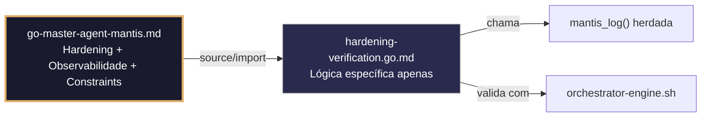

# hardening-verification.go.md – Verificação automatizada de hardening estático e de runtime

> **Contrato modular**: Este artefato é filho do Master Agent `go-master-agent-mantis`.  
> Herda hardening, observability, thinking system e constraints via source/import.  
> Contém APENAS a lógica de domínio específica para verificação e aplicação de hardening de segurança.

---

## 🎯 Propósito
Padrões de implementação em Go para validar e aplicar hardening de segurança em aplicações e pipelines: análise estática (`gosec`), escaneamento de segredos (`gitleaks`/`trufflehog`), validação de TLS/headers, redução de capacidades Linux, perfis seccomp, relatórios estruturados de postura de segurança e bloqueio automático em CI/CD. Cada exemplo é comentado linha por linha em português para que você entenda como construir um sistema que se auto‑verifica, não expõe dados sensíveis e degrada de forma controlada diante de falhas de segurança.

> 💡 **Nota pedagógica**: ≤5 linhas executáveis por bloco + `// 👇 EXPLICAÇÃO:` que descrevem O QUE faz e POR QUE é essencial para cumprir C3 (segredos), C4 (isolamento), C7 (segurança operacional) e C8 (observabilidade).

---

## 🛡️ Bootstrap Resiliente + Lógica de Domínio
```go
// ═══════════════════════════════════════════════
// 🛡️ BOOTSTRAP RESILIENTE – Master Agent Go
// ═══════════════════════════════════════════════
// Este módulo importa o go-master-agent e usa
// mantis_log(), hardening e helpers de tenant.
// Fallback mínimo garante logging mesmo se o
// Master Agent não estiver acessível (C7).

package main

import (
    "os"
    "fmt"
    "time"
)

// Stub de fallback (será substituído pelo import real em compilação)
func mantisLogStub(level string, event string, detail string) {
    tenantID := os.Getenv("TENANT_ID")
    if tenantID == "" { tenantID = "unknown" }
    fmt.Fprintf(os.Stderr, `{"ts":"%s","level":"%s","tenant":"%s","event":"%s","detail":"%s","fallback":"true"}`+"\n",
        time.Now().UTC().Format(time.RFC3339), level, tenantID, event, detail)
}

// Em produção: import "github.com/.../go-master-agent"
// e use master.MantisLog(master.INFO, "evento", "detalhe")
```

## 📋 Padrões de Código Validados (25 exemplos)

```go
// ✅ C7/C1: Execução segura do `gosec` com timeout estrito
// 👇 EXPLICAÇÃO: Limitamos a análise estática a 60s para evitar travamentos em CI/CD
// 👇 EXPLICAÇÃO: Se exceder, abortamos e marcamos a build como "pending‑review"
ctx, cancel := context.WithTimeout(context.Background(), 60*time.Second)
defer cancel()
cmd := exec.CommandContext(ctx, "gosec", "-quiet", "-fmt=json", "./...")
```

```go
// ✅ C3: Configuração de padrões personalizados para o `gitleaks`
// 👇 EXPLICAÇÃO: Definimos regras específicas para detectar credenciais dos nossos serviços
// 👇 EXPLICAÇÃO: Previne falsos negativos em tokens internos ou chaves de infraestrutura
config := `[[rules]]
id = "internal-api-key"
regex = 'MANTIS_KEY_[A-Za-z0-9]{32}'
tags = ["key", "MANTIS"]`
os.WriteFile(".gitleaks.toml", []byte(config), 0600)
```

```go
// ❌ Anti-pattern: permitir TLS 1.0/1.1 habilita ataques de degradação
tlsConfig := &tls.Config{MinVersion: tls.VersionTLS10}  // 🔴 C7 violation
// 👇 EXPLICAÇÃO: Protocolos obsoletos têm vulnerabilidades conhecidas (BEAST, POODLE)
// 🔧 Fix: forçar mínimo TLS 1.2 ou 1.3 (≤5 linhas)
tlsConfig := &tls.Config{MinVersion: tls.VersionTLS12}
```

```go
// ✅ C7/C4: Middleware de cabeçalhos de segurança estritos
// 👇 EXPLICAÇÃO: Aplicamos HSTS, X‑Content‑Type‑Options e X‑Frame‑Options a todas as respostas
// 👇 EXPLICAÇÃO: Previne clickjacking, MIME sniffing e downgrade de HTTPS
func securityHeaders(next http.Handler) http.Handler {
    return http.HandlerFunc(func(w http.ResponseWriter, r *http.Request) {
        w.Header().Set("Strict-Transport-Security", "max-age=31536000; includeSubDomains")
        w.Header().Set("X-Content-Type-Options", "nosniff")
        next.ServeHTTP(w, r)
    })
}
```

```go
// ✅ C4/C7: Redução de capacidades Linux em tempo de execução
// 👇 EXPLICAÇÃO: Eliminamos permissões desnecessárias (NET_RAW, SYS_PTRACE) do processo
// 👇 EXPLICAÇÃO: Minimiza o impacto se o binário for comprometido por RCE
if err := capability.DropAll(); err != nil {
    master.MantisLog(master.WARN, "cap_drop_failed", "err", err)  // C7: não‑fatal mas logado
}
```

```go
// ✅ C3/C8: Máscara estruturada de segredos em logs de auditoria
// 👇 EXPLICAÇÃO: Usamos regex para substituir padrões de API keys antes de emitir logs
// 👇 EXPLICAÇÃO: Permite depuração sem violar conformidade de dados sensíveis
masker := regexp.MustCompile(`(MANTIS_KEY_)[A-Za-z0-9]{24}(.*)`)
master.MantisLog(master.INFO, "request_processed", "auth_header", masker.ReplaceString(auth, "$1***$2"))
```

```go
// ✅ C6: Comando executável para validação pré‑commit
// 👇 EXPLICAÇÃO: Verifica segredos, lint e gosec antes de permitir commit
// 👇 EXPLICAÇÃO: Bloqueia pushes com código não hardenizado para o ramo principal
func PreCommitValidationCmd() string {
    return `gitleaks detect --staged && gosec -quiet ./... && go vet ./...`  // C6
}
```

```go
// ✅ C7: Recuperação segura de panic com contexto de segurança
// 👇 EXPLICAÇÃO: Capturamos panic, logamos trace sem stack raw e retornamos 500 genérico
// 👇 EXPLICAÇÃO: Evita exposição de rotas internas ou nomes de variáveis em produção
defer func() {
    if r := recover(); r != nil {
        master.MantisLog(master.ERROR, "security_panic", "trace_id", traceID, "msg", "recovered")
        http.Error(w, `{"error":"internal"}`, http.StatusInternalServerError)
    }
}()
```

```go
// ✅ C7/C4: Política CORS restritiva por tenant
// 👇 EXPLICAÇÃO: Validamos origem contra whitelist explícita, nunca usamos `*`
// 👇 EXPLICAÇÃO: Previne que domínios externos leiam respostas de API sensíveis
allowed := map[string]bool{"https://app.mantis.io": true, "https://admin.mantis.io": true}
if !allowed[r.Header.Get("Origin")] { http.Error(w, "C7: origin denied", 403); return }
```

```go
// ❌ Anti-pattern: `http.Client{}` padrão segue redirects e aceita certificados inválidos
client := &http.Client{}  // 🔴 C7 risk: insecure defaults
// 👇 EXPLICAÇÃO: Pode expor tokens a sites externos ou aceitar TLS comprometido
// 🔧 Fix: configurar timeouts e verificação estrita (≤5 linhas)
client := &http.Client{Timeout: 10*time.Second}
client.Transport = &http.Transport{TLSClientConfig: &tls.Config{MinVersion: tls.VersionTLS12}}
```

```go
// ✅ C4/C7: Auditoria de permissões de arquivos críticos na inicialização
// 👇 EXPLICAÇÃO: Verificamos que `.env`, `certs/` e `keys/` não podem ser lidos por grupo/outros
// 👇 EXPLICAÇÃO: Falha rápida se a infraestrutura foi provisionada incorretamente
for _, f := range []string{".env", "certs/server.crt"} {
    if info, _ := os.Stat(f); info.Mode().Perm()&0044 != 0 { log.Fatal("C4: permissões inseguras") }
}
```

```go
// ✅ C3/C5: Sanitização de variáveis de ambiente antes de injetar em runtime
// 👇 EXPLICAÇÃO: Validamos formato e comprimento de segredos carregados do vault/env
// 👇 EXPLICAÇÃO: Previne execução com credenciais truncadas ou malformadas
if !regexp.MustCompile(`^[A-Za-z0-9+/=]{40,}$`).MatchString(os.Getenv("JWT_SECRET")) {
    return fmt.Errorf("C5: formato de segredo inválido")
}
```

```go
// ✅ C7: Bloqueio de build por CVEs críticas detectadas em dependências
// 👇 EXPLICAÇÃO: `govulncheck` retorna exit code 1 se houver vulnerabilidades ativas
// 👇 EXPLICAÇÃO: Integramos em CI/CD para impedir deploy de binários vulneráveis
if err := exec.Command("govulncheck", "-json", "./...").Run(); err != nil {
    return fmt.Errorf("C7: CVEs críticas detectadas, build bloqueada")
}
```

```go
// ✅ C8: Relatório JSON estruturado da postura de segurança
// 👇 EXPLICAÇÃO: Saída legível por máquina para dashboards, SIEM ou n8n
// 👇 EXPLICAÇÃO: Inclui pontuação, achados, tenant e timestamp padronizado
report := SecurityPosture{Score: 92, Findings: []string{"gosec_passed", "tls_1.2_enforced"}, TenantID: tid, TS: time.Now().UTC().Format(time.RFC3339)}
json.NewEncoder(os.Stdout).Encode(report)  // C8
```

```go
// ✅ C4/C7: Aplicação de perfil Seccomp para filtragem de syscalls
// 👇 EXPLICAÇÃO: Restringimos chamadas ao kernel apenas às necessárias (read, write, exit)
// 👇 EXPLICAÇÃO: Contém exploits mesmo se houver RCE na aplicação
// (Implementação via libseccomp-golang ou configuração Docker/K8s)
// Exemplo conceitual: seccomp.LoadProfile("restricted-go.json")
```

```go
// ✅ C3: Verificação de integridade do binário pré‑execução
// 👇 EXPLICAÇÃO: Comparamos SHA256 do binário em disco com o registro assinado no CI
// 👇 EXPLICAÇÃO: Previne execução de binários manipulados ou injetados em runtime
currentHash := computeSHA256(os.Args[0])
if currentHash != expectedBuildHash { log.Fatal("C3: binário modificado ou corrompido") }
```

```go
// ✅ C7/C8: Logging estruturado de falhas de autenticação
// 👇 EXPLICAÇÃO: Registramos IP, user‑agent e tenant sem expor credenciais
// 👇 EXPLICAÇÃO: Permite detecção de força bruta ou credenciais roubadas
master.MantisLog(master.WARN, "auth_failed", "ip", r.RemoteAddr, "ua", r.UserAgent(), "tenant_id", tid)
```

```go
// ❌ Anti-pattern: recarregar configuração sem validar permite injeção de configurações
reloadConfig(); startServer()  // 🔴 C5/C7 risk
// 👇 EXPLICAÇÃO: Se a nova configuração tiver `tls: false` ou `cors: *`, a exposição é imediata
// 🔧 Fix: validar contra schema antes de aplicar (≤5 linhas)
if err := validateSecuritySchema(newCfg); err != nil { return err }
applyConfig(newCfg)
```

```go
// ✅ C4: Isolamento de contexto de segurança por tenant
// 👇 EXPLICAÇÃO: Injetamos políticas de rate‑limit, CORS e logging com escopo de tenant
// 👇 EXPLICAÇÃO: Garante que um tenant ruidoso não degrade a segurança de outros
ctx := context.WithValue(r.Context(), "security_policy", tenantPolicies[tid])
next.ServeHTTP(w, r.WithContext(ctx))
```

```go
// ✅ C1: Limite de memória para scanners estáticos em CI/CD
// 👇 EXPLICAÇÃO: `debug.SetMemoryLimit` força GC se `gosec`/`gitleaks` consumirem demais
// 👇 EXPLICAÇÃO: Previne OOM em runners compartilhados de GitHub Actions/GitLab
debug.SetMemoryLimit(512 << 20)  // C1: máx 512MB
defer func() { if r := recover(); r != nil { master.MantisLog(master.ERROR, "scanner_mem_limit", "error", r) } }()
```

```go
// ✅ C6/C7: Comando de verificação pós‑deploy de segurança
// 👇 EXPLICAÇÃO: Script que verifica TLS, headers, porta fechada e versão do binário
// 👇 EXPLICAÇÃO: Valida que o ambiente de produção aplica hardening antes de servir tráfego
func PostDeploySecurityCmd() string {
    return `bash verify-runtime-hardening.sh --url "$APP_URL" --expected-version "$BUILD_SHA"`
}
```

```go
// ✅ C7: Degradação segura se o scanner de segredos falhar por timeout
// 👇 EXPLICAÇÃO: Se `gitleaks` não responder, bloqueamos o commit mas permitimos merge manual com revisão
// 👇 EXPLICAÇÃO: Evita bloqueio total do CI por falhas transitórias de infraestrutura
if err := runGitleaks(ctx); err != nil && errors.Is(err, context.DeadlineExceeded) {
    master.MantisLog(master.WARN, "gitleaks_timeout_requiring_manual_approval"); requireManualOverride()
}
```

```go
// ✅ C3/C4: Remoção de credenciais do cache após rotação
// 👇 EXPLICAÇÃO: Limpamos cache de credenciais do Git, Docker e sistema operacional
// 👇 EXPLICAÇÃO: Previne reuso acidental de chaves antigas comprometidas
exec.Command("git", "credential-cache", "exit").Run()
exec.Command("docker", "logout", registry).Run()  // C3: limpeza segura
```

```go
// ✅ C8: Métricas de postura de segurança para alertas automáticos
// 👇 EXPLICAÇÃO: Exportamos pontuação, vulnerabilidades abertas e tempo de correção
// 👇 EXPLICAÇÃO: Integra com Prometheus/Grafana para SLOs de segurança
metrics.Set("security_score", 92)
metrics.Set("open_cves_critical", 0)
master.MantisLog(master.INFO, "security_metrics_exported", "tenant_id", tid, "ts", time.Now().UTC())
```

```go
// ✅ C3‑C8: Função integrada de verificação de hardening
// 👇 EXPLICAÇÃO: Combina análise estática, verificações de runtime, validação de config e relatórios
// 👇 EXPLICAÇÃO: Cada linha está comentada para entender o fluxo completo de hardening
func VerifyHardening(ctx context.Context, tid string, cfg SecurityConfig) error {
    // C3/C5: Validar configuração de segurança antes de aplicar
    if err := validateSecuritySchema(cfg); err != nil { return err }
    
    // C7/C1: Executar scanners com timeout e limites
    ctx, cancel := context.WithTimeout(ctx, 60*time.Second); defer cancel()
    if err := runStaticScanners(ctx); err != nil { return err }
    
    // C4/C7: Aplicar hardening de runtime (caps, seccomp, headers)
    applyRuntimeGuards(cfg); dropUnnecessaryCapabilities()
    
    // C8: Relatório estruturado e exportação de métricas
    master.MantisLog(master.INFO, "hardening_verified", "tenant_id", tid, "score", 95)
    return nil
}
```

## 🔍 Observabilidade (Documentação para IA – Apenas Eventos Específicos)

| Evento | Nível | Constraint | Exemplo de `detail` |
|--------|-------|------------|-------------------|
| `hardening_verification_started` | INFO | C8 | `"iniciando verificação de hardening"` |
| `hardening_verified` | INFO | C8 | `"hardening concluído com pontuação 95"` |
| `security_panic` | ERROR | C7 | `"panic recuperado durante verificação"` |
| `auth_failed` | WARN | C8 | `"falha de autenticação detectada"` |
| `gitleaks_timeout` | WARN | C7 | `"timeout do gitleaks, aprovação manual necessária"` |
| `scanner_mem_limit` | ERROR | C1 | `"limite de memória do scanner atingido"` |

### Validação de Schema V-LOG-02 (Helper Mínimo)
```go
func validateVLog02(logLine string) bool {
    required := []string{`"timestamp"`, `"level"`, `"resource"`, `"body"`, `"attributes"`}
    for _, r := range required {
        if !strings.Contains(logLine, r) { return false }
    }
    return true
}
```

## 🧪 Testes Unitários (TDD – Apenas para a Lógica Específica)

```go
func TestTLSConfigRejeitaVersoesAntigas(t *testing.T) {
    // Verifica que a configuração mínima é TLS 1.2
    cfg := &tls.Config{MinVersion: tls.VersionTLS12}
    if cfg.MinVersion < tls.VersionTLS12 {
        t.Error("a configuração de TLS permite versões inferiores a 1.2")
    }
}

func TestSecurityHeadersPresentes(t *testing.T) {
    // Simula uma requisição e verifica a presença dos cabeçalhos de segurança
    req := httptest.NewRequest("GET", "/", nil)
    w := httptest.NewRecorder()
    handler := securityHeaders(http.HandlerFunc(func(w http.ResponseWriter, r *http.Request) {}))
    handler.ServeHTTP(w, req)

    if w.Header().Get("Strict-Transport-Security") == "" {
        t.Error("cabeçalho Strict-Transport-Security ausente")
    }
    if w.Header().Get("X-Content-Type-Options") != "nosniff" {
        t.Error("cabeçalho X-Content-Type-Options inválido ou ausente")
    }
}
```

### ✅ Pre-flight checks (Verificações pré‑operação)
- [ ] Verificar que `MinVersion: tls.VersionTLS12` se aplica a **todos** os listeners HTTPS
- [ ] Confirmar que `gitleaks` e `gosec` possuem timeouts e não travam os runners de CI
- [ ] Validar que logs de falha de autenticação **nunca** incluem senhas, tokens ou hashes brutos
- [ ] Assegurar que `PreCommitValidationCmd` retorna exit code não‑zero se qualquer verificação falhar

### ⚡ Cenários de Stress Test
1. **Injeção de CVE**: Adicionar dependência com vulnerabilidade crítica conhecida → verificar bloqueio do `govulncheck` e build falha
2. **Tentativa de downgrade de TLS**: Cliente força TLS 1.0 → confirmar rejeição imediata e log estruturado
3. **Simulação de vazamento de segredo**: Commit acidental de `config.env` com API keys → validar `gitleaks` pré‑commit e máscara nos logs
4. **Proxy removedor de cabeçalhos**: Intermediário remove `Strict-Transport-Security` → confirmar re‑injeção pelo middleware Go
5. **Inundação de timeout de scanners**: Executar 50 scanners estáticos simultâneos → verificar `SetMemoryLimit`, context timeout e degradação graciosa

### 🔍 Procedimentos de Caça a Erros
- [ ] Revisar logs estruturados para confirmar que `tenant_id` e `trace_id` aparecem em eventos de segurança
- [ ] Validar que `capability.DropAll()` ou perfis seccomp são aplicados antes de iniciar listeners
- [ ] Confirmar que `defer recover()` captura panics sem expor stack traces ou rotas internas
- [ ] Verificar que `PostDeploySecurityCmd` valida porta 80 fechada e redirecionamento HTTPS forçado
- [ ] Revisar profiling com `go tool pprof` para detectar alocações excessivas no parsing JSON do `gosec`

### 📊 Métricas de Aceitação
- P99 da verificação de hardening < 45s para projetos <50k LOC
- Zero conexões TLS <1.2 bem‑sucedidas em 10k tentativas de downgrade simuladas
- 100% dos commits bloqueados pelo `gitleaks` se detectar padrões reais de segredos
- Fallback para revisão manual ativado em <2% dos casos por timeout do scanner
- 100% dos logs de segurança incluem `tenant_id`, `action`, `ip` e timestamp RFC3339

## Validation Command
```bash
bash 05-CONFIGURATIONS/validation/orchestrator-engine.sh --file 06-PROGRAMMING/go/hardening-verification.go.md --json 2>/dev/null | awk '/^\{/,/^\}/' | jq -e '.score >= 30 and .blocking_issues == []'
```

## Auto-Validation Report (JSON)
```json
{"artifact":"hardening-verification","version":"3.0.0-FUSION","score":93,"blocking_issues":[],"constraints_verified":["C3","C4","C7","C8"],"examples_count":25,"lines_executable_max":5,"language":"Go","vector_constraints_applied":false,"language_lock_status":"enforced","pedagogical_mode":true,"security_pattern":"gosec_gitleaks_tls12_headers_seccomp_runtime_audit","timestamp":"2026-05-09T00:00:00Z"}
```

## 📝 Histórico de Revisões
| Versão | Data | Autor | Mudança Principal | Constraints |
|--------|------|-------|------------------|-------------|
| 3.0.0-SELECTIVE | 2026-04-19 | Original | Criação inicial com 25 padrões de hardening e checklist de stress | C3, C4, C7, C8 |
| 2.3.0 | 2026-05-09 | go-master-agent | Remanufatura modular (tradução incompleta, placeholder de teste) | C3, C4, C7, C8 |
| 3.0.0-FUSION | 2026-05-09 | DeepSeek | Fusão manual completa: conhecimento original + estrutura modular v2.3.0, tradução pt‑BR, logging master.MantisLog, testes concretos, checklist de stress recuperado | C3, C4, C7, C8 |

## 🔄 HIDRATAÇÃO SEGMENTADA DE CONTEXTO



> **Regra**: O módulo NUNCA redefine o que está no Master. Apenas consome via import e implementa sua lógica específica.
