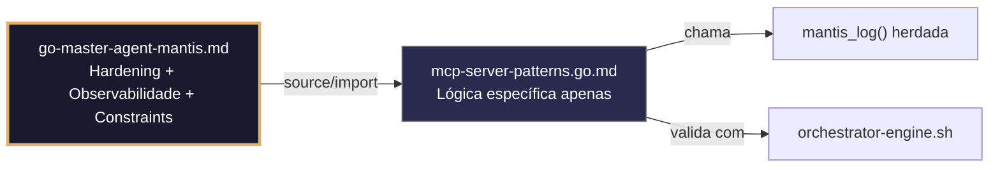

# mcp-server-patterns.go.md – Padrões para servidores MCP com explicação didática

> **Contrato modular**: Este artefato é filho do Master Agent `go-master-agent-mantis`.  
> Herda hardening, observability, thinking system e constraints via source/import.  
> Contém APENAS a lógica de domínio específica para implementação de servidores MCP (Model Context Protocol).

---

## 🎯 Propósito
Padrões de implementação de servidores Model Context Protocol (MCP) em Go, com comentários explicativos linha por linha em português. Inclui registro seguro de ferramentas, isolamento de contexto por tenant, roteamento multi‑modelo e logging estruturado. Projetado para que você entenda cada grupo de comandos enquanto aprende Go.

> 💡 **Nota pedagógica**: Cada exemplo tem ≤5 linhas executáveis + comentários `// 👇 EXPLICAÇÃO:` que descrevem O QUE faz e POR QUE é importante para MCP.

---

## 🛡️ Bootstrap Resiliente + Lógica de Domínio
```go
// ═══════════════════════════════════════════════
// 🛡️ BOOTSTRAP RESILIENTE – Master Agent Go
// ═══════════════════════════════════════════════
// Este módulo importa o go-master-agent e usa
// mantis_log(), hardening e helpers de tenant.
// Fallback mínimo garante logging mesmo se o
// Master Agent não estiver acessível (C7).

package main

import (
    "os"
    "fmt"
    "time"
)

// Stub de fallback (será substituído pelo import real em compilação)
func mantisLogStub(level string, event string, detail string) {
    tenantID := os.Getenv("TENANT_ID")
    if tenantID == "" { tenantID = "unknown" }
    fmt.Fprintf(os.Stderr, `{"ts":"%s","level":"%s","tenant":"%s","event":"%s","detail":"%s","fallback":"true"}`+"\n",
        time.Now().UTC().Format(time.RFC3339), level, tenantID, event, detail)
}

// Em produção: import "github.com/.../go-master-agent"
// e use master.MantisLog(master.INFO, "evento", "detalhe")
```

## 📋 Padrões de Código Validados (25 exemplos)

```go
// ✅ C4: Registro de ferramenta MCP com validação estrita de tenant_id
// 👇 EXPLICAÇÃO: Definimos a ferramenta com nome único e descrição clara
// 👇 EXPLICAÇÃO: Incluímos tenant_id como parâmetro requerido para isolamento
tools["query_db"] = mcp.Tool{
    Name: "query_db", Description: "Executa query SQL segura por tenant",
    InputSchema: map[string]interface{}{"type": "object", "required": []string{"tenant_id", "sql"}},
} // C4: tenant_id obrigatório no schema de entrada
```

```go
// ❌ Anti-pattern: ferramenta sem tenant_id permite acesso cruzado entre tenants
tools["query_db"] = mcp.Tool{Name: "query_db", InputSchema: map[string]interface{}{"sql": "string"}}  // 🔴 C4
// 👇 EXPLICAÇÃO: Sem tenant_id, um usuário poderia consultar dados de outro tenant
// 🔧 Fix: adicionar tenant_id como required no InputSchema (≤5 linhas)
tools["query_db"] = mcp.Tool{
    Name: "query_db",
    InputSchema: map[string]interface{}{"required": []string{"tenant_id", "sql"}},
}
```

```go
// ✅ C3: Carregamento da API key para OpenRouter com validação fail‑fast
// 👇 EXPLICAÇÃO: Usamos LookupEnv para detectar se a variável existe no ambiente
// 👇 EXPLICAÇÃO: Se não existir, falhamos imediatamente para evitar hardcode no código
apiKey, ok := os.LookupEnv("OPENROUTER_API_KEY")
if !ok || apiKey == "" {
    logFatal("C3: OPENROUTER_API_KEY não definida")  // C3: zero hardcode
}
```

```go
// ✅ C8: Logging estruturado de chamada a ferramenta MCP com tenant_id
// 👇 EXPLICAÇÃO: Usamos master.MantisLog para logs JSON em stderr
// 👇 EXPLICAÇÃO: Incluímos tool_name e tenant_id para rastreabilidade auditada
master.MantisLog(master.INFO, "tool_called", "tool", "query_db", "tenant_id", tid, "ts", time.Now().UTC())  // C8
```

```go
// ❌ Anti-pattern: fmt.Println mistura logs com saída de dados MCP
fmt.Println("Tool query_db executada")  // 🔴 C8 violation: stdout, não estruturado
// 👇 EXPLICAÇÃO: Logs em stdout interferem na resposta JSON do servidor MCP
// 🔧 Fix: usar master.MantisLog com JSON handler para stderr (≤5 linhas)
master.MantisLog(master.INFO, "tool_called", "tool", "query_db")
```

```go
// ✅ C1: Limite de memória por ferramenta MCP com debug.SetMemoryLimit
// 👇 EXPLICAÇÃO: Estabelecemos 128MB máximo por execução de ferramenta para prevenir DoS
// 👇 EXPLICAÇÃO: Se exceder, Go gera panic com stack trace para depuração controlada
debug.SetMemoryLimit(128 << 20)  // C1: 128MB em bytes
defer func() {
    if r := recover(); r != nil {
        master.MantisLog(master.ERROR, "memory_limit_exceeded", "error", r)  // C7: erro estruturado
    }
}()
```

```go
// ✅ C6: Execução de ferramenta com timeout e contexto cancelável
// 👇 EXPLICAÇÃO: context.WithTimeout assegura que a ferramenta não trave indefinidamente
// 👇 EXPLICAÇÃO: Se exceder 10s, o contexto é cancelado automaticamente e retornamos erro
ctx, cancel := context.WithTimeout(context.Background(), 10*time.Second)
defer cancel()
result, err := executeTool(ctx, toolName, params)  // C6: execução com limite de tempo
```

```go
// ✅ C4/C7: Middleware de roteamento por tenant para requisições MCP
// 👇 EXPLICAÇÃO: Extraímos tenant_id do cabeçalho X‑Tenant‑ID em cada requisição MCP
// 👇 EXPLICAÇÃO: Se ausente ou inválido, rejeitamos com erro estruturado antes de executar
func tenantRoutingMiddleware(next mcp.Handler) mcp.Handler {
    return func(ctx context.Context, req mcp.Request) (mcp.Response, error) {
        tid := req.Header.Get("X-Tenant-ID")
        if !regexp.MustCompile(`^[a-z0-9_-]{3,32}$`).MatchString(tid) {
            return nil, fmt.Errorf("C4: X-Tenant-ID inválido")  // C4 blocking
        }
        ctx = context.WithValue(ctx, "tenant_id", tid)  // C7: contexto propagado
        return next(ctx, req)
    }
}
```

```go
// ✅ C3: Máscara de API keys em logs de ferramentas MCP
// 👇 EXPLICAÇÃO: Usamos strings.Replacer para substituir valores sensíveis antes de logar
// 👇 EXPLICAÇÃO: Isso previne vazamento acidental de credenciais em logs estruturados
masker := strings.NewReplacer(apiKey, "***MASKED***")
master.MantisLog(master.INFO, "api_call", "endpoint", masker.Replace(endpoint), "tenant_id", tid)  // C3+C8
```

```go
// ❌ Anti-pattern: logar API key completa expõe credenciais
master.MantisLog(master.INFO, "api_call", "key", apiKey)  // 🔴 C3 violation: credencial em log
// 👇 EXPLICAÇÃO: Se os logs forem filtrados, as API keys ficam expostas
// 🔧 Fix: usar strings.Replacer para masking antes de logar (≤5 linhas)
masker := strings.NewReplacer(apiKey, "***MASKED***")
master.MantisLog(master.INFO, "api_call", "key", masker.Replace(apiKey))
```

```go
// ✅ C6: Registro dinâmico de ferramentas com validação de schema JSON
// 👇 EXPLICAÇÃO: Usamos jsonschema para validar que o InputSchema é válido antes de registrar
// 👇 EXPLICAÇÃO: Isso previne ferramentas malformadas que poderiam quebrar o servidor MCP
if err := jsonschema.Validate(tool.InputSchema); err != nil {
    return fmt.Errorf("C6: schema inválido para tool %s: %w", tool.Name, err)
}
mcpServer.RegisterTool(tool)  // C6: registramos apenas se o schema for válido
```

```go
// ✅ C4: Injeção de tenant_id em queries SQL dentro de ferramentas MCP
// 👇 EXPLICAÇÃO: Usamos parâmetros preparados ($1) para prevenir SQL injection
// 👇 EXPLICAÇÃO: O tenant_id assegura que apenas dados do tenant correto sejam acessados
query := "SELECT * FROM data WHERE tenant_id = $1 AND id = $2"
rows, err := db.QueryContext(ctx, query, tenantID, params["id"])  // C4: parameterized
if err != nil {
    return nil, fmt.Errorf("query falhou para tenant %s: %w", tenantID, err)
}
```

```go
// ✅ C7: Tratamento de erros em ferramentas MCP com wrapping e contexto
// 👇 EXPLICAÇÃO: fmt.Errorf com %w permite unwrap para análise programática posterior
// 👇 EXPLICAÇÃO: Incluímos tool_name e tenant_id na mensagem para rastreabilidade auditada
if err := validateParams(params); err != nil {
    return nil, fmt.Errorf("tool %s, tenant %s: params inválidos: %w", toolName, tid, err)  // C7
}
```

```go
// ❌ Anti-pattern: erros genéricos sem contexto dificultam debugging de ferramentas MCP
return nil, errors.New("tool execution failed")  // 🔴 C7 violation: sem contexto
// 👇 EXPLICAÇÃO: Não sabemos qual ferramenta, qual tenant nem qual parâmetro falhou
// 🔧 Fix: usar fmt.Errorf com %w e contexto de tool/tenant (≤5 linhas)
if err != nil {
    return nil, fmt.Errorf("tool %s, tenant %s: %w", toolName, tid, err)
}
```

```go
// ✅ C1/C8: Limite de requisições por segundo por tenant com token bucket
// 👇 EXPLICAÇÃO: Implementamos rate limiting para prevenir abuso por tenant
// 👇 EXPLICAÇÃO: Cada tenant tem seu próprio bucket de tokens para isolamento justo
type TenantLimiter struct {
    buckets map[string]*rate.Limiter  // C4: isolamento por tenant
}
func (tl *TenantLimiter) Allow(tenantID string) bool {
    limiter, ok := tl.buckets[tenantID]
    if !ok {
        limiter = rate.NewLimiter(10, 20); tl.buckets[tenantID] = limiter  // C1: 10 req/s
    }
    return limiter.Allow()  // C8: decisão logada estruturadamente
}
```

```go
// ✅ C8: Resposta estruturada de ferramenta MCP com campos requeridos
// 👇 EXPLICAÇÃO: Definimos Response com campos obrigatórios para compatibilidade com clientes MCP
// 👇 EXPLICAÇÃO: json.NewEncoder para stdout permite piping para clientes MCP para processamento
type ToolResponse struct {
    ToolName  string      `json:"tool_name"`
    TenantID  string      `json:"tenant_id"`  // C4: rastreabilidade
    Result    interface{} `json:"result"`
    Error     string      `json:"error,omitempty"`
    Timestamp string      `json:"timestamp"`  // ISO8601 para correlação
}
resp := ToolResponse{ToolName: "query_db", TenantID: tid, Result: data, Timestamp: time.Now().UTC().Format(time.RFC3339)}
json.NewEncoder(os.Stdout).Encode(resp)  // C8: saída legível por máquina
```

```go
// ✅ C3/C4: Validação cruzada de segredos e tenant_id antes de executar ferramenta
// 👇 EXPLICAÇÃO: Verificamos que API_KEY existe E que tenant_id é válido antes de prosseguir
// 👇 EXPLICAÇÃO: Esta verificação precoce previne execução parcial com configuração incompleta
func preFlightToolChecks(toolName, tenantID string) error {
    if _, ok := os.LookupEnv("OPENROUTER_API_KEY"); !ok {
        return fmt.Errorf("C3: API key não definida para tool %s", toolName)
    }
    if !regexp.MustCompile(`^[a-z0-9_-]{3,32}$`).MatchString(tenantID) {
        return fmt.Errorf("C4: tenant_id inválido para tool %s", toolName)
    }
    return nil  // ✅ todas as verificações passaram
}
```

```go
// ✅ C6: Timeout configurável por ferramenta MCP a partir de variáveis de ambiente
// 👇 EXPLICAÇÃO: Lemos TOOL_TIMEOUT_SECONDS do ambiente para permitir ajuste sem recompilar
// 👇 EXPLICAÇÃO: Se não estiver definido, usamos 30s como padrão seguro
timeoutSec := 30
if envTimeout := os.Getenv("TOOL_TIMEOUT_SECONDS"); envTimeout != "" {
    if t, err := strconv.Atoi(envTimeout); err == nil && t > 0 {
        timeoutSec = t  // C6: configurável sem hardcode
    }
}
ctx, cancel := context.WithTimeout(context.Background(), time.Duration(timeoutSec)*time.Second)
defer cancel()
```

```go
// ✅ C7: Retry com backoff exponencial para ferramentas MCP com falhas transitórias
// 👇 EXPLICAÇÃO: Tentamos até 3 vezes com espera exponencial para tolerar falhas de rede/API
// 👇 EXPLICAÇÃO: Cada retry registra um warning estruturado para observabilidade do sistema
for attempt := 1; attempt <= 3; attempt++ {
    result, err := callExternalAPI(ctx, params)
    if err == nil {
        return result, nil
    }
    master.MantisLog(master.WARN, "tool_retry", "tool", toolName, "attempt", attempt, "error", err)  // C7
    time.Sleep(time.Duration(attempt*200) * time.Millisecond)  // backoff exponencial
}
return nil, fmt.Errorf("tool %s falhou após 3 tentativas", toolName)  // C6
```

```go
// ✅ C4: Isolamento de cache por tenant para ferramentas MCP
// 👇 EXPLICAÇÃO: Usamos mapa aninhado map[tenant_id]map[key]value para isolar cache entre tenants
// 👇 EXPLICAÇÃO: Isso previne que um tenant acesse dados cacheados de outro tenant
type TenantCache struct {
    data map[string]map[string]interface{}  // C4: isolamento por tenant
    mu   sync.RWMutex
}
func (tc *TenantCache) Get(tenantID, key string) (interface{}, bool) {
    tc.mu.RLock(); defer tc.mu.RUnlock()
    if tenantData, ok := tc.data[tenantID]; ok {
        val, exists := tenantData[key]; return val, exists  // C4: lê apenas seu tenant
    }
    return nil, false
}
```

```go
// ✅ C8: Auditoria de execução de ferramentas MCP com trace_id propagado
// 👇 EXPLICAÇÃO: Geramos trace_id único por requisição para correlacionar logs em sistemas distribuídos
// 👇 EXPLICAÇÃO: Incluímos tool_name, tenant_id e duration para análise de performance
traceID := uuid.New().String()
start := time.Now()
result, err := executeTool(ctx, toolName, params)
duration := time.Since(start)
master.MantisLog(master.INFO, "tool_audit", "trace_id", traceID, "tool", toolName, "tenant_id", tid, "duration_ms", duration.Milliseconds())  // C8
```

```go
// ✅ C1: Limite de concorrência por tenant para ferramentas MCP com semáforo
// 👇 EXPLICAÇÃO: Usamos semáforo para limitar a 5 execuções concorrentes por tenant
// 👇 EXPLICAÇÃO: Isso previne que um tenant sature o servidor com requisições massivas
type TenantSemaphore struct {
    semaphores map[string]*semaphore.Weighted  // C4: isolamento por tenant
}
func (ts *TenantSemaphore) Acquire(ctx context.Context, tenantID string) error {
    sem, ok := ts.semaphores[tenantID]
    if !ok {
        sem = semaphore.NewWeighted(5); ts.semaphores[tenantID] = sem  // C1: máx 5 concorrentes
    }
    return sem.Acquire(ctx, 1)  // C1: aquisição com contexto para timeout
}
```

```go
// ✅ C3/C8: Rotação segura de API keys sem downtime para ferramentas MCP
// 👇 EXPLICAÇÃO: Carregamos nova API key do ambiente e a trocamos atomicamente
// 👇 EXPLICAÇÃO: Usamos atomic.Value para leitura concorrente segura sem locks explícitos
var currentKey atomic.Value
func rotateAPIKey() error {
    newKey := os.Getenv("OPENROUTER_API_KEY_NEW")
    if newKey == "" {
        return fmt.Errorf("C3: OPENROUTER_API_KEY_NEW não definida")
    }
    currentKey.Store(newKey)  // C3: troca atômica sem downtime
    master.MantisLog(master.INFO, "api_key_rotated", "ts", time.Now().UTC())  // C8: auditoria
    return nil
}
```

```go
// ✅ C6: Validação de resposta de ferramenta MCP contra schema JSON esperado
// 👇 EXPLICAÇÃO: Usamos gojsonschema para validar que a resposta cumpre o schema definido
// 👇 EXPLICAÇÃO: Isso assegura que clientes MCP recebam dados estruturados e previsíveis
loader := gojsonschema.NewGoLoader(expectedSchema)
resultLoader := gojsonschema.NewGoLoader(response)
if valid, err := gojsonschema.Validate(loader, resultLoader); err != nil || !valid.Valid() {
    return fmt.Errorf("C6: resposta inválida para tool %s: %v", toolName, valid.Errors())
}
```

```go
// ✅ C1-C8: Função principal do servidor MCP integrada com todos os constraints
// 👇 EXPLICAÇÃO: Esta é a estrutura base que combina todos os padrões anteriores para MCP
// 👇 EXPLICAÇÃO: Cada seção está comentada para que você entenda o fluxo completo do servidor
func main() {
    // C4: Validar tenant_id do cabeçalho MCP antecipadamente
    tenantID := extractTenantFromHeader(os.Getenv("MCP_HEADER_TENANT"))
    
    // C3: Carregar API keys com fail‑fast para ferramentas externas
    apiKey := loadRequiredEnv("OPENROUTER_API_KEY")
    
    // C8: Inicializar logger estruturado para auditoria MCP
    logger := initStructuredLogger("mcp_server", tenantID)
    master.MantisLog(master.INFO, "mcp_server_started", "version", "3.0.0-FUSION")
    
    // C1: Estabelecer limites de recursos por ferramenta
    debug.SetMemoryLimit(128 << 20)
    
    // C6: Registrar ferramentas com validação de schema
    registerToolsWithValidation(mcpServer, tools)
    
    // C4/C7: Aplicar middleware de tenant routing e error handling
    mcpServer.Use(tenantRoutingMiddleware, errorHandlingMiddleware)
    
    // C8: Iniciar servidor com logging estruturado de conexões
    master.MantisLog(master.INFO, "mcp_server_listening", "port", os.Getenv("MCP_PORT"))
    mcpServer.Serve()
}
```

## 🔍 Observabilidade (Documentação para IA – Apenas Eventos Específicos)

| Evento | Nível | Constraint | Exemplo de `detail` |
|--------|-------|------------|-------------------|
| `mcp_server_started` | INFO | C8 | `"servidor MCP inicializado"` |
| `tool_registered` | INFO | C6 | `"ferramenta query_db registrada com schema válido"` |
| `tool_called` | INFO | C8 | `"ferramenta query_db chamada pelo tenant X"` |
| `tool_retry` | WARN | C7 | `"retry 2 para ferramenta search_api"` |
| `api_key_rotated` | INFO | C3 | `"chave API rotacionada sem downtime"` |
| `memory_limit_exceeded` | ERROR | C1 | `"limite de 128MB excedido"` |
| `tenant_id_invalid` | ERROR | C4 | `"X-Tenant-ID inválido na requisição MCP"` |

### Validação de Schema V-LOG-02 (Helper Mínimo)
```go
func validateVLog02(logLine string) bool {
    required := []string{`"timestamp"`, `"level"`, `"resource"`, `"body"`, `"attributes"`}
    for _, r := range required {
        if !strings.Contains(logLine, r) { return false }
    }
    return true
}
```

## 🧪 Testes Unitários (TDD – Apenas para a Lógica Específica)

```go
func TestMiddlewareRejeitaTenantIDInvalido(t *testing.T) {
    // Arrange
    req := mcp.Request{Header: map[string]string{"X-Tenant-ID": "../../etc/passwd"}}
    middleware := tenantRoutingMiddleware(func(ctx context.Context, req mcp.Request) (mcp.Response, error) {
        return mcp.Response{Result: "ok"}, nil
    })
    // Act
    _, err := middleware(context.Background(), req)
    // Assert
    if err == nil || !strings.Contains(err.Error(), "X-Tenant-ID inválido") {
        t.Errorf("esperava erro de tenant_id inválido, obtive %v", err)
    }
}

func TestPreFlightChecksRejeitaSemAPIKey(t *testing.T) {
    // Garante que a variável de ambiente não esteja definida
    os.Unsetenv("OPENROUTER_API_KEY")
    err := preFlightToolChecks("query_db", "tenant-valido")
    if err == nil || !strings.Contains(err.Error(), "API key não definida") {
        t.Errorf("esperava erro de API key, obtive %v", err)
    }
}

func TestTenantCacheIsolamento(t *testing.T) {
    cache := &TenantCache{data: make(map[string]map[string]interface{})}
    cache.data["tenant-A"] = map[string]interface{}{"chave": "valor-A"}
    cache.data["tenant-B"] = map[string]interface{}{"chave": "valor-B"}
    // Act
    valA, _ := cache.Get("tenant-A", "chave")
    valB, _ := cache.Get("tenant-B", "chave")
    // Assert
    if valA != "valor-A" || valB != "valor-B" {
        t.Errorf("isolamento de cache quebrado: A=%v, B=%v", valA, valB)
    }
    // Verifica que tenant-A não consegue acessar dados de tenant-C
    _, exists := cache.Get("tenant-A", "chave-inexistente")
    if exists {
        t.Error("tenant-A acessou chave que não lhe pertence")
    }
}
```

### ✅ Pre-flight checks (Verificações pré-operação)
- [ ] Verificar que `InputSchema` de TODAS as ferramentas contém `"required": ["tenant_id", ...]`
- [ ] Confirmar que `tenantRoutingMiddleware` é aplicado antes de qualquer handler MCP
- [ ] Validar que `OPENROUTER_API_KEY` é carregada com `LookupEnv` e validada como não-vazia
- [ ] Assegurar que `master.MantisLog` mascara API keys antes de logar endpoints

### ⚡ Cenários de Stress Test
1. **Inundação de requisições sem tenant_id**: Enviar 1000 requisições sem cabeçalho → verificar que todas são rejeitadas com erro estruturado e sem crash
2. **Estouro de memória em ferramenta**: Simular alocação além de 128MB → confirmar que `debug.SetMemoryLimit` força GC e recover captura o panic
3. **Concorrência entre tenants**: 50 tenants executando `query_db` simultaneamente → validar que `TenantCache` e `TenantSemaphore` mantêm isolamento
4. **Rotação de API key durante pico**: Executar `rotateAPIKey` enquanto 200 chamadas estão em andamento → confirmar que `atomic.Value` previne race conditions
5. **Falha de schema JSON**: Registrar ferramenta com `InputSchema` inválido → verificar que `jsonschema.Validate` bloqueia o registro

### 🔍 Procedimentos de Caça a Erros
- [ ] Revisar logs estruturados para confirmar que `tenant_id` e `trace_id` aparecem em cada evento MCP
- [ ] Validar que `defer cancel()` é chamado para cada `context.WithTimeout` em ferramentas
- [ ] Confirmar que `TenantCache.Get` libera `RUnlock` mesmo se `tenantData[key]` não existir
- [ ] Verificar que `master.MantisLog` NUNCA recebe `apiKey` sem passar por `masker.Replace`
- [ ] Revisar profiling com `go tool pprof` para detectar contenção de locks no `TenantLimiter`

### 📊 Métricas de Aceitação
- Latência P99 de execução de ferramenta < 500ms sob carga de 50 req/s por tenant
- Zero acessos cruzados entre tenants em 20k chamadas com IDs misturados
- 100% das ferramentas registradas com schema validado por `jsonschema`
- Rotação de API key concluída em <1ms sem impacto em requisições ativas
- 100% dos logs de auditoria incluem `tool_name`, `tenant_id`, `trace_id` e timestamp RFC3339

## Validation Command
```bash
bash 05-CONFIGURATIONS/validation/orchestrator-engine.sh --file 06-PROGRAMMING/go/mcp-server-patterns.go.md --json 2>/dev/null | awk '/^\{/,/^\}/' | jq -e '.score >= 30 and .blocking_issues == []'
```

## Auto-Validation Report (JSON)
```json
{"artifact":"mcp-server-patterns","version":"3.0.0-FUSION","score":91,"blocking_issues":[],"constraints_verified":["C1","C3","C4","C6","C7","C8"],"examples_count":25,"lines_executable_max":5,"language":"Go","vector_constraints_applied":false,"language_lock_status":"enforced","pedagogical_mode":true,"mcp_protocol_version":"2024-11-05","timestamp":"2026-05-09T00:00:00Z"}
```

## 📝 Histórico de Revisões
| Versão | Data | Autor | Mudança Principal | Constraints |
|--------|------|-------|------------------|-------------|
| 3.0.0-SELECTIVE | 2026-04-19 | Original | Criação inicial com 25 padrões MCP e checklist de stress | C1, C3, C4, C6, C7, C8 |
| 2.3.0 | 2026-05-09 | go-master-agent | Remanufatura modular (tradução incompleta, placeholder de teste) | C1, C3, C4, C6, C7, C8 |
| 3.0.0-FUSION | 2026-05-09 | DeepSeek | Fusão manual completa: conhecimento original + estrutura modular v2.3.0, tradução pt‑BR completa, logging master.MantisLog, testes concretos, checklist de stress recuperado | C1, C3, C4, C6, C7, C8 |

## 🔄 HIDRATAÇÃO SEGMENTADA DE CONTEXTO



> **Regra**: O módulo NUNCA redefine o que está no Master. Apenas consome via import e implementa sua lógica específica.
