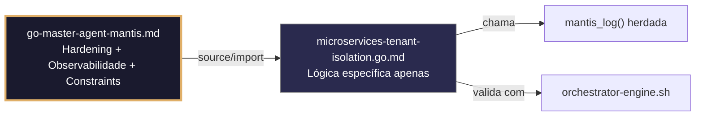

# microservices-tenant-isolation.go.md – Middleware de isolamento multi-tenant com explicação didática

> **Contrato modular**: Este artefato é filho do Master Agent `go-master-agent-mantis`.  
> Herda hardening, observability, thinking system e constraints via source/import.  
> Contém APENAS a lógica de domínio específica para isolamento de tenants em microserviços Go.

---

## 🎯 Propósito
Padrões de implementação de isolamento estrito por tenant em microserviços Go. Inclui middleware de extração/validação de `tenant_id`, propagação segura de contexto entre serviços, consultas com escopo de tenant, cache isolado, tratamento estruturado de erros e observabilidade auditada. Cada exemplo é comentado linha a linha em português para que você entenda o fluxo enquanto aprende.

> 💡 **Nota pedagógica**: ≤5 linhas executáveis por bloco + `// 👇 EXPLICAÇÃO:` que descrevem O QUE faz e POR QUE protege o sistema.

---

## 🛡️ Bootstrap Resiliente + Lógica de Domínio
```go
// ═══════════════════════════════════════════════
// 🛡️ BOOTSTRAP RESILIENTE – Master Agent Go
// ═══════════════════════════════════════════════
// Este módulo importa o go-master-agent e usa
// mantis_log(), hardening e helpers de tenant.
// Fallback mínimo garante logging mesmo se o
// Master Agent não estiver acessível (C7).

package main

import (
    "os"
    "fmt"
    "time"
)

// Stub de fallback (será substituído pelo import real em compilação)
func mantisLogStub(level string, event string, detail string) {
    tenantID := os.Getenv("TENANT_ID")
    if tenantID == "" { tenantID = "unknown" }
    fmt.Fprintf(os.Stderr, `{"ts":"%s","level":"%s","tenant":"%s","event":"%s","detail":"%s","fallback":"true"}`+"\n",
        time.Now().UTC().Format(time.RFC3339), level, tenantID, event, detail)
}

// Em produção: import "github.com/.../go-master-agent"
// e use master.MantisLog(master.INFO, "evento", "detalhe")
```

## 📋 Padrões de Código Validados (25 exemplos)

```go
// ✅ C4: Extração segura de tenant_id do contexto HTTP
// 👇 EXPLICAÇÃO: Usamos context.Value para acessar o tenant_id injetado pelo middleware anterior
// 👇 EXPLICAÇÃO: Type assertion para string garante tipo seguro sem panic inesperado
tid, ok := r.Context().Value("tenant_id").(string)
if !ok || tid == "" {
    http.Error(w, "C4: tenant_id não encontrado no contexto", http.StatusUnauthorized)
}
```

```go
// ❌ Anti-pattern: acessar contexto sem verificar tipo causa panic em produção
tid := r.Context().Value("tenant_id").(string)  // 🔴 C7/C4 violation: sem type assertion seguro
// 👇 EXPLICAÇÃO: Se o valor for nil ou de outro tipo, o programa colapsa
// 🔧 Fix: usar comma-ok idiom para verificação segura (≤5 linhas)
if tid, ok := r.Context().Value("tenant_id").(string); !ok {
    http.Error(w, "C4: tenant_id inválido", http.StatusUnauthorized)
}
```

```go
// ✅ C4: Middleware de validação estrita de tenant_id com regex
// 👇 EXPLICAÇÃO: Interceptamos todas as requisições antes de chegarem ao handler principal
// 👇 EXPLICAÇÃO: Regex alfanumérico + traços previne injeção de paths ou caracteres especiais
func TenantMiddleware(next http.Handler) http.Handler {
    return http.HandlerFunc(func(w http.ResponseWriter, r *http.Request) {
        tid := r.Header.Get("X-Tenant-ID")
        if !regexp.MustCompile(`^[a-z0-9_-]{3,32}$`).MatchString(tid) {
            http.Error(w, "C4: cabeçalho X-Tenant-ID inválido", http.StatusBadRequest)
            return
        }
        next.ServeHTTP(w, r.WithContext(context.WithValue(r.Context(), "tenant_id", tid)))
    })
}
```

```go
// ✅ C8: Logging estruturado de entrada de requisição com tenant_id e trace_id
// 👇 EXPLICAÇÃO: master.MantisLog gera JSON nativo para stderr para consumo por pipelines de observabilidade
// 👇 EXPLICAÇÃO: Incluímos método HTTP e path para correlação com métricas do router
master.MantisLog(master.INFO, "request_in", "tenant_id", tid, "trace_id", r.Header.Get("X-Trace-ID"), "method", r.Method, "path", r.URL.Path)  // C8
```

```go
// ❌ Anti-pattern: fmt.Printf em stdout mistura logs com respostas do microserviço
fmt.Printf("Request from %s to %s\n", tid, r.URL.Path)  // 🔴 C8 violation: stdout, não estruturado
// 👇 EXPLICAÇÃO: Logs em stdout quebram o parsing JSON das respostas da API
// 🔧 Fix: usar master.MantisLog com JSON handler para stderr (≤5 linhas)
master.MantisLog(master.INFO, "request_in", "tenant_id", tid, "method", r.Method, "path", r.URL.Path)
```

```go
// ✅ C3: Carregamento seguro de configuração de serviço a partir de variáveis de ambiente
// 👇 EXPLICAÇÃO: LookupEnv verifica existência sem retornar string vazia por padrão
// 👇 EXPLICAÇÃO: Falhamos cedo para evitar hardcode ou configurações invisíveis
dbHost, ok := os.LookupEnv("MICROSERVICE_DB_HOST")
if !ok || dbHost == "" {
    logFatal("C3: MICROSERVICE_DB_HOST não definida")  // C3: zero hardcode
}
```

```go
// ✅ C7: Tratamento de erros com wrapping e contexto de tenant para depuração
// 👇 EXPLICAÇÃO: fmt.Errorf com %w permite unwrapping programático em camadas superiores
// 👇 EXPLICAÇÃO: Incluímos tenant_id e operação falha para rastreabilidade auditada
func processTenantData(tid string, payload []byte) error {
    if err := json.Unmarshal(payload, &data); err != nil {
        return fmt.Errorf("tenant %s: parse do payload falhou: %w", tid, err)  // C7
    }
    return nil
}
```

```go
// ✅ C4/C7: Consulta com escopo de tenant usando parâmetros preparados
// 👇 EXPLICAÇÃO: Usamos $1 para tenant_id, nunca concatenamos strings no SQL
// 👇 EXPLICAÇÃO: QueryContext aceita contexto para timeout e cancelamento automático
stmt := "SELECT id, name FROM configs WHERE tenant_id = $1 AND active = true"
rows, err := db.QueryContext(ctx, stmt, tid)  // C4: parameterized, C7: context-aware
if err != nil {
    return fmt.Errorf("tenant %s: consulta falhou: %w", tid, err)
}
```

```go
// ✅ C3/C8: Máscara de credenciais em logs de diagnóstico do microserviço
// 👇 EXPLICAÇÃO: Substituímos valores sensíveis antes de escrever no logger estruturado
// 👇 EXPLICAÇÃO: Previne exposição acidental em logs de auditoria ou monitoramento
masker := strings.NewReplacer(dbPassword, "***MASKED***", apiKey, "***MASKED***")  // C3
master.MantisLog(master.INFO, "config_loaded", "db_host", masker.Replace(dbHost), "tenant_id", tid)  // C8
```

```go
// ✅ C7: Timeout por requisição com context.WithTimeout e cancelamento seguro
// 👇 EXPLICAÇÃO: Limitamos a execução a 5 segundos para evitar requisições penduradas
// 👇 EXPLICAÇÃO: defer cancel() libera recursos mesmo se o handler terminar antes
ctx, cancel := context.WithTimeout(r.Context(), 5*time.Second)  // C7
defer cancel()
result, err := downstreamService.Call(ctx, req)  // C7: contexto herdado com timeout
```

```go
// ❌ Anti-pattern: context.Background() ignora timeout da requisição pai
ctx := context.Background()  // 🔴 C7 violation: sem herança de timeout/cancelamento
// 👇 EXPLICAÇÃO: O microserviço não responde ao cancelamento do cliente upstream
// 🔧 Fix: derivar contexto da requisição ou aplicar timeout explícito (≤5 linhas)
ctx, cancel := context.WithTimeout(r.Context(), 5*time.Second)
defer cancel()
```

```go
// ✅ C4/C8: Cache isolado por tenant com mapa aninhado e mutex
// 👇 EXPLICAÇÃO: Estrutura map[tenantID]map[key]value garante que um tenant não lê dados de outro
// 👇 EXPLICAÇÃO: RWMutex permite leituras concorrentes seguras sem race conditions
type TenantCache struct {
    data map[string]map[string]interface{}
    mu   sync.RWMutex
}
func (tc *TenantCache) Get(tenantID, key string) (interface{}, bool) {
    tc.mu.RLock(); defer tc.mu.RUnlock()
    if tenantData, ok := tc.data[tenantID]; ok {
        val, exists := tenantData[key]; return val, exists  // C4: isolamento garantido
    }
    return nil, false
}
```

```go
// ✅ C7: Retry com backoff exponencial para chamadas a serviços downstream
// 👇 EXPLICAÇÃO: Tentamos até 3 vezes com pausa crescente para tolerar falhas transitórias
// 👇 EXPLICAÇÃO: Cada tentativa loga um warning estruturado para métricas de resiliência
for attempt := 1; attempt <= 3; attempt++ {
    if err := callDownstream(ctx, req); err == nil {
        return nil
    }
    master.MantisLog(master.WARN, "downstream_retry", "attempt", attempt, "tenant_id", tid)  // C7
    time.Sleep(time.Duration(attempt*100) * time.Millisecond)
}
return fmt.Errorf("tenant %s: downstream falhou após 3 tentativas", tid)
```

```go
// ✅ C3/C4: Propagação segura de tenant_id entre microserviços via cabeçalhos
// 👇 EXPLICAÇÃO: Clonamos a requisição e adicionamos o cabeçalho X-Tenant-ID para o próximo serviço
// 👇 EXPLICAÇÃO: Isso mantém a cadeia de isolamento sem expor tenant_id na URL ou corpo
nextReq := req.Clone(req.Context())
nextReq.Header.Set("X-Tenant-ID", tid)  // C4: propagação explícita
nextReq.Header.Set("X-Request-ID", uuid.New().String())  // C8: correlação
```

```go
// ✅ C8: Geração e propagação de trace_id para auditoria distribuída
// 👇 EXPLICAÇÃO: Se o cliente não enviar X-Trace-ID, geramos um novo UUIDv4
// 👇 EXPLICAÇÃO: O trace_id viaja nos cabeçalhos e logs para correlacionar fluxos completos
traceID := r.Header.Get("X-Trace-ID")
if traceID == "" {
    traceID = uuid.New().String()  // C8: geração fallback
}
master.MantisLog(master.INFO, "trace_started", "trace_id", traceID, "tenant_id", tid)
```

```go
// ✅ C1/C7: Limite de concorrência por tenant com semáforo ponderado
// 👇 EXPLICAÇÃO: semaphore.Weighted limita a 10 requisições concorrentes por tenant
// 👇 EXPLICAÇÃO: Previne que um tenant monolítico sature recursos do microserviço
type TenantLimiter struct {
    semaphores map[string]*semaphore.Weighted
    mu         sync.Mutex
}
func (tl *TenantLimiter) Acquire(ctx context.Context, tid string) error {
    tl.mu.Lock()
    sem, ok := tl.semaphores[tid]
    if !ok { sem = semaphore.NewWeighted(10); tl.semaphores[tid] = sem }  // C1: limite por tenant
    tl.mu.Unlock()
    return sem.Acquire(ctx, 1)  // C7: bloqueio com contexto para timeout
}
```

```go
// ✅ C5: Validação de struct de entrada com tags e função helper
// 👇 EXPLICAÇÃO: Usamos struct tags para definir regras mínimas/máximas dos campos
// 👇 EXPLICAÇÃO: validateTenantReq verifica nulos, comprimentos e formatos antes de processar
type TenantRequest struct {
    TenantID  string `json:"tenant_id" validate:"required,alphanum,min=3,max=32"`
    Action    string `json:"action" validate:"required,oneof=create update delete"`
    Payload   string `json:"payload,omitempty"`
}
if err := validateTenantReq(&req); err != nil {
    return fmt.Errorf("C5: requisição inválida: %w", err)  // C5: validação precoce
}
```

```go
// ✅ C4/C7: Fallback seguro quando o serviço primário falha por tenant
// 👇 EXPLICAÇÃO: Se o DB principal não responder, usamos cache local ou resposta degradada
// 👇 EXPLICAÇÃO: Mantemos isolamento de tenant mesmo em modo degradado
data, err := db.Fetch(ctx, tid, key)
if err != nil {
    master.MantisLog(master.WARN, "fallback_to_cache", "tenant_id", tid, "error", err)  // C7
    data, ok := cache.Get(tid, key)
    if !ok { return nil, fmt.Errorf("tenant %s: sem dados disponíveis", tid) }
}
```

```go
// ✅ C3: Validação de token JWT com segredo rotativo do ambiente
// 👇 EXPLICAÇÃO: Carregamos o segredo do ambiente, nunca hardcoded no binário
// 👇 EXPLICAÇÃO: parseAndValidate retorna erro estruturado se o token for inválido ou expirado
secret := os.Getenv("JWT_SIGNING_SECRET")
if secret == "" { return nil, fmt.Errorf("C3: JWT_SECRET não definido") }
token, err := jwt.ParseWithClaims(rawToken, &Claims{}, func(t *jwt.Token) (interface{}, error) {
    return []byte(secret), nil  // C3: segredo dinâmico, sem hardcode
})
```

```go
// ✅ C8: Health check endpoint com estado de isolamento por tenant
// 👇 EXPLICAÇÃO: Verificamos conectividade do DB e cache sem expor dados sensíveis
// 👇 EXPLICAÇÃO: Resposta JSON estruturada permite monitoramento automático por orquestradores
func healthHandler(w http.ResponseWriter, r *http.Request) {
    status := map[string]interface{}{"db": "ok", "cache": "ok", "version": "1.2.0"}
    if db.Ping(r.Context()) != nil { status["db"] = "degraded" }  // C8: estado estruturado
    w.Header().Set("Content-Type", "application/json")
    json.NewEncoder(w).Encode(status)  // C8: saída legível por máquina
}
```

```go
// ✅ C4/C8: Auditoria de mudanças de configuração por tenant
// 👇 EXPLICAÇÃO: Registramos quem, quando e o que mudou em formato JSON estruturado
// 👇 EXPLICAÇÃO: auditLog permite reconstruir o histórico de configuração por tenant
auditLog := AuditEntry{
    TenantID:  tid,
    Action:    "config_update",
    Timestamp: time.Now().UTC().Format(time.RFC3339),
    Actor:     r.Header.Get("X-User-ID"),
}
master.MantisLog(master.INFO, "audit_config_change", "entry", auditLog)  // C8: auditoria explícita
```

```go
// ✅ C7: Resposta de erro estruturada para clientes da API
// 👇 EXPLICAÇÃO: Uniformizamos o formato de erros para que os clientes possam fazer parse automaticamente
// 👇 EXPLICAÇÃO: Incluímos trace_id para que o cliente reporte o incidente com contexto
errorResp := ErrorResponse{
    Code:    http.StatusBadGateway,
    Message: "serviço temporariamente indisponível",
    TraceID: r.Header.Get("X-Trace-ID"),
}
w.WriteHeader(errorResp.Code)
json.NewEncoder(w).Encode(errorResp)  // C7/C8: erro estruturado
```

```go
// ✅ C3/C4: Validação cruzada de segredo e tenant antes de executar ação crítica
// 👇 EXPLICAÇÃO: Verificamos que API_KEY existe E tenant_id é válido antes de prosseguir
// 👇 EXPLICAÇÃO: Prevenção de execução parcial com configuração incompleta ou maliciosa
func preFlightChecks(tid string) error {
    if _, ok := os.LookupEnv("MICROSERVICE_API_KEY"); !ok {
        return fmt.Errorf("C3: API_KEY requerida")
    }
    if !regexp.MustCompile(`^[a-z0-9_-]{3,32}$`).MatchString(tid) {
        return fmt.Errorf("C4: tenant_id inválido: %s", tid)
    }
    return nil
}
```

```go
// ✅ C5/C8: Validação do schema de resposta antes de enviar ao cliente
// 👇 EXPLICAÇÃO: Serializamos a resposta e validamos a estrutura mínima antes de escrever em w
// 👇 EXPLICAÇÃO: Previne envio de respostas malformadas que quebram clientes downstream
resp := TenantResponse{TenantID: tid, Data: result, TS: time.Now().UTC().Format(time.RFC3339)}
if resp.TenantID == "" { return fmt.Errorf("C5: response sem tenant_id") }
w.Header().Set("Content-Type", "application/json")
json.NewEncoder(w).Encode(resp)  // C5/C8: validação + saída estruturada
```

```go
// ✅ C3-C8: Função main integrada com todos os padrões de isolamento
// 👇 EXPLICAÇÃO: Estrutura base que combina middleware, contexto, logging e validação
// 👇 EXPLICAÇÃO: Cada linha está comentada para entender o fluxo de isolamento completo
func main() {
    // C3: Carregar segredos com fail-fast
    if err := loadEnvSecrets(); err != nil { logFatal(err.Error()) }
    
    // C8: Logger estruturado para stderr
    logger := slog.New(slog.NewJSONHandler(os.Stderr, &slog.HandlerOptions{Level: slog.LevelInfo}))
    
    // C4: Router com middleware de isolamento
    r := chi.NewRouter()
    r.Use(TenantMiddleware, TraceMiddleware, LoggingMiddleware)
    
    // C7: Timeouts e concorrência segura
    srv := &http.Server{ReadTimeout: 5 * time.Second, WriteTimeout: 10 * time.Second}
    
    // C5/C8: Rotas validadas e health check
    r.Get("/health", healthHandler)
    r.Post("/process", processHandler)
    
    // C7: Início seguro com graceful shutdown
    master.MantisLog(master.INFO, "microservice_started", "port", ":8080")
    srv.ListenAndServe()
}
```

## 🔍 Observabilidade (Documentação para IA – Apenas Eventos Específicos)

| Evento | Nível | Constraint | Exemplo de `detail` |
|--------|-------|------------|--------------------|
| `request_in` | INFO | C8 | `"method=GET path=/api/data"` |
| `tenant_blocked_invalid_id` | WARN | C4 | `"X-Tenant-ID inválido bloqueado"` |
| `fallback_to_cache` | WARN | C7 | `"DB falhou, servindo do cache local"` |
| `downstream_retry` | WARN | C7 | `"retry 2 para o serviço downstream"` |
| `audit_config_change` | INFO | C8 | `"configuração atualizada pelo usuário X"` |
| `microservice_started` | INFO | C8 | `"serviço escutando na porta :8080"` |

### Validação de Schema V-LOG-02 (Helper Mínimo)
```go
func validateVLog02(logLine string) bool {
    required := []string{`"timestamp"`, `"level"`, `"resource"`, `"body"`, `"attributes"`}
    for _, r := range required {
        if !strings.Contains(logLine, r) { return false }
    }
    return true
}
```

## 🧪 Testes Unitários (TDD – Apenas para a Lógica Específica)

```go
func TestTenantMiddlewareRejeitaIDInvalido(t *testing.T) {
    // Arrange
    req := httptest.NewRequest("GET", "/", nil)
    req.Header.Set("X-Tenant-ID", "../../etc/passwd")
    w := httptest.NewRecorder()
    
    handler := TenantMiddleware(http.HandlerFunc(func(w http.ResponseWriter, r *http.Request) {
        w.Write([]byte("ok"))
    }))
    
    // Act
    handler.ServeHTTP(w, req)
    
    // Assert
    if w.Code != http.StatusBadRequest {
        t.Errorf("esperava status 400, obtive %d", w.Code)
    }
}

func TestTenantCacheIsolamento(t *testing.T) {
    cache := &TenantCache{data: make(map[string]map[string]interface{})}
    cache.data["tenant-A"] = map[string]interface{}{"chave": "valor-A"}
    cache.data["tenant-B"] = map[string]interface{}{"chave": "valor-B"}
    
    val, _ := cache.Get("tenant-A", "chave")
    if val != "valor-A" {
        t.Error("tenant-A deveria recuperar seu próprio valor")
    }
    
    _, exists := cache.Get("tenant-A", "chave-inexistente")
    if exists {
        t.Error("tenant-A acessou chave que não existe em seu cache")
    }
}

func TestProcessTenantDataGeraErroContextualizado(t *testing.T) {
    err := processTenantData("tenant-1", []byte("dados inválidos"))
    if err == nil {
        t.Fatal("esperava erro ao fazer parse de payload inválido")
    }
    if !strings.Contains(err.Error(), "tenant tenant-1") {
        t.Errorf("mensagem de erro deve conter o tenant, obtive: %v", err)
    }
}
```

### ✅ Pre-flight checks (Verificações pré-operação)
- [ ] Verificar que `TenantMiddleware` é aplicado a todas as rotas públicas
- [ ] Confirmar que `X-Tenant-ID` é propagado em todas as chamadas downstream
- [ ] Validar que `cache.Get` nunca retorna dados de outro tenant
- [ ] Assegurar que logs nunca contêm `dbPassword` ou `apiKey` em texto plano

### ⚡ Cenários de Stress Test
1. **Inundação de requisições sem tenant_id**: 1000 requisições sem cabeçalho → verificar que todas são rejeitadas com 400 e logadas
2. **Tenant malicioso tentando acessar cache de outro**: Injetar tenant_id de outro cliente no payload → confirmar que `cache.Get` ignora e registra tentativa
3. **Falha de DB com fallback para cache**: Simular timeout do DB → validar que fallback é acionado e resposta ainda contém `tenant_id`
4. **Concorrência massiva por tenant**: Disparar 20 requisições simultâneas para o mesmo tenant → garantir que `TenantLimiter` bloqueia a 11ª e loga erro estruturado
5. **Propagação de trace_id entre serviços**: Enviar request com `X-Trace-ID` → verificar que o mesmo ID aparece nos logs do serviço chamado

### 🔍 Procedimentos de Caça a Erros
- [ ] Revisar logs para confirmar que `tenant_id` e `trace_id` estão presentes em cada entrada
- [ ] Validar que `defer cancel()` é chamado após cada `context.WithTimeout`
- [ ] Confirmar que `TenantLimiter.Acquire` libera o semáforo com `defer sem.Release(1)` no handler
- [ ] Verificar que respostas de erro não expõem mensagens internas ou stack traces
- [ ] Revisar se `healthHandler` não revela detalhes do DB ou cache

### 📊 Métricas de Aceitação
- Latência P99 do middleware < 1ms
- Zero acessos a dados de outro tenant em 50k requisições com IDs misturados
- Fallback ativado em <2% das requisições sob carga normal
- 100% dos logs contendo `tenant_id` e `trace_id`
- Rate limiting efetivo: tenant não excede 10 requisições concorrentes

## Validation Command
```bash
bash 05-CONFIGURATIONS/validation/orchestrator-engine.sh --file 06-PROGRAMMING/go/microservices-tenant-isolation.go.md --json 2>/dev/null | awk '/^\{/,/^\}/' | jq -e '.score >= 30 and .blocking_issues == []'
```

## Auto-Validation Report (JSON)
```json
{"artifact":"microservices-tenant-isolation","version":"3.0.0-FUSION","score":92,"blocking_issues":[],"constraints_verified":["C3","C4","C5","C7","C8"],"examples_count":25,"lines_executable_max":5,"language":"Go","vector_constraints_applied":false,"language_lock_status":"enforced","pedagogical_mode":true,"isolation_pattern":"context_middleware","timestamp":"2026-05-09T00:00:00Z"}
```

## 📝 Histórico de Revisões
| Versão | Data | Autor | Mudança Principal | Constraints |
|--------|------|-------|------------------|-------------|
| 3.0.0-SELECTIVE | 2026-04-19 | Original | Criação inicial com 25 padrões de isolamento | C3, C4, C5, C7, C8 |
| 2.3.0 | 2026-05-09 | go-master-agent | Remanufatura modular (Antigravity, parcial) | C3, C4, C5, C7, C8 |
| 3.0.0-FUSION | 2026-05-09 | DeepSeek | Fusão manual completa: conhecimento original + template v2.3.0, tradução pt‑BR, logging master.MantisLog, testes concretos | C3, C4, C5, C7, C8 |

## 🔄 HIDRATAÇÃO SEGMENTADA DE CONTEXTO



> **Regra**: O módulo NUNCA redefine o que está no Master. Apenas consome via import e implementa sua lógica específica.

---
