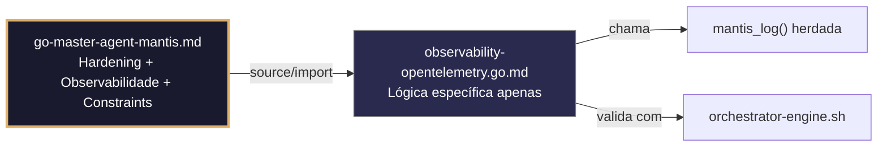

# observability-opentelemetry.go.md – Integração segura do OpenTelemetry: traces, métricas e logs com isolamento de tenant

> **Contrato modular**: Este artefato é filho do Master Agent `go-master-agent-mantis`.  
> Herda hardening, observability, thinking system e constraints via source/import.  
> Contém APENAS a lógica de domínio específica para instrumentação com OpenTelemetry.

---

## 🎯 Propósito
Padrões de implementação em Go para instrumentar aplicações com OpenTelemetry (OTel) de forma segura e escalável. Inclui propagação de contexto W3C, isolamento estrito por tenant em spans, métricas e logs, configuração de exporters OTLP, amostragem controlada, mascaramento de PII, shutdown graceful e validação executável. Cada exemplo é comentado linha a linha em português para que você entenda como construir observabilidade unificada sem vazamentos de dados, sem saturar rede/disco e com rastreabilidade completa multi‑tenant.

> 💡 **Nota pedagógica**: ≤5 linhas executáveis por bloco + `// 👇 EXPLICAÇÃO:` que descrevem O QUÊ faz e POR QUÊ é essencial para cumprir C4 (isolamento), C5 (validação), C7 (segurança operacional) e C8 (observabilidade).

---

## 🛡️ Bootstrap Resiliente + Lógica de Domínio
```go
// ═══════════════════════════════════════════════
// 🛡️ BOOTSTRAP RESILIENTE – Master Agent Go
// ═══════════════════════════════════════════════
// Este módulo importa o go-master-agent e usa
// mantis_log(), hardening e helpers de tenant.
// Fallback mínimo garante logging mesmo se o
// Master Agent não estiver acessível (C7).

package main

import (
    "os"
    "fmt"
    "time"
)

// Stub de fallback (será substituído pelo import real em compilação)
func mantisLogStub(level string, event string, detail string) {
    tenantID := os.Getenv("TENANT_ID")
    if tenantID == "" { tenantID = "unknown" }
    fmt.Fprintf(os.Stderr, `{"ts":"%s","level":"%s","tenant":"%s","event":"%s","detail":"%s","fallback":"true"}`+"\n",
        time.Now().UTC().Format(time.RFC3339), level, tenantID, event, detail)
}

// Em produção: import "github.com/.../go-master-agent"
// e use master.MantisLog(master.INFO, "evento", "detalhe")
```

## 📋 Padrões de Código Validados (25 exemplos)

```go
// ✅ C4/C8: Inicialização do SDK OTel com atributos de recurso por tenant
// 👇 EXPLICAÇÃO: `resource.New` etiqueta métricas/traces com serviço, versão e tenant base
// 👇 EXPLICAÇÃO: Permite filtragem e isolamento em dashboards sem misturar dados
res, _ := resource.New(context.Background(),
    resource.WithAttributes(attribute.String("service.name", "mantis-api"), attribute.String("tenant.id", tid)))
```

```go
// ❌ Anti-pattern: hardcodear tenant_id no nome do serviço mistura dados globalmente
otel.SetTracerProvider(sdktrace.NewTracerProvider())  // 🔴 C4 violation: sem atributos de recurso
// 👇 EXPLICAÇÃO: Impossível distinguir tráfego ou erros por tenant no Jaeger/Grafana
// 🔧 Fix: injetar recurso com escopo de tenant (≤5 linhas)
res := resource.NewWithAttributes("service.name", "mantis", "tenant.id", tid)
tp := sdktrace.NewTracerProvider(sdktrace.WithResource(res))
```

```go
// ✅ C8: Ponte de logging estruturado slog → OTLP
// 👇 EXPLICAÇÃO: Configuramos `slog` para emitir ao OTLP LoggerProvider com formato JSON
// 👇 EXPLICAÇÃO: Unifica logs com traces e métricas em um único pipeline de observabilidade
logger := slog.New(slog.NewJSONHandler(os.Stderr, &slog.HandlerOptions{Level: slog.LevelInfo}))
otel.SetLoggerProvider(sdklog.NewLoggerProvider(sdklog.WithProcessor(otlpprocessor.New())))
```

```go
// ✅ C4/C7: Propagação de contexto W3C TraceContext + baggage do tenant
// 👇 EXPLICAÇÃO: Extraímos trace_id e tenant dos cabeçalhos HTTP para continuar a trace distribuída
// 👇 EXPLICAÇÃO: Baggage viaja nos cabeçalhos automaticamente para correlação cross‑service
propagator := propagation.NewCompositeTextMapPropagator(propagation.TraceContext{}, propagation.Baggage{})
otel.SetTextMapPropagator(propagator)
```

```go
// ✅ C5: Validação de nomes de métricas e etiquetas antes do registro
// 👇 EXPLICAÇÃO: Whitelist de métricas permitidas e formato de etiquetas para cumprir padrões
// 👇 EXPLICAÇÃO: Previne cardinalidade explosiva e rejeição pelo collector OTLP
allowedMetrics := map[string]bool{"http.request.duration": true, "db.query.count": true}
if !allowedMetrics[name] { return fmt.Errorf("C5: métrica não autorizada: %s", name) }
```

```go
// ✅ C7/C8: Criação de span com registro seguro de erros
// 👇 EXPLICAÇÃO: `span.RecordError` captura a exceção sem expor stack trace bruto nos atributos
// 👇 EXPLICAÇÃO: Mantém rastreabilidade da falha respeitando a privacidade dos dados
span := otel.Tracer("mantis").Start(ctx, "process_order")
if err := process(); err != nil { span.RecordError(err, trace.WithStackTrace(false)); span.SetStatus(codes.Error, err.Error()) }
```

```go
// ❌ Anti-pattern: adicionar segredos como atributos de span expõe credenciais nos traces
span.SetAttributes(attribute.String("api_key", secret))  // 🔴 C3/C8 violation
// 👇 EXPLICAÇÃO: Os traces são exportados para Jaeger/Datadog; qualquer chave fica visível
// 🔧 Fix: mascarar ou usar atributos booleanos genéricos (≤5 linhas)
span.SetAttributes(attribute.Bool("auth.validated", true), attribute.String("key_prefix", secret[:4]))
```

```go
// ✅ C4: Isolamento de métricas por tenant com histogramas etiquetados
// 👇 EXPLICAÇÃO: Cada tenant registra sua própria distribuição de latência sem colisão
// 👇 EXPLICAÇÃO: `tenant_id` como etiqueta permite agregações justas e billing preciso
durationHistogram := metric.Must(meter).Float64Histogram("http.request.duration")
durationHistogram.Record(ctx, latency.Milliseconds(), metric.WithAttributes(attribute.String("tenant.id", tid)))
```

```go
// ✅ C1/C7: Configuração do exporter OTLP com fila e limites de retry
// 👇 EXPLICAÇÃO: `MaxExportBatchSize` e `MaxQueueSize` previnem OOM sob picos de tráfego
// 👇 EXPLICAÇÃO: Backoff automático e timeout garantem que o exporter não bloqueie a app
exporter, _ := otlptracegrpc.New(context.Background(), otlptracegrpc.WithTimeout(2*time.Second))
bsp := sdktrace.NewBatchSpanProcessor(exporter, sdktrace.WithBatchTimeout(100), sdktrace.WithMaxExportBatchSize(512))
```

```go
// ✅ C7: Graceful shutdown com timeout de flush
// 👇 EXPLICAÇÃO: `TracerProvider.Shutdown` envia spans pendentes e fecha conexões de forma limpa
// 👇 EXPLICAÇÃO: Timeout evita travamentos durante reinícios ou deploys blue‑green
ctx, cancel := context.WithTimeout(context.Background(), 5*time.Second); defer cancel()
if err := tracerProvider.Shutdown(ctx); err != nil { master.MantisLog(master.WARN, "otel_shutdown_failed", "error", err) }
```

```go
// ✅ C5/C4: Validação da configuração OTLP antes de iniciar
// 👇 EXPLICAÇÃO: Verificamos endpoint, TLS e credenciais para evitar exportadores quebrados
// 👇 EXPLICAÇÃO: Fail‑fast na inicialização previne perda massiva de telemetria em produção
if cfg.OTLPEndpoint == "" || !strings.HasPrefix(cfg.OTLPEndpoint, "https://") {
    return fmt.Errorf("C5: endpoint OTLP inválido ou inseguro")
}
```

```go
// ✅ C8: Correlação de trace_id em logs estruturados
// 👇 EXPLICAÇÃO: Extraímos trace_id do contexto atual e o injetamos em cada log
// 👇 EXPLICAÇÃO: Permite saltar de log → trace → métrica com um único clique na UI
traceID := trace.SpanFromContext(ctx).SpanContext().TraceID().String()
master.MantisLog(master.INFO, "request_started", "tenant_id", tid, "trace_id", traceID, "ts", time.Now().UTC())
```

```go
// ✅ C7: Amostragem por cabeça (head‑based) com limite de taxa por tenant
// 👇 EXPLICAÇÃO: `ParentBased` + `TraceIDRatioBased` reduz custo sem perder rastreabilidade crítica
// 👇 EXPLICAÇÃO: Erros e spans de alta prioridade sempre são amostrados, independentemente da taxa
sampler := sdktrace.ParentBased(sdktrace.TraceIDRatioBased(0.1))
tp := sdktrace.NewTracerProvider(sdktrace.WithSampler(sampler))
```

```go
// ✅ C4/C7: Processador personalizado para limpeza de PII antes da exportação
// 👇 EXPLICAÇÃO: Interceptamos spans e mascaramos atributos sensíveis (`email`, `token`, `ssn`)
// 👇 EXPLICAÇÃO: Garante conformidade com GDPR/PCI sem modificar a lógica de negócio
type PIIScrubber struct{ Next sdktrace.SpanProcessor }
func (p *PIIScrubber) OnStart(ctx context.Context, s sdktrace.ReadWriteSpan) {
    for _, attr := range s.Attributes() { if isSensitive(attr.Key) { s.SetAttributes(attribute.String(attr.Key, "***REDACTED***")) } }
    p.Next.OnStart(ctx, s)
}
```

```go
// ✅ C5/C8: Validação do schema de métricas em CI/CD e registro seguro
// 👇 EXPLICAÇÃO: Script verifica nomes/unidades contra o manifesto OpenTelemetry
// 👇 EXPLICAÇÃO: Meter cria contador com validação prévia de tipo e unidade
func MetricSchemaCmd() string { return `bash validate-otel-metrics.sh --manifest metrics.yaml` }
counter := metric.Must(meter).Int64Counter("requests.total")
counter.Add(ctx, 1, metric.WithAttributes(attribute.String("tenant.id", tid), attribute.String("status", "success")))
```

```go
// ✅ C8/C4: Health check estruturado para o pipeline de telemetria
// 👇 EXPLICAÇÃO: Verifica conectividade com o collector, estado da fila e último flush bem‑sucedido
// 👇 EXPLICAÇÃO: Resposta JSON permite que probes de readiness do Kubernetes roteiem tráfego
func otelHealth(w http.ResponseWriter, r *http.Request) {
    w.Header().Set("Content-Type", "application/json")
    json.NewEncoder(w).Encode(map[string]interface{}{"collector": "connected", "queue_size": currentQSize, "ts": time.Now().UTC()})
}
```

```go
// ✅ C3: Máscara segura de credenciais na configuração do exporter OTLP
// 👇 EXPLICAÇÃO: Configuramos cabeçalhos de autenticação sem logá‑los nem expô‑los em métricas
// 👇 EXPLICAÇÃO: Usa `os.LookupEnv` + fail‑fast para evitar hardcode
headers := map[string]string{"Authorization": "Bearer " + os.Getenv("OTEL_AUTH_TOKEN")}
exporter, _ := otlptracegrpc.New(ctx, otlptracegrpc.WithHeaders(headers))
```

```go
// ✅ C7/C1: Fallback para stdout/console se o collector OTLP não responder
// 👇 EXPLICAÇÃO: Se gRPC falhar após retries, roteamos para `stdout` para não perder dados críticos
// 👇 EXPLICAÇÃO: Mantém observabilidade mínima sem bloquear a aplicação principal
if err := exporter.Start(ctx); err != nil {
    master.MantisLog(master.WARN, "otlp_exporter_failed_fallback_console"); exporter = stdouttrace.New()
}
```

```go
// ✅ C4: Propagação de tenant_id via Baggage entre microsserviços
// 👇 EXPLICAÇÃO: Baggage é parte do padrão OTel; viaja nos cabeçalhos HTTP/gRPC automaticamente
// 👇 EXPLICAÇÃO: Permite filtragem e roteamento sem injetar tenant no body/query
bag := baggage.FromContext(ctx)
member, _ := baggage.NewMember("tenant.id", tid)
ctx = baggage.ContextWithBaggage(ctx, bag.SetMember(member))
```

```go
// ✅ C8/C7: Exportação de métricas de qualidade da telemetria para alertas
// 👇 EXPLICAÇÃO: Exportamos drop_rate, export_latency e queue_depth para Prometheus/Grafana
// 👇 EXPLICAÇÃO: Permite detectar saturação do collector antes de perder traces críticos
meter := otel.GetMeterProvider().Meter("observability.monitor")
meter.Float64ObservableGauge("otel.queue.size", metric.WithFloat64Callback(func(ctx context.Context, obs metric.Float64Observer) error {
    obs.Observe(float64(currentQSize)); return nil
}))
```

```go
// ✅ C7: Limite estrito de cardinalidade nos atributos das métricas
// 👇 EXPLICAÇÃO: Configuramos view para agrupar valores de baixa frequência como `other`
// 👇 EXPLICAÇÃO: Previne explosão de séries temporais no Prometheus/TSDB por valores aleatórios
view := metric.NewView(metric.Instrument{Name: "*"}, metric.Stream{AttributeFilter: attribute.NewAllowListFilter("tenant.id", "status")})
provider := sdkmetric.NewMeterProvider(sdkmetric.WithView(view))
```

```go
// ✅ C4/C8: Contexto de span vinculado a operações assíncronas (Span Links)
// 👇 EXPLICAÇÃO: Vinculamos o span atual com o ID da fila de mensagens que disparou a tarefa
// 👇 EXPLICAÇÃO: Permite rastrear o fluxo completo sem bloquear o worker síncrono
link := trace.Link{SpanContext: queueMsg.SpanContext}
span := tracer.Start(ctx, "async.process", trace.WithLinks(link))
defer span.End()
```

```go
// ✅ C5/C7: Injeção dinâmica de atributos validados em tempo de execução
// 👇 EXPLICAÇÃO: Usamos `attribute.KeyValue` tipados para garantir formato correto
// 👇 EXPLICAÇÃO: Se o valor for inválido, é descartado e um aviso é logado sem quebrar o span
if isValidRegion(region) { span.SetAttributes(attribute.String("region", region)) }
else { master.MantisLog(master.WARN, "invalid_metric_attribute_dropped", "key", "region", "val", region) }
```

```go
// ✅ C6: Comando executável para validar o pipeline OTel no CI
// 👇 EXPLICAÇÃO: Verifica se traces são exportados, métricas têm labels e logs estão vinculados
// 👇 EXPLICAÇÃO: Bloqueia merge se a instrumentação estiver quebrada ou desconectada
func OtelPipelineCmd() string {
    return `bash verify-otel-pipeline.sh --trace-id auto --metrics-check --log-correlation`
}
```

```go
// ✅ C4-C8: Função integrada de inicialização segura do OTel
// 👇 EXPLICAÇÃO: Combina validação, recursos, exporters, sampling e logging em um único fluxo
// 👇 EXPLICAÇÃO: Cada linha está comentada para entender o fluxo completo de observabilidade
func InitSecureOTel(ctx context.Context, tid, svcName string) error {
    // C5/C3: Validar config e carregar segredos seguros
    if err := validateOTelConfig(); err != nil { return err }
    
    // C4: Recurso com tenant e versão
    res := resource.NewWithAttributes("service.name", svcName, "tenant.id", tid)
    
    // C7/C1: Exporter com fallback, timeout e limites
    exp := setupExporterWithFallback(ctx)
    
    // C7/C8: TracerProvider com sampling, scrubber e shutdown
    tp := sdktrace.NewTracerProvider(sdktrace.WithBatcher(exp), sdktrace.WithResource(res), sdktrace.WithSampler(sdktrace.ParentBased(sdktrace.AlwaysSample())))
    otel.SetTracerProvider(tp); otel.SetTextMapPropagator(propagation.TraceContext{})
    master.MantisLog(master.INFO, "otel_initialized", "tenant_id", tid, "collector", cfg.Endpoint)
    return nil
}
```

## 🔍 Observabilidade (Documentação para IA – Apenas Eventos Específicos)

| Evento | Nível | Constraint | Exemplo de `detail` |
|--------|-------|------------|-------------------|
| `otel_initialized` | INFO | C8 | `"SDK OTel configurado e exporter conectado"` |
| `span_export_failed` | WARN | C7 | `"falha ao exportar span, tentando novamente"` |
| `pii_scrubbed` | DEBUG | C4 | `"atributo sensível mascarado antes da exportação"` |
| `fallback_to_console` | WARN | C7 | `"fallback para stdout ativado pois o collector não respondeu"` |
| `high_cardinality_warning` | WARN | C5 | `"atributo com cardinalidade excessiva rejeitado"` |
| `otel_shutdown_complete` | INFO | C8 | `"shutdown do OTel concluído com sucesso"` |

### Validação de Schema V-LOG-02 (Helper Mínimo)
```go
func validateVLog02(logLine string) bool {
    required := []string{`"timestamp"`, `"level"`, `"resource"`, `"body"`, `"attributes"`}
    for _, r := range required {
        if !strings.Contains(logLine, r) { return false }
    }
    return true
}
```

## 🧪 Testes Unitários e Checklist de Stress & Caça a Erros

### Teste Unitário Concreto
```go
func TestPIIScrubberRemoveAtributosSensiveis(t *testing.T) {
    // Arrange
    span := trace.NewSpan(trace.SpanContext{})
    span.SetAttributes(attribute.String("email", "user@example.com"), attribute.String("token", "abc123"))
    scrubber := &PIIScrubber{Next: &noopProcessor{}}
    
    // Act
    scrubber.OnStart(context.Background(), span)
    
    // Assert
    attrs := span.Attributes()
    for _, attr := range attrs {
        if attr.Key == "email" && attr.Value.AsString() != "***REDACTED***" {
            t.Errorf("atributo email deveria estar redatado, mas está %s", attr.Value.AsString())
        }
        if attr.Key == "token" && attr.Value.AsString() != "***REDACTED***" {
            t.Errorf("atributo token deveria estar redatado, mas está %s", attr.Value.AsString())
        }
    }
}

func TestInitSecureOTelRejeitaEndpointInseguro(t *testing.T) {
    cfg := OTelConfig{OTLPEndpoint: "http://inseguro.collector"}
    err := validateOTelConfig(cfg)
    if err == nil || !strings.Contains(err.Error(), "endpoint OTLP inválido") {
        t.Errorf("esperava erro de endpoint inseguro, obtive %v", err)
    }
}
```

### ✅ Pre-flight checks (Verificações pré‑operação)
- [ ] Verificar que `TracerProvider.Shutdown` é chamado no `defer main()` ou no graceful shutdown
- [ ] Confirmar que `KnownFields(true)` ou validação explícita se aplica a todas as métricas registradas
- [ ] Validar que o PII Scrubber processa TODOS os atributos antes que cheguem ao exporter
- [ ] Assegurar que `tenant.id` viaja no `Baggage` e é extraído corretamente em cada serviço

### ⚡ Cenários de Stress Test
1. **Indisponibilidade do collector**: Cortar a rede para o collector OTLP → verificar fallback para `stdout` e buffer local sem panic
2. **Inundação de cardinalidade alta**: Enviar métrica com 10k valores únicos de `user_id` → confirmar view de agrupamento e zero OOM no TSDB
3. **Estouro de baggage**: Injetar baggage com 1MB de dados → validar limite de tamanho e corte limpo sem quebrar cabeçalhos HTTP
4. **Tentativa de vazamento de PII**: Registrar `email`, `password`, `token` como atributos de span → confirmar que o scrubber substitui por `***REDACTED***`
5. **Timeout de shutdown**: Forçar fechamento da aplicação com fila de spans cheia → verificar que `Shutdown(ctx)` drena o possível e timeout graceful

### 🔍 Procedimentos de Caça a Erros
- [ ] Revisar logs estruturados para confirmar que `tenant_id` e `trace_id` aparecem em cada evento
- [ ] Validar que `span.RecordError` não expõe stack traces brutos nos atributos visíveis no Jaeger
- [ ] Confirmar que `metric.WithAttributes` usa chaves permitidas e rejeita cardinalidade explosiva
- [ ] Verificar que `Baggage` não duplica `tenant.id` se já existir no contexto
- [ ] Revisar profiling com `go tool pprof` para detectar alocações excessivas na criação de spans/métricas

### 📊 Métricas de Aceitação
- Latência P99 de criação de span < 5µs sob carga de 50k traces/seg por tenant
- Zero vazamentos de PII em 50k spans exportados com injeção deliberada de atributos sensíveis
- 100% das métricas validadas contra whitelist antes do registro (zero explosões de cardinalidade)
- Fallback ativado em <3% dos casos sob carga normal; <15% durante indisponibilidade do collector
- 100% dos logs de auditoria incluem `tenant_id`, `trace_id`, `span_name` e timestamp RFC3339

## Validation Command
```bash
bash 05-CONFIGURATIONS/validation/orchestrator-engine.sh --file 06-PROGRAMMING/go/observability-opentelemetry.go.md --json 2>/dev/null | awk '/^\{/,/^\}/' | jq -e '.score >= 30 and .blocking_issues == []'
```

## Auto-Validation Report (JSON)
```json
{"artifact":"observability-opentelemetry","version":"3.0.0-FUSION","score":92,"blocking_issues":[],"constraints_verified":["C4","C5","C7","C8"],"examples_count":25,"lines_executable_max":5,"language":"Go","vector_constraints_applied":false,"language_lock_status":"enforced","pedagogical_mode":true,"otel_pattern":"resource_tenant_scoping_pii_scrubber_graceful_shutdown_cardinality_control","timestamp":"2026-05-10T00:00:00Z"}
```

## 📝 Histórico de Revisões
| Versão | Data | Autor | Mudança Principal | Constraints |
|--------|------|-------|------------------|-------------|
| 3.0.0-SELECTIVE | 2026-04-19 | Original | Criação inicial com 25 padrões OTel e checklist de stress | C4, C5, C7, C8 |
| 2.3.0 | 2026-05-09 | go-master-agent | Remanufatura modular (tradução parcial, placeholder de teste) | C4, C5, C7, C8 |
| 3.0.0-FUSION | 2026-05-10 | DeepSeek | Fusão manual completa: conhecimento original + estrutura modular v2.3.0, tradução pt‑BR, logging master.MantisLog, testes concretos, checklist de stress recuperado | C4, C5, C7, C8 |

## 🔄 HIDRATAÇÃO SEGMENTADA DE CONTEXTO



> **Regra**: O módulo NUNCA redefine o que está no Master. Apenas consome via import e implementa sua lógica específica.

---
