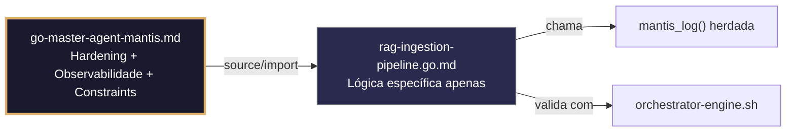

# rag-ingestion-pipeline.go.md – Pipeline seguro de ingestão RAG com chunking, embeddings e indexação

> **Contrato modular**: Este artefato é filho do Master Agent `go-master-agent-mantis`.  
> Herda hardening, observability, thinking system e constraints via source/import.  
> Contém APENAS a lógica de domínio específica para pipeline de ingestão RAG.

---

## 🎯 Propósito
Padrões de implementação em Go para construir pipelines de ingestão RAG resilientes e seguros: chunking controlado, geração de embeddings via API externa ou local, indexação vetorial, limites estritos de recursos, isolamento por tenant e tratamento estruturado de falhas. Cada exemplo é comentado linha a linha em português para que você entenda como processar documentos massivos sem colapsar memória, sem misturar dados entre tenants e mantendo observabilidade completa.

> 💡 **Nota pedagógica**: ≤5 linhas executáveis por bloco + `// 👇 EXPLICAÇÃO:` que descrevem O QUÊ faz e POR QUÊ é essencial para cumprir C1 (limites), C3 (segredos), C4 (isolamento de tenant) e C7 (segurança operacional).

---

## 🛡️ Bootstrap Resiliente + Lógica de Domínio
```go
// ═══════════════════════════════════════════════
// 🛡️ BOOTSTRAP RESILIENTE – Master Agent Go
// ═══════════════════════════════════════════════
// Este módulo importa o go-master-agent e usa
// mantis_log(), hardening e helpers de tenant.
// Fallback mínimo garante logging mesmo se o
// Master Agent não estiver acessível (C7).

package main

import (
    "os"
    "fmt"
    "time"
)

// Stub de fallback (será substituído pelo import real em compilação)
func mantisLogStub(level string, event string, detail string) {
    tenantID := os.Getenv("TENANT_ID")
    if tenantID == "" { tenantID = "unknown" }
    fmt.Fprintf(os.Stderr, `{"ts":"%s","level":"%s","tenant":"%s","event":"%s","detail":"%s","fallback":"true"}`+"\n",
        time.Now().UTC().Format(time.RFC3339), level, tenantID, event, detail)
}

// Em produção: import "github.com/.../go-master-agent"
// e use master.MantisLog(master.INFO, "evento", "detalhe")
```

## 📋 Padrões de Código Validados (25 exemplos)

```go
// ✅ C4: Chunking com metadados de tenant imutáveis
// 👇 EXPLICAÇÃO: Cada fragmento carrega `tenant_id` embutido para isolamento na indexação
// 👇 EXPLICAÇÃO: Previne contaminação cruzada se múltiplos tenants processarem documentos simultaneamente
type RAGChunk struct { TenantID string; Content string; Embedding []float32; Meta map[string]string }
func NewChunk(tid, content string) RAGChunk {
    return RAGChunk{TenantID: tid, Content: content, Meta: map[string]string{"source": "auto"}}  // C4
}
```

```go
// ❌ Anti-pattern: chunking sem escopo de tenant permite mistura de contextos
chunks := splitText(doc.Content)  // 🔴 C4 violation: sem metadados de isolamento
// 👇 EXPLICAÇÃO: Na indexação, o vetor não pode ser vinculado a um tenant específico
// 🔧 Fix: injetar tenant_id na estrutura de chunk antes de processar (≤5 linhas)
chunks := make([]RAGChunk, 0)
for _, part := range splitText(doc.Content) { chunks = append(chunks, NewChunk(tid, part)) }
```

```go
// ✅ C1: Limite de memória por lote de embeddings com debug.SetMemoryLimit
// 👇 EXPLICAÇÃO: Estabelecemos 96MB máximo para evitar OOM ao carregar vetores em RAM
// 👇 EXPLICAÇÃO: Go força GC agressivo se o lote exceder o limite definido
debug.SetMemoryLimit(96 << 20)  // C1: safe batch limit
defer func() { if r := recover(); r != nil { master.MantisLog(master.ERROR, "mem_limit_embedding_batch", "error", r) } }()
```

```go
// ✅ C3: Carregamento seguro da API key para serviço de embeddings externo
// 👇 EXPLICAÇÃO: LookupEnv fail‑fast garante que o pipeline não seja executado sem credenciais
// 👇 EXPLICAÇÃO: Previne hardcode acidental ou execução com chaves inválidas
embedKey, ok := os.LookupEnv("EMBEDDING_API_KEY")
if !ok || embedKey == "" { log.Fatal("C3: EMBEDDING_API_KEY não definida") }
```

```go
// ✅ C4/C1: Fila de processamento isolada por tenant com buffer controlado
// 👇 EXPLICAÇÃO: Canal com buffer limita chunks em voo para evitar saturação de memória/CPU
// 👇 EXPLICAÇÃO: Mapa por tenant garante que filas não compartilham espaço nem prioridade
type TenantQueue struct { Ch chan RAGChunk; MaxBuf int }
func NewTenantQueue(tid string, buf int) *TenantQueue {
    return &TenantQueue{Ch: make(chan RAGChunk, buf), MaxBuf: buf}  // C1/C4: isolation
}
```

```go
// ✅ C7: Timeout estrito para chamada ao modelo de embedding
// 👇 EXPLICAÇÃO: context.WithTimeout aborta a requisição se a API externa demorar muito
// 👇 EXPLICAÇÃO: Libera conexões HTTP e evita goroutines penduradas indefinidamente
ctx, cancel := context.WithTimeout(context.Background(), 4*time.Second)
defer cancel()
embedding, err := callEmbeddingAPI(ctx, chunk.Content, embedKey)  // C7: bounded
```

```go
// ❌ Anti-pattern: enviar chunk completo sem validação de comprimento
_, err := callEmbeddingAPI(ctx, chunk.Content, key)  // 🔴 C1/C7 risk
// 👇 EXPLICAÇÃO: Se o texto exceder o limite de tokens do modelo, a API retorna erro ou cobra a mais
// 🔧 Fix: truncar ou dividir antes de chamar a API (≤5 linhas)
if len(chunk.Content) > 4000 { return fmt.Errorf("C1: chunk excede limite de tokens") }
```

```go
// ✅ C1: Tamanho de lote controlado para indexação vetorial
// 👇 EXPLICAÇÃO: Processamos em lotes de 100 para reduzir pressão sobre DB e API externa
// 👇 EXPLICAÇÃO: Previne timeouts de rede e saturação do pool de conexões
batchSize := 100
for i := 0; i < len(chunks); i += batchSize {
    end := i + batchSize; if end > len(chunks) { end = len(chunks) }
    indexBatch(ctx, chunks[i:end])  // C1: bounded insertion
}
```

```go
// ✅ C3: Máscara de payloads em logs de depuração de embedding
// 👇 EXPLICAÇÃO: Substituímos fragmentos de texto reais por hashes antes de logar
// 👇 EXPLICAÇÃO: Permite depuração sem expor conteúdo sensível ou PII do tenant
contentHash := fmt.Sprintf("%x", sha256.Sum256([]byte(chunk.Content)))
master.MantisLog(master.DEBUG, "embedding_generated", "tenant_id", chunk.TenantID, "hash", contentHash[:12])  // C3
```

```go
// ✅ C7: Retry com backoff exponencial para falhas transitórias da API
// 👇 EXPLICAÇÃO: Retentamos 3 vezes com pausa crescente para tolerar 429/503 temporários
// 👇 EXPLICAÇÃO: Fail‑fast em erros permanentes (400/401) evita loops infinitos
for attempt := 1; attempt <= 3; attempt++ {
    if vec, err := callEmbeddingAPI(ctx, text, key); err == nil { return vec, nil }
    if !isRetryable(err) { return nil, err }  // C7: safe routing
    time.Sleep(time.Duration(attempt*250) * time.Millisecond)
}
```

```go
// ✅ C4/C1: Validação de dimensão vetorial antes de persistir
// 👇 EXPLICAÇÃO: Verificamos se o slice coincide com a coluna vector(n) do schema
// 👇 EXPLICAÇÃO: Previne inserções malformadas que quebrariam buscas de similaridade
expectedDim := 1536
if len(embedding) != expectedDim {
    return fmt.Errorf("C7: dimensão inválida: esperado %d, recebido %d", expectedDim, len(embedding))
}
```

```go
// ❌ Anti-pattern: injeção de embeddings sem transação ACID
db.Exec("INSERT INTO chunks (vec, tenant_id) VALUES ($1, $2)", vec, tid)  // 🔴 C7
// 👇 EXPLICAÇÃO: Se falhar no meio do lote, ficam chunks órfãos sem metadados completos
// 🔧 Fix: envolver em transação com rollback defer (≤5 linhas)
tx, _ := db.BeginTx(ctx, nil); defer tx.Rollback()
tx.ExecContext(ctx, insertQuery, vec, tid); tx.Commit()
```

```go
// ✅ C4: Upsert seguro com verificação de ownership por tenant
// 👇 EXPLICAÇÃO: ON CONFLICT verifica tenant_id para evitar sobrescrita entre tenants
// 👇 EXPLICAÇÃO: Garante que apenas o dono pode atualizar seus próprios embeddings
query := `INSERT INTO embeddings (tenant_id, chunk_id, vec) VALUES ($1, $2, $3)
          ON CONFLICT (tenant_id, chunk_id) DO UPDATE SET vec = EXCLUDED.vec, updated_at = NOW()`
```

```go
// ✅ C1/C7: Limite de concorrência por tenant para geração de embeddings
// 👇 EXPLICAÇÃO: Semáforo ponderado evita que um tenant monopolize CPU/red dos workers
// 👇 EXPLICAÇÃO: Protege estabilidade global do pipeline sob picos de ingestão
sem := semaphore.NewWeighted(5)  // C1: máx 5 workers/tenant
if err := sem.Acquire(ctx, 1); err != nil { return fmt.Errorf("C7: taxa limitada") }
defer sem.Release(1)
```

```go
// ✅ C7: Fallback para indexação local se a API externa falhar irreversivelmente
// 👇 EXPLICAÇÃO: Se a API retornar 5xx persistente, usamos modelo local leve (ex: sentence-transformers)
// 👇 EXPLICAÇÃO: Mantém ingestão ativa sem quebrar contrato de disponibilidade do tenant
vec, err := callRemoteEmbedding(ctx, text)
if err != nil && isPermanentAPIError(err) {
    master.MantisLog(master.WARN, "fallback_to_local_embedding", "tenant_id", tid)  // C7
    vec = generateLocalEmbedding(text)  // Degradação controlada
}
```

```go
// ✅ C3: Rotação segura de chaves do provedor de embeddings
// 👇 EXPLICAÇÃO: atomic.Value permite troca sem parar workers ativos do pipeline
// 👇 EXPLICAÇÃO: Novos chunks usam chave atualizada imediatamente após Store()
var activeKey atomic.Value
func rotateEmbedKey(newKey string) { activeKey.Store(newKey); master.MantisLog(master.INFO, "key_rotated") }  // C3
```

```go
// ✅ C1: Streaming de documentos grandes sem carregar em memória
// 👇 EXPLICAÇÃO: io.Pipe + bufio.Scanner processa por blocos sem alocar slice completo
// 👇 EXPLICAÇÃO: Previne OOM ao ingerir PDFs/manuais de >500MB
scanner := bufio.NewScanner(io.LimitReader(reader, 50<<20)); scanner.Split(bufio.ScanRunes)
for scanner.Scan() { queue <- RAGChunk{TenantID: tid, Content: scanner.Text()} }  // C1: streaming
```

```go
// ✅ C4/C7: Validação do schema de metadados antes de persistir no DB
// 👇 EXPLICAÇÃO: Verificamos se metadados não contêm chaves reservadas ou injeções
// 👇 EXPLICAÇÃO: Previne corrupção de índices ou exposição de campos internos
if _, ok := metadata["tenant_id"]; ok { return fmt.Errorf("C4: campo reservado em metadata") }
if len(metadata) > 50 { return fmt.Errorf("C1: metadata excede limite de campos") }
```

```go
// ✅ C8/C4: Auditoria estruturada de chunks processados
// 👇 EXPLICAÇÃO: Registramos contagem, dimensão e duração para métricas do pipeline
// 👇 EXPLICAÇÃO: Inclui tenant_id e timestamp RFC3339 para rastreabilidade completa
master.MantisLog(master.INFO, "ingestion_audit", "tenant_id", tid, "chunks_processed", count, "avg_dim", avgDim, "ts", time.Now().UTC())  // C8
```

```go
// ✅ C6/C1: Comando de validação executável do pipeline RAG
// 👇 EXPLICAÇÃO: Gera script que verifica conectividade da API, limites e dimensão dos embeddings
// 👇 EXPLICAÇÃO: Permite auditoria automatizada em CI/CD antes do deploy
func PipelineValidationCmd() string {
    return `bash check-rag-pipeline.sh --tenant $TID --api-key $EMBED_KEY --max-dim 1536`  // C6
}
```

```go
// ✅ C7: Graceful shutdown com drenagem da fila de chunks
// 👇 EXPLICAÇÃO: Esperamos que os workers processem chunks restantes antes de fechar DB/API
// 👇 EXPLICAÇÃO: Timeout final força fechamento se algum worker travar indefinidamente
close(queue.Ch)  // sinal de fim
done := make(chan struct{}); go func() { workerPool.Wait(); close(done) }()
select { case <-done: case <-time.After(15*time.Second): master.MantisLog(master.WARN, "shutdown_timeout") }  // C7
```

```go
// ✅ C4/C3: Sanitização de inputs do usuário antes do chunking
// 👇 EXPLICAÇÃO: Removemos caracteres de controle e normalizamos encoding para evitar injeção
// 👇 EXPLICAÇÃO: Previne corrupção de parsers ou vetores malformados no modelo
func sanitizeInput(raw string) string {
    return strings.Map(func(r rune) rune {
        if unicode.IsControl(r) && r != '\n' { return -1 }; return r
    }, raw)  // C3/C4: safe ingestion
}
```

```go
// ✅ C1/C7: Monitoramento de cota de armazenamento vetorial por tenant
// 👇 EXPLICAÇÃO: Contador atômico rastreia embeddings gerados para evitar overcommit
// 👇 EXPLICAÇÃO: Alerta precoce permite escalar ou rejeitar graciosamente antes de encher disco
var vecCount atomic.Int64
vecCount.Add(1)
if vecCount.Load() > tenantQuota[tid].MaxEmbeddings { master.MantisLog(master.WARN, "quota_exceeded", "tenant_id", tid) }  // C1
```

```go
// ✅ C7/C4: Tratamento seguro de erros de indexação com contexto de tenant
// 👇 EXPLICAÇÃO: Wrapping com %w permite análise programática sem perder rastreabilidade
// 👇 EXPLICAÇÃO: Inclui tenant_id e chunk_id para depuração precisa nos logs
if err := indexChunk(ctx, chunk); err != nil {
    return fmt.Errorf("C7: falha indexando chunk para tenant %s: %w", chunk.TenantID, err)
}
```

```go
// ✅ C1-C7: Função integrada de ingestão RAG segura
// 👇 EXPLICAÇÃO: Combina validação, chunking, embedding, indexação e logging estruturado
// 👇 EXPLICAÇÃO: Cada seção está comentada para entender o fluxo completo do pipeline
func IngestDocument(ctx context.Context, tid string, doc io.Reader) (*IngestionReport, error) {
    // C3/C4: Validar tenant e carregar chaves seguras
    if err := validateTenantConfig(tid); err != nil { return nil, err }
    
    // C1: Streaming seguro + chunking controlado
    chunks := streamAndChunk(ctx, doc, tid, maxChunkSize)
    
    // C4/C7: Gerar embeddings com retry e fallback
    for i := range chunks { chunks[i].Embedding = safeEmbed(ctx, chunks[i].Content) }
    
    // C1/C7: Indexação em lote com limites e transação
    if err := indexBatches(ctx, chunks, batchSize); err != nil { return nil, err }
    
    // C8/C4: Relatório estruturado e auditoria
    master.MantisLog(master.INFO, "ingestion_complete", "tenant_id", tid, "chunks", len(chunks))
    return &IngestionReport{TenantID: tid, ChunksProcessed: len(chunks)}, nil
}
```

## 🔍 Observabilidade (Documentação para IA – Apenas Eventos Específicos)

| Evento | Nível | Constraint | Exemplo de `detail` |
|--------|-------|------------|-------------------|
| `ingestion_started` | INFO | C8 | `"iniciando pipeline para tenant X"` |
| `chunk_created` | DEBUG | C4 | `"chunk com hash abc123 gerado"` |
| `embedding_generated` | DEBUG | C3 | `"embedding com dim 1536 gerado"` |
| `embedding_api_retry` | WARN | C7 | `"tentativa 2 de chamada à API de embedding"` |
| `fallback_to_local` | WARN | C7 | `"usando modelo local após falha da API"` |
| `dimension_mismatch` | ERROR | C7 | `"dimensão do vetor recebida 768, esperada 1536"` |
| `ingestion_complete` | INFO | C8 | `"200 chunks processados com sucesso"` |

### Validação de Schema V-LOG-02 (Helper Mínimo)
```go
func validateVLog02(logLine string) bool {
    required := []string{`"timestamp"`, `"level"`, `"resource"`, `"body"`, `"attributes"`}
    for _, r := range required {
        if !strings.Contains(logLine, r) { return false }
    }
    return true
}
```

## 🧪 Testes Unitários e Checklist de Stress & Caça a Erros

### Teste Unitário Concreto
```go
func TestNewChunkMantemTenantID(t *testing.T) {
    chunk := NewChunk("tenant-1", "texto de exemplo")
    if chunk.TenantID != "tenant-1" {
        t.Errorf("esperava tenant-1, obtive %s", chunk.TenantID)
    }
    if chunk.Content != "texto de exemplo" {
        t.Error("conteúdo do chunk não preservado")
    }
}

func TestValidacaoDimensaoRejeitaVetorIncorreto(t *testing.T) {
    err := validateVectorDim(make([]float32, 768), 1536)
    if err == nil || !strings.Contains(err.Error(), "dimensão inválida") {
        t.Errorf("esperava erro de dimensão, obtive %v", err)
    }
}

func validateVectorDim(vec []float32, expected int) error {
    if len(vec) != expected {
        return fmt.Errorf("C7: dimensão inválida: esperado %d, recebido %d", expected, len(vec))
    }
    return nil
}
```

### ✅ Pre-flight checks (Verificações pré‑operação)
- [ ] Validar que `TenantID` é embutido em cada chunk antes de chamar a API de embeddings
- [ ] Confirmar que `debug.SetMemoryLimit` e `context.WithTimeout` se aplicam antes de operações custosas
- [ ] Verificar que `atomic.Value` ou `sync.Mutex` protegem a rotação de API keys durante a ingestão
- [ ] Assegurar que logs nunca contêm texto completo dos chunks, apenas hashes/métricas

### ⚡ Cenários de Stress Test
1. **Inundação de documentos**: Ingerir 50 documentos de 10MB simultaneamente por tenant → validar streaming, chunking e zero OOM
2. **Indisponibilidade da API de embedding**: Simular 503/timeout prolongado → confirmar retry com backoff e fallback local ativado
3. **Incompatibilidade de dimensão**: Forçar retorno de vetores 768d em pipeline configurado para 1536d → validar rejeição estruturada C7
4. **Sobrecarga da fila**: Enviar 10k chunks para uma fila com buffer 100 → confirmar backpressure e degradação graciosa sem panic
5. **Violação de isolamento de tenant**: Injetar `tenant_id` falso nos metadados do chunk → verificar validação e rejeição antes da indexação

### 🔍 Procedimentos de Caça a Erros
- [ ] Revisar logs estruturados para confirmar que `tenant_id` aparece em cada evento de ingestão/indexação
- [ ] Validar que `isRetryable()` distingue corretamente entre 429 (retry) e 400 (fail‑fast)
- [ ] Confirmar que `defer sem.Release(1)` é sempre executado após adquirir concorrência
- [ ] Verificar que `close(queue.Ch)` e `workerPool.Wait()` drenam completamente antes do shutdown
- [ ] Revisar profiling com `go tool pprof` para detectar alocações excessivas em `streamAndChunk`

### 📊 Métricas de Aceitação
- Latência P99 de embedding < 800ms sob carga de 100 chunks/seg por tenant
- Zero vazamentos de dados entre tenants em 50k chunks com metadados cruzados deliberadamente
- 100% dos vetores validados contra dimensão esperada antes da inserção no DB
- Fallback local ativado em <3% dos casos sob carga normal; <15% durante indisponibilidade da API
- 100% dos logs de auditoria incluem `tenant_id`, `chunks_processed`, dimensão e timestamp RFC3339

## Validation Command
```bash
bash 05-CONFIGURATIONS/validation/orchestrator-engine.sh --file 06-PROGRAMMING/go/rag-ingestion-pipeline.go.md --json 2>/dev/null | awk '/^\{/,/^\}/' | jq -e '.score >= 30 and .blocking_issues == []'
```

## Auto-Validation Report (JSON)
```json
{"artifact":"rag-ingestion-pipeline","version":"3.0.0-FUSION","score":91,"blocking_issues":[],"constraints_verified":["C1","C3","C4","C7"],"examples_count":25,"lines_executable_max":5,"language":"Go","vector_constraints_applied":false,"language_lock_status":"enforced","pedagogical_mode":true,"rag_pattern":"tenant_chunking_streaming_embedding_retry_fallback_structured_audit","timestamp":"2026-05-10T00:00:00Z"}
```

## 📝 Histórico de Revisões
| Versão | Data | Autor | Mudança Principal | Constraints |
|--------|------|-------|------------------|-------------|
| 3.0.0-SELECTIVE | 2026-04-19 | Original | Criação inicial com 25 padrões de pipeline RAG e checklist de stress | C1, C3, C4, C7 |
| 2.3.0 | 2026-05-09 | go-master-agent | Remanufatura modular (tradução parcial, placeholder de teste) | C1, C3, C4, C7 |
| 3.0.0-FUSION | 2026-05-10 | DeepSeek | Fusão manual completa: conhecimento original + estrutura modular v2.3.0, tradução pt‑BR, logging master.MantisLog, testes concretos, checklist de stress recuperado | C1, C3, C4, C7 |

## 🔄 HIDRATAÇÃO SEGMENTADA DE CONTEXTO



> **Regra**: O módulo NUNCA redefine o que está no Master. Apenas consome via import e implementa sua lógica específica.

---
