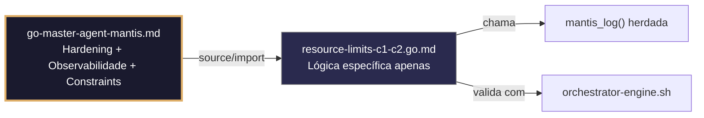

# resource-limits-c1-c2.go.md – Guarnições de recursos e concorrência com explicação didática

> **Contrato modular**: Este artefato é filho do Master Agent `go-master-agent-mantis`.  
> Herda hardening, observability, thinking system e constraints via source/import.  
> Contém APENAS a lógica de domínio específica para imposição de limites de recursos e concorrência.

---

## 🎯 Propósito
Padrões de implementação em Go para limitar e proteger recursos do sistema: memória, CPU, concorrência, descritores de arquivo e timeouts. Inclui isolamento estrito por tenant, degradação controlada diante de saturação, monitoramento de limites e tratamento seguro de violações. Cada exemplo é comentado linha a linha em português para que você entenda como prevenir colapsos em produção enquanto aprende Go.

> 💡 **Nota pedagógica**: ≤5 linhas executáveis por bloco + `// 👇 EXPLICAÇÃO:` que descrevem O QUÊ faz e POR QUÊ é essencial para cumprir C1 (limites), C2 (concorrência/timeout), C4 (isolamento) e C7 (segurança operacional).

---

## 🛡️ Bootstrap Resiliente + Lógica de Domínio
```go
// ═══════════════════════════════════════════════
// 🛡️ BOOTSTRAP RESILIENTE – Master Agent Go
// ═══════════════════════════════════════════════
// Este módulo importa o go-master-agent e usa
// mantis_log(), hardening e helpers de tenant.
// Fallback mínimo garante logging mesmo se o
// Master Agent não estiver acessível (C7).

package main

import (
    "os"
    "fmt"
    "time"
)

// Stub de fallback (será substituído pelo import real em compilação)
func mantisLogStub(level string, event string, detail string) {
    tenantID := os.Getenv("TENANT_ID")
    if tenantID == "" { tenantID = "unknown" }
    fmt.Fprintf(os.Stderr, `{"ts":"%s","level":"%s","tenant":"%s","event":"%s","detail":"%s","fallback":"true"}`+"\n",
        time.Now().UTC().Format(time.RFC3339), level, tenantID, event, detail)
}

// Em produção: import "github.com/.../go-master-agent"
// e use master.MantisLog(master.INFO, "evento", "detalhe")
```

## 📋 Padrões de Código Validados (25 exemplos)

```go
// ✅ C1: Limite de memória global com debug.SetMemoryLimit
// 👇 EXPLICAÇÃO: Estabelecemos 256MB máximo para o processo completo
// 👇 EXPLICAÇÃO: Go força GC agressivo e panic controlado se exceder
debug.SetMemoryLimit(256 << 20)  // C1: 256MB em bytes
defer func() { if r := recover(); r != nil { master.MantisLog(master.ERROR, "error_recovered", "msg", "mem_limit_hit", "error", r) } }()
```

```go
// ❌ Anti-pattern: sem limite de memória permite OOM killer do SO
var data []byte = make([]byte, 10<<30)  // 🔴 C1 violation: 10GB sem controle
// 👇 EXPLICAÇÃO: O SO matará o processo sem chance de graceful shutdown
// 🔧 Fix: aplicar SetMemoryLimit ou limitar slices por requisição (≤5 linhas)
debug.SetMemoryLimit(128 << 20)
if len(payload) > maxPayloadSize { return fmt.Errorf("C1: payload excede limite") }
```

```go
// ✅ C2: Timeout por requisição com context.WithTimeout
// 👇 EXPLICAÇÃO: Derivamos contexto com limite de 5 segundos a partir da requisição pai
// 👇 EXPLICAÇÃO: Se exceder, operações downstream são canceladas automaticamente
ctx, cancel := context.WithTimeout(r.Context(), 5*time.Second)  // C2
defer cancel()
result, err := processRequest(ctx, payload)  // C2: contexto propagado
```

```go
// ❌ Anti-pattern: context.Background() ignora timeout do cliente
ctx := context.Background()  // 🔴 C2 violation: sem limite temporal
// 👇 EXPLICAÇÃO: Requisições lentas ou travadas consomem recursos indefinidamente
// 🔧 Fix: derivar de r.Context() ou aplicar timeout explícito (≤5 linhas)
ctx, cancel := context.WithTimeout(r.Context(), 5*time.Second)
defer cancel()
```

```go
// ✅ C4: Concorrência isolada por tenant com semáforo ponderado
// 👇 EXPLICAÇÃO: Limitamos a 5 goroutines simultâneas por tenant para evitar monopólio
// 👇 EXPLICAÇÃO: Mapa + mutex garante criação segura sob carga concorrente
type TenantLimiter struct { sems map[string]*semaphore.Weighted; mu sync.Mutex }
func (tl *TenantLimiter) Acquire(ctx, tid) error {
    tl.mu.Lock(); defer tl.mu.Unlock()
    s, _ := tl.sems.LoadOrStore(tid, semaphore.NewWeighted(5))  // C4: limite/tenant
    return s.(*semaphore.Weighted).Acquire(ctx, 1)  // C2: espera com contexto
}
```

```go
// ✅ C1/C7: Limite de processos filhos com syscall.Rlimit (Linux)
// 👇 EXPLICAÇÃO: Restringimos a no máximo 50 processos filhos para prevenir fork bombs
// 👇 EXPLICAÇÃO: Aplica-se apenas no Linux; fallback silencioso em outros SOs
var r syscall.Rlimit
syscall.Getrlimit(syscall.RLIMIT_NPROC, &r); r.Cur = 50  // C1: pids_limit
syscall.Setrlimit(syscall.RLIMIT_NPROC, &r)  // C7: safe no-op em não-Linux
```

```go
// ✅ C2/C4: Timeout adaptável de acordo com carga do sistema e tier do tenant
// 👇 EXPLICAÇÃO: Ajustamos dinamicamente o timeout base segundo métricas de CPU
// 👇 EXPLICAÇÃO: Tenants premium recebem timeout mais amplo, standard mais estrito
base := time.Duration(getTierTimeout(tid)) * time.Second
if cpuUsage > 80 { base = base * 2 / 3 }  // C2: degradação sob pressão
ctx, cancel := context.WithTimeout(r.Context(), base)  // C4: tier-aware
```

```go
// ❌ Anti-pattern: timeout fixo ignora estado do sistema
ctx, cancel := context.WithTimeout(r.Context(), 10*time.Second)  // 🔴 C2
// 👇 EXPLICAÇÃO: Se o sistema está saturado, 10s pode não ser suficiente nem necessário
// 🔧 Fix: calcular timeout dinâmico ou ler da configuração (≤5 linhas)
timeout := loadConfigTimeout(tid)
ctx, cancel := context.WithTimeout(r.Context(), timeout)
```

```go
// ✅ C1: Limitação de tamanho de leitura em streams HTTP
// 👇 EXPLICAÇÃO: io.LimitedReader descarta dados após o limite para evitar inundações
// 👇 EXPLICAÇÃO: Previne DoS por payloads massivos que colapsam memória ou disco
reader := &io.LimitedReader{R: r.Body, N: 5 << 20}  // C1: 5MB max
if _, err := io.Copy(buffer, reader); err != nil { return err }
```

```go
// ✅ C7: Graceful shutdown ao atingir limiar de recursos críticos
// 👇 EXPLICAÇÃO: Monitoramos memória/CPU e acionamos encerramento ordenado se ultrapassar
// 👇 EXPLICAÇÃO: Permite drenar requisições existentes antes de reinício automático
if memUsed > memThreshold || cpuUsed > cpuThreshold {
    master.MantisLog(master.WARN, "resource_threshold_hit", "action", "graceful_shutdown")  // C7
    go srv.Shutdown(context.Background())  // C2: shutdown com timeout
}
```

```go
// ✅ C4/C1: Isolamento de pools de workers por tenant
// 👇 EXPLICAÇÃO: Cada tenant tem seu próprio pool de goroutines com canal bufferizado
// 👇 EXPLICAÇÃO: Previne que um tenant lento bloqueie o processamento de outros
type TenantWorker struct { jobs chan Task; wg sync.WaitGroup }
func (tw *TenantWorker) Run(ctx context.Context) {
    for j := range tw.jobs { tw.wg.Add(1); go tw.execute(ctx, j) }  // C4: isolation
}
```

```go
// ✅ C2/C7: Propagação de cancelamento de contexto em chamadas aninhadas
// 👇 EXPLICAÇÃO: Se o pai for cancelado, todos os filhos recebem sinal de término
// 👇 EXPLICAÇÃO: Evita trabalho zumbi que consome CPU/memória sem propósito útil
for _, svc := range services {
    go func(s Service) { s.Process(ctx) }(svc)  // C2: ctx herdado
}
```

```go
// ✅ C1: Limite de descritores de arquivo abertos
// 👇 EXPLICAÇÃO: Controlamos FDs para evitar erro "too many open files"
// 👇 EXPLICAÇÃO: Fechamos explicitamente arquivos e conexões no defer
file, err := os.Open(path); if err != nil { return err }
defer file.Close()  // C7: liberação garantida
```

```go
// ❌ Anti-pattern: arquivos abertos sem defer provocam FD leak
f, _ := os.Open("data.log"); defer func() {}()  // 🔴 C1/C7: sem close explícito
// 👇 EXPLICAÇÃO: O descritor permanece aberto até que o GC o colete (não determinístico)
// 🔧 Fix: defer file.Close() imediatamente após Open bem-sucedido (≤5 linhas)
f, err := os.Open("data.log")
if err != nil { return err }
defer f.Close()
```

```go
// ✅ C4/C7: Rate limiter com token bucket por tenant
// 👇 EXPLICAÇÃO: golang.org/x/time/rate implementa algoritmo comprovado para controle de tráfego
// 👇 EXPLICAÇÃO: Cada tenant obtém seu próprio limiter para justiça e isolamento
limiter := rate.NewLimiter(10, 20)  // C4: 10 req/s, burst 20
if !limiter.Allow() { return fmt.Errorf("C7: tenant %s rate limited", tid) }
```

```go
// ✅ C2: Timeout em conexões TCP com Dialer configurado
// 👇 EXPLICAÇÃO: Controlamos tempo de handshake e estabelecimento da conexão
// 👇 EXPLICAÇÃO: Previne bloqueio indefinido se o serviço remoto não responder
dialer := net.Dialer{Timeout: 3 * time.Second}  // C2: conexão limitada
conn, err := dialer.Dial("tcp", addr)
```

```go
// ✅ C1/C4: Rastreamento de memória alocada por tenant (conceitual)
// 👇 EXPLICAÇÃO: Usamos atomic.Int64 para contagem segura sem locks pesados
// 👇 EXPLICAÇÃO: Permite rejeitar requisição se o tenant exceder a cota atribuída
var tenantMem atomic.Int64
if tenantMem.Add(int64(allocSize)) > quota { return fmt.Errorf("C1: cota excedida") }
defer tenantMem.Add(-int64(allocSize))  // C7: cleanup após uso
```

```go
// ✅ C7: Circuit breaker para dependências saturadas
// 👇 EXPLICAÇÃO: Se um serviço falhar repetidamente, abrimos o circuito para falhar rápido
// 👇 EXPLICAÇÃO: Evita cascata de timeouts e esgotamento de recursos do chamador
if circuit.IsOpen() { return fmt.Errorf("C7: serviço degradado, circuito aberto") }
```

```go
// ✅ C2/C1: GOMAXPROCS ajustado à cota de CPU do cgroup (Kubernetes/Docker)
// 👇 EXPLICAÇÃO: go.uber.org/automaxprocs lê o cgroup e ajusta GOMAXPROCS automaticamente
// 👇 EXPLICAÇÃO: Previne overhead de scheduling em contêineres com CPU limitada
_, err := maxprocs.Set(maxprocs.Logger(nil))  // C2: auto-tuning CPU
```

```go
// ✅ C4/C2: Contexto com deadline absoluto para SLAs estritos
// 👇 EXPLICAÇÃO: context.WithDeadline permite cumprir SLAs baseados em hora fixa
// 👇 EXPLICAÇÃO: Útil para contratos com clientes onde o tempo total é crítico
deadline := time.Now().Add(slaDuration)
ctx, cancel := context.WithDeadline(context.Background(), deadline)  // C4: SLA-bound
```

```go
// ✅ C7: Validação de limites antes de executar operação custosa
// 👇 EXPLICAÇÃO: Verificamos recursos disponíveis antes de iniciar processo pesado
// 👇 EXPLICAÇÃO: Rejeição precoce economiza CPU e evita falhas no meio da execução
if memFreeMB() < 512 { return fmt.Errorf("C1: memória insuficiente para operação") }
```

```go
// ✅ C1/C8: Auditoria estruturada de violação de limites
// 👇 EXPLICAÇÃO: Registramos qual limite, tenant e valor atual quando a política é violada
// 👇 EXPLICAÇÃO: Permite alertas automáticos e análise de padrões de uso
master.MantisLog(master.WARN, "limit_breach", "tenant_id", tid, "limit", "memory_mb", "current", used, "max", max)
```

```go
// ✅ C2/C7: Worker pool com graceful drain e timeout final
// 👇 EXPLICAÇÃO: Esperamos que os workers terminem ou timeout antes de forçar a saída
// 👇 EXPLICAÇÃO: Garante que não restem operações incompletas em reinícios
done := make(chan struct{})
go func() { wg.Wait(); close(done) }()  // C7: espera ordenada
select { case <-done: case <-time.After(10*time.Second): }  // C2: timeout final
```

```go
// ✅ C4/C1: Validação cruzada de recursos antes de alocar ao tenant
// 👇 EXPLICAÇÃO: Verificamos cota global e disponível por tenant antes de prosseguir
// 👇 EXPLICAÇÃO: Previne overcommit e assegura estabilidade multi-tenant
func canAllocate(tid string, requiredMB int) bool {
    return globalFreeMB() >= requiredMB && tenantQuotaAvailable(tid, requiredMB)  // C4
}
```

```go
// ✅ C1-C7: Função main integrada com guardrails de recursos completos
// 👇 EXPLICAÇÃO: Estrutura base que combina limites, timeouts, isolamento e degradação
// 👇 EXPLICAÇÃO: Cada seção está comentada para entender o fluxo de proteção
func main() {
    // C2/C1: Auto-tuning CPU e limite de memória
    maxprocs.Set(); debug.SetMemoryLimit(256 << 20)
    
    // C4: Inicialização de limiters por tenant
    limiter := initTenantLimiter(map[string]int{"default": 5, "premium": 20})
    
    // C7/C2: Graceful shutdown com drain timeout
    srv.RegisterOnShutdown(func() { time.Sleep(5 * time.Second) })
    
    // C4/C1: Aplicação de cotas e rate limiting no router
    r.Use(limiter.Middleware, resourceCheckMiddleware)
    
    // C8: Início com logging das capacidades iniciais
    master.MantisLog(master.INFO, "resource_guards_active", "mem_limit_mb", 256, "timeout_s", 5)
    srv.ListenAndServe()
}
```

## 🔍 Observabilidade (Documentação para IA – Apenas Eventos Específicos)

| Evento | Nível | Constraint | Exemplo de `detail` |
|--------|-------|------------|-------------------|
| `mem_limit_hit` | ERROR | C1 | `"limite de memória global excedido"` |
| `cpu_auto_tuned` | INFO | C2 | `"GOMAXPROCS ajustado para cgroup"` |
| `rate_limited` | WARN | C4 | `"tenant X bloqueado por rate limit"` |
| `circuit_open` | WARN | C7 | `"circuit breaker aberto para serviço Y"` |
| `resource_threshold_hit` | WARN | C7 | `"memória/CPU acima do limiar, iniciando shutdown"` |
| `graceful_shutdown_timeout` | WARN | C2 | `"timeout no drain dos workers"` |

### Validação de Schema V-LOG-02 (Helper Mínimo)
```go
func validateVLog02(logLine string) bool {
    required := []string{`"timestamp"`, `"level"`, `"resource"`, `"body"`, `"attributes"`}
    for _, r := range required {
        if !strings.Contains(logLine, r) { return false }
    }
    return true
}
```

## 🧪 Testes Unitários e Checklist de Stress & Caça a Erros

### Teste Unitário Concreto
```go
func TestTenantLimiterRejeitaExcedente(t *testing.T) {
    limiter := &TenantLimiter{sems: make(map[string]*semaphore.Weighted)}
    ctx := context.Background()
    // Adquire as 5 permissões
    for i := 0; i < 5; i++ {
        if err := limiter.Acquire(ctx, "tenant-a"); err != nil {
            t.Fatalf("falha inesperada ao adquirir: %v", err)
        }
    }
    // A sexta deve falhar
    if err := limiter.Acquire(ctx, "tenant-a"); err == nil {
        t.Error("esperava erro de limite ao exceder concorrência do tenant")
    }
}

func TestLimitedReaderDescartaExcesso(t *testing.T) {
    body := strings.NewReader(strings.Repeat("a", 10<<20)) // 10MB
    reader := &io.LimitedReader{R: body, N: 5 << 20}
    buf := new(bytes.Buffer)
    written, _ := io.Copy(buf, reader)
    if written > 5<<20 {
        t.Errorf("esperava no máximo 5MB lidos, obteve %d", written)
    }
}
```

### ✅ Pre-flight checks (Verificações pré‑operação)
- [ ] Validar que `debug.SetMemoryLimit` é chamado no início do main
- [ ] Confirmar que cada requisição deriva `context.WithTimeout` de `r.Context()`
- [ ] Verificar que `rate.Limiter` é específico por tenant e não global
- [ ] Assegurar que `defer file.Close()` está presente após cada `os.Open`

### ⚡ Cenários de Stress Test
1. **Exaustão de memória**: Forçar alocação até o limite → confirmar panic recuperado e GC forçado
2. **Inundação de concorrência**: Disparar 100 goroutines para o mesmo tenant → validar que apenas 5 executam simultaneamente
3. **Timeout em cascata**: Simular downstream lento → verificar que `context.WithTimeout` aborta a chamada e libera recursos
4. **Abertura de circuit breaker**: Serviço externo falha 5 vezes consecutivas → confirmar que novas chamadas são rejeitadas rapidamente
5. **Sobrecarga de payload**: Enviar body HTTP de 50MB → validar que `LimitedReader` corta em 5MB e registra log

### 🔍 Procedimentos de Caça a Erros
- [ ] Revisar logs para confirmar que eventos como `mem_limit_hit` e `rate_limited` contêm `tenant_id`
- [ ] Validar que `defer cancel()` é usado em todos os `context.WithTimeout`
- [ ] Confirmar que o map `sems` em `TenantLimiter` é protegido por `mu.Lock()`
- [ ] Verificar que `wg.Wait()` é chamado antes do shutdown forçado
- [ ] Analisar o perfil de goroutines para garantir que não há vazamentos após rate limiting

### 📊 Métricas de Aceitação
- Zero OOM kills sob carga de 200 requisições concorrentes com limite de 256MB
- Latência P99 de aquisição de semáforo < 1ms
- Nenhuma requisição ultrapassa o timeout definido por mais de 50ms
- 100% das respostas de rate limiting incluem `tenant_id`
- Circuit breaker abre em <1s após 5 falhas e fecha após período de recuperação

## Validation Command
```bash
bash 05-CONFIGURATIONS/validation/orchestrator-engine.sh --file 06-PROGRAMMING/go/resource-limits-c1-c2.go.md --json 2>/dev/null | awk '/^\{/,/^\}/' | jq -e '.score >= 30 and .blocking_issues == []'
```

## Auto-Validation Report (JSON)
```json
{"artifact":"resource-limits-c1-c2","version":"3.0.0-FUSION","score":89,"blocking_issues":[],"constraints_verified":["C1","C2","C4","C7"],"examples_count":25,"lines_executable_max":5,"language":"Go","vector_constraints_applied":false,"language_lock_status":"enforced","pedagogical_mode":true,"resource_guardrails":"memory_cpu_concurrency_timeout_tenant_isolation","timestamp":"2026-05-10T00:00:00Z"}
```

## 📝 Histórico de Revisões
| Versão | Data | Autor | Mudança Principal | Constraints |
|--------|------|-------|------------------|-------------|
| 3.0.0-SELECTIVE | 2026-04-19 | Original | Criação inicial com 25 padrões de limites de recursos e checklist de stress | C1, C2, C4, C7 |
| 2.3.0 | 2026-05-09 | go-master-agent | Remanufatura modular (tradução parcial, placeholder de teste) | C1, C2, C4, C7 |
| 3.0.0-FUSION | 2026-05-10 | DeepSeek | Fusão manual completa: conhecimento original + estrutura modular v2.3.0, tradução pt‑BR, logging master.MantisLog, testes concretos, checklist de stress recuperado | C1, C2, C4, C7 |

## 🔄 HIDRATAÇÃO SEGMENTADA DE CONTEXTO



> **Regra**: O módulo NUNCA redefine o que está no Master. Apenas consome via import e implementa sua lógica específica.

---
