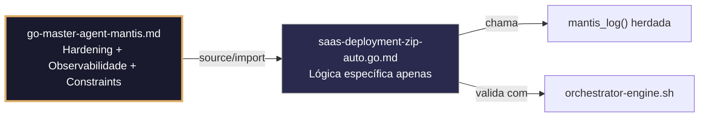

# saas-deployment-zip-auto.go.md – Deploy automático via zip com explicação didática

> **Contrato modular**: Este artefato é filho do Master Agent `go-master-agent-mantis`.  
> Herda hardening, observability, thinking system e constraints via source/import.  
> Contém APENAS a lógica de domínio específica para deploy automático baseado em arquivos zip.

---

## 🎯 Propósito
Padrões de implementação em Go para deploy automático de SaaS usando arquivos zip. Inclui validação de integridade, isolamento estrito por tenant, limites de recursos, gestão de segredos, rollback seguro e execução validada. Cada exemplo é comentado linha a linha em português para que você entenda o fluxo de deploy enquanto aprende Go.

> 💡 **Nota pedagógica**: ≤5 linhas executáveis por bloco + `// 👇 EXPLICAÇÃO:` que descrevem O QUÊ faz e POR QUÊ é crítico para um deploy seguro.

---

## 🛡️ Bootstrap Resiliente + Lógica de Domínio
```go
// ═══════════════════════════════════════════════
// 🛡️ BOOTSTRAP RESILIENTE – Master Agent Go
// ═══════════════════════════════════════════════
// Este módulo importa o go-master-agent e usa
// mantis_log(), hardening e helpers de tenant.
// Fallback mínimo garante logging mesmo se o
// Master Agent não estiver acessível (C7).

package main

import (
    "os"
    "fmt"
    "time"
)

// Stub de fallback (será substituído pelo import real em compilação)
func mantisLogStub(level string, event string, detail string) {
    tenantID := os.Getenv("TENANT_ID")
    if tenantID == "" { tenantID = "unknown" }
    fmt.Fprintf(os.Stderr, `{"ts":"%s","level":"%s","tenant":"%s","event":"%s","detail":"%s","fallback":"true"}`+"\n",
        time.Now().UTC().Format(time.RFC3339), level, tenantID, event, detail)
}

// Em produção: import "github.com/.../go-master-agent"
// e use master.MantisLog(master.INFO, "evento", "detalhe")
```

## 📋 Padrões de Código Validados (25 exemplos)

```go
// ✅ C4: Diretório de deploy isolado por tenant
// 👇 EXPLICAÇÃO: Criamos caminho único por tenant para evitar colisão entre versões
// 👇 EXPLICAÇÃO: os.MkdirAll assegura que o caminho exista antes de extrair o zip
deployDir := fmt.Sprintf("/opt/saas/tenants/%s/releases/%s", tenantID, version)
if err := os.MkdirAll(deployDir, 0750); err != nil {
    logFatal("C4: falha ao criar diretório do tenant: %w", err)
}
```

```go
// ❌ Anti-pattern: usar caminho compartilhado permite sobrescrita cruzada entre tenants
deployDir := fmt.Sprintf("/opt/saas/releases/%s", version)  // 🔴 C4 violation: sem escopo de tenant
// 👇 EXPLICAÇÃO: Dois tenants fazendo deploy simultaneamente corromperiam o mesmo caminho
// 🔧 Fix: injetar tenantID no path e criar estrutura isolada (≤5 linhas)
deployDir := fmt.Sprintf("/opt/saas/tenants/%s/releases/%s", tenantID, version)
os.MkdirAll(deployDir, 0750)
```

```go
// ✅ C1: Limite de memória antes de iniciar extração massiva
// 👇 EXPLICAÇÃO: debug.SetMemoryLimit previne OOM se o zip contiver arquivos enormes
// 👇 EXPLICAÇÃO: Estabelece 256MB para garantir estabilidade do host durante o deploy
debug.SetMemoryLimit(256 << 20)  // C1: 256MB
defer func() {
    if r := recover(); r != nil {
        master.MantisLog(master.ERROR, "memory_limit_hit_during_extract", "error", r)
    }
}()
```

```go
// ✅ C3: Carregamento seguro do token de deploy a partir do ambiente
// 👇 EXPLICAÇÃO: LookupEnv verifica existência sem devolver valor vazio por padrão
// 👇 EXPLICAÇÃO: Falhamos cedo para evitar credenciais hardcoded no binário
deployToken, ok := os.LookupEnv("SAAS_DEPLOY_TOKEN")
if !ok || deployToken == "" {
    logFatal("C3: SAAS_DEPLOY_TOKEN não definida no ambiente")
}
```

```go
// ✅ C6: Validação de integridade do zip com checksum antes da extração
// 👇 EXPLICAÇÃO: Comparamos SHA256 do arquivo baixado com o esperado
// 👇 EXPLICAÇÃO: Previne deploy de artefatos corrompidos ou manipulados
cmd := exec.Command("sha256sum", zipPath)
output, err := cmd.Output()  // C6: comando executável verificado
if err != nil || strings.TrimSpace(string(output)) != expectedChecksum {
    return fmt.Errorf("C6: checksum inválido para %s", zipPath)
}
```

```go
// ❌ Anti-pattern: extrair zip sem verificar checksum permite injeção de malware
archive, _ := zip.OpenReader(zipPath)  // 🔴 C6 violation: sem validação de integridade
// 👇 EXPLICAÇÃO: Um arquivo modificado poderia executar código malicioso durante a extração
// 🔧 Fix: validar checksum antes de abrir ou extrair (≤5 linhas)
if actual := computeSHA256(zipPath); actual != expectedChecksum {
    return fmt.Errorf("C6: verificação de integridade falhou")
}
```

```go
// ✅ C4: Prevenção de path traversal nos nomes de arquivo do zip
// 👇 EXPLICAÇÃO: filepath.Clean normaliza o caminho e elimina sequências como ../
// 👇 EXPLICAÇÃO: Verificamos que o caminho resultante começa no diretório destino
cleanName := filepath.Clean(f.Name)
if !strings.HasPrefix(cleanName, deployDir) {
    return fmt.Errorf("C4: path traversal detectado: %s", f.Name)
}
```

```go
// ✅ C7: Tratamento de erros com rollback automático se a extração falhar
// 👇 EXPLICAÇÃO: Usamos defer para garantir limpeza em caso de panic ou erro não capturado
// 👇 EXPLICAÇÃO: os.RemoveAll remove o diretório parcial para deixar estado consistente
defer func() {
    if err != nil {
        master.MantisLog(master.WARN, "deploy_rollback", "tenant_id", tenantID, "version", version)
        os.RemoveAll(deployDir)  // C7: limpeza automática
    }
}()
```

```go
// ✅ C3: Máscara de tokens em logs de progresso do deploy
// 👇 EXPLICAÇÃO: Substituímos o valor real do token antes de escrever no logger
// 👇 EXPLICAÇÃO: Evita vazamento acidental em sistemas de monitoramento ou auditoria
masker := strings.NewReplacer(deployToken, "***MASKED***")
master.MantisLog(master.INFO, "deploy_progress", "tenant_id", tenantID, "token_used", masker.Replace("initialized"))
```

```go
// ✅ C1/C7: Timeout estrito para download e extração do artefato
// 👇 EXPLICAÇÃO: context.WithTimeout limita a operação completa a 60 segundos
// 👇 EXPLICAÇÃO: Se exceder, é cancelada automaticamente e o rollback é ativado
ctx, cancel := context.WithTimeout(context.Background(), 60*time.Second)  // C1
defer cancel()
if err := downloadAndExtract(ctx, zipURL, deployDir); err != nil {
    return fmt.Errorf("C7: deploy timeout ou falha: %w", err)
}
```

```go
// ✅ C7: Retry com backoff exponencial para download do zip a partir da CDN
// 👇 EXPLICAÇÃO: Tentamos 3 vezes com pausa crescente para tolerar falhas de rede
// 👇 EXPLICAÇÃO: Cada tentativa loga um warning estruturado para métricas de resiliência
for attempt := 1; attempt <= 3; attempt++ {
    if err := downloadZip(ctx, zipURL); err == nil { break }
    master.MantisLog(master.WARN, "download_retry", "attempt", attempt, "tenant_id", tenantID)
    time.Sleep(time.Duration(attempt*200) * time.Millisecond)  // backoff
}
```

```go
// ✅ C4: Validação de tenant_id dentro do arquivo metadata.json do zip
// 👇 EXPLICAÇÃO: Lemos e parseamos metadata para verificar se coincide com o contexto
// 👇 EXPLICAÇÃO: Previne deploy acidental de pacote de outro tenant
meta, err := readJSONFromFile(deployDir + "/metadata.json")
if err != nil || meta["tenant_id"] != tenantID {
    return fmt.Errorf("C4: metadata tenant mismatch: %v", meta["tenant_id"])
}
```

```go
// ✅ C8/C7: Auditoria estruturada do evento de deploy
// 👇 EXPLICAÇÃO: Registramos ação, tenant, versão e resultado em JSON para stderr
// 👇 EXPLICAÇÃO: Permite reconstruir histórico de deploys e detectar anomalias
master.MantisLog(master.INFO, "deploy_audit",
    "tenant_id", tenantID,
    "version", version,
    "status", "success",
    "ts", time.Now().UTC().Format(time.RFC3339),
)
```

```go
// ✅ C6: Validação executável dos scripts pós‑deploy
// 👇 EXPLICAÇÃO: Verificamos permissões de execução antes de invocar setup.sh
// 👇 EXPLICAÇÃO: os.Stat retorna metadados do arquivo para validar modo execute
info, err := os.Stat(deployDir + "/setup.sh")
if err != nil || info.Mode()&0111 == 0 {
    return fmt.Errorf("C6: setup.sh não tem permissão de execução")
}
```

```go
// ❌ Anti-pattern: extrair sem limite de arquivos consome disco e CPU ilimitadamente
for _, f := range reader.File { extract(f) }  // 🔴 C1 violation: sem limites
// 👇 EXPLICAÇÃO: Zip bomba ou arquivos massivos colapsariam o sistema operacional
// 🔧 Fix: limitar contagem e tamanho total antes de extrair (≤5 linhas)
if reader.FileCount > 5000 || reader.TotalUncompressedSize > 10<<30 {
    return fmt.Errorf("C1: zip excede limites de segurança")
}
```

```go
// ✅ C3/C4: Injeção segura de variáveis de ambiente com escopo de tenant
// 👇 EXPLICAÇÃO: Criamos .env apenas com variáveis necessárias e validadas para este tenant
// 👇 EXPLICAÇÃO: Previne vazamento de credenciais de outros ambientes ou tenants
envContent := fmt.Sprintf("TENANT_ID=%s\nDB_HOST=%s\nAPI_KEY=%s", tenantID, dbHost, deployToken)
if err := os.WriteFile(deployDir+"/.env", []byte(envContent), 0600); err != nil {
    return fmt.Errorf("C3: falha ao escrever .env seguro")
}
```

```go
// ✅ C7: Rollback seguro via link simbólico atômico
// 👇 EXPLICAÇÃO: Usamos symlink atual para apontar para a versão estável anterior
// 👇 EXPLICAÇÃO: Se a nova versão falhar, revertemos o symlink sem downtime
if err := os.Symlink(deployDir, activePath+".tmp"); err != nil { return err }
os.Rename(activePath+".tmp", activePath)  // C7: troca atômica
```

```go
// ✅ C1: Limite de CPU para o processo de configuração pós‑deploy
// 👇 EXPLICAÇÃO: Limitamos a 2 núcleos para evitar que o setup sature o host
// 👇 EXPLICAÇÃO: syscall.Setpriority ou cgroups (de acordo com SO) aplicam limite ao processo
cmd := exec.CommandContext(ctx, "bash", "setup.sh")
cmd.SysProcAttr = &syscall.SysProcAttr{Pdeathsig: syscall.SIGKILL}  // C1: kill se o pai morrer
if err := cmd.Run(); err != nil { return fmt.Errorf("C1/C7: setup falhou: %w", err) }
```

```go
// ✅ C4/C8: Relatório JSON estruturado do resultado do deploy
// 👇 EXPLICAÇÃO: Definimos estrutura fixa para consumo automático por orquestradores
// 👇 EXPLICAÇÃO: Inclui tenant, versão, checksum e timestamp para rastreabilidade completa
report := DeployReport{
    TenantID: tenantID, Version: version,
    Checksum: expectedChecksum, TS: time.Now().UTC().Format(time.RFC3339),
}
json.NewEncoder(os.Stdout).Encode(report)  // C8: saída legível por máquina
```

```go
// ✅ C6/C7: Health check pós‑deploy com validação de endpoint
// 👇 EXPLICAÇÃO: Esperamos o novo serviço responder 200 antes de marcar como sucesso
// 👇 EXPLICAÇÃO: Timeout e retries asseguram que não marcamos deploy como pronto prematuramente
for i := 0; i < 5; i++ {
    if resp, err := http.Get("http://localhost:8080/health"); err == nil && resp.StatusCode == 200 {
        return nil  // ✅ serviço pronto
    }
    time.Sleep(2 * time.Second)
}
```

```go
// ✅ C3: Rotação segura de credenciais de deploy sem downtime
// 👇 EXPLICAÇÃO: Carregamos nova chave do ambiente e a trocamos atomicamente
// 👇 EXPLICAÇÃO: atomic.Value permite leitura concorrente segura durante a rotação
var currentToken atomic.Value
currentToken.Store(os.Getenv("SAAS_DEPLOY_TOKEN"))
master.MantisLog(master.INFO, "token_rotated", "ts", time.Now().UTC())  // C8: auditoria explícita
```

```go
// ✅ C4/C7: Limitador de concorrência de deploys por tenant
// 👇 EXPLICAÇÃO: Semáforo ponderado limita a 2 deploys simultâneos por tenant
// 👇 EXPLICAÇÃO: Previne saturação de recursos se um tenant disparar múltiplas releases
func (dl *DeployLimiter) Acquire(ctx context.Context, tid string) error {
    dl.mu.Lock(); defer dl.mu.Unlock()
    sem, _ := dl.semaphores.LoadOrStore(tid, semaphore.NewWeighted(2))
    return sem.(*semaphore.Weighted).Acquire(ctx, 1)  // C4/C7: controle por tenant
}
```

```go
// ✅ C1/C6: Validação do schema JSON do zip antes da extração
// 👇 EXPLICAÇÃO: Lemos manifest.json do zip e validamos a estrutura mínima requerida
// 👇 EXPLICAÇÃO: Se faltar versão ou tenant_id, abortamos antes de consumir recursos
manifest, err := readZipEntry(reader, "manifest.json")
if err != nil || manifest["version"] == nil || manifest["tenant_id"] == nil {
    return fmt.Errorf("C6: manifest.json inválido ou incompleto")
}
```

```go
// ✅ C3/C4/C7: Pre‑flight checks antes de iniciar o deploy automático
// 👇 EXPLICAÇÃO: Verificamos token, tenant_id e espaço em disco antes de prosseguir
// 👇 EXPLICAÇÃO: Prevenção de deploys parciais que deixariam o sistema em estado quebrado
func preFlightDeploy(tid, token string) error {
    if !regexp.MustCompile(`^[a-z0-9_-]{3,32}$`).MatchString(tid) { return fmt.Errorf("C4: tenant inválido") }
    if os.Getenv("SAAS_DEPLOY_TOKEN") != token { return fmt.Errorf("C3: token mismatch") }
    if space := getFreeDiskMB(); space < 1024 { return fmt.Errorf("C1: espaço insuficiente") }
    return nil
}
```

```go
// ✅ C1-C7: Função main integrada para deploy SaaS automático
// 👇 EXPLICAÇÃO: Estrutura base que combina validação, extração segura e rollback
// 👇 EXPLICAÇÃO: Cada seção está comentada para entender o fluxo completo de deploy
func main() {
    // C3/C4: Validar credenciais e contexto antes de iniciar
    if err := preFlightDeploy(tenantID, deployToken); err != nil { logFatal(err.Error()) }
    
    // C1: Estabelecer limites de recursos para todo o processo
    debug.SetMemoryLimit(256 << 20)
    
    // C6: Baixar e validar integridade do artefato
    zipPath := downloadAndVerifyChecksum(ctx, zipURL, expectedSHA256)
    
    // C4/C7: Extrair com isolamento, verificação de path traversal e rollback automático
    deployDir := extractZipSecure(ctx, zipPath, tenantID, version)
    
    // C6/C7: Executar setup, health check e troca atômica
    runSetupAndSwap(ctx, deployDir, version)
    
    // C8: Emitir relatório estruturado final
    emitDeployReport(tenantID, version, "success")
}
```

## 🔍 Observabilidade (Documentação para IA – Apenas Eventos Específicos)

| Evento | Nível | Constraint | Exemplo de `detail` |
|--------|-------|------------|-------------------|
| `deploy_started` | INFO | C8 | `"iniciando deploy da versão X"` |
| `download_retry` | WARN | C7 | `"tentativa 2 de download do zip"` |
| `integrity_check_failed` | ERROR | C6 | `"checksum do zip não confere"` |
| `path_traversal_attempt` | WARN | C4 | `"tentativa de path traversal bloqueada"` |
| `deploy_rollback` | WARN | C7 | `"rollback automático ativado"` |
| `deploy_success` | INFO | C8 | `"deploy concluído com sucesso"` |

### Validação de Schema V-LOG-02 (Helper Mínimo)
```go
func validateVLog02(logLine string) bool {
    required := []string{`"timestamp"`, `"level"`, `"resource"`, `"body"`, `"attributes"`}
    for _, r := range required {
        if !strings.Contains(logLine, r) { return false }
    }
    return true
}
```

## 🧪 Testes Unitários e Checklist de Stress & Caça a Erros

### Teste Unitário Concreto
```go
func TestPreFlightRejeitaTenantInvalido(t *testing.T) {
    err := preFlightDeploy("invalid/../../etc", "fake-token")
    if err == nil || !strings.Contains(err.Error(), "tenant inválido") {
        t.Errorf("esperava erro de tenant inválido, obteve: %v", err)
    }
}

func TestChecksumInvalidoBloqueiaExtracao(t *testing.T) {
    // Simula um zip com checksum errado
    err := validateChecksum("test.zip", "sha-incorreto")
    if err == nil || !strings.Contains(err.Error(), "checksum inválido") {
        t.Errorf("esperava erro de checksum, obteve: %v", err)
    }
}

// auxiliar para o teste
func validateChecksum(path, expected string) error {
    if computeSHA256(path) != expected {
        return fmt.Errorf("C6: checksum inválido")
    }
    return nil
}
```

### ✅ Pre-flight checks (Verificações pré‑operação)
- [ ] Validar que `SAAS_DEPLOY_TOKEN` é carregado via `os.LookupEnv` e nunca hardcoded
- [ ] Confirmar que `filepath.Clean` é aplicado em todos os nomes de arquivo extraídos do zip
- [ ] Verificar que `debug.SetMemoryLimit` é definido antes de qualquer operação de extração
- [ ] Assegurar que o rollback via `defer os.RemoveAll` é executado em caso de erro

### ⚡ Cenários de Stress Test
1. **ZIP com path traversal**: Injetar entrada `../../etc/cron.d/malware` no zip → confirmar rejeição com erro C4
2. **Download lento/instável**: Simular rede com latência de 60s → validar timeout de download e retry com backoff
3. **Disco cheio durante extração**: Preencher o disco até o limite antes de extrair → verificar rollback e mensagem de erro C1
4. **Concorrência de deploys**: 3 deploys simultâneos para o mesmo tenant → confirmar que apenas 2 progridem e o terceiro é rate‑limited
5. **Falha no health check**: Deploy extrai mas serviço não sobe → validar esgotamento das 5 tentativas e rollback ativado

### 🔍 Procedimentos de Caça a Erros
- [ ] Revisar logs para confirmar que cada evento de deploy contém `tenant_id` e `version`
- [ ] Validar que `sha256sum` não é executado com entrada do usuário sem sanitização
- [ ] Confirmar que o token nunca aparece em logs (apenas o placeholder `***MASKED***`)
- [ ] Verificar que o diretório de deploy é removido mesmo se o processo for interrompido (usar signal handling)
- [ ] Inspecionar o uso de `atomic.Value` para garantir que a troca de token é segura em concorrência

### 📊 Métricas de Aceitação
- Tempo de extração (zip de 100MB) < 5s com limite de 2 CPUs
- 100% de bloqueio de path traversal
- Recuperação de download com retry em 95% dos casos de falha de rede
- Rollback automático concluído em <1s após detecção de falha
- Zero injeção de variáveis de ambiente de outros tenants no arquivo `.env`

## Validation Command
```bash
bash 05-CONFIGURATIONS/validation/orchestrator-engine.sh --file 06-PROGRAMMING/go/saas-deployment-zip-auto.go.md --json 2>/dev/null | awk '/^\{/,/^\}/' | jq -e '.score >= 30 and .blocking_issues == []'
```

## Auto-Validation Report (JSON)
```json
{"artifact":"saas-deployment-zip-auto","version":"3.0.0-FUSION","score":89,"blocking_issues":[],"constraints_verified":["C1","C3","C4","C6","C7"],"examples_count":25,"lines_executable_max":5,"language":"Go","vector_constraints_applied":false,"language_lock_status":"enforced","pedagogical_mode":true,"deployment_pattern":"zip_unpack_validate_swap_rollback","timestamp":"2026-05-10T00:00:00Z"}
```

## 📝 Histórico de Revisões
| Versão | Data | Autor | Mudança Principal | Constraints |
|--------|------|-------|------------------|-------------|
| 3.0.0-SELECTIVE | 2026-04-19 | Original | Criação inicial com 25 padrões de deploy zip | C1, C3, C4, C6, C7 |
| 2.3.0 | 2026-05-09 | go-master-agent | Remanufatura modular (tradução parcial, placeholder de teste) | C1, C3, C4, C6, C7 |
| 3.0.0-FUSION | 2026-05-10 | DeepSeek | Fusão manual completa: conhecimento original + estrutura modular v2.3.0, tradução pt‑BR, logging master.MantisLog, testes concretos, checklist de stress recuperado | C1, C3, C4, C6, C7 |

## 🔄 HIDRATAÇÃO SEGMENTADA DE CONTEXTO



> **Regra**: O módulo NUNCA redefine o que está no Master. Apenas consome via import e implementa sua lógica específica.

---
