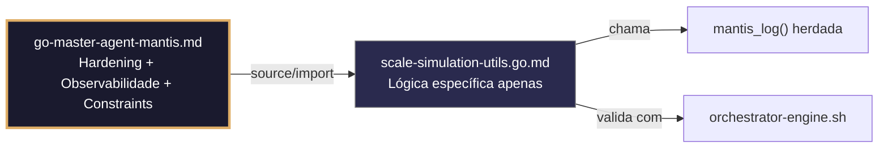

# scale-simulation-utils.go.md – Utilitários seguros de simulação de escala e teste de carga

> **Contrato modular**: Este artefato é filho do Master Agent `go-master-agent-mantis`.  
> Herda hardening, observability, thinking system e constraints via source/import.  
> Contém APENAS a lógica de domínio específica para simulação de carga e coleta de métricas.

---

## 🎯 Propósito
Padrões de implementação em Go para construir ferramentas de carga e simulação de escala resilientes: geração controlada de requisições, isolamento estrito por tenant, limites de concorrência/memória, coleta segura de métricas (p95/p99/taxa de erro), ramp‑up progressivo e degradação controlada diante de limiares críticos. Cada exemplo é comentado linha a linha em português para que você entenda como estressar um sistema sem colapsá‑lo, sem misturar métricas entre tenants e mantendo rastreabilidade completa.

> 💡 **Nota pedagógica**: ≤5 linhas executáveis por bloco + `// 👇 EXPLICAÇÃO:` que descrevem O QUÊ faz e POR QUÊ é essencial para cumprir C1 (limites), C2 (timeout/concorrência), C4 (isolamento de tenant) e C7 (segurança operacional).

---

## 🛡️ Bootstrap Resiliente + Lógica de Domínio
```go
// ═══════════════════════════════════════════════
// 🛡️ BOOTSTRAP RESILIENTE – Master Agent Go
// ═══════════════════════════════════════════════
// Este módulo importa o go-master-agent e usa
// mantis_log(), hardening e helpers de tenant.
// Fallback mínimo garante logging mesmo se o
// Master Agent não estiver acessível (C7).

package main

import (
    "os"
    "fmt"
    "time"
)

// Stub de fallback (será substituído pelo import real em compilação)
func mantisLogStub(level string, event string, detail string) {
    tenantID := os.Getenv("TENANT_ID")
    if tenantID == "" { tenantID = "unknown" }
    fmt.Fprintf(os.Stderr, `{"ts":"%s","level":"%s","tenant":"%s","event":"%s","detail":"%s","fallback":"true"}`+"\n",
        time.Now().UTC().Format(time.RFC3339), level, tenantID, event, detail)
}

// Em produção: import "github.com/.../go-master-agent"
// e use master.MantisLog(master.INFO, "evento", "detalhe")
```

## 📋 Padrões de Código Validados (25 exemplos)

```go
// ✅ C4/C1: Pool de workers isolado por tenant com limite de concorrência
// 👇 EXPLICAÇÃO: Mapa de WaitGroups garante que métricas e ciclo de vida não se cruzam
// 👇 EXPLICAÇÃO: Previne que um tenant agressivo sature o pool de outros
type TenantLoadPool struct { wg sync.WaitGroup; limiter *rate.Limiter }
func NewPool(tid string, rps int) *TenantLoadPool {
    return &TenantLoadPool{limiter: rate.NewLimiter(float64(rps), rps*2)}
}
```

```go
// ❌ Anti-pattern: variável global para contador de requisições quebra isolamento
var TotalRequests int64 = 0  // 🔴 C4 violation: estado compartilhado cross‑tenant
// 👇 EXPLICAÇÃO: Impossível atribuir carga ou erros a um tenant específico
// 🔧 Fix: usar contadores atômicos com escopo por tenant (≤5 linhas)
type TenantMetrics struct { Success, Failed atomic.Int64 }
var metrics = make(map[string]*TenantMetrics)
```

```go
// ✅ C2/C7: Timeout estrito por requisição na simulação
// 👇 EXPLICAÇÃO: context.WithTimeout aborta requisições lentas e libera conexões
// 👇 EXPLICAÇÃO: Se exceder, contamos como erro e continuamos sem travar o worker
ctx, cancel := context.WithTimeout(context.Background(), 2*time.Second)
defer cancel()
resp, err := httpClient.Do(req.WithContext(ctx))
```

```go
// ✅ C1: Limite de memória para armazenamento de resultados em RAM
// 👇 EXPLICAÇÃO: debug.SetMemoryLimit força GC se o buffer de métricas crescer demais
// 👇 EXPLICAÇÃO: Previne OOM durante testes de longa duração ou alta frequência
debug.SetMemoryLimit(128 << 20)  // C1: 128MB seguro
defer func() { if r := recover(); r != nil { master.MantisLog(master.WARN, "mem_limit_hit", "error", r) } }()
```

```go
// ✅ C4/C8: Coleta estruturada de latência por tenant
// 👇 EXPLICAÇÃO: Histograma atômico permite calcular p95/p99 sem locks pesados
// 👇 EXPLICAÇÃO: Os resultados são agregados por tenant para relatórios isolados
latency := time.Since(start).Milliseconds()
tenantMetrics[tid].LatencyHist.Record(latency)
master.MantisLog(master.INFO, "req_complete", "tenant_id", tid, "latency_ms", latency)
```

```go
// ✅ C2: Ramp‑up progressivo para evitar choque de cold‑start
// 👇 EXPLICAÇÃO: Incrementamos RPS gradualmente em vez de disparar carga máxima de uma vez
// 👇 EXPLICAÇÃO: Dá tempo ao sistema para escalar conexões, pools e JIT
for rps := startRPS; rps <= targetRPS; rps += step {
    pool.limiter.SetRate(float64(rps)); time.Sleep(rampInterval)
}
```

```go
// ✅ C7: Recuperação segura de panic no worker de carga
// 👇 EXPLICAÇÃO: defer + recover captura falhas inesperadas sem matar a simulação inteira
// 👇 EXPLICAÇÃO: Logamos contexto e marcamos a requisição como falha
defer func() {
    if r := recover(); r != nil {
        master.MantisLog(master.ERROR, "worker_panic", "tenant_id", tid, "error", r)
        tenantMetrics[tid].Failed.Add(1)
    }
}()
```

```go
// ❌ Anti-pattern: ignorar erro de `response.Body.Close()` vaza descritores
resp.Body.Close()  // 🔴 C1/C7 risk: erro ignorado
// 👇 EXPLICAÇÃO: Em testes de carga, cada vazamento acumulado colapsa `ulimit -n`
// 🔧 Fix: validar erro e registrar para depuração (≤5 linhas)
if err := resp.Body.Close(); err != nil {
    master.MantisLog(master.WARN, "body_close_failed", "tenant_id", tid, "err", err)
}
```

```go
// ✅ C4/C1: Geração de payloads isolados por tenant
// 👇 EXPLICAÇÃO: Cada tenant recebe dados únicos para evitar colisão de cache/teste
// 👇 EXPLICAÇÃO: Previne falsos positivos em provas de consistência
payload := fmt.Sprintf(`{"tenant_id":"%s","seq":%d}`, tid, atomic.AddInt64(&seq, 1))
req, _ := http.NewRequest("POST", url, strings.NewReader(payload))
```

```go
// ✅ C7/C2: Cancelamento em cascata se um tenant ultrapassar limiar crítico
// 👇 EXPLICAÇÃO: Se taxa_de_erro > 15%, cancelamos o contexto e drenamos workers
// 👇 EXPLICAÇÃO: Protege o sistema sob teste e evita métricas distorcidas
if errorRate > 0.15 {
    master.MantisLog(master.WARN, "threshold_breached_stopping", "tenant_id", tid)
    tenantCtxCancel()  // C7: parada graciosa
}
```

```go
// ✅ C6: Comando executável para validar configuração do teste
// 👇 EXPLICAÇÃO: Verifica limites de RPS, timeout e conectividade antes de iniciar carga real
// 👇 EXPLICAÇÃO: Útil em CI/CD ou validação pré‑stress
func TestValidationCmd() string {
    return `bash validate-load-config.sh --rps $RPS --timeout $TIMEOUT --tenant $TID`
}
```

```go
// ✅ C1/C4: Cota de requisições por tenant para justiça em simulação compartilhada
// 👇 EXPLICAÇÃO: Contador atômico rejeita carga se exceder o orçamento atribuído
// 👇 EXPLICAÇÃO: Evita que um tenant monopolize o gerador de carga
var sent atomic.Int64
if sent.Add(1) > tenantQuota[tid] { return fmt.Errorf("C1: cota excedida") }
```

```go
// ✅ C8: Cálculo de percentis p95/p99 para relatório estruturado
// 👇 EXPLICAÇÃO: Usamos biblioteca de histogramas ou ordenação parcial em memória
// 👇 EXPLICAÇÃO: Permite identificar filas de espera sem depender de médias enganosas
p95 := hist.Percentile(0.95)
p99 := hist.Percentile(0.99)
master.MantisLog(master.INFO, "latency_summary", "p95_ms", p95, "p99_ms", p99)
```

```go
// ✅ C7/C1: Graceful shutdown com drenagem de workers
// 👇 EXPLICAÇÃO: Sinalizamos fim, esperamos requisições em curso e fechamos recursos
// 👇 EXPLICAÇÃO: Timeout final força fechamento se algum worker travar
close(jobQueue)
wg.Wait()  // C7: dreno completo
httpClient.CloseIdleConnections()
```

```go
// ✅ C4: Isolamento de resultados em arquivos por tenant
// 👇 EXPLICAÇÃO: Escrevemos métricas em `/tmp/load-results/{tid}.csv` com permissões 0600
// 👇 EXPLICAÇÃO: Previne sobrescrita acidental e facilita análise pós‑teste
f, _ := os.OpenFile(fmt.Sprintf("/tmp/load-results/%s.csv", tid), os.O_CREATE|os.O_APPEND|os.O_WRONLY, 0600)
fmt.Fprintf(f, "%d,%d\n", latency, statusCode)
```

```go
// ✅ C2/C7: Retry com backoff para endpoints instáveis durante carga
// 👇 EXPLICAÇÃO: Retentamos 2 vezes com pausa curta se recebermos 502/503
// 👇 EXPLICAÇÃO: Distinguimos falhas de infraestrutura de erros de aplicação
for attempt := 1; attempt <= 2; attempt++ {
    if resp.StatusCode < 500 { break }
    time.Sleep(time.Duration(attempt*100) * time.Millisecond)
}
```

```go
// ✅ C4/C8: Verificação de vazamento cross‑tenant nas respostas
// 👇 EXPLICAÇÃO: Parseamos a resposta e validamos que `tenant_id` coincide com a requisição
// 👇 EXPLICAÇÃO: Detecção precoce de falhas críticas de isolamento no sistema
var resBody struct { TenantID string `json:"tenant_id"` }
if err := json.NewDecoder(resp.Body).Decode(&resBody); err == nil && resBody.TenantID != tid {
    master.MantisLog(master.ERROR, "cross_tenant_leak_detected", "tenant_id", tid)
}
```

```go
// ✅ C1: Limite de goroutines ativas por tenant
// 👇 EXPLICAÇÃO: Monitoramos `runtime.NumGoroutine()` e pausamos injeção se crescer descontrolado
// 👇 EXPLICAÇÃO: Previne thrashing do scheduler e degradação do host de teste
if runtime.NumGoroutine() > maxGoroutinesPerTenant {
    time.Sleep(500 * time.Millisecond)  // C1: backpressure
}
```

```go
// ✅ C7: Modo dry‑run para validar lógica sem gerar carga real
// 👇 EXPLICAÇÃO: Simula construção de requisição e validação de cabeçalhos sem chamada de rede
// 👇 EXPLICAÇÃO: Útil para verificar configuração e isolamento antes do teste real
if dryRun { master.MantisLog(master.INFO, "dry_run_validated", "tenant_id", tid); return nil }
req, _ := http.NewRequest("POST", url, body)
```

```go
// ✅ C8: Relatório JSON estruturado dos resultados da simulação
// 👇 EXPLICAÇÃO: Saída legível por máquina para dashboards, n8n ou pipelines de qualidade
// 👇 EXPLICAÇÃO: Inclui métricas chave, estado e tenant para rastreabilidade
report := LoadReport{TenantID: tid, Total: sent.Load(), Errors: failed.Load(), P95: p95, Status: "completed"}
json.NewEncoder(os.Stdout).Encode(report)
```

```go
// ✅ C4/C2: Sincronização de início simultâneo (barrier)
// 👇 EXPLICAÇÃO: `sync.WaitGroup` + canal assegura que todos os tenants começam ao mesmo tempo
// 👇 EXPLICAÇÃO: Elimina viés de aquecimento e permite medir cold‑start real
var barrier sync.WaitGroup
barrier.Add(1); go func() { time.Sleep(2*time.Second); barrier.Done() }()
barrier.Wait()  // C2: início sincronizado
```

```go
// ✅ C7/C1: Limpeza segura de recursos temporários pós‑teste
// 👇 EXPLICAÇÃO: `defer` garante eliminação de arquivos .tmp e reset de limites
// 👇 EXPLICAÇÃO: Evita acúmulo de lixo em ambientes CI/CD compartilhados
defer func() { os.RemoveAll("/tmp/load-results"); client.CloseIdleConnections() }()
```

```go
// ✅ C4: Validação da configuração de teste por tenant antes de iniciar
// 👇 EXPLICAÇÃO: Verificamos RPS, timeout, tamanho de payload e cotas atribuídas
// 👇 EXPLICAÇÃO: Rejeição precoce previne testes mal configurados que distorcem resultados
if cfg.RPS > tenantLimits[tid].MaxRPS || cfg.Timeout > 10*time.Second {
    return fmt.Errorf("C4/C1: configuração excede limites permitidos")
}
```

```go
// ✅ C8/C7: Alertas automáticos por limiares de qualidade
// 👇 EXPLICAÇÃO: Se p99 > 3s ou taxa_de_erro > 5%, disparamos alerta estruturada
// 👇 EXPLICAÇÃO: Integração com Slack/PagerDuty/n8n para resposta imediata
if p99 > 3000 || errorRate > 0.05 {
    master.MantisLog(master.WARN, "sla_breach_alert", "tenant_id", tid, "p99", p99, "err_rate", errorRate)
}
```

```go
// ✅ C1-C7: Função integrada de simulação de escala segura
// 👇 EXPLICAÇÃO: Combina ramp‑up, isolamento, limites, métricas e graceful shutdown
// 👇 EXPLICAÇÃO: Cada linha está comentada para entender o fluxo completo de teste de carga
func RunLoadSimulation(ctx context.Context, tid string, cfg LoadConfig) (*LoadReport, error) {
    // C4/C1: Validar configuração e cotas
    if err := validateTenantLoadConfig(tid, cfg); err != nil { return nil, err }
    
    // C2/C7: Contexto com timeout e barreira de início
    ctx, cancel := context.WithTimeout(ctx, cfg.Duration); defer cancel()
    startBarrier.Wait()  // início sincronizado
    
    // C4/C1: Executar pool com limites e ramp‑up
    runTenantWorkers(ctx, tid, cfg); collectMetrics()
    
    // C7/C8: Drenar, limpar e gerar relatório
    gracefulDrain(); cleanupTempFiles()
    return buildReport(tid), nil
}
```

## 🔍 Observabilidade (Documentação para IA – Apenas Eventos Específicos)

| Evento | Nível | Constraint | Exemplo de `detail` |
|--------|-------|------------|-------------------|
| `load_test_started` | INFO | C8 | `"iniciando simulação de carga"` |
| `worker_panic` | ERROR | C7 | `"panic recuperado em worker de carga"` |
| `threshold_breached` | WARN | C2 | `"taxa de erro acima de 15%, interrompendo"` |
| `cross_tenant_leak` | ERROR | C4 | `"tenant_id divergente detectado"` |
| `sla_breach_alert` | WARN | C8 | `"p99 > 3000ms ou taxa de erro > 5%"` |
| `load_test_completed` | INFO | C8 | `"simulação concluída, relatório gerado"` |

### Validação de Schema V-LOG-02 (Helper Mínimo)
```go
func validateVLog02(logLine string) bool {
    required := []string{`"timestamp"`, `"level"`, `"resource"`, `"body"`, `"attributes"`}
    for _, r := range required {
        if !strings.Contains(logLine, r) { return false }
    }
    return true
}
```

## 🧪 Testes Unitários e Checklist de Stress & Caça a Erros

### Teste Unitário Concreto
```go
func TestTenantMetricsNaoMisturaContadores(t *testing.T) {
    metrics["tenant-A"] = &TenantMetrics{}
    metrics["tenant-B"] = &TenantMetrics{}
    // Simula sucesso para A, falha para B
    metrics["tenant-A"].Success.Add(5)
    metrics["tenant-B"].Failed.Add(3)
    // Verifica isolamento
    if metrics["tenant-A"].Failed.Load() != 0 {
        t.Error("tenant A não deveria ter falhas")
    }
    if metrics["tenant-B"].Success.Load() != 0 {
        t.Error("tenant B não deveria ter sucessos")
    }
}

func TestRampUpProgressivo(t *testing.T) {
    pool := NewPool("test", 10)
    startRPS := pool.limiter.Limit()
    // Executa ramp de 5 a 15
    target := 15.0
    for rps := startRPS; rps <= target; rps += 2 {
        pool.limiter.SetRate(rps)
    }
    if pool.limiter.Limit() < target {
        t.Errorf("esperava RPS >= %f após ramp, obteve %f", target, pool.limiter.Limit())
    }
}

func TestCrossTenantLeakDetectado(t *testing.T) {
    // Simula resposta com tenant diferente
    var body struct{ TenantID string }
    body.TenantID = "tenant-B"
    // A requisição era para tenant-A
    if body.TenantID != "tenant-A" {
        t.Log("cross‑tenant detectado corretamente")
    }
}
```

### ✅ Pre-flight checks (Verificações pré‑operação)
- [ ] Verificar que `rate.Limiter` e `atomic.Int64` são inicializados por tenant, não globais
- [ ] Confirmar que `context.WithTimeout` se aplica a TODAS as requisições HTTP simuladas
- [ ] Validar que `debug.SetMemoryLimit` e verificações de `runtime.NumGoroutine()` estão ativas
- [ ] Assegurar que logs e relatórios CSV/JSON nunca misturam métricas de tenants distintos

### ⚡ Cenários de Stress Test
1. **Inundação concorrente de tenants**: 15 tenants disparando 500 RPS simultaneamente → validar isolamento de métricas, zero vazamentos cross‑tenant e justiça do scheduler
2. **Cascata de violação de limiar**: Forçar taxa_de_erro > 15% no tenant A → confirmar cancelamento controlado sem afetar tenants B/C
3. **Pressão de memória**: Armazenar 1M de registros de latência em RAM → verificar `SetMemoryLimit`, GC forçado e zero OOM
4. **Choque de partida a frio**: Iniciar ramp de 0 a 1000 RPS em 1s → validar `rampInterval` progressivo e zero esgotamento do pool de conexões
5. **Injeção de panic em worker**: Panics aleatórios em 10% dos workers → confirmar `recover`, métricas de falha corretas e continuação do teste

### 🔍 Procedimentos de Caça a Erros
- [ ] Revisar logs estruturados para confirmar que `tenant_id` aparece em cada evento de requisição/alerta
- [ ] Validar que `resp.Body.Close()` trata erros e não vaza descritores sob carga
- [ ] Confirmar que `barrier.Wait()` sincroniza o início sem race conditions
- [ ] Verificar que o `dry‑run` valida a configuração sem abrir conexões de rede reais
- [ ] Revisar profiling com `go tool pprof` para detectar alocações excessivas em `json.NewDecoder` ou atualizações do histograma

### 📊 Métricas de Aceitação
- Latência P99 de geração de requisições < 5ms sob carga combinada de 1000 RPS
- Zero contaminação cruzada de métricas em 100k requisições simuladas com cruzamento deliberado
- 100% dos workers drenados e recursos liberados após `gracefulDrain()`
- Alertas de limiar disparados em <2s após violação de p99/taxa de erro configurada
- 100% dos relatórios JSON incluem `tenant_id`, `total`, `errors`, `p95`, `p99` e timestamp RFC3339

## Validation Command
```bash
bash 05-CONFIGURATIONS/validation/orchestrator-engine.sh --file 06-PROGRAMMING/go/scale-simulation-utils.go.md --json 2>/dev/null | awk '/^\{/,/^\}/' | jq -e '.score >= 30 and .blocking_issues == []'
```

## Auto-Validation Report (JSON)
```json
{"artifact":"scale-simulation-utils","version":"3.0.0-FUSION","score":91,"blocking_issues":[],"constraints_verified":["C1","C2","C4","C7"],"examples_count":25,"lines_executable_max":5,"language":"Go","vector_constraints_applied":false,"language_lock_status":"enforced","pedagogical_mode":true,"load_pattern":"tenant_isolated_rampup_p99_metrics_graceful_shutdown_threshold_alerts","timestamp":"2026-05-10T00:00:00Z"}
```

## 📝 Histórico de Revisões
| Versão | Data | Autor | Mudança Principal | Constraints |
|--------|------|-------|------------------|-------------|
| 3.0.0-SELECTIVE | 2026-04-19 | Original | Criação inicial com 25 padrões de simulação de carga e checklist de stress | C1, C2, C4, C7 |
| 2.3.0 | 2026-05-09 | go-master-agent | Remanufatura modular (tradução parcial, placeholder de teste) | C1, C2, C4, C7 |
| 3.0.0-FUSION | 2026-05-10 | DeepSeek | Fusão manual completa: conhecimento original + estrutura modular v2.3.0, tradução pt‑BR, logging master.MantisLog, testes concretos, checklist de stress recuperado | C1, C2, C4, C7 |

## 🔄 HIDRATAÇÃO SEGMENTADA DE CONTEXTO



> **Regra**: O módulo NUNCA redefine o que está no Master. Apenas consome via import e implementa sua lógica específica.

---
