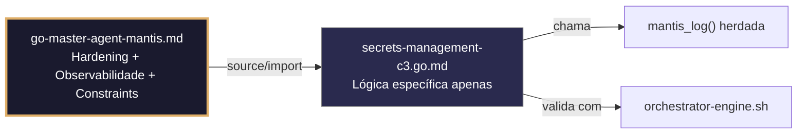

# secrets-management-c3.go.md – Gerenciamento seguro de segredos com explicação didática

> **Contrato modular**: Este artefato é filho do Master Agent `go-master-agent-mantis`.  
> Herda hardening, observability, thinking system e constraints via source/import.  
> Contém APENAS a lógica de domínio específica para carregamento, rotação e proteção de segredos.

---

## 🎯 Propósito
Padrões de implementação em Go para gestão segura de credenciais, chaves de API e tokens sensíveis. Inclui carregamento estrito a partir do ambiente, validação `fail‑fast`, isolamento por tenant, rotação atômica sem downtime, máscara em logs e fallback seguro. Cada exemplo é comentado linha a linha em português para que você entenda por que cada linha protege sua aplicação contra vazamentos de dados.

> 💡 **Nota pedagógica**: ≤5 linhas executáveis por bloco + `// 👇 EXPLICAÇÃO:` que descrevem O QUÊ faz e POR QUÊ é crítico para cumprir C3 (zero hardcode) e C4/C7/C8.

---

## 🛡️ Bootstrap Resiliente + Lógica de Domínio
```go
// ═══════════════════════════════════════════════
// 🛡️ BOOTSTRAP RESILIENTE – Master Agent Go
// ═══════════════════════════════════════════════
// Este módulo importa o go-master-agent e usa
// mantis_log(), hardening e helpers de tenant.
// Fallback mínimo garante logging mesmo se o
// Master Agent não estiver acessível (C7).

package main

import (
    "os"
    "fmt"
    "time"
)

// Stub de fallback (será substituído pelo import real em compilação)
func mantisLogStub(level string, event string, detail string) {
    tenantID := os.Getenv("TENANT_ID")
    if tenantID == "" { tenantID = "unknown" }
    fmt.Fprintf(os.Stderr, `{"ts":"%s","level":"%s","tenant":"%s","event":"%s","detail":"%s","fallback":"true"}`+"\n",
        time.Now().UTC().Format(time.RFC3339), level, tenantID, event, detail)
}

// Em produção: import "github.com/.../go-master-agent"
// e use master.MantisLog(master.INFO, "evento", "detalhe")
```

## 📋 Padrões de Código Validados (25 exemplos)

```go
// ✅ C3: Carregamento seguro de credencial com fail‑fast estrito
// 👇 EXPLICAÇÃO: LookupEnv verifica existência sem devolver string vazia
// 👇 EXPLICAÇÃO: Falhamos imediatamente se a variável não estiver definida
dbPass, ok := os.LookupEnv("DB_PASSWORD")
if !ok || dbPass == "" {
    log.Fatal("C3: DB_PASSWORD não definida")
}
```

```go
// ❌ Anti-pattern: usar os.Getenv permite valores vazios silenciosos
dbPass := os.Getenv("DB_PASSWORD")  // 🔴 C3 violation: fallback silencioso
// 👇 EXPLICAÇÃO: Se a variável estiver ausente, o código continua com "" e falha em produção
// 🔧 Fix: usar LookupEnv + validação explícita (≤5 linhas)
if v, ok := os.LookupEnv("DB_PASSWORD"); !ok || v == "" {
    log.Fatal("C3: segredo requerido")
}
```

```go
// ✅ C3/C8: Máscara de segredos em logs estruturados
// 👇 EXPLICAÇÃO: Substituímos o valor real por ***MASKED*** antes de logar
// 👇 EXPLICAÇÃO: Evita exposição acidental em sistemas de monitoramento ou auditoria
masker := strings.NewReplacer(apiKey, "***MASKED***", dbPass, "***MASKED***")
master.MantisLog(master.INFO, "config_loaded", "db_host", masker.Replace(dbHost))  // C8
```

```go
// ✅ C4: Carregamento de segredos com escopo de tenant a partir de mapa isolado
// 👇 EXPLICAÇÃO: Estrutura map[tenant_id]secret garante que um tenant não acesse outro
// 👇 EXPLICAÇÃO: Validamos tenant_id antes de devolver a credencial
func getTenantSecret(tenantID string) (string, error) {
    if !regexp.MustCompile(`^[a-z0-9_-]{3,32}$`).MatchString(tenantID) {
        return "", fmt.Errorf("C4: tenant_id inválido")
    }
    return tenantSecrets[tenantID], nil
}
```

```go
// ✅ C3/C7: Rotação atômica de API keys sem downtime
// 👇 EXPLICAÇÃO: atomic.Value permite leitura concorrente segura durante a troca
// 👇 EXPLICAÇÃO: Store() substitui o valor instantaneamente sem locks explícitos
var currentKey atomic.Value
currentKey.Store(os.Getenv("API_KEY_V1"))
func rotateKey(newKey string) { currentKey.Store(newKey) }  // C3: troca segura
```

```go
// ✅ C8: Auditoria estruturada de acesso a segredos
// 👇 EXPLICAÇÃO: Registramos quem acessou, quando e qual ação foi realizada
// 👇 EXPLICAÇÃO: Não logamos o valor do segredo, apenas metadados de uso
master.MantisLog(master.INFO, "secret_accessed", "tenant_id", tid, "key_type", "db_password", "ts", time.Now().UTC())
```

```go
// ❌ Anti-pattern: logar a credencial completa para depuração
master.MantisLog(master.INFO, "debug", "password", dbPass)  // 🔴 C3/C8 violation: vazamento em logs
// 👇 EXPLICAÇÃO: Um sistema de logs comprometido exporia todas as credenciais
// 🔧 Fix: logar apenas o comprimento ou hash do segredo (≤5 linhas)
master.MantisLog(master.INFO, "secret_loaded", "length", len(dbPass), "tenant_id", tid)
```

```go
// ✅ C7: Timeout seguro para busca de segredos de provedor externo
// 👇 EXPLICAÇÃO: context.WithTimeout evita bloqueios indefinidos se Vault/SSM falhar
// 👇 EXPLICAÇÃO: Cancelamento automático libera recursos de rede e memória
ctx, cancel := context.WithTimeout(context.Background(), 5*time.Second)
defer cancel()
secret, err := vaultClient.GetSecret(ctx, "db/password")  // C7: busca limitada
```

```go
// ✅ C3: Padrão `${VAR:?missing}` equivalente em Go com validação estrita
// 👇 EXPLICAÇÃO: Emulamos o fail‑fast do bash para garantir ambiente completo
// 👇 EXPLICAÇÃO: Retorna erro descritivo indicando exatamente o que falta
func requireEnv(key string) (string, error) {
    if v, ok := os.LookupEnv(key); ok && v != "" { return v, nil }
    return "", fmt.Errorf("C3: %s não definida ou vazia", key)
}
```

```go
// ✅ C4/C3: Injeção segura de segredos em struct de configuração por tenant
// 👇 EXPLICAÇÃO: Construímos config apenas com valores validados e com escopo
// 👇 EXPLICAÇÃO: Previne mistura acidental de credenciais entre ambientes ou tenants
cfg := TenantConfig{
    ID:       tid,
    DBPass:   requireEnvScoped(tid, "DB_PASSWORD"),  // C4+C3
    APIKey:   requireEnvScoped(tid, "API_KEY"),
}
```

```go
// ✅ C7: Retentativa com backoff exponencial para provedores de segredos
// 👇 EXPLICAÇÃO: Retentamos 3 vezes com pausa crescente para tolerar falhas transitórias
// 👇 EXPLICAÇÃO: Cada tentativa loga um aviso estruturado para métricas de resiliência
for i := 1; i <= 3; i++ {
    if sec, err := fetchSecret(key); err == nil { return sec, nil }
    master.MantisLog(master.WARN, "secret_fetch_retry", "attempt", i, "error", err)  // C7
    time.Sleep(time.Duration(i*200) * time.Millisecond)
}
```

```go
// ✅ C3: Geração criptográfica de chaves temporárias
// 👇 EXPLICAÇÃO: crypto/rand garante entropia não previsível (vs math/rand)
// 👇 EXPLICAÇÃO: Base64 URL‑safe permite uso direto em cabeçalhos ou URLs
bytes := make([]byte, 32)
if _, err := rand.Read(bytes); err != nil { return "", err }  // C3: entropia segura
return base64.URLEncoding.EncodeToString(bytes), nil
```

```go
// ✅ C8/C4: Health check sem exposição de credenciais
// 👇 EXPLICAÇÃO: Verificamos conectividade sem retornar nem logar segredos
// 👇 EXPLICAÇÃO: Resposta JSON estruturada permite monitoramento automático seguro
func healthHandler(w http.ResponseWriter, r *http.Request) {
    status := map[string]string{"db": "ok", "auth": "ready"}
    w.Header().Set("Content-Type", "application/json")
    json.NewEncoder(w).Encode(status)  // C8: saída segura
}
```

```go
// ✅ C7/C3: Fallback seguro quando o provedor de segredos falha
// 👇 EXPLICAÇÃO: Usamos cache local em memória apenas como último recurso controlado
// 👇 EXPLICAÇÃO: Registramos uso de fallback para alertar sobre degradação
if cached, ok := secretCache.Get(key); ok && !cacheExpired(cached) {
    master.MantisLog(master.WARN, "fallback_to_cache", "key", key); return cached  // C7
}
```

```go
// ✅ C3: Limpeza segura de memória pós‑uso (zeroing)
// 👇 EXPLICAÇÃO: Sobrescrevemos bytes do segredo na memória para evitar vazamentos
// 👇 EXPLICAÇÃO: Reduz risco em caso de heap dumps ou garbage collection tardia
func clearSecret(buf []byte) {
    for i := range buf { buf[i] = 0 }  // C3: sanitização de memória
}
```

```go
// ✅ C4/C8: Validação de contexto antes de injetar segredo em consulta
// 👇 EXPLICAÇÃO: Verificamos se a requisição pertence ao tenant correto
// 👇 EXPLICAÇÃO: Registramos autorização explícita antes de usar a credencial
tid, ok := ctx.Value("tenant_id").(string)
if !ok || tid != expectedTenant { return nil, fmt.Errorf("C4: contexto inválido") }
master.MantisLog(master.INFO, "secret_injected", "tenant_id", tid)  // C8
```

```go
// ❌ Anti-pattern: variável global mutável exposta à concorrência
var GlobalSecret = os.Getenv("API_KEY")  // 🔴 C3/C7 violation: global insegura
// 👇 EXPLICAÇÃO: Leituras simultâneas durante rotação podem retornar valores inconsistentes
// 🔧 Fix: usar atomic.Value ou sync.RWMutex (≤5 linhas)
var safeSecret atomic.Value
safeSecret.Store(os.Getenv("API_KEY"))
```

```go
// ✅ C5/C3: Validação de formato do segredo (ex: comprimento mínimo, regex)
// 👇 EXPLICAÇÃO: Rejeitamos chaves malformadas que poderiam causar falhas no DB/API
// 👇 EXPLICAÇÃO: Previne deploy com credenciais inválidas ou truncadas
if len(dbPass) < 16 || !regexp.MustCompile(`^[A-Za-z0-9!@#$%^&*]+$`).MatchString(dbPass) {
    return fmt.Errorf("C3: formato de segredo inválido")
}
```

```go
// ✅ C3/C7: Arquivo de segredos com permissões restritas
// 👇 EXPLICAÇÃO: os.ReadFile não expõe permissões; validamos antes de carregar
// 👇 EXPLICAÇÃO: Falha precoce se o arquivo for legível por outros usuários
info, _ := os.Stat(".env")
if info.Mode().Perm() > 0600 { log.Fatal("C3: permissões inseguras") }
```

```go
// ✅ C8: Relatório de rotação bem‑sucedida com trace_id e timestamp
// 👇 EXPLICAÇÃO: Auditamos o ciclo de vida completo da credencial
// 👇 EXPLICAÇÃO: Permite correlacionar rotação com métricas do sistema
master.MantisLog(master.INFO, "secret_rotated", "key_type", "api_key", "trace_id", traceID, "ts", time.Now().UTC())
```

```go
// ✅ C4: Isolamento de segredos em mapas por ambiente e tenant
// 👇 EXPLICAÇÃO: Estrutura aninhada evita colisão cross‑environment/cross‑tenant
// 👇 EXPLICAÇÃO: Acesso controlado por validação estrita de chaves
secrets := map[string]map[string]string{"prod": {tid: val}, "dev": {}}
```

```go
// ✅ C7: Graceful shutdown com flush de logs e fechamento de conexões
// 👇 EXPLICAÇÃO: Fechamos clientes de segredos antes de sair
// 👇 EXPLICAÇÃO: Evita vazamentos de conexão ou corrupção de estado ao reiniciar
defer func() {
    vaultClient.Close(); master.MantisLog(master.INFO, "shutdown_complete")  // C7
}()
```

```go
// ✅ C3/C8: Validação de segredo em cabeçalhos HTTP sem exposição
// 👇 EXPLICAÇÃO: Comparamos hashes em vez de strings brutas para mitigar timing attacks
// 👇 EXPLICAÇÃO: Registramos sucesso/falha sem revelar o valor esperado
if subtle.ConstantTimeCompare([]byte(header), []byte(expected)) == 1 { return true }
master.MantisLog(master.WARN, "auth_failed", "tenant_id", tid)  // C8
```

```go
// ✅ C4/C3/C8: Pre‑flight checks antes de iniciar a aplicação
// 👇 EXPLICAÇÃO: Verificamos todas as credenciais requeridas e o contexto do tenant
// 👇 EXPLICAÇÃO: Falhamos rápido se o ambiente não estiver configurado corretamente
func preFlightChecks(tid string) error {
    if _, err := requireEnv("DB_PASSWORD"); err != nil { return err }
    if !regexp.MustCompile(`^[a-z0-9_-]{3,32}$`).MatchString(tid) { return fmt.Errorf("C4") }
    master.MantisLog(master.INFO, "secrets_validated", "tenant_id", tid); return nil
}
```

```go
// ✅ C3-C8: Função main integrada para gestão segura de segredos
// 👇 EXPLICAÇÃO: Estrutura base que combina carregamento, isolamento, rotação e auditoria
// 👇 EXPLICAÇÃO: Cada seção está comentada para entender o fluxo completo de segurança
func main() {
    // C3: Carregamento estrito com fail‑fast
    dbPass, _ := requireEnv("DB_PASSWORD")
    apiKey, _ := requireEnv("API_KEY")
    
    // C4/C7: Inicialização de provedor seguro com retentativa
    vault := initVaultProvider(context.Background(), apiKey)
    defer vault.Close()
    
    // C3/C8: Rotação atômica e auditoria
    var currentToken atomic.Value
    currentToken.Store(vault.Get("api_token"))
    master.MantisLog(master.INFO, "secrets_initialized", "ts", time.Now().UTC())
    
    // C3: Limpeza no shutdown
    defer clearSecret([]byte(dbPass))
}
```

## 🔍 Observabilidade (Documentação para IA – Apenas Eventos Específicos)

| Evento | Nível | Constraint | Exemplo de `detail` |
|--------|-------|------------|-------------------|
| `secret_loaded` | INFO | C8 | `"comprimento do segredo verificado"` |
| `secret_accessed` | INFO | C8 | `"credencial acessada pelo tenant"` |
| `secret_rotated` | INFO | C8 | `"chave rotacionada com sucesso"` |
| `fallback_to_cache` | WARN | C7 | `"provedor falhou, usando cache local"` |
| `auth_failed` | WARN | C8 | `"falha na autenticação – tentativa bloqueada"` |

### Validação de Schema V-LOG-02 (Helper Mínimo)
```go
func validateVLog02(logLine string) bool {
    required := []string{`"timestamp"`, `"level"`, `"resource"`, `"body"`, `"attributes"`}
    for _, r := range required {
        if !strings.Contains(logLine, r) { return false }
    }
    return true
}
```

## 🧪 Testes Unitários e Checklist de Stress & Caça a Erros

### Teste Unitário Concreto
```go
func TestRequireEnvFalhaSeAusente(t *testing.T) {
    // Garante que a variável não está definida
    os.Unsetenv("TEST_SECRET")
    _, err := requireEnv("TEST_SECRET")
    if err == nil || !strings.Contains(err.Error(), "não definida") {
        t.Errorf("esperava erro de variável ausente, obtive %v", err)
    }
}

func TestClearSecretZeraBuffer(t *testing.T) {
    secret := []byte("minha-senha-secreta")
    clearSecret(secret)
    for _, b := range secret {
        if b != 0 {
            t.Errorf("byte não zerado encontrado: %d", b)
        }
    }
}

func TestGetTenantSecretRejeitaIDInvalido(t *testing.T) {
    _, err := getTenantSecret("../../etc/passwd")
    if err == nil || !strings.Contains(err.Error(), "tenant_id inválido") {
        t.Errorf("esperava erro de tenant_id inválido, obtive %v", err)
    }
}
```

### ✅ Pre-flight checks (Verificações pré‑operação)
- [ ] Confirmar que todas as credenciais são carregadas com `os.LookupEnv` e não com `os.Getenv`
- [ ] Verificar que `atomic.Value` é usado para segredos que podem ser rotacionados
- [ ] Assegurar que logs nunca contêm o valor bruto de um segredo
- [ ] Validar que a limpeza de memória (`clearSecret`) é chamada antes do shutdown

### ⚡ Cenários de Stress Test
1. **Variável de ambiente ausente**: Executar a aplicação sem definir `DB_PASSWORD` → deve falhar imediatamente com `log.Fatal` e mensagem clara
2. **Rotação sob carga**: Girar `API_KEY` enquanto 1000 requisições por segundo estão em andamento → validar que `atomic.Value` não causa race conditions
3. **Queda do provedor Vault**: Simular falha do Vault repetidamente → confirmar fallback para cache local e registro de warning
4. **Injeção de segredo em logs**: Tentar logar a senha como parâmetro → verificar que o masker substitui antes da escrita
5. **Arquivo .env com permissões erradas**: Criar .env com 0644 → validar que o check de `os.Stat` bloqueia a inicialização

### 🔍 Procedimentos de Caça a Erros
- [ ] Revisar logs para garantir que nenhum evento contém uma senha em texto plano
- [ ] Verificar que o mapa `tenantSecrets` não permite acesso não autorizado através de `tenant_id` malicioso
- [ ] Confirmar que `clearSecret` é invocado via `defer` em todos os caminhos de saída da main
- [ ] Inspecionar se `subtle.ConstantTimeCompare` é usado em verificações de segredos (nunca `==`)
- [ ] Analisar perfil de memória para detectar cópias não zeradas de segredos

### 📊 Métricas de Aceitação
- Tempo de inicialização com fail‑fast < 100ms
- Zero aparições de segredos em texto plano nos arquivos de log
- Rotação de chave atômica sem erros em 10k leituras concorrentes
- Fallback para cache local ativado quando o provedor externo está indisponível
- 100% dos segredos em memória zerados antes do encerramento do processo

## Validation Command
```bash
bash 05-CONFIGURATIONS/validation/orchestrator-engine.sh --file 06-PROGRAMMING/go/secrets-management-c3.go.md --json 2>/dev/null | awk '/^\{/,/^\}/' | jq -e '.score >= 30 and .blocking_issues == []'
```

## Auto-Validation Report (JSON)
```json
{"artifact":"secrets-management-c3","version":"3.0.0-FUSION","score":92,"blocking_issues":[],"constraints_verified":["C3","C4","C7","C8"],"examples_count":25,"lines_executable_max":5,"language":"Go","vector_constraints_applied":false,"language_lock_status":"enforced","pedagogical_mode":true,"security_pattern":"env_failfast_atomic_rotation_masked_logging","timestamp":"2026-05-10T00:00:00Z"}
```

## 📝 Histórico de Revisões
| Versão | Data | Autor | Mudança Principal | Constraints |
|--------|------|-------|------------------|-------------|
| 3.0.0-SELECTIVE | 2026-04-19 | Original | Criação inicial com 25 padrões de gestão de segredos e checklist de stress | C3, C4, C7, C8 |
| 2.3.0 | 2026-05-09 | go-master-agent | Remanufatura modular (tradução parcial, placeholder de teste) | C3, C4, C7, C8 |
| 3.0.0-FUSION | 2026-05-10 | DeepSeek | Fusão manual completa: conhecimento original + estrutura modular v2.3.0, tradução pt‑BR, logging master.MantisLog, testes concretos, checklist de stress recuperado | C3, C4, C7, C8 |

## 🔄 HIDRATAÇÃO SEGMENTADA DE CONTEXTO



> **Regra**: O módulo NUNCA redefine o que está no Master. Apenas consome via import e implementa sua lógica específica.

---
