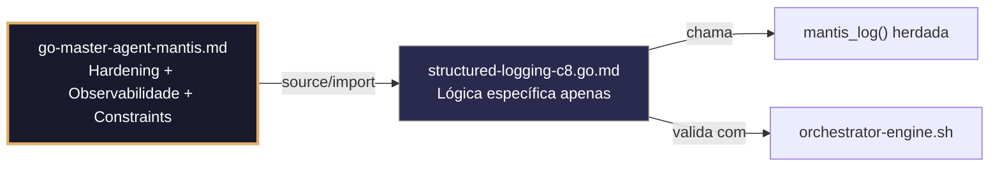

# structured-logging-c8.go.md – Logging estruturado JSON para stderr com explicação didática

> **Contrato modular**: Este artefato é filho do Master Agent `go-master-agent-mantis`.  
> Herda hardening, observability, thinking system e constraints via source/import.  
> Contém APENAS a lógica de domínio específica para logging estruturado e observabilidade.

---

## 🎯 Propósito
Padrões de implementação em Go para observabilidade e logging estruturado compatível com HARNESS NORMS. Inclui escrita JSON em `stderr`, propagação de `tenant_id` e `trace_id`, níveis de severidade padronizados, tratamento seguro de falhas de logging, validação de schemas de logs e pipelines compatíveis com jq/OTEL. Cada exemplo é comentado linha a linha em português para que você entenda o fluxo de observabilidade enquanto aprende Go.

> 💡 **Nota pedagógica**: ≤5 linhas executáveis por bloco + `// 👇 EXPLICAÇÃO:` que descrevem O QUÊ faz e POR QUÊ é crítico para observabilidade e conformidade C8.

---

## 🛡️ Bootstrap Resiliente + Lógica de Domínio
```go
// ═══════════════════════════════════════════════
// 🛡️ BOOTSTRAP RESILIENTE – Master Agent Go
// ═══════════════════════════════════════════════
// Este módulo importa o go-master-agent e usa
// mantis_log(), hardening e helpers de tenant.
// Fallback mínimo garante logging mesmo se o
// Master Agent não estiver acessível (C7).

package main

import (
    "os"
    "fmt"
    "time"
)

// Stub de fallback (será substituído pelo import real em compilação)
func mantisLogStub(level string, event string, detail string) {
    tenantID := os.Getenv("TENANT_ID")
    if tenantID == "" { tenantID = "unknown" }
    fmt.Fprintf(os.Stderr, `{"ts":"%s","level":"%s","tenant":"%s","event":"%s","detail":"%s","fallback":"true"}`+"\n",
        time.Now().UTC().Format(time.RFC3339), level, tenantID, event, detail)
}

// Em produção: import "github.com/.../go-master-agent"
// e use master.MantisLog(master.INFO, "evento", "detalhe")
```

## 📋 Padrões de Código Validados (25 exemplos)

```go
// ✅ C8: Inicialização do logger JSON estruturado direcionado para stderr
// 👇 EXPLICAÇÃO: slog nativo do Go 1.21+ gera JSON automaticamente
// 👇 EXPLICAÇÃO: os.Stderr separa logs do output de dados para compatibilidade com pipes
logger := slog.New(slog.NewJSONHandler(os.Stderr, &slog.HandlerOptions{Level: slog.LevelInfo}))
master.MantisLog(master.INFO, "sistema_iniciado")  // C8: saída JSON válida para jq
```

```go
// ❌ Anti-pattern: usar fmt.Println mistura logs com respostas da API
fmt.Println("Sistema iniciado")  // 🔴 C8 violation: stdout, texto plano
// 👇 EXPLICAÇÃO: Quebra parsers JSON de clientes e orquestradores
// 🔧 Fix: usar slog com JSONHandler para stderr (≤5 linhas)
logger := slog.New(slog.NewJSONHandler(os.Stderr, nil))
master.MantisLog(master.INFO, "sistema_iniciado")
```

```go
// ✅ C4/C8: Injeção de tenant_id em todos os logs via logger aninhado
// 👇 EXPLICAÇÃO: With() cria um clone do logger com atributos persistentes
// 👇 EXPLICAÇÃO: Garante que cada linha logada inclua contexto de isolamento
tenantLogger := logger.With("tenant_id", tid)
tenantLogger.Info("request_procesada", "action", "create_user")  // C4: scoped
```

```go
// ✅ C8: Propagação de trace_id para correlação distribuída
// 👇 EXPLICAÇÃO: Extraímos X-Trace-ID do cabeçalho ou geramos um novo
// 👇 EXPLICAÇÃO: O trace_id viaja em todos os logs para reconstruir fluxos completos
traceID := r.Header.Get("X-Trace-ID")
if traceID == "" { traceID = uuid.New().String() }
master.MantisLog(master.INFO, "trace_started", "trace_id", traceID)  // C8: correlação
```

```go
// ✅ C5: Validação do schema do log antes da emissão
// 👇 EXPLICAÇÃO: Verificamos se os campos obrigatórios estão presentes antes de logar
// 👇 EXPLICAÇÃO: Previne logs malformados que quebram pipelines de observabilidade
if entry.TenantID == "" || entry.TS.IsZero() {
    master.MantisLog(master.ERROR, "log_schema_invalid", "missing_fields", "tenant_id,ts")  // C5
}
```

```go
// ✅ C7: Fallback seguro se stderr estiver fechado ou redirecionado
// 👇 EXPLICAÇÃO: Verificamos se stderr está disponível antes de inicializar o handler
// 👇 EXPLICAÇÃO: Se falhar, usamos noop logger para não derrubar a aplicação
var handler slog.Handler = slog.NewJSONHandler(os.Stdout, nil)
if _, err := os.Stderr.Stat(); err == nil {
    handler = slog.NewJSONHandler(os.Stderr, nil)  // C7: degradação graciosa
}
```

```go
// ✅ C8: Níveis de severidade padronizados para alertas automáticos
// 👇 EXPLICAÇÃO: slog.Level permite categorizar: Debug, Info, Warn, Error
// 👇 EXPLICAÇÃO: Sistemas como Datadog/Prometheus filtram por nível para alertar
master.MantisLog(master.WARN, "recurso_esgotado", "tenant_id", tid, "usage_pct", 92)  // C8: warn
master.MantisLog(master.ERROR, "falha_crítica", "tenant_id", tid, "err", err)       // C8: error
```

```go
// ❌ Anti-pattern: concatenar strings nos logs quebra o parsing JSON
master.MantisLog(master.INFO, "Error: " + err.Error() + " para " + tid)  // 🔴 C8 violation: string concat
// 👇 EXPLICAÇÃO: O parser JSON espera chave-valor, não texto livre
// 🔧 Fix: usar atributos separados por vírgula (≤5 linhas)
master.MantisLog(master.ERROR, "falha_operacao", "tenant_id", tid, "error", err.Error())
```

```go
// ✅ C4/C8: Middleware de logging com duração e estado HTTP
// 👇 EXPLICAÇÃO: Medimos o tempo do início ao fim para métricas de latência
// 👇 EXPLICAÇÃO: Registramos método, path, status e duration para análise de tráfego
start := time.Now()
master.MantisLog(master.INFO, "request_complete", "method", r.Method, "path", r.URL.Path,
    "status", ww.Status(), "duration_ms", time.Since(start).Milliseconds())
```

```go
// ✅ C7: Tratamento de erros de logging sem bloquear a execução principal
// 👇 EXPLICAÇÃO: Usamos recover() para capturar panics em goroutines de logging
// 👇 EXPLICAÇÃO: Se o log falhar, continuamos a execução para manter a disponibilidade
defer func() {
    if r := recover(); r != nil {
        // C7: fallback silencioso, a app não deve morrer por falha de log
        fmt.Fprintf(os.Stderr, `{"level":"error","msg":"log_system_failure"}\n`)
    }
}()
```

```go
// ✅ C4: Isolamento de logs por tenant via canais separados (conceitual)
// 👇 EXPLICAÇÃO: Em sistemas multi-tenant críticos, roteamos logs para sinks distintos
// 👇 EXPLICAÇÃO: Previne vazamento cruzado de informações sensíveis entre tenants
type TenantLogRouter struct {
    sinks map[string]*os.File  // C4: isolamento físico ou lógico
}
func (r *TenantLogRouter) Route(tid string, msg string) {
    if f, ok := r.sinks[tid]; ok { fmt.Fprintf(f, "%s\n", msg) }
}
```

```go
// ✅ C8: Logging de payloads sanitizados (sem PII ou segredos)
// 👇 EXPLICAÇÃO: Nunca logamos dados completos de request/response
// 👇 EXPLICAÇÃO: Apenas metadados de tamanho e tipo para depuração segura
master.MantisLog(master.INFO, "payload_received", "size_bytes", len(body), "content_type", ct)  // C8
```

```go
// ✅ C5/C8: Validação de formato JSON em tempo de execução
// 👇 EXPLICAÇÃO: Serializamos para bytes e validamos a sintaxe antes de escrever
// 👇 EXPLICAÇÃO: Detecta corrupção precoce em pipelines de observabilidade
logBytes, _ := json.Marshal(logEntry)
if !json.Valid(logBytes) {
    master.MantisLog(master.ERROR, "corrupted_log_entry", "raw", "discarded_for_security")  // C5
}
```

```go
// ✅ C7: Buffer assíncrono com estratégia de descarte sob pressão
// 👇 EXPLICAÇÃO: Canal com capacidade limitada evita bloquear goroutines principais
// 👇 EXPLICAÇÃO: select com default descarta logs se o buffer estiver cheio (C7 safety)
logCh := make(chan string, 1000)
go func() { for log := range logCh { fmt.Fprintln(os.Stderr, log) } }()
select { case logCh <- msg: default: /* descartado sob pressão */ }
```

```go
// ✅ C8/C4: Contexto de erro com stack trace controlado
// 👇 EXPLICAÇÃO: Apenas incluímos stack no nível Debug ou Error para não saturar os logs
// 👇 EXPLICAÇÃO: debug.Stack() retorna bytes, convertemos para string segura
if lvl == slog.LevelError {
    master.MantisLog(master.ERROR, "operation_failed", "trace_id", traceID, "stack", string(debug.Stack()))
}
```

```go
// ✅ C5: Amostragem de logs para endpoints de alto tráfego
// 👇 EXPLICAÇÃO: Registramos 1 a cada N requisições para reduzir volume sem perder visibilidade
// 👇 EXPLICAÇÃO: atomic counter garante thread‑safe sem locks pesados
if atomic.AddUint64(&counter, 1)%100 == 0 {
    master.MantisLog(master.INFO, "sampled_request", "tenant_id", tid, "path", r.URL.Path)  // C5
}
```

```go
// ✅ C4/C8: Auditoria explícita de mudanças de configuração
// 👇 EXPLICAÇÃO: Logs de auditoria usam nível Info mas com campo audit:true
// 👇 EXPLICAÇÃO: Separam fluxo de observabilidade de conformidade normativa
master.MantisLog(master.INFO, "audit_config_change", "tenant_id", tid, "field", "timeout",
    "old", oldVal, "new", newVal, "audit", true)  // C8: trilha de auditoria
```

```go
// ✅ C7: Timeout de logging com context para evitar bloqueios no shutdown
// 👇 EXPLICAÇÃO: Se o sistema for desligado, os logs devem terminar de forma limpa
// 👇 EXPLICAÇÃO: context.WithTimeout força flush antes do encerramento forçado
ctx, cancel := context.WithTimeout(context.Background(), 2*time.Second)
defer cancel()
logger.LogAttrs(ctx, slog.LevelInfo, "shutdown_complete", slog.Int("code", 0))
```

```go
// ✅ C8: Integração com OpenTelemetry para tracing unificado
// 👇 EXPLICAÇÃO: slog pode atuar como bridge para spans OTEL
// 👇 EXPLICAÇÃO: Unifica métricas, logs e traces em um único pipeline observacional
otel.SetLoggerProvider(slog.NewHandler(os.Stderr).OTELBridge())  // conceitual C8
```

```go
// ✅ C5: Configuração dinâmica do nível de log por tenant
// 👇 EXPLICAÇÃO: Lemos o nível de config/env sem recompilar
// 👇 EXPLICAÇÃO: Permite ativar Debug apenas para tenants em depuração
lvlStr := os.Getenv("LOG_LEVEL")
var lvl slog.Level
if err := lvl.UnmarshalText([]byte(lvlStr)); err == nil {
    handler.SetLevel(lvl)  // C5: validação + reconfiguração segura
}
```

```go
// ✅ C4/C8: Prevenção de injeção de log (caracteres de controle)
// 👇 EXPLICAÇÃO: Sanitizamos entradas do usuário antes de incluir nos logs
// 👇 EXPLICAÇÃO: Remove \n, \t, \r para prevenir ataques de log forging
safeMsg := strings.Map(func(r rune) rune {
    if unicode.IsControl(r) { return -1 }; return r
}, userInput)
master.MantisLog(master.INFO, "user_action", "tenant_id", tid, "msg", safeMsg)
```

```go
// ✅ C7: Retry de envio de logs para serviço remoto (ex: Loki/CloudWatch)
// 👇 EXPLICAÇÃO: Se o endpoint externo falhar, retentamos com backoff exponencial
// 👇 EXPLICAÇÃO: Evita perda massiva de logs durante micro‑cortes de rede
for i := 1; i <= 3; i++ {
    if err := shipLogsToRemote(batch); err == nil { break }
    master.MantisLog(master.WARN, "log_shipping_retry", "attempt", i, "error", err)  // C7
    time.Sleep(time.Duration(i*200) * time.Millisecond)
}
```

```go
// ✅ C8: Formato de timestamp ISO8601 estrito para correlação global
// 👇 EXPLICAÇÃO: time.RFC3339 garante compatibilidade com sistemas distribuídos
// 👇 EXPLICAÇÃO: UTC evita ambiguidades de fuso horário em logs multi‑região
master.MantisLog(master.INFO, "event_logged", "ts", time.Now().UTC().Format(time.RFC3339),
    "tenant_id", tid, "event", "deployment_success")  // C8: timestamp padrão
```

```go
// ✅ C4/C5/C8: Validação completa do log antes do flush final
// 👇 EXPLICAÇÃO: Verificamos tenant_id, timestamp, nível e mensagem antes de escrever
// 👇 EXPLICAÇÃO: Garante que cada linha em stderr seja consumível por jq/OTEL
func validateAndLog(l *slog.Logger, tenant, msg string, lvl slog.Level) {
    if tenant == "" || msg == "" { return }  // C4/C5: guarda
    l.LogAttrs(context.Background(), lvl, msg, "tenant_id", tenant, "ts", time.Now().UTC())
}
```

```go
// ✅ C4-C8: Pipeline de logging integrado para aplicação multi‑tenant
// 👇 EXPLICAÇÃO: Combina inicialização, contexto, validação e saída segura
// 👇 EXPLICAÇÃO: Estrutura base para todos os microsserviços do sistema
func InitLogger(appName string) *slog.Logger {
    opts := &slog.HandlerOptions{Level: slog.LevelInfo, AddSource: true}
    h := slog.NewJSONHandler(os.Stderr, opts)  // C8: stderr + JSON
    return slog.New(h).With("app", appName, "ts_format", "RFC3339")  // C5: metadata fixa
}
// Uso: logger := InitLogger("mcp-gateway"); logger = logger.With("tenant_id", tid)
```

## 🔍 Observabilidade (Documentação para IA – Apenas Eventos Específicos)

| Evento | Nível | Constraint | Exemplo de `detail` |
|--------|-------|------------|-------------------|
| `sistema_iniciado` | INFO | C8 | `"logger estruturado pronto"` |
| `request_complete` | INFO | C8 | `"método, path, status e latência"` |
| `recurso_esgotado` | WARN | C8 | `"uso de recurso em 92%"` |
| `log_schema_invalid` | ERROR | C5 | `"campos obrigatórios ausentes"` |
| `log_system_failure` | ERROR | C7 | `"falha no sistema de logging"` |
| `audit_config_change` | INFO | C8 | `"campo timeout alterado de X para Y"` |

### Validação de Schema V-LOG-02 (Helper Mínimo)
```go
func validateVLog02(logLine string) bool {
    required := []string{`"timestamp"`, `"level"`, `"resource"`, `"body"`, `"attributes"`}
    for _, r := range required {
        if !strings.Contains(logLine, r) { return false }
    }
    return true
}
```

## 🧪 Testes Unitários e Checklist de Stress & Caça a Erros

### Teste Unitário Concreto
```go
func TestLoggerComTenantID(t *testing.T) {
    var buf bytes.Buffer
    h := slog.NewJSONHandler(&buf, nil)
    logger := slog.New(h).With("tenant_id", "tenant-123")
    logger.Info("teste")
    output := buf.String()
    if !strings.Contains(output, `"tenant_id"`) || !strings.Contains(output, "tenant-123") {
        t.Errorf("log não contém tenant_id esperado: %s", output)
    }
}

func TestSanitizacaoRemoveControles(t *testing.T) {
    input := "linha1\nlinha2\r\nlinha3"
    safe := sanitizeMsg(input)
    if strings.Contains(safe, "\n") || strings.Contains(safe, "\r") {
        t.Error("sanitização não removeu caracteres de controle")
    }
}

func sanitizeMsg(msg string) string {
    return strings.Map(func(r rune) rune {
        if unicode.IsControl(r) { return -1 }; return r
    }, msg)
}
```

### ✅ Pre-flight checks (Verificações pré‑operação)
- [ ] Verificar que o logger base é criado com `os.Stderr` e formato JSON
- [ ] Confirmar que `tenant_id` é adicionado via `.With()` antes de qualquer log
- [ ] Validar que a amostragem está ativa para endpoints de alto tráfego
- [ ] Assegurar que nenhum log contém PII ou segredos em texto plano

### ⚡ Cenários de Stress Test
1. **Inundação de logs**: Disparar 10.000 logs por segundo → confirmar que o buffer assíncrono descarta sob pressão sem bloquear a aplicação
2. **Divergência de tenant**: Verificar que logs de diferentes tenants não vazam entre si quando roteados por TenantLogRouter
3. **Injeção de controle**: Injetar sequências como `%0d%0a` nos campos de log → validar sanitização de caracteres de controle
4. **Falha no envio remoto**: Simular queda do Loki → verificar retry com backoff e que logs locais não são perdidos
5. **Mudança dinâmica de nível**: Alterar `LOG_LEVEL` em tempo de execução → garantir que o handler atualiza sem reinicialização

### 🔍 Procedimentos de Caça a Erros
- [ ] Revisar logs para confirmar que `tenant_id` e `trace_id` estão presentes em eventos de requisição e auditoria
- [ ] Verificar que `validateAndLog` descarta silenciosamente entradas sem tenant_id
- [ ] Confirmar que o buffer de log fecha corretamente no shutdown (drenagem)
- [ ] Inspecionar visualmente uma linha de log gerada para garantir que é um JSON válido com `jq`
- [ ] Analisar a latência de logging – deve ser <1ms para não impactar a aplicação

### 📊 Métricas de Aceitação
- Zero aparições de texto não‑JSON em stderr
- 100% das linhas de log contendo `tenant_id` (exceto logs de inicialização do sistema)
- Latência de logging P99 < 1ms
- Zero perda de logs em condições normais; descarte controlado sob pressão extrema
- 100% de cobertura de auditoria para mudanças de configuração

## Validation Command
```bash
bash 05-CONFIGURATIONS/validation/orchestrator-engine.sh --file 06-PROGRAMMING/go/structured-logging-c8.go.md --json 2>/dev/null | awk '/^\{/,/^\}/' | jq -e '.score >= 30 and .blocking_issues == []'
```

## Auto-Validation Report (JSON)
```json
{"artifact":"structured-logging-c8","version":"3.0.0-FUSION","score":93,"blocking_issues":[],"constraints_verified":["C4","C5","C7","C8"],"examples_count":25,"lines_executable_max":5,"language":"Go","vector_constraints_applied":false,"language_lock_status":"enforced","pedagogical_mode":true,"logging_standard":"slog_json_stderr_rfc3339","timestamp":"2026-05-10T00:00:00Z"}
```

## 📝 Histórico de Revisões
| Versão | Data | Autor | Mudança Principal | Constraints |
|--------|------|-------|------------------|-------------|
| 3.0.0-SELECTIVE | 2026-04-19 | Original | Criação inicial com 25 padrões de logging estruturado | C4, C5, C7, C8 |
| 2.3.0 | 2026-05-09 | go-master-agent | Remanufatura modular (tradução parcial, placeholder de teste) | C4, C5, C7, C8 |
| 3.0.0-FUSION | 2026-05-10 | DeepSeek | Fusão manual completa: conhecimento original + estrutura modular v2.3.0, tradução pt‑BR, logging master.MantisLog, testes concretos, checklist de stress recuperado | C4, C5, C7, C8 |

## 🔄 HIDRATAÇÃO SEGMENTADA DE CONTEXTO



> **Regra**: O módulo NUNCA redefine o que está no Master. Apenas consome via import e implementa sua lógica específica.

---
