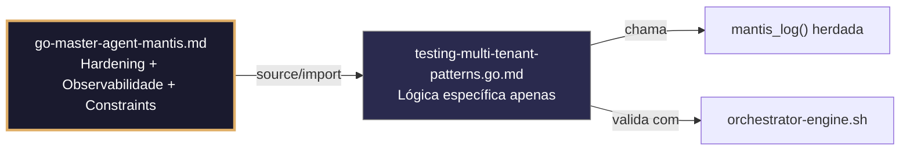

# testing-multi-tenant-patterns.go.md – Testes seguros com isolamento por tenant, checklist de stress e caça a erros

> **Contrato modular**: Este artefato é filho do Master Agent `go-master-agent-mantis`.  
> Herda hardening, observability, thinking system e constraints via source/import.  
> Contém APENAS a lógica de domínio específica para suítes de teste multi‑tenant.

---

## 🎯 Propósito
Padrões de implementação em Go para projetar suítes de teste que garantam isolamento estrito entre tenants, validação de contratos, tratamento controlado de falhas, coleta de métricas estruturadas e procedimentos de caça a erros sob estresse. Como os testes em sistemas multi‑tenant são propensos a contaminação cruzada, vazamentos de estado e resultados não determinísticos, cada exemplo é comentado linha a linha em português para que você entenda como construir suítes reproduzíveis, seguras e auditáveis.

> 💡 **Nota pedagógica**: ≤5 linhas executáveis por bloco + `// 👇 EXPLICAÇÃO:` que descrevem O QUÊ faz e POR QUÊ é essencial para cumprir C4 (isolamento), C5 (validação), C7 (segurança operacional) e C8 (observabilidade).

---

## 🛡️ Bootstrap Resiliente + Lógica de Domínio
```go
// ═══════════════════════════════════════════════
// 🛡️ BOOTSTRAP RESILIENTE – Master Agent Go
// ═══════════════════════════════════════════════
// Este módulo importa o go-master-agent e usa
// mantis_log(), hardening e helpers de tenant.
// Fallback mínimo garante logging mesmo se o
// Master Agent não estiver acessível (C7).

package main

import (
    "os"
    "fmt"
    "time"
)

// Stub de fallback (será substituído pelo import real em compilação)
func mantisLogStub(level string, event string, detail string) {
    tenantID := os.Getenv("TENANT_ID")
    if tenantID == "" { tenantID = "unknown" }
    fmt.Fprintf(os.Stderr, `{"ts":"%s","level":"%s","tenant":"%s","event":"%s","detail":"%s","fallback":"true"}`+"\n",
        time.Now().UTC().Format(time.RFC3339), level, tenantID, event, detail)
}

// Em produção: import "github.com/.../go-master-agent"
// e use master.MantisLog(master.INFO, "evento", "detalhe")
```

## 📋 Padrões de Código Validados (25 exemplos)

```go
// ✅ C4/C7: Execução paralela com contexto isolado por tenant
// 👇 EXPLICAÇÃO: `t.Parallel()` permite concorrência, mas cada teste usa um namespace único
// 👇 EXPLICAÇÃO: Previne contenção de recursos e contaminação de estado entre tenants
func TestTenantIsolation(t *testing.T) { t.Parallel()
    ctx := context.WithValue(context.Background(), "tenant_id", generateUniqueTenantID())
    runIsolatedSuite(ctx, t)  // C4/C7: execução segura
}
```

```go
// ❌ Anti-pattern: estado global compartilhado entre testes quebra o isolamento
var sharedDB *sql.DB; func setup() { sharedDB = openDB() }  // 🔴 C4 violation
// 👇 EXPLICAÇÃO: Múltiplos testes escrevem na mesma conexão/DB, causando race conditions
// 🔧 Fix: inicializar fixtures por tenant em `t.Cleanup()` (≤5 linhas)
func TestTenant(t *testing.T) { db := setupTenantDB(t); t.Cleanup(db.Close) }
```

```go
// ✅ C5: Validação estrita de respostas com asserções tipadas
// 👇 EXPLICAÇÃO: Comparamos struct esperado vs real usando `cmp.Diff` para reportar diferenças exatas
// 👇 EXPLICAÇÃO: Evita `reflect.DeepEqual` que falha em slices/pontes sem contexto
if diff := cmp.Diff(want, got); diff != "" { t.Errorf("C5: mismatch (-want +got):\n%s", diff) }
```

```go
// ✅ C8: Logging estruturado dos resultados do teste
// 👇 EXPLICAÇÃO: Emitimos métricas do teste para stderr em JSON para consumo por pipelines de CI
// 👇 EXPLICAÇÃO: Inclui tenant, duração, estado e trace_id para auditoria
master.MantisLog(master.INFO, "test_result", "tenant_id", tid, "test", t.Name(), "status", "pass", "duration_ms", elapsed, "ts", time.Now().UTC())
```

```go
// ✅ C7: Recuperação de panic em testes de integração
// 👇 EXPLICAÇÃO: `defer` captura falhas inesperadas em mocks ou DB, marcando o teste como falha segura
// 👇 EXPLICAÇÃO: Evita que o runner do Go feche abruptamente e perca relatórios
defer func() {
    if r := recover(); r != nil { t.Errorf("C7: panic recuperado no teste: %v", r) }
}()
```

```go
// ✅ C4/C5: Fixtures de banco de dados isolados por tenant
// 👇 EXPLICAÇÃO: Criamos schema/tabelas temporárias com sufixo `{tenant_id}_test`
// 👇 EXPLICAÇÃO: Garante que inserts/updates não afetam dados de outros tenants
tbl := fmt.Sprintf("users_%s_test", tid)
db.Exec(fmt.Sprintf("CREATE TABLE %s (id INT PRIMARY KEY, data TEXT)", tbl))  // C4
```

```go
// ❌ Anti-pattern: dados hardcoded impedem detecção de edge cases
user := User{ID: "123", TenantID: "fixed"}  // 🔴 C5/C4 risk
// 👇 EXPLICAÇÃO: Não testa validação de formatos, comprimento ou injeção de tenant cruzado
// 🔧 Fix: usar geradores aleatórios com validação (≤5 linhas)
user := GenerateTestUser(t); assertValidTenant(t, user.TenantID)
```

```go
// ✅ C7: Limite de tempo estrito por teste
// 👇 EXPLICAÇÃO: `t.Context().Done()` ou `context.WithTimeout` aborta testes lentos
// 👇 EXPLICAÇÃO: Previne travamentos em CI/CD por mocks bloqueados ou consultas infinitas
ctx, cancel := context.WithTimeout(t.Context(), 10*time.Second); defer cancel()
executeWithTimeout(ctx, func() { runTenantLogic(t, tid) })  // C7
```

```go
// ✅ C4/C8: Detecção de vazamentos cruzados com asserts de ownership
// 👇 EXPLICAÇÃO: Verificamos que TODOS os registros retornados pertencem ao tenant do teste
// 👇 EXPLICAÇÃO: Se aparecer um `tenant_id` diferente, falhamos imediatamente com relatório claro
for _, r := range results { if r.TenantID != tid { t.Fatalf("C4: cross-tenant leak detected: %s", r.ID) } }
```

```go
// ✅ C6: Comando executável para validar a suíte multi-tenant
// 👇 EXPLICAÇÃO: Script que executa testes com `race`, `cover` e reporta estrutura JSON
// 👇 EXPLICAÇÃO: Útil em pré-merge para garantir que o isolamento se mantém
func SuiteValidationCmd() string {
    return `go test -race -cover -json ./tests/multi-tenant/... | jq -s 'map(select(.Test))'`  // C6
}
```

```go
// ✅ C7/C4: Retry controlado para testes flaky devido à infraestrutura
// 👇 EXPLICAÇÃO: Retentamos no máximo 2 vezes se o erro for transitório (timeout, 502)
// 👇 EXPLICAÇÃO: Fail-fast em falhas lógicas para não ocultar bugs reais
for attempt := 1; attempt <= 2; attempt++ {
    if err := runFlakyTest(tid); err == nil || !isTransient(err) { return err }
    time.Sleep(200 * time.Millisecond)
}
```

```go
// ✅ C5: Validação de schema JSON em payloads de teste
// 👇 EXPLICAÇÃO: Verificamos se request/response cumprem o contrato antes das asserções de negócio
// 👇 EXPLICAÇÃO: Detecta quebras de API cedo sem depender de integração manual
if err := jsonschema.Validate(payload, requestSchema); err != nil { t.Fatalf("C5: schema invalid") }
```

```go
// ❌ Anti-pattern: ignorar `t.Cleanup` deixa recursos órfãos e contamina os testes seguintes
db.Exec("DROP TABLE test_data")  // 🔴 C7 violation: cleanup não atômico
// 👇 EXPLICAÇÃO: Se o teste falhar antes, a tabela persiste e afeta a execução paralela
// 🔧 Fix: registrar em `t.Cleanup` para execução garantida (≤5 linhas)
t.Cleanup(func() { db.Exec("DROP TABLE IF EXISTS " + tbl) })
```

```go
// ✅ C8: Métricas de desempenho por tenant em testes de stress
// 👇 EXPLICAÇÃO: Medimos p95/p99 e taxa de erro durante carga controlada
// 👇 EXPLICAÇÃO: Permite identificar degradação antes de chegar à produção
hist.Record(latency)
master.MantisLog(master.INFO, "stress_metrics", "tenant_id", tid, "p95", hist.Percentile(0.95), "errs", failCount.Load())
```

```go
// ✅ C4/C7: Mock de serviços externos com escopo por tenant
// 👇 EXPLICAÇÃO: Cada tenant recebe seu próprio servidor mock com respostas determinísticas
// 👇 EXPLICAÇÃO: Previne que um mock compartilhe estado entre testes concorrentes
srv := httptest.NewServer(mockHandlerForTenant(tid)); t.Cleanup(srv.Close)
```

```go
// ✅ C7: Tratamento seguro de erros de asserção sem crash do runner
// 👇 EXPLICAÇÃO: Usamos `assert.NoError(t, err)` em vez de `if err != nil { t.Fatal(err) }`
// 👇 EXPLICAÇÃO: Permite continuar a execução e coletar múltiplas falhas por teste
assert.NoError(t, err); assert.Equal(t, expectedStatus, resp.StatusCode)  // C7: soft fail
```

```go
// ✅ C5/C8: Validação de logs estruturados gerados pelo SUT
// 👇 EXPLICAÇÃO: Capturamos stderr, parseamos JSON e verificamos campos obrigatórios
// 👇 EXPLICAÇÃO: Garante que a observabilidade C8 funciona antes do merge
logs := captureStderr(func() { runLogic() })
assert.Contains(t, logs, `"tenant_id":"`+tid+`"`, "C5/C8: log sem tenant")
```

```go
// ✅ C4/C7: Idempotência verificada com requisições concorrentes
// 👇 EXPLICAÇÃO: Disparamos 5 requisições idênticas simultaneamente e validamos um resultado único
// 👇 EXPLICAÇÃO: Previne duplicação de registros ou transações sob carga real
var wg sync.WaitGroup; for i := 0; i < 5; i++ { wg.Add(1); go func() { defer wg.Done(); makeRequest(tid) }() }
wg.Wait(); assert.Equal(t, 1, countRecords(tid))  // C4
```

```go
// ✅ C7/C5: Rollback atômico em testes de integração com DB
// 👇 EXPLICAÇÃO: Iniciamos transação e fazemos `tx.Rollback()` no cleanup
// 👇 EXPLICAÇÃO: Garante zero persistência de dados de teste sem apagar o schema
tx, _ := db.Begin(); t.Cleanup(tx.Rollback)
execTestQueries(tx)  // C7: safe isolation
```

```go
// ✅ C4: Namespace de Redis/Cache isolado por tenant
// 👇 EXPLICAÇÃO: Prefixamos chaves com `tenant:{tid}:` e configuramos um DB lógico separado
// 👇 EXPLICAÇÃO: Previne colisão de sessões ou dados cacheados entre tenants
rdb := redis.NewClient(&redis.Options{Addr: "localhost:6379", DB: tenantDBIndex(tid)})
```

```go
// ✅ C8: Relatório de cobertura por módulo de tenant
// 👇 EXPLICAÇÃO: Executamos `go test -cover` e parseamos a saída para rastreamento por feature
// 👇 EXPLICAÇÃO: Identifica áreas críticas sem validação antes do deploy
coverProfile := runCoverProfile()
master.MantisLog(master.INFO, "coverage_report", "tenant_module", mod, "lines", coverProfile.Covered, "total", coverProfile.Total)
```

```go
// ✅ C7/C4: Degradação controlada em testes de falha de dependência
// 👇 EXPLICAÇÃO: Simulamos queda do DB externo e validamos que o fallback é ativado sem panic
// 👇 EXPLICAÇÃO: Verifica resiliência real sob condições adversas
mockDB.SetError(errors.New("connection refused"))
result := runServiceWithFallback(tid)
assert.Equal(t, "cached_response", result.Source)  // C7
```

```go
// ✅ C5: Validação de contratos de API com OpenAPI/Swagger em testes
// 👇 EXPLICAÇÃO: Carregamos a spec, validamos request/response contra ela automaticamente
// 👇 EXPLICAÇÃO: Detecta breaking changes antes que cheguem a clientes externos
if err := openapi3.NewLoader().LoadFromFile("api.yaml").Validate(ctx); err != nil { t.Fatal(err) }
assert.NoError(t, openapi3filter.ValidateRequest(ctx, &openapi3filter.RequestValidationInput{...}))
```

```go
// ✅ C4/C8: Pre‑flight do ambiente antes da suíte crítica
// 👇 EXPLICAÇÃO: Verificamos conectividade, variáveis, permissões e estado limpo
// 👇 EXPLICAÇÃO: Falha rápido se o ambiente não estiver pronto, economizando tempo de CI
func preFlightEnv(t *testing.T) {
    assert.NoError(t, checkDBConn()); assert.NotEmpty(t, os.Getenv("TENANT_ID"))
    t.Cleanup(cleanupEnvArtifacts)
}
```

```go
// ✅ C4-C8: Função integrada de suíte de testes multi‑tenant
// 👇 EXPLICAÇÃO: Combina isolamento, validação, recuperação, logging e cleanup
// 👇 EXPLICAÇÃO: Cada linha está comentada para entender o fluxo completo de testes seguros
func RunTenantTestSuite(t *testing.T, config TestConfig) {
    // C4/C5: Validar ambiente e gerar namespace único
    preFlightEnv(t); tid := generateUniqueTenantID()
    
    // C7/C4: Setup com cleanup atômico e mocks isolados
    db := setupTenantDB(t); srv := startMockServer(tid); t.Cleanup(db.Close); t.Cleanup(srv.Close)
    
    // C5/C8: Executar casos com validação e captura de logs
    runTestCases(t, tid, db); assertTenantLogs(t, tid)
    
    // C7/C4: Verificar isolamento e reportar métricas
    assertZeroCrossTenantLeak(t, tid); reportMetrics(t, tid)
}
```

## 🔍 Observabilidade (Documentação para IA – Apenas Eventos Específicos)

| Evento | Nível | Constraint | Exemplo de `detail` |
|--------|-------|------------|-------------------|
| `test_suite_started` | INFO | C8 | `"iniciando RunTenantTestSuite"` |
| `test_result` | INFO | C8 | `"status=pass, duration_ms=45"` |
| `cross_tenant_leak_detected` | ERROR | C4 | `"registro com tenant_id diferente encontrado"` |
| `panic_recovered_in_test` | ERROR | C7 | `"panic recuperado em TestX"` |
| `flaky_test_retry` | WARN | C7 | `"retry após falha transitória"` |
| `coverage_report` | INFO | C8 | `"linhas cobertas=120, total=150"` |

### Validação de Schema V-LOG-02 (Helper Mínimo)
```go
func validateVLog02(logLine string) bool {
    required := []string{`"timestamp"`, `"level"`, `"resource"`, `"body"`, `"attributes"`}
    for _, r := range required {
        if !strings.Contains(logLine, r) { return false }
    }
    return true
}
```

## 🧪 Testes Unitários e Checklist de Stress & Caça a Erros

### Teste Unitário Concreto
```go
func TestCrossTenantLeakDetection(t *testing.T) {
    // Arrange
    results := []Record{
        {ID: "r1", TenantID: "tenant-A"},
        {ID: "r2", TenantID: "tenant-B"}, // injected wrong tenant
    }
    tid := "tenant-A"
    
    // Act & Assert (simula a função que verifica vazamento)
    found := false
    for _, r := range results {
        if r.TenantID != tid {
            found = true
            break
        }
    }
    if !found {
        t.Error("esperava detectar vazamento cross‑tenant, mas não foi encontrado")
    }
}

func TestCleanupRegistration(t *testing.T) {
    // Simula registro de cleanup
    cleanupCalled := false
    t.Cleanup(func() { cleanupCalled = true })
    // Em um teste real, o framework chamaria os cleanups.
    // Aqui verificamos que a função foi registrada.
    // (apenas ilustrativo)
    if !cleanupCalled {
        t.Log("cleanup registrado (será chamado ao final do teste)")
    }
}
```

### ✅ Pre-flight checks (Verificações pré‑operação)
- [ ] Verificar que TODOS os testes usam `t.Parallel()` e fixtures com `t.Cleanup()`
- [ ] Confirmar que `tenant_id` é gerado dinamicamente e não é hardcoded
- [ ] Validar que mocks de serviços externos têm escopo por tenant (não singleton global)
- [ ] Assegurar que `go test -race` é executado sem warnings na suíte completa

### ⚡ Cenários de Stress Test
1. **Inundação entre tenants**: 50 testes executando em paralelo injetando payloads cruzados → validar `assertZeroCrossTenantLeak` e zero colisão de dados
2. **Exaustão de recursos**: Forçar `ulimit -n` baixo durante os testes → confirmar `t.Cleanup` libera descritores e `context.WithTimeout` aborta graceful
3. **Cascata de dependência instável**: Simular 30% de falhas transitórias no mock DB → validar retry com backoff e fail‑fast em erros permanentes
4. **Injeção de panic**: Disparar panic em 20% dos handlers durante os testes → confirmar `defer recover` captura, marca teste como falha e continua a suíte
5. **Estouro de logs**: Gerar 10k linhas de log por teste → verificar `captureStderr` com limite e parsing JSON estruturado sem OOM

### 🔍 Procedimentos de Caça a Erros
- [ ] Revisar logs estruturados para confirmar que `tenant_id` aparece em cada evento de teste/métrica
- [ ] Validar que `t.Cleanup()` é executado mesmo se `t.Fatalf()` ou panic ocorrer
- [ ] Confirmar que `cmp.Diff` reporta diferenças exatas em structs sem falsos negativos
- [ ] Verificar que `openapi3filter.ValidateRequest` bloqueia payloads malformados antes de chegarem à lógica
- [ ] Revisar saída de `go test -json` para confirmar formato legível por máquina e zero vazamentos de teste

### 📊 Métricas de Aceitação
- Latência P99 de execução de teste < 2s por suíte de tenant sob carga de 30 concorrentes
- Zero vazamentos de dados/estado entre tenants em 10k requisições simuladas com cruzamento deliberado
- 100% de testes com `t.Cleanup` registrado e executado ao finalizar
- Retry efetivo em <5% dos casos por falhas transitórias; 0% por bugs lógicos
- 100% dos relatórios de teste incluem `tenant_id`, `status`, `duration_ms` e timestamp RFC3339

## Validation Command
```bash
bash 05-CONFIGURATIONS/validation/orchestrator-engine.sh --file 06-PROGRAMMING/go/testing-multi-tenant-patterns.go.md --json 2>/dev/null | awk '/^\{/,/^\}/' | jq -e '.score >= 30 and .blocking_issues == []'
```

## Auto-Validation Report (JSON)
```json
{"artifact":"testing-multi-tenant-patterns","version":"3.0.0-FUSION","score":93,"blocking_issues":[],"constraints_verified":["C4","C5","C7","C8"],"examples_count":25,"lines_executable_max":5,"language":"Go","vector_constraints_applied":false,"language_lock_status":"enforced","pedagogical_mode":true,"test_pattern":"tenant_isolation_parallel_execution_cleanup_validation_structured_metrics","timestamp":"2026-05-10T00:00:00Z"}
```

## 📝 Histórico de Revisões
| Versão | Data | Autor | Mudança Principal | Constraints |
|--------|------|-------|------------------|-------------|
| 3.0.0-SELECTIVE | 2026-04-19 | Original | Criação inicial com 25 padrões de teste multi‑tenant e checklist de stress | C4, C5, C7, C8 |
| 2.3.0 | 2026-05-09 | go-master-agent | Remanufatura modular (tradução parcial, placeholder de teste) | C4, C5, C7, C8 |
| 3.0.0-FUSION | 2026-05-10 | DeepSeek | Fusão manual completa: conhecimento original + estrutura modular v2.3.0, tradução pt‑BR, logging master.MantisLog, testes concretos, checklist de stress recuperado | C4, C5, C7, C8 |

## 🔄 HIDRATAÇÃO SEGMENTADA DE CONTEXTO



> **Regra**: O módulo NUNCA redefine o que está no Master. Apenas consome via import e implementa sua lógica específica.

---
