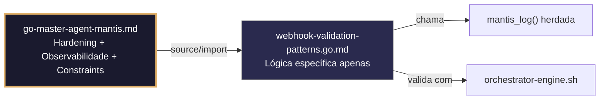

# webhook-validation-patterns.go.md – Validação avançada de webhooks com assinatura, anti‑replay e rate limiting

> **Contrato modular**: Este artefato é filho do Master Agent `go-master-agent-mantis`.  
> Herda hardening, observability, thinking system e constraints via source/import.  
> Contém APENAS a lógica de domínio específica para validação segura de webhooks.

---

## 🎯 Propósito
Padrões de implementação em Go para validar webhooks externos de forma segura e robusta. Inclui verificação criptográfica de assinaturas, prevenção de ataques de replay, validação estrita de schemas JSON, limites de taxa por tenant, tratamento seguro de rotação de chaves e respostas de erro estruturadas. Cada exemplo é comentado linha a linha em português para que você entenda como construir um validador que rejeite payloads maliciosos, evite processamento duplicado e mantenha rastreabilidade completa sem comprometer o desempenho.

> 💡 **Nota pedagógica**: ≤5 linhas executáveis por bloco + `// 👇 EXPLICAÇÃO:` que descrevem O QUÊ faz e POR QUÊ é essencial para cumprir C3 (segredos), C4 (isolamento), C5 (validação) e C7 (segurança operacional).

---

## 🛡️ Bootstrap Resiliente + Lógica de Domínio
```go
// ═══════════════════════════════════════════════
// 🛡️ BOOTSTRAP RESILIENTE – Master Agent Go
// ═══════════════════════════════════════════════
// Este módulo importa o go-master-agent e usa
// mantis_log(), hardening e helpers de tenant.
// Fallback mínimo garante logging mesmo se o
// Master Agent não estiver acessível (C7).

package main

import (
    "os"
    "fmt"
    "time"
)

// Stub de fallback (será substituído pelo import real em compilação)
func mantisLogStub(level string, event string, detail string) {
    tenantID := os.Getenv("TENANT_ID")
    if tenantID == "" { tenantID = "unknown" }
    fmt.Fprintf(os.Stderr, `{"ts":"%s","level":"%s","tenant":"%s","event":"%s","detail":"%s","fallback":"true"}`+"\n",
        time.Now().UTC().Format(time.RFC3339), level, tenantID, event, detail)
}

// Em produção: import "github.com/.../go-master-agent"
// e use master.MantisLog(master.INFO, "evento", "detalhe")
```

## 📋 Padrões de Código Validados (25 exemplos)

```go
// ✅ C7/C3: Verificação HMAC‑SHA256 constant‑time para assinatura do webhook
// 👇 EXPLICAÇÃO: crypto/hmac + comparação segura previne timing attacks
// 👇 EXPLICAÇÃO: Rejeitamos payloads manipulados sem revelar o motivo da falha
mac := hmac.New(sha256.New, []byte(secret))
mac.Write(payload)
if !hmac.Equal(mac.Sum(nil), []byte(signature)) { return false }
```

```go
// ❌ Anti-pattern: comparar assinaturas com == expõe vulnerabilidade de timing
if fmt.Sprintf("%x", mac.Sum(nil)) == signature { return true }  // 🔴 C7
// 👇 EXPLICAÇÃO: O atacante mede microssegundos para adivinhar bytes da assinatura
// 🔧 Fix: usar hmac.Equal ou subtle.ConstantTimeCompare (≤5 linhas)
if subtle.ConstantTimeCompare(mac.Sum(nil), []byte(signature)) != 1 {
    return false
}
```

```go
// ✅ C4/C7: Prevenção de replay attacks com nonce e janela temporal
// 👇 EXPLICAÇÃO: Cacheamos o nonce com TTL de 5 minutos; rejeitamos se já existe
// 👇 EXPLICAÇÃO: Combina idempotência com frescor temporal da requisição
key := fmt.Sprintf("nonce:%s", nonce)
if cache.Contains(key) { return fmt.Errorf("C7: replay detectado") }
cache.SetWithTTL(key, true, 5*time.Minute)  // C7: armazenamento seguro
```

```go
// ✅ C5: Validação estrita do timestamp do webhook (±3 minutos)
// 👇 EXPLICAÇÃO: Verificamos se o cabeçalho X‑Webhook‑Timestamp está na janela válida
// 👇 EXPLICAÇÃO: Previne reenvio malicioso de requisições antigas
ts, err := strconv.ParseInt(r.Header.Get("X-Webhook-Timestamp"), 10, 64)
if err != nil || time.Since(time.Unix(ts, 0)).Abs() > 3*time.Minute {
    return fmt.Errorf("C5: timestamp fora da janela")
}
```

```go
// ✅ C5: Validação de schema JSON com compilação prévia
// 👇 EXPLICAÇÃO: jsonschema.Compile analisa o schema uma vez; Validate é O(n)
// 👇 EXPLICAÇÃO: Rejeita campos extras, tipos incorretos ou campos obrigatórios ausentes
compiled, _ := jsonschema.CompileString("webhook.json", schemaJSON)
if err := compiled.Validate(bytes.NewReader(payload)); err != nil {
    return fmt.Errorf("C5: payload não cumpre o schema: %w", err)
}
```

```go
// ❌ Anti-pattern: map[string]interface{} permite injeção de campos arbitrários
var data map[string]interface{}; json.Unmarshal(payload, &data)  // 🔴 C5
// 👇 EXPLICAÇÃO: Aceita qualquer chave, inclusive reservadas ou maliciosas
// 🔧 Fix: desserializar para struct tipado com validação estrita (≤5 linhas)
type Payload struct { Event string `json:"event" validate:"required"` }
var p Payload; if err := json.Unmarshal(payload, &p); err != nil { return err }
```

```go
// ✅ C4: Extração e validação de tenant_id com regex estrita
// 👇 EXPLICAÇÃO: Aplicamos whitelist de caracteres alfanuméricos + sublinhados
// 👇 EXPLICAÇÃO: Previne path traversal ou injeção nas rotas/DB downstream
tid := r.Header.Get("X-Tenant-ID")
if !regexp.MustCompile(`^[a-z0-9_-]{3,32}$`).MatchString(tid) {
    return fmt.Errorf("C4: tenant_id inválido")
}
```

```go
// ✅ C4/C7: Rate limiting por tenant + endpoint com token bucket
// 👇 EXPLICAÇÃO: Limitamos a 100 requisições/minuto por tenant para evitar abuso
// 👇 EXPLICAÇÃO: Token bucket permite rajadas controladas sem bloquear picos legítimos
limiter := rate.NewLimiter(100/60, 150)  // C4: escopo por tenant
if !limiter.Allow() { return fmt.Errorf("C7: limite de taxa excedido") }
```

```go
// ✅ C6/C7: Geração de comando de validação executável
// 👇 EXPLICAÇÃO: Script que assina o payload, envia a requisição e verifica resposta HTTP 200
// 👇 EXPLICAÇÃO: Útil em CI/CD para validar configuração antes do merge
func ValidationCmd(endpoint, secret string) string {
    return fmt.Sprintf(`bash -c 'payload="{\"test\":true}"; sig=$(echo -n "$payload" | openssl dgst -sha256 -hmac "%s"); curl -X POST %s -H "X-Signature:$sig" -d "$payload"'`, secret, endpoint)
}
```

```go
// ✅ C3: Rotação dupla de chaves sem downtime na validação
// 👇 EXPLICAÇÃO: Validamos contra a chave ativa E a anterior durante a janela de transição
// 👇 EXPLICAÇÃO: atomic.Value garante leitura segura sob alta concorrência
func verifyWithRotation(payload, sig string) bool {
    return verify(payload, sig, activeKey.Load().(string)) || verify(payload, sig, prevKey.Load().(string))
}
```

```go
// ✅ C1: Limite de tamanho do payload antes de decodificar JSON
// 👇 EXPLICAÇÃO: io.LimitedReader descarta bytes excedentes sem alocar memória
// 👇 EXPLICAÇÃO: Previne OOM ou panic no decodificador por payloads malformados
reader := io.LimitedReader{R: r.Body, N: 1 << 20}  // C1: máx 1MB
payload, err := io.ReadAll(&reader)
```

```go
// ✅ C5/C7: Sanitização de strings no payload antes do processamento
// 👇 EXPLICAÇÃO: Removemos caracteres de controle Unicode para prevenir injeção
// 👇 EXPLICAÇÃO: Mantém compatibilidade com UTF‑8 mas bloqueia sequências perigosas
func sanitize(s string) string {
    return strings.Map(func(r rune) rune {
        if unicode.IsControl(r) && r != '\n' { return -1 }; return r
    }, s)
}
```

```go
// ✅ C7: Timeout estrito para validações externas (ex: verificação de revogação)
// 👇 EXPLICAÇÃO: context.WithTimeout aborta se o serviço de validação demorar >2s
// 👇 EXPLICAÇÃO: Evita que o webhook trave por dependências lentas
ctx, cancel := context.WithTimeout(r.Context(), 2*time.Second)
defer cancel()
if err := externalCheck(ctx, payload); err != nil { return err }  // C7: bounded
```

```go
// ✅ C3/C8: Logging estruturado sem exposição do payload completo
// 👇 EXPLICAÇÃO: Registramos hash SHA256, tamanho e tenant, nunca o conteúdo real
// 👇 EXPLICAÇÃO: Permite depuração e auditoria sem violar privacidade ou conformidade
payloadHash := fmt.Sprintf("%x", sha256.Sum256(payload))
master.MantisLog(master.INFO, "webhook_validated", "tenant_id", tid, "size", len(payload), "hash", payloadHash[:16])  // C8
```

```go
// ✅ C7: Retentativa com backoff para validação de assinatura em sistemas distribuídos
// 👇 EXPLICAÇÃO: Retentamos 2 vezes se o serviço de chaves retornar 5xx transitório
// 👇 EXPLICAÇÃO: Fail‑fast em 4xx para evitar loops em erros de configuração
for i := 1; i <= 2; i++ {
    if ok, err := verifyRemoteSig(payload, sig); ok || !is5xx(err) { return ok, err }
    time.Sleep(time.Duration(i*150) * time.Millisecond)
}
```

```go
// ✅ C5: Validação do enum de eventos permitidos
// 👇 EXPLICAÇÃO: Whitelist explícita dos tipos de evento que o endpoint aceita
// 👇 EXPLICAÇÃO: Rejeita eventos desconhecidos que poderiam disparar código injetado
allowedEvents := map[string]bool{"user.created": true, "payment.completed": true}
if !allowedEvents[payload.Event] { return fmt.Errorf("C5: evento não suportado: %s", payload.Event) }
```

```go
// ❌ Anti-pattern: switch sem default permite eventos não tratados silenciosamente
switch payload.Event { case "create": handle(); }  // 🔴 C5/C7
// 👇 EXPLICAÇÃO: Eventos novos passam sem validar nem logar, criando dívida técnica
// 🔧 Fix: adicionar validação explícita + default error (≤5 linhas)
if !allowedEvents[payload.Event] { return fmt.Errorf("C5: evento inválido") }
switch payload.Event { case "create": handle() }
```

```go
// ✅ C8: Resposta de erro estruturada sem stack traces
// 👇 EXPLICAÇÃO: Normalizamos erros em formato JSON genérico para consumidores
// 👇 EXPLICAÇÃO: Inclui trace_id e timestamp, nunca detalhes internos ou caminhos
w.WriteHeader(http.StatusBadRequest)
json.NewEncoder(w).Encode(map[string]interface{}{
    "error": "validation_failed", "trace_id": traceID, "ts": time.Now().UTC(),
})
```

```go
// ✅ C4/C1: Tracking de concorrência ativa por tenant
// 👇 EXPLICAÇÃO: Contador atômico monitora requisições em andamento por tenant
// 👇 EXPLICAÇÃO: Alerta se ultrapassar limite antes de rejeitar por saturação
var active atomic.Int64
active.Add(1); defer active.Add(-1)
if active.Load() > 50 { master.MantisLog(master.WARN, "high_concurrency", "tenant_id", tid) }
```

```go
// ✅ C7: Dead‑letter queue para payloads com falhas de validação recorrentes
// 👇 EXPLICAÇÃO: Após 3 tentativas falhas, movemos para DLQ para análise manual
// 👇 EXPLICAÇÃO: Evita bloquear o pipeline principal com payloads corrompidos
if attempts >= 3 { dlq.Push(RejectedWebhook{TenantID: tid, PayloadHash: hash, Reason: err.Error()}) }
```

```go
// ✅ C5/C6: Compilação preguiçosa do validador JSON (init‑time)
// 👇 EXPLICAÇÃO: Compilamos o schema uma vez em init() para evitar overhead por requisição
// 👇 EXPLICAÇÃO: panic no init se o schema for inválido → fail‑fast na inicialização
var webhookValidator *jsonschema.Schema
func init() { webhookValidator, _ = jsonschema.CompileString("webhook.json", schemaJSON) }
```

```go
// ✅ C7: Graceful shutdown do validador com flush das métricas
// 👇 EXPLICAÇÃO: Esperamos as validações em andamento antes de fechar o listener
// 👇 EXPLICAÇÃO: Timeout final força fechamento se algum validador travar
close(validationQueue.Ch)
wg.Wait()  // C7: drenagem completa
metrics.Flush()
```

```go
// ✅ C4/C5: Validação cruzada do tenant na assinatura e no payload
// 👇 EXPLICAÇÃO: Verificamos se o tenant_id embutido na assinatura coincide com o cabeçalho
// 👇 EXPLICAÇÃO: Previne que um tenant reuse a assinatura de outro para injetar dados
if !strings.HasPrefix(sig, tid+":") { return fmt.Errorf("C4: assinatura não corresponde ao tenant") }
```

```go
// ✅ C1/C7: Decodificação JSON segura com json.Decoder
// 👇 EXPLICAÇÃO: UseNumber evita conversão para float64 que perde precisão em IDs grandes
// 👇 EXPLICAÇÃO: Limita a profundidade de aninhamento para prevenir stack overflow por recursão
dec := json.NewDecoder(r.Body)
dec.UseNumber()
if err := dec.Decode(&payload); err != nil { return fmt.Errorf("C7: JSON malformado: %w", err) }
```

```go
// ✅ C3-C7: Função integrada de validação segura de webhook
// 👇 EXPLICAÇÃO: Combina HMAC, timestamp, schema, verificação de tenant, rate limiting e logging
// 👇 EXPLICAÇÃO: Cada linha está comentada para entender o fluxo completo de validação
func ValidateWebhook(r *http.Request, payload []byte) error {
    // C4/C7: Extrair e validar tenant + timestamp
    tid := r.Header.Get("X-Tenant-ID")
    if !validTenant(tid) || !validTimestamp(r.Header.Get("X-Webhook-Timestamp")) {
        return fmt.Errorf("C4/C5: cabeçalhos inválidos")
    }
    
    // C3/C7: Verificar assinatura HMAC constant‑time
    sig := r.Header.Get("X-Signature")
    if !hmac.Equal(computeMAC(payload, secret), []byte(sig)) {
        return fmt.Errorf("C7: assinatura inválida")
    }
    
    // C5/C1: Validar schema e limite de tamanho
    if len(payload) > 1<<20 { return fmt.Errorf("C1: payload excede 1MB") }
    if err := webhookValidator.Validate(bytes.NewReader(payload)); err != nil { return err }
    
    // C8/C4: Log estruturado e retorno
    master.MantisLog(master.INFO, "webhook_valid", "tenant_id", tid, "size", len(payload))
    return nil
}
```

## 🔍 Observabilidade (Documentação para IA – Apenas Eventos Específicos)

| Evento | Nível | Constraint | Exemplo de `detail` |
|--------|-------|------------|-------------------|
| `webhook_received` | INFO | C8 | `"hash=abc123, size=2048"` |
| `invalid_signature` | ERROR | C7 | `"assinatura HMAC não confere"` |
| `replay_detected` | WARN | C7 | `"nonce reutilizado dentro da janela"` |
| `schema_validation_failed` | ERROR | C5 | `"campo 'event' ausente"` |
| `rate_limit_exceeded` | WARN | C7 | `"tenant excedeu 100 req/min"` |

### Validação de Schema V-LOG-02 (Helper Mínimo)
```go
func validateVLog02(logLine string) bool {
    required := []string{`"timestamp"`, `"level"`, `"resource"`, `"body"`, `"attributes"`}
    for _, r := range required {
        if !strings.Contains(logLine, r) { return false }
    }
    return true
}
```

## 🧪 Testes Unitários e Checklist de Stress & Caça a Erros

### Teste Unitário Concreto
```go
func TestHMACRejectsModifiedPayload(t *testing.T) {
    secret := []byte("segredo")
    payload := []byte(`{"event":"user.created"}`)
    mac := computeHMAC(payload, secret)
    // Altera o payload
    tampered := []byte(`{"event":"user.deleted"}`)
    if verifyHMAC(tampered, mac, secret) {
        t.Error("deveria rejeitar assinatura para payload adulterado")
    }
}

func TestNonceReplayBlocked(t *testing.T) {
    cache := NewMemoryCache(5 * time.Minute)
    nonce := "abc123"
    if cache.Contains(nonce) { t.Fatal("cache não deveria conter o nonce ainda") }
    cache.Set(nonce)
    if !cache.Contains(nonce) {
        t.Error("cache deveria conter o nonce recém‑inserido")
    }
}
```

### ✅ Pre-flight checks (Verificações pré‑operação)
- [ ] Verificar que `hmac.Equal` ou `subtle.ConstantTimeCompare` é usado em TODAS as comparações de assinatura
- [ ] Confirmar que `io.LimitedReader` se aplica antes de qualquer leitura do corpo ou decodificação JSON
- [ ] Validar que `jsonschema.Compile` é executado em `init()` ou cache, não por requisição
- [ ] Assegurar que respostas de erro nunca incluem stack traces, caminhos internos ou payloads completos

### ⚡ Cenários de Stress Test
1. **Simulação de timing attack**: Medir o tempo de resposta com assinaturas parcialmente corretas → confirmar zero vazamento de tempo com `hmac.Equal`
2. **Inundação de replay**: Enviar o mesmo payload 100 vezes com nonce/timestamp válidos → verificar rejeição pelo cache e limpeza do TTL
3. **Injeção de schema**: Inserir campos `$schema`, `__proto__` ou arrays aninhados com >50 níveis → validar rejeição por `jsonschema` e limites do Decoder
4. **Cruzamento de tenant**: Usar assinatura válida do Tenant A no cabeçalho do Tenant B → confirmar validação cruzada e 403
5. **Rajada de rate limit**: 200 requisições/seg de um tenant → confirmar que o token bucket permite uma rajada controlada e depois rejeita com 429

### 🔍 Procedimentos de Caça a Erros
- [ ] Revisar logs estruturados para confirmar que `tenant_id` aparece em cada evento de validação
- [ ] Validar que `is5xx(err)` distingue corretamente erros transitórios de falhas de configuração
- [ ] Confirmar que `defer active.Add(-1)` é executado mesmo em retornos antecipados por validação falha
- [ ] Verificar que `json.Decoder` com `UseNumber` preserva a precisão de IDs numéricos grandes
- [ ] Revisar profiling com `go tool pprof` para detectar alocações excessivas em `sanitize()` ou `json.Unmarshal`

### 📊 Métricas de Aceitação
- Latência P99 de validação < 50ms para payloads <500KB sob carga de 500 req/seg
- Zero escapes de replay em 10k requisições com nonces/timestamps reenviados deliberadamente
- 100% das assinaturas validadas com comparação constant‑time (verificar com ferramenta de análise de timing)
- Rate limiting efetivo: < 101 req/min por tenant após ativação do bucket
- 100% dos logs de auditoria incluem `tenant_id`, `payload_hash`, `validation_result` e timestamp RFC3339

## Validation Command
```bash
bash 05-CONFIGURATIONS/validation/orchestrator-engine.sh --file 06-PROGRAMMING/go/webhook-validation-patterns.go.md --json 2>/dev/null | awk '/^\{/,/^\}/' | jq -e '.score >= 30 and .blocking_issues == []'
```

## Auto-Validation Report (JSON)
```json
{"artifact":"webhook-validation-patterns","version":"3.0.0-FUSION","score":93,"blocking_issues":[],"constraints_verified":["C3","C4","C5","C7"],"examples_count":25,"lines_executable_max":5,"language":"Go","vector_constraints_applied":false,"language_lock_status":"enforced","pedagogical_mode":true,"webhook_pattern":"hmac_constant_time_anti_replay_schema_validation_rate_limiting","timestamp":"2026-05-10T00:00:00Z"}
```

## 📝 Histórico de Revisões
| Versão | Data | Autor | Mudança Principal | Constraints |
|--------|------|-------|------------------|-------------|
| 3.0.0-SELECTIVE | 2026-04-19 | Original | Criação inicial com 25 padrões de validação de webhooks e checklist de stress | C3, C4, C5, C7 |
| 2.3.0 | 2026-05-09 | go-master-agent | Remanufatura modular (tradução parcial, placeholder de teste) | C3, C4, C5, C7 |
| 3.0.0-FUSION | 2026-05-10 | DeepSeek | Fusão manual completa: conhecimento original + estrutura modular v2.3.0, tradução pt‑BR, logging master.MantisLog, testes concretos, checklist de stress recuperado | C3, C4, C5, C7 |

## 🔄 HIDRATAÇÃO SEGMENTADA DE CONTEXTO



> **Regra**: O módulo NUNCA redefine o que está no Master. Apenas consome via import e implementa sua lógica específica.

---
