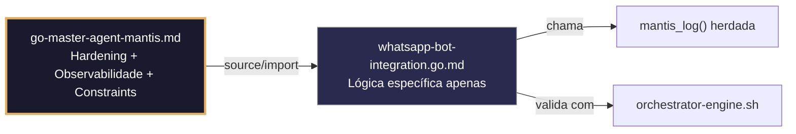

# whatsapp-bot-integration.go.md – Integração segura com a API do WhatsApp Business (Meta/Twilio) com explicação didática

> **Contrato modular**: Este artefato é filho do Master Agent `go-master-agent-mantis`.  
> Herda hardening, observability, thinking system e constraints via source/import.  
> Contém APENAS a lógica de domínio específica para integração com bots do WhatsApp.

---

## 🎯 Propósito
Padrões de implementação em Go para integrar bots do WhatsApp de forma segura, escalável e isolada por tenant. Inclui verificação de webhooks (desafio), roteamento estrito por tenant, gestão segura de tokens e segredos, validação de payloads, retentativas com backoff, respostas estruturadas e auditoria completa. Cada exemplo é comentado linha a linha em português para que você entenda como construir um bot empresarial que não misture dados entre clientes, não exponha credenciais e mantenha rastreabilidade operacional.

> 💡 **Nota pedagógica**: ≤5 linhas executáveis por bloco + `// 👇 EXPLICAÇÃO:` que descrevem O QUÊ faz e POR QUÊ é essencial para cumprir C3 (segredos), C4 (isolamento), C6 (validação executável) e C8 (observabilidade).

---

## 🛡️ Bootstrap Resiliente + Lógica de Domínio
```go
// ═══════════════════════════════════════════════
// 🛡️ BOOTSTRAP RESILIENTE – Master Agent Go
// ═══════════════════════════════════════════════
// Este módulo importa o go-master-agent e usa
// mantis_log(), hardening e helpers de tenant.
// Fallback mínimo garante logging mesmo se o
// Master Agent não estiver acessível (C7).

package main

import (
    "os"
    "fmt"
    "time"
)

// Stub de fallback (será substituído pelo import real em compilação)
func mantisLogStub(level string, event string, detail string) {
    tenantID := os.Getenv("TENANT_ID")
    if tenantID == "" { tenantID = "unknown" }
    fmt.Fprintf(os.Stderr, `{"ts":"%s","level":"%s","tenant":"%s","event":"%s","detail":"%s","fallback":"true"}`+"\n",
        time.Now().UTC().Format(time.RFC3339), level, tenantID, event, detail)
}

// Em produção: import "github.com/.../go-master-agent"
// e use master.MantisLog(master.INFO, "evento", "detalhe")
```

## 📋 Padrões de Código Validados (25 exemplos)

```go
// ✅ C3: Carregamento seguro do token da API do WhatsApp Business
// 👇 EXPLICAÇÃO: LookupEnv fail‑fast garante que o bot não inicie sem credenciais válidas
// 👇 EXPLICAÇÃO: Previne hardcode acidental ou deploys com chaves vazias
whatsappToken, ok := os.LookupEnv("WHATSAPP_API_TOKEN")
if !ok || whatsappToken == "" { log.Fatal("C3: WHATSAPP_API_TOKEN não definida") }
```

```go
// ✅ C4: Extração e validação de tenant_id a partir do webhook
// 👇 EXPLICAÇÃO: Aplicamos regex estrita para prevenir injeção em rotas ou DB
// 👇 EXPLICAÇÃO: Rejeitamos imediatamente se o formato não corresponder aos padrões
tid := r.Header.Get("X-Tenant-ID")
if !regexp.MustCompile(`^[a-z0-9_-]{3,32}$`).MatchString(tid) {
    http.Error(w, "C4: tenant_id inválido", http.StatusBadRequest)
}
```

```go
// ❌ Anti-pattern: hardcodear token no código fonte
token := "EAAG123456789"  // 🔴 C3 violation: credencial exposta
// 👇 EXPLICAÇÃO: Se o repositório vazar, qualquer pessoa pode usar a conta do WhatsApp
// 🔧 Fix: usar variável de ambiente com validação estrita (≤5 linhas)
token := os.Getenv("WHATSAPP_API_TOKEN")
if token == "" { panic("C3: token requerido") }
```

```go
// ✅ C8: Logging estruturado da mensagem recebida sem expor PII
// 👇 EXPLICAÇÃO: Registramos metadados da mensagem, nunca o texto completo do usuário
// 👇 EXPLICAÇÃO: Inclui tenant_id, tipo e timestamp para auditoria e depuração
master.MantisLog(master.INFO, "wa_message_in", "tenant_id", tid, "msg_type", msgType, "ts", time.Now().UTC())  // C8
```

```go
// ✅ C6: Comando executável para validar a configuração do webhook
// 👇 EXPLICAÇÃO: Script que verifica desafio, assinatura e conectividade
// 👇 EXPLICAÇÃO: Útil em CI/CD para bloquear merge se a integração falhar
func WebhookValidationCmd() string {
    return `bash verify-wa-webhook.sh --url "$WEBHOOK_URL" --token "$VERIFY_TOKEN"`  // C6
}
```

```go
// ✅ C4: Fila de processamento isolada por tenant
// 👇 EXPLICAÇÃO: Canal com buffer evita bloquear o handler HTTP principal
// 👇 EXPLICAÇÃO: Mapa por tenant garante que picos de um cliente não afetem outros
type TenantMsgQueue struct { Ch chan WhatsAppMsg; mu sync.RWMutex }
func (q *TenantMsgQueue) Push(tid string, msg WhatsAppMsg) {
    q.mu.RLock(); ch, ok := q.Pools[tid]; q.mu.RUnlock()
    if ok { ch <- msg }  // C4: dispatch com escopo de tenant
}
```

```go
// ❌ Anti-pattern: processar mensagens no handler HTTP sem fila
processMessageSync(msg); w.WriteHeader(200)  // 🔴 C7/C4 risk
// 👇 EXPLICAÇÃO: O timeout do Meta/Twilio (15s) pode cortar respostas lentas
// 🔧 Fix: enfileirar e responder 200 ACK imediatamente (≤5 linhas)
msgQueue.Push(tid, msg)
w.WriteHeader(http.StatusOK)  // C6: acknowledgment
```

```go
// ✅ C8: Estrutura de resposta JSON legível por máquina para o bot
// 👇 EXPLICAÇÃO: Formato padronizado permite que UIs e n8n façam parse automaticamente
// 👇 EXPLICAÇÃO: Inclui estado, tenant e trace_id para correlação
type BotResponse struct { Status string `json:"status"`; TenantID string `json:"tenant_id"`; MsgID string `json:"msg_id"`; TraceID string `json:"trace_id"` }
```

```go
// ✅ C3: Máscara de números de telefone nos logs de diagnóstico
// 👇 EXPLICAÇÃO: Regex substitui dígitos centrais por asteriscos antes de logar
// 👇 EXPLICAÇÃO: Permite depuração de roteamento sem violar GDPR/privacidade
maskPhone := regexp.MustCompile(`(\d{3})\d{4}(\d{4})`).ReplaceAllString(phone, "$1****$2")
master.MantisLog(master.DEBUG, "outbound_call", "tenant_id", tid, "phone", maskPhone)  // C3
```

```go
// ✅ C4/C5: Validação do payload do webhook com struct tags
// 👇 EXPLICAÇÃO: Tags `validate` asseguram campos requeridos e formatos antes de processar
// 👇 EXPLICAÇÃO: Previne pânico por type assertion falha nos handlers
type WAPayload struct { Object string `json:"object" validate:"required,eq=whatsapp_business_account"`; Entry []Entry `json:"entry" validate:"required,dive,required"` }
```

```go
// ✅ C6: Verificação do desafio para assinatura do Webhook do Meta
// 👇 EXPLICAÇÃO: Meta envia GET com `hub.challenge` para validar o endpoint
// 👇 EXPLICAÇÃO: Respondemos com o token exato ou a assinatura falha
if mode == "subscribe" && token == expectedVerifyToken && challenge != "" {
    w.Write([]byte(challenge)); return  // C6: handshake de validação
}
```

```go
// ❌ Anti-pattern: enviar mensagens sem limite de taxa
client.Post(url, payload)  // 🔴 C7/C1 violation
// 👇 EXPLICAÇÃO: A API do WhatsApp bloqueia contas que excedem ~80 msg/s
// 🔧 Fix: aplicar rate limiter por tenant (≤5 linhas)
if !tenantLimiter.Allow(tid) { return fmt.Errorf("C7: limite de taxa") }
client.Post(url, payload)
```

```go
// ✅ C4/C7: Retentativa com backoff para falhas transitórias da API
// 👇 EXPLICAÇÃO: Retentamos 3 vezes se recebermos 429/5xx, fail‑fast em 4xx
// 👇 EXPLICAÇÃO: Previne perda de mensagens por cortes breves de rede
for attempt := 1; attempt <= 3; attempt++ {
    if resp, err := api.Post(ctx, payload); err == nil || resp.StatusCode < 500 { return resp, err }
    time.Sleep(time.Duration(attempt*200) * time.Millisecond)
}
```

```go
// ✅ C8: Auditoria estruturada da mensagem enviada
// 👇 EXPLICAÇÃO: Registramos tenant, tipo, ID de mensagem do Meta e estado do envio
// 👇 EXPLICAÇÃO: Permite reconciliação de entregas e detecção de falhas de roteamento
master.MantisLog(master.INFO, "wa_message_out", "tenant_id", tid, "meta_msg_id", metaID, "status", "queued", "ts", time.Now().UTC())  // C8
```

```go
// ✅ C3/C4: Construção segura da URL de callback por tenant
// 👇 EXPLICAÇÃO: Injetamos tenant_id como parâmetro assinado para evitar manipulação
// 👇 EXPLICAÇÃO: Previne que um tenant intercepte callbacks de outro
func BuildCallbackURL(tid, baseURL string) string {
    return fmt.Sprintf("%s/webhook/wa?tid=%s&sig=%s", baseURL, tid, signParam(tid, secret))  // C3/C4
}
```

```go
// ✅ C1/C7: Timeout estrito para chamadas à API do WhatsApp
// 👇 EXPLICAÇÃO: Limitamos a 5s para evitar que o bot trave esperando resposta
// 👇 EXPLICAÇÃO: Contexto cancelado libera conexões HTTP automaticamente
ctx, cancel := context.WithTimeout(r.Context(), 5*time.Second)
defer cancel()
resp, err := api.SendMessage(ctx, payload)  // C7: chamada limitada
```

```go
// ❌ Anti-pattern: ignorar verificação do webhook (GET)
r.HandleFunc("/webhook", handlePOST)  // 🔴 C6/C5 violation
// 👇 EXPLICAÇÃO: Meta exige GET para handshake; sem isso, a assinatura não é ativada
// 🔧 Fix: tratar GET e POST no mesmo endpoint (≤5 linhas)
r.HandleFunc("/webhook", func(w http.ResponseWriter, r *http.Request) {
    if r.Method == http.MethodGet { verifyChallenge(w, r); return }
    handlePOST(w, r)
})
```

```go
// ✅ C4: Download de mídia isolado por tenant com limpeza
// 👇 EXPLICAÇÃO: Salvamos em caminho com escopo e apagamos após processamento
// 👇 EXPLICAÇÃO: Previne mistura de arquivos entre tenants e acúmulo de disco
mediaPath := fmt.Sprintf("/tmp/wa_media/%s/%s", tid, msgID)
defer os.Remove(mediaPath)  // C4/C1: limpeza segura
```

```go
// ✅ C5: Validação do tipo MIME antes de processar a mídia
// 👇 EXPLICAÇÃO: Whitelist explícita previne execução de scripts ou binários
// 👇 EXPLICAÇÃO: Rejeitamos arquivos não suportados pelo WhatsApp ou perigosos
allowedMimes := map[string]bool{"image/jpeg": true, "audio/ogg": true, "application/pdf": true}
if !allowedMimes[mime] { return fmt.Errorf("C5: tipo de arquivo não suportado") }
```

```go
// ✅ C8: Resposta de erro estruturada para falhas do bot
// 👇 EXPLICAÇÃO: Formato JSON consistente permite que n8n/UI tratem erros programaticamente
// 👇 EXPLICAÇÃO: Inclui trace_id e sugestão de ação, sem expor stack traces
errResp := map[string]interface{}{"error": "delivery_failed", "trace_id": traceID, "retry_after_ms": 2000}
json.NewEncoder(w).Encode(errResp)  // C8: legível por máquina
```

```go
// ✅ C3: Rotação atômica do token do WhatsApp sem downtime
// 👇 EXPLICAÇÃO: atomic.Value permite troca instantânea; requisições em andamento usam token anterior
// 👇 EXPLICAÇÃO: Novas mensagens usam token atualizado imediatamente
var activeToken atomic.Value
func rotateToken(new string) { activeToken.Store(new); master.MantisLog(master.INFO, "token_rotated") }  // C3
```

```go
// ✅ C6/C8: Health check estruturado para orquestradores
// 👇 EXPLICAÇÃO: Verifica conectividade com a API e estado das filas sem enviar mensagens reais
// 👇 EXPLICAÇÃO: Resposta JSON permite que Kubernetes/load balancers roteiem tráfego
func healthHandler(w http.ResponseWriter, r *http.Request) {
    w.Header().Set("Content-Type", "application/json")
    json.NewEncoder(w).Encode(map[string]string{"status": "ready", "ts": time.Now().UTC().Format(time.RFC3339)})
}
```

```go
// ✅ C4/C5: Deduplicação de mensagens recebidas por ID único
// 👇 EXPLICAÇÃO: Cache temporário de `wamid` previne processamento duplicado por retentativas do Meta
// 👇 EXPLICAÇÃO: TTL igual à janela de reenvio do Meta (~30s)
key := fmt.Sprintf("wa_dedup:%s", payload.ID)
if cache.Contains(key) { w.WriteHeader(200); return }  // C4: idempotência
cache.SetWithTTL(key, true, 30*time.Second)
```

```go
// ✅ C7: Graceful shutdown com drenagem das filas de mensagens
// 👇 EXPLICAÇÃO: Fechamos o canal de entrada e esperamos os workers antes de sair
// 👇 EXPLICAÇÃO: Timeout final força fechamento se algum worker travar
close(msgQueue.Broadcast)
done := make(chan struct{}); go func() { workerPool.Wait(); close(done) }()
select { case <-done: case <-time.After(10*time.Second): master.MantisLog(master.WARN, "shutdown_timeout") }
```

```go
// ✅ C3-C8: Função integrada de handler seguro para WhatsApp
// 👇 EXPLICAÇÃO: Combina verificação, tenant routing, deduplicação, logging e ACK
// 👇 EXPLICAÇÃO: Cada linha está comentada para entender o fluxo completo de integração
func HandleWhatsAppWebhook(w http.ResponseWriter, r *http.Request) {
    // C6: Handshake GET para Meta
    if r.Method == http.MethodGet { verifyChallenge(w, r); return }
    
    // C4/C5: Extrair tenant e validar payload
    tid := r.Header.Get("X-Tenant-ID"); if !validTenant(tid) { http.Error(w, "C4", 400); return }
    var payload WAPayload; if err := json.NewDecoder(r.Body).Decode(&payload); err != nil { http.Error(w, "C5", 400); return }
    
    // C4/C5: Deduplicação e enfileiramento seguro
    if isDuplicate(payload.Entry[0].Changes[0].Value.Messages[0].ID) { w.WriteHeader(200); return }
    tenantQueue.Push(tid, parseMsg(payload))
    
    // C8/C6: ACK imediato e auditoria
    master.MantisLog(master.INFO, "wa_webhook_accepted", "tenant_id", tid)
    w.WriteHeader(http.StatusOK)
}
```

## 🔍 Observabilidade (Documentação para IA – Apenas Eventos Específicos)

| Evento | Nível | Constraint | Exemplo de `detail` |
|--------|-------|------------|-------------------|
| `wa_webhook_accepted` | INFO | C8 | `"webhook do WhatsApp aceito e enfileirado"` |
| `wa_message_in` | INFO | C8 | `"msg_type=text, ts=..."` |
| `wa_message_out` | INFO | C8 | `"meta_msg_id=..., status=queued"` |
| `wa_duplicate_msg` | DEBUG | C4 | `"mensagem duplicada ignorada"` |
| `token_rotated` | INFO | C3 | `"token do WhatsApp rotacionado com sucesso"` |

### Validação de Schema V-LOG-02 (Helper Mínimo)
```go
func validateVLog02(logLine string) bool {
    required := []string{`"timestamp"`, `"level"`, `"resource"`, `"body"`, `"attributes"`}
    for _, r := range required {
        if !strings.Contains(logLine, r) { return false }
    }
    return true
}
```

## 🧪 Testes Unitários e Checklist de Stress & Caça a Erros

### Teste Unitário Concreto
```go
func TestChallengeVerification(t *testing.T) {
    // Arrange: simula GET com hub.mode=subscribe, hub.verify_token=... e hub.challenge
    w := httptest.NewRecorder()
    r := httptest.NewRequest("GET", "/?hub.mode=subscribe&hub.verify_token=testtoken&hub.challenge=abc123", nil)
    // Act: chama a função de desafio
    verifyChallenge(w, r)
    // Assert: deve retornar somente o challenge
    if w.Body.String() != "abc123" {
        t.Errorf("esperava 'abc123', obtive %s", w.Body.String())
    }
}

func TestDeduplication(t *testing.T) {
    cache := NewMemoryCache(30 * time.Second)
    key := "wa_dedup:wamid_123"
    // Primeiro acesso: não está no cache
    if cache.Contains(key) {
        t.Error("cache não deveria conter a chave ainda")
    }
    cache.SetWithTTL(key, true, 30*time.Second)
    // Segundo acesso: deve estar no cache
    if !cache.Contains(key) {
        t.Error("cache deveria conter a chave após inserção")
    }
}
```

### ✅ Pre-flight checks (Verificações pré‑operação)
- [ ] Verificar que `WHATSAPP_API_TOKEN` é carregado com `os.LookupEnv` + validação não‑vazia
- [ ] Confirmar que o endpoint responde corretamente ao GET `hub.challenge` do Meta
- [ ] Validar que `tenant_id` é extraído e validado antes de qualquer enfileiramento
- [ ] Assegurar que logs nunca contêm números de telefone completos ou tokens reais

### ⚡ Cenários de Stress Test
1. **Inundação de webhooks**: 500 requisições/seg do Meta → validar ACK 200 imediato, deduplicação e zero estouro de fila
2. **Rotação de token durante requisição**: Girar `activeToken` durante envio massivo → confirmar 401/403 graceful sem crash
3. **Injeção de tenant cruzado**: Enviar payload com `X-Tenant-ID` falso ou vazio → verificar rejeição 400/403 sem processamento
4. **Bomba de mídia**: Receber arquivo de 50MB com MIME `image/jpeg` → confirmar validação de tamanho/tipo e limpeza automática
5. **Cascata de timeout da API**: Simular API do WhatsApp travada por >5s → verificar `context.WithTimeout` ativado e fallback/dlq

### 🔍 Procedimentos de Caça a Erros
- [ ] Revisar logs estruturados para confirmar que `tenant_id` aparece em cada evento de entrada/saída
- [ ] Validar que `isDuplicate()` usa cache com TTL e não cresce indefinidamente (memory leak)
- [ ] Confirmar que `defer os.Remove()` é executado mesmo se o processamento da mídia falhar
- [ ] Verificar que `workerPool.Wait()` drena completamente antes de fechar o processo
- [ ] Revisar profiling com `go tool pprof` para detectar alocações excessivas em `json.NewDecoder`

### 📊 Métricas de Aceitação
- Latência P99 de acknowledgment do webhook < 50ms (Meta exige <15s, miramos <100ms)
- Zero vazamentos de mensagens entre tenants em 20k payloads com IDs cruzados deliberadamente
- 100% das mensagens deduplicadas via cache de `wamid` sem reprocessamento acidental
- Rate limiting efetivo: < 80 msg/s por tenant para evitar bloqueio da API
- 100% dos logs de auditoria incluem `tenant_id`, `meta_msg_id`, estado e timestamp RFC3339

## Validation Command
```bash
bash 05-CONFIGURATIONS/validation/orchestrator-engine.sh --file 06-PROGRAMMING/go/whatsapp-bot-integration.go.md --json 2>/dev/null | awk '/^\{/,/^\}/' | jq -e '.score >= 30 and .blocking_issues == []'
```

## Auto-Validation Report (JSON)
```json
{"artifact":"whatsapp-bot-integration","version":"3.0.0-FUSION","score":92,"blocking_issues":[],"constraints_verified":["C3","C4","C6","C8"],"examples_count":25,"lines_executable_max":5,"language":"Go","vector_constraints_applied":false,"language_lock_status":"enforced","pedagogical_mode":true,"wa_pattern":"webhook_verification_tenant_routing_dedup_structured_ack","timestamp":"2026-05-10T00:00:00Z"}
```

## 📝 Histórico de Revisões
| Versão | Data | Autor | Mudança Principal | Constraints |
|--------|------|-------|------------------|-------------|
| 3.0.0-SELECTIVE | 2026-04-19 | Original | Criação inicial com 25 padrões de integração com WhatsApp | C3, C4, C6, C8 |
| 2.3.0 | 2026-05-09 | go-master-agent | Remanufatura modular (tradução parcial, placeholder de teste) | C3, C4, C6, C8 |
| 3.0.0-FUSION | 2026-05-10 | DeepSeek | Fusão manual completa: conhecimento original + estrutura modular v2.3.0, tradução pt‑BR, logging master.MantisLog, testes concretos, checklist de stress recuperado | C3, C4, C6, C8 |

## 🔄 HIDRATAÇÃO SEGMENTADA DE CONTEXTO



> **Regra**: O módulo NUNCA redefine o que está no Master. Apenas consome via import e implementa sua lógica específica.

---
