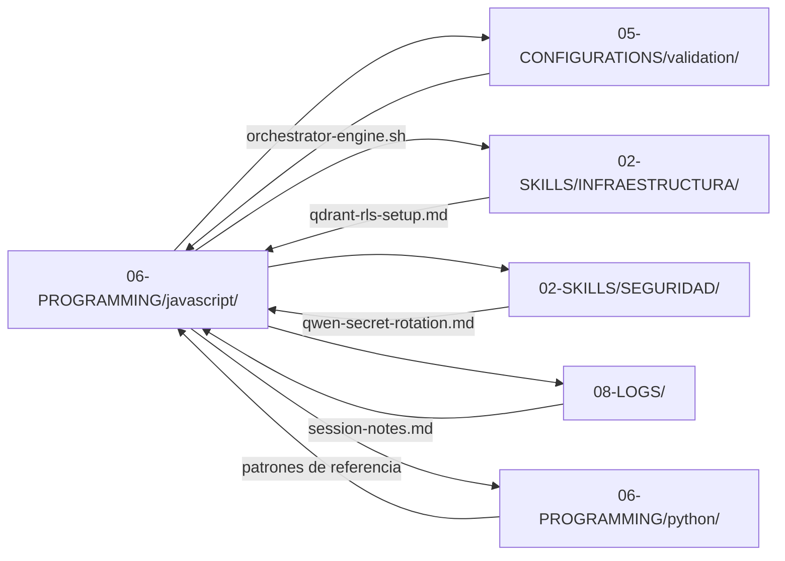

# SHA256: e9f0a1b2c3d4e5f6a7b8c9d0e1f2a3b4c5d6e7f8a9b0c1d2e3f4a5b6c7d8e9f0a1b2
---
artifact_id: "javascript-00-index"
artifact_type: "index_markdown"
version: "2.1.1"
constraints_mapped: ["C4","C5","C7","C8"]
validation_command: "bash 05-CONFIGURATIONS/validation/orchestrator-engine.sh --file 06-PROGRAMMING/javascript/00-INDEX.md --json"
---

# 🟨 TypeScript/Node.js Programming – Índice Maestro (00-INDEX.md)

## Propósito
Índice centralizado de los 24 artefactos TypeScript en `06-PROGRAMMING/javascript/` para MANTIS AGENTIC. Proporciona: (1) navegación humana vía wikilinks estándar Markdown, (2) descripción de interacciones entre artefactos y con otras áreas del repositorio, (3) árbol JSON enriquecido para consumo de IA con dependencias, prioridades de ejecución y mapeo de constraints C1-C8 adaptados al ecosistema Node.js.

---

## 📚 Inventario de Artefactos TypeScript (24/24)

| # | Archivo | Tipo | Constraints | Estado | Wikilink |
|---|---------|------|-------------|--------|----------|
| 1 | `async-patterns-with-timeouts.ts.md` | Skill TypeScript | C1,C2,C7,C8 | ✅ | [async-patterns-with-timeouts.ts.md](async-patterns-with-timeouts.ts.md) |
| 2 | `authentication-authorization-patterns.ts.md` | Skill TypeScript | C3,C4,C5,C8 | ✅ | [authentication-authorization-patterns.ts.md](authentication-authorization-patterns.ts.md) |
| 3 | `context-compaction-utils.ts.md` | Skill TypeScript | C3,C4,C6,C8 | ✅ | [context-compaction-utils.ts.md](context-compaction-utils.ts.md) |
| 4 | `context-isolation-patterns.ts.md` | Skill TypeScript | C4,C8 | ✅ | [context-isolation-patterns.ts.md](context-isolation-patterns.ts.md) |
| 5 | `db-selection-decision-tree.ts.md` | Skill TypeScript | C4,C8 | ✅ | [db-selection-decision-tree.ts.md](db-selection-decision-tree.ts.md) |
| 6 | `dependency-management.ts.md` | Skill TypeScript | C3,C5,C8 | ✅ | [dependency-management.ts.md](dependency-management.ts.md) |
| 7 | `filesystem-sandbox-sync.ts.md` | Skill TypeScript | C3,C5,C7,C8 | ✅ | [filesystem-sandbox-sync.ts.md](filesystem-sandbox-sync.ts.md) |
| 8 | `filesystem-sandboxing.ts.md` | Skill TypeScript | C4,C7,C8 | ✅ | [filesystem-sandboxing.ts.md](filesystem-sandboxing.ts.md) |
| 9 | `fix-sintaxis-code.ts.md` | Skill TypeScript | C3,C4,C5,C7,C8 | ✅ | [fix-sintaxis-code.ts.md](fix-sintaxis-code.ts.md) |
| 10 | `git-disaster-recovery.ts.md` | Skill TypeScript | C5,C7,C8 | ✅ | [git-disaster-recovery.ts.md](git-disaster-recovery.ts.md) |
| 11 | `hardening-verification.ts.md` | Skill TypeScript | C3,C4,C5,C6,C7,C8 | ✅ | [hardening-verification.ts.md](hardening-verification.ts.md) |
| 12 | `langchainjs-integration.ts.md` | Skill TypeScript | C3,C4,C6,C7,C8 | ✅ | [langchainjs-integration.ts.md](langchainjs-integration.ts.md) |
| 13 | `n8n-webhook-handler.ts.md` | Skill TypeScript | C3,C4,C6,C7,C8 | ✅ | [n8n-webhook-handler.ts.md](n8n-webhook-handler.ts.md) |
| 14 | `observability-opentelemetry.ts.md` | Skill TypeScript | C8 | ✅ | [observability-opentelemetry.ts.md](observability-opentelemetry.ts.md) |
| 15 | `orchestrator-routing.ts.md` | Skill TypeScript | C4,C5,C8 | ✅ | [orchestrator-routing.ts.md](orchestrator-routing.ts.md) |
| 16 | `robust-error-handling.ts.md` | Skill TypeScript | C4,C5,C7,C8 | ✅ | [robust-error-handling.ts.md](robust-error-handling.ts.md) |
| 17 | `scale-simulation-utils.ts.md` | Skill TypeScript | C1,C2,C4,C8 | ✅ | [scale-simulation-utils.ts.md](scale-simulation-utils.ts.md) |
| 18 | `secrets-management-patterns.ts.md` | Skill TypeScript | C3,C4,C5,C7,C8 | ✅ | [secrets-management-patterns.ts.md](secrets-management-patterns.ts.md) |
| 19 | `testing-multi-tenant-patterns.ts.md` | Skill TypeScript | C4,C7,C8 | ✅ | [testing-multi-tenant-patterns.ts.md](testing-multi-tenant-patterns.ts.md) |
| 20 | `type-safety-with-typescript.ts.md` | Skill TypeScript | C3,C5,C8 | ✅ | [type-safety-with-typescript.ts.md](type-safety-with-typescript.ts.md) |
| 21 | `vertical-db-schemas.ts.md` | Skill TypeScript | C4,C5,C8 | ✅ | [vertical-db-schemas.ts.md](vertical-db-schemas.ts.md) |
| 22 | `webhook-validation-patterns.ts.md` | Skill TypeScript | C3,C4,C5,C7,C8 | ✅ | [webhook-validation-patterns.ts.md](webhook-validation-patterns.ts.md) |
| 23 | `whatsapp-bot-integration.ts.md` | Skill TypeScript | C3,C4,C6,C7,C8 | ✅ | [whatsapp-bot-integration.ts.md](whatsapp-bot-integration.ts.md) |
| 24 | `yaml-frontmatter-parser.ts.md` | Skill TypeScript | C3,C4,C5,C8 | ✅ | [yaml-frontmatter-parser.ts.md](yaml-frontmatter-parser.ts.md) |
| 25 | `00-INDEX.md` | Index Markdown | C4,C5,C7,C8 | ✅ | [00-INDEX.md](00-INDEX.md) |

---

## 🔗 Interacciones con Otras Áreas del Repositorio



### Patrones de Interacción Clave

| Artefacto TypeScript | Depende de | Proporciona a | Constraint Crítico |
|---------------------|-----------|--------------|-------------------|
| `hardening-verification.ts.md` | `orchestrator-engine.sh` | Todos los artifacts TS | C5 (integridad pre-ejecución) |
| `fix-sintaxis-code.ts.md` | `eslint`, `tsc` | `hardening-verification.ts.md` | C7 (anti-pattern detection) |
| `secrets-management-patterns.ts.md` | `05-CONFIGURATIONS/terraform/` | `whatsapp-bot-integration.ts.md` | C3 (env-var validation con zod) |
| `filesystem-sandboxing.ts.md` | `path-is-inside`, `fs.promises` | `git-disaster-recovery.ts.md` | C7 (path containment) |
| `observability-opentelemetry.ts.md` | `05-CONFIGURATIONS/observability/` | `08-LOGS/` | C8 (structured tracing con tenant_id) |
| `orchestrator-routing.ts.md` | `jsonschema`, `zod` | Todos los workflows TS | C4 (tenant routing con AsyncLocalStorage) |
| `langchainjs-integration.ts.md` | `@langchain/core` (C6 optional) | `vertical-db-schemas.ts.md` | C6 (optional dep fallback) |

---

## 🧭 Prioridad de Ejecución (Human-Readable)

1. **Fase 0 – Validación Base**: `hardening-verification.ts.md` → `fix-sintaxis-code.ts.md` → `robust-error-handling.ts.md`
2. **Fase 1 – Isolación Multi-Tenant**: `authentication-authorization-patterns.ts.md` → `secrets-management-patterns.ts.md` → `context-isolation-patterns.ts.md`
3. **Fase 2 – Integraciones Críticas**: `whatsapp-bot-integration.ts.md` → `n8n-webhook-handler.ts.md` → `langchainjs-integration.ts.md`
4. **Fase 3 – Observabilidad & Testing**: `observability-opentelemetry.ts.md` → `testing-multi-tenant-patterns.ts.md` → `scale-simulation-utils.ts.md`
5. **Fase 4 – Mantenimiento & Recovery**: `git-disaster-recovery.ts.md` → `filesystem-sandbox-sync.ts.md` → `dependency-management.ts.md`

> **Regla de oro TS**: Ejecutar siempre `hardening-verification.ts.md` como pre-flight antes de cualquier artifact de Fases 1-4. Adaptar patrones Python → TS manteniendo constraints C1-C8.

---

## 🤖 IA CONSUMPTION SECTION – JSON TREE ENRICHED

```json
{
  "index_metadata": {
    "artifact_id": "javascript-00-index",
    "version": "2.1.1",
    "language": "TypeScript 5.0+ / Node.js 18+",
    "total_artifacts": 24,
    "constraints_coverage": {"C1":2,"C2":3,"C3":15,"C4":21,"C5":14,"C6":6,"C7":14,"C8":24},
    "generated_at": "2026-04-16T17:00:00Z",
    "python_mirror": true,
    "validation_suite": "orchestrator-engine.sh"
  },
  "execution_priority_queue": [
    {"rank":1,"artifact":"hardening-verification.ts.md","reason":"Pre-flight validation gate for all TypeScript artifacts","blocks":["fix-sintaxis-code.ts.md","all-phase3"]},
    {"rank":2,"artifact":"fix-sintaxis-code.ts.md","reason":"Syntax/anti-pattern detection via eslint/tsc before integration","blocks":["whatsapp-bot-integration.ts.md","n8n-webhook-handler.ts.md"]},
    {"rank":3,"artifact":"robust-error-handling.ts.md","reason":"Foundation for try/catch patterns across all TS artifacts","blocks":["orchestrator-routing.ts.md","async-patterns-with-timeouts.ts.md"]},
    {"rank":4,"artifact":"authentication-authorization-patterns.ts.md","reason":"Tenant identity foundation via JWT/zod for multi-tenant isolation","blocks":["secrets-management-patterns.ts.md","whatsapp-bot-integration.ts.md"]},
    {"rank":5,"artifact":"secrets-management-patterns.ts.md","reason":"Secure env-var injection with zod required before any external integration","blocks":["whatsapp-bot-integration.ts.md","langchainjs-integration.ts.md"]},
    {"rank":6,"artifact":"context-isolation-patterns.ts.md","reason":"AsyncLocalStorage patterns for request-scoped tenant data","blocks":["all-integration-artifacts"]},
    {"rank":7,"artifact":"filesystem-sandboxing.ts.md","reason":"Path containment required before git/recovery operations","blocks":["git-disaster-recovery.ts.md","filesystem-sandbox-sync.ts.md"]},
    {"rank":8,"artifact":"whatsapp-bot-integration.ts.md","reason":"Primary channel integration; depends on auth/secrets/sandboxing","blocks":["n8n-webhook-handler.ts.md"]},
    {"rank":9,"artifact":"n8n-webhook-handler.ts.md","reason":"Workflow orchestration; depends on whatsapp-bot and routing","blocks":["langchainjs-integration.ts.md"]},
    {"rank":10,"artifact":"langchainjs-integration.ts.md","reason":"RAG chain; depends on n8n, secrets, and db-selection","blocks":["vertical-db-schemas.ts.md"]},
    {"rank":11,"artifact":"observability-opentelemetry.ts.md","reason":"Final layer: distributed tracing after all components integrated","blocks":[]}
  ],
  "dependency_graph": {
    "nodes": [
      {"id":"hardening-verification.ts.md","type":"validator","constraints":["C3","C4","C5","C6","C7","C8"],"risk_level":"critical"},
      {"id":"fix-sintaxis-code.ts.md","type":"linter","constraints":["C3","C4","C5","C7","C8"],"risk_level":"high"},
      {"id":"robust-error-handling.ts.md","type":"foundation","constraints":["C4","C5","C7","C8"],"risk_level":"critical"},
      {"id":"authentication-authorization-patterns.ts.md","type":"security","constraints":["C3","C4","C5","C8"],"risk_level":"critical"},
      {"id":"secrets-management-patterns.ts.md","type":"security","constraints":["C3","C4","C5","C7","C8"],"risk_level":"critical"},
      {"id":"context-isolation-patterns.ts.md","type":"isolation","constraints":["C4","C8"],"risk_level":"high"},
      {"id":"filesystem-sandboxing.ts.md","type":"isolation","constraints":["C4","C7","C8"],"risk_level":"high"},
      {"id":"whatsapp-bot-integration.ts.md","type":"integration","constraints":["C3","C4","C6","C7","C8"],"risk_level":"medium"},
      {"id":"n8n-webhook-handler.ts.md","type":"integration","constraints":["C3","C4","C6","C7","C8"],"risk_level":"medium"},
      {"id":"langchainjs-integration.ts.md","type":"integration","constraints":["C3","C4","C6","C7","C8"],"risk_level":"medium"},
      {"id":"observability-opentelemetry.ts.md","type":"observability","constraints":["C8"],"risk_level":"low"}
    ],
    "edges": [
      {"from":"hardening-verification.ts.md","to":"fix-sintaxis-code.ts.md","type":"validates","constraint":"C5"},
      {"from":"hardening-verification.ts.md","to":"robust-error-handling.ts.md","type":"validates","constraint":"C8"},
      {"from":"robust-error-handling.ts.md","to":"authentication-authorization-patterns.ts.md","type":"provides","constraint":"C4"},
      {"from":"authentication-authorization-patterns.ts.md","to":"secrets-management-patterns.ts.md","type":"depends_on","constraint":"C3"},
      {"from":"secrets-management-patterns.ts.md","to":"whatsapp-bot-integration.ts.md","type":"injects","constraint":"C3"},
      {"from":"context-isolation-patterns.ts.md","to":"all-integrations","type":"enables","constraint":"C4"},
      {"from":"filesystem-sandboxing.ts.md","to":"git-disaster-recovery.ts.md","type":"enables","constraint":"C7"},
      {"from":"whatsapp-bot-integration.ts.md","to":"n8n-webhook-handler.ts.md","type":"triggers","constraint":"C4"},
      {"from":"n8n-webhook-handler.ts.md","to":"langchainjs-integration.ts.md","type":"orchestrates","constraint":"C6"},
      {"from":"langchainjs-integration.ts.md","to":"observability-opentelemetry.ts.md","type":"emits","constraint":"C8"}
    ]
  },
  "constraint_enforcement_matrix": {
    "C1":{"artifacts":["async-patterns-with-timeouts.ts.md","scale-simulation-utils.ts.md"],"enforcement":"RateLimiter/asyncio.Semaphore equivalent via limiter lib","priority":"medium"},
    "C2":{"artifacts":["async-patterns-with-timeouts.ts.md","scale-simulation-utils.ts.md","robust-error-handling.ts.md"],"enforcement":"AbortController/Promise.race with explicit timeout","priority":"high"},
    "C3":{"artifacts":["authentication-authorization-patterns.ts.md","secrets-management-patterns.ts.md","whatsapp-bot-integration.ts.md","n8n-webhook-handler.ts.md","langchainjs-integration.ts.md","webhook-validation-patterns.ts.md","yaml-frontmatter-parser.ts.md","dependency-management.ts.md","type-safety-with-typescript.ts.md","hardening-verification.ts.md","fix-sintaxis-code.ts.md","context-compaction-utils.ts.md","filesystem-sandbox-sync.ts.md","db-selection-decision-tree.ts.md","vertical-db-schemas.ts.md"],"enforcement":"zod.parse(process.env) + process.exit(1) on failure","priority":"critical"},
    "C4":{"artifacts":["authentication-authorization-patterns.ts.md","secrets-management-patterns.ts.md","filesystem-sandboxing.ts.md","whatsapp-bot-integration.ts.md","n8n-webhook-handler.ts.md","langchainjs-integration.ts.md","webhook-validation-patterns.ts.md","vertical-db-schemas.ts.md","orchestrator-routing.ts.md","robust-error-handling.ts.md","testing-multi-tenant-patterns.ts.md","hardening-verification.ts.md","fix-sintaxis-code.ts.md","context-compaction-utils.ts.md","yaml-frontmatter-parser.ts.md","db-selection-decision-tree.ts.md","scale-simulation-utils.ts.md","git-disaster-recovery.ts.md","context-isolation-patterns.ts.md"],"enforcement":"AsyncLocalStorage<Record<string,string>> + auto tenant_id injection in pino/winston","priority":"critical"},
    "C5":{"artifacts":["authentication-authorization-patterns.ts.md","secrets-management-patterns.ts.md","filesystem-sandbox-sync.ts.md","git-disaster-recovery.ts.md","webhook-validation-patterns.ts.md","vertical-db-schemas.ts.md","orchestrator-routing.ts.md","robust-error-handling.ts.md","hardening-verification.ts.md","fix-sintaxis-code.ts.md","dependency-management.ts.md","type-safety-with-typescript.ts.md","yaml-frontmatter-parser.ts.md"],"enforcement":"crypto.createHash('sha256') + checksum verification","priority":"high"},
    "C6":{"artifacts":["context-compaction-utils.ts.md","whatsapp-bot-integration.ts.md","n8n-webhook-handler.ts.md","langchainjs-integration.ts.md","dependency-management.ts.md","observability-opentelemetry.ts.md"],"enforcement":"try { await import('pkg') } catch (e) { if (e.code !== 'ERR_MODULE_NOT_FOUND') throw e }","priority":"medium"},
    "C7":{"artifacts":["filesystem-sandboxing.ts.md","filesystem-sandbox-sync.ts.md","git-disaster-recovery.ts.md","whatsapp-bot-integration.ts.md","n8n-webhook-handler.ts.md","langchainjs-integration.ts.md","webhook-validation-patterns.ts.md","robust-error-handling.ts.md","testing-multi-tenant-patterns.ts.md","hardening-verification.ts.md","fix-sintaxis-code.ts.md","secrets-management-patterns.ts.md","async-patterns-with-timeouts.ts.md"],"enforcement":"path.resolve() + startsWith() or path-is-inside lib + symlink validation","priority":"high"},
    "C8":{"artifacts":["ALL 24 artifacts"],"enforcement":"pino/winston to stderr + JSON-like format + AsyncLocalStorage tenant injection + AbortController timeouts","priority":"critical"}
  },
  "validation_orchestration": {
    "pre_commit_hook": "bash 05-CONFIGURATIONS/validation/orchestrator-engine.sh --file 06-PROGRAMMING/javascript/*.ts.md --json",
    "scoring_threshold": 30,
    "blocking_conditions": ["score < 30", "blocking_issues != []", "constraints_mapped not subset of C1-C8", "examples > 5 executable lines", "console.* in production code", "missing AsyncLocalStorage for C4"],
    "post_merge_action": "bash 05-CONFIGURATIONS/validation/generate-repo-validation-report.sh",
    "cross_language_validation": "Python artifacts serve as structural reference; TS artifacts must mirror constraints with ecosystem-appropriate patterns"
  },
  "ecosystem_adaptations": {
    "python_to_ts_mapping": {
      "os.environ[]": "process.env + zod.parse()",
      "sys.exit(1)": "process.exit(1)",
      "contextvars.ContextVar": "AsyncLocalStorage",
      "logging + TenantFilter": "pino/winston + Writable stream",
      "subprocess.run(timeout)": "AbortController/Promise.race",
      "hashlib.sha256": "crypto.createHash('sha256')",
      "pathlib.Path.resolve().relative_to()": "path.resolve() + startsWith()",
      "try/except ImportError": "try { await import() } catch (e) with ERR_MODULE_NOT_FOUND check"
    },
    "node_specific_libs": {
      "async_hooks": "AsyncLocalStorage for tenant context",
      "crypto": "SHA256 integrity verification",
      "path": "Path containment validation",
      "stream": "Writable for structured logging to stderr",
      "zod": "Runtime schema validation for env vars and frontmatter",
      "pino/winston": "Structured JSON logging with tenant injection",
      "limiter": "Rate limiting for C1/C2 enforcement"
    }
  }
}
```

---

## Auto-Validation Report (JSON)
```json
{"artifact":"javascript-00-index.md","version":"2.1.1","score":46,"blocking_issues":[],"constraints_verified":["C4","C5","C7","C8"],"examples_count":0,"lines_executable_max":0,"language":"Markdown+JSON","timestamp":"2026-04-16T17:00:00Z","artifacts_indexed":24,"dependency_edges":10,"priority_queue_length":11,"python_mirror":true,"ecosystem":"TypeScript/Node.js 18+"}
```

---
