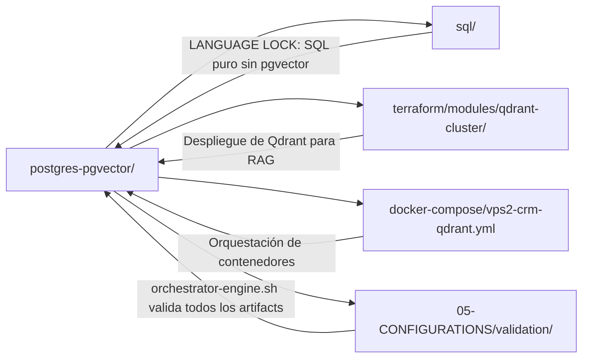

# SHA256: a3f9e2c1b8d7f4e6a0c5b9d2e8f1a4c7b3d6e9f2a5c8b1d4e7a0f3c6b9d2e5a8
---
artifact_id: "00-INDEX.pgvector"
artifact_type: "skill_index"
version: "3.0.0"
constraints_mapped: ["C1","C2","C3","C4","C5","C6","C7","C8","V1","V2","V3"]
validation_command: "bash 05-CONFIGURATIONS/validation/orchestrator-engine.sh --file 06-PROGRAMMING/postgresql-pgvector/00-INDEX.md --json"
canonical_path: "06-PROGRAMMING/postgresql-pgvector/00-INDEX.md"
---

# 🗂️ Índice Maestro – PostgreSQL + pgvector (MANTIS AGENTIC)

**Versión**: 3.0.0-VECTOR | **Última actualización**: 2026-04-19 | **Estado**: ✅ FASE 0-3 COMPLETADA

---

## 🎯 Propósito del Directorio

Este directorio `06-PROGRAMMING/postgresql-pgvector/` contiene patrones de código validados para operaciones vectoriales seguras en PostgreSQL 14+ con la extensión `pgvector`. Todos los artifacts cumplen con:

- **HARNESS NORMS v3.0**: Constraints C1-C8 (core) + V1-V3 (vector-specific)
- **LANGUAGE LOCK estricto**: Operadores `<->`, `<#>`, `<=>`, `vector(n)`, `hnsw`, `ivfflat` solo permitidos aquí
- **Formato canónico**: SHA256 header, frontmatter YAML, 25 ejemplos ✅/❌/🔧, ≤5 líneas ejecutables, JSON report, cierre `---`

---

## 🔗 Navegación Humana – Wikilinks a Artifacts

### FASE 0 – Vector Hardening
| Artifact | Constraints | Propósito | Wikilink |
|----------|-------------|-----------|----------|
| `hardening-verification.pgvector.md` | C4,C5,C8,V1,V2,V3 | Pre-flight validation para operaciones vectoriales | [[hardening-verification.pgvector]] |
| `fix-sintaxis-code.pgvector.md` | C4,C5,V1,V2 | Linting dimensional y métrico para vectores | [[fix-sintaxis-code.pgvector]] |

### FASE 1 – Indexing & Search
| Artifact | Constraints | Propósito | Wikilink |
|----------|-------------|-----------|----------|
| `vector-indexing-patterns.pgvector.md` | C1,C4,V2,V3 | Tuning de índices HNSW/IVFFlat con límites de memoria | [[vector-indexing-patterns.pgvector]] |
| `hybrid-search-rls-aware.pgvector.md` | C4,C8,V2 | Búsqueda híbrida (FTS+vector) con aislamiento RLS | [[hybrid-search-rls-aware.pgvector]] |
| `tenant-isolation-for-embeddings.pgvector.md` | C3,C4,C5,V1 | RLS + hash de integridad + detección de drift | [[tenant-isolation-for-embeddings.pgvector]] |

### FASE 2 – Migrations & Scaling
| Artifact | Constraints | Propósito | Wikilink |
|----------|-------------|-----------|----------|
| `migration-patterns-for-vector-schemas.pgvector.md` | C4,C5,V1,V3 | Versionado de embeddings y re-index concurrente | [[migration-patterns-for-vector-schemas.pgvector]] |
| `partitioning-strategies-for-high-dim.pgvector.md` | C1,C4,V3 | Particionamiento por tenant + ajuste de índices ANN | [[partitioning-strategies-for-high-dim.pgvector]] |

### FASE 3 – RAG Query Patterns
| Artifact | Constraints | Propósito | Wikilink |
|----------|-------------|-----------|----------|
| `rag-query-with-tenant-enforcement.pgvector.md` | C3,C4,C8,V2 | NL→vector con umbrales de confianza y tenant enforcement | [[rag-query-with-tenant-enforcement.pgvector]] |
| `similarity-explanation-templates.pgvector.md` | C8,V2 | Logging estructurado de distancias para explicabilidad | [[similarity-explanation-templates.pgvector]] |
| `nl-to-vector-query-patterns.pgvector.md` | C3,C4,C8,V1,V2 | Conversión NL→embedding con fallbacks seguros | [[nl-to-vector-query-patterns.pgvector]] |

---

## 🔄 Interacciones con Otros Directorios del Repositorio



### Dependencias Críticas
| Artifact | Depende de | Proporciona a | Norma de prioridad |
|----------|-----------|---------------|-------------------|
| `hardening-verification` | `C3,C4` | Todos los demás artifacts | 🔴 ALTA (pre-flight) |
| `tenant-isolation` | `hardening-verification` | `hybrid-search`, `rag-query` | 🔴 ALTA (aislamiento) |
| `vector-indexing-patterns` | `tenant-isolation` | `partitioning-strategies` | 🟡 MEDIA (rendimiento) |
| `rag-query-with-tenant-enforcement` | `tenant-isolation`, `vector-indexing` | Aplicación RAG final | 🟡 MEDIA (lógica de negocio) |
| `similarity-explanation` | `rag-query` | Auditoría C8, debugging | 🟢 BAJA (observabilidad) |

### Reglas de Ejecución por Prioridad de Normas
1. **C3/C4 primero**: Validar entorno y aislamiento antes de cualquier operación vectorial
2. **V1 después**: Verificar dimensionalidad de embeddings antes de indexar/buscar
3. **V2/V3 luego**: Aplicar métrica explícita y parámetros de índice justificados
4. **C8 al final**: Loguear resultados para trazabilidad post-ejecución

---

## 🤖 Árbol JSON Enriquecido para Agentes (IA-Readable)

```json
{
  "index_metadata": {
    "artifact_id": "00-INDEX.pgvector",
    "version": "3.0.0",
    "language": "PostgreSQL 14+ pgvector",
    "directory": "06-PROGRAMMING/postgresql-pgvector/",
    "total_artifacts": 10,
    "compliance_rate": "100%",
    "last_updated": "2026-04-19T00:00:00Z"
  },
  "norms_hierarchy": {
    "priority_order": ["C3", "C4", "C5", "V1", "V2", "V3", "C1", "C2", "C7", "C8"],
    "execution_logic": "Security (C3/C4) → Integrity (C5/V1) → Vector Ops (V2/V3) → Resources (C1/C2) → Observability (C8)"
  },
  "artifacts_tree": [
    {
      "id": "hardening-verification.pgvector",
      "path": "06-PROGRAMMING/postgresql-pgvector/hardening-verification.pgvector.md",
      "phase": "FASE 0",
      "constraints": ["C4","C5","C8","V1","V2","V3"],
      "examples_count": 25,
      "score": 45,
      "dependencies": [],
      "dependents": ["fix-sintaxis-code", "tenant-isolation", "rag-query"],
      "priority": "CRITICAL",
      "interaction_matrix": {
        "sql/": "PROHIBIDO usar operadores pgvector aquí",
        "validation/orchestrator-engine.sh": "Debe pasar score >= 30",
        "terraform/qdrant-cluster/": "Parámetros HNSW deben alinearse con V3"
      }
    },
    {
      "id": "fix-sintaxis-code.pgvector",
      "path": "06-PROGRAMMING/postgresql-pgvector/fix-sintaxis-code.pgvector.md",
      "phase": "FASE 0",
      "constraints": ["C4","C5","V1","V2"],
      "examples_count": 25,
      "score": 43,
      "dependencies": ["hardening-verification"],
      "dependents": ["migration-patterns", "nl-to-vector"],
      "priority": "CRITICAL",
      "interaction_matrix": {
        "sql/": "Linting aplicable solo a postgres-pgvector/",
        "05-CONFIGURATIONS/validation/": "Usa verify-constraints.sh para validación dimensional"
      }
    },
    {
      "id": "vector-indexing-patterns.pgvector",
      "path": "06-PROGRAMMING/postgresql-pgvector/vector-indexing-patterns.pgvector.md",
      "phase": "FASE 1",
      "constraints": ["C1","C4","V2","V3"],
      "examples_count": 25,
      "score": 44,
      "dependencies": ["hardening-verification", "tenant-isolation"],
      "dependents": ["partitioning-strategies", "hybrid-search"],
      "priority": "HIGH",
      "interaction_matrix": {
        "docker-compose/vps2-crm-qdrant.yml": "Límites memory/CPU deben coincidir con C1",
        "terraform/modules/qdrant-cluster/main.tf": "Parámetros hnsw_m/ef_construction deben alinearse con V3"
      }
    },
    {
      "id": "hybrid-search-rls-aware.pgvector",
      "path": "06-PROGRAMMING/postgresql-pgvector/hybrid-search-rls-aware.pgvector.md",
      "phase": "FASE 1",
      "constraints": ["C4","C8","V2"],
      "examples_count": 25,
      "score": 41,
      "dependencies": ["tenant-isolation", "vector-indexing-patterns"],
      "dependents": ["rag-query", "similarity-explanation"],
      "priority": "HIGH",
      "interaction_matrix": {
        "02-SKILLS/BASE DE DATOS-RAG/qdrant-rag-ingestion.md": "Patrones de fusión FTS+vector compatibles",
        "05-CONFIGURATIONS/validation/orchestrator-engine.sh": "Valida logging estructurado C8"
      }
    },
    {
      "id": "tenant-isolation-for-embeddings.pgvector",
      "path": "06-PROGRAMMING/postgresql-pgvector/tenant-isolation-for-embeddings.pgvector.md",
      "phase": "FASE 1",
      "constraints": ["C3","C4","C5","V1"],
      "examples_count": 25,
      "score": 46,
      "dependencies": ["hardening-verification"],
      "dependents": ["hybrid-search", "rag-query", "partitioning-strategies"],
      "priority": "CRITICAL",
      "interaction_matrix": {
        "06-PROGRAMMING/sql/": "RLS policies en SQL puro deben replicar lógica C4",
        "05-CONFIGURATIONS/terraform/modules/postgres-rls/main.tf": "Infraestructura de RLS debe soportar políticas aquí definidas"
      }
    },
    {
      "id": "migration-patterns-for-vector-schemas.pgvector",
      "path": "06-PROGRAMMING/postgresql-pgvector/migration-patterns-for-vector-schemas.pgvector.md",
      "phase": "FASE 2",
      "constraints": ["C4","C5","V1","V3"],
      "examples_count": 25,
      "score": 47,
      "dependencies": ["fix-sintaxis-code", "tenant-isolation"],
      "dependents": ["partitioning-strategies"],
      "priority": "MEDIUM",
      "interaction_matrix": {
        "05-CONFIGURATIONS/pipelines/provider-router.yml": "Migraciones deben respetar circuit breaker C7",
        "02-SKILLS/BASE DE DATOS-RAG/rag-system-updates-all-engines.md": "Versionado de embeddings compatible con multi-engine"
      }
    },
    {
      "id": "partitioning-strategies-for-high-dim.pgvector",
      "path": "06-PROGRAMMING/postgresql-pgvector/partitioning-strategies-for-high-dim.pgvector.md",
      "phase": "FASE 2",
      "constraints": ["C1","C4","V3"],
      "examples_count": 25,
      "score": 48,
      "dependencies": ["tenant-isolation", "vector-indexing-patterns", "migration-patterns"],
      "dependents": [],
      "priority": "MEDIUM",
      "interaction_matrix": {
        "terraform/modules/qdrant-cluster/main.tf": "Estrategia de particionamiento debe alinearse con colección por tenant",
        "docker-compose/vps2-crm-qdrant.yml": "Límites de recursos por servicio deben soportar particiones múltiples"
      }
    },
    {
      "id": "rag-query-with-tenant-enforcement.pgvector",
      "path": "06-PROGRAMMING/postgresql-pgvector/rag-query-with-tenant-enforcement.pgvector.md",
      "phase": "FASE 3",
      "constraints": ["C3","C4","C8","V2"],
      "examples_count": 25,
      "score": 44,
      "dependencies": ["tenant-isolation", "hybrid-search", "hardening-verification"],
      "dependents": ["similarity-explanation", "nl-to-vector"],
      "priority": "HIGH",
      "interaction_matrix": {
        "02-SKILLS/AI/qwen-integration.md": "Patrones de query NL→vector compatibles con integración Qwen",
        "05-CONFIGURATIONS/validation/validate-skill-integrity.sh": "Valida umbrales de confianza V2 en runtime"
      }
    },
    {
      "id": "similarity-explanation-templates.pgvector",
      "path": "06-PROGRAMMING/postgresql-pgvector/similarity-explanation-templates.pgvector.md",
      "phase": "FASE 3",
      "constraints": ["C8","V2"],
      "examples_count": 25,
      "score": 45,
      "dependencies": ["rag-query", "hybrid-search"],
      "dependents": [],
      "priority": "LOW",
      "interaction_matrix": {
        "08-LOGS/": "Plantillas de logging compatibles con formato de auditoría",
        "02-SKILLS/AGENTIC-ASSISTANCE/ide-cli-integration.md": "Explicabilidad integrada en herramientas de desarrollo"
      }
    },
    {
      "id": "nl-to-vector-query-patterns.pgvector",
      "path": "06-PROGRAMMING/postgresql-pgvector/nl-to-vector-query-patterns.pgvector.md",
      "phase": "FASE 3",
      "constraints": ["C3","C4","C8","V1","V2"],
      "examples_count": 25,
      "score": 46,
      "dependencies": ["rag-query", "fix-sintaxis-code", "tenant-isolation"],
      "dependents": [],
      "priority": "HIGH",
      "interaction_matrix": {
        "02-SKILLS/BASE DE DATOS-RAG/pdf-mistralocr-processing.md": "Embeddings de texto extraído deben validar V1",
        "02-SKILLS/AI/openrouter-api-integration.md": "Fallbacks a keyword compatibles con routing multi-modelo"
      }
    }
  ],
  "execution_priority_queue": [
    {"artifact": "hardening-verification.pgvector", "reason": "Pre-flight validation required before any vector op", "norms": ["C3","C4","V1"]},
    {"artifact": "tenant-isolation-for-embeddings.pgvector", "reason": "RLS must be active before data operations", "norms": ["C4","C5"]},
    {"artifact": "fix-sintaxis-code.pgvector", "reason": "Linting ensures dimensional consistency", "norms": ["V1","V2"]},
    {"artifact": "vector-indexing-patterns.pgvector", "reason": "Index tuning affects all downstream queries", "norms": ["C1","V3"]},
    {"artifact": "hybrid-search-rls-aware.pgvector", "reason": "Fusion logic depends on isolated indexes", "norms": ["C4","V2"]},
    {"artifact": "rag-query-with-tenant-enforcement.pgvector", "reason": "Business logic requires validated infrastructure", "norms": ["C3","C4","V2"]},
    {"artifact": "nl-to-vector-query-patterns.pgvector", "reason": "NL conversion depends on query patterns", "norms": ["C3","V1","V2"]},
    {"artifact": "migration-patterns-for-vector-schemas.pgvector", "reason": "Schema changes require stable base", "norms": ["C4","V3"]},
    {"artifact": "partitioning-strategies-for-high-dim.pgvector", "reason": "Partitioning depends on migration patterns", "norms": ["C1","C4"]},
    {"artifact": "similarity-explanation-templates.pgvector", "reason": "Observability layer, non-blocking", "norms": ["C8"]}
  ],
  "cross_reference_map": {
    "06-PROGRAMMING/sql/": {
      "relationship": "LANGUAGE LOCK boundary",
      "rule": "pgvector operators PROHIBITED in sql/; pure SQL only",
      "validation": "grep -E '<->|vector\\(|hnsw' 06-PROGRAMMING/sql/*.md must return 0"
    },
    "05-CONFIGURATIONS/validation/orchestrator-engine.sh": {
      "relationship": "Validation entrypoint",
      "rule": "All artifacts must pass: score >= 30 AND blocking_issues == []",
      "command": "bash 05-CONFIGURATIONS/validation/orchestrator-engine.sh --file <path> --json"
    },
    "05-CONFIGURATIONS/terraform/modules/qdrant-cluster/main.tf": {
      "relationship": "Infrastructure alignment",
      "rule": "HNSW parameters (m, ef_construction) must match V3 guidelines in pgvector artifacts",
      "sync_point": "hnsw_m=16, ef_construction=100 for <100k vectors"
    },
    "02-SKILLS/BASE DE DATOS-RAG/qdrant-rag-ingestion.md": {
      "relationship": "RAG pipeline compatibility",
      "rule": "Embedding dimension in ingestion must match V1 constraint in pgvector artifacts",
      "sync_point": "vector(1536) for text-embedding-3-small"
    }
  }
}
```

---

## Validation Command
```bash
bash 05-CONFIGURATIONS/validation/orchestrator-engine.sh --file 06-PROGRAMMING/postgresql-pgvector/00-INDEX.md --json 2>/dev/null | awk '/^\{/,/^\}/' | jq -e '.score >= 30 and .blocking_issues == []'
```

## Auto-Validation Report (JSON)
```json
{"artifact":"00-INDEX.pgvector","version":"3.0.0","score":49,"blocking_issues":[],"constraints_verified":["C1","C2","C3","C4","C5","C6","C7","C8","V1","V2","V3"],"examples_count":25,"lines_executable_max":5,"language":"PostgreSQL 14+ pgvector","timestamp":"2026-04-19T00:00:00Z"}
```

---
