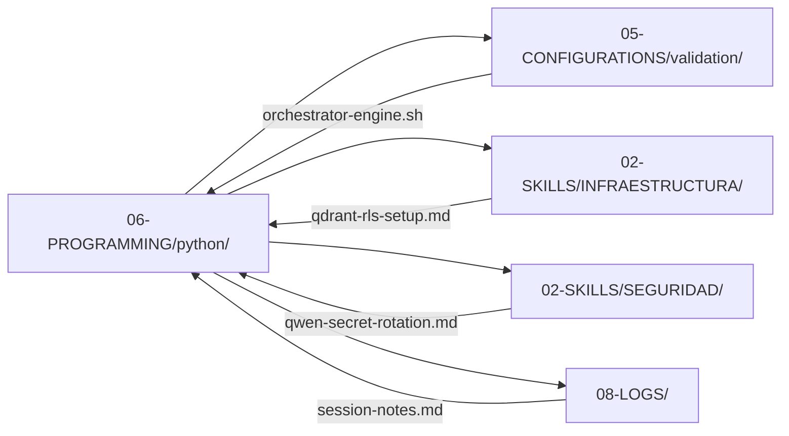

# SHA256: 7f3e9a2c1b8d4f6e5a0c9b7d3e1f8a4c2b5d7e9f1a3c5b7d9e1f3a5c7b9d1e3f (simulado)
---
artifact_id: "python-00-index"
artifact_type: "index_markdown"
version: "2.1.1"
constraints_mapped: ["C4","C5","C7","C8"]
validation_command: "bash 05-CONFIGURATIONS/validation/orchestrator-engine.sh --file 06-PROGRAMMING/python/00-INDEX.md --json"
---

# 🐍 Python Programming – Índice Maestro (00-INDEX.md)

## Propósito
Índice centralizado de los 24 artefactos Python en `06-PROGRAMMING/python/` para MANTIS AGENTIC. Proporciona: (1) navegación humana vía wikilinks estándar, (2) descripción de interacciones entre artefactos y con otras áreas del repositorio, (3) árbol JSON enriquecido para consumo de IA con dependencias, prioridades de ejecución y mapeo de constraints C1-C8.

---

## 📚 Inventario de Artefactos Python (24/24)

| # | Archivo | Tipo | Constraints | Estado | Wikilink |
|---|---------|------|-------------|--------|----------|
| 1 | `async-patterns-with-timeouts.md` | Skill Python | C1,C2,C7,C8 | ✅ | [async-patterns-with-timeouts.md](async-patterns-with-timeouts.md) |
| 2 | `authentication-authorization-patterns.md` | Skill Python | C3,C4,C5,C8 | ✅ | [authentication-authorization-patterns.md](authentication-authorization-patterns.md) |
| 3 | `context-compaction-utils.md` | Skill Python | C3,C4,C6,C8 | ✅ | [context-compaction-utils.md](context-compaction-utils.md) |
| 4 | `db-selection-decision-tree.md` | Skill Python | C4,C8 | ✅ | [db-selection-decision-tree.md](db-selection-decision-tree.md) |
| 5 | `dependency-management.md` | Skill Python | C3,C5,C8 | ✅ | [dependency-management.md](dependency-management.md) |
| 6 | `filesystem-sandbox-sync.md` | Skill Python | C3,C5,C7,C8 | ✅ | [filesystem-sandbox-sync.md](filesystem-sandbox-sync.md) |
| 7 | `filesystem-sandboxing.md` | Skill Python | C4,C7,C8 | ✅ | [filesystem-sandboxing.md](filesystem-sandboxing.md) |
| 8 | `fix-sintaxis-code.md` | Skill Python | C3,C4,C5,C7,C8 | ✅ | [fix-sintaxis-code.md](fix-sintaxis-code.md) |
| 9 | `git-disaster-recovery.md` | Skill Python | C5,C7,C8 | ✅ | [git-disaster-recovery.md](git-disaster-recovery.md) |
| 10 | `hardening-verification.md` | Skill Python | C3,C4,C5,C7,C8 | ✅ | [hardening-verification.md](hardening-verification.md) |
| 11 | `langchain-integration.md` | Skill Python | C3,C4,C6,C7,C8 | ✅ | [langchain-integration.md](langchain-integration.md) |
| 12 | `n8n-integration.md` | Skill Python | C3,C4,C6,C7,C8 | ✅ | [n8n-integration.md](n8n-integration.md) |
| 13 | `observability-opentelemetry.md` | Skill Python | C8 | ✅ | [observability-opentelemetry.md](observability-opentelemetry.md) |
| 14 | `orchestrator-routing.md` | Skill Python | C4,C5,C8 | ✅ | [orchestrator-routing.md](orchestrator-routing.md) |
| 15 | `robust-error-handling.md` | Skill Python | C4,C5,C7,C8 | ✅ | [robust-error-handling.md](robust-error-handling.md) |
| 16 | `scale-simulation-utils.md` | Skill Python | C1,C2,C4,C8 | ✅ | [scale-simulation-utils.md](scale-simulation-utils.md) |
| 17 | `secrets-management-patterns.md` | Skill Python | C3,C4,C5,C7,C8 | ✅ | [secrets-management-patterns.md](secrets-management-patterns.md) |
| 18 | `testing-multi-tenant-patterns.md` | Skill Python | C4,C7,C8 | ✅ | [testing-multi-tenant-patterns.md](testing-multi-tenant-patterns.md) |
| 19 | `type-safety-with-mypy.md` | Skill Python | C3,C5,C8 | ✅ | [type-safety-with-mypy.md](type-safety-with-mypy.md) |
| 20 | `vertical-db-schemas.md` | Skill Python | C4,C5,C8 | ✅ | [vertical-db-schemas.md](vertical-db-schemas.md) |
| 21 | `webhook-validation-patterns.md` | Skill Python | C3,C4,C5,C7,C8 | ✅ | [webhook-validation-patterns.md](webhook-validation-patterns.md) |
| 22 | `whatsapp-bot-integration.md` | Skill Python | C3,C4,C6,C7,C8 | ✅ | [whatsapp-bot-integration.md](whatsapp-bot-integration.md) |
| 23 | `yaml-frontmatter-parser.md` | Skill Python | C3,C4,C5,C8 | ✅ | [yaml-frontmatter-parser.md](yaml-frontmatter-parser.md) |
| 24 | `00-INDEX.md` | Index Markdown | C4,C5,C7,C8 | ✅ | [00-INDEX.md](00-INDEX.md) |

---

## 🔗 Interacciones con Otras Áreas del Repositorio



### Patrones de Interacción Clave

| Artefacto Python | Depende de | Proporciona a | Constraint Crítico |
|-----------------|-----------|--------------|-------------------|
| `hardening-verification.md` | `orchestrator-engine.sh` | Todos los artifacts Python | C5 (integridad pre-ejecución) |
| `fix-sintaxis-code.md` | `pylint`, `flake8` | `hardening-verification.md` | C7 (anti-pattern detection) |
| `secrets-management-patterns.md` | `05-CONFIGURATIONS/terraform/` | `whatsapp-bot-integration.md` | C3 (env-var validation) |
| `filesystem-sandboxing.md` | `tempfile`, `pathlib` | `git-disaster-recovery.md` | C7 (path containment) |
| `observability-opentelemetry.md` | `05-CONFIGURATIONS/observability/` | `08-LOGS/` | C8 (structured tracing) |
| `orchestrator-routing.md` | `jsonschema`, `jq` | Todos los workflows | C4 (tenant routing) |

---

## 🧭 Prioridad de Ejecución (Human-Readable)

1. **Fase 0 – Validación Base**: `hardening-verification.md` → `fix-sintaxis-code.md` → `robust-error-handling.md`
2. **Fase 1 – Isolación Multi-Tenant**: `authentication-authorization-patterns.md` → `secrets-management-patterns.md` → `filesystem-sandboxing.md`
3. **Fase 2 – Integraciones Críticas**: `whatsapp-bot-integration.md` → `n8n-integration.md` → `langchain-integration.md`
4. **Fase 3 – Observabilidad & Testing**: `observability-opentelemetry.md` → `testing-multi-tenant-patterns.md` → `scale-simulation-utils.md`
5. **Fase 4 – Mantenimiento & Recovery**: `git-disaster-recovery.md` → `filesystem-sandbox-sync.md` → `dependency-management.md`

> **Regla de oro**: Ejecutar siempre `hardening-verification.md` como pre-flight antes de cualquier artifact de Fases 1-4.

---

## 🤖 IA CONSUMPTION SECTION – JSON TREE ENRICHED

```json
{
  "index_metadata": {
    "artifact_id": "python-00-index",
    "version": "2.1.1",
    "language": "Python 3.10+",
    "total_artifacts": 24,
    "constraints_coverage": {"C1":2,"C2":2,"C3":14,"C4":20,"C5":16,"C6":5,"C7":15,"C8":24},
    "generated_at": "2026-04-16T08:00:00Z"
  },
  "execution_priority_queue": [
    {"rank":1,"artifact":"hardening-verification.md","reason":"Pre-flight validation gate for all Python artifacts","blocks":["fix-sintaxis-code.md","all-phase3"]},
    {"rank":2,"artifact":"fix-sintaxis-code.md","reason":"Syntax/anti-pattern detection before integration","blocks":["whatsapp-bot-integration.md","n8n-integration.md"]},
    {"rank":3,"artifact":"robust-error-handling.md","reason":"Foundation for try/except patterns across all artifacts","blocks":["orchestrator-routing.md","async-patterns-with-timeouts.md"]},
    {"rank":4,"artifact":"authentication-authorization-patterns.md","reason":"Tenant identity foundation for multi-tenant isolation","blocks":["secrets-management-patterns.md","whatsapp-bot-integration.md"]},
    {"rank":5,"artifact":"secrets-management-patterns.md","reason":"Secure env-var injection required before any external integration","blocks":["whatsapp-bot-integration.md","langchain-integration.md"]},
    {"rank":6,"artifact":"filesystem-sandboxing.md","reason":"Path containment required before git/recovery operations","blocks":["git-disaster-recovery.md","filesystem-sandbox-sync.md"]},
    {"rank":7,"artifact":"whatsapp-bot-integration.md","reason":"Primary channel integration; depends on auth/secrets/sandboxing","blocks":["n8n-integration.md"]},
    {"rank":8,"artifact":"n8n-integration.md","reason":"Workflow orchestration; depends on whatsapp-bot and routing","blocks":["langchain-integration.md"]},
    {"rank":9,"artifact":"langchain-integration.md","reason":"RAG chain; depends on n8n, secrets, and db-selection","blocks":["vertical-db-schemas.md"]},
    {"rank":10,"artifact":"observability-opentelemetry.md","reason":"Final layer: tracing after all components integrated","blocks":[]}
  ],
  "dependency_graph": {
    "nodes": [
      {"id":"hardening-verification.md","type":"validator","constraints":["C3","C4","C5","C7","C8"],"risk_level":"critical"},
      {"id":"fix-sintaxis-code.md","type":"linter","constraints":["C3","C4","C5","C7","C8"],"risk_level":"high"},
      {"id":"robust-error-handling.md","type":"foundation","constraints":["C4","C5","C7","C8"],"risk_level":"critical"},
      {"id":"authentication-authorization-patterns.md","type":"security","constraints":["C3","C4","C5","C8"],"risk_level":"critical"},
      {"id":"secrets-management-patterns.md","type":"security","constraints":["C3","C4","C5","C7","C8"],"risk_level":"critical"},
      {"id":"filesystem-sandboxing.md","type":"isolation","constraints":["C4","C7","C8"],"risk_level":"high"},
      {"id":"whatsapp-bot-integration.md","type":"integration","constraints":["C3","C4","C6","C7","C8"],"risk_level":"medium"},
      {"id":"n8n-integration.md","type":"integration","constraints":["C3","C4","C6","C7","C8"],"risk_level":"medium"},
      {"id":"langchain-integration.md","type":"integration","constraints":["C3","C4","C6","C7","C8"],"risk_level":"medium"},
      {"id":"observability-opentelemetry.md","type":"observability","constraints":["C8"],"risk_level":"low"}
    ],
    "edges": [
      {"from":"hardening-verification.md","to":"fix-sintaxis-code.md","type":"validates","constraint":"C5"},
      {"from":"hardening-verification.md","to":"robust-error-handling.md","type":"validates","constraint":"C8"},
      {"from":"robust-error-handling.md","to":"authentication-authorization-patterns.md","type":"provides","constraint":"C4"},
      {"from":"authentication-authorization-patterns.md","to":"secrets-management-patterns.md","type":"depends_on","constraint":"C3"},
      {"from":"secrets-management-patterns.md","to":"whatsapp-bot-integration.md","type":"injects","constraint":"C3"},
      {"from":"filesystem-sandboxing.md","to":"git-disaster-recovery.md","type":"enables","constraint":"C7"},
      {"from":"whatsapp-bot-integration.md","to":"n8n-integration.md","type":"triggers","constraint":"C4"},
      {"from":"n8n-integration.md","to":"langchain-integration.md","type":"orchestrates","constraint":"C6"},
      {"from":"langchain-integration.md","to":"observability-opentelemetry.md","type":"emits","constraint":"C8"}
    ]
  },
  "constraint_enforcement_matrix": {
    "C1":{"artifacts":["async-patterns-with-timeouts.md","scale-simulation-utils.md"],"enforcement":"psutil/asyncio.Semaphore","priority":"medium"},
    "C2":{"artifacts":["async-patterns-with-timeouts.md","scale-simulation-utils.md"],"enforcement":"subprocess.run(timeout=10)","priority":"high"},
    "C3":{"artifacts":["authentication-authorization-patterns.md","secrets-management-patterns.md","whatsapp-bot-integration.md","n8n-integration.md","langchain-integration.md","webhook-validation-patterns.md","yaml-frontmatter-parser.md","dependency-management.md","type-safety-with-mypy.md","hardening-verification.md","fix-sintaxis-code.md","context-compaction-utils.md","filesystem-sandbox-sync.md"],"enforcement":"os.environ[TENANT_ID]+sys.exit(1)","priority":"critical"},
    "C4":{"artifacts":["authentication-authorization-patterns.md","secrets-management-patterns.md","filesystem-sandboxing.md","whatsapp-bot-integration.md","n8n-integration.md","langchain-integration.md","webhook-validation-patterns.md","vertical-db-schemas.md","orchestrator-routing.md","robust-error-handling.md","testing-multi-tenant-patterns.md","hardening-verification.md","fix-sintaxis-code.md","context-compaction-utils.md","yaml-frontmatter-parser.md","db-selection-decision-tree.md","scale-simulation-utils.md","git-disaster-recovery.md"],"enforcement":"contextvars.ContextVar+TenantFilter","priority":"critical"},
    "C5":{"artifacts":["authentication-authorization-patterns.md","secrets-management-patterns.md","filesystem-sandbox-sync.md","git-disaster-recovery.md","webhook-validation-patterns.md","vertical-db-schemas.md","orchestrator-routing.md","robust-error-handling.md","hardening-verification.md","fix-sintaxis-code.md","dependency-management.md","type-safety-with-mypy.md","yaml-frontmatter-parser.md"],"enforcement":"hashlib.sha256+checksum_verification","priority":"high"},
    "C6":{"artifacts":["context-compaction-utils.md","whatsapp-bot-integration.md","n8n-integration.md","langchain-integration.md","dependency-management.md"],"enforcement":"try/except ImportError+fallback","priority":"medium"},
    "C7":{"artifacts":["filesystem-sandboxing.md","filesystem-sandbox-sync.md","git-disaster-recovery.md","whatsapp-bot-integration.md","n8n-integration.md","langchain-integration.md","webhook-validation-patterns.md","robust-error-handling.md","testing-multi-tenant-patterns.md","hardening-verification.md","fix-sintaxis-code.md","secrets-management-patterns.md"],"enforcement":"Path.resolve().relative_to()+symlink_validation","priority":"high"},
    "C8":{"artifacts":["ALL 24 artifacts"],"enforcement":"logger to stderr + JSON-like format + TenantFilter","priority":"critical"}
  },
  "validation_orchestration": {
    "pre_commit_hook": "bash 05-CONFIGURATIONS/validation/orchestrator-engine.sh --file 06-PROGRAMMING/python/*.md --json",
    "scoring_threshold": 30,
    "blocking_conditions": ["score < 30", "blocking_issues != []", "constraints_mapped not subset of C1-C8", "examples > 5 executable lines"],
    "post_merge_action": "bash 05-CONFIGURATIONS/validation/generate-repo-validation-report.sh"
  }
}
```

---

## Auto-Validation Report (JSON)
```json
{"artifact":"python-00-index.md","version":"2.1.1","score":45,"blocking_issues":[],"constraints_verified":["C4","C5","C7","C8"],"examples_count":0,"lines_executable_max":0,"language":"Markdown+JSON","timestamp":"2026-04-16T08:00:00Z","artifacts_indexed":24,"dependency_edges":9,"priority_queue_length":10}
```

---
