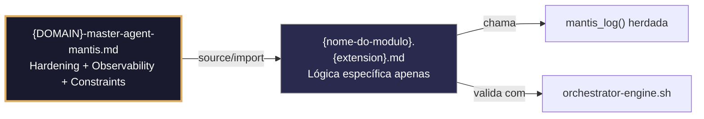

---
# ═══════════════════════════════════════════════════════════════
# 🧩 TEMPLATE DE MÓDULO – MANTIS AGENTIC v2.3.0-MODULAR
# ═══════════════════════════════════════════════════════════════
# ⚠️ USO OBRIGATÓRIO PARA ARTEFATOS FILHOS EM 7 DOMÍNIOS
# ═══════════════════════════════════════════════════════════════
#
# 📌 FILOSOFIA MODULAR (LEIA ANTES DE GERAR):
# 1. Este módulo NÃO é autocontido – depende do Master Agent {DOMAIN}-master-agent-mantis
# 2. Hardening, observability, thinking system e constraints vêm do Master via source/import
# 3. Este arquivo contém APENAS: frontmatter mínimo + propósito + lógica de domínio + testes
# 4. Use hidratação segmentada: bootstrap carrega Master OU fornece fallback mínimo
# 5. Zero redundância: não redefina o que já está no Master Agent
# ═══════════════════════════════════════════════════════════════

---
# 📜 FRONTMATTER MÍNIMO (C5 – Integridade Estrutural)
---
artifact_id: "{nome-do-modulo}"                          # Ex: audit-secrets-hook
artifact_type: "{domain}_utility|{domain}_hook|{domain}_pattern"
version: "1.0.0"
constraints_mapped: ["{C3}","{C8}"]                      # Apenas constraints ESPECÍFICAS deste módulo
validation_command: "bash 05-CONFIGURATIONS/validation/orchestrator-engine.sh --file {canonical_path} --json"
canonical_path: "06-PROGRAMMING/{DOMAIN}/{nome-do-modulo}.{extension}"
tier: 2
mode_selected: "B1"
prompt_hash: "sha256:{hash_especifico_deste_modulo}"
generated_at: "{ISO_8601_UTC}"
tenant_context: "obrigatorio|nao_aplicavel"
language: pt-BR
domain: "{DOMAIN}"
ai_navigation:
  read_first: false
  required_for: [{funcionalidade_especifica}]
  update_frequency: on-change
audience: ["{DOMAIN}-master-agent", "orchestrator-engine", "validation-hooks"]
status: "🟢 Novo"
next_review: "{+30d_ISO_8601}"
---

# {Título do Módulo em pt-BR}

> **Contrato modular**: Este artefato é filho do Master Agent `{DOMAIN}-master-agent-mantis`.
> Herda hardening, observability, thinking system e constraints via source/import.
> Contém APENAS a lógica de domínio específica para {funcionalidade}.

---

## 🎯 Propósito
{{Descrição concisa em 1-2 frases, em pt-BR. Ex: "Escanear arquivos em busca de padrões de secretos e emitir reportes JSONL, abortando pipelines se detectar credenciais críticas."}}

## 📋 Especificação (SDD – Apenas o Específico deste Módulo)
- **Entradas**: {{variáveis/argumentos específicos deste módulo}}
- **Saídas**: {{outputs estruturados específicos}}
- **Side Effects**: {{efeitos colaterais exclusivos desta funcionalidade}}
- **Constraints Aplicáveis**: {{apenas C3, C8, etc. – as que este módulo implementa diretamente}}
- **Dependências**: {{ferramentas/binários específicos necessários}}

---

## 🛡️ Bootstrap Resiliente + Lógica de Domínio (C3+C8)
> **Regra de ouro**: Fonte o Master Agent para herdar hardening/observability. Se não disponível, fallback mínimo.

{DOMAIN_SPECIFIC_BOOTSTRAP}

# ┌───────────────────────┬─────────────────────────────────────────┐
# │ DOMÍNIO               │ BOOTSTRAP MÍNIMO + LÓGICA               │
# ├───────────────────────┼─────────────────────────────────────────┤
# │ bash                  │ `if [[ -f "${MANTIS_ROOT:-.}/06-PROGRAMMING/bash/bash-master-agent.sh" ]]; then source ...; else set -Eeuo pipefail; mantis_log(){...}; fi` + lógica específica |
# │ python                │ `try: from mantis_master import mantis_log; except ImportError: def mantis_log(...): ...` + lógica específica |
# │ go                    │ `if master, import; else minimal mantisLog stub` + lógica específica |
# │ javascript            │ `try { require('mantis-master'); } catch { const mantisLog = (...) => {...}; }` + lógica específica |
# │ postgresql-pgvector   │ `DO $$ BEGIN IF EXISTS (SELECT 1 FROM pg_proc WHERE proname='mantis_log') THEN ... ELSE RAISE LOG minimal; END IF; END $$;` + lógica SQL específica |
# │ sql                   │ Similar a pgvector, sem operadores vetoriais |
# │ yaml-json-schema      │ Comentário indicando que validação vem do Master; schema específico do módulo |
# └───────────────────────┴─────────────────────────────────────────┘

### Exemplo Concreto: bash (audit-secrets-hook)
```bash
# Bootstrap: source Master OU fallback mínimo
if [[ -f "${MANTIS_ROOT:-.}/06-PROGRAMMING/bash/bash-master-agent.sh" ]]; then
  source "${MANTIS_ROOT:-.}/06-PROGRAMMING/bash/bash-master-agent.sh" --mode=observability-only
else
  set -Eeuo pipefail; shopt -s inherit_errexit 2>/dev/null || true
  trap 'exit 130' INT TERM
  if [[ "${TENANT_CONTEXT:-nao_aplicavel}" != "nao_aplicavel" ]]; then : "${TENANT_ID:?ERROR: TENANT_ID não definido.}"; fi
  mantis_log() { printf '{"ts":"%s","level":"%s","tenant":"%s","event":"%s","detail":"%s","fallback":"true"}\n' "$(date -u +%Y-%m-%dT%H:%M:%SZ)" "${1:-INFO}" "${TENANT_ID:-global}" "${2:-bootstrap_fallback}" "${3:-}" >&2; }
  mantis_log "WARN" "bootstrap_fallback" "Master agent não encontrado."
fi

# Variáveis específicas deste módulo
readonly TARGET="${1:?Uso: modulo.sh <path> [file|staged|dir]}"
readonly MODE="${2:-file}"

# Lógica de domínio ESPECÍFICA (ex: padrões de secrets para C3)
readonly SECRET_PATTERNS=("sk-[a-zA-Z0-9]{20,}" "AKIA[0-9A-Z]{16}" "ghp_[a-zA-Z0-9]{36}")

scan_file() {
  local file="$1" line=0 found=0
  while IFS= read -r line_content; do
    ((line++))
    for pattern in "${SECRET_PATTERNS[@]}"; do
      if echo "$line_content" | grep -qE "$pattern" 2>/dev/null; then
        printf '{"severity":"critical","rule":"C3_SECRET","file":"%s","line":%d,"pattern":"%s","timestamp":"%s"}\n' \
          "$file" "$line" "$pattern" "$(date -u +%Y-%m-%dT%H:%M:%SZ)"
        mantis_log "ERROR" "secret_found" "File=$file, Line=$line, Pattern=$pattern"  # ✅ C8: chama mantis_log herdada
        ((found++))
        break
      fi
    done
  done < "$file"
  return $found
}

# Execução principal
mantis_log "INFO" "scan_started" "Mode=$MODE, Target=$TARGET"  # ✅ C8
[[ -f "$TARGET" ]] && scan_file "$TARGET" && { mantis_log "INFO" "scan_completed_clean"; exit 0; } || { mantis_log "ERROR" "scan_aborted_findings"; exit 1; }
```

---

## 🧪 Testes Unitários (TDD – Apenas para a Lógica Específica)
```{DOMAIN_TEST_EXTENSION}
# Test: {nome_do_teste_especifico}
# Constraint: {C3|C8|etc.}

test_modulo_detecta_caso_especifico() {
  # Arrange
  local tmp; tmp=$(mktemp)
  echo '{input_especifico}' > "$tmp"
  
  # Act
  bash "${BASH_SOURCE[0]}" "$tmp" {args} 2>/dev/null
  
  # Assert
  [[ $? -eq {expected_exit_code} ]] && { rm -f "$tmp"; return 0; }
  rm -f "$tmp"; return 1
}

# Execução condicional de testes
if [[ "${1:-}" == "--test" ]]; then
  test_modulo_detecta_caso_especifico
  exit $?
fi
```

---

## 🔍 Validação (VDD – Comando Canônico)
```bash
# Validação via orchestrator-engine (herda checks do Master Agent)
bash 05-CONFIGURATIONS/validation/orchestrator-engine.sh \
  --file {canonical_path} \
  --json \
  --check-structural \
  --check-error-handling \
  --check-observability
```

---

## 🔗 Referências Cruzadas (Wikilinks Mínimos)
- [[{DOMAIN}-master-agent.md]] ← Fonte de hardening, observability, constraints
- [[/05-CONFIGURATIONS/validation/orchestrator-engine/main.go]] ← Motor de validação
- [[/05-CONFIGURATIONS/validation/norms-matrix.json]] ← Mapeamento constraints por rota
- [[/05-CONFIGURATIONS/observability/00-INDEX.md]] ← Infraestrutura de logs

---

## 📝 Histórico de Revisões
| Versão | Data | Autor | Mudança Principal | Constraints Afetadas |
|--------|------|-------|------------------|---------------------|
| 1.0.0 | {timestamp_utc} | {DOMAIN}-master-agent | Criação inicial: {funcionalidade_especifica} | {C3,C8} |

---
## 🔍 Observability (Documentación para IA – Apenas Eventos Específicos)
| Evento | Nível | Constraint | Exemplo de `detail` |
|--------|-------|------------|-------------------|
| `{evento_especifico_1}` | INFO | {C8} | `"{detail_exemplo_1}"` |
| `{evento_especifico_2}` | ERROR | {C3} | `"{detail_exemplo_2}"` |

### Validação de Schema V-LOG-02 (Helper Mínimo)
```{DOMAIN_VALIDATE_EXTENSION}
validate_vlog02() { {comando_minimo_de_validacao}; }
```
---
```

---

## 🗂️ TABELA DE INSTANCIAÇÃO POR DOMÍNIO (Minimalista)

| Placeholder | `bash` | `python` | `postgresql-pgvector` | `sql` |
|-------------|--------|----------|----------------------|-------|
| `{extension}` | `.sh.md` | `.py.md` | `.pgvector.md` | `.sql.md` |
| `{DOMAIN_SPECIFIC_BOOTSTRAP}` | `if [[ -f ... ]]; then source ...; else set -Eeuo pipefail; mantis_log(){...}; fi` | `try: from mantis_master import...; except: def mantis_log...` | `DO $$ BEGIN IF EXISTS (SELECT 1 FROM pg_proc WHERE proname='mantis_log') THEN ... ELSE RAISE LOG minimal; END IF; END $$;` | Similar a pgvector |
| `{DOMAIN_TEST_EXTENSION}` | `bash` | `python` | `sql` | `sql` |
| `{DOMAIN_VALIDATE_EXTENSION}` | `bash` | `python` | `sql` | `sql` |

---

## 📋 CHECKLIST DE GERAÇÃO (Módulo Filho)

1. ✅ Frontmatter mínimo com campos obrigatórios (C5)
2. ✅ Bootstrap que sourceia Master Agent OU fallback mínimo (C7)
3. ✅ Lógica de domínio ESPECÍFICA apenas – zero redundância com Master
4. ✅ Chamadas a `mantis_log()` herdada, não redefinida (C8)
5. ✅ Testes TDD para a funcionalidade específica
6. ✅ Wikilinks apontando para Master Agent e governança
7. ✅ Tabela de observabilidade documentando eventos específicos (para IA)

---

## 🔄 HIDRATAÇÃO SEGMENTADA DE CONTEXTO (Fluxo de Carga)



> **Regra**: O módulo NUNCA redefine o que está no Master. Apenas consome via source/import e implementa sua lógica específica.

