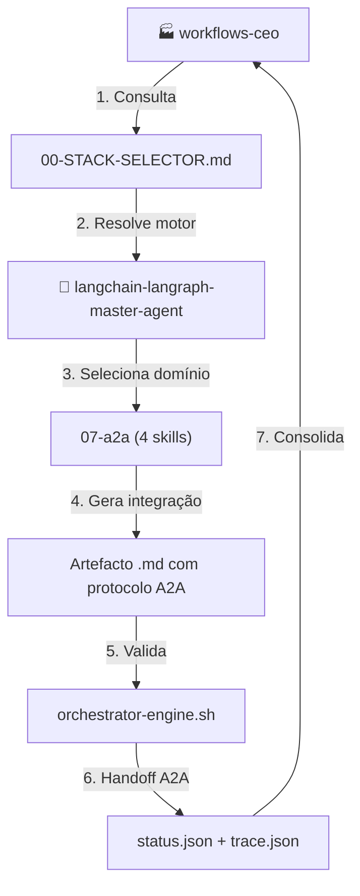
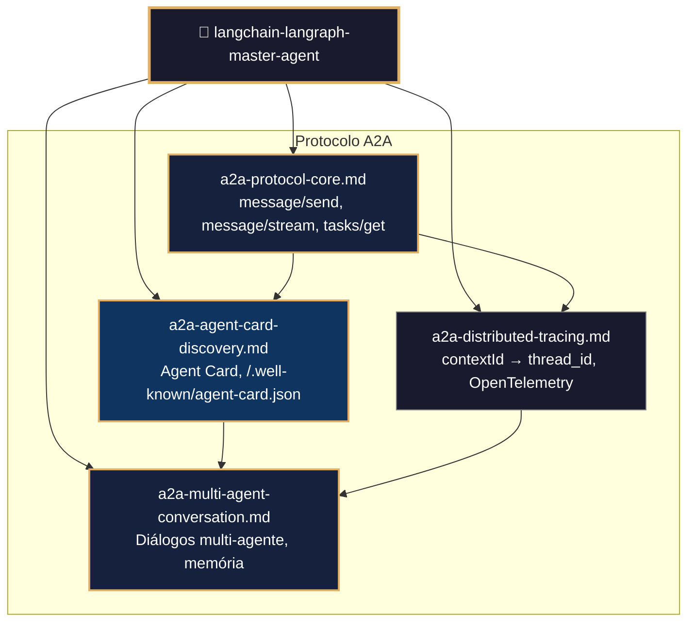
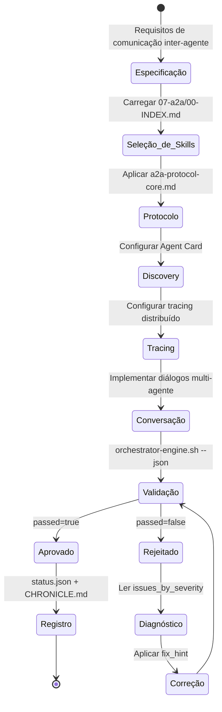
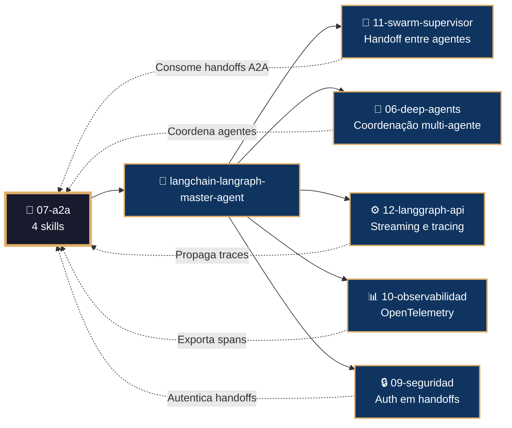

# 🔗 Procedimento Operacional Padrão — LangChain/LangGraph: A2A (Agent-to-Agent)

**Objetivo**: Estabelecer o fluxo de trabalho completo para implementação do protocolo de comunicação inter-agente (A2A), descoberta de agentes, tracing distribuído e conversas multi-agente usando as 4 skills do subdomínio `07-a2a` no ecossistema LangChain/LangGraph dentro de `04-WORKFLOWS/langchain-langraph/`.

**Público-alvo**: Arquitetos humanos, agentes mestres, engenheiros de integração, desenvolvedores de sistemas multi-agente, especialistas em protocolos.

---

## 1. Visão Geral do Subdomínio

O subdomínio `07-a2a` contém **4 skills** que implementam o protocolo Agent-to-Agent:

| # | Skill | Propósito |
|---|-------|-----------|
| 1 | `a2a-protocol-core.md` | Protocolo A2A: message/send, message/stream, tasks/get |
| 2 | `a2a-agent-card-discovery.md` | Descoberta de agentes via Agent Card |
| 3 | `a2a-distributed-tracing.md` | Tracing distribuído entre agentes |
| 4 | `a2a-multi-agent-conversation.md` | Conversas multi-agente com memória compartilhada |

### 1.1 Conexão com o Ecossistema `goals/`



---

## 2. Mapa de Skills e Inter-relações



---

## 3. Fluxo de Geração de Integração A2A



---

## 4. Conexão com Outros Domínios



---

## 5. Estrutura de Diretórios

```
04-WORKFLOWS/langchain-langraph/libs/07-a2a/
├── a2a-protocol-core.md              # JSON-RPC, cliente A2A
├── a2a-agent-card-discovery.md       # Agent Card, registro
├── a2a-distributed-tracing.md        # contextId → thread_id
└── a2a-multi-agent-conversation.md   # Simulação de diálogos
```

---

## 6. Exemplos de Código e Padrões

### 6.1 Cliente A2A Básico (a2a-protocol-core.md)

```python
import requests
import uuid

class A2AClient:
    def __init__(self, base_url: str):
        self.base_url = base_url

    def send_message(self, agent_id: str, message: dict) -> dict:
        payload = {
            "jsonrpc": "2.0",
            "method": "message/send",
            "params": {
                "agent_id": agent_id,
                "message": message,
                "context_id": str(uuid.uuid4())
            },
            "id": str(uuid.uuid4())
        }
        response = requests.post(f"{self.base_url}/a2a", json=payload)
        return response.json()

    def stream_message(self, agent_id: str, message: dict):
        payload = {
            "jsonrpc": "2.0",
            "method": "message/stream",
            "params": {
                "agent_id": agent_id,
                "message": message,
                "context_id": str(uuid.uuid4())
            },
            "id": str(uuid.uuid4())
        }
        with requests.post(f"{self.base_url}/a2a/stream", json=payload, stream=True) as r:
            for line in r.iter_lines():
                if line:
                    yield line
```

### 6.2 Agent Card Discovery (a2a-agent-card-discovery.md)

```python
class AgentCardDiscovery:
    @staticmethod
    def discover(url: str) -> dict:
        """Busca o Agent Card de um agente."""
        response = requests.get(f"{url}/.well-known/agent-card.json")
        response.raise_for_status()
        return response.json()

    @staticmethod
    def register_agent(registry_url: str, agent_card: dict) -> dict:
        """Registra um Agent Card no registry."""
        response = requests.post(f"{registry_url}/agents", json=agent_card)
        return response.json()

# Exemplo de Agent Card
agent_card = {
    "name": "Assistente de Viagens",
    "description": "Agente especialista em busca e reserva de voos e hotéis",
    "url": "https://api.meuapp.com/agent",
    "capabilities": ["search_flights", "book_flight", "search_hotels", "book_hotel"],
    "auth": {"type": "bearer_token"},
    "version": "1.0.0"
}
```

### 6.3 Tracing Distribuído (a2a-distributed-tracing.md)

```python
from opentelemetry import trace
from opentelemetry.trace.propagation.tracecontext import TraceContextTextMapPropagator

class DistributedTracingHandler:
    def __init__(self):
        self.propagator = TraceContextTextMapPropagator()
        self.tracer = trace.get_tracer(__name__)

    def inject_context(self, context_id: str) -> dict:
        """Injeta contexto de trace nos headers A2A."""
        with self.tracer.start_as_current_span("a2a_request") as span:
            span.set_attribute("a2a.context_id", context_id)
            headers = {}
            self.propagator.inject(headers)
            return headers

    def extract_context(self, headers: dict):
        """Extrai contexto de trace de headers recebidos."""
        return self.propagator.extract(headers)
```

### 6.4 Conversa Multi-Agente (a2a-multi-agent-conversation.md)

```python
class MultiAgentConversation:
    def __init__(self, agents: dict[str, A2AClient]):
        self.agents = agents
        self.history = []

    def simulate_dialogue(self, topic: str, rounds: int = 3) -> list:
        """Simula uma conversa entre múltiplos agentes."""
        context_id = str(uuid.uuid4())
        current_message = {"role": "user", "content": topic}

        for _ in range(rounds):
            for agent_name, client in self.agents.items():
                response = client.send_message(
                    agent_name,
                    {"messages": self.history + [current_message]}
                )
                self.history.append({
                    "agent": agent_name,
                    "message": response.get("result", {}).get("message")
                })
                current_message = self.history[-1]["message"]

        return self.history
```

---

## 7. Processo de Validação

### 7.1 Comandos de Validação por Artefacto

```bash
# Validação de skill individual
bash 05-CONFIGURATIONS/validation/orchestrator-engine.sh \
  --file 04-WORKFLOWS/langchain-langraph/libs/07-a2a/a2a-protocol-core.md \
  --json

# Validação completa do subdomínio 07-a2a
for f in 04-WORKFLOWS/langchain-langraph/libs/07-a2a/*.md; do
  bash 05-CONFIGURATIONS/validation/orchestrator-engine.sh --file "$f" --json
done
```

### 7.2 Checklist de Validação

| # | Verificação | Constraint | Comando | ✅ Esperado |
|---|---|---|---|---|
| 1 | Frontmatter YAML válido | C5 | `validate-frontmatter.sh` | passed=true |
| 2 | Bootstrap com mantis_log | C8 | `grep 'def mantis_log' <file>` | Encontrado |
| 3 | Testes TDD presentes | C5 | `grep 'def test_' <file>` | ≥3 testes |
| 4 | JSON-RPC schema válido | C5 | `jq empty` no payload | JSON válido |
| 5 | context_id propagado | C8 | `grep 'context_id' <file>` | UUID gerado |
| 6 | Tracing via OpenTelemetry | C8 | `grep 'trace\|span' <file>` | Configurado |
| 7 | Agent Card com capabilities | C5 | `grep 'capabilities' <file>` | Lista documentada |
| 8 | Sem secrets hardcoded | C3 | `audit-secrets.sh` | Zero violações |

---

## 8. Troubleshooting

| Sintoma | Causa Provável | Diagnóstico | Solução |
|---------|---------------|-------------|---------|
| `Agent Card não encontrado` | URL incorreta ou servidor offline | `curl /.well-known/agent-card.json` | Verificar endpoint |
| `context_id não propagado` | Headers de trace ausentes | `print(headers)` | Implementar inject_context |
| `Multi-agente sem resposta` | Timeout no cliente A2A | `client.send_message(..., timeout=30)` | Aumentar timeout |
| `Tracing quebrado` | OpenTelemetry não configurado | `opentelemetry-bootstrap` | Instalar e configurar |
| `JSON-RPC parse error` | Payload malformado | `jq . < payload.json` | Corrigir schema |
| `Handoff não reconhecido` | Agent ID não registrado | `GET /agents` | Registrar Agent Card |

---

## 9. Referências Cruzadas

- [[04-WORKFLOWS/langchain-langraph/langchain-langraph-master-agent.md]]
- [[04-WORKFLOWS/langchain-langraph/libs/07-a2a/a2a-protocol-core.md]]
- [[04-WORKFLOWS/langchain-langraph/libs/07-a2a/a2a-agent-card-discovery.md]]
- [[04-WORKFLOWS/langchain-langraph/libs/07-a2a/a2a-distributed-tracing.md]]
- [[04-WORKFLOWS/langchain-langraph/libs/07-a2a/a2a-multi-agent-conversation.md]]
- [[04-WORKFLOWS/workflows-ceo.md]]
- [[04-WORKFLOWS/00-STACK-SELECTOR.md]]
- [[05-CONFIGURATIONS/validation/orchestrator-engine.sh]]
- [[01-RULES/11-A2A-COMMUNICATION-RULES.md]]
- [[07-PROCEDURES/deep-agents-langchain-langraph-sop.md]]
- [[07-PROCEDURES/operations-langsmith-langchain-langraph-sop.md]]

---

> **Versão 2.3.0** | Procedimento Operacional Padrão do subdomínio `07-a2a` — MANTIS Agentic.
> Aplicável a partir de 2026-05-28.
