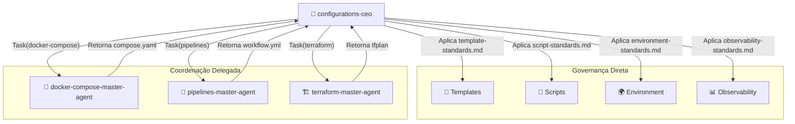
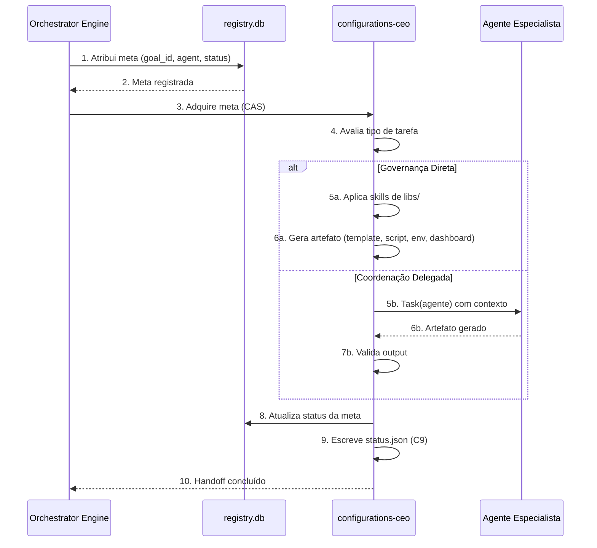
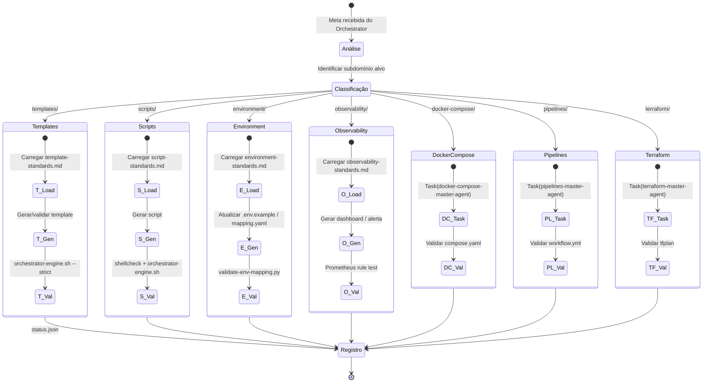
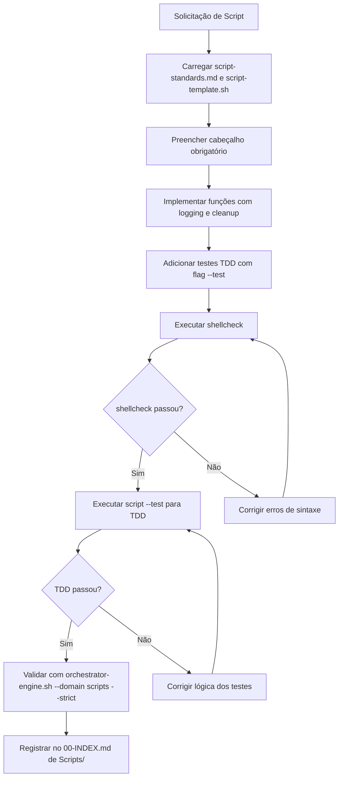
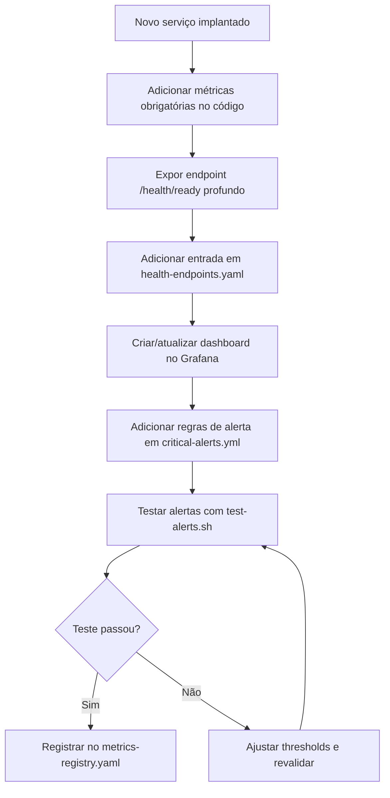
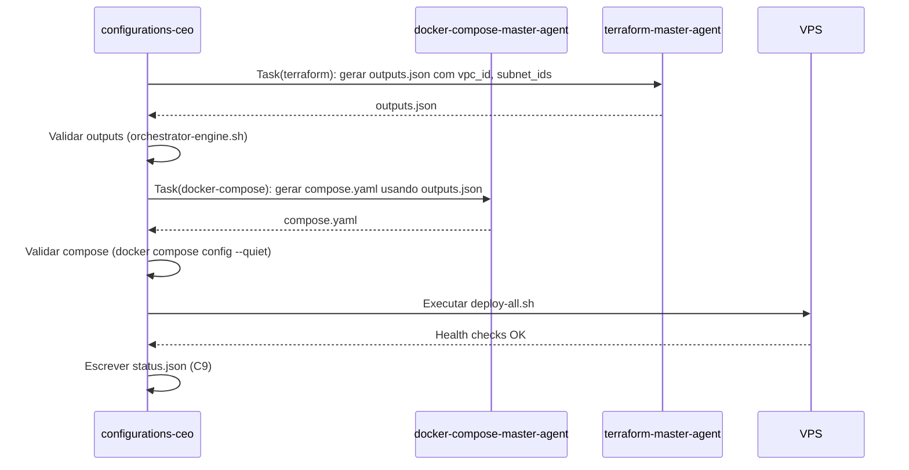
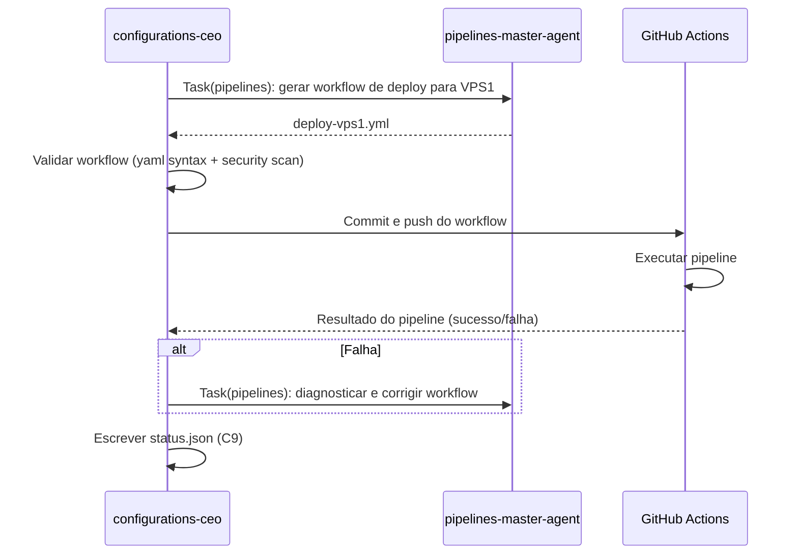
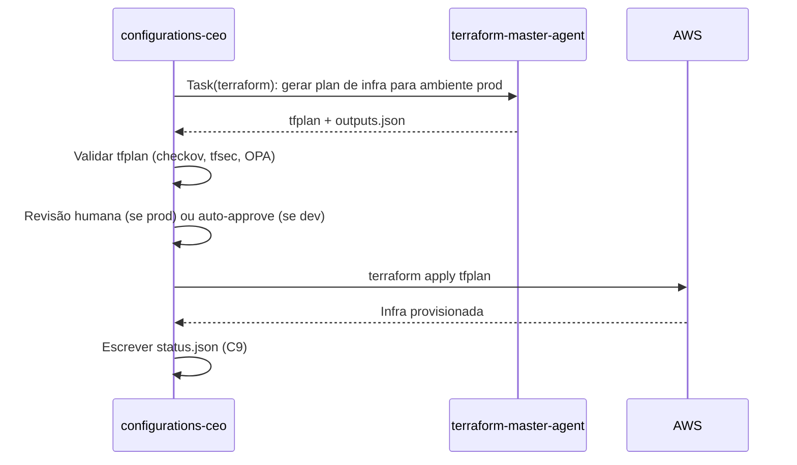
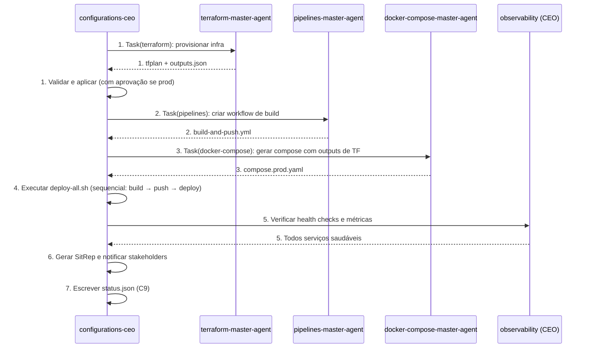

# 🏭 Procedimento Operacional Padrão — Configurations CEO (Fábrica de Produtos)

**Objetivo**: Estabelecer o fluxo completo de trabalho do `configurations-ceo`, abrangendo a governança direta dos subdomínios sem agente próprio (Templates, Scripts, Environment, Observability) e a coordenação dos agentes especialistas (Docker Compose, Pipelines, Terraform). Este SOP é a "fábrica" onde os produtos de configuração do ecossistema MANTIS são projetados, validados e entregues.

**Público-alvo**: Arquitetos humanos, DevOps, SREs, operadores de infraestrutura e todos os agentes mestres que interagem com o domínio `05-CONFIGURATIONS/`.

---

## 1. Visão Geral da Fábrica

O `configurations-ceo` atua em dois modos:

1. **Governança Direta**: Para subdomínios que **não possuem agente próprio** (Templates, Scripts, Environment, Observability), o CEO aplica as regras definidas nas skills de `libs/` e gera/valida os artefatos diretamente.

2. **Coordenação Delegada**: Para subdomínios que **possuem agente próprio** (Docker Compose, Pipelines, Terraform), o CEO prepara delegações usando o protocolo `Task()`, invoca o agente especialista e valida seus outputs.



---

## 2. Conexão com o Ecossistema `goals/`

Toda atividade do CEO é rastreada via `registry.db` e o contrato A2A (C9). O CEO recebe metas do Orchestrator Engine e as executa conforme o modo de operação.



---

## 3. Fluxo de Trabalho Geral do CEO



---

## 4. Governança Direta: Subdomínios sem Agente Próprio

### 4.1 Templates

**Objetivo**: Criar e manter templates versionados (Dockerfile, Compose, Terraform, dashboards) que sirvam como base imutável para os agentes especialistas.

```mermaid
graph TD
    A[Solicitação de Template] --> B{Existe template base?}
    B -->|Sim| C[Carregar template existente]
    B -->|Não| D[Criar novo template com cabeçalho padrão]
    C --> E[Personalizar via override, não modificação]
    D --> E
    E --> F[Validar com orchestrator-engine.sh --domain templates --strict]
    F --> G{Passou?}
    G -->|Sim| H[Registrar versão (semver) e atualizar CHANGELOG]
    G -->|Não| I[Corrigir desvios e revalidar]
    I --> F
    H --> J[Disponibilizar para agentes consumidores]
```

**Comandos de validação**:
```bash
# Validar template
bash orchestrator-engine.sh --domain templates --file Templates/novo-template.yml --strict

# Verificar versionamento semântico
grep -P 'version: "\d+\.\d+\.\d+"' Templates/novo-template.yml

# Verificar cabeçalho obrigatório
grep -q "artifact_id:" Templates/novo-template.yml && echo "✅" || echo "❌ Falta artifact_id"
```

---

### 4.2 Scripts

**Objetivo**: Produzir scripts bash padronizados, com logging, tratamento de erros e testes TDD integrados.



**Comandos de validação**:
```bash
# Validar com shellcheck
shellcheck Scripts/novo-script.sh

# Executar testes internos
bash Scripts/novo-script.sh --test

# Validar constraints
bash orchestrator-engine.sh --domain scripts --file Scripts/novo-script.sh --strict
```

---

### 4.3 Environment

**Objetivo**: Gerenciar variáveis de ambiente e secrets de forma centralizada e segura.

```mermaid
graph TD
    A[Nova variável necessária] --> B[Adicionar entrada em .env.example com tipo e descrição]
    B --> C[Adicionar entrada em mapping.yaml com consumers e validação]
    C --> D{É sensível?}
    D -->|Sim| E[Marcar sensitive: true e NUNCA commitar valor real]
    D -->|Não| F[Definir valor default em .env.dev]
    E --> G[Configurar no gestor de secrets (Vault/git-crypt)]
    F --> G
    G --> H[Executar validate-env-mapping.py]
    H --> I{Passou?}
    I -->|Sim| J[Notificar agentes consumidores da nova variável]
    I -->|Não| K[Corrigir mapping e revalidar]
    K --> H
```

**Comandos de validação**:
```bash
# Validar mapeamento
python3 Scripts/validate-env-mapping.py

# Verificar secrets expostos
grep -r "sensitive: true" Environment/mapping.yaml | while read line; do
  var=$(echo "$line" | cut -d: -f1)
  grep -q "^$var=.*[a-zA-Z0-9]" Environment/.env.example && echo "⚠️ $var tem valor real em .env.example"
done
```

---

### 4.4 Observability

**Objetivo**: Garantir que todos os serviços tenham métricas, dashboards e alertas configurados desde o dia um.



**Comandos de validação**:
```bash
# Testar health endpoint
curl -f http://localhost:4000/health/ready

# Testar regras de alerta
bash Scripts/test-alerts.sh --rule critical-alerts.yml

# Verificar métricas no Prometheus
curl -s "http://localhost:9090/api/v1/query?query=http_requests_total" | jq '.data.result | length'
```

---

## 5. Coordenação Delegada: Subdomínios com Agente Próprio

### 5.1 Docker Compose



**Protocolo de delegação**:
```yaml
Task(docker-compose-master-agent):
  prompt: "Gerar compose.yaml para VPS1 usando outputs de Terraform"
  context:
    - "05-CONFIGURATIONS/Terraform/envs/prod/outputs.json"
    - "05-CONFIGURATIONS/Environment/.env.prod"
    - "00-STACK-SELECTOR.md"
  expected_output:
    - "05-CONFIGURATIONS/docker-compose/vps1.yml"
  timeout_minutes: 20
```

---

### 5.2 Pipelines



**Protocolo de delegação**:
```yaml
Task(pipelines-master-agent):
  prompt: "Gerar workflow de deploy para VPS1 com stages: validate, plan, apply, health-check"
  context:
    - "05-CONFIGURATIONS/docker-compose/vps1.yml"
    - "05-CONFIGURATIONS/Environment/.env.prod"
    - "00-STACK-SELECTOR.md"
  expected_output:
    - ".github/workflows/deploy-vps1.yml"
  timeout_minutes: 25
```

---

### 5.3 Terraform



**Protocolo de delegação**:
```yaml
Task(terraform-master-agent):
  prompt: "Gerar plan de infraestrutura para prod com módulo VPS base e backend S3"
  context:
    - "05-CONFIGURATIONS/terraform/envs/prod/main.tf"
    - "05-CONFIGURATIONS/Environment/.env.prod"
    - "00-STACK-SELECTOR.md"
  expected_output:
    - "05-CONFIGURATIONS/terraform/envs/prod/tfplan"
    - "05-CONFIGURATIONS/terraform/envs/prod/outputs.json"
  timeout_minutes: 30
```

---

## 6. Orquestração Multi-Agente (Fluxo Completo)

Quando uma meta exige a participação de múltiplos agentes, o CEO orquestra o fluxo completo:



---

## 7. Normativas e Regras de Ouro

| Normativa | Descrição | Constraint |
|-----------|-----------|------------|
| **Versionamento Semântico** | Templates e scripts usam semver (MAJOR.MINOR.PATCH) | C1 |
| **Cabeçalho Obrigatório** | Todo artefato deve ter frontmatter YAML com `artifact_id`, `version`, `constraints_mapped` | C5 |
| **Mapping de Variáveis** | Toda variável de ambiente deve estar documentada em `.env.example` e mapeada em `mapping.yaml` | C3, C4 |
| **Protocolo Task()** | Toda delegação a agente especialista deve incluir `prompt`, `context`, `expected_output` e `timeout_minutes` | C6 |
| **Validação Pré-Commit** | `orchestrator-engine.sh --strict` deve passar antes de qualquer commit | C5 |
| **ADR para Decisões Críticas** | Mudanças estruturais devem ser documentadas em Architecture Decision Records | C6 |
| **Health Check Profundo** | Todo serviço deve expor `/health/ready` verificando dependências reais | C8 |
| **Rollback Automático** | Scripts de deploy devem incluir capacidade de rollback com verificação de saúde | C7 |

---

## 8. Troubleshooting

| Sintoma | Causa Provável | Diagnóstico | Solução |
|---------|---------------|-------------|---------|
| `Task()` retorna erro | Agente não encontrado ou timeout | `grep "agent_id" 00-STACK-SELECTOR.md` | Verificar se o agente está registrado; aumentar timeout |
| Template não passa validação | Cabeçalho YAML ausente ou versionamento incorreto | `orchestrator-engine.sh --file template.yml --json` | Adicionar frontmatter completo |
| Script falha em produção | `shellcheck` não foi executado ou `set -euo pipefail` ausente | `shellcheck script.sh` | Corrigir erros e revalidar |
| Variável não encontrada | Não está em `mapping.yaml` ou `.env.example` | `validate-env-mapping.py` | Adicionar entrada no mapping |
| Dashboard não mostra métricas | Prometheus não está scrapeando o serviço | `curl localhost:9090/api/v1/targets` | Verificar configuração do job no `prometheus.yml` |
| Deploy orquestrado falha na fase 3 | Dependência entre agentes não satisfeita | `orchestrator-engine.sh --resolve-deps` | Verificar outputs dos agentes anteriores |

---

## 9. Referências Cruzadas

- [[05-CONFIGURATIONS/configurations-ceo.md]] — CEO do domínio
- [[05-CONFIGURATIONS/libs/00-INDEX.md]] — Índice de skills de governança
- [[05-CONFIGURATIONS/docker-compose/docker-compose-master-agent.md]] — Agente Docker Compose
- [[05-CONFIGURATIONS/pipelines/pipelines-master-agent.md]] — Agente Pipelines
- [[05-CONFIGURATIONS/terraform/terraform-master-agent.md]] — Agente Terraform
- [[05-CONFIGURATIONS/validation/orchestrator-engine.sh]] — Motor de validação
- [[07-PROCEDURES/docker-compose-sop.md]] — SOP de Docker Compose
- [[07-PROCEDURES/pipelines-sop.md]] — SOP de Pipelines
- [[07-PROCEDURES/terraform-sop.md]] — SOP de Terraform
- [[goals/README.md]] — Sistema de metas
- [[01-RULES/harness-norms-v3.0.md]] — Hardening padrão
- [[01-RULES/11-A2A-COMMUNICATION-RULES.md]] — Contrato A2A (C9)

---

> **Versão 2.3.0** | Procedimento Operacional Padrão do CEO de Configurações — MANTIS Agentic.
> Aplicável a partir de 2026-05-24.
