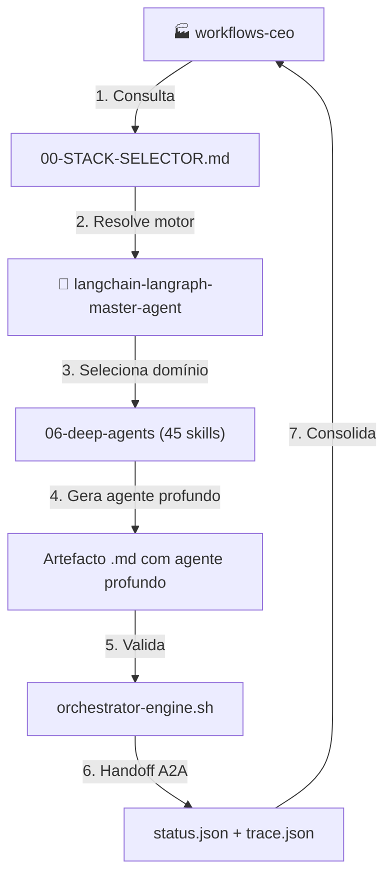
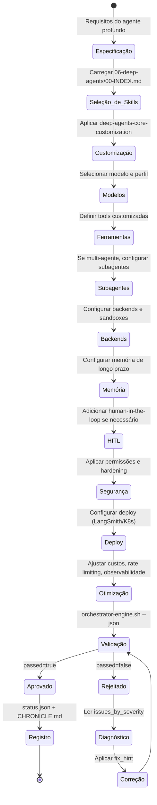
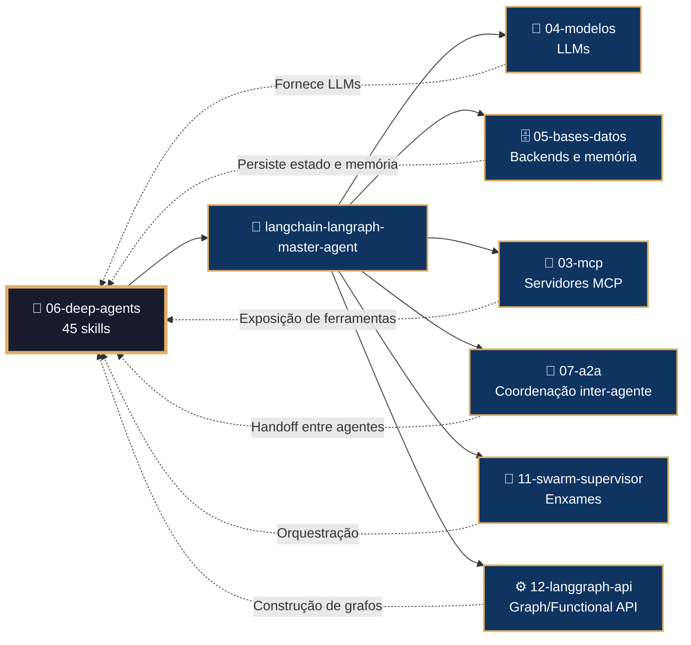

# 🧩 Procedimento Operacional Padrão — LangChain/LangGraph: Deep Agents

**Objetivo**: Estabelecer o fluxo de trabalho completo para criação, customização, orquestração e deploy de agentes profundos usando as 45 skills do subdomínio `06-deep-agents` no ecossistema LangChain/LangGraph dentro de `04-WORKFLOWS/langchain-langraph/`.

**Público-alvo**: Arquitetos humanos, agentes mestres, engenheiros de IA, desenvolvedores de agentes autônomos, especialistas em multi-agente.

---

## 1. Visão Geral do Subdomínio

O subdomínio `06-deep-agents` é o maior do ecossistema, com **45 skills** organizadas em 10 categorias:

| Categoria | Skills | Descrição |
|-----------|--------|-----------|
| **Customização e Fundamentos** | 5 | `create_deep_agent`, modelos, perfis, tools, middleware |
| **Subagentes e Orquestração** | 7 | Subagentes síncronos, avançados, compilados, assíncronos, planejamento, orquestração, coordenação |
| **Backends e Arquivos** | 7 | Backends (overview, filesystem, store, composite, custom), filesystem tools, sandboxes |
| **Permissões e Segurança** | 2 | Permissões declarativas, segurança |
| **Memória** | 4 | Longo prazo, escopos, consolidação, episódica |
| **Contexto e Streaming** | 3 | Context engineering, avançado, streaming events |
| **Intérpretes** | 2 | Core (QuickJS), avançado (PTC, recursive) |
| **HITL e Skills** | 2 | Human-in-the-loop, skills com SKILL.md |
| **Deploy e Operações** | 7 | Deploy LangSmith, Kubernetes, Managed API, MCP server, streaming, threads |
| **Testes e Otimização** | 6 | Testes, LangSmith, observabilidade, troubleshooting, custos, rate limiting |

### 1.1 Conexão com o Ecossistema `goals/`



---

## 2. Mapa de Skills e Inter-relações

```mermaid
graph TD
    MASTER["🦜 langchain-langraph-master-agent"]:::foundation

    subgraph "Customização e Fundamentos (5)"
        CORE["deep-agents-core-customization.md"]:::core
        MODEL_INT["deep-agents-model-integration.md"]:::core
        PROFILES["deep-agents-profiles.md"]:::core
        TOOLS_CUST["deep-agents-tools-custom.md"]:::core
        MIDDLEWARE_CUST["deep-agents-middleware-custom.md"]:::core
    end

    subgraph "Subagentes e Orquestração (7)"
        SUB_FUND["deep-agents-subagents-fundamentals.md"]:::orchestration
        SUB_ADV["deep-agents-subagents-advanced.md"]:::orchestration
        SUB_COMP["deep-agents-subagents-compiled.md"]:::orchestration
        ASYNC_SUB["deep-agents-async-subagents.md"]:::orchestration
        ORCH_PLAN["deep-agents-orchestration-planning.md"]:::orchestration
        ADV_ORCH["deep-agents-advanced-orchestration.md"]:::orchestration
        MULTI_COORD["deep-agents-multi-agent-coordination.md"]:::orchestration
    end

    subgraph "Backends e Arquivos (7)"
        BACK_OVER["deep-agents-backends-overview.md"]:::backend
        BACK_FS["deep-agents-backends-filesystem.md"]:::backend
        BACK_STORE["deep-agents-backends-store.md"]:::backend
        BACK_COMP["deep-agents-backends-composite.md"]:::backend
        CUST_BACK["deep-agents-custom-backends.md"]:::backend
        FS_TOOLS["deep-agents-filesystem-tools.md"]:::backend
        SANDBOX["deep-agents-sandboxes.md"]:::backend
    end

    subgraph "Permissões e Segurança (2)"
        PERM["deep-agents-permissions.md"]:::security
        SEC_BEST["deep-agents-security-best-practices.md"]:::security
    end

    subgraph "Memória (4)"
        MEM_LT["deep-agents-memory-long-term.md"]:::memory
        MEM_SCOPE["deep-agents-memory-scopes.md"]:::memory
        MEM_CONS["deep-agents-memory-consolidation.md"]:::memory
        EPISODIC["deep-agents-episodic-memory.md"]:::memory
    end

    subgraph "Contexto e Streaming (3)"
        CTX_ENG["deep-agents-context-engineering.md"]:::context
        CTX_ADV["deep-agents-context-advanced.md"]:::context
        STREAM_EV["deep-agents-streaming-events.md"]:::context
    end

    subgraph "Intérpretes (2)"
        INTERP_CORE["deep-agents-interpreters-core.md"]:::interpreter
        INTERP_ADV["deep-agents-interpreters-advanced.md"]:::interpreter
    end

    subgraph "HITL e Skills (2)"
        HITL["deep-agents-human-in-the-loop.md"]:::hitl
        SKILLS["deep-agents-skills.md"]:::hitl
    end

    subgraph "Deploy e Operações (7)"
        DEPLOY_PROD["deep-agents-deployment-production.md"]:::deploy
        K8S["deep-agents-kubernetes-deployment.md"]:::deploy
        MANAGED_API["deep-agents-managed-api.md"]:::deploy
        MCP_MGMT["deep-agents-mcp-server-management.md"]:::deploy
        STREAM_MGMT["deep-agents-streaming-managed.md"]:::deploy
        THREADS["deep-agents-threads-lifecycle.md"]:::deploy
        TEST_DEBUG["deep-agents-testing-debugging.md"]:::deploy
    end

    subgraph "Testes e Otimização (6)"
        LANG_INT["deep-agents-langsmith-integration.md"]:::quality
        OBS["deep-agents-observability.md"]:::quality
        TROUBLE["deep-agents-troubleshooting.md"]:::quality
        COST["deep-agents-cost-optimization.md"]:::quality
        RATE["deep-agents-rate-limiting.md"]:::quality
        PROD_CHECK["deep-agents-production-checklist.md"]:::quality
        BEST_PRAC["deep-agents-best-practices.md"]:::quality
        MIGRATE["deep-agents-migration-guide.md"]:::quality
        ACP["deep-agents-acp-integration.md"]:::quality
        ERR_HAND["deep-agents-error-handling.md"]:::quality
    end

    MASTER --> CORE
    MASTER --> ORCHESTRATION
    MASTER --> BACKEND
    MASTER --> SECURITY
    MASTER --> MEMORY
    MASTER --> CONTEXT
    MASTER --> INTERPRETER
    MASTER --> HITL
    MASTER --> DEPLOY
    MASTER --> QUALITY

    CORE --> ORCHESTRATION
    CORE --> BACKEND
    CORE --> MEMORY
    ORCHESTRATION --> MULTI_COORD
    BACKEND --> SANDBOX
    MEMORY --> CTX_ENG
    HITL --> SKILLS
    DEPLOY --> K8S
    DEPLOY --> MANAGED_API

    classDef foundation fill:#1a1a2e,color:#fff,stroke:#E0AF68,stroke-width:3px
    classDef core fill:#16213e,color:#fff,stroke:#E0AF68,stroke-width:2px
    classDef orchestration fill:#0f3460,color:#fff,stroke:#E0AF68,stroke-width:2px
    classDef backend fill:#1a1a2e,color:#fff,stroke:#7f7f7f,stroke-width:1px
    classDef security fill:#16213e,color:#fff,stroke:#E0AF68,stroke-width:2px
    classDef memory fill:#0f3460,color:#fff,stroke:#7f7f7f,stroke-width:1px
    classDef context fill:#1a1a2e,color:#fff,stroke:#E0AF68,stroke-width:2px
    classDef interpreter fill:#16213e,color:#fff,stroke:#7f7f7f,stroke-width:1px
    classDef hitl fill:#0f3460,color:#fff,stroke:#E0AF68,stroke-width:2px
    classDef deploy fill:#1a1a2e,color:#fff,stroke:#7f7f7f,stroke-width:1px
    classDef quality fill:#16213e,color:#fff,stroke:#E0AF68,stroke-width:2px

    class MASTER foundation
    class CORE,MODEL_INT,PROFILES,TOOLS_CUST,MIDDLEWARE_CUST core
    class SUB_FUND,SUB_ADV,SUB_COMP,ASYNC_SUB,ORCH_PLAN,ADV_ORCH,MULTI_COORD orchestration
    class BACK_OVER,BACK_FS,BACK_STORE,BACK_COMP,CUST_BACK,FS_TOOLS,SANDBOX backend
    class PERM,SEC_BEST security
    class MEM_LT,MEM_SCOPE,MEM_CONS,EPISODIC memory
    class CTX_ENG,CTX_ADV,STREAM_EV context
    class INTERP_CORE,INTERP_ADV interpreter
    class HITL,SKILLS hitl
    class DEPLOY_PROD,K8S,MANAGED_API,MCP_MGMT,STREAM_MGMT,THREADS,TEST_DEBUG deploy
    class LANG_INT,OBS,TROUBLE,COST,RATE,PROD_CHECK,BEST_PRAC,MIGRATE,ACP,ERR_HAND quality
```



---

## 3. Fluxo de Geração de Agente Profundo



---

## 4. Conexão com Outros Domínios



---

## 5. Estrutura de Diretórios

```
04-WORKFLOWS/langchain-langraph/libs/06-deep-agents/
├── deep-agents-core-customization.md       # create_deep_agent completo
├── deep-agents-model-integration.md        # init_chat_model, ChatOpenAI
├── deep-agents-profiles.md                 # HarnessProfile, ProviderProfile
├── deep-agents-tools-custom.md             # Ferramentas Pydantic
├── deep-agents-middleware-custom.md        # Middleware customizado
├── deep-agents-subagents-fundamentals.md   # Subagentes síncronos
├── deep-agents-subagents-advanced.md       # Subagentes avançados
├── deep-agents-subagents-compiled.md       # CompiledSubAgent
├── deep-agents-async-subagents.md          # Subagentes assíncronos
├── deep-agents-orchestration-planning.md   # TodoListMiddleware
├── deep-agents-advanced-orchestration.md   # Supervisor, pipeline, swarm
├── deep-agents-multi-agent-coordination.md # Coordenação com A2A
├── deep-agents-backends-overview.md        # Visão geral de backends
├── deep-agents-backends-filesystem.md      # FilesystemBackend
├── deep-agents-backends-store.md           # StoreBackend
├── deep-agents-backends-composite.md       # CompositeBackend
├── deep-agents-custom-backends.md          # S3, PostgreSQL
├── deep-agents-filesystem-tools.md         # ls, read, write, edit
├── deep-agents-sandboxes.md                # Modal, Daytona, Runloop
├── deep-agents-permissions.md              # FilesystemPermission
├── deep-agents-security-best-practices.md  # Prompt injection, rate limiting
├── deep-agents-memory-long-term.md         # AGENTS.md, StoreBackend
├── deep-agents-memory-scopes.md            # Namespaces
├── deep-agents-memory-consolidation.md     # Background consolidation
├── deep-agents-episodic-memory.md          # Busca em conversas
├── deep-agents-context-engineering.md      # SummarizationMiddleware
├── deep-agents-context-advanced.md         # Token trimming
├── deep-agents-streaming-events.md         # astream_events
├── deep-agents-interpreters-core.md        # QuickJS, CodeInterpreter
├── deep-agents-interpreters-advanced.md    # PTC, recursive
├── deep-agents-human-in-the-loop.md        # interrupt_on
├── deep-agents-skills.md                   # SKILL.md
├── deep-agents-deployment-production.md    # Deploy LangSmith
├── deep-agents-kubernetes-deployment.md    # Helm, HPA
├── deep-agents-managed-api.md              # REST API
├── deep-agents-mcp-server-management.md    # Registro MCP
├── deep-agents-streaming-managed.md        # SSE, values, updates
├── deep-agents-threads-lifecycle.md        # Criação, retenção
├── deep-agents-testing-debugging.md        # Mock, time travel
├── deep-agents-langsmith-integration.md    # Tracing, datasets
├── deep-agents-observability.md            # Prometheus, Grafana
├── deep-agents-troubleshooting.md          # Diagnóstico
├── deep-agents-cost-optimization.md        # Cache, two-tier
├── deep-agents-rate-limiting.md            # Por usuário, distribuído
├── deep-agents-production-checklist.md     # Verificações
├── deep-agents-best-practices.md           # Consolidadas
├── deep-agents-migration-guide.md          # 0.4.x → 0.5.x
├── deep-agents-acp-integration.md          # Agent Client Protocol
└── deep-agents-error-handling.md           # Retry, fallback
```

---

## 6. Exemplos de Código e Padrões

### 6.1 Agente Profundo com Subagente (deep-agents-core-customization.md)

```python
from langchain_deepagents import create_deep_agent
from langgraph.checkpoint.memory import InMemorySaver

pesquisador = create_deep_agent(
    model="gpt-4o",
    tools=[buscar_web, ler_arquivo],
    system_prompt="Você é um pesquisador especialista.",
    name="pesquisador"
)

supervisor = create_deep_agent(
    model="gpt-4o",
    subagents=[pesquisador],
    system_prompt="Você é um supervisor que delega tarefas.",
    backend=FilesystemBackend(virtual_mode=True)
)
```

### 6.2 Backend Customizado (deep-agents-custom-backends.md)

```python
from langchain_deepagents.backends import BackendProtocol

class S3Backend(BackendProtocol):
    def __init__(self, bucket: str):
        import boto3
        self.s3 = boto3.client("s3")
        self.bucket = bucket

    def read_file(self, path: str) -> str:
        obj = self.s3.get_object(Bucket=self.bucket, Key=path)
        return obj["Body"].read().decode("utf-8")

    def write_file(self, path: str, content: str) -> None:
        self.s3.put_object(Bucket=self.bucket, Key=path, Body=content.encode("utf-8"))
```

### 6.3 Intérprete com QuickJS (deep-agents-interpreters-core.md)

```python
from langchain_deepagents.middleware import CodeInterpreterMiddleware

agent = create_deep_agent(
    model="gpt-4o",
    middleware=[CodeInterpreterMiddleware()],
    system_prompt="Você pode executar código JavaScript."
)

# O agente pode usar eval() via QuickJS
```

### 6.4 Memória de Longo Prazo (deep-agents-memory-long-term.md)

```python
agent = create_deep_agent(
    model="gpt-4o",
    store=StoreBackend(
        namespace=("usuario", "memorias"),
        seed="O usuário prefere respostas concisas."
    )
)

# O agente lê e escreve em AGENTS.md automaticamente
```

### 6.5 HITL com interrupt_on (deep-agents-human-in-the-loop.md)

```python
agent = create_deep_agent(
    model="gpt-4o",
    interrupt_on={
        "before_tool": ["enviar_email", "deletar_arquivo"],
        "before_model": True
    }
)
```

### 6.6 Deploy Kubernetes (deep-agents-kubernetes-deployment.md)

```yaml
# values.yaml
agent:
  image: "meu-agente-profundo:latest"
  replicas: 3
  autoscaling:
    enabled: true
    minReplicas: 1
    maxReplicas: 10
  resources:
    requests:
      cpu: "1"
      memory: "2Gi"
```

---

## 7. Processo de Validação

### 7.1 Comandos de Validação por Artefacto

```bash
# Validação de skill individual
bash 05-CONFIGURATIONS/validation/orchestrator-engine.sh \
  --file 04-WORKFLOWS/langchain-langraph/libs/06-deep-agents/deep-agents-core-customization.md \
  --json

# Validação completa do subdomínio 06-deep-agents
for f in 04-WORKFLOWS/langchain-langraph/libs/06-deep-agents/*.md; do
  bash 05-CONFIGURATIONS/validation/orchestrator-engine.sh --file "$f" --json
done
```

### 7.2 Checklist de Validação

| # | Verificação | Constraint | Comando | ✅ Esperado |
|---|---|---|---|---|
| 1 | Frontmatter YAML válido | C5 | `validate-frontmatter.sh` | passed=true |
| 2 | Bootstrap com mantis_log | C8 | `grep 'def mantis_log' <file>` | Encontrado |
| 3 | Testes TDD presentes | C5 | `grep 'def test_' <file>` | ≥3 testes |
| 4 | API keys via env vars | C3 | `audit-secrets.sh` | Zero hardcoded |
| 5 | Subagentes declarados | C5 | `grep 'subagents' <file>` | Lista documentada |
| 6 | Backend configurado | C5 | `grep 'backend\|Backend' <file>` | Explícito |
| 7 | HITL configurado (se aplicável) | C7 | `grep 'interrupt_on' <file>` | Lista de tools |
| 8 | Permissões definidas | C3 | `grep 'Permission\|permission' <file>` | Presente |

---

## 8. Troubleshooting

| Sintoma | Causa Provável | Diagnóstico | Solução |
|---------|---------------|-------------|---------|
| `create_deep_agent não encontrado` | langchain-deepagents não instalado | `pip show langchain-deepagents` | `pip install langchain-deepagents` |
| `Subagente não responde` | Timeout ou loop infinito | `agent.get_state(config)` | Aumentar timeout ou adicionar max_steps |
| `Backend não acessível` | Permissões de arquivo/sistema | `ls -la /caminho/backend` | Verificar permissões ou usar virtual_mode |
| `Intérpreter falha` | QuickJS não instalado | `which quickjs` | Instalar QuickJS ou desabilitar intérprete |
| `Memória não persiste` | StoreBackend sem seed | `agent.store.get()` | Configurar seed e namespace |
| `HITL não pausa` | `interrupt_on` não configurado | `agent.config` | Adicionar `interrupt_on` na criação |
| `Deploy K8s falha` | Imagem não encontrada | `kubectl describe pod` | Verificar imagePullSecrets |
| `Custos elevados` | Modelo caro para tarefas simples | `agent.metrics` | Usar two-tier com modelos menores |

---

## 9. Referências Cruzadas

- [[04-WORKFLOWS/langchain-langraph/langchain-langraph-master-agent.md]]
- [[04-WORKFLOWS/langchain-langraph/libs/06-deep-agents/deep-agents-core-customization.md]]
- [[04-WORKFLOWS/langchain-langraph/libs/06-deep-agents/deep-agents-subagents-fundamentals.md]]
- [[04-WORKFLOWS/langchain-langraph/libs/06-deep-agents/deep-agents-backends-overview.md]]
- [[04-WORKFLOWS/langchain-langraph/libs/06-deep-agents/deep-agents-human-in-the-loop.md]]
- [[04-WORKFLOWS/langchain-langraph/libs/06-deep-agents/deep-agents-deployment-production.md]]
- [[04-WORKFLOWS/langchain-langraph/libs/06-deep-agents/deep-agents-best-practices.md]]
- [[04-WORKFLOWS/workflows-ceo.md]]
- [[04-WORKFLOWS/00-STACK-SELECTOR.md]]
- [[05-CONFIGURATIONS/validation/orchestrator-engine.sh]]
- [[07-PROCEDURES/base-datos-langchain-langraph-sop.md]]
- [[07-PROCEDURES/a2a-langsmith-langchain-langraph-sop.md]]

---

> **Versão 2.3.0** | Procedimento Operacional Padrão do subdomínio `06-deep-agents` — MANTIS Agentic.
> Aplicável a partir de 2026-05-28.
